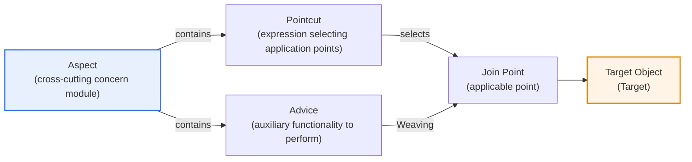
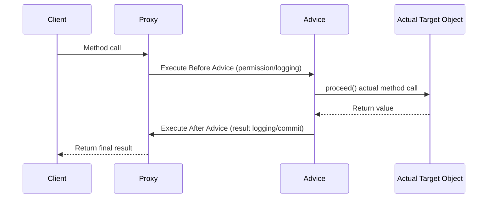

# AOP (Aspect Oriented Programming)

## 1. Overview

### A. Definition
> A programming paradigm that **separates cross-cutting concerns — such as logging, security, and transactions, which recur across multiple modules — into independent modules called Aspects**, and automatically weaves them into specific points (Join Points) of the execution flow (Weaving), thereby separating core logic from auxiliary functionality. It does not replace object-oriented programming (OOP) but complements it.

The core idea of AOP is to '**gather scattered, repeated common functionality into one place**.' No matter how well you design with object orientation, functions like logging, authentication, transactions, performance measurement, and exception handling must be inserted identically into almost every method. Putting this code directly into each method buries the core business logic under auxiliary code, hurting readability; and later, changing even a single logging approach means fixing hundreds of places one by one. This goes beyond mere inconvenience and leads to defects from missed changes (for example, an incident where data consistency breaks because a transaction is missing on only one particular service method).

AOP solves this problem by **extracting cross-cutting concerns into separate modules called Aspects** and automatically inserting them at specific points in the target code — at the desired time during compilation, class loading, or runtime. As a result, the core logic is left with pure business code and becomes clean, while common functionality is managed in one place and is easy to change. Representatively, the Spring framework, with just the single annotation `@Transactional`, automatically weaves transaction begin/commit/rollback code before and after method execution — this is precisely declarative transaction handling using AOP. Developers do not code the transaction boundary by hand every time; they merely declare "this method is subject to a transaction."

### B. Background and Necessity
Object orientation separates functionality well into vertical units called classes. However, **auxiliary functionality that is commonly needed across many classes — such as logging, security, and transactions — belongs fully to no single class**. Forcing such functionality through inheritance or utility calls produces two chronic problems: code duplication (Code Scattering) and entanglement of concerns (Code Tangling). Code scattering is the phenomenon of the same logging code being spread across hundreds of methods, and concern tangling is the phenomenon of business logic, logging, and security checks being mixed together within a single method.

AOP was proposed in 1997 by Gregor Kiczales's research team at Xerox PARC (Palo Alto Research Center), and it subsequently took firm hold in practice through AspectJ and Spring AOP in the Java camp. In other words, AOP emerged as a complementary paradigm to fill object orientation's "modularization blind spot," and today it has become the core technology underpinning transactions, security, and monitoring in enterprise frameworks.

### C. Characteristics
AOP is characterized by ① **modularization** of cross-cutting concerns, ② **separation of concerns (SoC)** between core logic and auxiliary functionality, and ③ **non-invasiveness**, applying auxiliary functionality in a declarative manner. In particular, Spring AOP applies auxiliary functionality by wrapping the target code in a proxy without modifying it directly, so common functionality can be added or removed without touching existing business code.

## 2. Core Components

To understand AOP, you must know how five core concepts interlock. The overall structure diagram below shows the relationships among these concepts, and the detailed flow diagram that follows shows how Advice intervenes at the actual moment of a method call.

An **Aspect** is a unit that modularizes a cross-cutting concern, holding within it both "what to do (Advice)" and "where to apply it (Pointcut)." **Advice** is the auxiliary functionality code that the Aspect actually performs, and it is divided into several kinds according to execution timing. A **Join Point** is any candidate point in program execution where Advice can intervene (method call, exception occurrence, etc.), and a **Pointcut** is the expression that selects from among those many candidates the points where it will actually apply. **Weaving** is the process of actually weaving the Aspect into these selected points.

| Component | Role | Example |
|---|---|---|
| **Aspect** | Module gathering cross-cutting concerns | `LoggingAspect`, `TxAspect` |
| **Advice** | The auxiliary functionality actually performed | Log recording before/after a method |
| **Join Point** | Point where Advice can be applied | Method execution, exception handling |
| **Pointcut** | Expression selecting the Join Points to apply | `execution(* service..*(..))` |
| **Weaving** | Process of weaving the Aspect into the target | Compile-, load-, runtime weaving |
| **Target** | The target object to which Advice is applied | The actual business bean |

### A. Kinds of Advice — Differences Made by Execution Timing
Advice is divided by which point of the target method it intervenes at, and this choice is very important in practice. **Before** runs just before method execution (e.g., permission check), **After Returning** runs right after a normal return (e.g., result logging), **After Throwing** runs when an exception occurs (e.g., error notification), **After (finally)** always runs regardless of success or failure, and **Around** wraps both before and after method execution to control the execution itself (e.g., measuring execution time, caching, retry).

Of these, Around is the most powerful but correspondingly the most dangerous. Because Around directly decides even whether the target method is invoked, if the developer omits the `proceed()` call, a defect arises in which the core logic itself is not executed. Therefore, the principle is to choose according to purpose — Before/After for simple logging, and Around for transactions and caching where control of the execution flow is essential.

### B. Weaving Timing — Trade-offs of Three Approaches
Depending on when weaving is done, the AspectJ family uses compile-time weaving (CTW) and load-time weaving (LTW), while Spring AOP uses runtime weaving. The detailed flow diagram below shows the process, in runtime proxy-based weaving, by which a client call passes through the proxy to Advice and then to the actual method.

Compile-time weaving writes the Aspect directly in during the source/bytecode compilation stage, giving the best runtime performance but requiring a dedicated compiler (ajc). Load-time weaving transforms the bytecode at the moment the class is loaded into the JVM, which is flexible but requires a separate agent setup. Runtime weaving wraps the object in a proxy, so setup is simple and it works with pure Java alone, but there is call overhead from going through the proxy, and due to the nature of the proxy it has the limitation that **Advice is not applied when a method within the same object directly calls its own method (self-invocation)**. In fact, the famous pitfall in Spring where a transaction is not applied when a `@Transactional` method is called directly by another method of the same class originates here.

## 3. Expected Effects and Application Cases

The effect of AOP goes beyond "the code becomes cleaner" to appear as a quantitative gain. For example, putting transaction, logging, and permission-check code into each of 100 service methods duplicates hundreds of lines of auxiliary code alone; but separating them with AOP handles the same functionality with 3 Aspects (a few dozen lines) while the auxiliary code disappears entirely from the core methods. When changing a logging policy, the places to fix also shrink from hundreds to just 1 (that one Aspect).

| Effect | Content | Practical Implication |
|---|---|---|
| **Separation of Concerns (SoC)** | Separate core logic from auxiliary functionality | Improved readability and focus of business code |
| **Deduplication/Reuse** | Manage common functionality in one place | Reduce change points from hundreds to 1 |
| **Maintainability** | Modify only the Aspect when changing auxiliary functionality | Prevent defects from missed changes |
| **Non-invasiveness** | Apply/remove without modifying target code | Gradual application even to legacy systems |

Looking at actual industry application, financial core-banking systems apply transactions and audit logs (who inquired/changed what, and when) uniformly to all transaction services via AOP, thereby securing the traceability required by regulation (the Regulation on Supervision of Electronic Financial Transactions). Large commerce platforms use AOP to measure API response times per point to monitor bottlenecks, and declaratively add caching and retry logic to specific methods to increase fault tolerance. Furthermore, in microservices, an idea similar to AOP has been extended into the service mesh (sidecar proxy), handling authentication, traffic control, and observability cross-cuttingly outside the application code.

### A. Choosing Between Spring AOP and AspectJ
A decision often faced in practice is "Is Spring AOP enough, or do we need to go all the way to AspectJ?" Both technologies implement the same AOP concepts but differ in scope and method of application. Spring AOP targets **only the method-execution Join Points** of beans managed by the Spring container and works via runtime proxies. Its setup is simple and it needs no separate compiler, so this is sufficient for most enterprise applications.

AspectJ, on the other hand, supports **a much wider range of Join Points** — field access, constructor calls, static initialization, and so on — and, via compile/load-time weaving, writes directly into the bytecode without a proxy. Therefore, when you must apply Aspects even to ordinary objects that are not Spring beans, or when you must avoid the proxy overhead and self-invocation limitation in high-performance, fine-grained control situations, AspectJ is appropriate. In summary, the selection criterion is: Spring AOP for "common functionality at the method level of managed beans," and AspectJ for "comprehensive, fine-grained weaving that crosses that boundary."

| Category | Spring AOP | AspectJ |
|---|---|---|
| **Join Point scope** | Method execution of Spring beans | Broad: methods, fields, constructors, etc. |
| **Weaving method** | Runtime proxy | Compile/load-time bytecode |
| **Performance** | Proxy-call overhead | Superior, no proxy |
| **Application difficulty** | Simple (pure Java) | Requires dedicated compiler/agent |
| **Suitable situation** | General enterprise common functionality | Fine-grained, comprehensive weaving; high performance |

## 4. OOP vs. AOP Comparison

AOP does not conflict with OOP; the two handle modularization on different axes. Where OOP encapsulates data and functionality vertically, AOP modularizes concerns that horizontally cut across multiple objects. Because of this difference, the two are not competitors but companions, and in practice the standard is a combination of designing the domain with OOP and layering cross-cutting concerns with AOP.

| Category | OOP | AOP |
|---|---|---|
| **Modularization axis** | Vertical (class/inheritance) | Horizontal (cross-cutting concerns) |
| **Main concern** | Core domain logic | Common functionality: logging, security, transactions, etc. |
| **Unit of separation** | Class/object | Aspect |
| **Relationship** | Foundational paradigm | Complement to OOP |

## 5. Deep Dive — Extension in Modern Architecture and Exam Strategy

The concept of AOP is not confined to the inside of frameworks; it is expanding into modern cloud-native architecture. Representatively, a **service mesh (e.g., Istio, Linkerd)** attaches a sidecar proxy (Envoy) beside each service to handle authentication (mTLS), retry, circuit breaking, and distributed tracing outside the application code. In that it "separates cross-cutting concerns from code and weaves them at the infrastructure layer," this can be seen as raising the idea of AOP to the network level. In addition, the auto-instrumentation of OpenTelemetry, the observability standard, shares a technical root with AOP in that it inserts tracing code into methods via bytecode-weaving techniques.

From the perspective of the professional engineer exam, AOP is a regular topic in the "software engineering/frameworks" domain and may appear not only as a standalone short answer but also in combination with Spring transactions, clean architecture, and microservice observability. When composing an answer, you can demonstrate depth by developing it hierarchically: ① definition and background (code scattering/tangling problem), ② the five core components and a diagram, ③ trade-offs of Advice kinds and weaving timing, ④ Spring practical application (declarative transactions) and the self-invocation pitfall, and ⑤ extension to the service mesh. In particular, for variant questions asking about "the limits or cautions of AOP," presenting the proxy overhead, debugging difficulty, and self-invocation pitfall with supporting reasoning is the high-scoring point.

## 6. Considerations and Implications

1. **Position it as a complement to OOP.** AOP does not replace object orientation but complements it by handling cross-cutting concerns that object orientation cannot address. Therefore, keeping the division-of-roles principle — domain design with OOP, common functionality with AOP — helps avoid overuse.
2. **Prepare for the difficulty of debugging and tracing.** Because functionality not written in the code intervenes at execution time, tracing the flow is difficult. Define Pointcut expressions clearly and narrowly, and document and verify (test) which Aspect applies where to control "hidden side effects."
3. **Judge the trade-off between performance and application method.** Runtime proxy weaving is simple to set up but has call overhead and the self-invocation limitation, while compile/load-time weaving performs well but raises build/deployment complexity. Choose the weaving method by weighing the system's performance requirements against operational convenience.
4. **Beware excessive application (Aspect overuse).** Extracting everything into Aspects, on the contrary, makes the execution flow opaque and maintenance difficult. Restraint is needed, limiting application to truly cross-cutting concerns such as logging, transactions, security, and auditing.
5. **Connect it to the evolution toward cloud-native.** AOP's separation-of-concerns philosophy is expanding into the infrastructure layer via the service mesh, OpenTelemetry auto-instrumentation, and so on, so a perspective is required that combines application-level AOP with infrastructure-layer cross-cutting handling to design separation of concerns across the whole architecture.

## References
- Spring Framework Reference — Aspect Oriented Programming with Spring: https://docs.spring.io/spring-framework/reference/core/aop.html
- The AspectJ Programming Guide (Eclipse): https://eclipse.dev/aspectj/doc/latest/progguide/index.html

---

> **In one line**: AOP is a paradigm that *separates cross-cutting concerns such as logging, security, and transactions into Aspects* and weaves them at execution points (Join Points); it consists of Aspect, Advice, Pointcut, Join Point, and Weaving, complements OOP to raise code clarity and maintainability, and extends into cloud-native forms such as the service mesh.
