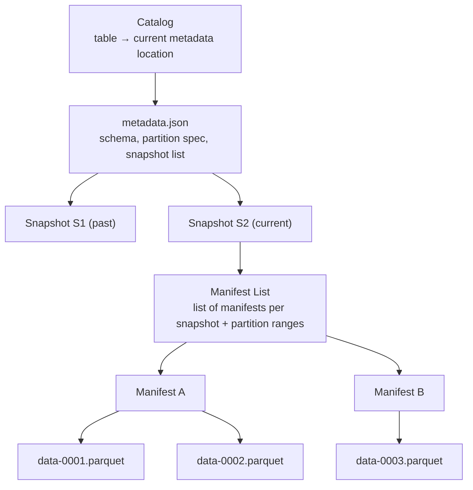
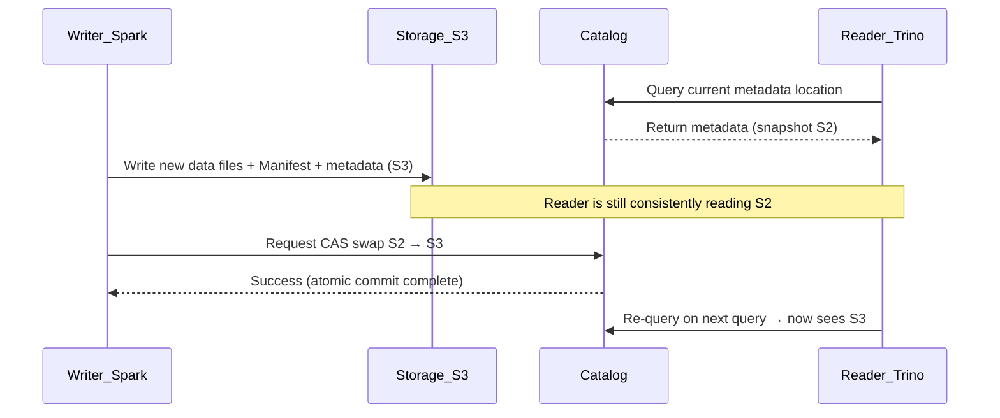

# Open Table Format (Apache Iceberg)

## 1. Overview

> **Definition**: Apache Iceberg is an **open table format** for large-scale analytical datasets. It is a metadata specification that endows a set of files on object storage (S3, HDFS, GCS, etc.) with **the semantics of a relational table (ACID transactions, schema evolution, time travel)**. It is not the data files themselves but a **standard for the metadata layer** that describes "which files constitute the table at a particular point in time."

Data lakes spread rapidly thanks to the advantage of being able to load raw data as-is onto inexpensive object storage, but early data lakes were, in effect, no more than "bundles of files piled into directories." Representatively, Hive tables **treated directory paths (e.g., `/sales/dt=2026-09-19/`) as partitions**, and this structure carried three fundamental limitations. First, to determine the list of files you had to recursively list (LIST) the storage directories, so once files grew to the millions, query planning itself became a bottleneck. Second, when multiple jobs wrote to the same table concurrently, partially updated files were exposed as-is, so **atomicity was not guaranteed** (a reader could see a half-written result). Third, changing the partition columns or the schema required rewriting the data entirely.

Apache Iceberg was developed internally by Netflix in 2017 to solve this "lack of reliability in data lakes"; it was donated to the Apache Foundation in 2018 and became a Top-Level Project in 2020. The core idea is to **replace directory listing with tracking of metadata files**. By explicitly managing, as metadata, the list of all data files that constitute the table along with their statistics, it determines which files to read using only a metadata lookup rather than O(number of files) storage listing. This made data lakes the storage foundation of the **Lakehouse**, which equips them with warehouse-level transactionality and performance.

The context in which Netflix hit this problem is instructive. At the time, Netflix operated tens of petabytes of data on S3 as Hive tables, and even a simple query inquiring about a particular partition of a single large table took minutes just to plan, due to millions of LIST/GET calls against S3, and incidents recurred in which incorrect results flowed into analysis because concurrent writes lacked atomicity. Iceberg solved this fundamentally with a shift in perspective: "Don't make the query engine rummage through storage; let the metadata already hold the answer." This is equivalent to transplanting the role that a database's index and catalog played into a file-based data lake.

Iceberg's characteristics can be summarized as follows: **engine neutrality** (multiple engines such as Spark, Trino, Flink, Snowflake, and Dremio share the same table), **file-format neutrality** (supports Parquet, ORC, Avro), **storage neutrality** (records file paths as absolute paths in metadata so it is not dependent on directory structure), and serializable-level consistency through **snapshot-based isolation**.

In sum, the core proposition Iceberg solved is "retaining the scalability and economy of cheap object storage while recovering the reliability of transactions, schema management, and point-in-time queries that relational databases provided." This proposition is an essential task to solve in modern data platforms, where data is exploding and analytics/AI demands are diversifying — which is why Iceberg has become an essential subject of review in data architecture design from the professional engineer's perspective.

## 2. Overall Structure and the Metadata Layer

An Iceberg table has a hierarchical pointer structure that runs **catalog → metadata file → manifest list → manifest → data files**. This multi-layer structure is the very mechanism that produces Iceberg's performance and transactionality. Each layer references the one below via immutable pointers, sharing the principle that any change is reflected by creating new files and swapping only the topmost pointer. This "writes are always appends; the transition is a pointer swap" principle binds the atomicity, isolation, and time travel described below into one coherent mechanism.

The **Catalog** is the topmost pointer that maps a table name to the location of the currently valid `metadata.json`. Transaction atomicity is guaranteed at exactly this point. A write job prepares both the new data files and the new metadata, then **at the last moment atomically swaps (compare-and-swap) the catalog's pointer from the old metadata to the new metadata**. Before this swap succeeds, no reader sees the new data, and the moment it succeeds, the entire change becomes visible at once. Catalog implementations include Hive Metastore, AWS Glue, JDBC, Nessie, and the **REST Catalog** standardized in 2024; the REST Catalog decouples the engine and the catalog via an HTTP protocol, greatly increasing interoperability.

The **metadata file (metadata.json)** holds the table's current schema, partition spec, sort order, and a list of all snapshots created so far. Each snapshot represents the complete state of the table at a particular point in time, and this snapshot history is the basis for time travel and rollback.

The **Manifest List** is a list of the manifest files that constitute a single snapshot, storing along with each manifest the **range (lower/upper bound) of partition values** it covers. Thanks to this, a query engine can skip an entire irrelevant manifest based on the partition range alone, before even opening the manifest.

A **Manifest** holds a list of the actual data files and, for each file, its **per-column statistics (min/max values, null count, record count)**. These file-level statistics are the heart of Iceberg's performance; the engine removes (file pruning) files that cannot possibly satisfy a condition like `WHERE price > 1000` based on the statistics alone.

## 3. Core Features and Operating Principles

### A. Hidden Partitioning

In traditional Hive tables, the user had to physically be aware of the partition columns and specify them explicitly in the query. For example, to make a date partition from an event timestamp, you had to maintain a separate `event_date` column and put the partition column directly into the condition in the query, as in `WHERE event_date = '2026-09-19'`, for partition pruning to work. If the user mistakenly wrote only `WHERE event_time BETWEEN ...`, the partition was missed and a full scan occurred — a common and fatal pitfall.

Iceberg's **hidden partitioning** defines a partition as a **transform function** over a source column. When you declare something like `days(event_time)`, `bucket(16, user_id)`, or `truncate(10, zipcode)`, Iceberg automatically computes the partition value on write and records it in the metadata; on read, even if the user filters only by the source column (`event_time`), the engine knows the transform relationship and applies partition pruning on its own. That is, the **existence of the partition becomes transparent (hidden) to the user**, and it structurally prevents incidents where performance collapses from misusing the partition column. In practice, partitioning a large log table by `days(ts)` yields the effect of, when querying one day, scanning only that day's files out of thousands, reducing response time from tens of minutes to a few seconds.

Another benefit of this design is that it **eliminates the redundant storage of the partition column**. The Hive approach had to physically store and maintain a separate `event_date` column in addition to the source timestamp to hold the partition value, and if this derived column diverged from the source it led to data-quality incidents. Iceberg declares only the transform expression in the metadata, so the derived column is unnecessary, and even evolving the partition definition (e.g., `days`→`hours`) touches none of the stored data. This is a shift in thinking that abstracts partitioning from a "physical directory layout" into a "logical indexing rule," and it can be called the data-lake realization of **physical data independence**, where the user gets optimal performance without knowing the physical storage structure.

### B. Schema/Partition Evolution

Iceberg **tracks columns by a unique ID, not by name**. Thanks to this design, adding, deleting, renaming, reordering, and widening the type of columns (e.g., int→long) can be performed safely by **changing only the metadata without rewriting the data files**. For example, even when you rename a column, its ID stays the same, so the mapping to past data files is not broken. Conversely, because Hive mapped columns by position (ordinal), deleting a column in the middle frequently caused incidents where the data of subsequent columns shifted and was read incorrectly.

**Partition evolution** goes one step further. When data grows and you need to change the partition strategy from `days` to `hours`, Iceberg **adds a new partition spec without rewriting the existing data**. Only data written thereafter follows the new spec, and the manifest records which partition spec each file was written with, so queries work correctly even when files with different partitioning coexist in a single table. This is a huge operational advantage, allowing the partition strategy of a petabyte-scale table to be changed with no downtime.

The reason this evolution capability matters is the reality that a data model **inevitably changes over time**. As a business grows, daily partitions make files too large, new regulations require adding columns, and a poorly designed type must be widened. In a traditional data lake, each such change meant hours-to-days of full-rewrite batches and service outages during them, but Iceberg **demotes these to metadata transactions**, making it possible to "refactor the data model incrementally, as if it were code." This is what elevates Iceberg from a mere file format to a management framework for long-lived tables.

### C. Snapshot Isolation, Time Travel, and Rollback

The snapshot structure described above naturally provides **serializable isolation**. A reader consistently reads the snapshot as of the query's start time all the way through, and a writer merely creates a new snapshot and swaps the catalog pointer, never corrupting the existing snapshot. Thus reads and writes do not block each other (similar to MVCC).

This snapshot history connects directly to **time travel** and **rollback**. You can query a table as of a past point in time exactly, as in `SELECT * FROM tbl FOR TIMESTAMP AS OF '2026-09-18 00:00:00'`, or immediately roll back a bad batch load to a previous snapshot. A representative use is a case where, when a nightly ETL loaded incorrect data, it was recovered to a normal state within seconds using `rollback_to_snapshot`, without a backup restore.

Time travel goes beyond a mere convenience feature to solve **data reproducibility**, a long-standing hard problem in data engineering. For example, if you pin the state of the data at the time a machine learning model was trained by its snapshot ID, then even months later you can reproduce the experiment with exactly the same training data, or separate out whether a model's performance decline is due to data change or code change. It also supports **incremental read**, which reads only the difference between two snapshots, so without rescanning the entire table it can efficiently supply only the records newly added/changed since the last processing to downstream pipelines — an efficient form of CDC consumption.

### D. Row-Level Changes and Compaction (MoR/CoW)

Iceberg provides two strategies to implement UPDATE/DELETE/MERGE on top of the constraint that object-storage files are immutable. **CoW (Copy-on-Write)** rewrites the entire data files touched by the change to immediately secure consistency; reads are fast, but even a small change rewrites whole files, so write cost is high. **MoR (Merge-on-Read)** records changes in separate **delete files (position/equality delete)** and merges them at read time; writes are light, but there is merge overhead at read time. MoR is advantageous for small, frequent updates such as streaming CDC, while CoW is advantageous for batch-oriented bulk updates.

MoR and streaming loads inevitably produce a **small-file problem**. As files fragment, manifests bloat and scan overhead grows. What solves this is **compaction**: `rewrite_data_files` merges small files into large ones, and `expire_snapshots` cleans up old snapshots and the data files referenced only by them, managing storage cost and metadata size. The degree of automation of such **table maintenance** work governs the quality of operations in practice.

Concretely, a streaming table into which thousands of records flow per second creates a few-MB file per commit and can swell to tens of thousands to hundreds of thousands of files within a day. Here query performance is governed not by the total data volume but by the **number of files**, because each file requires at least one GET request and metadata parsing. The practical guideline is to schedule regular compaction to keep data files at roughly 128MB–512MB, additionally performing the work of physically merging delete files into data files to restore the read performance of MoR tables. Also, when the manifests themselves become numerous, `rewrite_manifests` reorganizes them to lower query-planning time. Thus you must recognize that Iceberg's performance does not come automatically "because the format is good" but is maintained only by **continuously operating a maintenance pipeline**.

## 4. Comparison: Iceberg vs. Delta Lake vs. Hudi vs. Hive

The three open table formats (Iceberg, Delta Lake, Hudi) all share the goal of endowing data lakes with ACID, but their origins and strengths differ. The table below is a supplementary summary; the reasons for the differences are described afterward.

| Category | Hive (traditional) | Apache Iceberg | Delta Lake | Apache Hudi |
|------|-----------|----------------|------------|-------------|
| Tracking unit | Directory (path) | File list (metadata) | Transaction log (JSON) | Timeline + index |
| ACID | Not guaranteed | Snapshot + CAS | Transaction log | Timeline commit |
| Partition evolution | Rewrite required | Supported (no rewrite) | Limited | Limited |
| Hidden partitioning | None | Supported | None (needs generated column) | None |
| Strength | Legacy compatibility | Engine-neutral, large scale | Tight to the Spark ecosystem | Streaming upsert |

The fundamental difference between Hive and the other three is **"directory listing vs. metadata tracking."** Because Hive lists the file set from storage in real time, it slows down as files multiply and also lacks atomicity. In contrast, the three open formats solved this problem by explicitly managing the file list as metadata.

To illustrate how this difference shows up in measured performance: when querying one particular day from a table of 1 million files, Hive recursively lists the relevant directories, generating tens of thousands to hundreds of thousands of storage API calls, and query planning alone can take minutes. Iceberg, on the other hand, skips irrelevant manifests using the partition ranges in the manifest list and removes data files not matching the condition using the column statistics in the manifests, so it finishes planning within seconds, leaving only the small number of files that actually need to be read. Combining this **file pruning** based on file-level statistics with **sort/Z-order clustering** that gathers the data itself in value order greatly reduces the amount of data a query must read, jointly improving cost (scanned-bytes billing) and response time.

The difference between Iceberg and Delta Lake becomes clear when understood as the trade-off of **neutrality vs. integration**. Iceberg was designed from the start as an open specification (spec) not tied to a particular engine, so it is strong in multi-engine environments where several engines read and write the same table as equals. In fact, as major vendors such as Snowflake, Google BigQuery, and AWS adopted Iceberg as a standard, it has effectively solidified its position as the industry standard (Databricks's 2024 acquisition of Tabular and Snowflake's open-sourcing of the Polaris catalog symbolize this trend). Delta Lake is deeply integrated with the Spark/Databricks ecosystem and has high optimization and feature maturity in that environment, but historically had engine dependence (later reinforced with interoperability via Delta UniForm). Hudi specializes in index-based upsert and shows strength in streaming CDC loads. Therefore, **Iceberg if multi-engine/vendor neutrality is the top priority**, Delta if Databricks-centric, and Hudi if high-frequency streaming upsert is the core, are the reasonable choices.

## 5. Deep Dive: Standardization Trends and Practical Application

The single most important recent trend surrounding Iceberg is the **standardization of the catalog and the strengthening of vendor neutrality**. In 2024, as the Iceberg community stabilized the **REST Catalog specification**, engines and catalogs came to communicate via an HTTP-based standard protocol, greatly relaxing dependence on any particular catalog implementation. In the same year, Snowflake open-sourced its **Polaris Catalog**, which implements the REST spec, and Databricks acquired **Tabular**, the commercial support company for Iceberg. This shows the market converging toward data-warehouse vendors accepting Iceberg as a common storage layer instead of their own closed formats. From the professional engineer's perspective, this trend can be interpreted as the realization of an **open data architecture** — the paradigm of "one copy of data shared by multiple engines without replication."

On the technical-spec side, discussion of **Iceberg V3** is underway, including MoR performance improvements using deletion vectors, row-lineage tracking, and support for new data types such as geometry and variant. Deletion vectors aim to lower merge cost relative to existing position delete files, reducing the read overhead of MoR.

A typical practical application is a **single-storage, multi-engine architecture** in which a large commerce company loads tens of billions of clickstream events per day onto S3 as Iceberg, ingests in real time (MoR) with Flink, runs ad-hoc analysis with Trino, and performs nightly batch compaction with Spark. Here, one-day queries avoid full scans via `days(event_time)` hidden partitioning and file-statistics pruning, bad loads are recovered via snapshot rollback, and `expire_snapshots` controls storage cost. In finance, it is also used to reproduce and audit the data at a particular closing point in time via time travel, for regulatory compliance.

Integration with AI/ML pipelines is a rapidly growing area as well. Adopting Iceberg as the offline store of a feature store lets you pin the snapshot of the features used in training to secure reproducibility, and efficiently refresh only new features via incremental read. Further, as data-warehouse vendors accept Iceberg as a common layer, a structure is being realized in which BI tools, SQL engines, and ML frameworks jointly consume the same data without replication. This aims to eliminate the inefficiency in which data was redundantly stored and synchronized across the previously dualized warehouse and lake, simultaneously targeting reduced total cost of ownership (TCO) and improved data consistency.

## 6. Considerations and Implications

A professional engineer reviewing the adoption of Iceberg should synthesize the following strategic and technical perspectives.

- **Catalog choice is a core architectural decision.** Because transaction atomicity depends on the catalog's CAS, if you want multi-engine interoperability and avoidance of vendor lock-in, review a **REST Catalog-based** option first; for an existing AWS ecosystem consider Glue, and for hybrid/on-prem consider Nessie/JDBC, choosing to fit the operating environment while also evaluating **portability**.

- **Design CoW/MoR and compaction as a performance-cost trade-off.** Choose CoW if the workload is batch bulk updates and MoR if it is small, frequent streaming updates; if you use MoR, you must include in the pipeline **automated regular compaction and snapshot expiration** to offset the accumulation of small files. Neglecting this causes query-performance degradation and a storage-cost explosion at the same time.

- **Use it as a lever for data governance and regulatory compliance.** Time travel and snapshot history provide audit trails, reproducibility, and rollback, but conversely, retaining old snapshots indefinitely can conflict with obligations to destroy personal data (the right to erasure under GDPR and the Personal Information Protection Act). Therefore, make the snapshot retention period a policy aligned with regulatory requirements, and verify the expiration/cleanup procedures so that physical deletion is definitely carried out.

- **Position it as the storage standard for the lakehouse transition.** Iceberg is not a self-contained solution in itself; it delivers value only when combined with query engines (Trino, Spark, Flink), a catalog, and data-lineage/quality tools. Adoption should be approached as **platform design that includes metadata management, governance, and operational automation** beyond mere format adoption, and existing Hive tables should be transitioned gradually via in-place migration (`add_files`, `snapshot`) to lower risk.

- **Reflect concurrency conflicts and commit retries in the design.** When multiple jobs write to the same table concurrently, one side fails the catalog's CAS swap and must retry. Because this is optimistic concurrency control, in workloads with a high conflict frequency (many streaming writers concentrated on the same partition), commit retries become frequent and throughput can degrade. A design that separates writers by partition, or reduces conflicts via commit batching and controlling the number of writers, is needed — this is the judgment domain of a professional engineer who understands the trade-offs of distributed transactions.

- **Outlook: convergence toward an open data architecture.** With major vendors adopting Iceberg, future data platforms are likely to evolve toward "storing one copy of data and having analytics/AI/BI engines share it." Since Iceberg is likely to become a common foundation for feature storage in AI/ML pipelines and for integration with vector data, designing an organization's data strategy **on top of an open standard** rather than on a particular vendor is advantageous for securing long-term flexibility.

## References
- Apache Iceberg Official Documentation: https://iceberg.apache.org/docs/latest/
- Apache Iceberg Spec: https://iceberg.apache.org/spec/
- Iceberg REST Catalog: https://iceberg.apache.org/concepts/catalog/

---
> **In one line**: Apache Iceberg is an engine-neutral open table format that endows bundles of files on object storage with snapshot-based ACID, hidden partitioning, schema evolution, and time travel, and it is the de facto standard storage layer for a vendor-independent lakehouse.
