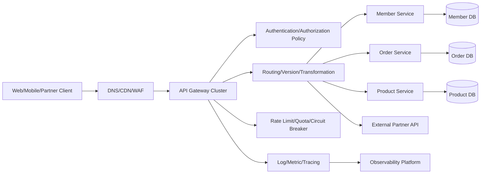
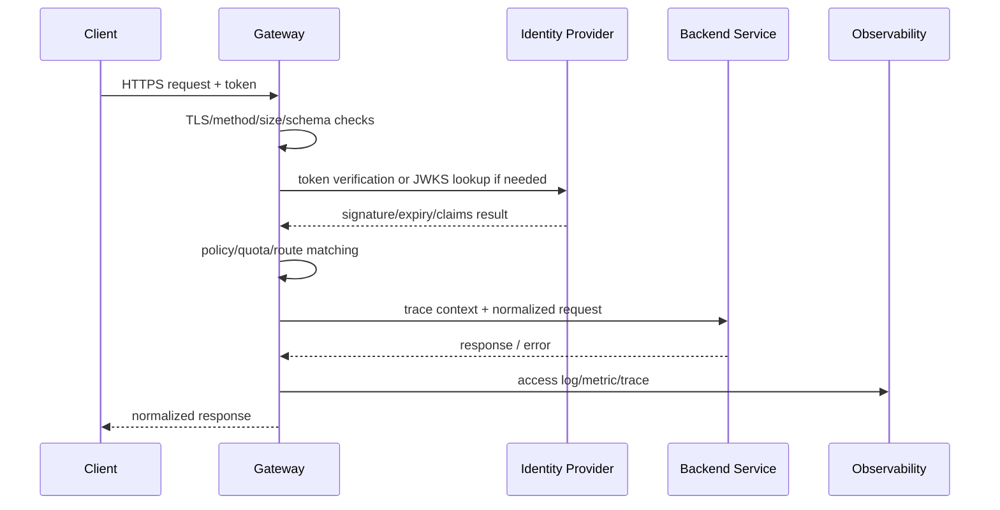

# API Gateway Architecture and Operations

## 1. Overview

> **Definition**: An API gateway is a server-side component that acts as the single entry point between external clients and internal services, routing requests to the appropriate backend and enforcing common policies such as authentication, authorization, transformation, traffic control, and observability.

In a microservices architecture, functionality is decomposed into multiple services, and each service differs in address, protocol, and deployment cycle.
If clients call each service directly, service locations are exposed externally, and multiple network round trips increase latency and the likelihood of failure.
Moreover, having every service separately implement common functions such as auth-token verification, call-rate limiting, audit logging, and TLS handling creates duplication and policy inconsistency.
The API gateway places a policy-enforcement point at this boundary, separating the external API contract from the internal service implementation.

The gateway takes on a broader role than a simple reverse proxy, but it is not an application server that stands in for business logic.
Rather than interpreting the meaning of a request to make core business decisions such as approving a payment or decrementing inventory, its proper role is to control who can call which API under what conditions.
If this boundary is not kept, the gateway becomes a giant monolith, and the risk of change and the blast radius of failures actually grow.
Therefore, the purpose of adoption is not to gather all functionality in one place but to manage common cross-cutting concerns and the external-exposure boundary consistently.

In an exam answer, you should present the API gateway as a flow of `external channel → policy enforcement → internal service` and not stop at listing features.
You can explain the soundness of the design only when you connect why a single entry point is needed, which policies to place at the gateway, and how to isolate gateway failures.
In particular, authentication and authorization are separate responsibilities, and TLS termination must be distinguished from encryption of the backend segment.

### 1.1 Background and Necessity

First, it is needed for service decoupling.
The client calls a stable external contract `/orders`, and the gateway finds and forwards to the current version and location of the order service.
Even if the service moves from `order-service-v2` to another cluster, changes to external clients can be minimized.
This has the effect of decoupling changes in service discovery from the client release cycle.

Second, it absorbs API composition and protocol differences.
If a single mobile screen requires member, product, and recommendation information, the gateway can adopt a BFF (Backend for Frontend) form that composes multiple backend calls.
Conversely, putting all compositions into the gateway increases coupling, so apply this only in a limited way when the composition rules change frequently per channel.
Gateway aggregation can reduce network round trips, but it introduces the new need to manage partial failure and response consistency.

Third, it provides a reference point for security and operational policy.
For requests entering from outside, the gateway can inspect TLS, token format, request size, allowed methods, call rate, and audit identifiers.
However, trusting only the gateway cannot prevent internal bypass calls or privilege escalation, so important services must add their own authorization and service-to-service identity verification.
That is, the gateway is not the sole security boundary but the first layer of a defense-in-depth structure.

### 1.2 Core Goals and Non-Goals

The core goals are stable abstraction of the external API, consistent enforcement of common policy, visibility into traffic, and suppression of the propagation of service failures.
These goals can conflict with one another.
For example, strengthening detailed transformation and aggregation raises client convenience but increases the gateway's CPU usage and change frequency.
Therefore, define the goal priorities as quality attributes and activate only the policies each API needs.

The non-goals are centralization of business rules, database integration, relaying of all internal communication, and unlimited response caching.
Order-amount calculation or a customer's loan-limit judgment must be owned by the domain service.
If the gateway queries an internal database directly, service boundaries and audit trails become blurred.
A structure that routes all internal east-west traffic through the gateway can also enlarge bottlenecks and failure domains, so review it separately from other means such as a service mesh.

## 2. Concept Diagram and Processing Flow

### 2.1 Overall Logical Architecture

The CDN and WAF in front of the client have strengths in static content, edge caching, and mitigating large-scale network attacks.
The API gateway, behind them, performs routing tailored to the API contract and application-level policy.
If you treat the two layers as one, it becomes hard to distinguish the network defense the WAF provides from the per-user, per-path policy the gateway provides.
You should first draw up a responsibility table for what to block and what to record at each layer.

The gateway cluster should be composed of at least two or more instances, and by default should not store state only in local memory.
Manage routing configuration and auth keys declaratively, but supply the actual secret values from a separate secrets-management system.
Even if one instance fails, the load balancer must be able to connect to another instance, and existing connections must be safely drained even during configuration deployment.

### 2.2 Request Processing Pipeline

The processing order can vary by product, but usually, after input validation and TLS handling, it verifies identity and permissions and then enforces routing and traffic policy.
When passing the token-verification result to the backend, rather than indiscriminately copying the entire original token, forward only the necessary subject/role/scope claims via a safe header or an internal auth context.
However, when the backend requires the raw token and an audit trail, evaluate the exposure risk and apply separate protection.

Failure responses are also part of the API contract.
Distinguish the cause — 401 for authentication failure, 403 for insufficient permission, 429 for call-rate exceeded, 504 for upstream timeout — but do not expose internal hostnames and stack traces externally.
Depending on whether it is safe for the client to retry, you should design retriability and hints such as `Retry-After`.

### 2.3 Responsibilities by Component

| Component | Main Responsibility | Design Check Point |
|---|---|---|
| Listener | Port/host/TLS reception | Certificate lifetime, SNI, minimum TLS version |
| Route | Path/method/header-based mapping | Priority, duplication, version compatibility |
| Upstream | Backend addresses and pool management | Health check, service discovery |
| Policy | Authentication/authorization/limiting/transformation | Scope of application and exception approval |
| Plugin/Filter | Extension processing | Execution order, performance, failure default |
| Control Plane | Configuration/policy deployment | Validation, approval, rollback |
| Data Plane | Actual request forwarding | Latency, high availability, isolation |
| Telemetry | Log/metric/trace | Personal-data masking, correlation ID |

The control plane stores, validates, and deploys configuration, while the data plane processes actual packets.
Separating the two lets the data plane keep serving with the last valid configuration even if it temporarily cannot communicate with the control plane.
On the other hand, propagation delay of policy changes occurs, so emergency security blocks need a separate block path and propagation-status monitoring.

Plugins or filters are convenient, but continually inserting arbitrary code into the request path makes order and failure behavior hard to trace.
Specify a timeout, a memory ceiling, and an allow/block default-on-error for each filter, and keep to common-policy-centered rather than per-business plugins.

## 3. Key Features and Design Principles

### 3.1 Routing and API Lifecycle

Routing is not a simple function that forwards based on the URL alone.
It selects the most specific rule by combining host, path, HTTP method, header, query, and consumer key, and it should reject ambiguous rules at the deployment stage.
For example, if `/v1/orders/{id}` and `/v1/orders/history` exist at the same time, you must make clear the rule that prioritizes the static path over the variable path.

Versioning strategy can be divided into URL-path, header, and media-type methods.
Path versioning is easy to observe and route but increases the number of URLs; header versioning stabilizes the URL but makes testing and debugging harder.
Whichever method you choose, you must manage the compatibility period, deprecation notice, and per-consumer usage status.

| Versioning Method | Advantages | Limitations | Suitable Situation |
|---|---|---|---|
| URL path `/v1` | Intuitive, easy log analysis | Endpoints increase | Public/partner APIs |
| Header | Stable URL, separated representation | Calling tools become complex | Internal/sophisticated negotiation |
| Media type | Couples resource representation and version | Low operational visibility | REST representation versioning |
| Compatible evolution | Minimizes client changes | Requires design discipline | Long-running APIs |

The gateway should be connected to an API catalog.
Recording for each route the owning team, data classification, authentication method, SLO, deprecation date, and contact lets operators respond quickly to failures or permission requests.
As routes increase, it becomes important to detect unregistered shadow APIs and to phase out unused endpoints.

### 3.2 Authentication and Authorization

Authentication is the process of confirming who the request subject is, and authorization is the process of deciding whether that subject is permitted a specific resource and action.
Verifying a JWT's signature and expiry does not automatically grant the right to view every order.
The gateway can verify a token's issuer, audience, signature, expiry, and scope, but judgments closer to the domain — such as whether the subject is the resource owner — must be re-verified by the backend.

OAuth 2.0 and OpenID Connect have different roles.
OAuth 2.0 is a framework for delegated access permission, and OIDC adds authentication information and an ID token.
For partner integrations, review the client-credentials flow and scope; for user calls, choose flows such as authorization code and PKCE to fit the situation.
Do not place tokens in the query string, and filter so that sensitive tokens do not remain in logs and error responses.

mTLS mutually authenticates client and server using the counterpart's certificate.
Rather than replacing external user authentication with mTLS alone, regard it as a means suited to strong identity verification between partners/services.
If you do not include certificate issuance, rotation, revocation, and clock synchronization in the operational plan, even a technically strong method degrades actual availability.

Authorization policy can combine role-based RBAC, attribute-based ABAC, and scope-based OAuth scope.
Express policy as "who can do what under which conditions," with default-deny and least-privilege as principles.
You must define the responsible party and audit log for when the gateway policy and the service policy reach different conclusions.

### 3.3 Traffic Control and Fairness

Rate limiting is a feature that limits the number of requests allowed over a given time.
Fixed window is simple to implement but causes momentary bursts at boundary moments; sliding window is smoother but requires state and computation.
Token bucket can separate average rate from burst capacity, so it is often used for per-consumer API policy.

| Method | Core Principle | Strength | Caution |
|---|---|---|---|
| Fixed window | Count per time interval | Simple/low cost | Boundary burst |
| Sliding window | Continuously computes the recent interval | Uniform limiting | Storage/computation cost |
| Token bucket | Token generation and burst consumption | Adjustable burst allowance | Distributed-state sync |
| Leaky bucket | Drains at a constant rate | Flattens output rate | Latency accumulation |

If you set the limit key by IP alone, you may also block legitimate users behind a NAT.
Design fairness by combining user ID, app key, organization, API path, and cost tier, and place separate limits such as IP/device fingerprint on the pre-authentication stage.
In a distributed gateway, choose among a central store, local approximation, and per-region quota to fit, considering counter consistency and latency.

A quota is a consumption limit over a longer period, such as daily call volume or monthly contracted volume, and it is not the same as a rate limit.
Guide consumers who will receive a 429 on the retry interval, and operators must distinguish normal, burst, and attack traffic to measure how the limiting affected the business.

### 3.4 Transformation, Aggregation, and Caching

The gateway can perform lightweight transformation between external JSON and internal gRPC/SOAP/message formats.
Transformation is useful for contract compatibility and gradual modernization, but complex mappings that change data meaning must be owned by the domain service.
In particular, fix the transformation of error fields and date/currency/character encoding by specification, and put bidirectional tests in place.

BFF composes an optimal response per channel such as web, mobile, or partner.
Small responses and few round trips matter for mobile, while a stable public contract and detailed errors may matter for partners.
Rather than having one general-purpose gateway hold all channel differences in conditionals, separating per-channel BFFs and reusing only common security/observability policy makes changes easier to control.

Caching reduces read load and latency but comes with data-freshness and permission-isolation issues.
It suits APIs where you can define the change cycle and the allowed stale range, like a public product list; for data that is per-user or varies by permission, reflect subject/scope in the cache key or do not cache.
Considering invalidation failure, design TTL, ETag, conditional requests, and whether to serve stale on origin failure together.

### 3.5 Observability and Auditing

By default, access logs should leave non-identifying identifiers: time, route ID, status, latency, upstream, trace ID, and consumer ID.
Do not collect, or mask, sensitive information such as the Authorization header, resident registration numbers, and raw payment-instrument data.
Log retention period and access rights must align with personal-information and audit policy.

For metrics, focus on p95/p99 latency rather than the average, the 4xx/5xx ratio, per-upstream errors, the number of limit exceedances, and connection-pool exhaustion.
You must separate the gateway's own latency from upstream latency to judge where the bottleneck is.
In distributed tracing, verify and forward the client's trace context, but do not use external input directly as a log key — limit its size and format.

| Observation Target | Representative Metric | Operational Question |
|---|---|---|
| Ingress volume | RPS, connection count | Is this a sudden influx? |
| Latency | p50, p95, p99 | Which is slow — gateway or backend? |
| Errors | 4xx, 5xx, timeout | Are consumer errors and server errors separated? |
| Limiting | 429, quota usage | Is the policy blocking normal customers? |
| Resources | CPU, memory, pool | Is horizontal scaling needed? |
| Security | Auth failures, abnormal paths | Is this an attack pattern or misuse? |

## 4. High Availability, Performance, and Deployment Design

### 4.1 Fault Isolation and Resilience

Because the gateway sits in front of all calls, it easily becomes a single point of failure.
Take active-active instances, multiple availability zones, state externalization, health checks, and auto-scaling as base candidates, but you must verify failover time and configuration consistency.
Simply increasing the instance count cannot solve control-plane failure or certificate expiry.

Set timeouts per stage: overall request, connection, TLS handshake, and upstream response.
Limit retries to idempotent GETs or requests with an explicit idempotency key, and apply exponential backoff and a ceiling so retries do not amplify load.
Resending a payment request four times can be a duplicate transaction rather than failure recovery.

A circuit breaker briefly blocks calls to an upstream that has failed consecutively, preventing the failure from spreading to other services.
Using isolation pools and bulkheads together can reduce a situation where the product service's latency exhausts the login service's threads and connection pool.
After tripping, confirm recovery with a small number of probe requests in the half-open state, and make the recovery criteria and operator alerts clear.

### 4.2 Performance Design

Gateway latency is determined by the accumulation of TLS, certificate/JWKS lookup, the policy engine, serialization, plugins, and network round trips.
If you synchronously call a remote auth server on every request, the auth server becomes the bottleneck, so for verifiable tokens design a key cache and expiry policy.
On key rotation, provide an overlapping validity period for the new and old keys so that valid tokens are not suddenly rejected.

Connection pools and keep-alive reduce handshake cost, but if you set the maximum connections per backend wrong, the gateway will instead overwhelm the backend.
In load testing, do not look only at average throughput; measure p99 latency, concurrent connections, large requests, slow upstreams, and retries on failure.
Compression can reduce bandwidth, but evaluate CPU and the risk of compression bombs together.

### 4.3 Deployment and Configuration Change

Version-control routes and policies like code and put them through static validation, security-rule checks, approval, and staged deployment.
A single wrong regular expression can send normal traffic to another service or create an authentication bypass, so syntax validation of the configuration file alone is not enough.
Put contract tests that include representative consumer scenarios and forbidden paths into CI.

Canary deployment applies the new configuration to a portion of consumers/regions/headers among the total traffic and compares error rate and latency.
Blue-green keeps the old environment for instant switchover but requires synchronizing the two environments' certificates and routing state.
Emergency blocks must be executable faster than a normal deployment, but leave an audit event of who executed it, when, and on what basis.

| Deployment Method | Advantages | Risk | Suitable Condition |
|---|---|---|---|
| Rolling | Resource efficiency, gradual transition | Mixed-version state | Backward compatibility guaranteed |
| Blue-green | Fast switch/revert | Double resources, data difference | Independent environments possible |
| Canary | Validation with real traffic | Requires decision-metric design | Observability and fine-grained routing |
| Declarative GitOps | Change tracking/reproduction | Sync delay | Approved-configuration operation |

## 5. Comparison of the API Gateway with Similar Technologies

A reverse proxy focuses on the basic role of connecting to the backend on the client's behalf and forwarding the request.
The API gateway often adds, on top of that, per-consumer authentication, versioning, quota, transformation, a developer portal, and lifecycle management.
But you cannot determine responsibility by the product name alone, so the actual judgment should be made by the scope of routing/policy/operational features.

A load balancer centers on distributing traffic across multiple servers to raise availability and throughput.
The gateway also performs load balancing, but it makes many more meaningful decisions about the API contract and policy.
A WAF defends against attack patterns and web-request rules, and a service mesh mainly handles identity, encryption, and policy for east-west traffic between services.
If you assume one tool completely replaces every role, duplicate policy or a control gap arises.

| Category | API Gateway | Reverse Proxy | Load Balancer | Service Mesh |
|---|---|---|---|---|
| Main target | External/partner API | Web/app forwarding | Server pool | Service-to-service comms |
| Core concern | Contract/policy/consumer | Forwarding/TLS/cache | Distribution/health check | mTLS/east-west policy |
| API versioning | Actively supported | Limited | Almost none | Internal-contract centric |
| Authentication/authorization | Consumer/scope policy | Basic auth possible | Usually delegated externally | Workload identity |
| Operating location | Edge/DMZ/cluster boundary | Edge or in front of server | Network/cloud | Proxy beside the service |

### 5.1 Selection Criteria

If public APIs are few and you only need simple web forwarding, a reverse-proxy-and-WAF combination can have a lower operational burden.
If you must manage per-partner keys and usage and handle API version deprecation, developer registration, and transformation, the value of an API gateway grows.
If services are numerous and mTLS and retry policy for internal communication are core, review a service mesh, but divide responsibility with the external API gateway.

The core of the choice is not the product feature table but the traffic boundary and the operating organization.
Specify with a RACI who approves routes, who owns the authentication policy, and who recovers on failure.
Before adopting a gateway, measure a baseline of call volume, latency budget, data sensitivity, regulatory retention period, and team capability to judge the effect.

## 6. Application Cases and Answer-Style Analysis

### 6.1 E-commerce Mobile API Case

A mobile app calls the product list, cart, and order status in a short time.
The gateway can select a compatible route based on the app version, apply a short-TTL cache to public product information, and require strong authentication and an idempotency key on the order API.
Even if the product service temporarily slows down, separate connection pools and circuits per upstream so it does not share resources with login and order inquiry.

Order creation is not a target for caching or indiscriminate retries.
The gateway forwards the request ID and idempotency key, and the order domain judges the actual duplication and the atomicity of inventory/payment.
Thus the gateway creates safe forwarding conditions, and the backend is responsible for the final consistency of the transaction and business-compensation handling.

### 6.2 Public/Partner API Case

Public-data APIs differ per institution in call volume and purpose of use, and when personal information is included, the scope of provision and the retention policy are strict.
The gateway distinguishes institution keys from user authentication and checks per-API quota, source-data classification, masking policy, and whether the terms of use are agreed to.
To avoid serving arbitrary stale personal data on failure, divide the allowed cache range by data classification.

Where a partner uses legacy XML and the internal side has switched to JSON, the gateway can be a short-term transformation layer.
But if you do not record the owner and the end date of the transformation rule, a temporary adapter becomes permanent legacy.
Use contract tests and a usage dashboard to confirm that legacy calls are decreasing, and verify per-partner transition before deprecation.

### 6.3 Failure Scenarios and Response

When the identity provider slows down, synchronously verifying every request delays the gateway and the backend at the same time.
You should prepare a key cache for verifiable tokens, short connection timeouts, differentiated handling of new logins versus existing sessions, and an emergency-block policy.
Allowing expired tokens, which lowers security, is a last resort; predefine the allowed scope and the approving authority.

If a particular partner spikes call volume with faulty retries, isolate that flow with a per-consumer rate limit and circuit breaker.
Using only a global limit harms even normal consumers, so hierarchical limiting at the organization/app/path level is needed.
Afterward, analyze the cause, affected users, policy-activation time, and recovery result together with the audit log to adjust the limit values.

## 7. Deep Dive: Cloud-Native and API Governance

In Kubernetes environments, a standardization trend that divides the responsibilities of the infrastructure provider, cluster operator, and application developer per resource, such as the Gateway API, is important.
This approach separates the permissions of objects such as GatewayClass, Gateway, and Route, so it can handle multi-tenancy explicitly.
However, even with standard resources, differences among implementations' extension fields and policy engines remain, so you must separately operate an organizational standard profile and conformance tests.

The boundary between the API gateway and the service mesh is also evolving.
A dual structure — applying consumer contracts and public authentication to external north-south traffic, and workload identity/mTLS/service-to-service policy to internal east-west traffic — is a common design candidate.
Applying retries and limiting redundantly at both layers can amplify requests, so designate one layer as the primary enforcer and limit the other to a safeguard.

API governance is a continuous process of design standards, security rules, specification management, change approval, usage analysis, and deprecation management.
Automating route registration and contract testing against an OpenAPI specification can reduce the gap between documentation and actual behavior.
Make authentication/authorization, error format, correlation ID, sensitive-data masking, and version policy common standards, and exceptions must have an expiry date and a responsible party.

Recently, an approach of managing gateway policy as code and declarative resources and automating API security testing and load testing before deployment is spreading.
But automation can also rapidly spread unapproved exposure.
Therefore it is important to combine static analysis of policy changes, least-privilege checks, diff-based approval, and rollback-capable deployment.

## 8. Considerations and Implications

### 8.1 Security and Trust Boundaries

Even if you terminate TLS at the gateway, consider re-encryption and backend authentication for sensitive internal segments.
Take token verification, schema checks, request-size limits, SSRF defense, and blocking of abnormal methods as common baselines.
Perform separate threat modeling at points where external input is transformed into internal addresses or headers.

### 8.2 Balancing Performance and Cost

Putting complex policy and remote lookups on every request lets security features eat into the latency budget.
Measure policy cost and failure tolerance per path, and apply caching/local verification/batch aggregation within the necessary scope.
Include in TCO not only gateway-instance and external-policy-store costs but also failure-response staffing and testing costs.

### 8.3 Organization and Operational Responsibility

A central platform team should provide the common foundation, but the API-owning team must hold responsibility for the contract and business-specific authorization.
Granting broad route-creation rights increases shadow APIs and wrongful domain exposure, so put a role-based approval flow in place.
Connect SLO, on-call, change management, and deprecation criteria to the API catalog so that technical configuration and organizational responsibility are not separated.

### 8.4 Availability and Disaster Recovery

Multiple instances alone do not complete high availability.
Document the recovery order of certificates, policies, routing configuration, keys, rate-limit state, DNS, and external dependencies, and conduct recovery drills regularly.
Define per-API the traffic to reroute and the data-consistency conditions on a regional failure, and consider that unconditional retries can expand the disaster.

### 8.5 Data Protection and Auditing

Logs are essential to operations but become a secondary leak point for personal and secret information.
Include collection purpose, field minimization, masking, access control, retention/destruction, and audit access in the design.
In particular, disable request/response body logging by default, and when unavoidable, limit the scope with approved sampling and de-identification.

### 8.6 Implications for the Professional Engineer's Answer

An answer is logical when it develops from definition through necessity, structure diagram, processing procedure, core policy, comparison with similar technologies, cases, failure response, and governance.
Do not end each policy with "we apply it"; connect the reason for applying it, the side effects, the measurement metrics, and the mitigation.
For example, a rate limit raises security but can block normal users, so present a per-consumer key, exception approval, and 429 observation together.

In conclusion, an API gateway is not a proxy you install simply because there are many services.
It is a platform boundary that protects the external contract and enforces common policy repeatably, and to that extent it also carries the risk of central failure and excessive coupling.
The professional engineer must design the traffic boundary, domain responsibility, security level, latency budget, and organizational operating model together so that the benefit of adoption exceeds the complexity.

## References

- Kubernetes, Gateway API concepts and resources: https://kubernetes.io/docs/concepts/services-networking/gateway/
- Kubernetes Gateway API security concepts: https://gateway-api.sigs.k8s.io/docs/concepts/security/
- OWASP API Security Project: https://owasp.org/www-project-api-security/
- OWASP Secure API Gateway Blueprint: https://owasp.org/www-project-secure-api-gateway-blueprint/
- RFC 9110 HTTP Semantics: https://www.rfc-editor.org/rfc/rfc9110

---

> **In one line**: An API gateway consistently enforces contract, security, traffic, and observability between external APIs and internal services, but its boundary and responsibilities must be designed so it does not become a center of business logic or a single point of failure.
