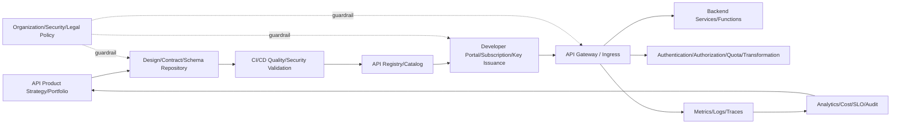
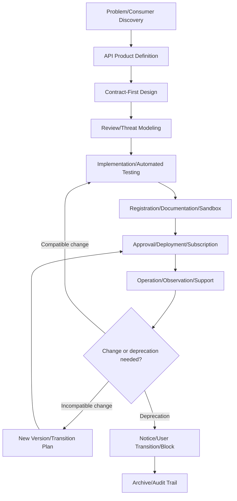

# API Management and API Lifecycle Governance

## 1. Overview

> **API Management** is a framework that controls the entire lifecycle of an API — designing, developing, deploying, securing, publishing, operating, analyzing, and deprecating it — through policy, platform, and organizational responsibility, thereby providing the API as a stable product.

APIs have become, beyond a calling convention between applications, the product boundary through which an organization provides its data and business functions to the outside. Internal service integration, mobile apps, partner systems, public data, and SaaS integrations all depend on APIs, so a change to an API affects a wider set of consumers and contracts than a change to a single program. The reason API management is needed is not to build many APIs, but to continuously explain and control who uses them, for what purpose, and with what quality and permission.

An API gateway is an important execution component of an API-management platform, but it is not the same as API management as a whole. If the gateway routes requests and enforces runtime policy, API management encompasses planning, design, registration, documentation, developer portal, subscription, analytics, change, and deprecation. Adopting only a gateway forwards calls, but ownerless APIs, stale versions, hidden endpoints, and contract mismatches can accumulate.

Treating an API as a product does not mean making pretty documentation. It means having clear consumers and a value proposition, a stable contract, measurement of usage and quality, support channels, a deprecation policy, and security responsibility. Therefore, the outcome of API management should be evaluated by operational results such as reuse rate, consumer onboarding time, change failure rate, vulnerability response time, and SLO achievement rate, rather than by the number of APIs.

### A. Background and Necessity

First, as digital services become multi-channel, the same business function is reused across web, mobile, partner, batch, and AI agents. If each channel queries the database directly, coupling and security risk grow, so you must provide a service boundary through an explicit API contract. Without a management framework, similar APIs are built per channel, creating duplication and meaning inconsistency.

Second, consumers of an API continue to exist even after deployment. Internal code can be modified all at once, but external partners or already-deployed mobile apps are not updated instantly. Without compatibility rules, version coexistence, usage status, deprecation notices, and migration support, even a small field change can lead to an outage.

Third, an API is an attack surface. Object identifiers, permissions, call volume, sensitive information, and third-party integrations are exposed at the per-request level, so authentication alone cannot guarantee safety. The OWASP API Security Top 10 presents API-specific risks such as object-level authorization failure, excessive resource consumption, improper inventory management, and unsafe API consumption.

Fourth, cloud-native environments distribute APIs across multiple clusters, regions, service meshes, and serverless functions. The routing information of a central gateway alone cannot know all APIs, so you need an API portfolio that connects design specifications, a service catalog, runtime observability, and security scanning.

### B. Core Goals and Scope

The first goal of API management is discoverability and contract stability that consumers can trust. The API name, description, examples, authentication method, error model, limiting policy, and support contact must be in the catalog so consumers reduce trial and error. The second goal is policy consistency. Provide common guardrails so that authentication, authorization, request validation, call volume, auditing, and personal-information protection are not implemented differently per service.

The third goal is visibility into change and operations. You must connect per-API call volume, error rate, latency, consumers, versions, cost, and data classification to judge which APIs are overused or candidates for deprecation. The fourth goal is measuring business value. Even with a high call count, an API with a high failure rate or one that does not contribute to customer conversion is not a successful API.

The scope can include not only public APIs but also internal, partner, admin, and service-to-service APIs. However, do not apply the same public level and policy to all. Public APIs emphasize developer experience and contract stability; internal APIs emphasize deployment automation and service trust; partner APIs additionally consider contracts, legal, support, and mutual authentication.

## 2. Overall Structure of API Management

### A. Logical Architecture

In the structure above, the API product strategy decides which consumer problem to solve and at what level to publish. The design/contract repository stores the interface specification such as OpenAPI, the error model, examples, and change history. CI/CD validation checks not only specification syntax but also compatibility, security, testing, and personal-information rules before deployment.

The Registry and catalog are not a place that stores only the technical addresses of APIs. By connecting the owning team, data classification, environment, authentication method, version, SLO, deprecation date, contact, regulatory region, consumers, and usage, they create a decision-actionable asset inventory. The portal provides documentation, a sandbox, and subscription/support procedures for APIs approved from the catalog.

The gateway processes actual requests in the data plane and enforces authentication, authorization, rate limiting, transformation, caching, routing, and observability policy. However, the gateway must not own all business rules. Domain judgments such as order approval, account-balance judgment, and data-ownership verification must be the final responsibility of the backend service, and the gateway should operate as one layer of defense-in-depth.

### B. Lifecycle Processing Flow

The lifecycle is not an order of writing documents but a control loop where decisions and evidence connect. The contract defined in the design stage becomes the criterion for implementation and testing, and the deployed version is validated by consumer, usage, and error data. Contract inconveniences or security risks discovered during operation must be reflected in the next design.

At the idea stage, define the consumers, use cases, data sensitivity, expected latency, availability, call volume, and the party bearing the cost. Even when providing the same data, a real-time-query API and a bulk-extraction API have different limits and storage/transfer costs. If you start by just naming the service, product goals and technical implementation priorities will conflict later.

At the design stage, make the resources and actions, input/output schema, state transitions, error model, idempotency, pagination, sorting, filtering, and authentication/authorization into a contract. OpenAPI is a standard that expresses the interface of an HTTP API in a form humans and tools can understand, so it can be used as common input for code generation, documentation, and contract testing. However, having a specification does not automatically guarantee the quality of meaning and the permission design.

At the implementation/validation stage, test not only the happy path but also boundary values, unauthorized object access, bulk requests, duplicate retries, partial failures, and old-version clients. Put contract tests that compare the specification with the actual response into CI, and make breaking-change detection a merge condition. Separate per-environment registration and approval status so that a temporary endpoint in the development environment is not promoted to production.

## 3. Core Components and Design Principles

### A. API Contract and the Design-First Approach

Contract-first is an approach that agrees on the interface consumers will see before implementation. Defining paths, methods, status codes, schema, examples, and security requirements first lets the frontend and backend develop in parallel and lets ambiguous requirements be discovered early. Conversely, auto-generating documentation from code reflects actual behavior quickly but can leave design intent and business meaning organized belatedly.

A good contract does not describe only success responses. It must make clear the difference between 401 and 403, how to use 404 between resource-absence and permission-hiding, 409 conflict and 429 limit exceedance, and 5xx retriability. Put in the error object a code/message/trace-ID to be disclosed externally, but exclude internal hostnames and stack traces.

For a schema, the meaning and evolution rules matter more than the field name. Without specifying a number's unit, time zone, precision, null allowance, and the possibility of adding enum values, different consumers interpret the same field differently. Rather than deleting a field or changing its meaning, first review a compatibility strategy of adding a new field and running the old field in parallel for a period.

An OpenAPI specification can express reusable components, security schemes, and request/response schemas. But you must manage the specification file's own change history, reviewers, approval status, and whether it matches the operating version. If the repository's specification and the actual gateway configuration diverge, the risk arises that the portal shows correct documentation while production requests behave differently.

### B. Portal, Catalog, and Developer Experience

The core of a developer portal is to reduce the time from search to a successful call. Provide the description, how to start authentication, the minimum permission scope, example request/response, SDK, error resolution, limiting policy, status page, and inquiry channel in one flow. Even if documentation is current, without test credentials or a sandbox for the first call, an onboarding barrier remains.

An API catalog is not a list that indiscriminately enumerates all endpoints, but an asset register including responsibility and risk. Record per API the product owner, technical owner, data owner, security classification, operating environment, version, consumers, last-used time, and scheduled deprecation date. This information is also used for failure response and privacy impact assessment.

The subscription model specifies the relationship between a consumer and an API. A public read API may allow self-service key issuance, but personal information or payment functions require organizational verification, a contract, approved scope, and strong authentication. A key is a credential used to identify a consumer, not a substitute for fine-grained user authorization, and it must be revocable/reissuable and usage-trackable when leaked.

### C. Gateway and Policy Enforcement

The gateway forwards a request to the appropriate upstream based on path/host/method/header. When routing rules overlap, specify the priority of static paths and variable paths, and check for ambiguity before deployment. The data plane must be able to operate with the last valid configuration, and separate it so that a control-plane failure does not become a whole-API failure.

Authentication confirms the subject, and authorization judges whether to permit the subject's action. Verifying a JWT's signature and expiry does not grant a user the right to read another customer's order. Authorization over object owner/tenant/business state must be re-verified by the service, and the gateway's and backend's judgments/policy versions/results must be left in an auditable form.

Rate limit restricts short-term rate, and quota manages cumulative volume over a period. Token bucket easily separates average rate from burst allowance, but in multiple instances you must consider counter consistency and storage latency. Using IP alone as the limit key may block normal users behind a NAT, so design a policy that combines app/user/organization/path/plan/cost.

Transformation and aggregation absorb differences between the external contract and internal protocols, but putting complex business composition into the gateway makes it the center of change and failure. Simple JSON↔gRPC transformation or field-name compatibility can go in the gateway, but orchestration requiring state and compensation, such as inventory reservation and payment approval, is more appropriately owned by a domain service or a separate BFF.

### D. Observability, Analytics, and Cost

Measure per API the request volume, p50/p95/p99 latency, 4xx/5xx ratio, upstream errors, timeouts, 429s, payload size, and per-consumer quota. Looking only at average latency misses the long-tail latency of some users, so take percentile metrics linked to SLOs as the baseline. You must separate the gateway's own processing time from the backend's processing time to judge where to improve.

Logs can leave time, route ID, version, status, latency, trace ID, and a non-identifying consumer ID. Exclude the Authorization header, resident registration numbers, raw payment-instrument data, and sensitive request bodies from default collection, or mask them per field. Even if logs are used for security auditing, retaining raw text for a long time is not always justified, and access rights and retention period must be set separately.

Analytics should show the health of the API product rather than a simple call ranking. Look together at reuse rate, active consumer count, success rate, the conversion rate from documentation views to calls, per-version usage, consumer onboarding time, support tickets, and infrastructure cost per call. Instead of deprecating because traffic dropped, confirm seasonality, alternative APIs, and the business impact on a critical minority of consumers.

## 4. Security, Quality, and Governance

### A. API Security Controls

API security is applied in multiple layers, divided into design time and runtime. At design time, perform threat modeling, sensitive-information classification, schema validation, contract testing, dependency/secret scanning, and permission-matrix review. At runtime, apply TLS, authentication/authorization, request/response validation, rate limit, timeout, circuit breaker, and anomaly detection.

The OWASP API Security Top 10's Broken Object Level Authorization describes the risk of accessing another user's resource by merely changing the object ID in the URL. If the gateway checks only the token's validity and the service does not verify object ownership, this attack cannot be prevented. You must automate negative tests that change IDs with test data and tenant-boundary verification.

Unrestricted Resource Consumption can exhaust not only the network but also CPU, memory, storage, and external SMS/payment call costs. Set ceilings on page size, file size, sort/filter complexity, recursion depth, and the number of external calls, and design per-consumer budgets and time limits. Too low a limit hinders normal use, so provide business-specific criteria and an exception procedure together.

Improper Inventory Management is the problem of not knowing all operating hosts, versions, documents, and debug endpoints. Mandate registration in the deployment pipeline, and detect shadow APIs by cross-checking DNS, gateway logs, service discovery, and code repositories. Rather than deleting unused versions immediately, go through owner confirmation, consumer notification, an alternative path, and staged blocking.

### B. Quality Gates and Change Management

A quality gate is not sufficient with syntax checking alone. Include specification lint, compatibility comparison, schema/example matching, automated tests, performance criteria, security scanning, personal-information field review, documentation generation, and portal registration in the pipeline. Leave the failure cause in a message consumers can understand to connect it to repeatable improvement.

A compatible change is one that does not break existing consumers' requests and responses, such as adding a field, and an incompatible change is one that requires consumer modification, such as deleting a field, changing a type, changing meaning, or adding a required value. Compatibility judgment must consider not the syntax but the actual usage pattern of consumers and even code-generation tools. For example, even adding an enum value can effectively be a dangerous change if consumers implemented rejection of unknown values.

Versioning strategies include URL, header, media type, and compatible evolution. URL versioning is easy to observe and route but increases endpoints; the header approach keeps the address stable but complicates debugging and caching. More important than the method is clarifying each version's support period, deprecation criteria, usage confirmation, transition documentation, and rollback means.

## 5. Comparison and Application Cases

### A. Comparison of API Management, API Gateway, and Service Mesh

API management and the gateway have a containment relationship. The gateway is the request-execution point, and API management is the operational/governance framework from design to deprecation. A service mesh's proxy and policy mainly handle service-to-service east-west traffic, service identity, retries, and distributed tracing, so it does not automatically replace the portal and product lifecycle of external/partner APIs.

| Category | API Management | API Gateway | Service Mesh |
|---|---|---|---|
| Main target | External/internal/partner API products | Request ingress/relay/policy | Service-to-service east-west comms |
| Main features | Contract/portal/subscription/analytics/deprecation | Routing/authentication/limiting/transformation | mTLS/service discovery/retry |
| Core plane | Management/developer experience/data plane | Control plane/data plane | Control plane/sidecar (data plane) |
| Consumer | People/organizations/external developers | Calling clients/services | Internal services |
| Question on failure | Who deprecates what, and when? | Where and how to forward? | Which service communicates safely? |

Ignoring this difference and trying to solve everything with one tool mixes policy responsibility and observation scope. Handle external APIs' usage/contract/legal requirements in API management, service-to-service mTLS and retries in the service mesh, and set the boundary so that the gateway integrates the ingress policy between the two domains.

### B. Case: A Financial Institution's Partner Payment API

Assume a financial institution provides payment-approval and transaction-inquiry APIs to affiliates. First, in the API product definition, set each partner's purpose of use, allowed regions, throughput, personal-information scope, transaction responsibility, and compensation criteria on failure. Separately from public documentation, connect portal registration/review, mTLS or strong client authentication, and scope approval so that only contracted partners can access.

In the design, specify the idempotency key and transaction state of an approval request. Because a duplicate-processed identical approval request due to a network retry can become a financial incident, put in place a policy where the server stores the relationship between the idempotency key and the request body and returns the same result for the same key. You must include the meanings of 401/403/409/429/5xx and the retry conditions in the contract so that partners do not amplify load with arbitrary retries.

In operations, look separately at per-partner/product/API-version p95 latency, success rate, approval-rejection rate, duplicate requests, quota, and calls from anomalous regions and times. Do not leave raw payment data in logs, and pseudonymize the transaction identifier and trace ID. Before deprecating a version, confirm each partner's call status and test results, and validate compatibility with a sandbox and staged traffic transition.

### C. Case: Overuse of a Public Data Inquiry API

Assume an institution provides traffic data, and a particular consumer repeatedly queries a large number of pages in a short time, causing 429s for other users. Blocking by IP alone affects normal users on the same NAT. Combine per-application-key/institution/endpoint/page-size/time-window quotas, and provide a refresh cycle and ETag for cacheable data to reduce the repeated querying itself.

At the same time, re-examine whether the data the API returns includes personal information or location-sensitive information. Limiting the call volume alone cannot prevent excessive data collection and use beyond the purpose. Design minimum fields, aggregation/anonymization, purpose of use and retention period, terms of use, and audit logs together, and disclose the criteria for blocking/warning/approved-exception to maintain trust in the policy.

## 6. Deep Dive: Standards and Cloud-Native API Protection Trends

The official OpenAPI specification provides the 3.1-series patch releases and the 3.2 series together, used as the basis of a contract that describes an interface in a language-neutral way. In practice, an organization should pin the specification version it will support and verify the difference between the specification's syntax version and the actual operating gateway's features. Do not assume that all tools interpret identically merely because you declared the latest specification.

NIST explains API protection for cloud-native systems by dividing risks and controls into the pre-deployment (development/deployment) stage and the runtime stage. The SP 800-228 revision updated in March 2026 reinforced API risks and recommended controls per lifecycle stage. This aligns with the direction that API security should be seen not as defense at the single point of the gateway but as continuous control across specification, development, testing, deployment, and operation.

As generative AI participates as both an API consumer and provider, new problems arise. When an agent calls a tool API, you must identify an execution subject/purpose/permission/budget different from a human's login session. To keep instructions contained in a prompt from bypassing API permissions, limit the tool list and argument schema to an allowlist, and put user confirmation and transaction limits on high-risk operations.

AI APIs must be analyzed together with request tokens, response tokens, model version, latency, quality, and cost. Because a simple call-volume limit cannot prevent the cost explosion of long prompts and large responses, include token quota, per-model budget, maximum context, retry ceiling, and fallback rules in the contract. When retaining sensitive prompts and responses as observation data, apply minimum collection, masking, and access control.

An API-management platform should control the API portfolio centrally but must not eliminate the autonomy of domain teams. A platform-type operating model is realistic in which the central platform provides standard templates, security guardrails, a portal, and common observability, while domain teams are responsible for the business contract and consumer relationships. Do not allow policy exceptions indefinitely; record the rationale, approver, and expiry date.

## 7. Considerations and Implications

### A. Define APIs as Products and Set Priorities

If you make APIs a byproduct of the tech team, similar APIs increase and it becomes unclear who the consumers are. Define product goals, core consumers, data scope, quality level, cost burden, and success metrics first, and periodically clean up duplicate/unused/high-risk APIs from the portfolio. Make reuse and consumer success — rather than the number of APIs — the KPIs.

### B. Automatically Validate the Contract and Changes

Put the OpenAPI specification in a central repository and connect lint/compatibility/contract testing/example validation to CI. Approving only specification changes without validating the gateway configuration or actual responses separates documentation from operations. Define approval levels and rollback procedures per change type, and deprecate only after confirming the usage of old-version consumers.

### C. Do Not Concentrate Security Responsibility Solely at the Gateway

The gateway provides common authentication and traffic control, but object-level authorization and business rules must be finally verified by the backend. Threat-model the entire call path, including internal bypass calls, service accounts, admin APIs, and batch paths. Operate an API inventory and shadow-API detection to reduce neglected endpoints.

### D. Design Performance, Availability, and Cost Together

Caching and rate limits can improve performance and cost but have trade-offs of freshness, fairness, and availability. Separate the SLOs of the gateway and the upstream, and set a budget so that retries/timeouts/circuit breaking do not create a cascading surge. Serverless/AI APIs are governed in cost by request size and execution unit rather than call volume, so measure unit economics separately.

### E. Balance Developer Experience and Control

Requiring manual security approval for every API call can create bypass APIs and unofficial shared keys. Onboard low-risk read APIs quickly with automated self-service and standard policy, and apply strong review and least privilege to sensitive data, money, and admin functions. Continuously improve the portal documentation, samples, SDK, sandbox, and status page.

### F. Protect Observation Data as Personal and Confidential Too

Request bodies and headers can contain tokens, personal information, and business information. Design a log-field allowlist, masking, retention period, access rights, access auditing, and tenant isolation, and if necessary use a hash/classification/trace-ID instead of the raw text. Because the API-management metadata itself can reveal which customers/businesses are connected, control catalog access on a risk basis too.

### G. Clarify Organizational Responsibility and the Expiry of Exceptions

Set a RACI so that the product owner is responsible for value and consumers, the technical owner for implementation and SLO, the security owner for controls, and the data owner for the purpose of use and classification. For exceptions that deviate from standards, leave the reason/risk/compensating control/approver/expiry date and confirm renewal via automatic alerts. A structure where the platform team decides the business meaning of every API on their behalf does not scale.

## References

- OpenAPI Initiative, "OpenAPI Specification" — https://spec.openapis.org/oas/
- OpenAPI Initiative, "OpenAPI Specification v3.1.2" — https://spec.openapis.org/oas/v3.1.2.html
- OWASP, "API Security Project" — https://owasp.org/www-project-api-security/
- OWASP, "Top 10 API Security Risks – 2023" — https://owasp.org/API-Security/editions/2023/en/0x11-t10/
- NIST, "SP 800-228-upd1 Guidelines for API Protection for Cloud-Native Systems" — https://csrc.nist.gov/pubs/sp/800/228/upd1/final
- NIST, "Guidelines for API Protection for Cloud-Native Systems" — https://www.nist.gov/publications/guidelines-api-protection-cloud-native-systems-march-2026-update

---

> **In one line**: API management is a governance framework that, beyond a gateway's request relaying, connects contract, security, developer experience, observability, change, and deprecation into a single lifecycle to operate APIs as trustworthy digital products.
