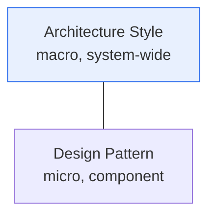
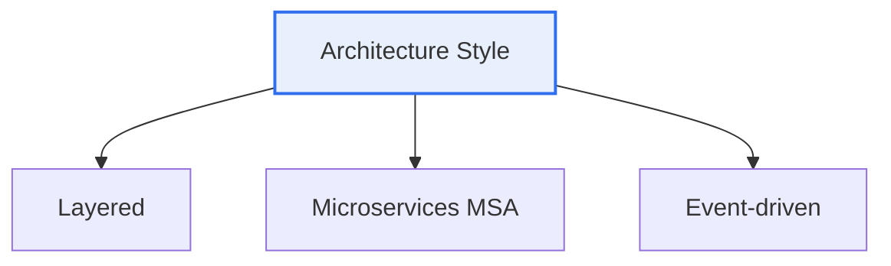

# Architecture Styles and Design Patterns

## 1. Overview

### A. Definition
> An **architecture style** is a **macro design framework** that organizes the overall structure of a system, whereas a **design pattern** is a **micro, reusable solution** that solves a specific design problem.

The relationship between the two concepts becomes clear when likened to '**a building's structural style**' and '**standardized techniques for decorating a room**.' If an architecture style sets the skeleton of the whole building — whether it is an apartment or a detached house (layered, MSA, etc.) — a design pattern is a local solution that solves, in a proven way, a problem repeatedly encountered within that building — for example, 'how can I create and share just one instance of a particular object.' The difference between the two lies in the **level of abstraction and the scope of impact**. The choice of architecture style is a hard-to-reverse decision that governs system-wide quality attributes such as performance, scalability, and security, whereas a design pattern deals with flexibility and reusability at the level of a specific class or component.

### B. Necessity
The larger and more complex software becomes, the more inefficient and failure-prone it is to rethink the structure from scratch every time. Architecture styles and design patterns let you reuse proven solutions accumulated by senior developers, raising quality and productivity at the same time.

## 2. The Difference Between Architecture Styles and Design Patterns

| Category | Architecture Style | Design Pattern |
|---|---|---|
| **Scope** | Whole system (macro) | Class/component (micro) |
| **Concern** | Structure/components/connections/quality attributes | Object creation/structure/behavior |
| **Impact** | Performance/scaling/security (hard to reverse) | Code reuse/flexibility |
| **Example** | Layered, MSA, event-driven | Singleton, Factory, Observer |

## 3. Three Representative Architecture Styles

**Layered** horizontally separates concerns into presentation, business, and data layers; it is the most common style, easy to understand and maintain, but it is vulnerable to changes that cut across layers and scales poorly at large size. **Microservices (MSA)** decomposes the system into small, independently deployable services, enabling per-service scaling, autonomous development, and fault isolation, but the complexity of distributed systems (network, data consistency, operational burden) comes as the price. **Event-driven** loosely couples components as they publish/subscribe events, so it is strong at real-time/asynchronous processing and scaling, but flow tracing and debugging are difficult.

| Style | Characteristics | Trade-off |
|---|---|---|
| **Layered** | Horizontal separation of concerns, simple | Vulnerable to cross-cutting changes, scaling limits |
| **Microservices** | Independent deployment/scaling/fault isolation | Distributed complexity, operational burden |
| **Event-driven** | Loose coupling, real-time/asynchronous | Difficult flow tracing/debugging |

## 4. GoF Design Patterns

GoF (Gang of Four) design patterns are divided into three types by purpose. **Creational** patterns encapsulate how objects are created, **Structural** patterns deal with how objects/classes are composed, and **Behavioral** patterns deal with the distribution of responsibilities and interaction among objects.

| Type | Purpose | Representative Patterns |
|---|---|---|
| **Creational** | Encapsulate object creation | Singleton, Factory Method, Abstract Factory, Builder, Prototype |
| **Structural** | Compose objects/classes | Adapter, Decorator, Proxy, Facade, Composite |
| **Behavioral** | Responsibility/interaction among objects | Observer, Strategy, Command, State, Iterator, Template Method |

Looking at representative patterns, **Singleton** creates and shares only one instance, used for resources of which only one is needed globally, such as configuration or logging; **Factory Method** delegates object creation to subclasses to lower coupling. **Observer** automatically notifies subscribers of a change in one object's state, used in events/MVC; **Strategy** encapsulates an algorithm so it can be swapped at runtime.

## 5. Considerations and Implications

1. **Secure quality attributes with architecture styles and code flexibility with design patterns.** The two levels have different purposes, so apply them complementarily.
2. **Pattern overuse is over-engineering.** Applying a pattern for the pattern's sake where there is no problem only increases complexity. Use them with restraint, suited to the problem context.
3. In the cloud-native/MSA era, new distributed-architecture patterns such as **Circuit Breaker, Saga, and API Gateway** have emerged and complement the traditional GoF patterns.

---

> **In one line**: Architecture styles (layered, MSA, event-driven) provide the system-wide structure and quality attributes, while GoF design patterns (creational, structural, behavioral) provide local solutions to recurring design problems; they differ in level of abstraction and scope of impact, so apply them complementarily and with restraint.
