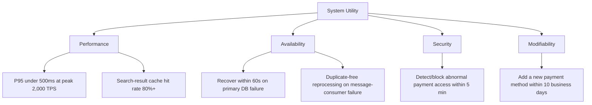
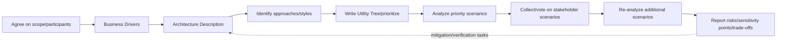

# Software Architecture Evaluation Based on ATAM (Architecture Tradeoff Analysis Method)

## 1. Overview

> **Definition**: ATAM (Architecture Tradeoff Analysis Method) is a stakeholder-participatory architecture evaluation method that concretizes quality-attribute requirements derived from business goals into scenarios, analyzes the impact of architectural decisions on quality attributes, and identifies risks, sensitivity points, and trade-offs early.

Software architecture cannot be described by a feature list alone.
Even when providing the same functionality, the outcome for users and the business changes depending on response time, fault tolerance, security, ease of change, and deployment speed.
For example, even if the "create order" function of an order system is the same, the architecture's fitness differs depending on whether it can keep the 95th-percentile response time within 500 milliseconds at peak hours and whether it prevents duplicate charges on a payment failure.
Therefore, architecture evaluation is not about confirming whether components exist, but an activity to examine whether the actual structure can continuously satisfy important quality-attribute goals.

The core of ATAM lies in surfacing the interactions among quality attributes.
Introducing a cache can improve performance and availability, but it can increase data-freshness and invalidation complexity.
Reducing synchronous tight coupling improves changeability and scalability, but creates the operational burden of message duplication, ordering, and eventual consistency.
In other words, an improvement in one quality attribute can cause a degradation in another, so you must find a balance point according to business priorities rather than optimizing a single metric.

Traditional design reviews tend to end with the architect explaining a structure diagram and attendees asking about implementation details.
In this way, the quality goals stakeholders actually consider important remain tacit knowledge, and the rationale for architectural choices is scattered across meeting minutes.
ATAM structures the discussion by using business drivers, a quality-attribute utility tree, scenario priorities, and architectural approaches as a common language.
As a result, the evaluation team, rather than declaring the correct answer of the design, transparently presents what risks the current decisions create and what additional verification is needed.

ATAM is not a test method that proves functional correctness.
Nor is it a method that guarantees by verifying every code path or by measuring performance numbers.
It is a risk-identification method that questions the consequences of architectural decisions from the quality-attribute perspective and connects points of high uncertainty to follow-up analysis, prototypes, and testing.
Therefore, the evaluation result should consist of a risk list, non-risk judgments, sensitivity points, trade-offs, mitigation plans, and the rationale for decisions, rather than a single pass/fail line.

### 1.1 Background and Necessity

First, architectural decisions are hard to reverse and expensive to change.
Decisions such as the data store, communication protocol, deployment unit, and authentication boundary affect all subsequent components and operational procedures.
Changing them after implementation involves data migration, interface compatibility, operational downtime, and organizational retraining together.
Applying ATAM at the point when requirements and the basic architecture are forming reduces costly redesign and makes risks visible while multiple alternatives can still be compared.

Second, non-functional requirements tend to remain vague adjectives.
Expressions like "a fast system," "a secure service," and "a flexible platform" alone cannot judge design alternatives.
ATAM uses quality-attribute scenarios composed of source, stimulus, environment, artifact, response, and response measure to turn abstract requirements into observable criteria.
For example, it concretizes "fast under peak traffic" into "when 2,000 order requests per second flow in during normal operation, the order API's 95th-percentile response time is 500 milliseconds or less and the error rate is 0.5 percent or less."

Third, the optimal architecture differs for each stakeholder.
The business unit emphasizes launch date and cost, the security unit emphasizes isolation and auditability, and the operations unit emphasizes fault recovery and observability.
Reflecting only one side's perspective causes hidden requirements to conflict late in the project.
ATAM raises the quality of consensus by having the business owner, architect, developers, operators, security staff, maintainers, and user representatives debate priorities over the same scenarios.

### 1.2 Goals and Basic Principles

ATAM's first principle is to **start from business drivers**.
Quality attributes are not an end in themselves but a means to achieve business goals.
For example, the reason high availability is needed is not that the tech team likes numbers, but that an interruption of financial transactions directly affects revenue, trust, and regulatory compliance.
Therefore, the evaluation's scope and priorities are set by considering business value, legal obligations, user impact, and operational risk together.

The second principle is to **analyze with scenarios**.
Stating only the quality-attribute name lets interpretation vary by the evaluator's experience.
Specifying stimulus and response, environment and measure, makes different architectures answer the same question, and the requirements for additional load tests or security verification also become clear.
Even changeability, which is hard to quantify, can be handled with a change scenario such as "add a new payment method within the existing release cycle."

The third principle is to **surface risks early but not decide their resolution arbitrarily**.
The ATAM evaluation team explains the existence and impact of a risk and presents mitigation alternatives and verification tasks.
The final choice must be made by the decision-maker responsible for budget, schedule, organizational capability, regulation, and product strategy.
If the evaluation team forces a particular technology as the correct answer, both the advantage of a participatory evaluation and the locus of accountability weaken.

## 2. ATAM's Evaluation Targets and Quality-Attribute Scenarios

ATAM targets the components, connectors, deployment, external interfaces, data flows, deployment environment, and the rationale for their selection that constitute the architecture.
The architecture description must include not only mere boxes and lines but also which quality-attribute requirements are satisfied by which approach.
For example, if a message queue is placed between the order service and the payment service, you must explain that an asynchronous decision raises scalability and fault isolation while also explaining how duplicate events and consistency problems are handled.

### 2.1 Classification of Quality Attributes and Their Interaction

Representative quality attributes are performance, availability, security, changeability, scalability, testability, interoperability, usability, and operability.
These are not independent checkboxes but change together by the same architectural decision.
For example, strong encryption and detailed audit logs raise security but can increase CPU usage, storage volume, and processing latency.
If this interaction is not organized, the performance team and the security team come to perceive each other's requirements only as obstacles.

Quality-attribute analysis proceeds with the following four questions.
First, it asks which stakeholder generates which stimulus.
Second, it asks in which environment the system should show which response.
Third, it asks what measure and acceptance criterion will judge the response a success.
Fourth, it asks which architectural approach was chosen to guarantee that response and what cost that choice imposes on other quality attributes.

| Quality Attribute | Representative Stimulus | Example Response Measure | Representative Architectural Approach |
|---|---|---|---|
| Performance | Peak request surge | 95th-percentile latency, throughput, error rate | Cache, asynchronous queue, horizontal scaling |
| Availability | Failure of a particular instance | Recovery time, failed-request ratio | Redundancy, automatic failover, isolation |
| Security | Unauthorized access attempt | Detection/blocking time, audit gaps | Least privilege, defense-in-depth, encryption |
| Changeability | Adding a new payment method | Change lead time, number of affected files | Interface separation, plugins, contract tests |
| Scalability | Growth in user/data scale | Cost/performance as capacity grows | Statelessness, sharding, partitioning |
| Operability | Failure/deployment/config change | Detection time, recovery time, change failure rate | Observability, automation, gradual deployment |

Merely listing the table's items does not constitute an evaluation.
For example, a stateless service is advantageous for horizontal scaling, but it must move session and job state to an external store, so the store's availability and network latency become new sensitivity points.
Also, a cache improves read performance but its invalidation delay can corrupt the accuracy of payment balances or inventory counts.
In ATAM, the benefits and side effects that one approach creates are tracked within the same scenario cluster like this.

### 2.2 The Six Elements of a Quality-Attribute Scenario

A quality-attribute scenario is concretized with **Source**, **Stimulus**, **Environment**, **Artifact**, **Response**, and **Response Measure**.
The source is the subject that generates the stimulus, such as a user, administrator, external system, operator, or failure event.
The stimulus is an event the system must handle, such as a request surge, node failure, policy change, attack attempt, or new-feature requirement.

The environment is the condition under which the event occurs, such as normal operation, peak load, partial failure, during deployment, or a disaster situation.
The artifact may be the whole system or a specific component such as the API gateway, database, authentication module, or message consumer.
The response describes the action the system must perform, and the response measure is written as a verifiable criterion such as time, ratio, quantity, or change scope.

For example, the scenario "it should be resilient to failure" is transformed as follows.
"During normal operation, if the primary database instance goes down, the order service detects the failure and switches to the standby instance, restoring read/write functionality within 60 seconds, while keeping the loss of confirmed transactions at 0."
This sentence makes availability, data integrity, operational automation, and recovery procedures all questioned at once.

Change scenarios are written the same way.
"Even if the business owner adds a new overseas payment provider 3 months from now, without interrupting the existing order/refund flows, 2 developers add an adapter and contract tests and deploy within 10 business days."
This scenario demands rationale for modularity, interface stability, test automation, and deployment independence.

### 2.3 The Utility Tree and Prioritization

A Utility Tree is a hierarchical structure descending from top-level Utility to quality attributes and detailed scenarios.
Each scenario is prioritized by combining business importance and architectural difficulty or risk.
Importance is the impact that scenario has on business outcomes, regulation, and user experience, and difficulty is the technical uncertainty the current architecture must bear to meet the requirement.

In practice, importance and difficulty are each marked H (High), M (Medium), or L (Low), or recorded as numeric scores.
For example, if the peak order-processing scenario has business importance H and difficulty H, it is the top-priority analysis target.
On the other hand, an item low in both importance and difficulty, like a theme change on an internal admin screen, can be sent to separate review so as not to consume the core time of the ATAM workshop.
The score itself does not mean objective truth; it is more important to leave a record of the rationale among stakeholders for why that priority emerged.

## 3. ATAM Execution Procedure and Artifacts

ATAM varies by organization and scope, but it is generally performed in the flow of evaluation introduction, presentation of business drivers, presentation of the architecture, identification of architectural approaches, creating the quality-attribute utility tree, analyzing the approaches, collecting and prioritizing stakeholder scenarios, re-analysis, and presenting results.
It is a workshop in which questioning and analysis repeat rather than a one-off presentation, and the facts discovered at each stage make the questions of the next stage more precise.

### 3.1 Preparation and Evaluation Introduction

In the preparation stage, agree on the evaluation purpose, target system, evaluation timing, in/out-of-scope items, decision-making authority, required materials, and attendees.
If the evaluation target is still a conceptual design, focus on the logical architecture and core technology choices; if it is a running system, include actual failure/change history and observed metrics as materials.
Covering all quality attributes without setting a scope turns the workshop into a tech debate, so focus on the business drivers and the greatest uncertainties.

The evaluation team includes a facilitator, a recorder, someone experienced in architecture evaluation, and domain experts.
The facilitator manages the balance of questions and remarks rather than advocating a particular technology, and the recorder structures scenarios, assumptions, risks, and disagreements in real time.
The business owner and architect explain the goals and structure, while the development/operations/security/maintenance staff supplement the actual quality requirements and failure experiences.

In the introduction stage, it must be made clear that the purpose of ATAM is not to judge the designers or to find individual blame.
Linking evaluation results to personnel evaluation may cause attendees to hide risks or present defensively.
Conversely, objective material emerges only when trust is formed that disclosing a risk brings no disadvantage and that discovered risks lead to mitigation plans.

### 3.2 Business Drivers and Presenting the Architecture

Business drivers include business goals, core users, regulations and contracts, time-to-market, cost constraints, and growth outlook.
For example, an online order platform's drivers may be accommodating transactions even at holiday peaks, legal protection of payment information, shortening the onboarding period for new sellers, and predictability of cloud cost.
Only by translating these drivers into quality attributes does a link between architectural choices and business value arise.

The architect must not merely show a structure diagram but explain the intent and assumptions of major decisions.
Present together the reason for separating services, the criterion for dividing data ownership, the rationale for choosing synchronous/asynchronous communication, the consistency model on failure, the deployment/rollback method, and the security boundary.
In particular, assumptions not yet verified must not be stated as facts but marked as an assumption list.
This is because an assumption can develop into a risk-list item.

An architectural approach does not mean a finished product or a particular vendor.
It refers to structural strategies chosen to achieve quality-attribute goals, such as stateless computing, read-only replicas, event-driven integration, circuit breakers, multi-region, and token-based authentication.
Because the same approach yields different results depending on the environment and implementation, ATAM analyzes how it acts on which scenario rather than the name of the approach.

### 3.3 Writing the Utility Tree and Analyzing Approaches

The evaluation team extracts quality attributes together with stakeholders and creates priority scenarios under each quality attribute.
Scenarios are refined to avoid vague expressions and to include stimulus, environment, artifact, response, and measure.
Then, by vote or consensus, importance and difficulty are marked, and architectural approaches are analyzed starting from the leaf node with the greatest impact.

In approach analysis, follow the path by which the choice satisfies the scenario.
For example, horizontal scaling of the order service is effective for throughput increase, but check whether session externalization and a database bottleneck arise.
A message queue separates producer and consumer, but check whether there is an idempotency key and an ordering-guarantee policy on reprocessing.
Multi-region replication improves disaster response, but it can add legal/operational issues such as cross-region write conflicts and cross-border transfer of personal information.

The analysis question should be not "do we use this technology" but "by what mechanism does this approach satisfy this scenario's measurement criterion, and what result does it produce on failure."
If the answer is optimistic without quantitative rationale, record it as a risk and define verification tasks such as load testing, fault injection, prototyping, and security review.
Designating the responsible party and completion time for the verification tasks turns the workshop's insights into actionable architecture management.

### 3.4 Scenario Brainstorming and Re-analysis

Because the initial Utility Tree may overly reflect the perspective of the architect and core staff, collect scenarios from a wider set of stakeholders.
Inconveniences from the user's perspective, manual recovery the operator experiences, tracing requirements of the audit staff, and compatibility requirements of partner systems can surface at this stage.
Consolidate duplicate submitted scenarios, but record the original utterance and source so as not to erase differing business meanings.

Scenarios can be prioritized by voting, but a regulatory/safety scenario with few votes must not be eliminated by simple majority.
Because legal obligations and safety-related requirements have very large impact even at low frequency, classify them as separate mandatory conditions.
Also, if the voting result is inconsistent with the business drivers, re-question the reason, and do not automate decision-making by scores alone.

In re-analysis, apply the newly higher-priority scenarios to the existing approaches.
In this process, risks and sensitivity points not seen before are added, and it also surfaces that different scenarios depend on the same decision.
For example, if the cache policy is core to both the search-performance scenario and the inventory-consistency scenario, the cache is elevated from a simple optimization to a central decision that creates a trade-off.

### 3.5 Presenting Results and Follow-up Management

The result report includes the evaluation scope and participants, business drivers, architecture summary, main approaches, Utility Tree, priority scenarios, risks, non-risks, sensitivity points, trade-offs, unresolved assumptions, and mitigation/verification plans.
Do not end a risk with "there is a problem"; record together the conditions of occurrence, the affected quality attributes, the business impact, the current controls, and the additional measures and responsible party.

A non-risk is the judgment that the approach satisfies a particular scenario within the current scope and no additional measures are needed.
A non-risk judgment must also record its rationale and scope so it can be re-examined when the environment later changes.
A sensitivity point is a point where one quality-attribute result is greatly governed by a particular decision or parameter, and a trade-off is a point where one decision simultaneously affects two or more quality attributes.

After the evaluation, connect risks to the architecture backlog and ADRs (Architecture Decision Records).
An ADR leaves the problem context, alternatives considered, the decision, the rationale, the consequences, and the re-examination conditions.
When load-test results or fault-drill results come in, update the relevant ADR and risk item so the document remains a record of actual design knowledge.

## 4. Core Artifacts and Risk Analysis

### 4.1 Distinguishing Risk, Sensitivity Point, and Trade-off

A **Risk** is a state where some architectural decision or assumption may hinder future quality-attribute goals.
For example, if payment events are processed asynchronously without a defined idempotency key, there is a risk of duplicate payment on resend.
A risk is not yet a confirmed failure; it is a state where the possibility and impact of failure are large enough to require verification or mitigation.

A **Sensitivity Point** is a point where a small change in a particular architectural decision or parameter gives a large change in a quality-attribute result.
For example, if the inventory inaccuracy exceeds the allowed range when the cache TTL changes only slightly from 30 seconds to 60 seconds, the TTL is a sensitivity point.
A sensitivity point is an adjustment lever that must be re-evaluated when future requirements or operating conditions change, so manage it together with configuration values, thresholds, and capacity planning.

A **Tradeoff Point** is a decision that affects two or more quality attributes, where an improvement on one side induces cost or degradation on another.
For example, strong synchronous verification can raise data consistency and security but can lower response time and availability.
A trade-off does not necessarily mean bad design; it is a design point that must be consciously chosen according to business priorities and monitored with operational metrics.

| Category | Core Question | Example | Follow-up Action |
|---|---|---|---|
| Risk | Which decision may threaten a goal? | Duplicate payment on reprocessing | Idempotency design/fault testing |
| Non-risk | On what basis do we consider a current goal satisfied? | Read replica meets the query load | Record rationale and scope |
| Sensitivity point | A small change in which variable gives large impact? | Cache TTL, connection-pool size | Threshold measurement/monitoring |
| Trade-off | What conflicts does one decision create among quality attributes? | Encryption strength and latency | Agree on priorities/compensations |

### 4.2 Risk Themes and Prioritization

Grouping individual risks by quality attribute and business driver reveals recurring causes and structural problems.
For example, if the risks of several services converge on "the operator cannot trace the cause of a failure," you should reinforce a common correlation ID, distributed tracing, and service-level metrics as a platform capability, rather than adding logs in each team.
Risk themes do not reduce the number of risks; they help find levers that can mitigate multiple scenarios with a single improvement.

Risk priority combines likelihood, business impact, detectability, mitigation cost, and regulatory/safety importance.
A quantitative score is a tool to facilitate conversation and must not be mistaken for an exact probability calculation.
In particular, even a low-probability risk with extreme impact, such as a large-scale personal-information leak or a safety incident, requires an explicit decision on whether management accepts it.

## 5. Comparison of ATAM with Similar Methods

ATAM is strong at analyzing quality-attribute interactions and risks through stakeholder participation.
However, it does not on its own verify a system's functional correctness, detailed code quality, or actual capacity, so it must be combined with other methods.
Understanding the differences from similar methods lets you decide which evaluation method to apply to which question.

**SAAM (Software Architecture Analysis Method)** focuses on analyzing an architecture's ease of modification and functional distribution centered on change scenarios.
ATAM extends SAAM's scenario-based thinking to handle the interactions and trade-offs of multiple quality attributes such as performance, availability, and security.
Therefore, SAAM is concise when change impact is the main concern, and ATAM is more suitable for large systems where multiple quality goals conflict.

**ARID (Active Reviews for Intermediate Designs)** reviews an intermediate design before the detailed design is complete, giving quick feedback on the design's feasibility and the responsibilities of core components.
Where ATAM focuses on the big picture of business drivers and quality-attribute risks, ARID is closer to a review that looks more closely at a specific part of the design.
Applying the two methods in stages lets you find big risks in an early ATAM and concretize the design of that area with ARID.

An **ADR** is, rather than an evaluation method, an artifact format that records one important architectural decision with context and rationale.
Recording the trade-offs and agreed mitigations derived in ATAM as ADRs raises the traceability of decisions and the understanding of new members.
Conversely, writing only ADRs without comparing alternatives or running stakeholder scenarios can result in an after-the-fact document with a weak rationale.

| Category | Main Question | Strength | Limitation | How to Use Together |
|---|---|---|---|---|
| ATAM | What are the risks of quality-attribute goals and interactions? | Stakeholder-based risk/trade-off analysis | Requires workshop preparation and participation | Link to ADR/load/fault testing |
| SAAM | What impact does a change scenario have on the structure? | Analysis of changeability/functional distribution | Quality-attribute interaction relatively limited | Change analysis before/after ATAM |
| ARID | Is the intermediate design implementable? | Early feedback on detailed design | Local in scope | Deep review of risky components |
| ADR | Why was this decision chosen? | Continuous record of decision context and rationale | Not an evaluation procedure by itself | Log ATAM results as decisions |
| Performance/security testing | Are goals met under actual conditions? | Securing measurements and evidence | Lacks a runtime environment early in architecture | ATAM risk-verification task |

An important practical implication from the comparison is not to pit the methods against each other.
When ATAM points out "verify the reprocessing risk of the message queue," performance testing and fault-injection testing produce the actual evidence.
When a security scenario surfaces a problem in the authentication boundary, threat modeling and penetration testing verify design alternatives.
Plan so that evaluation and testing form a cycle of question generation and evidence gathering, not substitutes for each other.

## 6. Case — Architecture Evaluation of an Online Order/Payment Platform

### 6.1 Business Drivers and Alternatives

The online order platform must handle 300 requests per second normally and 2,000 requests per second during events.
The core transaction from order creation to payment approval must prevent duplicate charges and inventory oversell, and it must quickly add new payment providers.
Also, payment-related sensitive information must have restricted access, and on a failure the operator must identify the cause within 5 minutes.
These requirements create the interlocked quality attributes of performance, integrity, security, changeability, and operability.

The team under evaluation compares a monolithic alternative that binds all processing into a single transaction with an alternative that separates order/payment/inventory and connects them with events.
The monolithic structure has the advantages of transactional consistency and initial development simplicity, but it must be scaled and deployed as a whole, and a payment failure can drag down even order inquiries.
The separated structure is advantageous for per-service scaling and fault isolation, but instead of distributed transactions it must design saga, compensation handling, idempotency, and observability.
ATAM does not declare which alternative is generally superior; it compares which risks to bear under the given scenarios and constraints.

### 6.2 Utility Tree Scenario Analysis

The performance scenario is that even when 2,000 order requests per second come in during an event, the order API P95 is 500 milliseconds or less and the error rate is 0.5 percent or less.
A stateless order API and horizontal scaling contribute to throughput increase, but lock contention in the inventory-decrement database can become a bottleneck.
Therefore, rather than indiscriminately applying a cache to order creation, it is safer to separate product inquiry from inventory reservation and apply atomic condition checks to a reservation ledger.
Here the connection pool and queue backlog are sensitivity points, so measure the latency curve as load increases.

The availability scenario is that even if the payment service does not respond for 3 minutes, order intake and payment-pending states are separated so as not to induce duplicate retries by the user.
A circuit breaker reduces the cascading propagation of a payment failure, but while the circuit is open, a policy is needed for which orders to hold and when to retry.
Message-based reprocessing can re-deliver the same payment event on consumer restart, so the order ID and payment-attempt number must be used as an idempotency key.
Swapping the order of payment approval and inventory reservation changes the compensation transaction, so record this order and the state transitions on failure in an ADR.

The security scenario is that when an admin API is called from an abnormal location, multi-factor authentication and fine-grained permission checks are performed, and all payment-state changes are left in the audit log.
Even if the gateway verifies the token, the user/service permission must be re-verified in internal service calls.
Send audit logs to a tamper-proof store and connect order/payment/admin actions with a correlation ID, but do not record sensitive information such as card numbers in logs.
This approach raises security and auditability but increases log storage volume and search cost, so decide the retention period and masking policy together.

The changeability scenario is deploying within 10 business days when adding a new payment provider, without modifying the order-domain code.
The payment port defines the internal contract of approval/cancellation/refund, and a per-provider adapter absorbs the differences of the external API.
Without contract tests and sandbox verification, even if the internal interface is stable, failures occur in handling external error codes, timeouts, and partial approvals.
Therefore, do not judge that a plugin structure alone is sufficient; include the failure contract and the operational dashboard in the change boundary.

### 6.3 Discovered Risks and Mitigations

The first risk is double payment due to message duplication.
If the current design does not acknowledge the property that "the message queue delivers at least once" and records only the consumer's success, the same payment can be executed again on a failure just before ACK.
The mitigation is to pass an idempotency key in the payment-provider request, put a unique constraint on the payment-attempt ledger, and manage reprocessing results with an observable state machine.
Verify whether it is mitigated by reproducing pre-ACK interruption and network timeouts via fault injection.

The second risk is multi-region write conflicts and the personal-information processing boundary.
Allowing writes in both regions for disaster recovery can reduce latency but requires reviewing state conflicts of the same order and data sovereignty/cross-border transfer.
Choosing single-region primary writes with standby-region recovery reduces conflicts but requires demonstrating the recovery-point data-loss objective and the switchover-time objective.
Record this point as a trade-off spanning availability, recoverability, latency, and regulatory compliance, and have the business owner approve the recovery objectives and cost.

The third risk is an imbalance in operational observability.
Logs per service are plentiful, but without a correlation ID and standard metrics to bind the flow of a single order, finding the cause of a failure takes a long time.
Pass the trace ID generated at the API gateway to service/message headers and audit events, and compose order state transitions, queue backlog, and payment timeouts into a common dashboard.
However, do not put sensitive information into tracing data, and control cost with sampling/retention policy, so observability is also evaluated together with security and cost.

## 7. Deep Dive — Extending ATAM in the Cloud/AI Era

Recent architectures depend on cloud managed services, containers, event streaming, AI models, and external APIs, so the evaluation scope broadens beyond application code.
An architectural approach must include not only the structure at deployment time but also the service provider's failure domain, data retention/training policy, model changes, region dependencies, supply chain, and operating organization.
ATAM's scenario format keeps intact, even as technology changes, the framing of "who gives which stimulus, in which environment, what responds how, and by which numbers it is verified."

ISO/IEC 25010:2023 defines a product-quality model targeting ICT products and software products, and enables quality to be used across the full lifecycle of requirements, design, testing, and evaluation.
Rather than memorizing familiar quality-attribute names as-is, you should select quality characteristics to fit the organization's business drivers and product scope and translate them into measurable scenarios.
In particular, confirming how quality perspectives such as safety, security, interaction capability, and flexibility apply at the product and system scope lets you connect ATAM's Utility Tree to the latest quality model.

For services that include AI features, add to the scenarios, beyond the usual performance/availability, accuracy, explainability, bias, data/prompt protection, and model-change stability.
For example, you can set a scenario that "a retrieval-augmented generation answer cites documents after the knowledge cutoff date, refuses ungrounded answers, and leaves no sensitive information in the prompt log."
The impact of a model-version swap on response quality and cost is a sensitivity point, and an external model-API failure and pricing change become an availability/cost/supply-chain trade-off.
Rather than assuming AI results are absolute facts, present an offline evaluation set, human review, runtime monitoring, and rollback conditions as architectural approaches.

In cloud-native systems, because infrastructure is managed as code, architectural decisions and operational configuration change rapidly.
Connecting ATAM results to ADRs, code repositories, policy-as-code, and observability dashboards, and placing automatic verification of important risks as CI/CD gates, keeps the workshop's conclusions from ending as one-off documents.
However, re-running the entire ATAM on every commit is inefficient, so define events where a sensitive architectural decision, business driver, or quality goal changes as re-evaluation triggers.

## 8. Considerations and Implications

1. **Set the scope business-first.** Starting ATAM as a technology-list review shakes the priorities of quality attributes. First confirm revenue/user/regulatory/operational goals, and include in the evaluation scope only the architectural decisions that affect those goals.

2. **Turn quality attributes into measurable scenarios.** Adjectives like "scalable" or "secure" cannot build consensus. Write sentences that include stimulus, environment, artifact, response, and measure and can lead to load testing, fault testing, and security verification.

3. **Distinguish risk, sensitivity point, and trade-off.** Recording all three results as "issues" makes their priorities and response methods differ. Manage risks with mitigation/verification tasks, sensitivity points with thresholds and monitoring, and trade-offs with agreements on business priorities and compensations.

4. **Guarantee participants' psychological safety.** Blaming the person who found a risk or the designer turns ATAM into a formal presentation. Define the evaluation purpose as learning and early risk reduction, and create operating rules where even poorly grounded assumptions can be disclosed.

5. **Connect qualitative analysis with quantitative verification.** ATAM is strong at finding questions and risks but does not automatically guarantee actual throughput, recovery time, or false-positive rate. Assign per-risk verification methods and completion criteria such as prototypes, load testing, fault injection, threat modeling, and simulated hacking.

6. **Manage the lifecycle of architectural decisions.** Record evaluation results in ADRs and the architecture backlog, and re-examine them when the environment/business drivers/quality goals change. Connect changes in code/deployment configuration/dashboards to decision records so that documentation and the actual structure do not diverge.

7. **Do not hide technical debt and unresolved assumptions.** A risk deferred due to schedule has not disappeared but has moved to future cost and failure potential. Distinguish risks to accept, risks to mitigate immediately, and risks to decide after more evidence, and obtain the decision-maker's explicit approval.

8. **Stage the method to organizational maturity.** Rather than forcing a large workshop on every team, perform formal ATAM for core systems and start small changes with scenario-based mini-reviews and ADRs. Only by repeated execution and accumulating the organization's quality-attribute vocabulary and risk database does evaluation time shrink while its effect grows.

9. **Compose the exam answer in the flow of purpose, procedure, artifacts, and case.** In the professional engineer essay, do not merely list ATAM's acronym and stages; show the causal relationship of building a Utility Tree from business drivers, analyzing scenarios, and deriving risks/sensitivity points/trade-offs and mitigations. At the end, connect to ADRs, testing, and operational monitoring to present the application strategy and limitations together.

## References

- Carnegie Mellon Software Engineering Institute, "Architecture Tradeoff Analysis Method Collection" — https://www.sei.cmu.edu/library/architecture-tradeoff-analysis-method-collection/
- Carnegie Mellon Software Engineering Institute, "ATAM: Method for Architecture Evaluation" — https://www.sei.cmu.edu/library/atam-method-for-architecture-evaluation/
- Carnegie Mellon Software Engineering Institute, "The Architecture Tradeoff Analysis Method" — https://www.sei.cmu.edu/library/the-architecture-tradeoff-analysis-method/
- ISO, "ISO/IEC 25010:2023 — Product quality model" — https://www.iso.org/standard/78176.html
- Architectural Decision Records, "Architectural Decision Records" — https://adr.github.io/
- arc42, "Quality Scenarios" — https://docs.arc42.org/section-10/

---

> **In one line**: ATAM is an architecture evaluation method that, starting from business drivers and quality-attribute scenarios, analyzes the risks, sensitivity points, and trade-offs of architectural approaches together with stakeholders, and manages them afterward through testing, ADRs, and operational metrics.
