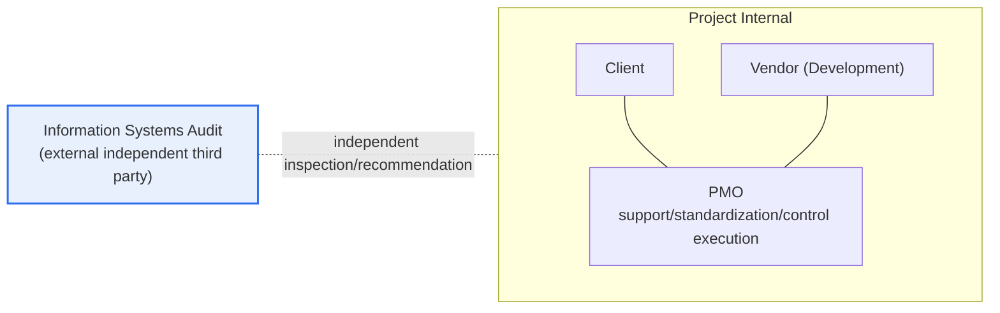
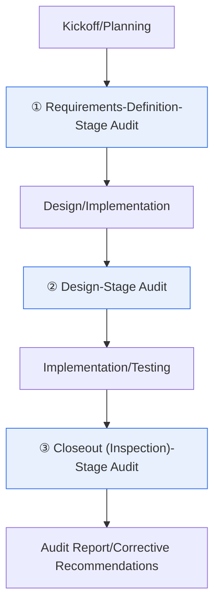

# Information Systems Audit vs. PMO

## 1. Overview

### A. Definition

> **Information Systems Audit (IS Audit)** is an activity in which **a third party with no stake in the client or developer independently inspects and evaluates the appropriateness, quality, and performance of an information system project** and recommends improvements, whereas **PMO (Project Management Office)** is a permanent or temporary organizational function operated from the client organization's internal (or outsourced) perspective to **support, standardize, and control** project management.

Both mechanisms are control means for leading an informatization project to success, but their **positions are fundamentally different**. Audit is closer to a 'referee' that verifies objectively from **outside** the project without any stake, while the PMO is closer to a 'coach' that helps the project team from **inside** the project toward success. This difference in position derives all the differences in purpose, timing, role, and responsibility. If audit diagnoses "is this project being done properly" from an external viewpoint, the PMO executes "how to help it be done properly" from the inside. Therefore, the two must not be mistaken as a 'competitive relationship'; it is accurate to understand them as **complementary dual controls** that lower the risk of project failure from different points.

### B. Background and Necessity

As information system projects grew larger and more complex, the risk of failure (unclear requirements, schedule delays, quality shortfalls, budget overruns) grew alongside, and two branches of approach developed to control it. First, the client found it hard to judge on its own whether the deliverables submitted by the vendor met the requirements. The client usually lacks IT expertise, and the vendor has an incentive to explain its own deliverables favorably, so **objective verification by a disinterested third party** was needed, and this was institutionalized as audit. In Korea, under the "Electronic Government Act" and related notices, audit is mandated for public informatization projects above a certain scale, and the qualifications of audit firms and auditors and the audit procedures and inspection criteria are prescribed.

Second, as a single organization simultaneously carried out many projects, the problem of methodologies, deliverables, and quality standards being inconsistent grew. To manage this with a consistent standard and to reinforce the client's insufficient management capability, the **PMO** took root. In particular, as the 'client-side PMO (outsourced PMO)' that performs project management on the client's behalf spread in the public sector, it functions as a device to raise the client's control power and expertise. In short, audit was born from the 'need for verification,' and the PMO from the 'need to reinforce management capability.'

## 2. Relational Structure and Independence

Looking at the positional relationship of the two functions in a diagram makes the difference clear. The PMO moves together with the client and vendor within the internal project boundary and executes management, while audit takes the deliverables of the project and the PMO together as inspection targets from outside that boundary and verifies them independently.

The key here is the audit's **Independence**. If the auditor directly participates in project execution or PMO work, a **self-review** conflict of interest arises — inspecting what one made or managed oneself — and objectivity collapses. That is why audit must be a third party organizationally and economically separate from the project, and this independence is the very source and reason for being of audit's value. It is also why audit standards strictly regulate the auditor's qualifications, affiliation, and relationship with the vendor.

On the procedural side, audit does not reside throughout the entire project but **intervenes like a snapshot at each major stage**. The flow below shows the progress of a typical three-stage audit (requirements definition, design, closeout).

There is a reason for intervening at each stage like this. You must discover a problem **before** moving on to the next, hard-to-reverse stage, because the correction cost is then lower. If requirements are wrongly defined and design/implementation proceed on that basis, the rework scale grows like a snowball, so audit is designed not as 'after-the-fact pointing out' but as a 'gate inspection just before the stage transition.' It is a long-standing engineering rule of thumb that the later a software defect is discovered, the exponentially higher the correction cost, and audit's per-stage intervention is exactly a device to catch problems at the front of this cost curve.

Audit can be divided into several types by inspection perspective. **Project audit**, which checks whether the project's plans/deliverables meet the requirements and standards, is the basis, and **information security audit**, which checks the appropriateness of security controls, and **database (DB) audit**, which checks data quality/structure, are combined according to purpose. Whatever the type, the auditor judges based on inspection items (checklists) and evidence (deliverables/interviews/demonstrations) and organizes the results as 'compliant/non-compliant/improvement recommendation' in an **audit result report**. What matters here is that audit must be based on predefined criteria and secured evidence rather than subjective impressions, and this evidence-basis underpins the persuasiveness and enforceability of audit findings.

The PMO is also not monolithic. By intensity of involvement, it is divided into **supportive** PMOs that provide only information/advice, **controlling** PMOs that require standard compliance, and **directive** PMOs that directly govern the project. A public client-side PMO is often close to the controlling type in that it exercises the client's control on its behalf. Which type of PMO to place should be decided by the client's management maturity and project risk; placing only a supportive PMO in a low-maturity organization creates a control gap, while placing a directive PMO in a capable organization can create authority conflicts with the business side.

## 3. Comparison of Audit and PMO

Audit and PMO diverge along four axes: purpose, timing, role, and responsibility. In terms of **purpose**, audit lies in verifying quality/appropriateness and recommending improvements, while the PMO lies in supporting and controlling project success itself. Audit's purpose is "confirming whether it is being done well," and the PMO's purpose is "making it be done well" — their orientations differ. In terms of **timing**, audit intervenes at each major stage such as requirements definition, design, and closeout, while the PMO is involved continuously from kickoff to closeout. If audit is a 'point' intervention, the PMO is a 'line' involvement.

In terms of **role**, audit only inspects, diagnoses, and recommends, and does not do the actual execution (setting standards, allocating resources, adjusting schedules). The PMO, by contrast, is an executing body that creates management standards, allocates resources, and directly manages risks/issues. This difference also splits the nature of responsibility. Audit is responsible for its own **independence/objectivity** and the thoroughness of its inspection, while the PMO is responsible for the **project performance** itself (achieving schedule/quality/cost goals). That is, a structure where if audit fails, it bears the responsibility of "verification was poor," and if the PMO fails, it bears the responsibility of "the project failed."

| Category | Information Systems Audit | PMO |
|---|---|---|
| **Position** | Independent third party (external) | Project stakeholder (internal) |
| **Purpose** | Verify appropriateness/quality, recommend improvements | Support/control project success |
| **Timing** | Inspection at major stages (snapshot) | Continuous involvement throughout |
| **Role** | Inspect/diagnose/recommend (no execution) | Standardization/resources/risk management (execution) |
| **Responsibility** | Independence/objectivity/inspection thoroughness | Project performance (schedule/quality/cost) |
| **Basis** | Electronic Government Act/audit standards (notice) | Organizational rules/contracts/PMBOK, etc. |
| **Output** | Audit result report/corrective recommendations | Management plan/standards/progress & risk reports |

Each item in the table ultimately branches from a single axis: "does it verify from outside, or execute from inside." For example, audit not doing execution is because independence breaks the moment it participates in execution, and the PMO being responsible for performance is because it is the body that actually moves resources and schedule within the project.

## 4. Interrelation and Parallel Operation

Audit and PMO are not exclusive but rather complementary. Audit takes even the management plan, deliverables, and control framework established by the PMO as inspection targets and verifies their appropriateness. That is, if the PMO is the body that 'does' management, audit is the body that confirms from outside whether that management 'is done properly.' In large public projects, it is common for the PMO to tightly manage the project internally and for audit to independently verify that management and its deliverables externally, operating together as **two lines of assurance**.

However, parallel operation requires clear principles. First, an auditor must not concurrently serve a PMO role, nor may a PMO audit its own project. This is both a breach of independence and a conflict of interest. Second, roles, authority, and responsibility (R&R) must be **clearly separated in advance** so that audit findings and the PMO's management activities do not conflict. For example, design checks and balances such that the PMO handles the implementation management of the corrective items pointed out by audit, while the final judgment of whether they were implemented is again made by audit. In actual large next-generation system (financial/public) construction projects, it is an established practice to place PMO and audit simultaneously and to specify this boundary in the contract.

Substituting this structure into the 'Three Lines' perspective of internal-control theory makes it easy to understand. The vendor that performs the actual development corresponds to the 1st line, the PMO that manages/controls that performance to the 2nd line, and audit that independently verifies this to the 3rd line. Each line does not replace the preceding line but **reinforces** it. This is why, even with the vendor's own quality activities, the PMO's management control is needed, and even with the PMO's control, audit's independent verification is needed. The moment one line swallows another line's role, the lines of defense shrink to one, and the probability of missing a problem rises accordingly.

Meanwhile, the application of the two mechanisms differs by project scale and nature. A small project is not subject to mandatory audit and bears a heavy cost burden to place a separate PMO, so the client often manages it directly and places only a simple check when needed. Conversely, a public next-generation project on the scale of tens of billions of won commonly operates a resident PMO and three or more stages of audit simultaneously. That is, audit/PMO must be understood not as 'nice-to-have options' but as **risk-control resources deployed in proportion to the size of the project's risk**, and a sense of balance is required — under-deployment creates a control gap, and over-deployment creates cost/administrative burden.

How the two mechanisms mesh and operate can be organized as a single flow. While the PMO controls progress/quality/risk with continuous management activities, audit intervenes at stage-transition points to independently verify the deliverables and issue findings. Then the implementation of the findings enters the PMO's management track again, and whether they were finally implemented is confirmed at the closeout audit. This ideal collaboration model is one in which management (PMO) and verification (audit) mesh alternately to move the project forward.

- **PMO (continuous)**: Establish management standards → control progress/quality/risk → manage implementation of findings
- **Audit (per stage)**: Independent inspection at requirements/design/closeout points → corrective recommendations → final judgment of implementation
- **Interface principle**: Separation of roles/authority (R&R in writing), prohibition of the auditor concurrently serving as PMO, maintenance of the implementation-verification closed loop

It is also worth knowing the typical ways this collaboration fails. Audit pointing out only formal document checks and failing to catch the actual risk; the PMO representing the vendor's convenience rather than the client's and losing its control function; findings remaining only in the report with implementation tracking severed. These failures all converge on the two causes of 'breach of independence' and 'severance of the closed loop,' which is why, in practice, whether **substantive independence and an implementation-tracking framework are alive** is inspected more importantly than the mere existence of the mechanisms.

## 5. Deep Dive — Evolution of Audit/PMO with the Spread of Intelligent Information Technology

As intelligent information technologies such as AI, big data, and cloud enter the center of projects, the traditional ways of audit/PMO are also evolving. Existing audit standards were built on the premise of the structured software development procedure of requirements/design/implementation/testing, but AI projects require new inspection axes of 'data quality' and 'model performance/validity.' Items such as bias/representativeness of training data, model accuracy/explainability, and retraining frameworks cannot be verified by conventional deliverable inspection alone. Accordingly, audit standards themselves are expanding, with the maintenance of **audit guides related to intelligent information technology** that check data/model validity (detailed criteria are frequently revised, so the latest notices/guides must be checked).

The PMO changes too. As Agile/DevOps spread, the role is shifting from a traditional waterfall-type PMO that controlled per-stage deliverables to a **value-delivery-centered PMO (or Agile coach/VMO)** that supports the flow of iterative development and removes obstacles. Here, audit too increasingly needs to adjust from a 'document-completeness'-centered inspection toward one that also looks at 'actually working deliverables and data-based control.' From the professional engineer's perspective, what matters is that even as tools/methodologies change, the essential division of roles — "a PMO that executes from inside and an audit that verifies independently from outside" — must be maintained.

Furthermore, the cloud transition demands a shift in the inspection targets of both audit and PMO. In the on-premises era, hardware procurement/construction deliverables were the center of inspection, but in the cloud, resources are defined as code (IaC) and procured as-a-service, so new axes such as configuration appropriateness, cost optimization, and adherence to the shared-responsibility security model become inspection targets. The PMO continuously monitors pay-as-you-go cost, and audit independently verifies whether cloud security controls and data-sovereignty requirements are met — each role is redefined this way.

In the end, no matter how much the technology environment changes, the principles the two mechanisms must uphold do not change. The PMO, as an executor responsible for performance inside the project, provides consistency and execution power of management, and audit independently verifies the appropriateness of that management and the deliverables from outside the project. New technology changes only the target of 'what to inspect and what to manage'; the skeleton of the role, 'who does it from what position,' must be maintained as-is, or the control framework collapses.

## 6. Considerations and Implications

1. **Securing independence is the lifeblood of audit.** The auditor must be organizationally/contractually separated so as not to be involved in project execution or the PMO, so that objectivity is maintained. If independence is declared only formally while in reality subordinate to the client, audit degrades into a mere formality.
2. **Audit delivers value through early control, not after-the-fact pointing out.** It must intervene as a per-stage gate to discover and correct problems before the hard-to-reverse stage, and there must be a closed loop that even tracks and confirms the implementation of findings for it to be effective.
3. **The R&R of PMO and audit must be clearly separated and put in writing in advance.** In parallel operation, overlapping roles create responsibility gaps or conflicts of interest, so the authority and check-and-balance relationship must be specifically stipulated in contracts/rules.
4. **The client organization's own management capability must be grown together.** Relying entirely on the PMO/audit creates a management gap after the outsourcing ends. The two mechanisms must be designed and operated as means to reinforce, not replace, the client's capability.
5. **Inspection criteria must be updated to fit new-technology projects.** In AI/data-centric projects, new axes such as data quality/model validity/ethics/explainability must be reflected in the inspection items of audit/PMO to eliminate verification blind spots from outdated criteria.
6. **The closed loop of implementation tracking governs effectiveness.** If audit findings remain only in the report and implementation is not tracked, control stops at formality. Nail down in contracts/processes the closed loop of finding → PMO's implementation management → final confirmation at the closeout audit, so that control results in actual improvement rather than a document.

## References

- National Law Information Center, Electronic Government Act (basis for information systems audit): https://www.law.go.kr/
- National Information Society Agency (NIA), guidance on information systems audit: https://www.nia.or.kr/
- PMI, PMBOK Guide (PMO/project governance concepts): https://www.pmi.org/

---

> **In one line**: Audit is a mechanism where *an external third party independently verifies and recommends on the appropriateness of a project*, and the PMO is a mechanism that *supports, standardizes, and controls the project from inside*; they differ in position, purpose, timing, role, and responsibility but complement each other as dual assurance in large projects, and their premise is always the audit's separation for independence and a clear division of roles.
