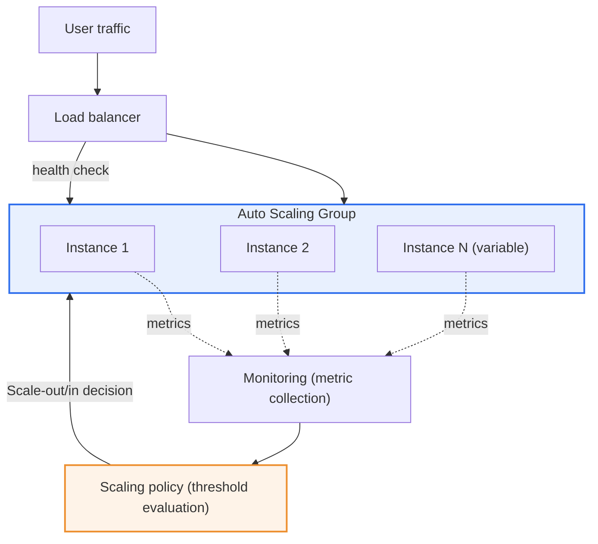
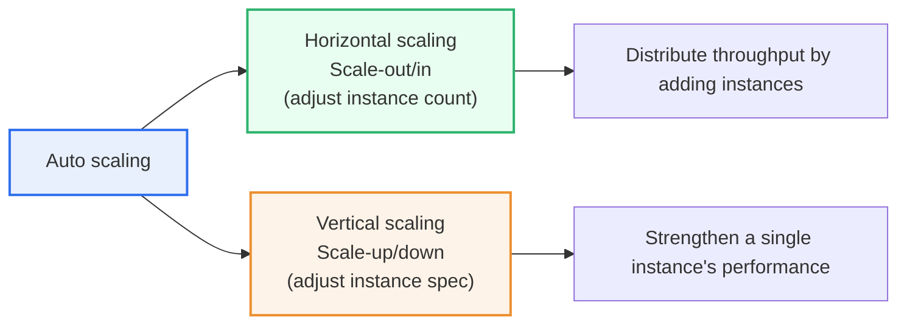

# Auto Scaling

## 1. Overview

### A. Definition
> A cloud operations technology that **automatically increases (scale-out/up) or decreases (scale-in/down) computing resources** in response to changes in load (traffic and resource utilization), thereby optimizing a service's performance, availability, and cost at the same time.

Auto scaling is regarded as a core value of the cloud because it is the mechanism that actually realizes the **elasticity** the cloud promises. Elasticity is the ability to scale resources up and down to match demand; without automation this is practically impossible, since a person would have to watch metrics day and night and turn servers on and off by hand. Auto scaling delegates this judgment and execution to rules (policies), matching resources to demand in real time without human intervention.

### B. Background and Necessity
Capacity planning in the on-premises (in-house data center) era carried a fundamental dilemma. Because a server, once purchased, is a fixed asset used for several years, administrators had no choice but to buy servers generously based on **peak traffic**. As a result, most resources sat idle and wasted during normal times; conversely, if forecasts were set conservatively low, the service went down when events or marketing drove a surge of traffic. In other words, there was no escape from the dichotomy of "**either waste or outage**."

Auto scaling resolves this dilemma head-on. When traffic surges, it automatically adds resources to prevent outages; when things quiet down, it reduces them to save cost. In short, it finally completes the benefit of cloud pay-as-you-go: "**use only what you need and pay only for what you use**." For example, even when an e-commerce platform faces more than ten times its usual traffic during a big event such as Black Friday or Singles' Day, instances scale out automatically within minutes to endure it, and during the small hours they shrink to a minimum count to cut cost. Netflix absorbing spikes in viewing at certain times through automatic scaling, or Korean university course-registration systems preparing for the opening-moment rush with scheduled scaling, are representative examples.

### C. Characteristics
Auto scaling has the characteristics of ① metric-based **automation**, ② **bidirectionality** in scaling up and down, ③ **declarativeness** in defining behavior through policy, and ④ a **high-availability orientation** achieved by combining load balancers and health checks. In particular, because it does not merely "add more when there is more" but filters out and even replaces abnormal instances via health checks, auto scaling is both a scaling tool and a resilience tool that realizes **self-healing**.

## 2. Overall Structure and Operating Principles

The operation of auto scaling becomes clear when understood as a single **closed-loop control**. First, the monitoring system periodically collects metrics such as CPU, memory, request count, and response time for each instance. The collected metrics are compared against the thresholds defined by the scaling policy, and when the conditions are met, a command to add or remove instances is issued to the Auto Scaling Group (ASG). New instances are cloned identically from a predefined template (machine image and startup script), automatically registered with the load balancer, and begin receiving real traffic only after passing the health check. As this cycle runs without pause, the scale of resources follows demand.

Four components are central to this structure, and each needs to be understood by breaking it down.

**A. The Auto Scaling Group (ASG)** enforces a safe resource range with three boundary values: minimum count, desired count, and maximum count. The minimum count is the lower bound of availability to always maintain even when there is almost no traffic; the desired count is the target count currently to be maintained; and the maximum count is the upper bound that prevents cost and failure runaway. Without these three values, auto scaling easily becomes uncontrollable. For example, setting the minimum to 2 guarantees non-stop operation because at least one instance survives even if one dies, and setting the maximum to 20 prevents the bill from ballooning indefinitely even under abnormal load.

**B. The load balancer (LB)** distributes traffic evenly across the increased instances and immediately removes from the target pool any instance that fails a health check. Without a load balancer, even if you add instances, traffic concentrates on a single machine and horizontal scaling does not hold. The load balancer is, in effect, the physical premise of horizontal scaling.

**C. The launch template** ensures that any instance is instantly cloned with the same machine image, software, and initialization script. Thanks to this, a newly launched instance behaves exactly like existing ones, and the outcome of scaling becomes predictable. If settings differ from instance to instance, unexpected errors arise with each scaling event, so the principle of immutable infrastructure is important here.

**D. Monitoring and health checks** collect metrics to provide the basis for policy decisions and detect abnormal instances to trigger their replacement. This element is what makes auto scaling not a mere scaler but a self-healing system.

Let us summarize the operation with a simple numerical example. Under a target-tracking policy that says "maintain an average CPU of 50%, where 100% CPU per instance = 100 RPS handled," a normal 400 RPS is handled by 8 instances (50 RPS each). If traffic triples to 1,200 RPS, the system increases the count to about 24 to maintain the 50% target, and when it drops back to 400 RPS it scales back down to 8. This automatic convergence of instance count in proportion to load is the essence of auto scaling.

## 3. Scaling Types — Horizontal Scaling and Vertical Scaling

There are two different directions of scaling, and which one you choose governs the architecture design.

**Horizontal scaling (scale-out/in)** increases or decreases the "number" of instances of the same specification. Because requests are split and handled across multiple machines, capacity can be adjusted non-stop without halting the service, and its greatest advantage is that it scales without limit in theory. This is why large-scale web and API services adopt horizontal scaling almost without exception. However, it absolutely requires a load balancer to distribute requests across the instances, and a **stateless** design that does not store state such as sessions or files on any particular server. If state is bound to a specific server, data is lost when that server disappears during a scale-in.

**Vertical scaling (scale-up/down)** increases or decreases the CPU/memory specification of a single instance itself. It has the advantage of simple implementation, since you only raise the spec without changing the application structure; however, changing the spec usually requires a restart, causing momentary interruption, and it ultimately runs into the limit of the maximum specification a single physical machine can provide.

For this reason, vertical scaling is often used in a limited way at stateful layers, such as relational databases, where horizontal distribution is difficult. Because the data must be gathered in one place, it is hard to increase the instance count, so one endures by first raising the spec. In practice, a hybrid strategy is common that combines horizontal scaling for the web/app layer and vertical scaling (or adding read replicas) for the DB layer, and whether the layer is stateful or stateless determines which to automate.

| Type | Method | Advantages | Constraints | Suitable layer |
|---|---|---|---|---|
| **Horizontal scaling** | Increase/decrease instance count | Non-stop, high availability, virtually unlimited scaling | Requires stateless design and load balancer | Web, API, workers |
| **Vertical scaling** | Increase/decrease instance spec | Simple to implement, no app changes | Requires restart, physical upper limit | DB, legacy single servers |

## 4. Scaling Policies — When to Scale

What determines when and how much to adjust is the scaling policy, and the sophistication of the policy determines the effectiveness of auto scaling. Policies fall broadly into three branches.

**Dynamic policy** is the most common approach, adjusting resources in real time when a metric such as CPU utilization, requests per second (RPS), or response latency exceeds or falls below a threshold. For example, one might set a rule like "if CPU average stays above 70% for 3 minutes, add 2 instances; if it stays below 30% for 10 minutes, remove 1." Beyond simple thresholds (step scaling), the **target-tracking** approach—where you specify a target value and the system adjusts the count on its own—is widely used, and because you only need to give a goal like "always keep CPU near 50%," as with a thermostat, it is simple to operate.

**Predictive policy** uses machine learning to learn past traffic patterns and proactively prepares resources 'before' load rises. Because dynamic policy is inherently reactive—responding 'after' load has risen—there is a delay equal to the preparation time; predictive policy moves this delay forward, reducing momentary outages at the onset of a spike. It is especially effective for services with a clear cyclical pattern that repeats weekly (e.g., a surge during weekday commute hours).

**Scheduled policy** secures capacity in advance to match events whose timing is already known, such as "business start at 9 a.m. daily," "month-end settlement batch," or "10 minutes before course registration opens." For patterns so obvious that no prediction is needed, scheduled policy is the most certain. When a second-by-second rush is expected, as with a ticket-sales opening, dynamic policy alone cannot scale out fast enough to keep up with the rush, so scaling up in advance via scheduling is essential.

In practice, rather than using these three policies exclusively, the standard is to **overlay** them—setting a baseline scale with scheduling, moving the curve forward with prediction, and correcting the error with dynamic scaling. Relying on any single one leaves blind spots, but layering the three lets you absorb known patterns, learned patterns, and unexpected fluctuations all at once.

| Policy | Decision basis | Characteristics | Typical use |
|---|---|---|---|
| **Dynamic** | Metric threshold / target value | Reactive, general-purpose | Handling constant traffic fluctuation |
| **Predictive** | ML demand forecasting | Proactive, reduces delay | Services with cyclical patterns |
| **Scheduled** | Known timetable | Preparing for fixed events | Batches, opening runs, business hours |

## 5. Comparison — Auto Scaling vs. Manual Provisioning, and Its Relation to Serverless

To understand the value of auto scaling, one must compare it with the alternatives. **Manual provisioning** is the approach where an administrator looks at metrics and adds servers directly; it offers high flexibility of judgment but struggles to respond immediately to surges at night or on weekends, and human error and delay intervene. Auto scaling, by contrast, is consistent and fast in its response, but if the policy is poorly designed, **flapping**—repeated unnecessary scaling out and in—can occur. The fundamental reason this difference arises lies in "whether the decision-maker is a human or a rule," and the practical implication is clear: it is optimal to **automate repetitive loads with well-defined rules and have humans intervene only in exceptional situations that require judgment**.

Meanwhile, the relationship with serverless (FaaS, e.g., AWS Lambda) must also be noted. Whereas traditional auto scaling adjusts by 'instance (virtual server) unit' over the span of minutes, serverless scales from zero on a 'per-request' basis in milliseconds to seconds. In other words, serverless can be seen as an extreme fine-graining of auto scaling.

However, serverless has constraints on execution time and state retention, and there is cold-start latency when an instance must be launched anew after a long period without requests. Therefore, for large services that run continuously and are sensitive to response latency, instance/container-based auto scaling is often still more cost-effective. The selection criteria are "how intermittent is the traffic" and "how long is the processing time per request." Intermittent, one-off tasks favor serverless, while continuous, high-volume traffic favors auto scaling, and in practice a hybrid configuration using both is also common.

## 6. Deeper Dive — Kubernetes Auto Scaling and Recent Trends

As containers and Kubernetes became standard, auto scaling evolved into a more fine-grained and multi-layered form. Kubernetes provides three tiers of automatic scaling. **HPA (Horizontal Pod Autoscaler)** is horizontal scaling that increases the number of pods (container groups) according to metrics; **VPA (Vertical Pod Autoscaler)** is vertical scaling that adjusts the CPU/memory request allocated to a pod; and the **Cluster Autoscaler (and Karpenter)** expands the node pool when the nodes (virtual servers) on which to place pods run short. That is, scaling at the application unit (pod) and the infrastructure unit (node) interlock hierarchically.

A recently notable trend is **event-driven autoscaling (KEDA, Kubernetes Event-Driven Autoscaling)**. Whereas the existing HPA mainly reacted to resource metrics such as CPU and memory, KEDA scales by reacting directly to **business metrics** such as the backlog in a message queue, Kafka consumer lag, or event-stream length. For example, when messages pile up in an order-processing queue it immediately increases consumer pods, and when the queue empties it scales down to zero. This is a shift in thinking—matching resources to 'the amount of actual work to be done, not the resources'—and it realizes serverless-like efficiency in a container environment.

In addition, from a FinOps (cloud cost optimization) perspective, approaches are spreading such as combining time-series forecasting and reinforcement learning with predictive scaling, multi-cloud scaling that chooses where to scale by jointly considering cost and availability across multiple clouds and regions, and mixed strategies that prioritize spot instances to lower cost. Auto scaling is now shifting in standing beyond simple scaling to **intelligent resource orchestration that simultaneously optimizes performance, availability, and cost**.

## 7. Considerations and Implications

From an engineer's perspective, the points to consider when adopting and operating auto scaling are as follows.

1. **Stateless design is the absolute prerequisite for horizontal scaling.** If sessions, uploaded files, or caches are stored locally on a specific instance, data is lost on scale-in and user sessions are severed. State should be separated into external stores such as Redis, a DB, or object storage, and applications should be designed on the "disposable (cattle, not pets)" principle so that it does not matter when they die. This is an up-front architectural investment for auto scaling.

2. **Warm-up time and flapping must be controlled together.** Because it takes tens of seconds to several minutes for an instance to launch and begin receiving traffic, thresholds and scale-out timing must be set with margin so as not to fall behind a surge. At the same time, to prevent flapping—where scale-in and scale-out repeat at short intervals—a cooldown period and hysteresis (a buffer zone) must be provided. "Scale out fast, scale in slow" is the rule of thumb for stable operation.

3. **Cost caps and runaway protection must be built into policy.** Auto scaling reacts not only to traffic surges but also to abnormal load caused by DDoS attacks or application bugs, potentially increasing resources without limit, which comes back as an unexpected bill. It must be designed so that "for bad traffic, block rather than scale" operates, through a maximum-count limit, cost alerts, and integration with a WAF and rate limiting.

4. **Observability and metric selection determine success or failure.** Looking only at resource metrics like CPU may diverge from actual user experience (response latency, error rate). Metrics suited to the service's characteristics—queue length, RPS, p95 latency—must be chosen, and a feedback loop that continuously observes and tunes scaling decisions and outcomes is needed. If the metrics are inaccurate, auto scaling can instead amplify outages.

5. **It must be linked with disaster recovery and multiple availability zones.** Distributing an Auto Scaling Group across several availability zones (AZs) keeps availability by automatically making up the count in other zones even during a single data-center failure. Auto scaling should be integrated in the design as a core axis of a high-availability, self-healing architecture, beyond being a scaling tool.

## References
- AWS, "What is Amazon EC2 Auto Scaling?" — https://docs.aws.amazon.com/autoscaling/ec2/userguide/what-is-amazon-ec2-auto-scaling.html
- Kubernetes, "Horizontal Pod Autoscaling" — https://kubernetes.io/docs/tasks/run-application/horizontal-pod-autoscale/
- KEDA, "Kubernetes Event-driven Autoscaling" — https://keda.sh/docs/latest/concepts/

---

> **In one line**: Auto scaling is a cloud elasticity technology that automatically scales resources (horizontally and vertically) according to load to *simultaneously optimize performance, availability, and cost*; premised on stateless design and load balancing, it overlays dynamic, predictive, and scheduled policies, and it is evolving into intelligent resource orchestration as it is fine-grained through Kubernetes HPA/VPA, KEDA, and serverless.
