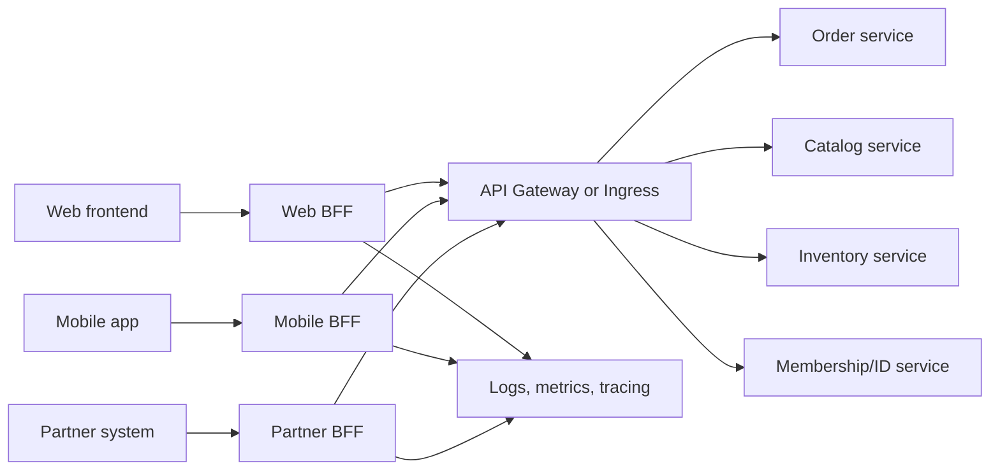
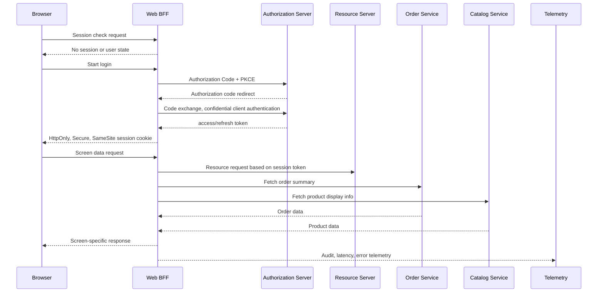

# The BFF (Backend for Frontend) Pattern and Browser OAuth Security

## 1. Overview

### A. Definition

> **BFF (Backend for Frontend)** is an architectural pattern that places a dedicated backend layer for each client that provides a different user experience—such as web, mobile, or external partners—and performs the data composition, transformation, security, and performance optimization that the client needs.

The core of BFF lies in moving away from the notion of "providing one general-purpose API to all consumers" and designing the server-side API to match the boundaries of the user experience. A mobile application must conserve battery and network costs, while a web application may require rich, screen-level data and fast initial rendering. External partners do not need to know the domain structure of internal services and may need old contracts maintained for a certain period. When the same backend tries to satisfy all of these requirements, conditional branches and version forks keep multiplying.

BFF sits between the frontend and internal domain services, but it is not a layer that replaces the business rules of internal domain services. BFF calls several services to build the read model needed for a screen, responds in a format the client can easily understand, and applies per-client authentication, session, and cache policies. Invariants of core business operations—such as order approval, inventory deduction, and payment confirmation—must be owned by the order, inventory, and payment domains.

The Microsoft Azure Architecture Center describes BFF as a pattern of creating a backend service per interface instead of sharing one general-purpose backend across multiple frontend interfaces ([Microsoft Azure Architecture Center](https://learn.microsoft.com/en-us/azure/architecture/patterns/backends-for-frontends)). Sam Newman describes it as a single-purpose edge service tightly coupled to a specific user experience, noting that when the UI team co-owns the BFF, it becomes easier to coordinate UI and API changes together ([Sam Newman, Backends For Frontends](https://samnewman.io/patterns/architectural/bff/)).

### B. Background and Necessity

In a monolithic system, a single server handles both screen generation and business processing, so differences in per-client requirements can be hidden inside the code. However, once microservices are introduced, drawing a single screen requires calling the catalog, pricing, inventory, shipping, and membership services individually. If the client comes to know this call graph directly, the addresses and data models of internal services harden into an external contract, and every client ends up redundantly implementing network latency and failure handling as well.

A general-purpose API looks highly reusable at first. But when web, mobile, kiosk, and partners use the same endpoint, one consumer's request to add a field affects another consumer's response size and security scope. When the server tries to accommodate every consumer's needs, parameters like `includeMobileFields`, `legacyVersion`, and `compact=true` accumulate, and the meaning of the API changes depending on the caller. BFF isolates such variation within the client boundary.

In addition, browser-based applications must decide where to store OAuth tokens and how to refresh them. If the browser's JavaScript manages tokens directly, the risk grows that malicious scripts, browser extensions, or supply-chain attacks can access the tokens. IETF RFC 10017, published in August 2026, compares three patterns—including BFF—as best practices for OAuth 2.0 in browser applications, and strongly recommends the BFF architecture for sensitive business and personal-data applications ([IETF RFC 10017](https://datatracker.ietf.org/doc/rfc10017/)).

### C. Goals and Scope

The goals of BFF can be summarized as follows.

1. Optimize responses to the data shape and call count the client needs.
2. Hide internal services' addresses, topology, and domain models from the client.
3. Perform screen-level aggregation and transformation on the server to reduce client complexity.
4. Increase per-client release speed and the level of failure isolation.
5. Consistently enforce session, token, audit, and abuse-prevention policies between the browser and the resource server.

That said, BFF is not a mandatory layer to add to every application. If there is only one client and the API requirements are simple, or if GraphQL's per-frontend resolvers and schema already solve the problem sufficiently, or if an API gateway alone meets the routing, authentication, and transformation needs, the added operational cost of BFF can exceed its benefit.

## 2. Overall Structure and Operating Principles

### A. Logical Architecture

In the structure above, each BFF is regarded as a server-side part of a specific user experience. The Web BFF handles the aggregation and session processing needed by browser screens, and the Mobile BFF condenses responses or combines calls to fit small screens and unstable networks. The Partner BFF transforms internal services' domain models to match partner contracts and applies per-partner rate limits and version policies.

An API gateway can be placed behind BFF, but the two layers are not the same concept. A gateway is a platform layer that serves as the entry point for multiple APIs and performs routing, common authentication, rate limiting, and TLS termination. BFF is a product- or domain-adjacent layer that designs an API tailored to one experience's needs and performs aggregation and transformation. Depending on the organization, one product may perform both roles, but responsibilities must be separated in documentation to prevent it from becoming an all-purpose middleware during operation.

### B. Processing Flow of a Screen Request

In the first step, the browser calls the BFF's session-check endpoint. If there is no active session, the BFF starts the Authorization Code flow with the authorization server. In RFC 10017's BFF model, the BFF is a confidential OAuth client acting on behalf of the browser, and it associates access and refresh tokens with a server-side session without exposing them to browser code.

After login, the browser does not pass the token directly to each API but sends a session cookie to the BFF. After validating the cookie, the BFF uses the server-side stored token to make requests to the resource server. The cookie must apply HttpOnly, Secure, and an appropriate SameSite policy, and must be operated together with a CSRF-defense token or same-origin validation. Using a cookie does not automatically make CSRF disappear.

For a screen data request, the BFF can call multiple downstream services in parallel. It can build a screen model by combining an order identifier from the order service with a product name from the catalog service, and it can be designed so that if inventory is slow, the inventory status is marked separately or a cached value is used. However, decisions that require strong consistency—such as payment amounts and inventory deduction—must call the domain service's command API rather than being simple aggregation.

### C. BFF's Responsibility Boundary

The responsibilities BFF takes on are transformation, aggregation, and protection limited to the client experience. For example, adjusting the page size of a mobile list screen, combining data from several services into a single DTO, and removing unused fields are BFF's responsibility. Converting internal error codes the client does not understand into states suited to the user experience can also be done in the BFF.

On the other hand, price-calculation rules, order state transitions, the final authorization decision, and the atomicity of inventory reservation must be owned by the domain services. If BFF duplicates this business logic, the rules of the web and mobile BFFs diverge, and a policy change in a service fails to propagate to all BFFs. In an engineering exam answer, one should not use the principle that "BFF is kept thin" as a mere slogan but should explain which logic to place in which layer based on invariants and the party responsible for changes.

## 3. Key Components and Design Principles

### A. Client-Specific APIs and Data Composition

A BFF API is designed around screens or user journeys instead of exposing internal services' endpoints as-is. For example, `/mobile/home` can combine recommendations, recent orders, and delivery notifications into a single response for a mobile screen. Since the response is tailored to the screen's rendering needs, it does not serialize the internal Catalog object as-is but selects only the necessary fields and disclosure level.

Aggregation must distinguish sequential calls from parallel calls. Mutually independent catalog and inventory lookups can be parallelized, but if the second request needs the result of the first, a sequential flow is unavoidable. Parallelization can reduce total latency but may increase the number of downstream calls, so connection pools, timeouts, and concurrency limits must be designed together.

How to represent partial failure of downstream services is also important. If the order-history screen can be shown even when the recommendation service fails, the BFF distinguishes priorities between core data and optional data. Conversely, if exchange-rate or payment-method validation fails on a payment-approval screen, it must not return a "partial response" but must provide a clear retry or alternative path.

### B. Caching and Response Optimization

BFF can apply different cache keys and freshness requirements per client. Public product descriptions can be cached at a CDN or reverse proxy, but per-user order status must include user, permission, and region in the key. To keep personal data from mixing into cached responses, inspect `Cache-Control: private` and storage locations, and set the retention periods of logs and caches according to data classification.

Screen-aggregation responses may combine sources of differing freshness. If prices refresh every minute and product descriptions change once a day, one should design a cache strategy per data attribute rather than arbitrarily setting a single overall TTL. When using cache-invalidation events, consider event loss, order reversal, and per-region propagation delay, and ensure the cache does not become the sole basis of business integrity.

Optimization for mobile networks does not stop at merely making JSON smaller. It means sending only the necessary fields, reducing multiple round trips to a single aggregation call, applying pagination and compression, and distinguishing retryable read requests from command requests that must not be retried. Removing internal fields not shown on the screen helps not only performance but also data minimization.

### C. Errors, Timeouts, and Retries

BFF's overall timeout must be shorter than or equal to the sum of downstream call timeouts. If the upstream request's deadline is not propagated to downstream calls, a client request that has already given up on a response keeps occupying internal resources. For example, if the budget for a screen request is 800 ms, one must not set an unbounded 1-second timeout on each of the order, catalog, and inventory calls.

Retries are limited to idempotent lookups or commands with an explicit idempotency key. Automatically retrying a payment request solely on a network error can cause a duplicate approval in a situation where the payment succeeded on the server but only the response was lost. The BFF must verify the domain service's idempotency contract and configure retry count, backoff, jitter, and circuit breaking together.

Downstream errors must be surfaced without hiding their cause, while keeping the client contract stable. Do not return internal stack traces or secrets in the response; instead return a correlation ID so operators can find the logs. Distinguishing HTTP status codes, domain error codes, and retryability keeps clients from performing meaningless infinite retries.

### D. Authentication, Authorization, and Sessions

Authentication is the process of confirming who the user is, and authorization is the process of deciding whether that user may use specific data and functions. Even if the BFF performs OAuth authentication, order-lookup permission and administrator-function permission are not automatically granted. The BFF confirms the session's user, client, scope, and target resource, and the domain service must also re-verify permissions within its trust boundary.

When issuing a session cookie to the browser, the cookie's lifetime must align with the server-side session and refresh-token lifetime policy. Logout must include not only deleting the browser cookie but also destroying the server session, revoking the refresh token when necessary, and recording the related audit entry. How to handle already-issued sessions during key rotation and token expiry should be defined in a runbook.

Because BFF is a security boundary between the external browser and internal resource servers, it inspects for SSRF, open redirects, host-header attacks, request-size bombs, header injection, and session-fixation attacks. Do not let client input directly determine the proxy target URL; restrict it via a server-side mapping to allowed resources and paths.

### E. Observability and Auditing

Because BFF is the point where a single user request fans out into multiple downstream calls, it must maintain trace IDs and span relationships. Collect as key metrics the total latency, per-downstream-service latency, aggregation failure rate, cache hit rate, token-refresh failures, increases in 401/403, and response size. Looking only at the BFF's 200 ratio may miss partial successes where some data is missing.

In logs, do not record the user identifier in plaintext; record only a pseudonymized correlation ID and the minimum necessary attributes. Remove sensitive information such as access tokens, refresh tokens, cookie values, and resident registration numbers from logs, traces, and error responses. Audit logs must be able to trace who accessed which protected resource, when, and with which client, but must not become a store that duplicates the plaintext of the accessed data.

## 4. Application Approaches and Comparison

### A. BFF and API Gateway

An API gateway is an organization-wide entry point with strengths in standardizing routing, TLS termination, certificate policy, rate limiting, WAF integration, API keys, and usage metering. BFF, by contrast, has strengths in data composition and API contracts for a specific user experience. If the gateway takes on all screen composition, changes concentrate on the central team, and if BFFs redundantly implement all common security functions, policy deviations arise.

The two are not so much alternatives as they are layerable in combination. External requests receive basic network and platform controls at the API gateway, undergo session handling and screen-data composition at each client's BFF, and then have domain permissions and business invariants verified at the internal services. However, create a responsibility matrix so that duplicating the same authentication, rate-limiting, and observability functions across multiple layers does not make it unclear which policy is ultimately applied.

### B. BFF and GraphQL

GraphQL lets the client query the fields it needs and compose multiple sources via resolvers, solving some of BFF's problems. Running a single schema with a per-frontend resolver system well can reduce the number of separate BFF services. However, GraphQL must still solve authentication/authorization, query-complexity limits, N+1 calls, caching, schema changes, and observability, and a GraphQL server can in effect play the role of a BFF.

The choice between BFF and GraphQL is a matter of organization and boundaries, not protocol preference. If multiple clients traverse a single domain graph and field selectivity matters, GraphQL can be advantageous. If per-client security boundaries and deployment cycles differ greatly, or partner contracts must be maintained independently, separating out a BFF can be clearer. Microsoft's documentation likewise advises that if GraphQL's frontend-specific resolvers are sufficient, a BFF may not add value ([Microsoft BFF pattern guidance](https://learn.microsoft.com/en-us/azure/architecture/patterns/backends-for-frontends)).

### C. BFF vs. Direct Calls and a General-Purpose Backend

If clients call internal microservices directly, there is the advantage of fewer intermediate hops, but internal topology exposure, call-graph duplication, per-service authentication implementation, and failure-handling deviation grow. In particular, exposing internal services' addresses and OAuth tokens to the browser can widen the attack surface. Conversely, a single general-purpose backend is simple and easy to operate in an early system with few services, but as per-consumer needs grow, bottlenecks and coupling can increase.

BFF provides a server boundary per user experience between these two extremes. However, adding BFF increases the number of network hops and deployment units. Therefore, the number of clients, difference in requirements, complexity of internal calls, security level, team ownership, and level of operational automation should serve as the decision criteria.

| Comparison item | Direct calls | General-purpose API backend | BFF | GraphQL-centric |
|---|---|---|---|---|
| API optimization unit | Client code | Common to all consumers | Per user experience | Per query/resolver |
| Internal-topology hiding | Low | Medium | High | High |
| Screen aggregation | Duplicated in client | Centralized | Per-experience aggregation | Resolver composition |
| Number of operational services | Few | Few to medium | Proportional to client count | Platform-centric |
| Independent client deployment | High | Low | High | Schema policy needed |
| Main risk | Security / duplicate calls | Bottleneck / over-generalization | Operational cost / duplication | Query explosion / complexity |

The differences in the table arise less from the number of features than from the direction of change. With direct calls, change responsibility scatters across each client; with a general-purpose backend, change responsibility concentrates in one team. BFF places responsibility with the team close to the client at the cost of the number of BFFs and their operating cost. GraphQL gains flexibility in call shape at the cost of strengthening the governance of schema and resolvers.

## 5. Application Cases and Adoption Procedure

### A. E-commerce Mobile/Web Case

Assume an e-commerce service has web, mobile, and partner channels. The web product-detail screen requires high-resolution images, a recommendation list, a review summary, and an estimated delivery date, whereas mobile may need only the representative image and the core price, considering limited data usage and a small screen. Partners must not see internal recommendation algorithms or member attributes and should use only the contracted product and inventory fields.

The Web BFF calls the product, review, recommendation, and shipping services to build the screen model. The Mobile BFF reduces image sizes and fields and combines multiple read requests into one. The Partner BFF applies per-partner API keys or OAuth clients and quotas, and converts internal product status into the disclosure status of the partner contract. Doing so maintains a stable per-experience contract for each consumer even when internal services change.

For example, if the goal for the web home screen is a p95 of 700 ms, the BFF can parallelize downstream calls and provide a fallback path that returns only product information when recommendations fail. This is a hypothetical goal for illustration; actual SLOs must be set from user behavior and a measured baseline. Flows that cannot tolerate failure, such as payment approval, must not apply the same partial-success policy as a recommendation screen.

### B. OAuth Case for a Browser-Based Business System

Suppose that in a public-sector or financial business system, a browser SPA calls a personal-data API. If the browser code stores access and refresh tokens directly, the tokens can be exposed via XSS or a malicious dependency. The BFF communicates with the authorization server as a confidential client and manages server-side sessions and tokens. The browser calls the BFF with an HttpOnly session cookie, and the BFF passes the access token to the protected resource server.

RFC 10017 distinguishes among the BFF, the token-mediating backend, and the browser-based OAuth client. In BFF, the backend relays all API interactions and does not expose tokens to the browser; the difference is that a token-mediating backend passes tokens for the browser code to use. One must compare protection level and implementation complexity to make a choice suited to the sensitivity of the business.

Adopting BFF does not make XSS and CSRF disappear. XSS can use the session to make requests on the user's behalf, and CSRF can abuse cookie-based authenticated requests. Apply content security policy, output encoding, dependency inspection, SameSite settings, CSRF tokens, Origin validation, re-authentication, and anomaly detection in layers.

### C. Phased Adoption Procedure

1. **Survey consumers and change history**: Catalog per-channel API calls (web/mobile/partner), data requirements, release cycles, and past incidents.
2. **Define boundaries and owners**: Decide the experiences the BFF will handle, the responsibilities of the domain services, and the common functions of the API gateway.
3. **Select a read-centric pilot**: Start with dashboards and product lookups, which isolate failures more easily than payment or inventory commands.
4. **Design the contract**: Define client-specific DTOs, version policy, error model, pagination, field sensitivity, and deprecation policy.
5. **Measure the performance baseline**: Compared with direct calls and the existing general-purpose API, measure p50/p95/p99, call count, payload, and CPU/memory.
6. **Design security**: Reflect OAuth client type, PKCE, session cookies, CSRF, token storage, log masking, and permission verification in the threat model.
7. **Build observability**: First establish trace-context propagation, per-downstream spans, error/partial-success classification, and user-impact metrics.
8. **Gradual migration**: Migrate a subset of users first via feature flags or routing weights, and roll back based on error, latency, and security events.
9. **Ownership transfer and operational automation**: Formalize the UI team's and BFF team's deployment, on-call, vulnerability-patch, and cost responsibilities.
10. **Re-evaluate expansion**: Confirm whether per-client requirement differences actually persist, and do not increase similar BFFs unnecessarily.

## 6. Deeper Dive — RFC 10017 and the Security-Oriented BFF

IETF RFC 10017 is RFC 10017 (BCP 212), issued as a Best Current Practice in August 2026. The document organizes the threats and security recommendations for browser-based OAuth applications and describes BFF not as a simple data-aggregation pattern but as an OAuth client boundary between the browser and protected resources ([IETF Datatracker, RFC 10017](https://datatracker.ietf.org/doc/rfc10017/)).

The three core responsibilities of BFF that RFC 10017 presents are clear. First, the BFF interacts with the authorization server as a confidential OAuth client. Second, the BFF stores access and refresh tokens in the server-side context of a cookie-based session, not exposing them directly to the browser application. Third, the BFF relays browser requests to the protected resource server while adding the correct access token.

This recommendation extends the existing understanding of BFF as an "aggregation API for mobile screens" into a security architecture. In an engineering exam answer, it is best to describe BFF not as a simple proxy but as a boundary that simultaneously performs per-client API contracting and server-side token/session protection. However, because the security effect of BFF depends on implementation quality, controls against session hijacking, CSRF, SSRF, open redirects, and log leakage must be present as well.

Even when a browser application must perform OAuth directly as a public client, applying Authorization Code + PKCE, minimizing token storage, and defending against browser-based attacks are important. BFF is not always feasible, so one must compare real-world constraints such as network configuration, deployment model, privacy impact, user experience, and token lifetime. Do not misread the RFC's recommendation as a mandate to adopt a product; connect it to the threat model and business risk.

## 7. Considerations and Implications

### A. Balancing Performance and Cost

BFF can reduce round trips through aggregation but creates server-side downstream calls and an additional network hop. One must verify through load testing that connection pools and threads do not exhaust as the call count grows, and that downstream fan-out does not amplify failures. Do not look only at average latency; evaluate p95/p99 and user-journey completion rate together.

Each BFF needs its own runtime, deployment pipeline, security patching, monitoring, and on-call operation. As the number of clients grows, increasing the number of services linearly is not always the answer. Clients with similar requirements can share a single BFF, but forcibly bundling differing requirements recreates the bottleneck of a general-purpose backend, so document the sharing criteria.

### B. Duplication and Responsibility Boundaries

Similar downstream-call code can appear in each BFF. Building common libraries and a central BFF to eliminate all duplication reduces the advantage of independent deployment. Share stable authentication, tracing, and error-handling libraries, but divide boundaries so that each BFF owns the client experience's composition rules and UI contract.

If domain business logic enters the BFF, the risk grows that web and mobile results diverge. Record in ADRs and API contracts the invariants the domain service must guarantee, the presentation transformations BFF may perform, and the display logic the client is responsible for. During change review, too, judge by the owner of the business rule rather than by the location of the code.

### C. Security and Privacy Protection

BFF is a concentration point through which sensitive tokens and personal data pass. Operate session-store encryption, key rotation, access-permission separation, secret management, audit logs, vulnerability patching, WAF, and rate limits together. Regularly check that a per-user response cache is not served to another user and that error and trace data do not contain plaintext personal data.

Browser cookie-based sessions require CSRF defense and session-fixation prevention. Do not assume that `SameSite` alone solves all browsers and integration scenarios; combine Origin/Referer validation and CSRF tokens according to risk level. Allow only exactly pre-registered values for OAuth redirect URIs, reject state and PKCE validation failures, and block open redirects on the login/logout endpoints.

### D. Availability and Failure Isolation

If a BFF becomes a single common backend for both web and mobile, it can itself become a central point of failure. If the reason for separating per-client BFFs is failure isolation, then deployment, cache, session store, autoscaling, and on-call must actually be separated too. Check that a single shared database or common message bus is not tying all BFFs together at once.

Distinguish screens that may allow partial success from business operations that must fail entirely. Recommendations, ads, and reviews may allow fallback responses, but payment amounts, permissions, and inventory reservation must not be replaced with an arbitrary cache or an empty value. Design per-feature fallback based on an error budget and user-impact grades, and verify it with chaos testing and recovery drills.

### E. Observability and Contract Testing

BFF contract testing must verify that the response structure and error semantics the client expects are preserved. Include downstream services' consumer-driven contracts, schema-compatibility checks, and sample-response-based regression tests in CI. If scenarios that include aggregation order and partial failure are not tested, testing becomes shallow, confirming only normal responses.

Observability must show the call graph expanded through the BFF. Connect trace IDs with client error responses without exposing tokens or personal data, and trace the path by which downstream-service latency leads to screen latency. Define SLOs not only per BFF unit but also per user journey and core function.

### F. Adoption Judgment from an Engineer's Perspective

The decision to adopt BFF is not the formula "if microservices, then BFF" but a function of consumer differences and the organization's operational capability. BFF has high value when per-client data shape, security, and release cycles differ greatly, screen aggregation and token protection are needed, and per-experience teams can operate deployment autonomously.

Conversely, if there is only one client or the requirements are nearly identical, and the API gateway and existing domain APIs are simple enough, BFF may become an unnecessary hop and operating cost. Before adoption, set the baseline, target SLOs, team ownership, security threat model, cost cap, and rollback conditions. After adoption, measure outcomes—such as consumer change lead time, failure isolation, reduced token exposure, and improved user latency—rather than the number of BFFs.

## References

- [Microsoft Azure Architecture Center — Backends for Frontends pattern](https://learn.microsoft.com/en-us/azure/architecture/patterns/backends-for-frontends)
- [Sam Newman — Pattern: Backends For Frontends](https://samnewman.io/patterns/architectural/bff/)
- [IETF Datatracker — RFC 10017: OAuth 2.0 for Browser-Based Applications](https://datatracker.ietf.org/doc/rfc10017/)
- [RFC Editor — BCP 212 / RFC 10017](https://www.rfc-editor.org/info/bcp212/)
- [OAuth 2.0 for Browser-Based Applications, RFC 10017 full text](https://www.rfc-editor.org/rfc/rfc10017.html)

---

> **In one line**: BFF is a pattern in which a dedicated backend per client experience performs aggregation, transformation, and performance optimization along with OAuth session/token protection—while leaving domain invariants to internal services and requiring joint evaluation of operating cost, security, availability, and team ownership.
