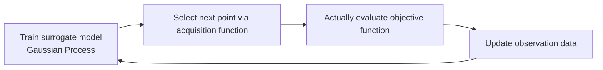

# Bayesian Optimization

## 1. Overview

### A. Definition
> A sequential optimization technique that **finds the optimum in only a small number of trials** for an expensive-to-evaluate, non-differentiable **black-box objective function** $f(x)$, by iteratively updating a **surrogate model** that probabilistically summarizes the observations so far and an **acquisition function** that decides where to evaluate next.

The core idea of Bayesian optimization is that "instead of dealing directly with the objective function itself, one models a **belief (posterior distribution)** about what the objective function looks like, and updates that belief with Bayes' theorem each time an observation accumulates." That is, it turns an optimization problem into a **decision problem**: "where is it most beneficial to evaluate the next single point?" Because obtaining one function value is expensive, the goal is to spend each trial on the point with the highest information value.

### B. Background and Necessity
As problems increase in which **a single evaluation requires hours of GPU training or an actual experiment**—such as deep-learning hyperparameter tuning, drug and materials experiments, and process optimization—grid/random search and gradient-based optimization, which presume thousands to tens of thousands of evaluations, lose practicality. Grid search combinatorially explodes as dimensionality grows, and random search cannot leverage past observations for learning, so it repeats the same failures. Bayesian optimization **cumulatively learns past observations into a surrogate model** and concentrates trials on promising regions, so it typically reaches a competitive solution within a few dozen evaluations. On top of this, its decisive advantage is that it **quantifies the uncertainty** of each prediction, allowing it to weigh "places not yet visited" against "places that look good" in a principled way.

## 2. Operating Principle

One cycle proceeds as follows. First, using the observations so far $\{(x_i, y_i)\}$, the surrogate model is trained to obtain, at each unevaluated point $x$, a predictive mean $\mu(x)$ and uncertainty $\sigma(x)$. Next, the acquisition function combines these two values to pick the point $x_{next}$ with the "greatest value to evaluate." At that point the actual objective function is evaluated exactly once, the result is added to the observations, and the surrogate model is updated again. This process repeats until the budget (number of evaluations) is exhausted or improvement stalls.

| Order | Content | Output |
|---|---|---|
| 1 | Train the **surrogate model** (mainly a GP) with observation data | $\mu(x),\ \sigma(x)$ at each point |
| 2 | Determine the next evaluation point via the **acquisition function** (balancing exploration and exploitation) | $x_{next}$ |
| 3 | Actually evaluate the objective function (expensive computation) | $y_{next}=f(x_{next})$ |
| 4 | Add the observation and loop back to 1 → converge | Updated posterior distribution |

Why this structure is efficient is "**because the surrogate model acts as a cheap approximation function**." The expensive true function is called only a minimal number of times, and the actual search and comparison are performed on the cheap surrogate model, so the total cost is greatly reduced.

## 3. Key Components

### A. Surrogate Model
The surrogate model estimates the posterior distribution of the objective function based on observations. The most widely used is the **Gaussian Process (GP)**, which assumes that the function values at any set of points follow a multivariate normal distribution. The strength of a GP is that it gives predictions not as point estimates but as a **mean and variance (confidence interval)**, so it naturally expresses the property that "the less observed a region is, the larger the variance." This variance later becomes the basis for inducing exploration. However, because a GP requires inverting the kernel matrix, its cost grows as $O(n^3)$ in the number of observations $n$, so in high-dimensional or large-observation settings it is sometimes replaced by a **TPE (Tree-structured Parzen Estimator)** or a random-forest-based surrogate model (SMAC).

### B. Acquisition Function
The acquisition function combines the surrogate model's $\mu$ and $\sigma$ into a single score to decide the next evaluation point. Representatively, **EI (Expected Improvement)** maximizes the expected improvement over the current best value, and **UCB (Upper Confidence Bound)** picks optimistically by adding an uncertainty weight to the mean, as in $\mu(x)+\kappa\,\sigma(x)$. **PI (Probability of Improvement)** looks only at the probability that an improvement occurs. These all differ only in the ratio in which they mix "$\mu$ that looks good" and "$\sigma$ that is unvisited," and are essentially different settings on the exploration–exploitation scale.

| Element | Description | Representatives |
|---|---|---|
| **Surrogate model** | Probabilistically approximates the function distribution, provides uncertainty | GP, TPE, random forest |
| **Acquisition function** | Combines $\mu,\sigma$ to select the next point | EI, PI, UCB |
| **Exploration vs. exploitation** | Explore uncertain regions ↔ concentrate on promising regions | Tuned via $\kappa,\ \xi$ |

### C. Balancing Exploration and Exploitation
The success or failure of Bayesian optimization hinges on this balance. If one only exploits (= only where $\mu$ is large), one gets trapped early in a local optimum that happened to look good; if one only explores (= only where $\sigma$ is large), it is no different from random search. For example, increasing UCB's $\kappa$ strengthens exploration, and decreasing it strengthens exploitation. A good acquisition function **automatically** tilts this scale so that it explores broadly at first and naturally shifts to exploitation as observations accumulate and uncertainty shrinks.

## 4. Pros and Cons

| Advantage | Reason | Disadvantage | Reason |
|---|---|---|---|
| Finds the optimum in few evaluations | Cumulatively leverages past observations via the surrogate model | Performance degrades in high dimensions | The space grows, raising the difficulty of GP approximation and search |
| No differentiation needed (handles black boxes) | Only function values are required | GP computation is $O(n^3)$ | Cost of inverting the kernel matrix |
| Quantifies uncertainty | The GP provides variance | Parallelization is relatively hard | Inherently sequential decision-making |

For example, in a 20-dimensional hyperparameter space, observations struggle to densely cover the effective space, so performance drops; in that case one complements it with dimensionality reduction, subspace search (REMBO), or TPE/BOHB. The sequentiality problem is mitigated by **batch Bayesian optimization**, which selects several candidates at once.

## 5. Considerations and Implications
- **The de facto standard for AutoML and hyperparameter optimization**: Optuna, Hyperopt, Ray Tune, and others embed TPE/BOHB. Compared with random search, they markedly reduce the number of trials to reach the same performance, saving expensive GPU budgets.
- **Strategies for high dimensions**: With **BOHB (Hyperband + BO)**, which combines dimensionality reduction, TPE, and early stopping, one takes the compromise of "quickly weeding out candidates with cheap low-fidelity evaluations and precisely evaluating only the promising ones."
- **Extension to Design of Experiments (DOE)**: In domains where a single real experiment is very expensive—A/B testing, new-material/catalyst discovery, semiconductor process recipe optimization—the effect of reducing the number of trials is large.
- **Trade-off**: Because there is overhead in computing and tuning the surrogate model and acquisition function themselves, the benefit is clear when the objective-function evaluation is sufficiently expensive (several minutes or more); for cheap functions, random or grid search may be better.

---

> **In one line**: Bayesian optimization is a technique that determines *the posterior distribution of the objective function with a surrogate model (GP) and the next evaluation point with an acquisition function (EI, UCB)*, balancing exploration and exploitation to find **the optimum of an expensive black-box function in a small number of trials**; it is widely used in hyperparameter tuning, AutoML, and design of experiments, but is complemented in high dimensions by TPE, BOHB, and the like.
