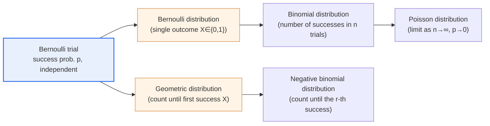
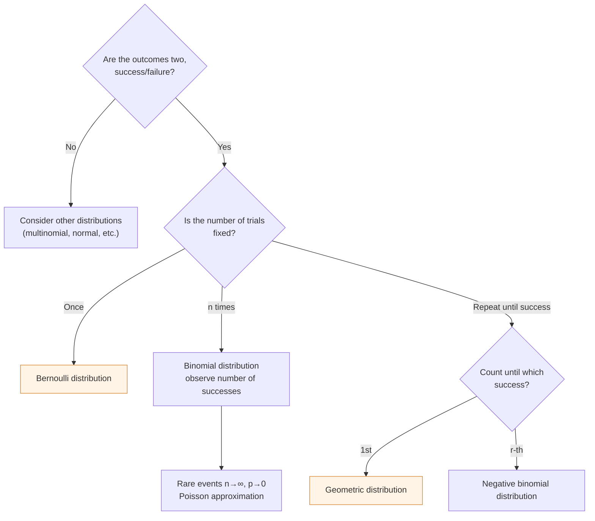

# The Bernoulli Distribution and the Geometric Distribution

## 1. Overview

### A. Definition
> The **Bernoulli distribution** is a discrete probability distribution for **a single trial** that has only two outcomes, success/failure, and the **Geometric distribution** is a discrete probability distribution for the **number of trials until the first success** when repeating Bernoulli trials with success probability p.

Both distributions start from a **Bernoulli trial**. A Bernoulli trial is a probability experiment in which ① the outcome is only one of two, success or failure, ② the success probability p of each trial is constant, and ③ the trials are mutually independent. Phenomena that can be answered "yes/no"—a coin toss, a product's pass/fail judgment, whether an ad is clicked—can all be seen as Bernoulli trials. On this common foundation, **"what one observes as the random variable"** is what separates the two distributions.

The Bernoulli distribution focuses on **the outcome of a single trial itself**, as in "is it heads when a coin is tossed once?" The random variable X is an indicator variable that takes 1 for success and 0 for failure, and the object of observation is the value of the outcome. The Geometric distribution, on the other hand, focuses on **the waiting time until the first success (the number of trials)**, as in "how many times must one toss until heads first appears?" That is, the Geometric distribution models the situation of repeating the same Bernoulli trial and waiting until success. One measures the 'outcome,' the other measures the 'length of the wait.'

Clarifying this difference in perspective also naturally connects to how the two distributions extend into the binomial and negative binomial distributions. If in the Bernoulli distribution you increase the number of trials n and count the 'number of successes,' it becomes the binomial distribution, and if in the Geometric distribution you generalize the 'first success' to the 'r-th success,' it becomes the negative binomial distribution. In other words, the four distributions are all one lineage branching from the single root of the Bernoulli trial, and you can decide which distribution to use by classifying a phenomenon as 'one trial, number of successes, until the first success, or until the r-th success.'

### B. Background and Necessity
Binary phenomena divided into success/failure are extremely common in reality. Whether one passes, whether a part is defective, whether a website visitor converts to a purchase, whether there is a drug response in a clinical trial—all belong here. To handle such phenomena probabilistically rather than by rough eyeballing, one needs a mathematical model that expresses outcomes as numbers (0/1) and can compute the expectation and variance of their distribution. The Bernoulli and Geometric distributions are the most basic tools for this.

In particular, the Geometric distribution deals with the **waiting problem of "how long until the first success"**. The number of cycles until a product first fails (reliability), the number of visits until a new customer first makes a payment (the marketing funnel), the number of retries until a call-center agent connects (queuing theory)—all are waiting problems until the first success. If the Bernoulli distribution deals with 'a single judgment,' the Geometric distribution deals with 'the first success amid repetition,' so the two distributions become the probabilistic foundation of quality control, reliability analysis, A/B testing, and queuing theory.

## 2. The Lineage of the Two Distributions and the Observation Perspective

First, let us organize structurally how the two distributions branch from the single root of the Bernoulli trial. The figure below shows the whole lineage in which the distribution is divided according to the object of observation (a single outcome vs. the count until the first success) and then extends again into the binomial and negative binomial.

The core of this lineage is the **direction of observation**. The Bernoulli and binomial distributions go in the direction of "fixing the number of trials and counting the number of successes" (fix the count → observe successes), whereas the Geometric and negative binomial distributions go in the opposite direction of "fixing the number of successes and counting the number of trials until then" (fix the successes → observe the count). For example, "how many of 10 questions do you get right" is binomial, and "how many questions do you solve until you first get one right" is Geometric. That the model changes depending on what you set as the unknown—even for the same test—is a common cause of choosing the wrong distribution in practice, so it is important to first form the habit of fixing this directionality.

### A. Bernoulli Distribution — The Indicator Variable of a Single Trial
The Bernoulli distribution is the simplest discrete distribution. The random variable X takes only two values, success (1) and failure (0), and its probability mass function is P(X=1)=p, P(X=0)=1−p, which written as a single expression is P(X=x)=pˣ(1−p)¹⁻ˣ (x=0,1). The expectation is E(X)=0·(1−p)+1·p=p, so the success probability itself becomes the mean. The variance is Var(X)=p(1−p), which is maximized at 0.25 when p=0.5 and converges to 0 as p approaches 0 or 1. This agrees with the intuition that the more extreme the success probability, the smaller the uncertainty (variability) of the outcome.

The true power of the Bernoulli distribution lies in its being a **building block for more complex distributions**. Summing n independent Bernoulli random variables yields the binomial distribution, and this fact becomes the starting point for deriving many theorems in statistics. For example, drawing one item from a production line with a defect rate of p=0.02 and observing whether it is defective is a Bernoulli trial, and drawing 100 items and counting the number of defectives yields the binomial distribution B(100, 0.02).

Consider A/B testing as a practical example. If a particular user's probability of clicking a button is p=0.12, then whether an individual user clicks follows Bernoulli(0.12). The metric called conversion rate is ultimately the average of many Bernoulli trials, and the very reason the standard error of the sample click rate is computed as √(p(1−p)/n) is the Bernoulli variance p(1−p). In other words, you must understand the Bernoulli distribution to advance to power/sample-size calculations, answering "how much of a sample must one gather to detect a statistically significant difference."

### B. Geometric Distribution — Waiting Until the First Success
The random variable X of the Geometric distribution is "the ordinal number of the trial on which the first success occurs," and its probability mass function is P(X=k)=(1−p)ᵏ⁻¹·p (k=1,2,3,…). This expression is transparent in interpretation because it directly transcribes the event "the first (k−1) trials all fail ((1−p)ᵏ⁻¹) and the k-th succeeds (p)." The expectation is E(X)=1/p, so when the success probability is p, on average one must make 1/p trials to reach the first success. The variance is Var(X)=(1−p)/p².

This expectation 1/p is highly intuitive. A coin with a heads probability of 1/2 must be tossed on average 2 times, and rolling a 6 on a die (probability 1/6) requires on average 6 throws before the first success. Because 1/p grows as p shrinks, it matches exactly the common sense that "the rarer the event, the longer one must wait." However, one must be careful that the Geometric distribution is an **asymmetric distribution with a long right tail**. A mean of 6 does not mean that most successes occur near 6; in a minority of cases one may wait far longer, so the variance is very large at (1−p)/p²=(5/6)/(1/36)=30. Planning based only on the mean misses the tail risk (long tail), so in practice one should also examine quantiles such as "within how many trials does success occur with 95% probability."

It is also worth noting that there are two conventions in the definition. Defining it as here—**the total number of trials X (=1,2,3,…) until the first success**—gives E(X)=1/p, but the convention of defining it as **the number of failures Y (=0,1,2,…) before the first success** is also widely used, in which case E(Y)=(1−p)/p (Y=X−1). The two definitions differ only in whether the observation starts at 1 or 0, and are essentially the same, but on an exam answer or in software (e.g., NumPy's or R's functions) you must always confirm which convention is used so that values do not disagree.

### C. Comparison of Probability, Expectation, and Variance
Comparing the probability, expectation, and variance of the two distributions side by side reveals the difference in perspective in formulas. The table below is that summary, and after the table the meaning of each value is again noted in sentences.

| Category | Bernoulli distribution | Geometric distribution |
|---|---|---|
| **Object of observation** | Success/failure of a single trial | Number of trials until the first success |
| **Probability mass function** | P(X=1)=p, P(X=0)=1−p | P(X=k)=(1−p)^(k−1)·p |
| **Sample space** | X ∈ {0, 1} | X ∈ {1, 2, 3, …} |
| **Expectation** | E(X)=p | E(X)=1/p |
| **Variance** | p(1−p) | (1−p)/p² |
| **Representative property** | Indicator variable, the base unit of the binomial | Memorylessness |
| **Example** | Whether one coin toss is heads | Number of tosses until the first heads |

The contrast worth noting in the table is that the expectations form a reciprocal relationship, **p ↔ 1/p**. If the success probability is high (the Bernoulli mean is large), one encounters the first success quickly (the Geometric mean is small), so the two move oppositely. Also, the Bernoulli variance is a finite value maximized at p=0.5 (0.25), whereas the Geometric variance diverges to infinity as p approaches 0. This means that the uncertainty of "a situation waiting for a rare success" is inherently large, and it becomes the statistical reason that one must set generous buffers in reliability and queuing design.

## 3. Extension Relationships with Related Distributions

The Bernoulli trial is the starting point for several distributions. Viewing this lineage as a processing flow makes clear the criteria for choosing the distribution that fits the situation. The diagram below shows the procedure by which a distribution is selected according to the question "what is fixed and what is observed."

Organizing this lineage into a table gives the following, and the 'why' of each relationship is explained next.

| Distribution | Relationship | Representative parameters |
|---|---|---|
| **Binomial distribution** | Number of successes in n Bernoulli trials | n, p |
| **Negative binomial distribution** | Number of trials until the r-th success (generalization of Geometric; r=1 gives Geometric) | r, p |
| **Poisson distribution** | Number of event occurrences per unit time/space (limit of binomial) | λ=np |
| **Exponential distribution** | The continuous counterpart of the Geometric (waiting time until the first event) | λ |

The **binomial distribution** is the natural sum of Bernoullis. Performing the same Bernoulli(p) trial n times and counting the number of successes S=X₁+…+Xₙ gives S~B(n,p), and the expectation np and variance np(1−p) are n times each Bernoulli's expectation and variance. The **negative binomial distribution** generalizes the Geometric distribution to "until the r-th success," and r=1 gives exactly the Geometric distribution. The **Poisson distribution** is obtained as the limit of the binomial when n is very large and p is very small so that np=λ is constant, and it is used to count 'the number of rare events' such as call arrivals or defect occurrences. Finally, the **exponential distribution** is the continuous-time counterpart of the Geometric distribution, and the two form a pair in that both share memorylessness. That a family of distributions spanning discrete and continuous derives from a single Bernoulli trial is the skeleton of probabilistic modeling.

## 4. Memorylessness and Practical Applications

The most characteristic property of the Geometric distribution is **memorylessness**. In formula form it is expressed as P(X>m+n | X>m)=P(X>n), meaning "the probability of having to wait n more trials given that one has already failed m times" equals "the probability of waiting n trials from the start." That is, the past history of failures has no effect on the probability of future success. Among discrete distributions, only the Geometric distribution has memorylessness, and among continuous distributions, only the exponential distribution does.

Because this property seems counterintuitive, it invites misunderstanding in practice. For example, believing that "it's about time heads came up" because a fair coin came up tails six times in a row is the **gambler's fallacy**. Since each trial is independent, the probability of heads on the next toss is still just 1/2. Memorylessness is simply another expression of this independence, and understanding it is necessary to correctly build reliability and queuing models. However, many real systems (parts that wear out, conversion rates that improve with learning) do not have independent trials, so memorylessness does not hold; therefore, before applying the model, one must first check "is the success probability p really constant?"

The practical applications are broad. **First, defect detection in software quality.** If the probability that a single test case catches a particular defect is p=0.3, then the number of tests needed to first reproduce that defect follows a Geometric distribution with a mean of 1/0.3≈3.3. **Second, network retransmission.** On a link where the probability of a successful packet transmission is p=0.9, the number of attempts until the first successful transmission is Geometric with a mean of 1/0.9≈1.11, but if the loss rate rises to p=0.5, the mean surges to 2. **Third, marketing conversion.** If the per-visit purchase conversion rate is p=0.05, the calculation shows that one person needs an average of 20 visits to make a first payment, which becomes the basis for designing the impression budget of retargeting ads. All three cases show that the simple expression '1/p' translates directly into resource planning.

## 5. Deeper Dive — Expected Exam Directions and Answer-Composition Strategy

In the engineering exam, probability distributions are frequently set as essay questions such as **"explain the difference between the two distributions and discuss their practical application"** rather than as standalone computation problems (e.g., in statistics-related sessions such as the 130th). Therefore, an effective four-part composition is to ① precisely present the definitions and probability mass functions of the two distributions, ② derive or compare the expectation and variance, ③ explain the extension relationship as the lineage Bernoulli → binomial → Geometric → negative binomial, together with a figure, and then ④ conclude with core properties such as memorylessness and pitfalls such as the gambler's fallacy, using concrete examples.

In particular, the points where graders differentiate are **whether one has clearly verbalized "the difference in perspective (a single outcome vs. waiting until the first success)"** and **whether one has explained the contrast of expectation p↔1/p with numerical examples**. Simply listing formulas is a deduction factor, so it is good to include immediately verifiable examples such as a coin (p=1/2, mean 2) and a die (p=1/6, mean 6) to raise the credibility of the argument. Also, connecting them to IT practice—A/B test sample-size calculation, network retransmission, reliability analysis—reveals the 'engineer's perspective' and is advantageous for a high score.

Recently, these distributions have again been in the spotlight in the context of data analysis and machine learning. Logistic regression is a model that treats each observation as a Bernoulli random variable and maximizes its log-likelihood, and the number of attempts until the first reward in reinforcement-learning exploration is sometimes modeled with a Geometric distribution. Adding a sentence or two on such recent applications can show that the concept does not remain in theory but connects to current technology.

## 6. Considerations and Implications

1. **Choosing a distribution starts from the 'direction of observation.'** One must first fix whether a phenomenon is 'a single outcome, the number of successes in n trials, until the first success, or until the r-th success' to select the correct model among Bernoulli, binomial, Geometric, and negative binomial. Confusing the direction throws off the entire computation of expectation and variance, so it should be treated as the first button of modeling.

2. **Verifying the assumptions (independence, constant p) is the premise of application.** Both distributions hold only if each trial is independent and the success probability p is constant. In situations where p changes or trials are dependent—such as parts that wear out or conversion rates that improve with learning—memorylessness breaks, so one must substitute a non-homogeneous model (time-dependent p) or survival-analysis techniques.

3. **Look at variance and tails, not only the mean.** The Geometric distribution is an asymmetric distribution with a long right tail, so values do not cluster near the mean (1/p). In reliability, queuing, and SLA design, one must size spare capacity based on the 95th/99th percentiles rather than the mean wait to control tail risk.

4. **The lineage (family) perspective broadens applications.** Bernoulli leads to the binomial and logistic regression, Geometric to the negative binomial and exponential distributions, and binomial to the Poisson. Understanding individual distributions as a family derived from a single Bernoulli trial—rather than memorizing them piecemeal—lets one solve problems across different domains (A/B testing, quality control, reliability, reinforcement learning) within a consistent framework.

5. **Beware of the gambler's fallacy.** Because memorylessness is precisely independence, the common belief that consecutive failures raise the probability of the next success is wrong. This misconception distorts quality and risk decision-making, so it is important to establish data-based probabilistic interpretation as an organizational culture.

## References
- NIST/SEMATECH e-Handbook of Statistical Methods — https://www.itl.nist.gov/div898/handbook/eda/section3/eda366.htm
- Wikipedia, "Geometric distribution" — https://en.wikipedia.org/wiki/Geometric_distribution
- Wikipedia, "Bernoulli distribution" — https://en.wikipedia.org/wiki/Bernoulli_distribution

---

> **In one line**: The Bernoulli distribution represents *the success/failure of a single trial (expectation p, variance p(1−p))*, and the Geometric distribution represents *the number of trials until the first success (expectation 1/p, memorylessness)*; both start from the Bernoulli trial but differ in perspective between 'observing an outcome' and 'observing a wait,' forming one distribution family that extends into the binomial, negative binomial, Poisson, and exponential distributions.
