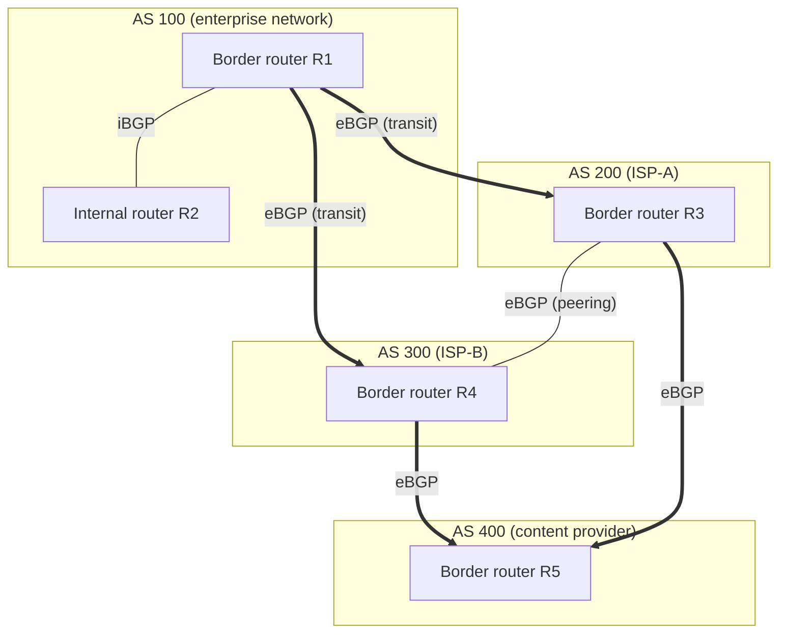
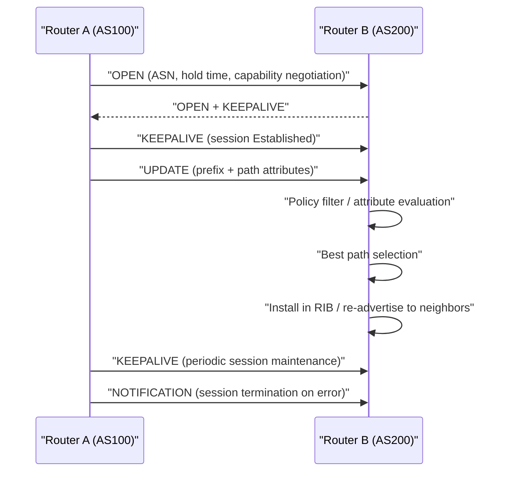

# BGP (Border Gateway Protocol)

## 1. Overview

> **BGP (Border Gateway Protocol)** is a **standard exterior routing protocol (EGP) based on the path-vector approach** that different administrative entities (Autonomous Systems, ASes) use to exchange reachable network prefixes and their path information over the Internet; it is effectively the only inter-domain routing protocol forming the backbone of today's Internet (the current standard, BGP-4, is RFC 4271).

The fundamental background for BGP's emergence is the **scale and autonomy of the Internet**. The Internet is not a single network controlled by one organization but a collection of networks operated by tens of thousands of independent operators—telcos, enterprises, clouds, research networks—each according to its own policy. Each such operational unit is called an **Autonomous System (AS)**, and a set of routers sharing one administrative policy and routing strategy is identified by a single AS number (ASN). Interior routing protocols (IGPs) such as OSPF and RIP are optimized for computing shortest paths within a single AS, so they are fundamentally unsuited to inter-AS routing, where hundreds of thousands of prefixes and policy interests are entangled. BGP was devised precisely to handle this **path decision between one AS and another**.

The second background is the recognition that **routing is not a simple shortest-path problem but a policy problem**. Inter-AS relationships divide into Customer, Provider, and Peer according to cost, contract, and level of trust, and a "path that is lower in settlement cost and contractually permitted" often takes priority over a "physically shorter path." For example, when a domestic carrier A sends traffic to an overseas destination, it is typical to prefer a settlement-free peering path over a transit path with a higher settlement fee, even if the latter has fewer hops. Because IGP metrics (hop count, bandwidth, latency) alone cannot express such commercial and policy preferences, BGP is designed to reflect policy in fine detail through various path attributes. From an engineer's perspective, BGP should be understood not as "an algorithm that computes paths" but as **"a framework that projects policy onto paths."**

The third background is **scalability and stability**. The number of IPv4 routes in the Global Routing Table has already grown to about 950,000 (as of 2024, increasing over time) and continues to grow. BGP fundamentally blocks the infinite-loop problem of distance vectors through the full path record called AS_PATH, incrementally transmits only changes (incremental updates), and operates over reliable TCP (port 179) to exchange large volumes of path information stably. However, this vast scale leads directly to operational challenges such as routing-table bloat, convergence delay, and route hijacking.

The key characteristics of BGP can be summarized first as follows.

| Category | Content |
|------|------|
| Protocol type | Path vector, EGP (Exterior Gateway Protocol) |
| Transport layer | TCP port 179 (reliability, ordering guaranteed) |
| Routing unit | AS (Autonomous System), ASN (16-bit → 32-bit extension, RFC 6793) |
| Path selection | Policy-based (attribute) best-path decision, not shortest path |
| Loop prevention | Discard the path if one's own AS appears in AS_PATH |
| Update method | Initial full exchange, then incremental updates of changes only (session kept alive via Keepalive) |

## 2. BGP Overall Structure and Operating Concept

Below is a conceptual diagram of the overall structure of an Internet where several ASes are connected by BGP. An AS border router exchanges paths with other ASes via eBGP and with routers inside its own AS via iBGP, propagating paths selectively according to policy.

**A. The meaning of AS (Autonomous System) and ASN.** An AS is a set of routers and networks operated under a single technical and administrative policy, and it is the smallest unit that expresses routing policy on the Internet. Each AS is assigned a unique **AS number (ASN)** from a Regional Internet Registry (RIR); as the initial 16-bit scheme (about 65,000) was exhausted, it has now been extended to the **32-bit ASN (RFC 6793, about 4.2 billion)**. ASNs divide broadly into public ASNs, which must be globally unique on the Internet, and private ASNs used for private purposes (64512–65534, etc.). For example, Korea's KT holds AS4766 and Google holds AS15169, well-known ASNs; when diagnosing routing problems, one traces these numbers appearing in AS_PATH to determine which operators the traffic passes through. In this way, an ASN is not a mere identifier but a coordinate for reading the commercial and policy landscape of the Internet.

**B. The distinction between eBGP and iBGP.** BGP is divided into **eBGP (external BGP)** and **iBGP (internal BGP)** depending on whether the session peer is a different AS or the same AS. eBGP is formed between border routers of different ASes, is usually established with a directly connected neighbor, and adds one's own ASN to AS_PATH when advertising. iBGP, by contrast, is a session for sharing externally learned paths among routers within the same AS, and it does not change AS_PATH. An important principle here is the **iBGP split-horizon** rule—a path learned via iBGP is not re-advertised to other iBGP neighbors, which prevents loops; as a result, for all BGP routers within an AS to share paths, a **full mesh** is in principle required. Because n routers require n(n-1)/2 sessions, this requirement explodes as scale grows. To solve this scalability problem, the **Route Reflector** and **Confederation**, explained later, were introduced.

**C. The principle of the path-vector approach.** BGP uses the path-vector approach, a variant of distance vector. Whereas distance vector transmitted only "the distance (hop count) to the destination" and was thus vulnerable to count-to-infinity loops, BGP transmits together the **full list of ASes the path has traversed (AS_PATH)**. If a router finds its own ASN already in the AS_PATH of a received path, it judges that the path has looped back through itself once and discards it immediately. This simple yet powerful rule fundamentally blocks loops in inter-domain routing. For example, if a prefix advertised by AS100 returns to AS100 via AS200→AS300, AS100 finds itself in the AS_PATH and discards that path, preventing a loop.

A BGP session is established and maintained through the following finite state machine (FSM).

| State | Meaning |
|------|------|
| Idle | Waiting before session start, BGP process initialization |
| Connect / Active | Attempting TCP 179 connection (retry via Active if Connect fails) |
| OpenSent / OpenConfirm | Exchanging Open messages and negotiating parameters (ASN, hold time) |
| Established | Session established, begin exchanging paths via Update |

## 3. BGP Messages, Path Attributes, and the Best-Path Selection Process

BGP's policy expressiveness comes from its **path attributes**. Below is a detailed flow diagram showing the procedure from a BGP neighbor establishing a session and advertising paths, to the receiving router selecting one best path among multiple candidates.

**A. The role of the four message types.** BGP operates with four messages. **OPEN** negotiates ASN, hold time, and supported capabilities when establishing a session; **UPDATE** is the core message conveying the advertisement of reachable paths (prefix + attributes) and their withdrawal. **KEEPALIVE** is exchanged periodically (default hold 90 seconds, keepalive 30 seconds) to prevent hold-time expiry and to confirm session liveness, and **NOTIFICATION** terminates the session on error and conveys the cause code. In this way, BGP is designed to manage vast paths incrementally with minimal messages on top of TCP's reliability, exchanging the full table only once initially and thereafter exchanging only changes, saving bandwidth.

**B. Key path attributes.** Path attributes are the language of BGP policy. Representative ones include the following. **AS_PATH** is the list of ASes the path has traversed, used both for loop prevention and for path-length comparison (shorter is preferred). **NEXT_HOP** is the next-hop address to reach that prefix. **LOCAL_PREF (local preference)** indicates how much a particular external path is preferred within the AS; larger is preferred, and it mainly controls outbound (outgoing) traffic paths. **MED (Multi-Exit Discriminator)** is a value that hints to a neighbor AS, "prefer this entrance when entering our AS"; smaller is preferred, and it influences inbound traffic. **COMMUNITY** is a powerful tool that tags a path to apply group-level policy. For example, some ISPs operate an automated policy such as "if a customer attaches a specific community value, that path is advertised only to a specific region," letting customers perform their own traffic engineering.

**C. Best-path selection order.** When multiple paths are learned for the same prefix, BGP picks a single best path according to a set priority. Details differ by vendor, but the general order is as follows.

| Rank | Criterion | Preferred direction |
|------|------|-----------|
| 1 | Weight (Cisco local value) | Larger value |
| 2 | LOCAL_PREF | Larger value |
| 3 | Locally originated path (originated by own AS) | Preferred |
| 4 | AS_PATH length | Shorter is better |
| 5 | Origin type (IGP < EGP < Incomplete) | Lower is better |
| 6 | MED | Smaller is better |
| 7 | eBGP > iBGP path | eBGP preferred |
| 8 | IGP metric (to NEXT_HOP) | Smaller is better |
| 9 | Lower Router-ID / neighbor address | Smaller is better |

The reason this order matters is that operators can precisely engineer traffic flow depending on which stage's attribute they adjust. For example, if an enterprise with dual circuits wants to prefer the primary circuit, it raises the LOCAL_PREF of paths arriving on the primary circuit to control outbound, and for inbound, it uses the **AS_PATH prepending** technique of artificially lengthening AS_PATH when advertising the backup circuit to make it less preferred. This combination, common in the multi-homing configurations of large Korean enterprises, is a representative practical case that cannot be designed without understanding BGP's best-path selection order.

**D. iBGP scalability solutions.** The iBGP full-mesh problem mentioned earlier is realistically hard to bear in a large AS. The **Route Reflector (RFC 4456)** designates a particular router as a reflector so that it propagates iBGP paths learned from clients to other clients on their behalf, removing the full-mesh requirement. The **Confederation (RFC 5065)** divides one large AS into several sub-ASes, treating them internally like eBGP while appearing externally as a single ASN. Both techniques dramatically reduce the number of sessions, making iBGP design feasible for large operator networks.

## 4. Comparison with IGP (OSPF/RIP) and Application Context

BGP and IGP are not in a competitive relationship but are **complementary protocols with different roles**. IGP handles fast convergence and shortest paths within a single AS, while BGP handles policy and scalability between ASes. In real networks, hierarchical collaboration occurs in which BGP decides "through which AS to exit" and IGP decides "how to get to that exit internally."

| Category | IGP (OSPF/RIP) | BGP |
|------|---------------|-----|
| Scope | Within an AS (intra-domain) | Between ASes (inter-domain) |
| Algorithm | Link-state (OSPF), distance-vector (RIP) | Path vector |
| Path criterion | Shortest path (cost, hops) | Policy-based attributes |
| Convergence speed | Fast (seconds) | Slow (policy evaluation, propagation delay) |
| Scaling scale | Hundreds to thousands of routers | Hundreds of thousands of prefixes, tens of thousands of ASes |
| Transport | OSPF: IP protocol 89, etc. | TCP 179 |

**A. Why IGP cannot handle the whole Internet.** OSPF has all routers in an AS share the link-state database and perform SPF (Dijkstra) computation; processing the world's 950,000 routes this way would overwhelm memory and CPU, and above all, sharing the entire link state among mutually distrusting operators is itself impossible for policy and security reasons. BGP hides detailed internal topology and exchanges only summary information—"reachable prefixes and AS paths"—so it preserves autonomy while handling Internet scale. This difference is precisely the branching point of the fundamental design philosophy "shortest path vs. policy path."

**B. The trade-off of convergence speed.** BGP converges more slowly than IGP due to policy evaluation, staged propagation, and timers that suppress routing oscillation—**Route Flap Damping** and **MRAI (Minimum Route Advertisement Interval)**. This is a trade-off deliberately accepted for stability. If hundreds of thousands of routes oscillated by the second in the Internet core, the whole world would become unstable, so BGP chose "stable suppression" over "fast reaction." However, since this delay increases service outage time during failures, a complementary technique is used together—**BFD (Bidirectional Forwarding Detection)**—to detect link failures in milliseconds and quickly bring down the BGP session.

**C. A practical integrated-configuration case.** Suppose a Korean financial company operates a data center multi-homed to two ISPs. Internally it maintains shortest paths between servers and routers with OSPF, and establishes an eBGP session with each of the two external ISPs. In normal times it exits via the primary ISP using LOCAL_PREF, and when the primary ISP fails, BGP withdraws the path and automatically switches to the backup ISP path. Meanwhile, internal routers share external paths via iBGP, but OSPF guarantees NEXT_HOP reachability. This structure is a typical industrial case showing the division of roles between BGP (policy, redundancy) and OSPF (internal shortest path), and becomes a core element of disaster-recovery (DR) and availability design.

## 5. Deeper Dive: BGP Security Threats and RPKI-Based Countermeasures

BGP is the foundation of the Internet, but because it was built **trust-based** at design time, it carries the structural vulnerability of not verifying "whether an advertised path is genuine." For this reason, BGP security is one of the biggest current issues in Internet-infrastructure security today, and it is rising as a latest exam point in the engineering exam.

**A. The risk of prefix hijacking.** If some AS advertises a prefix it does not own, or a more specific (longer) prefix, world traffic can flow wrongly to that AS by the longest-prefix-match rule. The 2008 incident in which a Pakistani telco misadvertised a YouTube prefix and paralyzed YouTube worldwide for hours, and the 2018 incident in which Amazon Route53 DNS traffic was hijacked and cryptocurrency wallets were stolen, are representative real cases. Such incidents can be simple configuration mistakes (route leaks) or deliberate attacks, and they reveal the fundamental limitation of trust-based BGP.

**B. Origin verification via RPKI and ROA.** The standard countermeasure to this is **RPKI (Resource Public Key Infrastructure, RFC 6480)**. RPKI cryptographically links an IP prefix and the ASN authorized to advertise it via a signed **ROA (Route Origin Authorization)**, and routers verify via **ROV (Route Origin Validation)** whether the origin AS of a received path is legitimate, discarding invalid paths. This allows verification of "who may advertise this prefix," blocking origin hijacking to a considerable extent. However, RPKI verifies only the origin and does not guarantee the legitimacy of the entire AS_PATH; to address this, follow-on technologies such as **ASPA (AS Provider Authorization)** and **BGPsec (RFC 8205, full path signing)** are being discussed and partially adopted. In addition, the nonprofit body **MANRS (Mutually Agreed Norms for Routing Security)** induces improvement at the operational-practice level through its four norms of filtering, anti-spoofing, coordination, and validation.

The main BGP threats and countermeasures are summarized as follows.

| Threat | Principle | Countermeasure |
|------|------|------|
| Prefix hijacking | Advertising unowned prefixes / longer prefixes | RPKI/ROA, ROV, prefix filters |
| Route leak | Wrongly re-advertising a transit path | ASPA, peer-role-based filters |
| AS_PATH forgery | Bypass via manipulating path attributes | BGPsec (path signing) |
| Session hijacking / DoS | Attacking TCP sessions / inducing flaps | TTL Security (GTSM), MD5/TCP-AO, Flap Damping |

**C. Latest trends and standard changes.** Recently, led by global large operators and clouds (Google, Cloudflare, AWS, etc.), ROV adoption is spreading rapidly, and the share of IPv4 prefixes covered by RPKI is trending meaningfully upward (for exact figures, consulting the latest sources such as the NIST RPKI Monitor and RIPE statistics is recommended). In Korea, too, RPKI adoption is progressing, led by KISA and the carriers. However, full ROV adoption carries the false-positive risk that legitimate paths are discarded due to missing signatures, so a phased approach is needed—this illustrates the typical trade-off between "strengthening security" and "maintaining availability."

## 6. Considerations and Implications

- **Clarity of policy design (trade-off):** BGP's strength, policy flexibility, is also its complexity. When combining LOCAL_PREF, MED, AS_PATH prepending, and Community, unintended traffic concentration or asymmetric paths easily arise, so policy must be applied through documented standards and verification procedures (testing, simulation). In particular, one must recognize that inbound-traffic control (MED, prepending) has limited effect because it depends on the neighbor AS's policy.
- **Scalability design:** Large ASes should introduce Route Reflectors and Confederations instead of an iBGP full mesh to control the number of sessions, and should carry out prefix aggregation, filtering, and memory-capacity sizing in parallel to prepare for routing-table bloat. The transition to a 32-bit ASN environment should also be reflected in the roadmap.
- **Built-in security:** Adopt RPKI/ROA registration and ROV as infrastructure standards, but design monitoring, phased adoption, and rollback procedures together to prevent availability degradation from false positives. Also apply basic defenses such as prefix filters, maximum-prefix limits, GTSM, and TCP-AO in parallel, and it is desirable to establish MANRS norms as operational practice.
- **Availability and convergence optimization:** Prepare for single-operator failures with multi-homing and redundancy design, advance failure detection with BFD, and tune Flap Damping and MRAI timers to traffic characteristics to balance stability and responsiveness. In DR/BCP design, BGP path-switching time should be reflected in the RTO calculation.
- **Outlook and related technologies:** BGP is broadening its application scope into SDN (central-controller-based path control), SD-WAN (policy-based overlays), Segment Routing (SR), and BGP within the data center (EVPN-VXLAN, RFC 7938). Since understanding BGP is essential for cloud/multi-cloud connectivity and Internet-exchange (IX) peering strategy, organizations should treat BGP not as the exclusive province of telecom networks but as a constant of infrastructure architecture.

## References

- RFC 4271, "A Border Gateway Protocol 4 (BGP-4)" — https://www.rfc-editor.org/rfc/rfc4271
- RFC 6793, "BGP Support for Four-Octet Autonomous System (AS) Number Space" — https://www.rfc-editor.org/rfc/rfc6793
- RFC 4456 (Route Reflection) / RFC 5065 (Confederations)
- RFC 6480 (RPKI) / RFC 8205 (BGPsec) / RFC 7938 (BGP in the Data Center)
- MANRS (Mutually Agreed Norms for Routing Security) — https://www.manrs.org
- NIST RPKI Monitor / RIPE NCC Routing Statistics — https://www.ripe.net

---

> **In one line**: BGP is the Internet's foundational protocol that exchanges policy-based reachability between ASes using the path vector (AS_PATH) and various attributes; it divides roles with IGP and must be equipped together with scalability (Route Reflector, Confederation), availability (multi-homing, BFD), and security (RPKI/ROA, ROV) design to be operated stably.
