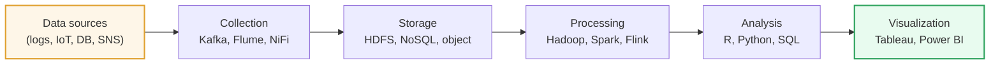
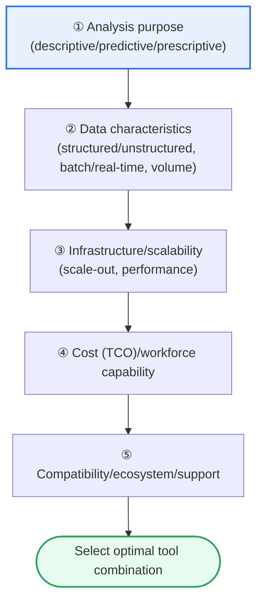

# Principles for Selecting Big Data Analysis Tools

## 1. Overview

### A. Definition
> **Big data analysis tool selection** is a decision-making activity that comprehensively considers an organization's **data characteristics (structured/unstructured, volume, velocity), analysis purpose (descriptive/predictive/prescriptive), infrastructure, workforce capability, and total cost of ownership (TCO)** to select, by rational and objective criteria, tools fit for purpose at each stage of the data pipeline from collection → storage → processing → analysis → visualization.

The fundamental reason tool selection determines a project's success or failure lies in the fact that "**the tool simultaneously determines the quality of analytical results and the total cost of ownership (TCO)**." The big data ecosystem holds hundreds of tools layered upon one another—collection (Kafka, Flume, NiFi), storage (HDFS, NoSQL, object storage), processing (Hadoop, Spark, Flink), analysis (R, Python, SQL engines), and visualization (Tableau, Power BI, Superset). Each tool is optimized for a particular workload, so no tool can be best in all situations. This is what makes 'selection' not a simple performance comparison but a comprehensive judgment about the organization's situation.

Choosing the newest, highest-performance tool based on performance alone fails when there is no workforce to handle it or it fails to integrate with existing infrastructure and data sources. Conversely, insisting only on familiar tools creates bottlenecks because they cannot handle the data scale and real-time processing demands. Therefore, one must balance 'what and why we want to analyze (purpose),' 'what nature the data has (structured/unstructured, real-time/batch, volume),' 'whether we can actually handle it (capability, learning curve),' 'how much we must scale in the future (growth),' and 'whether we can afford the total cost (TCO).' In short, the essence of the principle is '**choosing not the best tool but the tool that best fits our situation**.'

### B. Background and Necessity
In the past, processing structured data with a single kind of relational DBMS was sufficient. However, as the big data era—represented by the 3Vs (Volume, Velocity, Variety)—opened, various workloads emerged that a single tool cannot handle, and specialized tools to share the load proliferated. In an environment of tool proliferation, a wrong choice translates directly into wasting hundreds of millions of won in license/infrastructure costs, the burden of retraining staff, and project delay or failure. On top of this, as the selection axes of open-source vs. commercial, on-premises vs. cloud, and batch vs. streaming intersect, the complexity of decision-making grows further. For this reason, **objective and repeatable selection criteria (principles)**—not gut feeling or fashion—are required.

## 2. The Data Pipeline and the Structure of Selection Criteria

Tool selection is not a matter of picking individual tools one at a time but of combining tools suited to each stage across the entire pipeline through which data flows. The figure below shows the pipeline through which data flows from collection to visualization, and the relationship of the selection criteria commonly applied at each stage.

Each stage of the pipeline has a different workload, but the criteria for choosing tools over them are organized into a common set of axes. The figure below shows in what priority and dependency these criteria operate. Purpose defines the data characteristics at the top, the data characteristics give rise to infrastructure and scalability requirements, and on top of that, cost, workforce capability, and ecosystem coordinate the final selection.

### A. Fitness for Purpose — What and Why Do We Analyze?
Every selection must start from the analysis purpose. Even with the same data, the family of tools needed differs depending on whether one wants **descriptive analysis** that summarizes the past, **predictive analysis** that forecasts the future, or **prescriptive analysis** that suggests the optimal action. If simple aggregation and dashboards are the goal, a SQL engine and a BI tool suffice, but building a predictive model requires Python's machine-learning ecosystem, and prescriptive tasks such as real-time recommendation or anomaly detection require even streaming processing and model-serving infrastructure. Choosing tools first without clarifying the purpose results in a flashy but unused system. In fact, many big data projects repeatedly began with the "let's just install Hadoop first" approach and were then abandoned for want of a usage scenario.

### B. Data Characteristics — Structured/Unstructured, Batch/Real-time, Volume
Once the purpose is set, the nature of the data being handled narrows the tools. If structured data is central, SQL-based tools and columnar storage are advantageous; if there is much unstructured data such as logs, images, and text, NoSQL/object storage with schema flexibility and distributed processing are needed. The point of processing is also decisive. For **batch** that gathers large volumes and processes them once a day, the Hadoop/Hive family fits; for **real-time/streaming** where second-level latency matters, Spark Streaming, Flink, and Kafka are suitable. Data volume also creates a threshold. A few GB to tens of GB can be handled by single-node R/Python, but once it grows to the TB–PB scale, distributed processing becomes essential. For example, using hundreds of millions of daily payment logs for real-time fraud detection cannot tolerate the latency of batch tools, forcing a streaming stack.

### C. Scalability and Performance — How Much, How Fast Does It Grow?
Tools must be chosen on the premise that big data grows over time. One must look at whether **scale-out**—increasing throughput by adding servers—is possible, and whether it scales near-linearly even when data grows tenfold. Also key is whether it has the processing performance to meet the required response time (SLA). This is precisely the core reason Spark widely replaced Hadoop MapReduce. MapReduce writes each stage's result to disk, whereas Spark keeps intermediate results in memory (in-memory), making it several to tens of times faster in iterative computation (machine learning, interactive queries). On the other hand, since it uses a lot of memory, a trade-off with infrastructure cost arises. That is, performance must always be judged together with cost and resources.

### D. Cost (TCO), Workforce Capability, and Ecosystem — Is It Sustainable?
Finally, what coordinates the selection is total cost of ownership and people. One must look at **TCO**, which includes not only adoption cost (license, build) but also operation, maintenance, training, and disaster recovery. Open source may appear to have no license cost, but without specialized staff to handle operation and tuning, the total cost can actually be higher. If the organization's staff are already familiar with Python/SQL and an unfamiliar tool is introduced, productivity plummets due to the learning curve. **Compatibility and interconnectivity** with existing systems and data sources, and the **thickness of the community and technical support** available when problems arise, also determine sustainability. A tool with an active community has abundant documentation, solved cases, and a labor market, so its long-term operational risk is low.

| Principle | Key question | Judgment point |
|---|---|---|
| **Fitness for purpose** | What and why do we analyze? | Tool family matching descriptive/predictive/prescriptive |
| **Data characteristics** | Structured/unstructured, batch/real-time, volume | Schema flexibility, point of processing, need for distribution |
| **Scalability** | Does it handle data growth? | Scale-out, linear scaling |
| **Performance** | Meets response-time/throughput needs | In-memory, parallelism, trade-off with resources |
| **Usability/capability** | Can the organization handle it? | Learning curve, existing proficiency |
| **Compatibility/integration** | Does it integrate with the existing ecosystem? | Connectors, standard interfaces |
| **Cost (TCO)** | Can we afford the total cost? | License + operation + training + infrastructure |
| **Community/support** | Can we get help? | Open-source ecosystem, commercial support |

## 3. Tools by Processing Type and Selection Cases

How the selection principles actually differentiate tools becomes clear when viewed by processing type. Batch, which gathers and processes large volumes, is stable and cheap with Hadoop/MapReduce and Hive but has large latency. Iterative computation, interactive analysis, and near-real-time processing are strong with the in-memory engine Spark. Streaming, which flushes events immediately, is standardized on Kafka (messaging) and Flink (stateful stream processing). Statistics and machine learning have R (statistics-specialized) and Python (general-purpose, rich ML libraries) as their two axes, and result delivery is handled by commercial BI such as Tableau and Power BI, or the open-source Superset.

Let us compare three concrete situations. First, a retail company that builds a sales report as a daily batch achieves its purpose at low cost with a Hive + Tableau combination. Second, a card company that must catch abnormal transactions in real time from hundreds of millions of daily logs needs a Kafka + Flink + model-serving stack. Third, an organization whose data-science team iteratively experiments with predictive models raises productivity with a Spark + Python (MLlib/scikit-learn) + notebook environment. Even within the same 'big data analysis,' the optimal combination diverges this much when the purpose and data characteristics differ.

What must be emphasized here is that tools are often combined in a 'complementary' rather than a 'competitive' relationship. A stream collected by Kafka is processed by Spark, the result is loaded into NoSQL, and then visualized with Tableau—tools of different layers form a single pipeline. Therefore, 'whether the tools integrate smoothly' becomes a more important judgment criterion than the superiority of an individual tool, and this connects directly to the compatibility/ecosystem principle seen earlier. Building a stack from tools that have abundant connectors and share standard formats (Parquet, Avro, etc.) greatly reduces integration cost and operational risk.

The blurring of the boundary between batch and streaming also affects selection. In the past, batch and real-time were operated as separate systems (the Lambda architecture) in a dual setup, but as unified (Kappa architecture) approaches that process batch and stream with a single engine—such as Spark Structured Streaming and Flink—spread, choosing a single engine that handles both needs can reduce operational complexity and code duplication. This shows why it is important to choose tools with an eye not only to 'current needs' but also to 'needs in the near future.'

| Category | Representative tools | Suitable situation |
|---|---|---|
| **Batch processing** | Hadoop, Hive | Large volume, non-real-time, cost-sensitive |
| **Real-time / in-memory** | Spark, Flink | Iterative computation, near-real-time, interactive |
| **Streaming collection** | Kafka, Flume, NiFi | Event collection, low latency |
| **Analysis / ML** | R, Python | Statistics, predictive modeling |
| **Visualization / BI** | Tableau, Power BI, Superset | Reports, dashboards |

Comparing the representative fork **Hadoop MapReduce vs. Spark** makes 'the reason the difference arises' clear. Both share the same purpose of distributed large-volume processing, but their processing methods are fundamentally different, so their suitable situations diverge. MapReduce writes each stage's result to disk, making it stable and robust for ultra-large batches but slow for iterative and interactive work. Spark keeps intermediate results in memory, making it much faster in iterative computation but demanding large memory resources. That is, the trade-off of 'slow but cheap/stable' vs. 'fast but resource-intensive' governs the selection.

| Comparison axis | Hadoop MapReduce | Spark | Reason the difference arises |
|---|---|---|---|
| **Processing location** | Disk-based | In-memory-based | Different medium for storing intermediate results |
| **Speed** | Relatively slow | Several to tens of times faster in iterative computation | Presence/absence of disk I/O |
| **Resources** | Low memory burden | High memory demand | Keeps data in memory |
| **Suitable for** | Ultra-large batch, cost-sensitive | Iterative ML, near-real-time, interactive | Difference in workload nature |

## 4. Deeper Dive — The Shift to Cloud/Managed Services and the Lakehouse

Recently, the landscape of tool selection is rapidly moving from 'self-built and self-operated' to **cloud-based managed services**. Because the burden of directly installing, tuning, and operating an on-premises Hadoop cluster is large, many organizations are shifting to managed services such as AWS EMR, Google Dataproc/BigQuery, Azure Synapse, and Databricks. Since these have the service provider handle infrastructure operation, the organization can focus on analysis itself, and pay-as-you-go—using resources only when needed—reduces upfront investment and idle cost. However, if data movement is heavy or the load is high at all times, pay-as-you-go cost can exceed projections, and there is a risk of vendor lock-in, so this too must be carefully weighed from a TCO and portability perspective.

On the architecture side, the **Lakehouse, which combines a data lake and a data warehouse**, is rising. In the past, one separately operated a data lake that cheaply piles up source data and a warehouse that quickly queries refined data, but as open table formats such as Delta Lake, Apache Iceberg, and Apache Hudi support transactions, schema management, and high-performance queries on top of the lake, the trend of merging the two has strengthened. This means that in tool selection, 'whether open formats are supported' and 'coordination with the lakehouse ecosystem' have emerged as new judgment criteria. On top of this, as self-service analysis and natural-language queries (integrated with generative AI) spread, the weight that usability—being handleable even by non-experts—occupies in selection is growing larger.

## 5. Considerations and Implications (Engineer's Perspective)

1. **Keep the order purpose → data → tool.** One must take as a principle the top-down procedure of starting from 'what and why we analyze'—not fashion or performance metrics—narrowing candidates by data characteristics, and confirming the tool last. Reversing this order leads to the typical failure of an expensive system abandoned without a usage scenario.

2. **Weigh TCO and workforce capability together.** Evaluate not only adoption cost but total cost of ownership including operation, tuning, training, and disaster recovery, and select within the capability range the organization can actually operate to be sustainable. One must beware the paradox that 'free' open source becomes the most expensive choice for lack of specialized staff.

3. **Design scalability and portability proactively.** Secure scale-out potential on the premise that data will surely grow, and prefer open formats and standard interfaces to minimize lock-in to a specific vendor/tool. This is a strategic choice that lowers future migration cost.

4. **Adopt only after verifying with a PoC.** Through a small-scale PoC that tests candidate tools with real data and real workloads, objectively confirm performance, compatibility, and operability, and document the decision with a quantitative evaluation table (weighted scores). One must select on evidence, not gut feeling, so that stakeholder consensus and after-the-fact accountability are possible.

5. **Include governance, security, and regulatory compliance in the selection criteria.** Because personal and sensitive information easily mixes into big data, one must reflect in tool evaluation whether it supports access control, auditing, data lineage, and de-identification processing, and whether it meets regulatory requirements such as the Personal Information Protection Act. A tool that is ahead only in performance can invite greater risk through a compliance gap.

## References
- Apache Spark official documentation: https://spark.apache.org/docs/latest/
- Apache Kafka official documentation: https://kafka.apache.org/documentation/
- AWS, "Big Data Analytics Options on AWS": https://docs.aws.amazon.com/whitepapers/latest/big-data-analytics-options/welcome.html
- Databricks, "What is a Data Lakehouse?": https://www.databricks.com/glossary/data-lakehouse
- Apache Flink official documentation: https://nightlies.apache.org/flink/flink-docs-stable/

---

> **In one line**: Selecting big data analysis tools means synthesizing *analysis purpose → data characteristics → scalability/performance → cost (TCO)/workforce capability/ecosystem* in a top-down manner to choose the tool combination that 'fits our situation'; the principle is a balance of fitness for purpose and TCO/capability/governance rather than top performance, and recently the center of gravity is shifting toward cloud managed services and the lakehouse.
