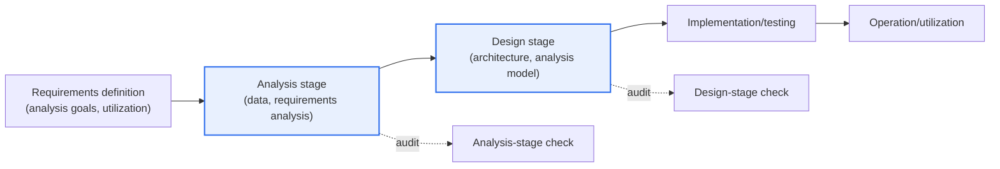
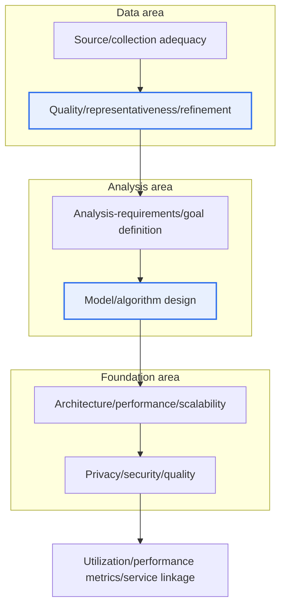

# Audit Checkpoints for Big Data Informatization Projects

## 1. Overview

### A. Background and Definition

> **Auditing a big data informatization project** is intended to complement the limitations of existing audit standards that fail to reflect the characteristics of intelligent-information technologies such as AI and big data; it focuses on checking the quality and representativeness of the data and the validity of the analysis model. In particular, the checkpoints by area in the **analysis and design stages** determine the project's success or failure.

The fundamental point where big data project auditing diverges from general software auditing is that "**the data and the analysis model are themselves the core of the deliverable**." Auditing a traditional informatization project focuses on 'whether the required functions were implemented as specified.' If screens, functions, and interfaces satisfy the requirements, quality is generally secured. But big data projects are different. Which data was secured and refined through which path, and with what assumptions and algorithms the analysis model was built upon it, determine the reliability of the result. No matter how robust the system, if the input data lacks representativeness or is biased and the analysis model's assumptions are invalid, the resulting predictions and insights become "plausible but wrong" results ("garbage in, garbage out"). For this reason, function-centric checking alone cannot catch the true risks of big data projects.

From this problem awareness, standards such as the **Intelligent-Information Technology Audit Practice Guide**, which reflect the characteristics of intelligent-information technology, were established, and within them big data projects gained a separate checking perspective encompassing data, analysis models, architecture, security, and utilization. That is, the core is that the center of gravity of auditing has shifted from '**whether functions are implemented**' to '**the validity and reliability of the data and analysis**.'

### B. Necessity

As big data/AI projects spread rapidly across the public sector as a whole (transportation, welfare, disaster, taxation, etc.) and their results are directly reflected in policy decision-making and public services, the weight of verification has grown. If the audit standards to verify these still remained function-centric, one would miss defects unique to big data—data bias, model overfitting, privacy violations—and the fact that 'the results cannot be trusted' would come to light only after the project ends. Because auditing is a mechanism that intervenes at the early and middle stages of a project, when there is still room to catch and reverse defects, checkpoints that reflect new-technology characteristics are precisely what secure both the project's substantive quality and its downstream risk. In particular, the analysis and design stages are the point at which the 'fundamental design'—hard to fix in the subsequent implementation and testing stages—is fixed, so the effectiveness of auditing is greatest there.

## 2. Auditing and Project Stages — Overall Structure

Auditing shifts its focus in step with the project's progress stages to catch defects early. The structural diagram below shows the life cycle of a big data project and the points of audit intervention. At the requirements-definition and analysis stages, it examines whether 'what, with which data' is valid; at the design stage, whether 'how to implement it' is appropriate. Because the cost of reversal grows as one moves to later stages, the density of checking at the analysis and design stages determines project quality.

At the **analysis stage**, it examines whether 'what, and with which data, to analyze' is valid. It checks whether the analysis requirements and goals are aligned with the project's purpose, and whether the source and collection targets of the data to be used are appropriate and have quality representative of the population. Missing representativeness/bias problems here contaminates all subsequent analysis. At the **design stage**, it examines whether 'how to implement it' is appropriate. It confirms whether the architecture for storing and processing large volumes of data, the design of the analysis algorithm and model, performance and scalability, and the plans for privacy protection, security, and quality management are designed to meet the requirements.

## 3. Checkpoints by Area

Big data auditing cross-checks the **five areas** of data, analysis (model), architecture, security, and utilization across the two stages of analysis and design. The detailed process diagram below shows the flow in which checking starts from data, passes through the analysis model, and continues to utilization. For each area, one must first understand 'why it is checked' before organizing it into a table. The types of defects frequently found in actual audits are as follows.

- **Data bias / lack of representativeness**: Source data skewed toward a particular channel or group.
- **Absence of quality-management procedures**: No criteria in the design for handling missing values, outliers, or duplicates.
- **Inadequate validation design**: A model overfitted without separation into training/validation/test data.
- **Missing personal-data de-identification**: No basis for handling sensitive information or plan for de-identification.
- **Absence of utilization design**: Analysis results not connected to services or decision-making.

### A. Data Area

The reason the data area is the first gateway is that in a big data project, data is both the 'raw material' and the ceiling on the reliability of the result. At the analysis stage, one examines the **adequacy of the data source and collection targets**. It checks whether a source conforming to the analysis purpose was chosen, whether it distorts the population by skewing toward a particular group, period, or channel (**sample bias**), and whether the necessary data can be secured lawfully. For example, if welfare-demand prediction for the whole population uses data over-sampled from only a particular age group, the result is biased no matter how sophisticated the model. At the design stage, one examines the **data model/storage design and standards/quality criteria**. It confirms whether data standards (terms, codes, formats) are defined, whether refinement/validation procedures for handling missing values, outliers, and duplicates are designed, and whether the large-volume storage structure matches the analytical access pattern. If data quality management is not baked into the design, quality degradation accumulates at the operation stage.

### B. Analysis (Model) Area

The analysis area is the core that distinguishes a big data project from general SI, and it is the part where auditing must be most careful. At the analysis stage, one examines the **validity of the analysis-requirements/goal definition**. It checks whether the problem to be solved is clearly defined, whether the metrics to judge success (accuracy, recall, business KPIs, etc.) were agreed in advance, and whether that goal is actually achievable with the data. If the goal is vague, it easily ends up as 'analysis for analysis's sake.' At the design stage, one examines the **appropriateness of the analysis algorithm/model design**. It confirms whether a technique matching the problem type (classification, prediction, clustering, recommendation, etc.) was selected, whether there is a validation design (separation of training/validation/test data, cross-validation) to prevent overfitting, whether the model's assumptions and limitations are documented, and whether stakeholders can interpret and explain the results (explainability). While it is hard for an auditor to judge the 'correct answer' of a data-science result, whether the **validation procedures and assumptions are methodologically valid** can and must certainly be checked.

### C. Architecture, Security, and Utilization Areas

The remaining three areas are the foundation that actually supports the analysis and safely connects results to services. **Architecture/infrastructure**: at the analysis stage, one examines whether processing-scale and performance requirements were realistically estimated; at the design stage, whether the big data platform (distributed storage/processing), scalability, and performance design meet the requirements. As data grows, the batch/real-time processing method and the resource-scaling strategy determine the speed and cost of producing results. **Security/quality** is especially important. Because big data often handles personal information in bulk, one confirms whether privacy/de-identification-processing requirements are defined at the analysis stage, and whether access control, encryption, de-identification (pseudonymization/anonymization), and quality-management plans are designed in conformance with the relevant laws (Personal Information Protection Act, etc.) at the design stage. The **utilization** area examines whether the utilization purpose and performance metrics are clear and whether the visualization/service-linkage design is valid from the user's perspective, so that analysis results connect to actual decision-making and services. However good the analysis, without a utilization design it becomes a 'project that ends as a report.'

| Area | Analysis-stage check | Design-stage check |
|---|---|---|
| **Data** | Adequacy of source/collection targets, quality/representativeness, bias | Data model/storage design, standards/refinement/quality criteria |
| **Analysis (model)** | Validity of analysis-requirements/goal/success-metric definition | Algorithm/model design, validation (overfitting prevention)/explainability |
| **Architecture/infrastructure** | Estimation of processing-scale/performance requirements | Big data platform/scalability/performance design |
| **Security/quality** | Definition of privacy/de-identification requirements | Access control/encryption/de-identification/quality-management plans |
| **Utilization** | Definition of utilization purpose/performance metrics | Visualization/service-linkage/decision-reflection design |

## 4. Cases and Practical Implications

How the checkpoints actually catch defects becomes clear through cases. First, a **sample-bias case**—if a local government designed a citizen-satisfaction analysis model using only online complaint data, the digitally vulnerable are structurally excluded and the result is distorted. Pointing out 'source representativeness' in the data-area check can reverse it at the design stage to supplement offline channels. Second, an **overfitting/no-validation case**—if a disaster-prediction model was reported at 99% accuracy fitted only to training data but has no design separating validation/test data, performance plummets in actual operation. The 'validation design' check in the analysis area filters this out in advance. Third, a **missing-de-identification case**—if de-identification-processing design is omitted while analyzing health/medical data, legal violations and re-identification risk arise. The security-area check enforces de-identification and access control at the design stage. In this way, each area's check is not an abstract checklist but **a mechanism that catches fundamental, hard-to-reverse defects at a time when they can still be reversed**.

The difference from general auditing is also organized as a practical implication. If general SI auditing is static verification that looks at 'implementation match against a functional specification,' big data auditing verifies the **probabilistic/statistical quality** of the data's representativeness and the model's validity. Contrasting the two audits by axis gives the following.

- **Object of check**: (general) functions, screens, interfaces ↔ (big data) data source, quality, analysis model.
- **Nature of quality**: (general) correctness of specification conformance ↔ (big data) probabilistic reliability of representativeness/validity.
- **Core risk**: (general) missing requirements/defects ↔ (big data) data bias, overfitting, privacy violations.
- **Auditor capability**: (general) SW engineering ↔ (big data) SW engineering + data, statistics, privacy regulation.
- **Deliverables**: (general) defect list, correction requests ↔ (big data) including data/model risk factors and improvement recommendations.

Therefore, an auditor is required to have, in addition to traditional SW engineering knowledge, an understanding of data quality, statistics, and privacy regulation, and audit deliverables must go beyond a simple defect list to point out the fundamental risks of the data and model to be effective.

## 5. Deeper Dive — Latest Trends and Expansion into AI Auditing

Big data auditing is recently on a trend of expanding and deepening into **AI (artificial intelligence) project auditing**. As generative AI and machine learning are adopted in earnest in public projects, the following are emerging as new checking axes in addition to the existing data-quality-centric checks.

- **Fairness/bias**: Whether it produces discriminatory results unfavorable to a particular group.
- **Explainability (XAI)**: Whether stakeholders can interpret the basis of the model's judgment.
- **Reproducibility**: Whether the same result is reproduced under the same data and conditions.
- **Continuous performance monitoring (model drift)**: Whether performance degrades due to shifts in data distribution during operation.
- **Accountability/governance**: Whether there is a management and traceability framework for model changes and decisions.

These axes bring under the scope of auditing not only 'consistency at design time' but also 'continuous quality during operation.' Internationally, standards such as the AI management-system standard ISO/IEC 42001 and, from a risk-management perspective, the NIST AI RMF have emerged, and there is a trend of establishing frameworks that manage and verify the entire life cycle of data and models. In Korea, too, the intelligent-information technology audit guide is being revised and supplemented to reflect this perspective. This means the field of view of auditing is broadening from 'consistency at the analysis/design point' to **continuous verification**—'whether the model does not degrade and become biased as time passes during operation.' Therefore, from an engineer's perspective, one needs to view big data auditing not as an independent procedure but as part of a continuous quality-assurance framework linked with data governance and AI governance. (It is advisable to confirm the latest versions and revisions of specific standards from the originals at the time of the project.)

## 6. Considerations and Implications

1. **Checking centered on the validity of data and the analysis model, not functions**, is the core. Because the representativeness/quality of the data and the methodological appropriateness of the analysis model determine the reliability of the result, one must place the center of gravity of auditing here and secure auditor capability (understanding of data, statistics, regulation) accordingly.

2. **Privacy protection and data-ethics checking must be strengthened.** Because big data handles personal information in bulk, one must confirm, by the standard of the relevant laws, whether de-identification, access control, and a lawful-processing basis are reflected in the design, and must also examine re-identification risk and the possibility of discrimination due to bias.

3. **Verify the reliability, reproducibility, and explainability of analysis results in advance at the design stage.** Check overfitting-prevention designs such as validation-data separation and cross-validation, and the explainability that lets stakeholders interpret results, in advance, to prevent failure after the project ends.

4. **Make the most of the effectiveness of early intervention at the analysis and design stages.** Defects must be caught at the early stage when the fundamental design is fixed, because the cost of reversal is small. Auditing must be operated not as a formal rite of passage but as a risk-management means that identifies and corrects risk early.

5. **Aim for linkage with data/AI governance.** Beyond a one-time audit, connecting it to a governance framework that continuously manages and monitors data standards, quality, and model performance keeps the quality of a big data project maintained into the operation stage.

---

> **In one line**: Auditing a big data informatization project cross-checks the five areas of *data (source/quality/representativeness), analysis model (requirements/validation/explainability), architecture, security, and utilization* across the analysis and design stages; its core is confirming the validity and reliability of the data and analysis model rather than whether functions are implemented, and recently it is expanding into AI auditing and data governance.
