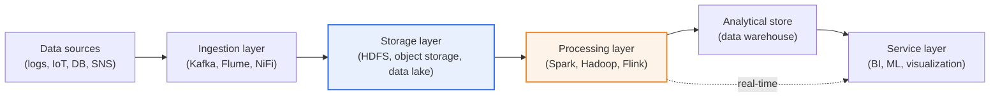
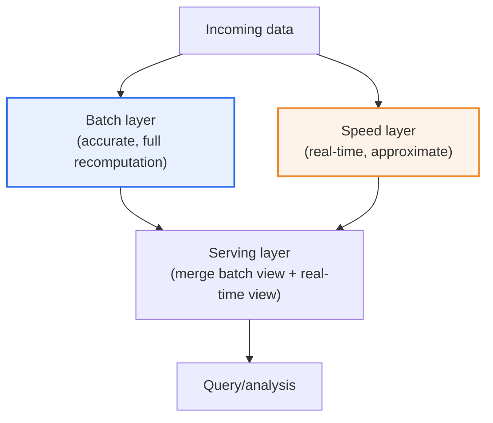

# Big Data Platform Architecture Design

## 1. Overview

### A. Definition
> **Big data platform architecture** refers to a technical structure that layers infrastructure, data structures, and input/output flows so as to stably support the entire process of **ingesting → storing → processing → analyzing → serving/visualizing** high-volume, high-variety, high-velocity data.

The reason big data platform design is inherently difficult lies in the fact that a single system must simultaneously handle the so-called **3Vs (Volume, Variety, Velocity)**. The **volume** of data grows beyond terabytes to petabytes; in terms of **variety**, structured data from relational DBs, semi-structured data such as web logs and JSON, and unstructured data such as video, audio, and text are all intermingled; and in terms of **velocity**, real-time streams that flow in at tens of thousands per second coexist with large batches that run once a day. This is sometimes extended to the 5Vs by adding Veracity and Value. Trying to handle all these characteristics with only the vertical scaling (scale-up) of a single traditional RDBMS causes performance, cost, and availability to collapse at once.

Therefore, big data platforms are designed hierarchically according to the principle of **separation of concerns**. A **distributed infrastructure layer** that bundles multiple servers to hold the infinitely growing data is placed at the very bottom; on top of it, a **data storage-structure layer** (data lake, warehouse, lakehouse) tailored to the shape and purpose of the data; and on top of that again, a **processing/I-O layer** spanning batch and real time. Finally, a **service layer** consumed by analysis, machine learning, and BI is positioned. Dividing into layers this way lets each layer be scaled and replaced independently, so one can respond to surging data without redesigning the whole system.

### B. Background and Design Principles
Behind the emergence of big data platforms, two currents intertwine. One is that the spread of mobile, IoT, and social media caused the **volume of data generated to explode exponentially**; the other is that **scale-out computing technology** (Google's GFS/MapReduce papers, and Hadoop, which open-sourced them), which bundles hundreds to thousands of x86 commodity servers for distributed processing, matured. As the economics were secured of achieving the same performance with many cheap servers instead of expensive high-performance single machines, it became possible to gather and analyze even the log and sensor data that used to be discarded.

Against this background, big data platform design follows these principles. First, it takes **horizontal scalability (scale-out)**—increasing capacity/performance by adding servers—as the default. Second, it **separates storage and processing** by data characteristic to handle structured and unstructured data each in the optimal way. Third, it adopts a processing structure (Lambda/Kappa) that supports **batch and real time together**. Fourth, it secures **high availability and fault tolerance (replication, fault tolerance)** so that the whole does not halt even if some nodes die. Fifth, it embeds **data governance** that manages data quality, security, and lineage from the earliest design stage.

## 2. Overall Architecture Structure (Components by Layer)

The key to a big data platform is to understand the pipeline through which data flows by dividing it into layers. The conceptual diagram below shows the whole skeleton through which data passes from ingestion to serving.

The **ingestion layer** is the gateway that stably pulls data from scattered sources. Sources are highly varied—application logs, IoT sensors, operational DBs (CDC), external APIs/SNS, and more. Here, a **message queue/stream buffer** is placed to cushion momentarily concentrated traffic and to decouple producers from consumers. The representative technology, Apache Kafka, receives data by topic, writes it sequentially to disk, and lets multiple consumers read at their own pace, preventing an ingestion surge from immediately propagating into a storage/processing failure. Flume is commonly used for log collection and NiFi for flow-based integration.

The **storage layer** is the foundation that stores source data in raw form and in bulk. Hadoop's **HDFS** splits large files into blocks and stores them distributed and replicated (default 3 copies) across multiple nodes, securing petabyte-scale capacity and fault tolerance simultaneously with cheap servers. In the cloud, this role is taken by **object storage** such as Amazon S3 and GCS, which can decouple storage and computing, making it advantageous for elastic operation that attaches and detaches processing resources only when needed.

The **processing layer** computes the stored data in parallel to turn it into meaningful results. Early Hadoop MapReduce was disk-based and thus slow for iterative computation, but **Apache Spark** loads data into memory for processing, making iterative machine learning and interactive analysis several to tens of times faster. For pure streaming that needs millisecond-level latency, Apache Flink shows its strengths. Because the processing layer must handle both paths—batch and real time—it becomes the center of gravity of architecture design.

The **service layer** is the point where processing results are consumed by people and applications. Refined data is loaded into a **data warehouse** (e.g., a columnar analytical DB) to draw dashboards with BI tools, or fed into an ML pipeline to train and serve predictive models.

| Layer | Role | Representative technologies |
|---|---|---|
| **Ingestion** | Inflow and buffering of source data | Kafka, Flume, NiFi, Logstash |
| **Storage** | Distributed storage of large raw data | HDFS, S3/object storage, data lake |
| **Processing** | Parallel batch/stream computation | Hadoop, Spark (in-memory), Flink |
| **Analysis/service** | BI, ML, visualization consumption | Data warehouse, ML, BI tools |

The fundamental reason for dividing into layers this way is that **the rate of change and scaling requirements of each layer differ from one another**. The ingestion layer adds connectors whenever a new source is attached, the storage layer grows in capacity linearly with data accumulation, and the processing layer's resource demands swing according to the nature of the analytical workload (batch, real time, ML). Designing with layers coupled means a change in one part spreads into a whole-system redesign, but keeping them separate enables **incremental evolution**—for example, leaving storage as is and swapping only the processing engine from Hadoop to Spark. This flexibility is the practical key to simultaneously handling surging data and rapidly changing analytical needs.

## 3. Data-Structure Design and Input/Output (Processing) Structure Design

### A. Data-Structure Analysis and Store Selection
Data-structure design starts from classifying "what we are handling." One divides data into **structured (relational tables), semi-structured (JSON, XML, logs), and unstructured (video, audio, documents)**, and grasps each datum's source, collection interval, quality, and utilization purpose so that a storage strategy can stand. Structured data with a fixed schema goes to the warehouse, and semi-structured/unstructured data with fluid shapes goes to the lake—placing them according to their characteristics.

A **data lake** stores source data raw, without processing. Because it is a **schema-on-read** approach that does not enforce a schema at store time, its greatest advantage is the flexibility of cheaply amassing even data for which one has not yet decided what analysis to do in the future. On the other hand, without management discipline, it risks degenerating into a **data swamp** that no one can use.

A **data warehouse** is an analysis-dedicated store that loads refined, structured data with a **schema fixed at store time (schema-on-write)**. Quality and consistency are guaranteed, so it is strong for structured reporting and BI, but it struggles to accommodate unstructured data and incurs up-front modeling cost. In practice, a **two-tier structure** is common—amassing sources in the lake and promoting refined copies to the warehouse. Recently, the **lakehouse**, which merges the strengths of both, is rising; it places a transaction/schema-management layer (e.g., open table formats such as Delta Lake, Apache Iceberg, and Hudi) on top of the lake's cheap object storage to secure warehouse-grade reliability directly on the lake.

| Store | Schema approach | Data | Strengths / Limitations |
|---|---|---|---|
| **Data lake** | schema-on-read | Structured + semi-structured + unstructured (raw) | Flexible, low cost / swamp risk |
| **Data warehouse** | schema-on-write | Refined structured | Quality, performance / weak on unstructured |
| **Lakehouse** | Table-format-based | Lake + transactions | Integration, reliability / maturity |

### B. Input/Output (Processing) Structure — Lambda and Kappa
Input/output structure design determines "when and with what latency" data is processed. Because **batch**, which piles up large volumes to compute precisely, and **streaming**, which processes on inflow to obtain low latency, have conflicting requirements, an architecture pattern that unifies them is needed. The conceptual diagram below is the detailed flow of the Lambda architecture, which runs the two paths in parallel.

The **Lambda architecture** flows the same data through two paths. The **batch layer** periodically recomputes the entire dataset—accurate but high-latency—and the **speed layer** processes only recent data with real-time approximation—low-latency. The **serving layer** merges the two results to provide "accuracy" and "real-time-ness" together. Its downside is that one must build and maintain two sets of logic, batch and stream, making **code duplication and operational complexity** large.

The **Kappa architecture** removes this duplication by stripping out batch and **unifying all processing into a single stream**. When past data must be reprocessed, it replays the stream log (Kafka) from the beginning. With a single set of logic it is simple, but large-scale reprocessing performance and state management are the key challenges. **Which to choose is decided by the trade-off between accuracy requirements and operational complexity.** If real-time-ness matters less and consistency is the top priority, choose Lambda (or batch-centric); if stream-centric services and logic simplification matter, choose Kappa.

## 4. Comparison and Real Application Cases

The choice between batch and streaming is decided not by simple technical taste but by **the latency the business requirements allow**. For example, a report that aggregates the previous day's sales every morning is fine with several hours of latency, so batch is economical, but card-payment fraud detection (FDS) must judge within hundreds of milliseconds, so streaming is essential. The latency requirement is what divides the architecture.

Looking at actual industry cases, differences in design philosophy are revealed. **Netflix** is famous for a streaming-centric pipeline that bulk-collects viewing logs via Kafka to use for recommendation and encoding optimization, and **Uber** places stream processing at its core to compute real-time demand and pricing (surge pricing) while running batch analysis in parallel on a large data lake (having developed Hudi in-house). In Korea, too, large commerce companies and telcos broadly operate structures that flow log/order data through Kafka → Spark → warehouse. What these have in common is that **rather than using a single correct architecture, they combine batch and stream to match each service's latency and accuracy requirements**.

| Requirement | Suitable processing | Case |
|---|---|---|
| Large latency tolerance, consistency top priority | Batch | Daily/monthly settlement, regulatory reports |
| Ultra-low latency, immediate judgment | Streaming | Fraud detection, real-time recommendation |
| Both needed | Lambda/Kappa | Dashboards + settlement in parallel |

Another trade-off frequently encountered in practice is **the tension between the data lake's flexibility and governance**. Early on, with the judgment "let's just gather everything first," one loads sources into the lake without limit, but after a few years without metadata/quality discipline, it becomes a state where no one knows what data is where or which is trustworthy. Uber's development of its own table format (Hudi), mentioned earlier, is also a result of trying to solve this swamp problem head-on by giving a petabyte-scale lake incremental updates, transactions, and data lineage. In other words, the trend of large-scale cases converging on the lakehouse should be read not as fashion but as an inevitable evolution toward securing flexibility and reliability at the same time.

## 5. Deeper Dive — Evolution toward Cloud, Lakehouse, and MLOps

Big data platforms are recently evolving rapidly in three directions, and reading these currents matters from an engineer's perspective.

First, the **move from on-premises Hadoop to cloud managed services**. Instead of the burden of building and operating a cluster of hundreds of machines directly, the approach of decoupling storage (object storage such as S3) and computing and elastically attaching processing resources only when needed is becoming standard. This greatly raises resource efficiency and operational convenience.

Second, the **convergence of lake and warehouse, i.e., the rise of the lakehouse**. As open table formats such as Delta Lake, Apache Iceberg, and Apache Hudi provide ACID transactions, schema evolution, and point-in-time queries (time travel) on top of cheap object storage, there is a clear trend toward unifying into a single layer the dual structure of "keeping raw in the lake and refined copies again in the warehouse."

Third, the **expansion from analysis into AI/ML pipelines**. As stored data becomes the raw material for model training and serving beyond reporting, **MLOps**—which automates and operates the data pipeline and the model life cycle together—and the **feature store**—which manages features to be reused across the organization—are being incorporated as essential components of the platform. Amid this current, the big data platform is expanding its role beyond a simple storage/analysis foundation into the **data backbone of AI services**.

## 6. Considerations and Implications

1. **Balancing scalability and cost** is the first key of design. Room to scale out in preparation for data growth is essential, but excessive up-front investment is waste, so elastically adjusting resources to actual demand via storage/compute decoupling and cloud autoscaling is the solution to the trade-off.
2. **Embed data governance/quality from the start.** No matter how good the infrastructure, without metadata/quality/security management the lake becomes a 'data swamp.' A data catalog and lineage tracking must be reflected at the design stage. [[data-governance]]
3. **Judge the batch/real-time processing strategy by service requirements.** Over-designing to make everything real time only increases complexity and cost. Choose among batch/Lambda/Kappa based on the latency tolerance, and evaluate the operational burden of dual logic together.
4. **Compliance with security/privacy regulations** is essential. Since it handles large volumes of personal information, access control, encryption, de-identification, and regulations such as the Personal Information Protection Act and GDPR must be reflected in the architecture.
5. **On the premise of evolution toward the lakehouse/MLOps**, choosing open standards (open table formats, standard connectors) to reduce vendor lock-in and securing room to expand for AI-service linkage is advantageous as a long-term strategy.

## References
- Apache Hadoop official documentation: https://hadoop.apache.org/docs/stable/
- Apache Spark official documentation: https://spark.apache.org/documentation.html
- Apache Kafka official documentation: https://kafka.apache.org/documentation/
- Introduction to the Lambda Architecture: http://lambda-architecture.net/
- Delta Lake (lakehouse) official: https://delta.io/

---

> **In one line**: Big data platform architecture is a *scalable layered structure supporting ingestion → storage → processing → analysis/service*, placing a data lake/warehouse/lakehouse on top of distributed infrastructure and combining batch and real time (Lambda/Kappa); scalability and cost, governance, and responding to evolution toward cloud/MLOps are the core of design.
