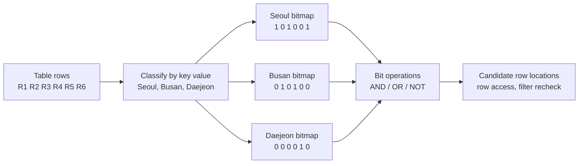
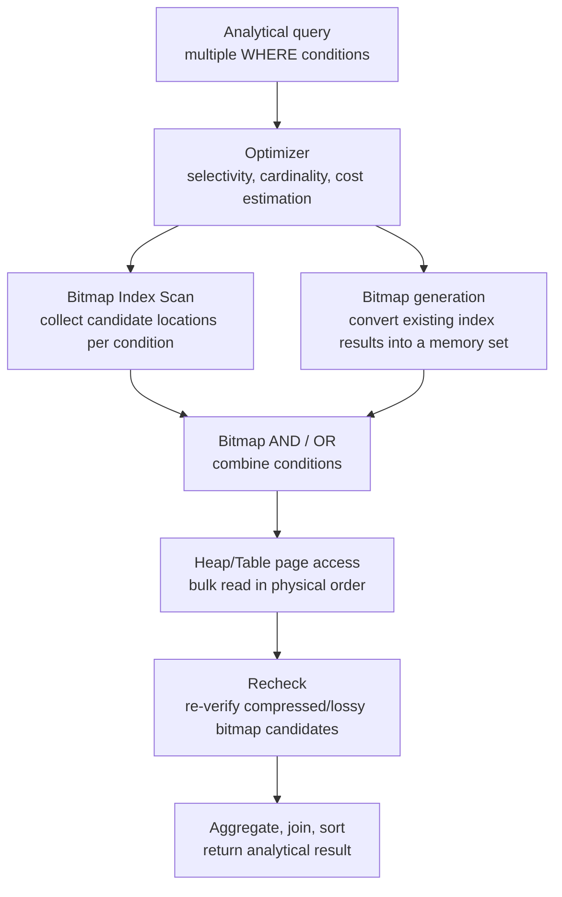

# Bitmap Indexes and Analytical Database Optimization

## 1. Overview

> A **bitmap index** is a database index structure that represents, for each value of the index key, the presence or absence of rows as a bit string, and quickly computes the intersection and union of multiple conditions through bitwise operations.

A typical B-Tree index links a specific key to the location of the corresponding row. A bitmap index, by contrast, represents in which rows a single value appears as an array of 0s and 1s. For example, ANDing a bitmap that marks only the bits of rows where `gender=female` with a bitmap where `region=Seoul` obtains at once the locations of rows that satisfy both conditions.

This approach is especially effective for low-cardinality columns with few distinct values and for analytical queries targeting large numbers of rows. Columns with many repeated values—such as gender, region code, signup channel, product grade, and order status—are easy to compress into bitmaps, and analysts frequently run queries that combine conditions across several dimensions.

Conversely, in an online transaction table where orders are continuously inserted, updated, and deleted, the cost of bitmap updates and concurrency control can grow large. Therefore, a bitmap index should be understood not as "an index always faster than a B-Tree" but as an analytical-optimization means chosen while jointly considering the data's cardinality, change frequency, query shape, and the storage engine's implementation.

In an engineering exam answer, one should not stop at explaining the bitmap's structure but should connect it to why it suits a low-cardinality, read-centric environment, what trade-offs exist with a B-Tree, and how it applies in a data warehouse and star schema. In particular, because a "permanently stored Bitmap Index" and a "Bitmap Scan generated temporarily in the execution plan" can differ depending on the database product, distinguishing these two is important.

## 2. Structure and Operating Principle

A bitmap index stores the correspondence between the value set of the indexed column and row locations as bits. In the figure below, each value has one bitmap, and the bit positions point to the logical or physical row locations of the table.

### 2.1 Correspondence Between Key Values and Bit Positions

Suppose a table has 6 rows and the region column is stored in the order Seoul, Busan, Seoul, Busan, Daejeon, Seoul. The Seoul bitmap becomes `[1, 0, 1, 0, 0, 1]`. Because the first, third, and sixth bits are 1, it means those rows are Seoul.

A single bit alone does not represent all the information. Along with the bitmap, the database manages a dictionary of key values, the storage location of the bitmap, compression blocks, and mapping information that converts row locations into actual page addresses. Therefore, a bitmap index is ultimately still an index that navigates to table rows, and a step is needed to connect the bit-operation result to actual data-page access.

Whether NULL is represented as a separate state, and how empty positions caused by row insertion/deletion are managed, differ by product and implementation. In an exam answer, it is safer to explain the core principle that "each bit indicates the presence of a row" while noting that the physical rowid and the NULL-handling method vary by DBMS.

### 2.2 Bitwise Query Processing

When the query `region=Seoul AND channel=mobile` arrives, the database ANDs the Seoul bitmap and the mobile bitmap. Because only positions where both bits are 1 remain 1, it can quickly build the set of rows that may satisfy both conditions.

`region=Seoul OR region=Busan` ORs the two bitmaps. Positions that are 1 on either side remain in the result. `NOT region=Seoul` can be thought of as taking the 0 positions of the Seoul bitmap, but because there are correction rules that include NULL and deleted rows, in actual execution it does not end as a simple bit inversion.

When multiple conditions are combined, bitmap operations can efficiently use CPU registers and memory bandwidth. Because it processes compressed bit blocks sequentially instead of following index entries row by row, it is advantageous when performing multidimensional filters on fact tables of tens of millions of rows or more.

### 2.3 Compression and Storage Efficiency

In a column with repeated values, long runs of consecutive 0s or 1s appear. In this case, instead of storing all bits raw, one can apply compression that stores run lengths or intervals. For example, expressing a long run of 0s as "10,000 zeros" can reduce storage space and disk reads.

Compression efficiency depends on data distribution and row placement. If the same value is physically clustered together, long runs form and compress well, but if values are randomly mixed, bits change frequently and the compression effect diminishes. Therefore, sorting during ETL, partition composition, and clustering are not merely storage management but also affect bitmap performance.

Compression reduces storage space at the cost of possible decompression or interval-conversion overhead. However, in analytical queries, the effect of reducing disk I/O is often greater than the CPU cost. Performance evaluation should not look only at index size but should measure cache hit rate, logical reads, physical reads, bit-operation time, and final table-access time together.

## 3. Key Components and Execution Flow

A bitmap-index-based query generally goes through the flow "condition analysis → bitmap generation or lookup → bitmap combination → data-page access → residual-condition verification." In a DBMS that provides a permanent bitmap index, the index is stored in advance; in engines that do not, a bitmap may be built at runtime from the results of a B-Tree or similar.

### 3.1 The Optimizer's Choice

The optimizer evaluates the bitmap path using the estimated number of returned rows, the column's selectivity, index and table statistics, and memory and I/O costs. If very few rows satisfy the condition, it is better to go directly to the few rows via a B-Tree index. Conversely, if many rows exist on scattered pages, the cost of visiting each row randomly grows, so the bitmap approach can become advantageous.

When statistics grow stale, the optimizer mispredicts selectivity. If it estimates 40% when the condition's result is actually 1%, or conversely predicts few rows when many are returned, it may choose the wrong plan between bitmap and sequential scan. Therefore, the statistics-collection interval and detection of data-distribution changes must be managed together with index design.

### 3.2 Bitmap AND/OR and Set Processing

In a multidimensional search, one builds a candidate bitmap per condition and then combines them with AND/OR. AND is the direction of reducing candidates as conditions are added, and OR is the direction of merging several categories to increase candidates. Because this operation is performed by bit block instead of comparing rows one by one, it reduces the amount of computation on large data.

However, adding many conditions does not always make things faster. There is the cost of reading and combining each bitmap and the cost of final table access. If a particular condition passes almost all rows, that bitmap has low selectivity and helps little, and if it does not compress well, it can instead enlarge the intermediate result.

### 3.3 Table-Page Access and Recheck

The combined bitmap is not the actual rows themselves but a candidate set of row locations. The engine reads table pages based on the candidate locations and fetches the necessary columns. Reading rows grouped in physical page order lets several rows on the same page be processed at once, reducing random I/O.

A compressed or lossy bitmap may, to reduce memory usage, express only "this page has candidates" at the page level. In this case, all rows of the candidate page are read and then the original condition is re-verified. Therefore, a Recheck appearing in the execution plan does not mean the index is wrong; it may be a normal candidate-re-verification process for saving space and memory.

## 4. Types and Related Structures

### 4.1 Single-Column Bitmap Index

A single-column bitmap index has per-value bitmaps for one dimension. It is easy to apply to a column with only two distinct values, such as gender, or a column with a small fixed code set, such as region code or status code.

The advantage of this structure is that multiple single-column indexes can be combined. If region, channel, and membership grade are each indexed, then whatever combination of conditions an analyst enters, the candidate rows can be built by ANDing each bitmap. However, adding them indiscriminately to all columns increases index-maintenance cost and storage space.

### 4.2 Multi-Column Bitmaps and Function-Based Indexes

Depending on the DBMS, one can compose a combination of several columns into a single index key, or create an index on an expression that extracts the year or month from a date. Such designs reduce frequently repeated analytical conditions, but if the query expression differs from the index definition, the optimizer may not use it.

Multi-column indexes have the problem that the number of combinations surges. Pre-building all value combinations of columns A, B, and C makes the index large and sensitive to value-distribution changes. Therefore, for general-purpose ad hoc analysis, a combination of single-dimension bitmaps is flexible, while for repeated key reports, a multi-column or pre-aggregated structure can be advantageous.

### 4.3 Bitmap Join Index

In a star schema, there are many queries that filter by joining the fact table's foreign keys with dimension-table attributes. A bitmap join index is designed to link dimension-attribute values with fact-table row locations so that fact-row candidates can be built quickly without joining the dimension table every time.

For example, if the region code of a customer is not stored directly in the sales fact table but exists only in the customer dimension table, a query for "sales of Seoul customers" requires a join of the customer dimension and the sales fact. A bitmap join index expresses this relationship at the index level, reducing the cost of the repeated dimension filter.

In exchange, index-maintenance cost arises when dimension values change or the relationship between fact and dimension tables changes. It suits dimensions that rarely change for analysis and fact tables where bulk lookups repeat; forcing it onto an operational table with frequent changes increases update latency.

## 5. Comparison with B-Tree and Hash Indexes

A B-Tree searches a sorted key space, so it is strong for range searches, providing sorted results, and high-cardinality point lookups. A bitmap index, by contrast, bundles per-value row sets as bits, so it shows strength in analytical queries that combine several low-cardinality conditions.

A hash index is a structure that uses hash values to quickly find equality comparisons. It is weak at range conditions and sorting and has engine-specific constraints. A bitmap is advantageous for analysis that combines equality conditions, but when the number of distinct values is very large or updates are frequent, a bitmap is not always suitable.

| Category | Bitmap index | B-Tree index | Hash index |
|---|---|---|---|
| Basic representation | Per-value bit string and row location | Sorted key and row location | Hash bucket and key location |
| Suitable cardinality | Low to medium | Low to high, general-purpose | Equality-condition-centric |
| Strength | Multi-condition AND/OR, large-scale analysis | Range, sort, point lookup | Exact equality lookup |
| Data change | Advantageous for read-centric, possible update burden | General-purpose for typical OLTP | Consider engine-specific constraints and collisions |
| Result access | Page access after candidate bitmap | Direct row access in key order | Candidate access from bucket |
| Representative application | Data warehouse, star schema | Transaction tables, mixed workloads | Specific key lookup |

What matters in this comparison is the access pattern rather than the index name. Making a bitmap on a column where almost all values differ, such as a customer number, produces too many per-value bitmaps and weakens the compression benefit. Conversely, even a column with few distinct values, such as gender, may be simpler with a B-Tree's direct search for an OLTP query that finds only a single row.

Also, B-Tree and bitmap are not mutually exclusive choices. In an analytical system, one can place a B-Tree on date and unique identifiers and a bitmap on status, region, and channel together, letting the optimizer choose per query. However, as redundant indexes increase, load time and storage space grow, so usage must be monitored.

## 6. Application Procedure and Operational Strategy

First, collect the business queries. Grasp which columns recur in WHERE/JOIN/GROUP BY, what proportion of rows the results are, and how date ranges are used. An index should start not from the table definition but from the actual access pattern.

Second, measure per-column cardinality and change frequency. A low `distinct value count / total row count` does not automatically make it suitable. If a column undergoes millions of DML operations a day, bitmap-maintenance cost and lock contention can be bigger problems.

Third, compare execution plans based on representative queries. Record total cost, actual execution time, logical/physical I/O, CPU, memory usage, and returned row count before and after adding the bitmap index. Looking only at averages may miss bottlenecks at peak times, so measure business hours and batch hours separately.

Fourth, decide the data-loading and index-maintenance strategy. Choose whether to disable the index before a bulk load and rebuild it afterward, replace it by partition, or maintain it with each incremental ETL. This decision creates a trade-off between data freshness and the batch window.

Fifth, clean up unused indexes. The mere fact that an index exists does not guarantee quality. If the optimizer repeatedly chooses a sequential scan, review the statistics, distribution, query shape, and index design, and consider removing ineffective indexes to reduce operational complexity.

## 7. Cases and Performance Interpretation

### Case 1: A Retail Data Warehouse

Suppose a retail company's sales fact table has hundreds of millions of rows and is loaded by a daily sales batch. Analysts aggregate sales by combining several conditions, such as "Q2 2026, Seoul region, mobile channel, a particular product group." Because region, channel, and product group have many repeated values and the query reads many rows and then aggregates, a bitmap combination is highly likely to be suitable.

Here, one can use the date column as the partition key to first narrow the period, and within a partition, ANDing region, channel, and product-group bitmaps as a strategy. When partition pruning and bitmap filtering work together, unnecessary partitions and row pages can be reduced. However, the actual effect varies with the physical sort of the data, partition size, compression method, and the parallelism of the aggregation operation.

### Case 2: An Order-Processing OLTP System

Suppose that in an online order table, the order status changes among payment-pending, payment-complete, in-delivery, and canceled, with many updates per second. The status column has low cardinality and thus looks like a bitmap candidate, but each status change requires index maintenance and concurrency control.

If the operational screen queries only a few recent orders of a particular status, a B-Tree centered on date and order number can provide a more predictable response. Even if a bitmap is added, it is safer to limit it to an analytical read replica or a separate aggregation table. This case shows that one must not decide an index by column cardinality alone.

### Case 3: Interpreting PostgreSQL's Bitmap Scan

In a system like PostgreSQL that can combine multiple index results into a bitmap in the execution plan, a "Bitmap Index Scan" does not mean a permanent bitmap index exists. It may be an execution strategy that scans each B-Tree index, builds the results into a memory bitmap, performs BitmapAnd/BitmapOr, and reads table pages with a Bitmap Heap Scan.

Therefore, an engineer must check the product documentation and the execution plan together. The storage/update characteristics of a permanent Bitmap Index and the memory/page-access characteristics of a runtime-generated bitmap scan differ in performance and in the causes of incidents. Including this distinction in an answer connects the structural explanation with operational diagnosis.

## 8. Deeper Dive: Data-Warehouse Optimization and Modern Storage Engines

A bitmap index has a complementary relationship with columnar storage, compression, and vectorized execution. Columnar storage reads only the needed columns and processes the values of the same column contiguously, while the bitmap quickly reduces row candidates. Applying both together lets one use bit operations in the filter stage and column-wise SIMD processing in the aggregation stage.

However, not all columnar analytical engines expose a traditional bitmap index to users. Some engines provide a similar effect through other structures such as dictionary encoding, zone maps, delete vectors, run-length compression, and vectorized filters. Therefore, rather than the product-centric expression "install a bitmap index," one should first define the logical goal "process the set filter of low-cardinality conditions with compression and vectorization."

As data grows, partition-level management becomes more important than index rebuilding. Old partitions can be fixed as read-only and strongly compressed, while the latest partitions can apply a different index strategy to match loading/update demands. Combining time-axis data-lifecycle management with index policy this way lets one control storage cost and query performance at the same time.

On the quality side, even if an index produces fast results, freshness and consistency must be guaranteed. If ETL failure causes a mismatch between the point-in-time of the bitmap and the fact data, wrong aggregations can be returned, so a data-quality gate that verifies row counts, checksums, per-partition statistics, and representative query results after loading completes is needed.

## 9. Considerations and Implications

### 9.1 Cardinality and Selectivity

Low cardinality is an advantageous starting point, not a sufficient condition. Even if a column has few distinct values, if a particular query returns most rows, the filter effect is weak. One must jointly evaluate the returned-row count relative to the total, the skew of the value distribution, and the candidate-reduction rate after combining conditions.

### 9.2 DML and Concurrency

A bitmap index fits well with read-centric, batch-loaded environments, but in OLTP with frequent row changes, update cost and contention can become problems. A design is needed that separates operational and analytical tables, or limits the scope of changes via read replicas, partition swaps, or micro-batches.

### 9.3 Statistics and Execution Plans

Do not stop after creating an index; operate statistics updates and execution-plan regression tests. If the data distribution changes or new conditions are added, the optimizer may make a different choice among sequential scan, B-Tree, and bitmap paths. Detecting plan changes in the deployment pipeline lets one find performance degradation early.

### 9.4 Partitioning, Compression, and Storage Layout

Bitmap performance is affected not only by the index itself but also by row placement and partition design. Date partitioning, clustering, compression unit, and cache capacity must be designed together. In particular, it is important not to treat the high change frequency of the latest partition and the read-centric nature of past partitions under the same policy.

### 9.5 Differences in Meaning by Product

Oracle's permanent Bitmap Index, PostgreSQL's Bitmap Index Scan, and a columnar engine's bitmap filter have similar names but can differ in storage, generation, and update methods. In exam answers and field diagnosis, do not generalize the feature name as-is; first confirm "is it a persistent index, or a runtime temporary set?"

### 9.6 Balancing Performance and Cost

Adding indexes to every dimension for performance increases storage space, load time, and operational complexity. Set investment priorities based on the business value and SLA of core queries, and quantify per-index usage, saved I/O, and added maintenance cost. From an engineer's perspective, one should value the total cost of ownership and predictability of the entire data platform over the top performance of a single query.

## References

- [Oracle Database Concepts — Indexes and Index-Organized Tables](https://docs.oracle.com/en/database/oracle/oracle-database/21/cncpt/indexes-and-index-organized-tables.html)
- [PostgreSQL Documentation — Combining Multiple Indexes](https://www.postgresql.org/docs/current/indexes-bitmap-scans.html)
- [PostgreSQL Documentation — Index Scanning](https://www.postgresql.org/docs/current/index-scanning.html)

---

> **In one line**: A bitmap index accelerates multi-condition filters by combining per-value row sets as compressed bits in low-cardinality, read-centric analytical environments, but it is a selective optimization technique that must be evaluated together with DML, concurrency, and product-specific execution semantics.
