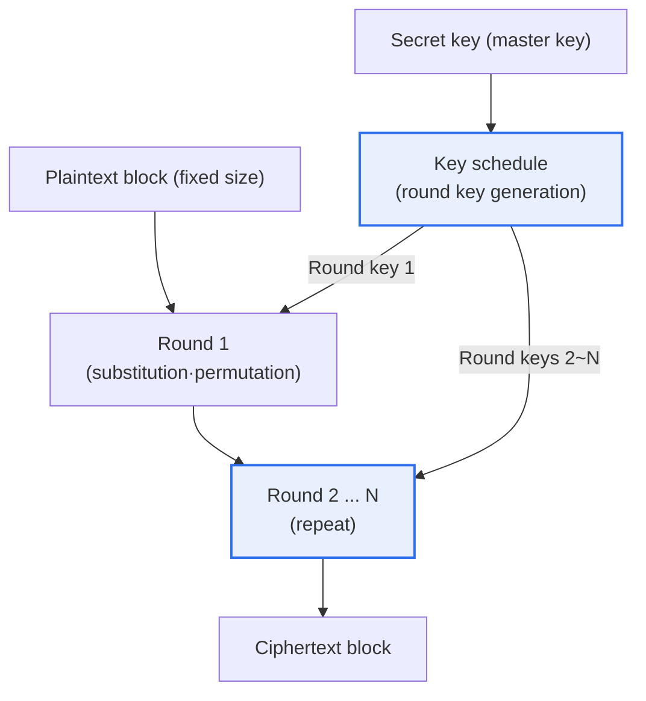
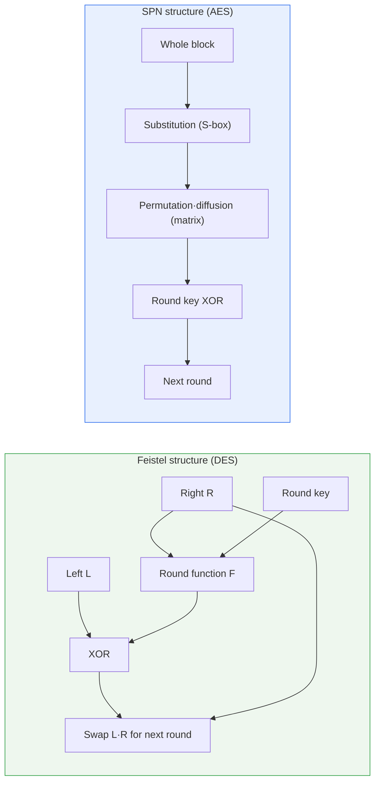
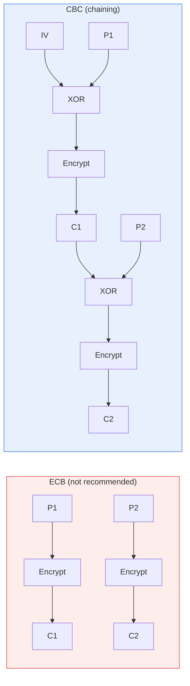

# Block Cipher Algorithms

## 1. Overview

### A. Definition
> A block cipher is a **symmetric-key cipher that divides plaintext into fixed-size blocks (e.g., 64-bit or 128-bit) and encrypts and decrypts each block with a single secret key**. It contrasts with stream ciphers, which generate a keystream bit by bit or byte by byte and process data sequentially.

The reason block ciphers emerged and became the foundation of modern cryptographic systems lies in a practical demand: "**encrypting large volumes of data quickly, securely, and in a standardized way**." Until the 1970s, cryptography was a closed technology confined to the military and diplomatic domains, but as financial computerization and commercial communications spread, there arose a need for openly verifiable, public standard ciphers that anyone could scrutinize. The starting point was the U.S. NBS (now NIST) adopting DES as a standard in 1977; subsequently, through the AES competition (1997–2001), block ciphers evolved on the foundation of Kerckhoffs's principle — "the algorithm is public, and only the key is secret." Today, virtually all web traffic protected by TLS, full-disk encryption (BitLocker, FileVault), wireless LAN (WPA2/3), and data protection in financial IC cards rely on block ciphers.

### B. Design Principles — Confusion and Diffusion
The most fundamental concept for understanding the security of block ciphers is **confusion and diffusion**, presented by Claude Shannon in 1949. Confusion is the property of making the statistical relationship between the encryption key and the ciphertext as complex as possible, so that no matter how much the ciphertext is analyzed, it is hard to guess which bit of the key acted and how. This is mainly implemented through the **S-box (substitution box)**, a nonlinear substitution function. An S-box is a lookup table that transforms an input bit pattern into an unpredictable output pattern; if even a little linearity remains, it becomes a clue for linear attacks, so it is the part designers invest the most effort in.

Diffusion is the property of spreading the change of one plaintext bit (or one key bit) widely across many ciphertext bits. Ideally, flipping one plaintext bit should randomly change about half of the ciphertext bits, which is called the **avalanche effect**. With sufficient diffusion, even if an attacker obtains large numbers of plaintext-ciphertext pairs and attempts statistical analysis, no regularity can be found. Diffusion is mainly implemented through permutations that shuffle bit positions and diffusion layers in the form of matrix multiplication.

The key point is that substitution and permutation are **repeated over many rounds**. A single substitution and permutation leaves confusion and diffusion insufficient and exposed to analysis, but repeating them ten or more times mixes the relationship between plaintext and ciphertext enough that decryption becomes infeasible within any realistic time. For example, AES-128 performs 10 rounds and AES-256 performs 14 rounds; the number of rounds is chosen to leave a sufficient security margin against the best known attacks.

## 2. Overall Structure Diagram

A block cipher consists of a key schedule that derives the **round keys** to be used in each round from the original key, and a round function that repeatedly transforms the block using those round keys. The diagram below shows the overall flow of a plaintext block becoming ciphertext through the rounds.

One point that must be emphasized here is that **the quality of the key schedule is also part of security**. If the round keys have weak correlations with one another, they become a target for related-key attacks, so the very process of deriving round keys from the master key must be nonlinear and unpredictable. In fact, DES is known to have a small number of "weak keys" that make encryption and decryption identical, and a good block cipher is designed to have no such exceptional keys.

## 3. Internal Structure — Feistel and SPN

The two representative ways of organizing the round function of a block cipher are the **Feistel structure** and the **SPN (Substitution-Permutation Network) structure**. Both structures share the goal of "repeating substitution and permutation," but they differ in how they arrange it, giving rise to different characteristics in implementation convenience and performance.

The **Feistel structure** divides the block into left and right halves (L, R), applies the round function F to only one half, XORs the result with the other half, and then swaps left and right, repeating this process. The greatest practical advantage of this structure is that **the circuit structure for encryption and decryption is identical**. Simply feeding the round keys in reverse order allows decryption with the same hardware and software, cutting implementation cost in half. In addition, the round function F itself does not need to have an inverse (since XOR reverses it), giving high freedom in S-box design. DES, 3DES, SEED, and Blowfish belong to this family. The downside is that only half of the block is transformed per round, so relatively many rounds are needed to obtain sufficient diffusion.

The **SPN structure** applies a substitution (S-box) layer, a permutation·diffusion layer, and a round key XOR in sequence to the entire block. Since the whole block is transformed every round, **diffusion is fast and it is favorable for parallelization**, pairing well with the SIMD instructions of modern CPUs and dedicated hardware. AES and ARIA are representative examples. On the other hand, decryption requires the inverse transforms of the S-box and diffusion matrix, so the encryption and decryption circuits differ. The reason AES is very fast in both software and hardware lies precisely in the parallelism of this SPN structure and the AES-NI instruction support explained later.

The implications of the difference between the two structures for practice are clear. In extremely constrained embedded environments or where the encryption and decryption logic must be kept as one, the symmetry of Feistel is advantageous, while in environments where throughput matters, such as servers and mobile, the parallelism of SPN is advantageous.

In addition, the **ARX (Add-Rotate-XOR)** structure, which composes the round function using only addition, rotation, and XOR, has recently drawn attention. Because it does not use S-box lookup tables, it is strong against cache-timing side channels and lightweight in software implementation, so the Korean lightweight cipher LEA and the stream cipher ChaCha20 adopted this approach. Structure selection is ultimately a trade-off among three axes — "security margin, target implementation platform, and side-channel threats" — and there is no single fixed answer.

## 4. Evolution of Major Algorithms

Block ciphers have undergone generational turnover in step with advances in computing power and the evolution of attack techniques. The early standard **DES** used a 64-bit block with an effective 56-bit key, and its short key length was a concern from the moment it was announced. In fact, in 1998, "Deep Crack," a dedicated device built by the EFF for about USD 250,000, broke a 56-bit key by brute force in 56 hours, effectively ending DES's lifespan. This was a symbolic event demonstrating that "a key space of 2⁵⁶ is no longer secure."

**3DES (Triple DES)**, which emerged as a transitional alternative, applies DES three times with three keys (encrypt-decrypt-encrypt) to raise the effective key length to 112 bits. It secured safety, but since it performs DES three times, it is one-third as fast, and it still carried the fundamental limitation of a 64-bit block (exposed to the Sweet32 attack explained later). For these reasons, NIST designated 3DES as prohibited for new use after the end of 2023.

The security of a block cipher is not guaranteed simply by a long key; it is evaluated by how well it withstands known analysis techniques. Among representative attack techniques, **differential cryptanalysis** exploits the probabilistic bias by which input differences propagate to output differences, and **linear cryptanalysis** statistically accumulates approximate linear relationships among input, output, and key bits to recover the key. A good block cipher designs its S-box and diffusion layers so that the success probability of these two attacks becomes negligibly small, and adds a sufficient number of rounds as a security margin. AES has withstood long scrutiny precisely because its resistance to such analysis is mathematically supported.

The current de facto worldwide standard is **AES (Advanced Encryption Standard)**. The Rijndael algorithm designed by Belgian researchers was finalized as the standard in 2001 after five years of public competition and verification. AES uses a 128-bit block and supports 128-, 192-, and 256-bit keys, and it is secure and fast with its SPN structure. Despite more than 20 years of intensive analysis worldwide, no practical attack against the full number of rounds has yet been found. Domestically, the Korean standards **SEED** (1999, developed by KISA, Feistel family, 128-bit) and **ARIA** (2004, national standard, SPN family, 128-bit) are widely used in the public and financial sectors. **LEA** (2013), a Korean lightweight block cipher for lightweight IoT environments, is also standardized.

| Algorithm | Block/Key size (bits) | Structure | Features and status |
|---|---|---|---|
| **DES** | 64 / 56 | Feistel | Short key, broken by brute force in 1998, deprecated |
| **3DES** | 64 / 112·168 | Feistel | DES three times, slow·64-bit limit, prohibited after 2023 |
| **AES** | 128 / 128·192·256 | SPN | **Current international standard**, secure·fast, HW acceleration |
| **SEED / ARIA** | 128 / 128 | Feistel / SPN | Korean standards (public·financial) |
| **LEA** | 128 / 128·192·256 | ARX | Korean lightweight, IoT·low-power environments |

## 5. Block Cipher Mode of Operation

A block cipher itself is a function that transforms only a single fixed-size block. However, real-world data (files, communication packets, database records) is far longer than the block size, so a **mode of operation that specifies how to link multiple blocks for encryption** is essential. Even when using the same AES, choosing the wrong mode of operation breaks security, so in practice it is a decision as important as the algorithm choice.

**ECB (Electronic Codebook)** is the simplest mode, encrypting each block independently. It has the advantage of enabling parallel processing, but it has the fatal weakness that **the same plaintext block always becomes the same ciphertext block**. Because of this, the patterns of the original data are revealed even in encrypted data. As in the famous "ECB penguin" example, encrypting a bitmap image with ECB only changes the colors while leaving the shape clearly visible. Therefore, ECB is effectively prohibited in practice.

**CBC (Cipher Block Chaining)** creates chaining between blocks by **XORing each plaintext block with the immediately preceding ciphertext block** before encryption. Because a random **initialization vector (IV)** is used for the first block, even the same plaintext produces a completely different ciphertext when the IV differs, so patterns disappear. However, the IV must be unpredictable (the past TLS BEAST attack exploited predictable IVs), and encryption is sequential, so parallelization is difficult.

**CTR (Counter)** mode encrypts an increasing counter value to create a keystream and then XORs it with the plaintext, using the block cipher like a stream cipher. Since each block's counter is independent, **both encryption and decryption can be fully parallelized**, making it suitable for high-volume, high-speed environments. However, using the same (key, counter) combination twice reuses the keystream, which is fatal, so nonce management is crucial.

**GCM (Galois/Counter Mode)** is the latest standard that combines the confidentiality of CTR mode with **integrity and authentication via an authentication tag (AEAD)**. Because it generates an authentication tag that verifies the data has not been tampered with while encrypting, it provides confidentiality and integrity at once. This is why the mandatory cipher suites of TLS 1.3 are AES-GCM (and ChaCha20-Poly1305).

| Mode | Parallelism | Properties provided | Features and recommendations |
|---|---|---|---|
| **ECB** | Possible | Confidentiality (incomplete) | Pattern exposure, **prohibited** |
| **CBC** | Decryption only | Confidentiality | IV required, beware padding oracle |
| **CTR** | Full | Confidentiality | No nonce reuse, high-speed |
| **GCM** | Full | Confidentiality + integrity (AEAD) | **Modern recommendation**, mandatory in TLS 1.3 |

The fact that the mode of operation determines security is backed by actual attack cases. The **Sweet32** attack announced in 2016 targeted the 64-bit block size itself of 3DES and Blowfish, demonstrating that encrypting about 2³² blocks (about 32 GB) with the same key causes ciphertext block collisions by the birthday paradox, allowing partial plaintext recovery. This was a case where the vulnerability arose not from the algorithm itself but from the combination of "short block + long-running session," providing strong grounds for migrating to AES with its 128-bit block. In addition, the **padding oracle attack** (such as POODLE), which exploits errors in CBC mode padding handling, shows how a flawed implementation can neutralize a secure algorithm, and this is the background behind the industry's shift to AEAD modes (GCM).

## 6. Advanced — Standards Trends and Preparing for Quantum Resistance

The first axis of the latest trends surrounding block ciphers is **lightweight cryptography**. In devices where power, gate count, and memory are extremely limited, such as IoT, sensors, and RFID, even AES can be too heavy, so NIST selected **ASCON** as the final standard of its lightweight cryptography competition in 2023. ASCON provides AEAD that operates efficiently on small hardware and is expected to become a basic building block of industrial IoT security going forward. The Korean LEA was also designed with the same problem awareness.

The second axis is **preparing for quantum computing**. Contrary to a common misconception, quantum computers do not completely neutralize symmetric-key cryptography. Unlike Shor's algorithm, which effectively breaks public-key cryptography (RSA, ECC), **Grover's algorithm**, applied to symmetric keys, only reduces the key brute-force search time to its square root. That is, AES-128's effective security drops to about the 64-bit level in a quantum environment, but **AES-256 maintains about 128 bits of security** and is still considered secure. Therefore, the practical response is clear — prepare by lengthening symmetric keys to AES-256, and adopt a hybrid approach that migrates the public-key cryptography used alongside them for key exchange and signatures to the PQC (ML-KEM, ML-DSA, etc.) that NIST standardized in 2024.

The third axis is **hardware acceleration and side-channel defense**. Modern CPUs from Intel, ARM, and others embed **AES-NI** (and the ARMv8 Crypto Extension), which processes an AES round in a single instruction, delivering several to tens of times the performance of software implementations while also defending against cache-timing attacks that target differences in lookup-table access time. This shattered the old notion that "AES is slow" and became the key foundation that made encryption everywhere a reality.

## 7. Considerations and Implications

1. **Take AES as the default algorithm, but design the mode of operation together with it.** New systems should default to AES-256/GCM (or ChaCha20-Poly1305) and manage legacy DES, 3DES, RC4, and ECB as migration targets. Merely saying "we use AES" cannot guarantee security; one must recognize that mode misuse, such as using ECB or reusing nonces, is a leading cause of actual incidents.

2. **Key management can be more important than algorithm choice.** No matter how strong AES is, it is meaningless if the key is hardcoded in source code or stored insecurely. The core of practice is full-lifecycle management of key generation, storage, periodic rotation, and destruction through an HSM (Hardware Security Module) and KMS, and an envelope encryption design that wraps a data encryption key (DEK) with a key encryption key (KEK).

3. **The performance-security trade-off has largely been resolved by hardware acceleration.** On servers and mobile devices where AES-NI is widespread, the performance burden of full encryption is negligible, so the logic of "omitting encryption for performance" is no longer valid. However, on ultra-low-power IoT devices, a risk-based approach that separately considers lightweight ciphers such as ASCON and LEA is necessary.

4. **Approach the transition to quantum resistance in stages by separating symmetric and public keys.** Prepare symmetric keys by raising the key length to AES-256, and establish a hybrid strategy that prioritizes migrating the vulnerable public-key domain to PQC. Considering the "harvest now, decrypt later" threat, the more long-term confidentiality data requires, the higher its migration priority should be.

5. **Institutionalize standards compliance and validation.** Since Korean public and financial sectors are required to use validated cryptographic modules (KCMVP) such as SEED, ARIA, and AES, adopt verified libraries and modules rather than self-implementations, and build crypto-agility into the architecture so that algorithms can be easily replaced in preparation for cryptographic obsolescence.

## References
- NIST FIPS 197, Advanced Encryption Standard (AES): https://csrc.nist.gov/pubs/fips/197/final
- NIST SP 800-38A, Block Cipher Modes of Operation: https://csrc.nist.gov/pubs/sp/800/38/a/final
- NIST Lightweight Cryptography (ASCON): https://csrc.nist.gov/projects/lightweight-cryptography
- KISA Cryptography Usage Guide (SEED·ARIA·LEA): https://seed.kisa.or.kr/

---

> **In one line**: A block cipher is a symmetric-key cipher that applies *confusion and diffusion* to plaintext in fixed blocks over many repeated rounds; AES has become the de facto standard atop the Feistel and SPN structures, and since the choice of mode of operation (ECB (weak)·CBC·CTR·GCM) and key management determine security, new systems should adopt AES-256/GCM with integrity binding (AEAD) and preparation for quantum resistance as their default strategy.
