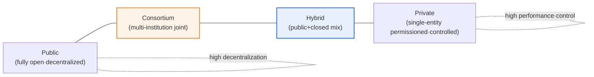
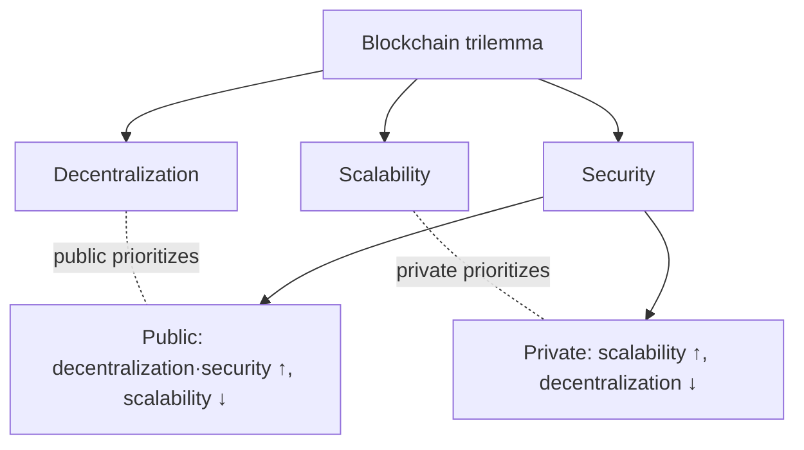

# Blockchain Types — Public·Private·Hybrid

## 1. Overview

### A. Concept
> Blockchains are divided into **public (open)·private (closed)·hybrid (mixed)** types according to **to whom, and how widely, the right to participate and validate (reach consensus) is opened**. The trade-off among openness (decentralization) and control·performance·privacy separates the types.

The fundamental reason blockchain types diverge lies in the structural conflict that "**full decentralization and practical performance·control cannot both be maximized at the same time**." The ideal archetype of a blockchain is a fully open, decentralized network where anyone can participate as a node and validate transactions — that is, a **public** blockchain. Bitcoin and Ethereum are representative examples; anyone can participate without permission from any particular authority, so they excel in censorship resistance and transparency. However, in exchange for anonymous multitudes participating in consensus, processing is slow, all transactions are public, and it is hard to secure the access control and data privacy that enterprises require.

What enterprises and finance actually need is closer to the opposite: fast processing, closed operation limited to permitted participants, and data control for regulatory compliance. From these requirements came the **private** blockchain, which restricts participation. Performance, control, and privacy improved, but since a small number of nodes hold sway, decentralization and censorship resistance weaken. In the end, the two extremes each optimize different values; neither is superior to the other. The compromise that tries to selectively take the strengths of both sides depending on the situation is the **hybrid** (some parts public, some parts closed). In other words, choosing a type is not a matter of "which technology is superior" but a matter of purpose — "**public trust versus enterprise efficiency**" — and it comes down to where to place the balance point between openness and control.

### B. Classification Criteria
Several axes divide the types. **Openness of participation** (anyone vs. permitted only), **validation·consensus authority** (an unspecified many vs. designated nodes), **consensus algorithm** (probabilistic consensus such as PoW/PoS vs. deterministic consensus of the BFT family), **processing performance (TPS)**, and **anonymity·transparency** (full disclosure vs. selective disclosure). These axes are interlinked. For instance, the more open participation is, the more consensus participants there are, so decentralization rises but performance falls. The characteristics of each type are explained by combinations of these axes.

## 2. Type Structure and Comparison

The three types lie on a single spectrum of "openness ↔ control." If public is at one end (fully open), private is at the opposite end (fully controlled), and hybrid·consortium are distributed in between.

### A. Public Blockchain — The Extreme of Openness and Trust
A public blockchain is a fully open form in which anyone connected to the internet can participate as a node, download the ledger, and validate transactions. Its essence is that the source of trust lies not in a particular institution but in "the mutual verification of the many and economic incentives." Consensus mechanisms such as Proof of Work (PoW) or Proof of Stake (PoS) induce anonymous participants to behave honestly, and as a result, a ledger that is effectively impossible to forge or tamper with is maintained even without a central administrator.

The strength of this structure is **censorship resistance and transparency**. No one can arbitrarily block or reverse a particular transaction, and all transactions are public, so auditing and verification are free. However, the same structure is also the source of its weaknesses. Because all nodes repeat the same validation, throughput (TPS) is low and finalization takes time, and PoW consumes enormous power. Also, since all data is public, it is hard to use as-is in enterprise work that handles trade secrets or personal information. In short, public is optimized for domains where "public trust is the core of value."

### B. Private Blockchain — The Extreme of Control and Efficiency
A private blockchain is a closed form in which a single organization controls the right to participate and validate. Since only permitted nodes hold and validate the ledger, the source of trust shifts from "an unspecified many" to "designated participants who already have a trust relationship." Thanks to this, only a small number of nodes need to participate in consensus, so processing is fast, data access can be finely controlled, and the auditing and permission management that regulations require are easy.

Representative technologies include platforms that aim for permissioned ledgers, such as Hyperledger Fabric. The strength of private is clearly "**performance·privacy·regulatory compliance**." On the other hand, since a small number hold sway over the ledger, decentralization and censorship resistance are weak, and in the extreme, the managing entity could tamper with records, so the fundamental question "why a blockchain at all, how is it different from a distributed database?" always follows. Even so, in that multiple participants jointly share a tamper-proof ledger, it is recognized as having the practical value of higher mutual trust and auditability than a single database.

### C. Hybrid·Consortium — A Spectrum of Compromise
A hybrid blockchain is a form that tries to combine the strengths of both sides by operating some data·functions as public (public) and some as closed (private) within a single system. For example, sensitive original data is kept in a closed ledger, but only an integrity proof (hash) of that data is anchored to a public chain, thereby obtaining both "external verifiability" and "internal privacy" at once.

Meanwhile, a **consortium blockchain**, in which multiple institutions jointly operate validation nodes among themselves, is often classified as a form of private (partial decentralization) and, together with hybrid, fills the middle of the spectrum. Since multiple entities — banks, logistics firms, hospitals, and so on — operate the ledger on equal footing rather than a single enterprise, it has higher decentralization than a pure private and a lower risk of tampering by a particular entity. In other words, hybrid·consortium finely adjust the degree of openness between "fully open" and "single control," and a substantial portion of actual enterprise adoption occurs in this middle ground.

Comparing the characteristics of the three types (and consortium) by axis yields the following. This table organizes how the conflict of "openness ↔ control·performance" explained above appears on each axis.

| Category | Public | Private | Consortium | Hybrid |
|---|---|---|---|---|
| **Participation** | Anyone | Single-entity permissioned | Designated institutions | Mixed (partially open) |
| **Decentralization** | High | Low | Medium | Medium |
| **Performance (TPS)** | Low | High | High | Medium~High |
| **Transparency** | Fully public | Restricted | Shared among participating institutions | Selective disclosure |
| **Consensus** | Probabilistic such as PoW·PoS | Small node set (BFT, etc.) | BFT family | Mixed |
| **Examples** | Bitcoin·Ethereum | Hyperledger Fabric | Financial·logistics consortia | Public+closed mixed applications |

## 3. Understanding from the Consensus·Trilemma Perspective

Behind type selection lie the issues of consensus algorithms and scalability. The PoW·PoS used by public are designed to enable consensus even among an anonymous many, so censorship resistance is high, but finality is probabilistic and slow. On the other hand, the BFT (Byzantine Fault Tolerance) family consensus commonly used by private·consortium provides fast, immediate finality when participating nodes are known and few. In other words, "whether we know who the participants are" determines the consensus method and performance, and that in turn defines the type.

The so-called **blockchain trilemma** is the proposition that decentralization·scalability·security cannot all be maximized at once. Public chooses decentralization and security at the expense of scalability, while private chooses scalability at the expense of decentralization. Attempts to ease this conflict include scaling technologies such as Layer 2 and sharding, and hybrid designs that combine public and closed. Therefore, type selection can be seen as a decision, atop the trilemma, of "what can be given up."

From this perspective, a frequently raised practical question is "how is a private blockchain ultimately different from a distributed database?" The answer lies in "the degree of trust distribution." A distributed DB has a single managing entity responsible for consistency, whereas a consortium·private blockchain has multiple entities that do not fully trust one another jointly finalizing the ledger through consensus. Therefore, if all participants are one organization, a distributed DB is simpler and more efficient than a blockchain, and if interests conflict among participants or mutual auditing is needed, the blockchain's joint verification and tamper prevention are justified. In other words, before choosing a type, there must be the prior judgment of "is a blockchain even necessary in the first place?"

Also, types are not fixed and immutable; they evolve. A common path is to start as private for control·performance, widen the scope of openness to a consortium as participating institutions increase, and then, when external verification demand arises, transition to a hybrid that anchors integrity proofs to a public chain. Thus openness is a design variable adjusted according to the service's growth stage and stakeholder composition, not a constant set once at the beginning and left alone.

## 4. Application Areas and Cases

Each type has clearly distinct suitable domains according to the required trust model. The table and explanation below also point out "why that type fits that field."

| Type | Suitable field | Reason for choice |
|---|---|---|
| **Public** | Cryptocurrency·NFT·public verification services | Censorship resistance·public trust is the core of value |
| **Private** | Enterprise internal·financial settlement·supply chain | Performance·privacy·regulatory compliance first |
| **Consortium** | Interbank settlement·trade finance·logistics | Multi-institution joint trust, prevents single-entity tampering |
| **Hybrid** | Healthcare·administration, etc. where public·private coexist | Integrity proofs public, originals closed |

First, the **finance·trade field** is the representative stage for consortium·private. When multiple banks·enterprises jointly operate a ledger, reconciliation cost and time are greatly reduced, and demonstrations have been reported that trade finance and cross-border settlement, which traditionally took days, can be greatly shortened. Since participating institutions validate on equal footing, the risk of tampering by a single institution is also low.

Second, in **supply chain management**, private·consortium blockchains are used to record origin and distribution history in a tamper-proof manner, securing traceability. In industries where trust in history matters, such as food and pharmaceuticals, there are known cases of dramatically reducing the time to trace recall targets.

Third, **public·healthcare administration** is an area where hybrid is effective. Keeping sensitive data such as personal information and medical records in a closed ledger, while leaving on a public chain a proof that the data has not been tampered with so that citizens and supervisory agencies can verify it, can satisfy privacy and transparency at the same time.

Fourth, services whose essence is public verification, such as **asset tokenization·NFTs**, make public effectively the only choice. This is because value arises only when ownership transfer holds without permission from a particular institution and anyone can verify its history. Conversely, even for the same asset, a mixed design that handles with private the parts inappropriate for external disclosure, such as an institution's internal clearing·settlement records, is common. Thus, dividing a single service into "parts where openness is the value" and "parts where control is the value" and combining types is the core practical sensibility.

## 5. Advanced — Interoperability·Regulatory Trends and Expected Exam Directions

Discussion of blockchain types is expanding beyond single-chain selection to "**how to connect different chains**." As enterprises each build their own private·consortium chains, **interchain (cross-chain) interoperability** for moving assets·data between them has emerged as the key to practical adoption. Bridge·relay technologies that link different ledgers are being researched, but this connection point is also where security incidents frequently occur, so careful design is required.

Along with this, a reassessment of "how much decentralization is really needed" is underway. Early on, full decentralization (public) was regarded as the ideal, but in actual enterprise services, due to regulatory compliance, performance, and operational accountability, there is a clear tendency for the controllable middle ground (consortium·hybrid) to be dominantly adopted instead. In other words, the market is converging not on "maximum decentralization" but on "as much decentralization as the purpose requires," which shows that the discussion of types is moving from ideological debate to practical design.

On the regulatory side, personal data protection is the key issue. The immutability of blockchains — "once recorded, it cannot be erased" — collides head-on with personal data regulations that guarantee the "right to erasure (right to be forgotten)." For this reason, designs that keep original personal data off-chain and leave only references·hashes on-chain, or that choose controllable private·hybrid from the outset, are gaining strength. Recently, technologies that "prove without disclosing," such as self-sovereign identity (SSI) and zero-knowledge proofs (ZKP), have drawn attention as a compromise between privacy and verifiability.

Expected exam directions from an engineer's perspective fall roughly into three branches. ① Types that ask you to compare the characteristics·consensus·trilemma of the three types and discuss application fields, ② types that ask you to design, with rationale, which type fits a particular industry (finance·supply chain·healthcare, etc.), and ③ types that ask about adoption barriers such as personal data regulation·interoperability and how to resolve them. A high-scoring strategy is not to stop at "listing types" but to write an answer threaded through by the single axis of "the openness ↔ control trade-off."

## 6. Considerations and Implications (Engineer's Perspective)

1. **Purpose-based type selection comes first.** Choose public if public trust·censorship resistance is the core of value, private if performance·privacy·regulatory compliance matter, consortium if joint trust of multiple institutions is needed, and hybrid if public·private coexist. The approach of "it's a blockchain, so it must be public" is prone to failure.

2. **Priorities must be made explicit within the trilemma.** Since decentralization·scalability·security cannot all be maximized at once, one must clearly decide at the design stage which value to protect and what to supplement with Layer 2·off-chain, and so on.

3. **Personal data·regulatory alignment is the real gateway to adoption.** Considering the conflict between immutability and the right to erasure, cross-border data transfer, and audit requirements, one should examine an on/off-chain separation design, choice of controllable types, and the combined use of privacy-protecting technologies such as ZKP·SSI.

4. **Interoperability and governance determine adoption.** The security of chain-to-chain linkage (interchain), the rules for authority·dispute handling among consortium participants (governance), and the level of standardization determine the sustainability of an actual service. It is worth emphasizing that designing the consensus·operating system among participants is as important as the technology choice.

## References
- Hyperledger Foundation — https://www.hyperledger.org/
- Ethereum, "Blockchain layers & scalability" — https://ethereum.org/en/developers/docs/scaling/

---

> **In one line**: Blockchains are divided by openness into *public (open·decentralized)·private (permissioned·controlled)·consortium·hybrid (mixed)*, and the key is to choose the type that fits the purpose atop the trade-off (trilemma) among decentralization and performance·control·privacy, while designing for regulation·interoperability together.
