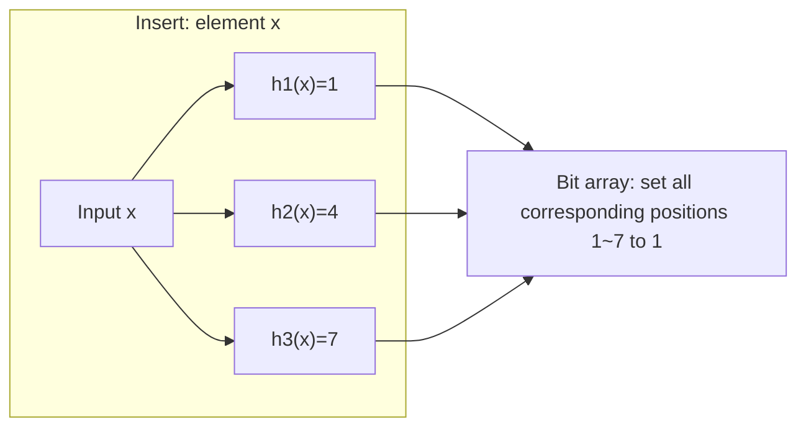
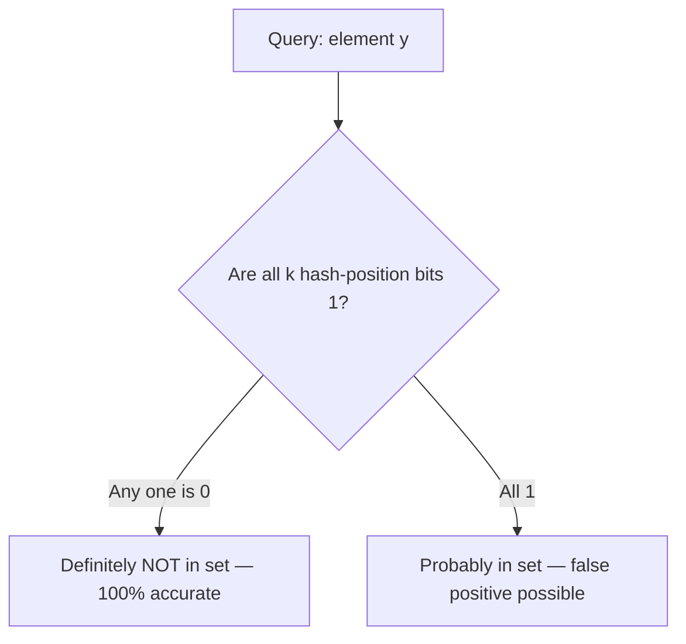

# Bloom Filter

## 1. Overview

### A. Definition

> A **Bloom filter** is a **probabilistic data structure** composed only of an m-bit array and k independent hash functions, used to determine whether an element belongs to a particular set. A "negative" (not present) answer is always accurate, but a "positive" (present) answer allows a certain probability of **false positives** in exchange for checking set membership with extremely little memory.

The Bloom filter is a data structure proposed by Burton H. Bloom in 1970, which resolves a **membership query** — "Is this element in the set?" — without storing the element itself. Unlike a HashSet, which stores all elements and gives an exact answer but consumes O(n) memory, a Bloom filter does not store elements and instead **turns on just a few bits** to leave a trace of membership, so it saves memory by tens of times or more when handling millions to hundreds of millions of elements. For this reason, it is widely used as a preprocessing filter in large-scale systems where "false positives can be tolerated, but memory·speed cannot be sacrificed."

### B. Background and Necessity

In large-scale data systems, the most expensive operation is **disk·network access**. For example, LSM-tree-based databases (Cassandra, HBase, RocksDB) may have to search dozens of on-disk SSTables to read a single key, yet most of those SSTables **do not contain** that key. Reading the disk every time to check for a nonexistent key is an enormous waste. The situation is essentially the same when a web crawler determines "Is this a URL I've already visited?", a CDN checks "Is this content in the cache?", or a password system checks "Is this in the list of leaked passwords?" — a large volume of queries **where most answers are 'no'** must be cheaply filtered out before searching the original.

At this point, loading an exact set (HashSet·B-tree) entirely into memory hits the memory limit as data grows. A Bloom filter uses the property that **its "not present" verdict is 100% accurate** to immediately block, within memory, the majority of negative queries that need no access to the original. Only in the small number of cases where it says "present" does one need to check the actual original, dramatically reducing the number of expensive accesses. Even if a false positive occurs, checking the original one more time filters out the wrong answer, so **final accuracy is maintained** — only that much wasted effort is added — and this is the basis for its practical adoption.

## 2. Structure and Operating Principle

A Bloom filter consists of ① an **m-bit array** initialized entirely to 0, and ② **k distinct hash functions** h₁, h₂, …, h_k that map inputs to integers in the range [0, m-1]. Insertion and lookup use the same k hash positions.

The **insert operation** computes all k hash functions for element x and **sets to 1** the k bit positions they point to. If a bit is already 1, it is left as is. The element itself is not stored anywhere; only the "trace of turned-on bits" remains. The fact that multiple elements can share (overlap) the same bit is both the source of memory savings and the cause of false positives.

The **lookup operation** computes the same k hash positions for a query element y and then inspects the bits at those positions. The verdict rule is as follows.

If **even one** of the k positions is 0, it is **definite** that the element was never inserted (because if it had been, all would be 1). This is why a Bloom filter **never produces a false negative**. Conversely, if all k are **1**, the verdict is "probably present," but these bits may have all become 1 not because of y itself but because **other elements happened to turn on the same positions**. This case is exactly a false positive.

One structural limitation is that **deletion is impossible in a standard Bloom filter**. Reverting a particular bit to 0 could cause other elements sharing that bit to be misjudged as "not present" (a false negative). If deletion is needed, a **Counting Bloom Filter**, which uses a small counter at each position instead of a single bit, is used.

## 3. False-Positive Probability and Parameter Design

The core of Bloom filter design is keeping the **false-positive probability p**, determined by the relationship among the bit-array size m, the number of hashes k, and the number of elements n, at or below a target. After inserting n elements, the probability that an arbitrary bit is still 0 is about (1 − 1/m)^(kn) ≈ e^(−kn/m), and from this the false-positive probability is given by the following approximation.

> **p ≈ (1 − e^(−kn/m))^k**

This formula gives a few intuitions. First, the larger the bit array (m↑), the fewer bit collisions, so p decreases. Second, the number of hashes k weakens discrimination if **too few** and, if **too many**, fills bits excessively and actually increases collisions, so given m/n there exists an optimal value that minimizes p. The optimal number of hashes is **k = (m/n)·ln2 ≈ 0.693·(m/n)**, and at this point the number of bits needed per element organizes to **m/n ≈ −1.44·log₂(p)**.

Grasping it with concrete numbers makes the design sense clear. If you want a target false-positive rate of p=1% (0.01), you need about **9.6 bits** (≈1.2 bytes) per element and about 7 hash functions. That is, to manage **10 million** URLs at a 1% false-positive rate, about 9.6×10⁷ bits ≈ **about 12 MB** suffices. Compared with storing the same 10 million URLs, each an average 50-byte string, in a HashSet, which takes at least hundreds of MB, a **tens-of-times memory saving** is confirmed. Lowering the target to p=0.1% increases it to about 14.4 bits per element, showing that accuracy and memory are in a **logarithmic-scale trade-off** relationship.

## 4. Use Cases and Comparison with Similar Techniques

Because of its nature of "cheaply filtering out negative queries," the Bloom filter is embedded in the core paths of many industrial systems. Notably, **Google Bigtable·Apache Cassandra·HBase·RocksDB** place a Bloom filter on each SSTable to omit most disk reads for nonexistent keys, greatly lowering read latency. **Web browser Safe Browsing (Google Safe Browsing)** distributes lists of millions of malicious URLs to clients as a Bloom filter for local first-pass discrimination, and re-checks only the small number that come out as "possibly dangerous" with the server. It is also widely used in **password-leak checking·spam filtering·duplicate-packet detection in network routers·pre-existence checks in distributed caches**.

Comparing it with data structures of similar purpose makes the selection criteria clear. The core is the trade-off among **accuracy·memory·features (deletion·counting)**, and the answer changes according to "what you can give up."

| Category | Bloom filter | HashSet | Counting Bloom Filter | Cuckoo Filter |
|------|-----------|-----------------|------------------|--------------------------|
| Element storage | No (bits only) | Stores all elements | No (counters) | Stores fingerprints only |
| Memory | Very small | Large | 3~4× that of Bloom | Small (similar to Bloom) |
| False positive | Yes | No | Yes | Yes |
| False negative | No | No | No | No |
| Deletion | Not possible | Possible | Possible | Possible |

A HashSet is accurate but its memory cost is high, making it unsuitable at large scale; if deletion is needed, a Counting Bloom Filter is the alternative, and if you want both deletion and a low false-positive rate while also saving memory, a Cuckoo Filter is the alternative. Conversely, in static, append-only scenarios where there is **only insertion and you want to save memory to the extreme**, the standard Bloom filter is still the simplest and most efficient.

## 5. Considerations and Implications

When applying a Bloom filter in practice, the following should be considered comprehensively from an engineer's perspective.

- **Judging false-positive tolerance must come first.** A Bloom filter presupposes **two-stage verification** in which the original is checked one more time on a false positive. It is unsuitable for domains where a false positive leads directly to a wrong result (with no re-check path), and one must design a fallback path of "positive verdict → check the original" together.

- **Parameters must be estimated in advance according to the expected number of elements n.** Since a standard Bloom filter has a fixed size, if the actual n exceeds the design assumption, bits saturate and the false-positive rate rises sharply. If the number of elements is uncertain or continuously grows, consider a **Scalable Bloom Filter**, which extends to a new filter when capacity fills up.

- **Deletion·update requirements must be settled early.** Since the standard type cannot delete, a Counting Bloom Filter or Cuckoo Filter is suitable for workloads where elements are removed over time (e.g., a TTL cache). A wrong choice may require replacing the entire data structure later.

- **The quality·independence of hash functions determines performance.** If the k hashes are correlated, bits become skewed and performance is worse than the theoretical false-positive rate. In practice, a technique of extracting two values from a single fast non-cryptographic hash such as MurmurHash·xxHash and generating the k hashes via **double hashing** is widely used. However, in security-sensitive environments where malicious input could induce hash collisions, consider a keyed hash.

- **Consider synchronization·serialization cost in distributed environments.** When sharing·merging filters across nodes, they can be easily combined with a bitwise OR operation, which is an advantage, but network transfer·version-management cost of large filters arises, so the update cycle and propagation method must be designed together.

In sum, a Bloom filter is a typical example of **engineering approximation** that "gives up part of accuracy (false positives) to gain the practical benefit of memory·speed." In AI·big-data environments where data scale is exploding, its value as a preprocessing filter that reduces access to the original is actually growing, and the core of design is choosing the appropriate variant among the standard type·counting type·Cuckoo filter·scalable type based on the required false-positive tolerance·deletion needs·variability in the number of elements.

---

> **In one line**: A Bloom filter is a probabilistic data structure that determines set membership with an m-bit array and k hashes; "not present" is 100% accurate, and only "present" allows false positives, at the cost of which it cheaply filters large-scale membership queries using an extremely small amount of memory.
