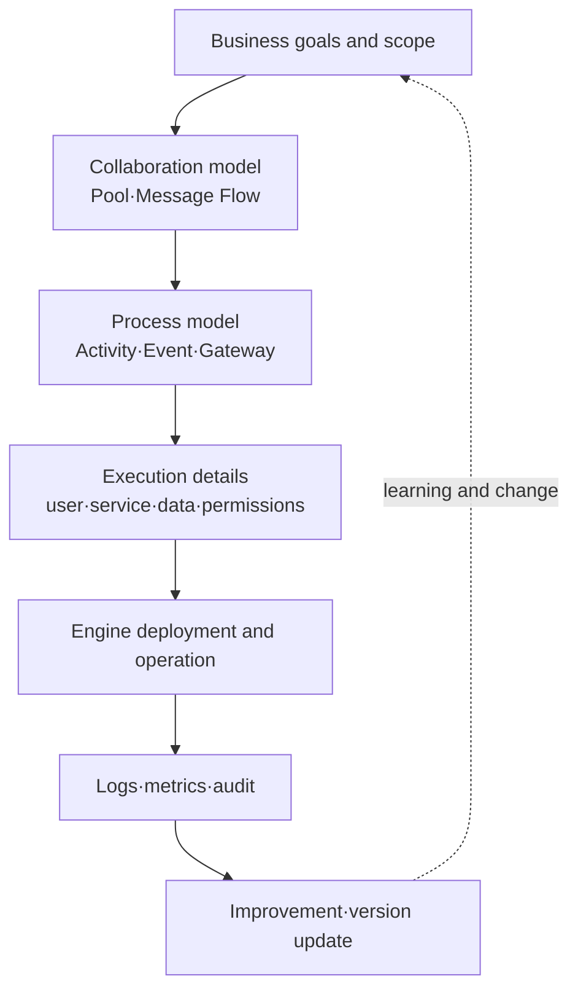
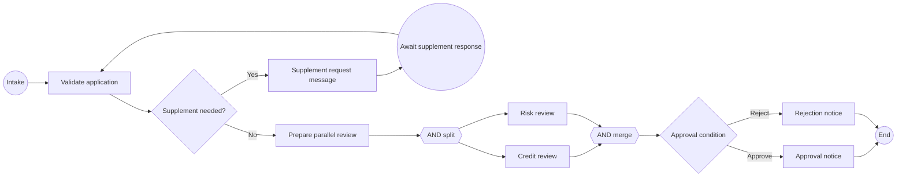

# BPMN 2.0-Based Business Process Modeling and Execution

## 1. Overview

> **Definition**: BPMN (Business Process Model and Notation) is an OMG standard that expresses the flow·participants·messages·exceptions·data of a business process with common graphical notation and execution semantics, connecting the understanding of business users with process automation.

An organization's work moves as a flow that combines human decision-making, system calls, message exchange with external institutions, the passage of time, and exception handling.
If work is left only as natural-language meeting minutes or a simple flowchart, each person interprets it differently, and at the automation stage one must again define "who is regarded as having completed what, and when."
BPMN reduces this disconnect by placing notation that business users can read and structures that a process engine can interpret within a single model.

BPMN is not the screen design of a particular solution or workflow product.
A standard model expresses the meaning of a process, but for actual execution one must separately decide the organization's business rules, data schemas, user permissions, the engine's scope of support, and the monitoring system.
Therefore, an engineer's answer should not end at listing symbols but should explain BPMN as a **method for converting business goals and stakeholder models into an executable control flow**.

The OMG's official BPMN 2.0.2 document aims to cover both notation that business users can understand and the execution semantics·exchange format of process definitions.
The advantage of BPMN is that business departments can review the responsibilities and branches of a process, and development·operations departments can use messages·timers·exceptions as design bases.
Conversely, using every symbol of the standard in a single drawing sharply lowers readability, so the model must be layered to match the stakeholder level.

### 1.1 Background and Necessity

Traditional business analysis often proceeded with interviews, documentation, and system development in sequence.
This approach makes it easy to record the normal flow, but it is prone to missing real-world variations such as approver delays, external response timeouts, re-reviews, cancellations, and compensations.
In particular, work that passes through multiple organizations and systems — such as financial screening, procurement, civil complaints, and medical appointments — cannot have its overall accountability explained by one department's flowchart alone.

BPMN separates the party performing an activity from the process flow, reveals organizational responsibility with pools and lanes, and shows asynchronous interaction among participants with message flows.
It uses data-based gateways for conditional branching, message events at points where an external response is awaited, and timer events for deadlines.
This way, the abstract description "work proceeds in order" is made concrete into the operational design "when a certain signal arrives, a certain responsible party creates the next state under certain conditions."

### 1.2 Goals and Non-Goals

The goal of a BPMN model is to agree, in a consistent language, on a process's start·end, activities, responsibilities, branching·merging, external interactions, and exceptions and performance-measurement points.
For an execution model, each activity's input·output data, user assignment or service invocation, retry·compensation policies, and permissions and audit trails must all be connected.
For an analysis model, rather than including all technical details, one focuses on revealing bottlenecks and responsibility boundaries.

BPMN does not replace an org chart, a database ERD, an API specification, or a project schedule.
Nor does one BPMN diagram mean it explains all of an organization's exceptions forever.
Since a process changes versions with changes in policy·law·products·systems, it must be continuously managed by establishing model owners and change-approval procedures.

## 2. Overall Structure and Core Principles

### 2.1 Model Layers

Rather than cramming all information into one diagram, BPMN divides the level of abstraction according to stakeholders and purpose.
At the higher level, it shows collaboration and major milestones from a customer request to the result, and at the lower level, it expresses the detailed rules and system calls of a single activity.
This layering is a way to lower the threshold for business review while securing the precision needed for execution design.

The higher-level collaboration model is suitable for reviewing inter-organizational contracts and message boundaries.
For example, placing the customer, seller, and payment institution each as a pool lets one distinguish which communication is a message flow and which activity is internal implementation.
In the lower-level process model, one details the internal activities, branches, events, and data objects of a single participant.

Execution details are not sufficient with BPMN symbols alone.
User tasks connect to roles·groups·delegation·deadline notifications, and service tasks define API contracts·timeouts·retries·idempotency.
Data inputs must also record personal·sensitive information classification and retention periods, and at the operations stage one must be able to measure instance states and business SLAs.

### 2.2 The Flow and Token Perspective

A BPMN process is composed of flow elements and the flows that connect them.
Activities express work to be performed, events express things that occur or are awaited within the process, and gateways express the branching·merging of paths.
Sequence flows indicate the order of progress within the same process, and message flows indicate communication between different participants.

When understanding execution semantics, it is useful to think of a token moving within the process.
A start event creates a token, activities consume·produce tokens, and a parallel gateway splits a token into multiple paths or gathers all required tokens.
However, the token metaphor is an aid to understanding, and it does not mean that the transaction·concurrency·persistence methods of actual engines are all identical.

In the example above, "Supplement needed?" is an XOR branch based on business data.
A supplement request is not simply the next activity but a state awaiting an external message — the customer's response — so message waiting and expiration·cancellation exceptions must be designed separately.
Credit review and risk review use a parallel split only when they can proceed independently of each other, and the merge gateway ensures that the next decision begins only after both results have arrived.

The token perspective also helps find pitfalls of parallel processing.
If one path fails after a parallel split, one must decide whether to cancel the other path, preserve partial results, or retry.
If one merely connects arrows in notation and omits these policies, the model looks pretty but can create duplicate approvals or an eternal waiting state at execution time.

## 3. Major Components and Their Meaning

### 3.1 Events

An event is an occurrence or a waiting signal that affects the flow of a process.
A start event begins a process instance, an end event expresses the completion of a particular path, and an intermediate event awaits or throws in-progress messages·timers·errors·compensations, and so on.
Since an event differs from a task, which is "something someone must do," one must distinguish whether receiving a customer response is expressed as a human-handled activity or as a message-arrival event.

Message events express communication between particular participants or systems.
For example, an intermediate catch message event awaiting a payment institution's approval response must have a correlation key defined to determine which order instance it matches.
Without correlation, responses to multiple orders from the same customer could wrongly enter different instances.

Timer events indicate a certain time, an elapsed duration, a recurring cycle, and so on.
"Automatic cancellation if documents are not supplemented within 48 hours" can be modeled as a timer boundary event, but business-day calculation, holiday calendars, time zones, and paused states must be made clear with engine settings and business rules.

### 3.2 Activities

An activity is work actually performed in a process and is divided into tasks and subprocesses.
A user task is performed by a person via a screen or work inbox, and a service task is performed by an automated application or external service.
A manual task is used to express work not directly controlled by the system, and such work must separately secure SLAs and evidence.

Task type is not a name that decorates the implementation but a contract of responsibility and failure handling.
For a service task, one designs the call target, request·response schema, timeout, retry, circuit breaker, compensation, or manual fallback.
For a user task, one designs candidate rules, work queues, delegated handling, dual approval, screen-input validation, and audit logs.

A subprocess encapsulates a complex flow as a single activity.
A common procedure that needs reuse can be separated into a call activity, and a detailed flow dependent on the current process's context is bundled into an embedded subprocess.
Since excessive nesting of subprocesses makes navigation between models difficult, it is desirable to divide them based on business-meaningful boundaries and change cycles.

### 3.3 Gateways

A gateway is a control point that branches or merges paths.
An XOR gateway is used for a mutually exclusive branch that selects only one among conditions, and an AND gateway is used to execute all paths in parallel or gather them all.
An OR gateway selects one or more paths that satisfy conditions, and the number of selected paths and the merge condition must be made explicit.

An event-based gateway selects a path based on the first-arriving event rather than a data value.
It is suitable for flows such as "move to the next step when an approval response arrives or a 10-minute timeout occurs," but when two events arrive nearly simultaneously, duplicate handling and correlation must be defined.
Do not judge meaning by the gateway's name alone; review the completeness·mutual exclusivity·default path of the branch conditions.

|Gateway|Branch basis|Typical use|Design question|
|---|---|---|---|
|XOR|One among data conditions|Approve/reject|Do conditions overlap or leave gaps?|
|AND|All paths|Parallel review·synchronization|How are failed paths and wait times handled?|
|OR|One or more conditions|Multiple optional checks|How many results must be awaited?|
|Event-based|First-occurring event|Response/timeout race|How to prevent simultaneous arrival and retransmission?|

Gateways must not confuse business decisions with technical control.
For example, "Is the amount over 10 million won?" is a business rule, so it can be separated into a DMN decision table or rule service, while "Have both asynchronous results arrived?" is closer to flow-synchronization control.
Mixing the two in one branch increases the chance that the process drawing and the code break together when policy changes.

### 3.4 Pools·Lanes·Message Flows

A pool represents a process participant or an independent organization·system, and a lane divides the roles·departments·responsibility units within one pool.
Placing the customer and the bank as different pools expresses the interaction between them as a message flow.
Movement between teams within one pool is expressed with lanes and sequence flows, distinguishing internal responsibility from external contracts.

A lane is not a tool for copying the org chart verbatim.
Creating too many lanes makes the drawing complex rather than clarifying responsibility, and conversely merging lanes into one erases approval·separation obligations.
Decide lanes centered on the points where work handoff, permissions, SLAs, and audit accountability actually differ.

A message flow shows not where data is stored but what communication occurs between participants.
Since external messages must assume delivery failure, duplication, delay, and reordering, one designs message IDs, correlation IDs, and reprocessing policies.
This principle is especially important when connecting a BPMN model with event-driven architecture or API design.

## 4. Modeling Procedure and Execution Design

### 4.1 Defining Scope·Goals·Outcomes

In the first step, discard broad expressions like "the entire process" and clarify start·end conditions and management purpose.
For example, for a loan process, do not draw everything from consultation to after-care; instead set a boundary such as "reduce the average processing time from online application intake to approval notice."
Involve the process owner, business representatives, audit·security staff, and system staff to agree on the model's purpose of use.

Performance indicators connect the model to operational improvement.
Define indicators observable in the flow — processing time, wait time, first-time-right rate, rework rate, automation rate, exception rate, number of SLA violations — and design the event-log fields.
If indicators are attached belatedly, the model, even if executed, cannot explain the causes of bottlenecks.

### 4.2 As-Is Discovery

The current-state model must reflect actual work, not the ideal regulation.
Since interviews alone can miss workaround spreadsheets, personal messengers, manual re-entry, and duplicate verification between systems, examine logs, tickets, forms, complaints, and incident records together.
Marking the normal·exception·urgent·cancellation paths with different colors or annotations reveals the gap between documents and reality.

Manual work discovered in the current-state model must not be immediately decided as an automation target.
A manual step may be a regulatory double-check or a responsible judgment, or conversely it may be unnecessary re-entry.
Record each activity's purpose, input, output, owner, system, risk, and frequency, and then set improvement priorities.

### 4.3 To-Be and Feasibility Review

Design the target model in a direction that satisfies business goals and control requirements while reducing unnecessary waiting and re-entry.
Prioritize as automation candidates activities with clear rules, high repetition frequency, and high error cost.
Even without automating steps that require human judgment, one can raise processing quality by providing work queues, evidence data, recommended results, and approval limits.

In the feasibility review, map each activity of the model to an implementation unit.
Classify whether it is a user task, an API call, message consumption, a batch, or manual work, and fill in the required inputs·outputs and error paths.
If there is a gap between the BPMN model and the elements the actual engine supports, do not force standard symbols to execute; instead adjust the modeling level or supplement with a separate design document.

### 4.4 Deployment·Operation·Improvement

Before deployment, test not only normal completion but also timeouts, duplicate messages, engine restarts, user absence, and external system failures.
When a process instance is interrupted, confirm at which point it resumes, whether an activity that already had external effects may be re-executed, and whether a compensating transaction is needed.
Also decide as policy whether to finish in-progress instances on the old version or migrate them to the new version while the process version changes.

In operation, record activity start·complete·fail·retry·wait events with the same correlation key as the process model.
Dashboards should not show only averages but also percentile latency, long-waiting instances, repeatedly failing tasks, and the rate of manual intervention.
Do not indiscriminately copy personal data into logs; define the minimum fields needed for search·audit and their retention periods.

## 5. Comparison and Application Cases

### 5.1 Comparison of Notation·Analysis Techniques

BPMN and UML activity diagrams both express flows, but their starting points and emphases differ.
UML activity diagrams are good for connecting to software behavior and object·state models, while BPMN more directly expresses inter-organizational collaboration·messages·business events·execution semantics.
A simple flowchart is good for quick explanation, but the meanings of participants·messages·exceptions are not standardized.
EventStorming is a workshop for quickly discovering domain knowledge, and BPMN can be seen as notation for refining discovered business flows into agreement·analysis·execution models.

|Category|BPMN|UML activity diagram|Flowchart|EventStorming|
|---|---|---|---|---|
|Main purpose|Business process collaboration·execution|Software behavior design|Simple procedure explanation|Domain-knowledge discovery|
|Core perspective|Participants·events·messages|Activities·objects·control|Order and conditions|Domain events·conversation|
|Exception expression|Events·boundary events·compensation|Exceptions·activity flow|Depends on shapes·annotations|Hotspots and conversation|
|Automation link|Execution semantics·XML exchange|Linked with development models|Varies by tool|Not directly executed|
|Suitable output|As-Is/To-Be·workflow|Design·behavior specification|Educational procedure|Bounded-context candidates|

The difference is not superiority but difference in the point of use.
In an early workshop, one can find events and conflicts with EventStorming, refine policies and responsibilities, and then agree on inter-departmental flows and exceptions with BPMN.
If implementation details are needed, connect a BPMN service task to an API contract, a UML sequence, a data model, and test cases.
Maintaining traceability between models is lower-cost than trying to express every perspective with one tool.

### 5.2 Hypothetical Case: Insurance Claim Automation

Suppose an insurance claim process.
When a customer submits documents via mobile, an intake service stores the files, automatic classification determines whether anything is missing, and by amount and risk level it routes to the automatic-review or expert-review lane.
When an external medical-institution inquiry is needed, it awaits the response via a message event, and if there is no response within 3 days, it sends a supplement request to the customer.

The BPMN model can divide the customer·insurer·external medical institution into pools and place intake·auto-review·expert-review·payout lanes within the insurer pool.
Missing-document detection is expressed with XOR, independent fraud detection and coverage-scope verification with AND, and the race between external-inquiry response and timeout with an event-based gateway.
Here, "automatic approval" can be expressed as a service task, but since the model does not guarantee the accuracy of the AI judgment, a human-review threshold and an appeal path are placed together.

One can set a hypothetical improvement goal of reducing the median processing time from 48 hours to 24 hours and the supplement-rework rate from 20% to 10%.
To do this, validate missing documents at the initial upload stage rather than late in intake, and attach timers and notifications to external-inquiry waiting.
The improvement effect is verified by instance logs, not by the number of arrows in the model, and one evaluates together whether wrongful rejections or personal-data exposure increased even as the automation rate rose.

### 5.3 Hypothetical Case: Public Civil Complaint Handling

A public civil complaint can proceed through intake, classification, assignment to the responsible department, fact verification, response, and appeal or reprocessing.
Inter-departmental assignment reveals responsibility with lanes, and the statutory processing deadline is expressed with a timer boundary event.
When the complainant submits additional materials, a message event must be correlated with the original instance, and audit history must be preserved even when the responsible person changes.

In this case, instead of assuming "automatic classification is 100% correct," one places a condition that sends low-confidence classifications to a manual-review queue.
Placing deadline-imminent notifications and deadline-exceeded escalations in a separate event subprocess avoids making the normal workflow excessively complex.
It is safer for the model to express the complainant's personal data not directly in the drawing but by referencing an identifier·grade·retention policy.

## 6. Advanced: Connecting Standards·Execution·Process Mining

OMG BPMN 2.0.2 covers not only notation but also the execution semantics of process elements, extension mechanisms, event combination and correlation, human interaction, choreography models, and process-definition exchange.
However, standard conformance does not mean that every model executes identically on a particular engine.
One must confirm in advance each engine's scope of support, expression language, worker assignment, transaction boundaries, message correlation, and migration features.

Combining BPMN with process mining allows one to verify whether model-centric improvement matches actual logs.
If the model's activity names differ from the log's event names, conformance analysis is distorted, so design a common schema for process instance ID, activity name, timestamp, resource, result, and correction events.
Do not adopt a model created by a discovery algorithm as the target process as-is; low-frequency exceptions should go through business review to see whether they are legally·financially important.

Recently, the trend of combining rule engines·DMN, API·event-based integration, RPA, and AI-assisted judgment with BPMN has grown stronger.
Even if AI recommends the next activity or the responsible person, final accountability·explanation·approval·bias checks must be made explicit in the process.
BPMN should be used not as a model that substitutes for the AI's reasoning basis, but as an operational skeleton that makes the locations of AI calls and human control transparent.

In an engineer's answer, rather than writing "adopt the standard" as the conclusion, it is good to present the cycle of standard model → execution mapping → operational logs → performance measurement → governance improvement.
That is, the condition for success is designing the model's ownership, change management, data·permissions·audit, failure response, and performance indicators together, rather than merely adopting the notation.

## 7. Considerations and Implications

### 7.1 Balancing Readability and Execution Precision

A business-facing model must let one read the core responsibilities and flow on one screen.
An execution model needs retries·correlation·data·permissions, but putting them all on one sheet makes reviewers miss the essentials.
Separate the layers of overview·collaboration·detail·execution settings and maintain traceability with links and IDs.

### 7.2 Exception-First Design

BPMN drawn with only the normal path does not reflect actual operational risk.
The conditions and responsibilities for timeouts, cancellations, compensations, duplicate messages, unavailability, manual fallback, and reprocessing must be defined together.
In particular, service tasks that change money·inventory·permissions must not auto-retry without an idempotency key and audit events.

### 7.3 Data·Personal Data Protection

The process model and execution logs can mix customer identifiers, review evidence, and medical·financial information.
Reference only minimal data classification and retention policy in the model, and apply masking·access control·access auditing to logs.
When data moves to another pool via a message, check the processing purpose, the recipient, and whether there is cross-border transfer·outsourcing.

### 7.4 Responsibility·Authority·Auditability

Lanes reveal the responsible party, but authority to approve is not automatically created by a lane's name alone.
Connect separation of duties, dual approval, delegated handling, permission revocation, and operator emergency access to IAM and business rules.
Only by preserving the process version·rule version·input data·decision result·user intervention together is post-hoc auditing and dispute response possible.

### 7.5 Change·Version·Interoperability

When laws and products change, the process model also changes, and the handling criteria for already-running instances may differ.
Prepare change-impact analysis, new-version testing, rollback, in-progress-instance policy, and approval procedures for the model repository.
Even if BPMN XML exchange is possible, expressions·extension attributes·user assignment may have limited portability between engines, so document vendor dependencies.

### 7.6 Performance Indicators and Side Effects of Improvement

If one reduces only the average processing time, optimizations that skip manual review or shift responsibility to the customer can occur.
Along with processing time, evaluate quality, rework, complaints, security incidents, exception rate, staff burden, and fairness indicators together.
Indicators must be linked to process steps and instance keys, and interpret them together with business outcomes so that the automation rate itself does not become the goal.

### 7.7 Strategy for Composing an Engineer's Answer

An answer starts with definition and necessity, then explains pools·lanes·events·activities·gateways·flows with a concept diagram and presents the As-Is/To-Be procedure.
It then compares differences with UML·flowcharts·EventStorming by reason and application context, and connects normal·exception·operational indicators in a hypothetical case.
Finally, it organizes execution mapping, security·personal data, version·governance, and the trade-offs of interoperability and performance management as implications from an engineer's perspective.

## References

- Object Management Group, "BPMN 2.0.2 About-BPMN": https://www.omg.org/spec/BPMN/2.0.2/About-BPMN
- Object Management Group, "Business Process Model and Notation (BPMN), Version 2.0.2": https://www.omg.org/spec/BPMN/2.0.2/PDF
- Object Management Group, "BPMN 2.0 normative documents and machine-consumable files": https://www.omg.org/spec/BPMN/2.0/
- Red Hat, "BPMN2 gateways reference": https://docs.redhat.com/en/documentation/red_hat_process_automation_manager/7.4/html/process_designer_business_process_model_and_notation_bpmn2_reference_guide/bpmn-gateways_bpmn-reference
- Camunda, "BPMN 2.0 Symbols — a complete guide with examples": https://camunda.com/en/bpmn/reference/

---

> **In one line**: BPMN is a modeling language that connects business participants·events·activities·gateways·messages·exceptions with standard semantics to bridge business agreement and process execution, and successful application depends on designing execution mapping·operational logs·security·governance·continuous improvement together, rather than the symbols themselves.
