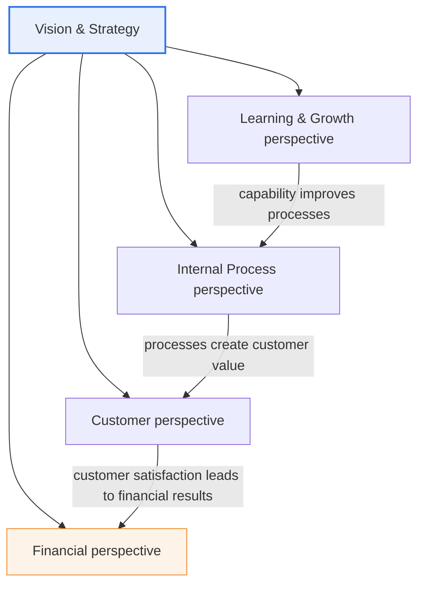
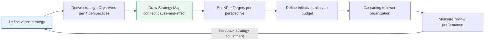

# Balanced Scorecard (BSC)

## 1. Overview

### A. Definition
> The **BSC (Balanced Scorecard)** is a strategic-management and performance-management tool that goes beyond traditional finance-centered performance measurement to **measure and manage performance in a balanced way from four perspectives — financial, customer, internal process, and learning and growth** — and translates an organization's vision·strategy into measurable indicators. It emerged when Robert Kaplan and David Norton published it in the Harvard Business Review in 1992.

The fundamental insight of the BSC is that "**you cannot manage the future with financial indicators alone**." Financial indicators such as revenue, profit, and ROI are merely the results of activities that have already happened — that is, **lagging indicators** — and they do not tell us about the causes that produced those results, such as customer satisfaction, process efficiency, and employee capability, which are **leading indicators**. Managing by looking only at financial performance is like driving while looking only at the rearview mirror, causing one to miss the very intangible assets (brand·knowledge·relationships·systems) and leading factors that determine future performance.

The BSC resolves this problem with the balance of four perspectives and a **cause-and-effect chain**. The logic is that when learning and growth (employee training·information systems·organizational capability) improve, internal processes improve; improved processes raise customer value, increasing customer satisfaction·loyalty; and that result ultimately leads to financial performance. In other words, the BSC integrates management not only of the "result" of finance but also of the "process" and "driving force" that produce that result. Above all, the greatest contribution of the BSC is that it translates abstract strategy into concrete indicators (KPIs) and targets for each perspective, making the entire organization share it in an **actionable language**.

### B. Background and Necessity
As the shift to a knowledge-based economy in the late 20th century progressed, the share of intangible assets (brand·patents·human capability·customer relationships) in corporate value rapidly grew larger than that of tangible assets (plant·equipment). However, traditional accounting·financial performance-management systems could not properly reflect intangible assets in financial statements, and as a result, following the adage "what is not measured is not managed," the sources of future value were placed in the blind spot of management.

Also, many companies formulated excellent strategies but failed at the execution stage. Strategy existed only in executives' documents, and frontline employees did not know how their daily work connected to strategy. Out of the problem awareness that "what cannot be measured cannot be managed, and what cannot be managed cannot be executed," Kaplan and Norton proposed the BSC as a tool for translating strategy into balanced indicators across four perspectives and cascading it down to the lowest levels of the organization. That is, the BSC **started as a performance-measurement tool but is essentially a strategy-execution tool**.

## 2. The Four Perspectives (Components) and the Cause-and-Effect Structure

The overall structure of the BSC places vision·strategy at the center, with the four perspectives connected hierarchically and causally. The overall structure diagram below shows the dual structure in which the four perspectives are derived from vision·strategy, while at the same time the four perspectives build up causally from the bottom (learning·growth) to the top (financial).

The four perspectives are arranged not in simple parallel but in a causal hierarchy where the lower perspective becomes the **driver** of the upper perspective. Let us examine each perspective along with its principle.

### A. Financial Perspective — The Perspective of Results
The financial perspective asks "how do we appear financially to shareholders and stakeholders?" Traditionally the sole measure of performance, this perspective sits in the BSC as **the final result and a lagging indicator**. Revenue growth rate, operating profit, ROI (return on investment), EVA (economic value added), and cost savings are representative indicators. The financial perspective serves as the "clearinghouse" that verifies whether the efforts of the other three perspectives ultimately lead to profitability.

An important point is that financial goals differ according to the company's **strategic maturity stage (growth·sustain·harvest)**. In the growth stage of a new business, revenue growth rate·market expansion become key indicators, and in a mature harvest stage, cash flow·return on investment become central. Therefore, applying financial indicators uniformly creates the error of wrongly evaluating a growth-stage business by short-term profit yardsticks. For example, evaluating an early-stage SaaS business only by current operating margin would cut customer-acquisition investment (marketing·free trials), actually harming long-term growth.

### B. Customer Perspective — The Perspective of the Value Proposition
The customer perspective asks "how must we appear to customers to achieve our strategy?" Since the direct source of financial performance is the customer, one defines the target market·customer segments and clarifies the **value proposition** to offer them — quality·price·time·service·brand. Representative indicators include customer satisfaction (CSAT), Net Promoter Score (NPS), market share, new-customer acquisition rate, customer retention, and churn.

Customer indicators have a duality: they lead financial results but lag process·capability. For example, if the customer churn rate falls from 5% to 3% per month, this is both a leading signal foretelling the coming stabilization of revenue (financial) and the result of improved consultation-response processes (internal process) that caused it. In practice, a 1 percentage point improvement in retention often appears amplified several times over in financial results through repeat purchases·cross-selling, so customer-perspective indicators serve as an early-warning role for the financial perspective.

### C. Internal Process Perspective — The Perspective of Execution
The internal process perspective asks "in which processes must we excel to satisfy customers and shareholders?" The key here is identifying not the partial improvement of existing processes but the **strategic processes that realize the value proposition**. Kaplan-Norton classify these into four bundles: operations management (production·logistics), customer management (relationships·service), innovation (new-product development), and regulatory·social processes. Representative indicators are defect rate·yield, on-time delivery rate, cycle time, and new-product time-to-market.

The practical implication of the internal process perspective is that "what you measure determines what you improve." If the customer value proposition is "fast delivery," one should take the order-to-delivery cycle time as a key indicator; merely trying to lower production cost neglects delivery speed, the strategic differentiator. For example, if a logistics company puts forward same-day delivery as its value proposition, it must manage warehouse picking time (e.g., reducing the average from 12 minutes to 7 minutes) and mis-delivery rate as process indicators to connect to customer satisfaction and financial results.

### D. Learning and Growth Perspective — The Perspective of the Foundation
The learning and growth perspective asks "how will we build our ability to change and improve in order to achieve the vision?" It consists of three intangible assets — human capital (employee capability·training), information capital (systems·data·infrastructure), and organizational capital (culture·leadership·teamwork·alignment) — and is **the foundation that supports the other three perspectives and the most powerful leading indicator**. Representative indicators are employee satisfaction, key-competency retention rate, training hours completed, information-system coverage, and turnover rate.

The reason this perspective is often neglected is that its investment effect appears last and most indirectly. Since the results of employee training or system adoption ripple through to process·customer·financial only a few quarters later, it is the first item to be cut when short-term financial pressure is high. However, by the logic of the cause-and-effect chain, if the foundation collapses the upper perspectives cannot be sustained, so the BSC serves as a device that protects "invisible future investment" by managing this perspective with explicit indicators.

The table below compares and organizes the core question and representative indicators of the four perspectives (as an aid to the prose explanation).

| Perspective | Core question | Nature | Representative indicators (KPIs) |
|---|---|---|---|
| **Financial** | How do we appear to shareholders? | Result·lagging | Revenue growth·operating profit·ROI·EVA |
| **Customer** | How do we appear to customers? | Leading/lagging | Satisfaction·NPS·market share·retention |
| **Internal Process** | What must we excel at? | Leading | Defect rate·on-time delivery·cycle time |
| **Learning & Growth** | How do we improve·grow? | Most-leading·foundation | Competency retention·training hours·systems·turnover |

## 3. Deployment Through Components and the Strategy Map

The BSC defines four elements for each perspective — **Objective – Measure/KPI – Target – Initiative** — and weaves them together by cause-and-effect to visualize them as a **Strategy Map**. The strategy map is a concept Kaplan-Norton established in the early 2000s while developing the BSC, expressing an organization's strategy on a single sheet as a flow of causal logic such as "employee training → process improvement → customer satisfaction → revenue increase." Below is a detailed diagram of the BSC establishment·operation process, showing the cycle of drawing the strategy map, cascading indicators, and reviewing performance.

Expressing the components in prose: the **Objective** is the strategic aim to be achieved in each perspective ("shorten customer-response time"), the **KPI** is the measure that quantifies its achievement ("average response time"), the **Target** is the concrete level to reach ("24 hours → 4 hours"), and the **Initiative** is the concrete project to achieve the target ("adopt a chatbot·CRM"). Only when these four elements are in place does strategy become executable down to the level of "what, how much, and how."

The true power of the strategy map lies in the **arrows (causal hypotheses) between perspectives**. By making the logic explicit — such as "improve employees' CRM capability (learning) → shorten consultation-handling time (process) → raise customer satisfaction (customer) → increase repurchases·revenue (financial)" — rather than merely listing indicators, the organization can verify how each activity contributes to the final outcome and allocate resources in priority order. Dividing the higher-level strategy map into business-unit·team-level pieces and passing them down is called **cascading**, and through this the enterprise-wide strategy and individual goals become aligned.

## 4. Comparison and Application Cases

### A. Comparison with Traditional Performance Management (MBO/Finance-Centered)
Contrasting the BSC with Management by Objectives (MBO) or finance-centered KPI management reveals the essence of the difference. Traditional methods are generally finance·short-term·result-centered and have no causal relationships among indicators. In contrast, the BSC decisively differs in that it contains finance and non-finance in balance, looks at lagging and leading indicators together, and connects the indicators into the cause-and-effect chain of a strategy map.

| Category | Traditional financial performance management | BSC |
|---|---|---|
| Measurement target | Finance-result-centered | Balance of finance+customer+process+learning |
| Time orientation | Past (lagging) | Past+future (leading) in parallel |
| Indicator relationship | Individual·independent | Causally connected by strategy map |
| Purpose | Control of results | Strategy execution·alignment |

The reason this difference matters in practice is that evaluating by financial indicators alone induces **short-sighted behavior** in which managers cut future investment (R&D·training) to inflate short-term results. The BSC suppresses this distortion by also reflecting learning·growth and process indicators in the evaluation.

### B. Application Cases in the Public Sector·Informatization Projects
The BSC is widely applied not only in the private sector but also in performance management of public institutions·informatization projects. In the public sector, it is common to reconstruct it by changing the top perspective from "financial" to "mission·public value." For example, in performance management of e-government services, indicators are designed from four perspectives: ① citizen benefit (customer), ② service-handling processes (internal), ③ civil-servant capability·information systems (learning·growth), and ④ budget efficiency (financial). Just as in an actual public informatization project that took complaint-handling time as an indicator and shortened the average handling period from a matter of days to a matter of hours, one manages a structure in which process-indicator improvement connects to citizen satisfaction (customer).

### C. Linkage with IT Governance·Strategic Enterprise Management (SEM)
From the perspective of an Information Management Professional Engineer, the BSC should be understood not as a standalone tool but as a component of higher-level management·IT management systems. The BSC is the core execution engine of **SEM (Strategic Enterprise Management)**, and it is transformed into **IT-BSC** (IT's four perspectives: corporate contribution·user orientation·operational excellence·future orientation), an IT performance-management framework, and combined with IT governance (COBIT). That is, through a hierarchical alignment leading from organizational BSC → IT-BSC → individual system performance indicators, IT investment is aligned with business strategy.

## 5. Advanced — Expected Exam Directions and Answer-Composition Strategy

In the Information Management Professional Engineer exam, the BSC is a regular topic in the management·business-strategy area, and it tends to appear not only alone but also linked with SEM, IT governance, IT-ROI, informatization performance management, and so on. Anticipating the exam perspectives yields the following.

First, there is a type that asks you to explain **the cause-and-effect relationships of the four perspectives and the strategy map**. Here, the high-scoring point is not to merely list the perspectives but to always make explicit the causal direction that "learning·growth is the most-leading foundation and financial is the final result," and to visualize it with a strategy-map diagram.

Second, there is a type that asks about **the balance of leading/lagging indicators**. Explaining the structure of finance=lagging, learning·growth=most-leading, and the short-sighted distortion when managing only financial indicators, with an example, reveals depth.

Third, there is a type that asks about **application in the public/IT field**. Including in your answer that public BSC repositions the top to public value, the four-perspective transformation of IT-BSC, and the linkage with COBIT·SEM can demonstrate an engineer-level integrated understanding.

When composing the answer, it is effective to develop it in the order of overview (definition·background) → four-perspective concept diagram → strategy map·components → comparison with the traditional method → application cases → considerations, and to accompany tables and diagrams with prose explanation.

## 6. Considerations and Implications (Engineer's Perspective)

1. **The causal linkage between strategy and indicators determines success or failure.** The essence of the BSC is not the listing of four-perspective indicators but the verification of the causal hypotheses expressed by the strategy map. If one only lists indicators without causal connections, it may become a "balanced dashboard" but not a "strategy-execution tool." When adopting it, one must always draw the strategy map first and agree on the causal logic.

2. **It should be used as a strategy-execution·alignment tool.** The value of the BSC lies in translating abstract strategy into measurable indicators and cascading it down the organization to align enterprise·team·individual goals. Reducing it to KPI management for calculating bonuses loses the strategic value of the BSC. A perspective that positions it as the execution engine of SEM·IT governance is needed.

3. **Beware indicator overload·measurement formalization.** If there are too many indicators (more than 20 per perspective), the management burden grows and focus blurs. In general, it is recommended to concentrate on a core few indicators per perspective (around 4~7). Also, so that measurement itself does not become the goal and lead to formalistic activities to fill indicators, the linkage with strategy must be periodically checked.

4. **Data·system infrastructure and change management are prerequisites.** To collect and manage non-financial indicators (customer·process·capability) close to real time, an information-system foundation such as CRM·ERP·BI is needed, and since indicators are directly connected to evaluation·rewards, change management against organizational resistance·gaming (indicator manipulation) is essential. Recently, a clear trend is to combine data governance·BI dashboards to advance the BSC into a real-time performance-monitoring system.

5. **Dynamic management and strategy adjustment are needed.** The BSC should be not a static document created once and finished but a cycle system of **double-loop learning** that verifies causal hypotheses through periodic performance review and adjusts strategy. When targets are not met, what matters is the feedback that asks whether the strategic hypothesis itself was wrong, rather than merely tweaking the indicators.

## References
- Kaplan & Norton, "The Balanced Scorecard—Measures That Drive Performance," Harvard Business Review, 1992: https://hbr.org/1992/01/the-balanced-scorecard-measures-that-drive-performance
- Balanced Scorecard Institute, "Balanced Scorecard Basics": https://balancedscorecard.org/bsc-basics-overview/
- Wikipedia, "Balanced scorecard": https://en.wikipedia.org/wiki/Balanced_scorecard

---

> **In one line**: The BSC is a strategic-management tool that *measures performance in a balanced way from the four perspectives of financial·customer·internal process·learning and growth*; through a cause-and-effect chain (strategy map) in which the lower perspective (learning·growth) becomes the driver of the upper perspective (financial), it translates abstract strategy into measurable indicators and aligns it down the organization, thereby managing not only financial results but also their drivers, and thus driving strategy execution.
