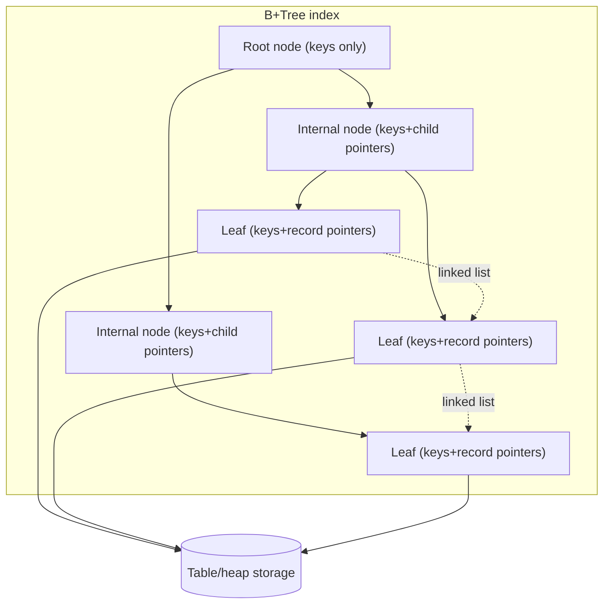
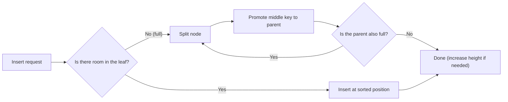
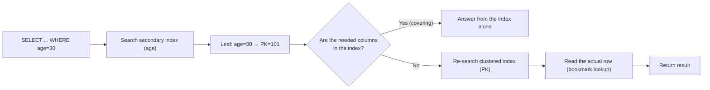

# Database Index Structures (B-Tree · B+Tree)

## 1. Overview

### A. Definition
> A **B-Tree** is a **balanced multi-way search tree** in which a single node holds multiple keys and child pointers; it keeps all leaves at the same depth, guaranteeing **O(log N)** disk accesses for finding any key. A **B+Tree** goes one step further: it **stores actual data (or data pointers) only in leaf nodes**, keeps only keys for navigation in internal nodes, and **links the leaf nodes as a linked list** to strengthen range searches.

### B. Background and Necessity
The tables handled by a relational DBMS reach millions to billions of rows, and this data is stored not in memory but on **disk (in blocks/pages)**. Since disk access is tens of thousands of times slower than memory access, the performance of an index is determined not by "how few operations it performs" but by **"how many disk pages it reads (the number of I/Os)."** A sorted array enables O(log N) comparisons by binary search but requires large-scale shifting on insertion·deletion, and a binary search tree (BST) degenerates to O(N) in the worst case, skewing to one side depending on insertion order. A hash index is fast for equality (=) searches but does not support range·sort queries.

The B-Tree family solves these three limitations at once. By **mapping one node to one disk page (usually 4KB~16KB)**, it reads hundreds of keys with a single I/O, so the tree's **fan-out becomes very large, and as a result the tree height stays low, around 3~4 levels**. At the same time, it automatically maintains balance through **split·merge** even on insertion·deletion, guaranteeing performance even in the worst case. In particular, the B+Tree links leaves as a linked list so it can process "BETWEEN," "ORDER BY," and "range scans" as sequential reads, and thus nearly all commercial RDBMSs today (Oracle·MySQL InnoDB·PostgreSQL·SQL Server) adopt it as the default index.

### C. Characteristics
- **Balanced tree**: all leaves at the same depth → search cost is constant for any key.
- **High fan-out·low height**: node = page → fan-out in the hundreds → height 3~4 even at large scale.
- **Maintains ordering**: keys are kept sorted, so equality·range·sort queries are all supported.
- **Self-balancing**: insertion·deletion are handled by local split·merge, so rebuilding is unnecessary.

### D. Comparison with Other Data Structures (Why B+Tree)
The strengths of the B+Tree become clear only when placed alongside the alternatives. A **binary search tree (BST)** has a structure where each node holds one key and two children, so holding a million rows reaches a height of 20 levels, requiring that much disk I/O. Moreover, inserting in sorted order stretches it to one side and effectively degenerates it into a linked list (O(N)). **AVL·red-black trees** enforce balance to prevent the worst case, but they are still binary (fan-out=2), so the height is high and nodes are finely fragmented, making them **unsuitable for page-unit disk I/O**. These are all suitable only for in-memory data structures, not for page-based disk storage.

A **hash index** is a powerful alternative that handles equality (=) searches in average O(1), but since it scatters values by hashing, it **cannot support sort·range (>, BETWEEN, ORDER BY)·prefix-match (LIKE 'abc%') queries at all**. It also has issues of hash-collision·rehashing cost and performance degradation under data skew. In contrast, the B+Tree, while slightly slower than a hash for equality searches (O(log N)), has the versatility of **supporting all query forms with a single structure**. Since a substantial portion of real-world queries include ranges·sorts, this is why the B+Tree becomes the default choice unless there is an exceptional case where only specific equality lookups are extremely frequent.

| Structure | Search complexity | Range·sort | Disk suitability |
|---|---|---|---|
| **BST (unbalanced)** | Worst O(N) | Possible (inefficient) | Low |
| **AVL/RB tree** | O(log N) | Possible | Low (binary·fine nodes) |
| **Hash index** | Average O(1) | **Not possible** | Medium |
| **B+Tree** | O(log N) | **Excellent (leaf links)** | **High (node=page)** |

## 2. Overall Structure

A B+Tree consists of three kinds of nodes with different roles. **Root·internal nodes** hold only the **separator keys and child pointers** for deciding "which child to descend to." Since there is no actual data here, more keys can be packed into a page, and this maximizes fan-out and lowers height. **Leaf nodes** hold all the sorted keys along with **the actual records (clustered index) or record-location pointers (non-clustered index)**. Finally, **the leaves form a doubly/singly linked list running left→right**, and thanks to this link, "scanning values above a certain point in order" ends as sequential I/O following only the leaves, without re-traversing the tree.

Each node observes a **minimum·maximum key-count rule**. In a B-Tree of order m, every node except the root must have at least ⌈m/2⌉−1 and at most m−1 keys; if this lower bound is broken, the rule is restored by merge·redistribution, and if the upper bound is exceeded, by split. This rule is exactly the core invariant that guarantees **the tree's balance and page-utilization rate (usually 50% or more)**.

## 3. Core Operations (Search·Insert·Delete)

**Search** starts at the root, compares the separator keys of each node with the sought value, and descends to the appropriate child, reaching a leaf and checking the key. Since the number of nodes visited equals the tree height, the number of I/Os is proportional to the height. For example, with a fan-out of 200, three levels can index 200³ = 8 million rows and four levels 1.6 billion rows, so even a table of hundreds of millions of rows **finds the desired row with just 3~4 page reads**. This is the decisive point that separates it from a full scan (O(N)) that reads everything without an index.

**Insert** first finds the leaf to enter by searching, then inserts the key at the sorted position. If the leaf has room, it ends there, but if the node is full, a **split** occurs. The node is divided in half and the middle key is sent up (promoted) to the parent; if the parent is also full, this split propagates upward, and if the split reaches the root, a new root is created and **the tree height increases by 1**. Because a height increase occurs only through a root split, all leaves are always kept at the same depth. Inserting sequentially increasing keys (e.g., an `AUTO_INCREMENT` PK) repeatedly causes splits at the rightmost end, so pages are mostly filled toward the right.

**Height calculation (numeric example)**: Looking at the relationship between fan-out and height with concrete numbers makes the power of the index clear. Assuming a page size of 16KB and an index key + child pointer of roughly 16 bytes, one internal node holds about 1,000 branches, so fan-out ≈ 1,000. At this point, a height of 2 can hold 1,000² = 1 million rows, and a height of 3 can hold 1 billion rows. That is, **even in a 1-billion-row table, one reaches the desired row with just 3~4 page reads of root→internal→leaf**. In contrast, holding the same 1 billion rows in a binary tree requires log₂(10⁹) ≈ 30 levels, increasing I/O about tenfold. This difference is the quantitative basis for the B+Tree being effectively the only choice for large-scale OLTP.

**Delete** removes the key from the leaf, and if that node's key count falls below the minimum lower bound (⌈m/2⌉−1), the rule must be restored. There are two restoration methods: **redistribution**, which borrows a key if a sibling node has room, and **merge**, which combines two nodes if the sibling is also tight. A merge pulls down one separator key from the parent, so the parent's key count also decreases, and if this process propagates upward until the root has only one child left, **the height decreases by 1**. Practical DBMSs sometimes use a deferred strategy that does not merge immediately on deletion but leaves space temporarily empty for reuse, and because of this, an index can become bloated after mass deletion and require reconstruction (REBUILD/REINDEX).

## 4. B-Tree vs. B+Tree Comparison

The difference between the two structures derives from a single decision — "where to place the data" — and that decision governs range-query performance and fan-out. A **B-Tree** stores data (or data pointers) also in internal nodes, so it has the advantage that, if one is lucky enough to encounter the key at a higher node, it can end early without going down to the leaf. However, since internal nodes carry data too, the number of separator keys held per page decreases, and accordingly **fan-out becomes lower, making the tree taller even for the same data**. In addition, since data is scattered across multiple levels, a range search requires in-order traversal up and down the tree, which is inefficient.

A **B+Tree** empties internal nodes into pure signposts to grow fan-out and lower height. Since all data is sorted·linked in the leaves, **a range query need only find the starting point via the tree and then follow the leaf links**, processed as sequential I/O. On the other hand, since any key must descend all the way to a leaf, there is no dramatic gain in individual equality searches compared with a B-Tree. Because most real-world queries include ranges·sorts·scans and a stable height matters, **commercial RDBMSs adopt the B+Tree with almost no exceptions**.

| Category | B-Tree | B+Tree |
|---|---|---|
| **Data location** | Both internal·leaf nodes | **Leaf nodes only** |
| **Internal node role** | Key + data | Key (signpost) only |
| **fan-out / height** | Relatively low / high | **High / low** |
| **Range·sort query** | In-order traversal needed (inefficient) | **Sequential via leaf linked list** |
| **Single equality search** | Can terminate early at a higher node | Always descends to a leaf |
| **Adoption** | Concept·some filesystems | **Most RDBMS indexes** |

## 5. Index Applications: Clustered·Composite·Covering

The actual performance of an index is decided by how one designs **"what to hold in the leaf"** atop the B+Tree data structure. The figure above shows that when a secondary-index lookup is covering, it ends with the index alone, but otherwise a **bookmark lookup — descending the PK (clustered index) once more to read the actual row** — is added. Since this extra I/O governs performance in bulk lookups, covering design becomes a powerful optimization. A **clustered index** stores whole rows sorted in the leaf, so the table itself is physically sorted in index order. MySQL InnoDB takes the PK as the clustered index, so PK range lookups are very fast, whereas if the PK is random (UUID, etc.), a middle-page split occurs on every insertion and performance plunges — this is why sequentially increasing PKs are recommended in InnoDB. A **non-clustered index (secondary)** holds only the key and "a pointer to find the row (in InnoDB, the PK value)" in the leaf, so if a column not in the index is required, a **bookmark lookup** that re-reads the actual row occurs.

A **composite index** joins multiple columns into a single key, with sorting done **lexicographically from the leading column**. Therefore, an `(A, B)` index accelerates `A=? AND B=?` or `A=?` queries but cannot be used for a `B=?` standalone query (this is called the **leftmost prefix rule**), and not knowing this principle leads to a common tuning failure where an index is created but not used. A **covering index** is an optimization in which the index includes all columns the query requires, so it reads only the leaves and completely omits table access (lookup). For example, placing an `(age, name)` index for `SELECT name FROM member WHERE age=30` produces the result from the index alone without reading the table at all, cutting I/O several times over in bulk lookups.

| Type | Leaf contents | Characteristics·cautions |
|---|---|---|
| **Clustered** | Whole rows (stored sorted) | Fast range lookup, split explosion with random PK |
| **Non-clustered** | Key + row pointer | Extra lookup may occur |
| **Composite index** | Multi-column combined key | Must observe leading-column rule |
| **Covering index** | Includes all query columns | Skips table access, cuts I/O |

The **anti-pattern** of creating an index yet not actually using it is a regular cause of real-world performance failures. As an actual case, in an e-commerce service, order lookups of the form `WHERE DATE(created_at) = '2024-01-01'` took several seconds each; the cause was that wrapping the index column `created_at` in the `DATE()` function **suppressed the index (index suppression)**. Changing it to the range condition `created_at >= '2024-01-01' AND created_at < '2024-01-02'` revived the index range scan and shortened the response to a few milliseconds. Representative anti-patterns are as follows.

- **Processing the index column**: applying a function·operation to the column, such as `WHERE SUBSTR(col,1,3)='ABC'` or `WHERE col+0=100`, prevents the index from being used → process the constant side instead.
- **Missing leading column**: in an `(A,B,C)` index, not including `A` in the condition limits index use (leftmost-prefix violation).
- **Standalone index on a low-selectivity column**: for columns with only a few kinds of values, such as gender·status, the optimizer chooses a full scan, making the index meaningless.
- **Implicit type conversion**: comparing a string column with a number (`WHERE varchar_col = 100`) introduces type conversion and breaks the index.
- **Negation·leading wildcard**: `!=`, `NOT IN`, `LIKE '%abc'` cannot leverage the sort order, reducing the index's effectiveness.

## 6. Advanced: Write Load, the LSM-Tree, and Changes in the SSD Era

The traditional B+Tree is a **read-oriented balanced** structure, so it reveals weaknesses under modern workloads with a flood of random writes (logs·time series·message streams). Because it inserts a key directly at its sorted position, every insertion **updates a random location on disk**, and **write amplification** and fragmentation due to page splits accumulate. What emerged to solve this is the **LSM-Tree (Log-Structured Merge-Tree)**, which first accumulates writes sequentially in memory (a MemTable), flushes them to disk sequentially as sorted immutable files (SSTables), and organizes them in the background by **compaction** that merges multiple SSTables. As a result, it has the opposite trade-off: **writes are sequentialized and very fast, but reads incur read amplification because multiple levels must be searched**. For this reason, systems where writes overwhelmingly dominate (Cassandra·RocksDB·HBase, LevelDB) choose the LSM-Tree, while balanced OLTP (MySQL·PostgreSQL) chooses the B+Tree — the choice diverges by workload.

Changes in storage media also shake the design. In the HDD era, reducing seek time was the absolute imperative, so "a B+Tree that minimizes height" was optimal, but **SSD/NVMe** have fast random access, so the burden of height itself has lessened. However, SSDs have the characteristic of **erasing and rewriting only in block units (erase-before-write)** and a cell-lifespan limit, so the LSM-Tree that reduces write amplification and the **Fractal Tree/Bε-tree** (a variant that buffers insertions to sequentialize them) drew attention. Also, in-memory DBs use cache-line-friendly **B+Tree variants (e.g., the cache-conscious CSB+-Tree)** or other structures — the latest trend is not "one B+Tree for everything" but **differentiation into optimal indexes per medium·workload**. In fact, PostgreSQL provides multiple index types besides B-Tree, such as GIN·GiST·BRIN·Hash, recommending different indexes for time-series·full-text·spatial data.

Meanwhile, from a concurrency standpoint too, the B+Tree needs sophisticated control. When multiple transactions update the same index simultaneously, a wide range can be locked while splits·merges propagate to higher nodes, so commercial DBMSs raise concurrency with techniques like **latch coupling (crabbing)** or the **Blink-Tree** (allowing lock-free search even during a split via a right link). They also use locking strategies tightly coupled to the index structure, such as the **next-key lock**, to prevent the phantom problem in range queries. Thus the B+Tree is not a mere data structure but a core component of the DBMS engine that operates in concert with transaction isolation·concurrency control·recovery (logging).

## 7. Considerations and Implications (Engineer's Perspective)
- **Trade-off in the number of indexes**: an index accelerates reads but must be **updated together on every write (INSERT·UPDATE·DELETE)**, so indiscriminate proliferation of indexes causes degraded write performance and increased storage. As a principle, analyze query patterns and design a **minimum set centered on high-selectivity columns and frequently used queries**, and periodically remove unused indexes.
- **Selectivity and optimizer judgment**: for a low-selectivity column with few value kinds, such as gender, the optimizer may choose a full scan even if an index is created. Statistics (cardinality·histograms) must be kept up to date (ANALYZE) for the optimizer to correctly use the index, and since functions·type conversions neutralize the index, **writing SQL that does not process the index column** is important.
- **Fragmentation and reconstruction strategy**: if mass insertion·deletion repeats, page-utilization rate drops and the index becomes bloated, degrading performance. A plan to **maintain performance during operation** by adjusting fill ratio (FILLFACTOR), online reconstruction (REINDEX/REBUILD), and partitioning together is needed.
- **Workload·medium alignment design**: choose the index according to query nature and storage medium (HDD/SSD/memory) — B+Tree for OLTP·range-lookup-centered, LSM-Tree for write-heavy·log-like, BRIN for time series, an inverted index (GIN) for full-text, and so on — which is directly tied to data-architecture design capability.
- **Extension to distributed environments**: in sharding·distributed DBs, one must combine a global index·hash partitioning atop local B+Trees, requiring an **extended index-strategy design** that also considers distributed-transaction·redistribution cost.

## References
- PostgreSQL Documentation, "Index Types" — https://www.postgresql.org/docs/current/indexes-types.html
- MySQL Reference Manual, "How MySQL Uses Indexes" — https://dev.mysql.com/doc/refman/8.0/en/mysql-indexes.html
- MySQL Reference Manual, "InnoDB Index Types (Clustered/Secondary)" — https://dev.mysql.com/doc/refman/8.0/en/innodb-index-types.html
- Google Research, "The Log-Structured Merge-Tree (LSM-Tree)" (O'Neil et al.) — https://www.cs.umb.edu/~poneil/lsmtree.pdf

---
> **In one line**: A B-Tree is a balanced multi-way search tree that grows fan-out by making node=disk page, and a B+Tree is a variant that keeps data only in leaves and links leaves as a linked list to strengthen range·sort queries; thanks to low height (3~4) and O(log N) I/O, it is used as the default index of most RDBMSs today.
