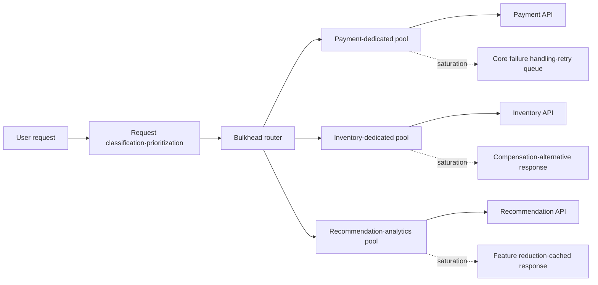
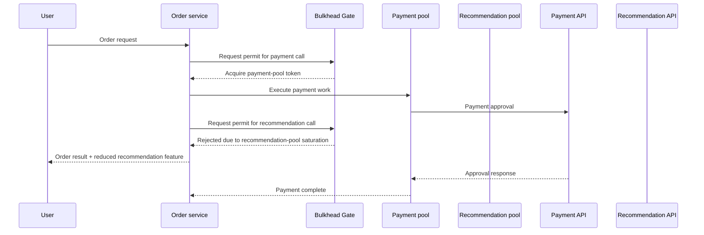

# The Bulkhead Pattern and Failure Isolation

## 1. Overview

> **Definition**: The Bulkhead pattern is a failure-isolation pattern that divides an application's resources and processing paths into multiple isolated pools so that the failure or saturation of one component does not exhaust the resources of another.

The name bulkhead comes from the structure of dividing a ship's hull into multiple watertight compartments.
Even if a leak occurs in one compartment of the hull, if the water does not spread to all compartments, one can delay or prevent the sinking of the entire ship.
In software too, when a single external API slows down or requests from a particular customer surge, resources are compartmentalized so that all threads·connections·memory·queues are not locked up together.

Failures in distributed systems appear not as simple success or failure but as delay, retry, connection waiting, queue backlog, and partial responses.
In a shared-resource structure, requests to a slow dependency occupy worker threads for a long time and successively exhaust connection pools and wait queues.
As a result, cascading failure occurs, where even requests to healthy dependencies that originally had no failure cannot be processed.
The bulkhead is not a technique for fixing a broken dependency, but a technique for limiting the blast radius — the scope of the failure's impact.

For example, suppose an order service calls three external systems: payment, inventory, and recommendation.
If the three calls share one thread pool and one connection pool, a delay in the recommendation service can steal the execution opportunity of payment-approval requests.
If the concurrent-call count and connections are separated per payment·inventory·recommendation, then even if the recommendation pool fills up, the payment pool remains and the core order function can continue.
However, isolated resources are not free, so one must also review the balance of overall throughput·memory·operational complexity·fairness.

The bulkhead differs in purpose from circuit breakers, timeouts, retries, and rate limiters, but is used together with them.
A timeout limits the time one call holds on, and a circuit breaker quickly blocks calls when persistent failure is detected.
Retries help recovery from transient errors but can increase load, and a rate limiter limits the incoming volume.
The bulkhead limits the share that a particular path can occupy within shared resources, leaving survival space for other paths.

## 2. Problem Background and Design Goals

### 2.1 Shared Resources and Cascading Failure

A synchronous remote call occupies the caller's execution resources.
Even when the call target is healthy and the average latency looks short, if the target fails or a network partition occurs, requests awaiting a response accumulate.
If waiting requests keep occupying execution threads and connections, the resources to process new requests vanish, and even the caller's own health check or management API can fail.

This phenomenon can be viewed from a queueing perspective.
The moment the arrival rate exceeds the service rate, the wait queue grows, and if each request's service time lengthens, the concurrency needed even for the same traffic grows.
If one dependency's service time lengthens while all dependencies share one pool, that dependency abnormally raises the pool's occupancy.
The bulkhead sets a maximum concurrency per dependency so that one path cannot monopolize the entire system's throughput.

The same problem occurs in asynchronous structures.
If multiple tasks use one message queue and the same consumer group, a message with a long processing time delays the normal messages behind it.
Separating queues, consumer groups, and worker counts by business importance can reduce a particular task's backlog stealing the processing opportunity of other tasks.
Therefore, the bulkhead is not limited to thread isolation but applies to the boundaries of queues·processes·nodes·tenants.

### 2.2 Goals and Non-Goals

The first goal of the bulkhead is to limit the scope of a failure.
The goal is not to always make the entire service succeed, but to keep core functions responding even if some functions are restricted.
The second goal is to increase the predictability of resource usage.
Setting an upper bound per dependency lets one estimate how much resource which path will consume in the worst situation.

The third goal is to enable quality differentiation by importance.
Payment and login can have higher priority than recommendation·analytics, and accordingly one can allocate a larger pool or a separate instance.
The fourth goal is to mitigate the surge after recovery.
Even if accumulated requests resume all at once the moment a failure clears, the isolated incoming volume and queue must not exceed the recovery speed.

Conversely, the bulkhead does not automatically guarantee data consistency.
Since limiting calls causes some requests to be rejected or delayed, reprocessing·compensation·user-notification policies are separately needed.
Nor does it substitute for capacity planning.
Even if pools are well divided, if the limits of all pools are smaller than actual demand, failures occur even under normal traffic.

## 3. Overall Concept Diagram and Isolation Levels

In the diagram above, the router is not simply a component that splits URLs.
It is a policy point that decides which pool a request enters based on the request's business importance, tenant, dependency, and expected processing time.
Each pool can have its own maximum concurrent-call count, wait time, queue length, execution threads, and connection count.
On pool saturation, rather than waiting indefinitely, one selects an appropriate result among fast failure, cache, asynchronous switching, and feature reduction.

The isolation level of the bulkhead extends from a fine-grained level to a coarse-grained level.
A semaphore limits only the concurrent-execution count within one process, so its overhead is small and it is easy to apply.
A dedicated thread pool separates the execution flow of slow calls from other pools but additionally uses thread and queue memory.
Process·container·node separation provides a stronger failure boundary but increases the burden of deployment·observation·cost.

| Isolation level | Isolation target | Advantage | Limits and cost |
|---|---|---|---|
| Semaphore | Concurrent-execution permits | Lightweight and low latency | Calling code shares the same process resources |
| Thread pool | Execution threads and wait queue | Blocks slow calls' thread occupation | Thread·context-switch·queue-memory cost |
| Connection pool | DB·HTTP connections | Prevents propagation of connection exhaustion | Requires per-pool idle-connection and config management |
| Message queue·consumer group | Asynchronous processing flow | Separates backlog and reprocessing boundaries | Order·duplication·operational-observation complexity |
| Process·container | Runtime instances | Strong isolation of memory·CPU failure | Increased deployment·scheduling·network cost |
| Node·cell | Infrastructure failure domain | Separation of failure domains and tenants | Sacrifices resource-utilization rate and operational cost |

Unconditionally raising the isolation level is not the answer.
Limiting recommendation calls within a single process by semaphore and separating the payment system into a dedicated cell differ in the size of failure impact and cost.
An engineer must select the necessary level based on failure cost, degree of resource sharing, recovery goals, tenant-isolation requirements, and operational maturity.

## 4. Operating Principle and Implementation Methods

### 4.1 Concurrency-Limiting Bulkhead

A concurrency-limiting bulkhead sets a number of permit tokens and has a call acquire a token when it begins.
A request that fails to obtain a permit is immediately rejected or waits only a very short time.
Whether the call succeeds or fails, the token must be returned on a termination path such as `finally`, and a missing return leads to a resource leak more dangerous than a normal failure.

The semaphore approach can limit the concurrent-execution count of external calls without using much CPU.
However, what a semaphore limits is the number of permits, not the execution threads themselves.
If a call blocks on the same event loop or a shared thread, a semaphore alone cannot prevent blocking of the entire runtime.
Therefore, one must confirm whether it is asynchronous I/O or a blocking call, and what execution model the call library uses.

Setting `maxConcurrentCalls` to 20 means up to 20 enter concurrently, not that 20 per second is guaranteed.
Since throughput differs greatly between a 1-second and a 10-second processing time, one must measure the concurrency limit together with latency·throughput.
Setting the wait time to 0 fails immediately on saturation, making resource protection clear, while a short wait time can absorb momentary contention.
A long wait time overlaps with user timeouts and piles up requests, so use it cautiously.

### 4.2 Thread Pool and Queue Isolation

The dedicated-thread-pool approach routes calls to a particular dependency to a separate executor and queue.
For example, the payment pool can have 16 threads and a short queue, and the recommendation pool 4 threads and a limited queue.
Even if the recommendation API slows down, only the recommendation pool's queue fills up, and the payment pool's executor is unaffected.

Leaving the queue unbounded weakens the effect of isolation.
If memory and user timeouts are exhausted while requests pile up in the queue, the failure merely appears late and is not resolved.
Therefore, one must set queue length, wait time, rejection policy, and cancellation propagation together.
When the queue is full, decide per business whether to return 429 or an explicit business error to the caller, pass it to a message broker, or fall back to cache.

The thread-pool size cannot be decided by CPU core count alone.
The external-I/O wait ratio, average·percentile latency, per-call memory, the allowed concurrency of downstream, and user timeouts must all be considered.
Too few threads lower throughput even under normal load, and too many increase context switching and memory pressure.
Validate the pool size using real traffic and fault injection, and leave rationale and a change history in the configuration values.

### 4.3 Connection Pool and Store Isolation

The connection pools of HTTP clients and databases are also important bulkhead targets.
If service A's slow query occupies all the shared DB connections, even service B's simple lookup may fail to obtain a connection.
Separating the connection pool or the database proxy's limits by business importance, and setting query timeouts and maximum lifetimes, can reduce this impact.

Dividing the connection pool does not mean the database itself is isolated.
If all connections use the same DB instance and disk, CPU·IOPS·lock contention is still shared.
If strong isolation is needed, one must consider read-only replicas, per-workload schemas·instances, resource groups, and separate data stores.
In exchange, replication lag, cost, data movement, and operational-automation complexity increase.

### 4.4 Process·Container·Cell Isolation

Process and container isolation divide the memory·CPU·restart boundaries of the application runtime.
Since one process's memory leak or thread exhaustion does not directly corrupt another process's address space, it provides a stronger failure boundary than a semaphore.
In a Kubernetes environment, one can combine policies such as separate deployments, resource requests·limits, node pools, taints·tolerations, and PodDisruptionBudget.

Cell-based architecture is an approach that places multiple customers or tasks into small independent units.
Separating one cell's data·compute·queue from other cells can limit the impact of a failure and the risk of a deployment.
However, as the number of cells grows, problems of routing, data migration, version management, and capacity redistribution arise.
Therefore, rather than making all tenants into one cell, a mixed strategy based on importance and isolation requirements is realistic.

The flow above is an example of not escalating the failure of an optional feature into the failure of the core transaction.
Recommendation-pool saturation can be handled as omitting the recommendation result or supplementing it later, but a side-effect operation like payment approval must not be blindly retried.
Each call needs an independent timeout and error classification, and one must also confirm to what stage the business state has been saved before returning the token.

## 5. Comparison with Other Resilience Patterns

The bulkhead does not replace other patterns.
Classifying the failure type first allows one to explain which pattern is needed and the order of application.
For example, a brief network loss can be recovered by limited retries, but repeating retries while the target service is persistently down can quickly fill up the bulkhead's pools.

| Pattern | Problem mainly controlled | Core settings | Relationship with the bulkhead |
|---|---|---|---|
| Timeout | Infinite wait of one request | Connection·read·total time | Limits pool-occupation time, used together |
| Retry | Transient errors | Count·backoff·jitter | Limited so a retry surge does not encroach on the pool |
| Circuit breaker | Repeated calls due to persistent failure | Failure rate·wait time·half-open | Reduces calls to a failing target and helps pool recovery |
| Rate limiter | Surge of incoming requests | Per-hour·per-second allowance | Pre-controls the volume entering the pool |
| Queue·backpressure | Speed difference between producer and consumer | Queue length·rejection·drop | Creates a saturation boundary for asynchronous processing |
| Fallback | Feature reduction and user response | Cache·default·alternative flow | Provides a meaningful result on pool saturation |

With a bulkhead but no timeout, a limited number of requests can hold tokens for a long time.
With retries but no circuit breaker, requests keep being sent to a failed target and can exhaust the pool.
Conversely, creating a large dedicated pool for every call gains failure isolation but increases memory and connection cost and lowers overall resource-utilization rate.
In practice, one binds the single-call time with a timeout, puts jitter and a budget on retries, and limits the impact scope of persistent failure with a circuit breaker and a bulkhead.

## 6. Design Procedure and Capacity Estimation

The first step is to identify the failure domains.
List the call targets, feature importance, customers·tenants, stores, message queues, and deployment units, and draw which resources they share.
Do not divide simply by service name; find the paths that share the same resources and the same failure cause.

The second step is to define business priorities and acceptable degradation.
Agree with the product owner on whether the order must be halted if payment fails, whether the order can be completed even if recommendation fails, and whether analytics can be processed with delay.
Record the maximum latency, maximum failure rate, fallback result, and reprocessability for core·important·optional features.

The third step is to allocate the resource budget.
If the total concurrency limit is 100 and you allocate payment 50, inventory 30, recommendation 20, make explicit the rationale for each limit and the policy for the remaining shared resources.
Adding up the limits can increase normal throughput but can also increase the loss scope on failure, so compare the trade-off of capacity and isolation strength numerically.

For simple capacity estimation, one can reference Little's Law \(L = \lambda W\).
The average number of concurrent requests \(L\) can be seen as the product of the arrival rate \(\lambda\) and the average residence time \(W\).
For example, if the target throughput of a particular external call is 8 per second and the average round-trip time is 0.5 second, the average concurrency is about 4.
The actual limit must be set by reflecting peak and p95·p99 latency, retries, and headroom, and must not be fixed by the average value alone.

The fourth step is to decide the behavior on saturation.
A low-priority lookup can be substituted with cache or a default value, but a movement of money or a permission change is safer with an explicit failure and a reprocessing state.
Unconditionally putting a rejected synchronous request into an internal queue can make the processing appear successful to the user while the actual processing state is delayed.
Store the business state and an idempotency key together to distinguish retries from duplicate processing.

The fifth step is to verify by observation and experiment.
Measure per-pool throughput under normal load, and put one dependency into a delay·error·connection-refusal state to confirm that healthy paths are maintained.
Version the configuration values in code or configuration management, and review threshold changes together with load·fault-test results.

## 7. Case: A Multi-Tenant Order Platform

Assume that on an order platform used by multiple sellers, product lookups by large sellers account for the majority of all traffic.
Using a shared cache and shared DB connections, one seller's bulk lookup can delay small sellers' order creation and the admin screen.
This problem is not solved simply by adding more servers.
Because the customer who increased traffic monopolizes resources again, the same contention repeats at a larger scale.

The platform sets four boundaries based on tenant grade and task type.
Order creation and payment go into the core pool, inventory lookup into the important pool, product search into the general pool, and recommendation·reports into the asynchronous pool.
Top-traffic tenants use a separate queue and a weighted pool, but must not exceed the maximum occupancy of the entire platform.
Reports are not executed immediately on request; instead a job is registered and a completion notification is provided, reducing resource contention among synchronous requests.

If during operation the recommendation API's p99 latency rises from 200ms to 3 seconds, the recommendation pool can saturate quickly.
At this point, rejecting recommendation calls after a short wait and returning a recent recommendation cache protects the threads and connections of the order-creation path.
If the payment API slows down at the same time, the payment pool uses a separate timeout and retry budget, and maintains an idempotency key for approval requests.
This way, even if it is not "all features normal," one can preserve the completion rate of core orders and fairness across customers.

The case's outcome is not judged by overall average latency alone.
Look together at per-tenant order-success rate, the saturation rate of the core pool, the rejection rate of optional features, queue wait time, retry counts, and database connection-usage rate.
If average latency improved but small customers' error rate increased, the isolation policy failed to achieve the fairness goal.
Conversely, if the recommendation-omission rate rose but order-success rate and payment stability were maintained, it can be regarded as a success within the agreed quality-degradation range.

## 8. Advanced: Linkage with Cloud·Containers·Observability

In cloud-native environments, one can place the bulkhead at multiple layers: the application, the service mesh, the orchestrator, and the infrastructure.
The application's semaphore provides fine-grained per-dependency policy, and the service mesh provides common control of connection·concurrent-request·outbound pools.
Kubernetes' resource limits and separate node pools reduce CPU·memory contention, but they do not substitute for the meaning of application queues and fallback.
If the same limit is applied redundantly at multiple layers, the actual allowance can become smaller than expected or the cause becomes hard to identify.

Observability is as important as dividing the pools.
Metrics should include per-pool permit-acquisition success·rejection counts, currently used slots, wait time, queue length, execution time, timeouts, and fallback rate.
Traces should show which bulkhead a request entered and how long it waited, and logs should safely link tenant·task·dependency·idempotency key.
Looking only at shared totals cannot confirm the isolation effect that recommendation-pool saturation did not affect the payment pool.

When applying standard instrumentation such as OpenTelemetry, manage pool names and dependency names as low-cardinality attributes.
Putting request IDs or customer IDs in as unbounded tags can increase monitoring cost and storage volume.
Apply masking·sampling policies together so that sensitive payment information and personal data do not enter traces.
A saturation event is not a simple error but a signal that the capacity policy operated, so create alert criteria and a response playbook in advance.

In cell-based deployment, the deployment unit itself becomes a bulkhead.
Gradually deploying a new version to one cell, confirming the error rate and pool-saturation rate, and then expanding to the next cell reduces a bad deployment spreading to all customers.
However, if differences in data and configuration between cells accumulate, operators find it hard to compare failure causes.
Control operational variance with cell templates, configuration validation, common dashboards, and standard recovery procedures.

## 9. Considerations and Implications

### 9.1 Balancing Isolation and Resource-Utilization Rate

Dividing pools too small leaves much idle resource, and one pool cannot absorb another pool's momentary demand.
Sharing pools too large improves resource-utilization rate but enlarges the radius of cascading failure.
A mixed structure that places a guaranteed minimum capacity on core paths and allows a limited shared surplus on non-core paths is realistic.

### 9.2 Priority and Fairness

Allocating a large pool to a core function raises the service level, but a particular large customer can monopolize that pool.
One must design inter-customer isolation by combining per-tenant maximums, weights, token buckets, and fair queues.
Priority rules must be based on contracted SLAs·business importance·regulatory requirements, not arbitrarily set by the technical team.

### 9.3 Failure Response and Data Consistency

When rejecting a request due to pool saturation, a duplicate order can occur if the user resubmits.
For write operations, prepare idempotency keys, state lookup, a duplicate-prevention store, and compensation procedures, and show the user a distinction among received·in-process·failed.
Fallbacks that return cache or default values should record the impact on freshness·accuracy·security, and review whether a fallback may be used at any time for that business.

### 9.4 Fault Testing and Change Management

Normal-load testing alone cannot prove failure isolation.
One must combine delay injection, increased error rate, connection leaks, queue saturation, node failure, and retry surges to confirm that the success rate of healthy functions is maintained.
Re-estimate limits and fallback policies when operational traffic and dependency characteristics change, and manage configuration changes the same as deployment changes.

### 9.5 Security and Personal Data

Even when separating pools and logs per tenant, one must check access permissions and data isolation together.
Since resource isolation does not mean data isolation, separately confirm store permissions·network policies·encryption·audit logs.
In the process of analyzing the saturation cause, apply minimal collection and masking so that customer identifiers and request contents are not excessively exposed.

### 9.6 Application Strategy from an Engineer's Perspective

Rather than declaring "we adopt the bulkhead," an engineer must present the failure domains, isolation units, the rationale for limit estimation, and the business outcome on saturation as design deliverables.
In the architecture decision record, leave why the shared resources were divided, the worst-case impact and cost of not separating them, and the re-review conditions.
After construction, link per-pool SLOs and error budgets to continuously adjust the range within which feature reduction is allowed and the investment priorities.
Ultimately, the bulkhead is not a technique for eliminating failures but a method of designing the system's failure mode so that core value continues to be delivered even when a failure occurs.

## References

- Microsoft Learn, "Bulkhead Pattern - Azure Architecture Center": https://learn.microsoft.com/en-us/azure/architecture/patterns/bulkhead
- Microsoft Learn, "Architecture design patterns that support reliability": https://learn.microsoft.com/en-us/azure/well-architected/reliability/design-patterns
- resilience4j, "Bulkhead": https://resilience4j.readme.io/docs/bulkhead

---

> **In one line**: The bulkhead divides resources and processing paths into isolated pools to prevent the failure·saturation of one component from spreading to the entire service, and is a resilience pattern that secures the survival of core functions and predictable degradation.
