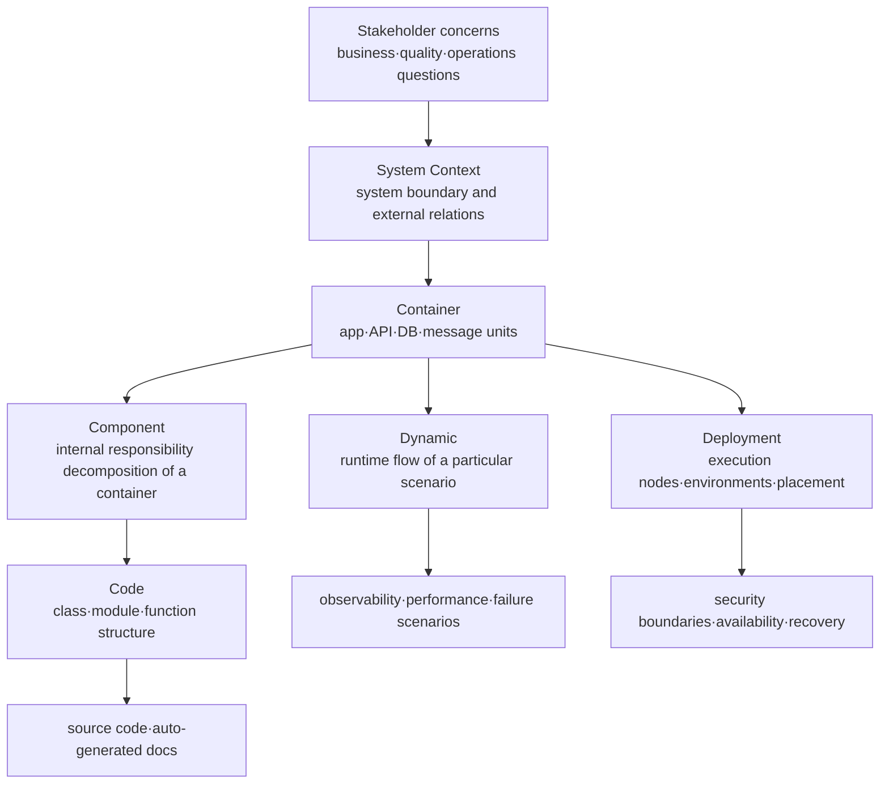
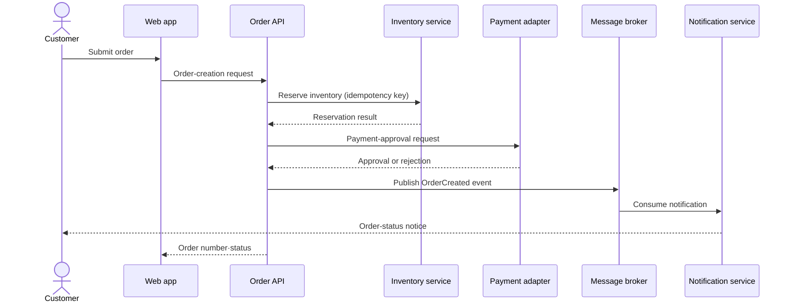
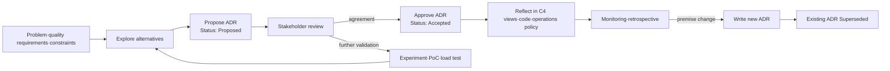
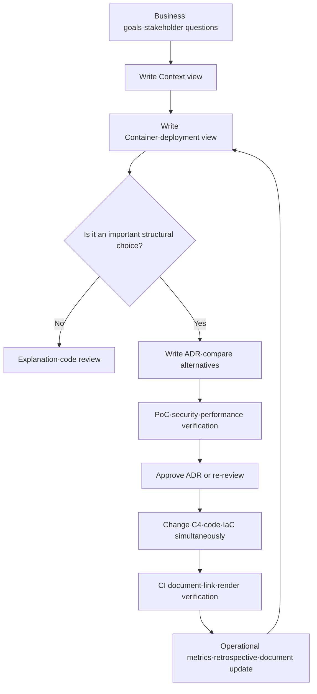

# Software Architecture Documentation Based on the C4 Model and ADRs

## 1. Overview

> **C4 model and ADR-based architecture documentation** is a method that visualizes software structure at levels of abstraction tailored to each stakeholder (C4) and records important design choices and their rationale·trade-offs as decision records (ADRs), thereby securing the persistence of architectural knowledge.

Software architecture is not conveyed by a list of the system's functions alone.
The boundaries of users and external systems, deployment units, data stores, runtime call flows, and security boundaries must be explained together for development·operations·security·business staff to view the same system.
However, putting everything into one giant structure diagram makes the lines and boxes excessive, so that the important boundaries and dependencies become invisible.

The C4 model, like zooming in on a map, divides a system into the layers of Context, Container, Component, and Code, expressing the structure at the needed level.
At the higher level, even non-technical stakeholders can understand the system's responsibilities and external dependencies, and at the lower level, developers can trace the internal decomposition of a particular container.
The purpose is not to unconditionally draw diagrams of every level, but to select the view that fits the question and the reader.

Drawings alone make it hard to explain "why was this database chosen?" or "why events instead of synchronous calls?"
As time passes and the person in charge changes, the current structure remains but the regulatory·performance·cost·organizational constraints of the time disappear.
An ADR reduces this loss of memory by briefly recording one architecturally significant decision along with the context, choice, alternatives, and consequences at the time.

C4 and ADRs are not in a substitution relationship with each other.
If C4 shows the current state of the system as "what is where and how it is connected," an ADR complements it with "why that structure was chosen and what price was accepted."
Version-controlling the two deliverables together with the code repository and cross-linking them makes it easier to detect inconsistencies between structure and decisions when the design changes.

In an engineer's answer, one should not reduce C4 to a mere diagram notation or an ADR to meeting minutes.
First, one must derive the needed views from stakeholders' concerns and quality attributes.
Second, one must explain the boundaries and responsibilities of C4 elements in sentences and make explicit the direction·protocol·data meaning of relationships.
Third, an ADR must record not only positive effects but also negative consequences such as performance·security·operations·migration cost.

### A. Background and Necessity

The first background is the increasing complexity of distributed systems.
In the era of a single application, one could grasp the rough structure just by reading the source code and executables, but current services consist of web·mobile clients, APIs, message brokers, caches, multiple data stores, and external SaaS.
When one screen's call passes through multiple services and asynchronous events, a new member cannot grasp the overall responsibility boundaries by looking at the runtime environment alone.

The second background is the fact that documents have different readers and purposes.
Executives want to know what business the system supports and which external partners it connects to.
Operators need failure domains, deployment nodes, monitoring locations, and recovery paths.
Developers must confirm module responsibilities, interfaces, data flows, and the scope of change impact.
Forcing one detailed design drawing on everyone buries each reader's core information.

The third background is the forgetting of design rationale.
Early in a project, several alternatives were reviewed, but only the chosen result remains in the final code.
A few years later, a new person in charge repeats the same discussion without knowing the current constraints, or may misunderstand a decision that had performance·regulatory·operational reasons as merely old code.
An ADR preserves not the result of the choice but the process by which the choice was made and the judgment criteria of the time.

### B. Goals and Scope

The goal of documentation is not to replicate all code as drawings.
The first goal is to quickly share the system's boundaries and responsibilities.
The second goal is to explain the relationship between important quality-attribute requirements and structural choices.
The third goal is to reduce impact analysis on change and onboarding time.
The fourth goal is to manage design debt and documentation debt together.

The scope of application covers not only the design stage of a new system but also the reverse engineering of an existing system.
A new project starts from business goals and quality scenarios and creates C4 views and ADRs together.
For a legacy system, one first observes the current behavior to write Context·Container views, marks uncertain parts as "needs confirmation," and then gradually supplements them along with change work.

For documents to be actually used in operation, they must be reviewed in the same repository as the code.
For example, one can place diagram sources and explanations in `docs/architecture/c4/`, and store ADRs with increasing numbers in `docs/architecture/adr/`.
In a large organization, keeping common principles in a central catalog while leaving per-service structures and decisions in that service's repository balances traceability and ownership.

## 2. C4 Model Layers and Representation Principles

The C4 model divides software architecture into four core levels of abstraction.
System Context represents the relationship between the system and people·external systems, Container the execution·deployment units inside the system, Component the logical responsibilities within one container, and Code the implementation structure of components.
In addition, one can auxiliarily use a Dynamic diagram, which explains the sequence of a particular scenario, and a Deployment diagram, which shows the infrastructure placement of containers.



These layers are not the same concept as the organization's formal org chart or the number of microservices.
A Container does not necessarily mean only a process running with container technology; it means a unit that runs or is deployed independently, like a single application·service·data store.
Therefore, a monolithic system can also be expressed as one Container, and its internal modules can be explained as Components.

### A. System Context Diagram

The System Context diagram is the starting point of the document.
It places the system of interest as one central box and arranges around it the user roles and external systems that interact with the system.
At this level, one does not include internal classes or frameworks but explains the system's responsibilities, external relationships, and major data·business flows in plain sentences.

A good Context view shows "what this system does" and "what it does not do" together.
For example, a shopping order system may connect to customers·agents·payment gateways·shipping partners, but payment approval itself must be indicated as the responsibility of an external payment system.
Failing to clarify boundaries leads to a wrong allocation of failure responsibility, personal-data-handling responsibility, and interface-change responsibility.

In practice, one first interviews the user journeys and the list of external linkages, and records for each relationship the purpose·direction·main information·trust boundary.
Instead of drawing only a line that says "calls," write the meaning of the relationship, such as "the order system sends a payment-approval request and receives the approval result."
This way, non-technical staff can review the business scope, and security staff can ask about authentication·encryption requirements at the external boundary.

### B. Container Diagram

The Container diagram shows the major execution units inside the system and gives most teams the highest return on investment.
It shows elements that run·deploy·scale independently, such as web applications, mobile apps, API services, batch jobs, message brokers, relational databases, and object stores.
Each element must also note responsibility, technology choice, communication method, and the nature of the stored data.

The reason to divide Containers is not simply to increase the number of services.
A separate unit becomes meaningful when the change cycle, failure isolation, scaling requirements, security·data ownership, and the team's scope of responsibility differ.
Conversely, if only network calls increase while data and deployment are bundled together, dividing into multiple services in form can actually increase operational complexity.

Review Container boundaries with the following questions.
First, can this element be deployed or rolled back independently?
Second, is the owner of the data and invariants clear?
Third, is there a reason to bear call latency and failure propagation?
Fourth, do the team's business boundaries and change-approval flows match the structure?
A separation that cannot answer the questions is likely "distribution for distribution's sake."

### C. Component and Code Diagrams

The Component diagram shows the major logical components and responsibilities inside a particular Container.
For example, inside the order API there may be an order validator, a pricing-policy service, an inventory-reservation adapter, a payment orchestrator, and an event publisher.
Each component should have one responsibility and a clear dependency direction, and must distinguish external interfaces from data-conversion points.

The Component level is not mechanically applied to every container.
If the internal structure is simple or the code itself explains it sufficiently, it is better not to create the document.
Conversely, areas with complex rules and large change impact where new staff frequently access them — such as payment·authorization·settlement modules — have high value for a Component view.

The Code level expresses implementation details such as classes·interfaces·packages·functions.
Drawing all code by hand quickly becomes stale, so auto-generate it with an IDE or static-analysis tool, or record only truly necessary parts such as algorithms·core domain models in a limited way.
Since readers will distrust all documents if the classes shown in a document differ from the actual code, a Code view with low automation potential can be boldly omitted.

### D. Dynamic·Deployment Diagrams

The Dynamic diagram explains one scenario that is hard to understand from static connection relationships alone, in a numbered sequence.
It can show the flow in "order creation" where the API reserves inventory, requests payment, and then publishes an event, or the retry·compensation handling on failure.
Separating the normal flow and the failure flow per scenario makes it easier to discuss timeouts, duplicate messages, idempotency, and transaction boundaries.

The Deployment diagram expresses which execution nodes·cloud resources·availability zones the Containers are placed on.
It shows the differences among development·staging·production environments, public·private network boundaries, secret-management locations, and replication and failover nodes.
Connecting the application structure with the infrastructure structure lets one trace "why it fails only in production despite the same code" and "which service a single node failure affects."



In the dynamic flow, set a team rule so that the direction of an arrow indicates the call direction and a dotted line or separate notation indicates asynchronous delivery.
Do not rely simply on the shape of a line; annotate each relationship in sentences with synchronous·asynchronous, retry, timeout, and data contract.
A drawing is a map for quick understanding, and operational rules must be verified with explanatory text and tests·configuration.

## 3. ADR Structure and Decision Management

An ADR is a short document that records one decision with a lasting impact on the architecture.
Making every feature-implementation ticket or every code review into an ADR buries the signal of important decisions.
Conversely, choices that are hard to reverse and affect multiple quality attributes — such as data stores, authentication methods, communication patterns, deployment strategies, and personal-data storage locations — are taken as ADR candidates.



### A. Context and Problem Definition

In the Context, write the facts and forces at the time of the decision neutrally, rather than expressions that pre-justify the conclusion.
It must include business goals, expected load, regulatory requirements, team capability, schedule, existing-system constraints, and data characteristics.
A phrase like "because it's the latest technology" does not become a verification criterion, so specify which quality attributes and which operational conditions one intends to improve.

For example, the Context of a decision to "deliver order events via a message broker" records the facts that the processing times of payment approval and notification differ, that a failure of the notification provider must not propagate to order creation, and that a consumer design able to withstand event duplication is needed.
Writing it this way lets one judge later, when traffic scale or notification requirements change, whether the premise of the existing decision is still valid.

### B. Decision and Alternative Comparison

Write the Decision as an active sentence: "We choose X."
Do not write only the chosen technology's name; include the scope of application, interface principles, exception conditions, and transition plan.
For example, make the boundary explicit as "We keep a synchronous call between order creation and payment approval, but separate notification·search-index updates into an `OrderCreated` event, and the event consumer guarantees idempotency on the order ID."

Review at least two or more alternatives and leave the reason each was not chosen.
Alternative comparison is not a listing of feature lists but must explain, in the current Context, the impact on quality attributes and the cost the organization will bear.
The following table is an example of choosing the message-delivery method.

| Alternative | Advantage | Burden·risk | Applicability judgment |
|---|---|---|---|
| All synchronous REST calls | Intuitive flow and immediate result check | Failure propagation·coupling increase, peak-scaling limit | Core steps that need strong immediate consistency |
| All asynchronous events | Improved coupling and independent scalability | Must manage delay·duplication·order·traceability | Downstream processing and large-scale event flows |
| Core synchronous·auxiliary asynchronous mix | Balance of user response and failure isolation | Needs operational·observability rules for both models | The general strategy of separating order·payment from notification |

Choosing the "mix" in the table is not always the best.
A step where the user must immediately know success, such as payment approval, may be clearer for error handling if kept on a synchronous path.
On the other hand, work that can tolerate a few seconds' delay, such as sending email, can be made asynchronous so that the external provider's delay does not block the order API's response.
Therefore, the choice must be based on the business's tolerable delay and failure-compensation method.

### C. Consequences and Status Management

In Consequences, write positive·negative·neutral results all together.
A message-based structure lowers service coupling and helps independent scaling, but one must newly manage eventual consistency·duplicate consumption·reordering·trace-ID propagation.
Hiding negative consequences turns an ADR into a promotional document, so future operators cannot anticipate the actual cost.

An ADR status has at least a clear lifecycle such as Proposed, Accepted, Deprecated, and Superseded.
Quietly editing an Accepted document later mixes the judgment record of the time with current knowledge.
When reversing a decision, write a new ADR and leave in the existing document the replacement document number and the reason for the transition.

Review a changed C4 structure in the same change bundle as the related ADR.
For example, a pull request that replaces a database must include the technology name in the Container view, the placement in the Deployment view, the data-migration strategy, and the status change of the relevant ADR.
If documents and code move in separate releases, ghost structures arise — like a service that exists in the drawing but is not actually called.

### D. ADR Template Example

A minimal template usable in practice is as follows.

```markdown
# ADR-0012: Separate order follow-up processing to be event-based

- Status: Accepted
- Date: 2026-09-18
- Related C4: Container - Order API, Notification Service

## Context
We must separate the response time of order creation from the external delay of the notification provider.

## Decision
The order API publishes an OrderCreated event after order creation completes.
The notification consumer uses the order ID as an idempotency key.

## Alternatives
We reviewed synchronously calling all follow-up processing and a batch-polling approach.

## Consequences
The order response stabilizes, but we must operate eventual consistency, reprocessing, and event tracing.

## Follow-up
We monitor the duplicate-consumption rate and notification delay, and conduct a reprocessing drill quarterly.
```

The purpose of the template is not to strictly enforce a format but to ensure the decision's context and consequences are not omitted.
If the team is small, one can start with only Status·Context·Decision·Consequences.
For a regulated industry or a platform jointly operated by multiple teams, add the decision-makers, consultees, affected services, verification metrics, and expiration·re-review conditions.

## 4. Integrated Operating Process for C4 and ADRs

Integrated operation is not the order of "draw the diagram, then write the document separately" but a cyclical process that connects questions·decisions·verification.
First, agree on the system boundaries and external relations with the Context view, and review responsibilities·deployment·data ownership with the Container view.
When quality-attribute conflicts or hard-to-reverse choices are found, propose an ADR, and after approval reflect it in the relevant C4 elements and the implementation.



### A. Document Writing and Review

In a design workshop, do not draw a detailed Component view from the start.
First confirm the Context that has users and external linkages, and map business responsibilities and quality scenarios onto Container boundaries.
Then expand to Component and Dynamic views only for the elements where issues such as failure isolation·scaling·data consistency arise.
This order reduces unnecessary detailing and meeting time.

Reviewers must review meaning before notation.
Confirm whether the system's actors·targets are correct, whether the data owner is represented, whether trust boundaries and failure paths are not missing, and whether each ADR's decision matches the current code·deployment configuration.
Spending time only on shape placement or color makes the document prettier but does not reduce design risk.

### B. Docs-as-Code and Automation

Storing diagram sources and ADRs in Git allows one to use the same branches·pull requests·reviews·change history as the code.
Text-based representations such as Mermaid, PlantUML, and Structurizr DSL are favorable for render automation and search, but one must consider the syntax and output stability of the tool the team adopts.
More important than the tool is the low cost that lets the actual person making changes edit the documents together.

In CI, one can check Mermaid syntax, link validity, ADR-number duplication, Superseded links, and mandatory explanations of C4 elements.
Keeping the HTML·PNG generated in the deployment pipeline as artifacts and showing the relevant ADR links on the operations change-approval screen can prevent documents from ending as one-off deliverables.
However, an auto-generated Code view being up to date does not mean it explains the architectural intent, so structural interpretation must be maintained by people.

### C. Document Quality Metrics

The effect of documentation is measured not by the number of document files but by the speed of answering questions and the safety of changes.
For example, one can track the time it takes a new developer to grasp the boundaries and deployment flow of a core system, the time to find the relevant dependency and responsible team during failure response, and the proportion of important decisions that have ADR links.
If documents increase but onboarding time does not decrease, it means unnecessary detailed information was oversupplied to readers or the content's reliability is low.

Set concrete operating criteria per system.
Review core services' Container views before major deployment changes, and write an ADR for each structural decision such as data store·authentication·communication protocol.
Diagram-code inconsistency defects, the proportion of stale ADRs, link errors, and dependencies missing in operational incidents can also be managed as documentation-debt metrics.

## 5. Comparison and Cases

### A. Comparison of C4 with UML·a Single Giant Structure Diagram

UML provides diverse models and sophisticated notation, and has strengths in rigorously expressing particular designs·behaviors.
C4 uses a limited set of core concepts and layers, focusing on speeding up communication between teams and non-technical stakeholders.
Therefore, rather than saying only one of them is right, a realistic combination is to make the overall map with C4 and supplement complex internal algorithms with UML or code models.

A single giant structure diagram can hold much information on one sheet, but it mixes each reader's concerns and change cycles.
C4's multiple views provide the same model at different zoom levels, controlling the amount of information.
In exchange, the element names·relationships·responsibilities among the views must be kept consistent, so documentation governance is needed.

| Category | C4 model | UML-centered documents | Single giant structure diagram |
|---|---|---|---|
| Core purpose | Per-reader architecture understanding | Precise representation of design structure·behavior | Show all relationships at once |
| Abstraction | Context→Container→Component→Code | Diverse by diagram type | Easily mixed on one sheet |
| Advantage | Good for explanation·zoom·onboarding | Formal modeling and detailed design | Fast overview in the early stage |
| Main risk | Ambiguity without relationship rules | Excessive formality and writing cost | Complexity·readability degradation |
| Countermeasure | Explanatory text·ADR·auto-verification | Per-reader views·select only the core | Layering·splitting·links |

### B. E-Commerce Order Platform Case

On an e-commerce platform, the Context view distinguishes the customer·operator·order system·payment gateway·shipping partner·customer-notification provider.
The Container view expands into the customer web app, order API, inventory service, payment adapter, order DB, event broker, and notification service.
This structure alone lets one discuss whether a payment-provider failure is the same as an order-lookup failure, and whether the notification provider is on the order-critical path.

The choice to "separate notification into events" is recorded as an ADR.
In the Context, record the target latency of the order-success response, the tolerable delay of notification, and the external provider's error rate and retry limit.
In the Decision, make explicit the event-schema version, the duplicate-handling key, the failure queue, and reprocessing responsibility.
In the Consequences, include that the user's order succeeded but the notification may arrive late, and that operators must watch the reprocessing queue.

For example, suppose that during peak hours the order API must handle 2,000 requests per second and the notification API averages 1 second but can be delayed up to 30 seconds on failure.
Keeping notification as a synchronous call makes the order response's tail latency grow due to the external API, and when retries are included, the thread·connection pool can be exhausted.
Separating it into events can limit the order-path latency, but one must review additional designs such as a Transactional Outbox to guarantee the atomicity of event-publishing success and the DB transaction.

### C. Documentation in Financial·Public Systems

Financial·public systems must explain together personal data, audit trails, disaster recovery, and vendor dependencies.
In the Context view, show actors such as citizens·employees·institutions·external certification authorities, and in the Deployment view, show network separation·encryption segments·backup sites.
In ADRs, leave the authentication means and key-management method, data-retention period, the scope of external-cloud use, and responsibility for audit evidence.

In this environment, the approach of "supplementing the documents later" can be risky.
Decisions related to authentication·personal-data storage·cross-border transfer must be reviewed with security·legal·audit staff before implementation, and one must record the decision rationale and the expiration date of exception approvals.
However, since an ADR itself does not automatically guarantee regulatory compliance, it must be used in connection with policies, test evidence, and access logs.

## 6. Advanced: Persistence of Architectural Knowledge and Change Management

The combination of C4 and ADRs can evolve from documents that explain the current structure into an architectural-knowledge graph.
Link C4 elements to the owning team, quality attributes, operational dashboards, API contracts, and related ADRs, and back-link ADRs to the affected elements and verification metrics.
Then, when replacing a particular data store, one can search the impact scope down to the related services·deployment nodes·security controls·decision premises.

Architecture erodes over time.
If a team adds a temporary linkage and does not update the documents, a gap arises between the actual structure and the intended structure.
To prevent this, put architecture-conformance checks for important C4 relationships into CI, and periodically re-review the ADR premises and the SLO·cost·security metrics.
The check must ask not only "does the document match the code?" but also "does the current choice still fit the business goals?"

For example, if data scale grows larger than initially expected and the scaling of a single DB reaches its limit, the Context figures of the existing ADR may no longer hold.
At this point, rather than editing the existing ADR to erase the past record, write a new ADR that investigated alternatives such as sharding·read replicas·separating the analytical store.
Reviewing the new Container·Deployment views and the data-migration verification results together, and marking the previous ADR as Superseded, preserves both the continuity of judgment and the reason for change.

Even as AI coding tools and automatic document generation spread, the responsibility for decisions is not automated.
One can extract a call graph from code to make a Component draft, but whether to place a particular boundary under a team's ownership, which system stores personal data, and at what point of performance and cost to allow trade-offs are organizational judgments.
Mark auto-generated results with the generation time and the analysis scope, and treat only results that have passed human review and ADR approval as the official architecture.

## 7. Considerations and Implications

### A. Purpose-Based Minimal Documentation

Forcing the same number of diagrams and ADRs on every system turns documentation into formalistic work.
One must select the needed views based on key stakeholder questions, change risk, failure impact, and regulatory obligations.
A gradual approach — starting with a minimal Context and Container and adding Component·Dynamic·Deployment only to complex areas — increases persistence.

### B. Distinguishing Current State from Target State

Design documents should not mix the current state (As-Is), the approved target (To-Be), and alternatives under experimentation.
Mark each C4 view with its status and baseline commit·environment, and clarify each ADR's status and scope of application.
In particular, during migration, express the old·new systems and their data-synchronization relationship with Deployment·Dynamic views so operators know which path to trust.

### C. Connecting Quality Attributes with Verification

Do not leave an architectural choice at an abstract level like "it's scalable"; connect it to a measurable scenario.
Write verification metrics such as response time, throughput, recovery time, data freshness, audit-log retention, and vulnerability-response time in the ADR, and link the PoC·load-test·security-test results.
An unverified quality claim must be treated not as a design intent but as a hypothesis.

### D. Security·Personal Data and Change Responsibility

In the C4 Context and Deployment views, show trust boundaries, authentication·authorization points, encryption segments, and personal-data flows.
In ADRs, record data minimization, access subjects, retention·deletion, key rotation, and incident-response responsibility together with the structural decision.
When the structure changes after a security review, the related ADR and threat model must also be re-reviewed, and formalistic compliance that updates only the document without applying controls must be avoided.

### E. Document Ownership and Update Triggers

Mark the document with the responsible team and the last review date, and require an update when the deployment unit·interface·data store·authentication boundary changes.
Since the rule "redraw everything every quarter" alone cannot prevent the inconsistency right after a change, it is more effective to include document updates in the code review and release checklist.
Rather than a central wiki with no owner, it is desirable to place documents in the repository of the team operating the service and to provide organization-common standards as reusable templates.

### F. Outlook from an Engineer's Perspective

Going forward, architecture documents should become verifiable knowledge assets connected to code·IaC·observability·policy, rather than static images.
However, the higher the level of automation, the more one must distinguish "the drawing was generated" from "the intent and trade-offs were agreed."
An engineer must perform the role of designing and documenting the connection among business goals, quality attributes, organizational operations, and regulation·change management, rather than the choice of notation.

## References

- C4 Model official site: https://c4model.com/
- C4 Model diagram guide: https://c4model.com/diagrams
- C4 Model introduction: https://c4model.com/introduction
- Architectural Decision Records community: https://adr.github.io/
- Michael Nygard, Documenting Architecture Decisions: https://www.cognitect.com/blog/2011/11/15/documenting-architecture-decisions

---

> **In one line**: With C4, show the "what" of the architecture at levels tailored to each reader, and with ADRs, record the "why" and the trade-offs, thereby making living design documents in which structure·code·operations evolve together.
