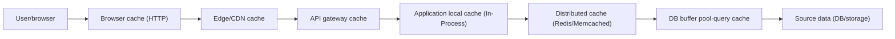
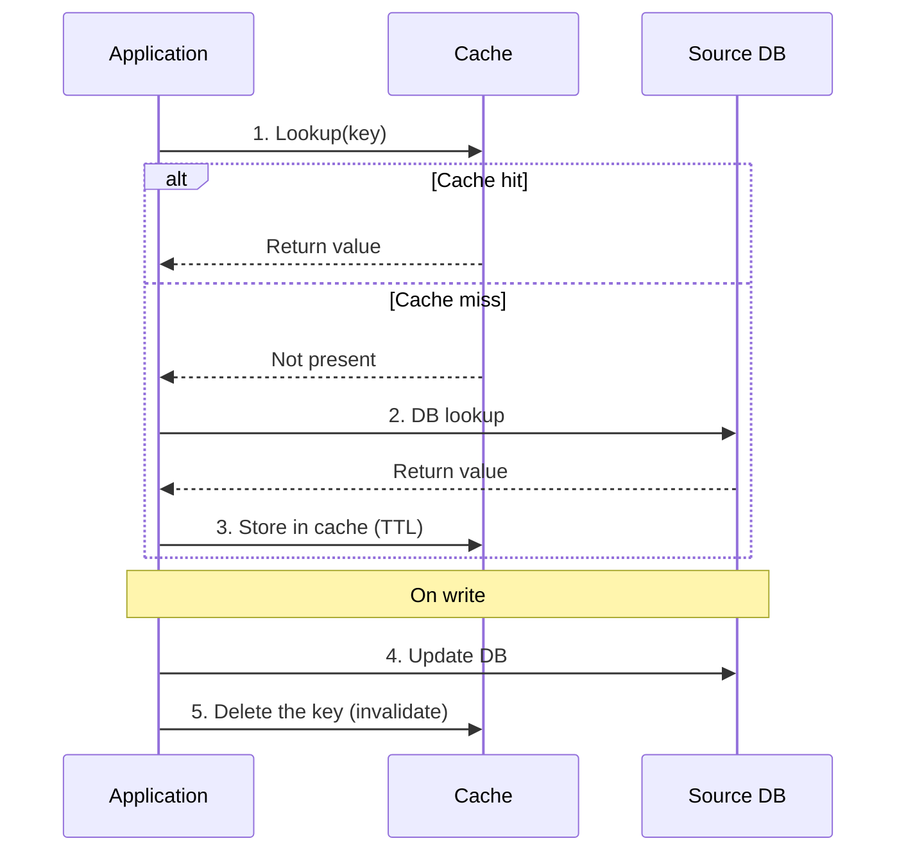
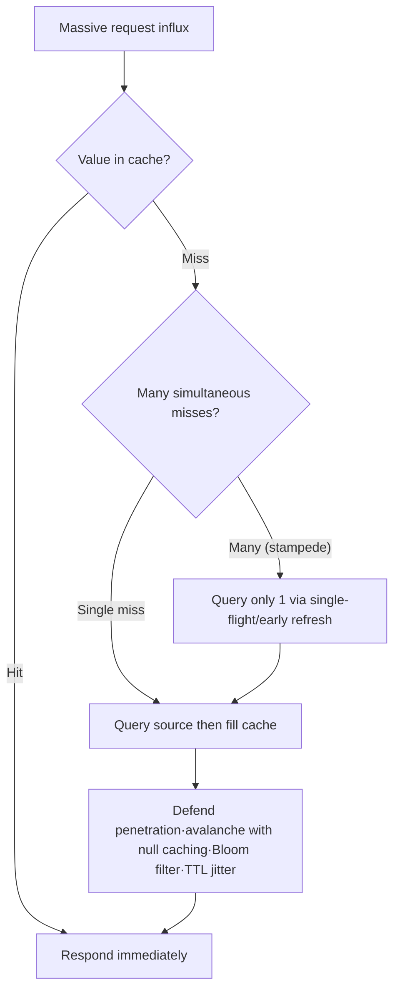

# Caching Strategy and Distributed Cache Design

## 1. Overview

> **Definition:** A cache is a performance·scalability technique that keeps a copy of data from a relatively slow and costly store (disk·remote DB·external API) in a fast-access tier (memory·SSD·edge node), so that identical or similar requests avoid accessing the source, reducing latency and load. A caching strategy is the set of design principles that decide when·how to fill this copy (read/write path), how long to keep it (TTL·eviction), and how to keep it consistent with the source (invalidation).

Behind the cache's rise as a core design element of information systems lie three structural pressures. First, the deepening performance gap among storage tiers. CPU cache access is on the order of nanoseconds, while DRAM is tens of nanoseconds, SSD is tens of microseconds, and a remote DB lookup across the network reaches several milliseconds. The thousandfold gap between tiers expanded the principle of locality — "keep frequently used data nearby" — across the entire system. Second, the pervasiveness of read-heavy workloads. Most web·mobile services have a read-to-write ratio of tens of times or more, showing a power-law distribution in which a small number of popular items account for the majority of traffic. Here, caching just the top few items can absorb most of the source load. Third, the cloud billing structure. In an environment where DB lookups·function calls·external APIs are all billed by usage, one cache hit is directly a cost saving, and from a FinOps perspective, the cache is both a performance tool and a means of cost reduction.

However, a cache is essentially a technique that gains performance in exchange for allowing "a stale copy of the source data." Therefore, the difficulty of cache design lies not in raising speed but in deciding **to what extent consistency·integrity will be sacrificed**. As Phil Karlton's famous aphorism goes, "There are only two hard things in computer science: cache invalidation and naming things," and this is because a cache forces a trade-off among data freshness, consistency, and availability. From an engineer's perspective, a caching strategy should be treated not as mere performance tuning but as an architectural decision that quantitatively reflects a service's consistency requirements·fault tolerance·cost goals.

This article covers, in order, the cache's tier structure and data-access patterns (read/write paths), eviction and invalidation strategies, distributed cache design and representative failure scenarios (stampede·penetration·avalanche), and finally the latest trends and considerations from an engineer's perspective.

## 2. Cache Tier Structure and Composition

A cache is not a particular product but a "pattern" that exists across all tiers of a system. Copies are placed at multiple points on the path from the client to the source store, and each tier differs in latency·capacity·sharing scope·invalidation difficulty. The structure diagram below shows the representative cache tiers a request passes through before reaching the source.

Sweeping the tiers from the source toward the user is as follows. The **DB internal cache** (buffer pool·plan cache) is the innermost cache automatically managed by the DBMS; it is hard for developers to control directly, but one can raise its hit rate through index·query tuning. The **distributed cache** is a separate cache server (Redis·Memcached) shared by multiple application instances; it is the core tier that externalizes state to keep the application stateless and enable horizontal scaling. The **application local cache** (in-process, e.g., Caffeine·Guava) is placed inside the process heap to eliminate even the network round trip, but since each instance has a different copy, consistency management is tricky. The **API gateway·CDN·browser cache** places responses closer to the user the farther they are from the source, dramatically reducing latency, but by that much the invalidation reach is broad and control is hard.

The core insight here is the trade-off that **the farther from the source (the closer to the user), the greater the performance gain, but the harder the invalidation**. Data cached in the browser cannot be forcibly cleared by the server, so it must rely on TTL expiration or versioned URLs (cache busting), whereas a distributed-cache item can be immediately deleted by the server. Therefore, the principle is to place frequently changing, consistency-critical data in the inner tiers and nearly immutable static assets in the outer tiers. For example, static assets like images·CSS·JS are placed in the CDN with a 1-year TTL by embedding a hash in the filename (safe because the filename changes when the content changes), while consistency-critical data like a user's account balance is handled with a short-TTL distributed cache or by bypassing the cache.

Organizing the characteristics per tier yields the following. However, this table is only an aid to selection; actual design must combine tiers by considering together the data's change frequency·consistency requirements·sharing scope.

| Tier | Representative technology | Latency (relative) | Sharing scope | Invalidation difficulty |
|---|---|---|---|---|
| Browser | HTTP Cache-Control/ETag | 0 (no round trip) | Individual user | Very high (TTL-dependent) |
| CDN/edge | CloudFront·Cloudflare | Several ms | Global users | High (purge API) |
| Distributed cache | Redis·Memcached | Sub-ms~several ms | All instances | Low (immediate deletion) |
| Local (In-Process) | Caffeine·Ehcache | Tens of ns | Single instance | Medium (propagation needed) |
| DB internal | Buffer pool·plan cache | Automatic | DB node | Automatically managed |

## 3. Data-Access Patterns — Read·Write Path Strategies

The essence of a caching strategy lies in "how to fill on read and how to synchronize with the source on write." Let us examine this by dividing it into the read path and the write path. The sequence below expresses the read·write flow of the most widely used Cache-Aside (Lazy Loading) pattern.

### 3.1 Read Path: Cache-Aside vs Read-Through

**Cache-Aside (Lazy Loading)** is an approach in which the application directly controls the cache. On lookup, it first checks the cache, and on a miss reads from the DB, fills the cache, and then returns. Since only actually requested data is loaded into the cache, memory efficiency is good, and it has the advantage that even on cache failure the service continues by bypassing to the DB. On the other hand, the first access to each piece of data is necessarily a miss, causing latency (cold start), and the cache-filling logic tends to scatter throughout the application code. Most web services adopt this approach as the default, and in practice "caching" usually means this pattern.

**Read-Through** is an approach in which the cache tier, upon detecting a miss, reads data from the source and fills it by itself. Since the application always requests only from the cache, the data-access logic is encapsulated in the cache library and the code is simple. However, since the cache product must know how to access the source, coupling increases and a custom loader implementation is needed. Conceptually similar to Cache-Aside, but it differs in that the responsible party for filling is the cache, not the application.

The fundamental difference between the two approaches is **the location of the filling responsibility**, and this in turn determines behavior on failure. Cache-Aside survives even if the cache dies because the application calls the DB directly, but in Read-Through the cache tier itself sits on the data path, so a cache failure can directly become a service failure. Therefore, systems where availability is the top priority often combine Cache-Aside with a circuit breaker.

Elements to also consider in read-path design are **the deserialization cost and the cache-key design**. Since a distributed cache stores values as byte strings, the cost of serializing·deserializing objects into JSON·Protobuf, etc., arises, and if the value is very large, this cost can offset the savings from avoiding the DB lookup. Also, since a cache key must uniquely identify the lookup condition, one must set a namespace rule that combines domain·identifier·schema version, like `product:{id}:v3`, so it is easy to wholesale invalidate old cache (by bumping the version) on a schema change. Neglecting key design causes cache collisions where results of different conditions overwrite the same key.

### 3.2 Write Path: Write-Through·Write-Back·Write-Around

Write strategies are divided by the timing and order of updating the source and cache. **Write-Through** updates the cache and the DB simultaneously (synchronously) on write. The cache is always up to date, so consistency is high, but every write passes through both stores, increasing write latency, and it can fill the cache even with data that will never be read, wasting memory. **Write-Back (Write-Behind)** writes only to the cache first and defers·batches the DB reflection asynchronously. Write performance and throughput are maximized, but if the cache is lost before DB reflection, data is lost, posing a large consistency·durability risk. It is unsuitable for data that cannot tolerate loss, such as a financial ledger, and suitable for data where slight loss is acceptable, such as view-count·like counters. **Write-Around** writes only to the DB and does not touch the cache, so the next read naturally fills it via a miss. It is favorable for preventing cache pollution for data that is written once and rarely read.

The most common combination in practice is **Cache-Aside read + deleting the cache on write (invalidation)**. It matters that this approach "does not overwrite the cache with the new value on update but deletes it," in order to reduce the error of re-seeding a stale value in the race between update and re-lookup. However, even this combination can create inconsistency if another request reads the old value and refills the cache between "update DB → delete cache," so one designs the deletion order (delete first then update DB, or delayed double deletion) or a TTL backstop together. As a measured example, applying Cache-Aside with a 60-second TTL to a lookup API — where among 10,000 product lookups per second the top 5% popular products account for 80% of traffic — commonly achieves a cache hit rate of 90% or more and lowers DB load to 1/10.

## 4. Eviction and Invalidation

Since cache capacity is finite, when it fills up some items must be chosen and pushed out (eviction), and when the source changes, stale copies must be removed (invalidation). These two are often confused but differ in purpose. **Eviction is capacity management to resolve a lack of space**, and **invalidation is freshness management to keep consistency**.

The representative eviction policy is **LRU (Least Recently Used)**, which pushes out the item referenced least recently. It fits the temporal-locality assumption that recently written data will soon be written again, so it is most widely used. **LFU (Least Frequently Used)** evicts items with low reference frequency to protect consistently popular items, but it has the problem that an item once popular but now cold remains for a long time, so aging (time decay) is applied together. **FIFO** is simple to implement but does not reflect locality, so its hit rate is low. The latest caches (e.g., Caffeine's W-TinyLFU) combine the recency of LRU and the frequency of LFU and approximate frequency with a probabilistic counter (Count-Min Sketch), yielding a high hit rate with little memory.

Invalidation has three approaches. First, **TTL expiration** places a validity period per item to auto-expire it — the simplest, most robust approach — guaranteeing that even in the worst case, data is stale by at most the TTL. Second, **explicit invalidation** immediately deletes·updates the relevant key on a source update, giving high freshness, but one must accurately track what to delete (key dependencies), and cascading invalidation becomes complex. Third, **event-based invalidation** captures DB changes via CDC (Change Data Capture) and publishes cache-invalidation messages; it can maintain consistency even when the application does not know all write paths, so it is favored in microservice environments. For example, when a product price changes via multiple paths — admin console·batch·external integration — instead of putting cache-deletion code in each path, subscribing to the DB change log and invalidating in bulk can prevent omissions.

The difficulty of invalidation rises sharply the deeper the dependency relationships among data. Deleting a single key is simple, but when one source change affects multiple derived caches (aggregates·lists·search results), deciding which keys to delete itself becomes a complex problem. For example, if the inventory of one product changes, old values may remain not only in that product's detail but also in "the list of in-stock products," the per-category aggregate, and recommendation results. Such derived caches are hard to fully track with explicit deletion, so one uses a short TTL as a backstop or tag-based invalidation (assigning a common tag to related keys and deleting them in bulk by tag). Ultimately, an invalidation strategy is the work of finding a compromise, per data importance, between "perfect immediate consistency" and "manageable complexity."

Contrasting eviction and invalidation yields the following. Making this distinction clear lets one avoid confusing "a memory-shortage problem" with "an old-data-visible problem" and set the appropriate measures for each (capacity expansion·policy change vs TTL shortening·stronger invalidation).

| Category | Eviction | Invalidation |
|---|---|---|
| Purpose | Capacity management (secure space) | Freshness management (consistency) |
| Trigger condition | Cache is full | Source data changed |
| Representative technique | LRU·LFU·FIFO·W-TinyLFU | TTL·explicit deletion·CDC event |
| Consequence if inadequate | Lower hit rate·performance drop | Stale-data exposure·consistency incident |

## 5. Distributed Cache Design and Representative Failure Scenarios

A distributed cache spreads data across multiple nodes to go beyond a single node's capacity. Here, using **Consistent Hashing** can minimize the keys relocated when a node is added·removed, and virtual nodes distribute load evenly. However, the larger a distributed cache grows, the more it is exposed to its characteristic failure patterns.

**Cache Stampede (Thundering Herd)** is the phenomenon where, the moment a popular key's cache expires, numerous requests simultaneously experience a miss and rush to the DB all at once, paralyzing the source. Countermeasures include a **mutex/single-flight** that locks so that only one request queries the source on a miss, **probabilistic early expiration** that refreshes in the background before expiration, and **stale-while-revalidate** that briefly serves the expired value while refreshing behind the scenes.

**Cache Penetration** is an attack·error pattern that repeatedly queries a nonexistent key (always a miss because it is in neither cache nor DB), continually hammering the DB. One responds by caching "not present (null)" with a short TTL, or by pre-filtering nonexistent keys with a **Bloom Filter**. **Cache Avalanche** is the phenomenon where many keys expire simultaneously or cache nodes go down entirely, momentarily concentrating load on the source; one adds random **jitter** to TTLs to spread out expirations, and cushions it with cache redundancy·circuit breakers·request throttling.

The common principle of such failure responses is to **place the source behind the cache and isolate it (bulkhead) from request surges**. That is, the cache is not only a performance tool but a shock absorber that protects the source, and one must also design whether the source can withstand it when the cache is absent or breached, to achieve true resilience. If one under-provisions the DB on the grounds that a cache was attached, one falls into the double risk that the source collapses immediately on cache failure.

The consistency of a distributed cache itself is also a design target. Replicating cache nodes raises availability but values can differ among nodes during replication lag, and placing a local cache in each application instance can make the same key have different values per instance. To mitigate this, one uses a multi-tier cache (near-cache) pattern that assigns a very short TTL to the local cache and broadcasts invalidation events to all instances via a Pub/Sub channel on change. Ultimately, a distributed cache carries exactly the balance problem among consistency-availability-latency that the CAP·PACELC theorems describe, and which axis to prioritize varies with the nature of the data.

## 6. Advanced — Latest Trends and Practical Application

Recent cache technology is evolving in several directions. First, **the cache becoming a state store**. Redis has expanded beyond a simple key-value cache into a data-structure server·stream·Pub/Sub·vector search, handling quasi-persistent state such as sessions·leaderboards·rate limiting, and the boundary between cache and data store is blurring. Second, **the combination of edge caching and serverless**. As Edge Functions running at the CDN edge cache even personalized responses, the dichotomy of static/dynamic content is breaking down. On the HTTP-standard side too, the `stale-while-revalidate` and `stale-if-error` directives are widely supported, standardizing resilience patterns that respond immediately with expired cache and refresh in the background, or hold out with the stale value on source failure. Third, the rise of **semantic caching**. In generative-AI·RAG systems, to reduce costly LLM calls, a technique of embedding the query and returning from the cache the response to a semantically similar past query is spreading. This approach, which regards it as a hit if within a similarity threshold even when the strings do not match exactly, shows a paradigm shift in which the cache key expands from "exact match" to "semantic proximity."

Fourth, **the automation·intelligence of the cache tier**. Techniques that learn access patterns to dynamically adjust TTLs, or that predict data soon to be requested and fill it in advance (prefetch), are being experimented with, showing a direction that goes beyond the limits of static rule-based caching and adapts to workload changes.

As a practical case, a large-scale commerce platform caches product details in multiple tiers. It long-caches static images·descriptions in the CDN, places price·inventory in a short-TTL Redis but immediately invalidates inventory changes via CDC, and handles personalized recommendations with a per-user local cache. With this structure, cases have been reported of suppressing source-DB lookups to normal levels even during a large sale (traffic surge). Conversely, incidents where neglecting invalidation design causes a price change not to be reflected in the cache for several minutes, exposing a wrong price to customers, are also common, showing that consistency-risk management must accompany the benefits of adopting a cache.

## 7. Considerations and Implications

- **Quantifying consistency requirements and tier placement:** Define per data "how stale is acceptable" (e.g., inventory 5 seconds, product description 1 hour, terms of service 1 day), and differentiate the tiers by, for example, handling consistency-critical data by bypassing the cache or with a short TTL, and long-caching weakly-consistent data in outer tiers. Caching all data with the same policy is not optimal for either performance or consistency.

- **The performance-consistency trade-off, and observation:** Constantly monitor (observability) the cache hit rate·miss rate·eviction rate·average latency to adjust TTL and capacity based on data. A low hit rate has the counterproductive effect of the cache merely consuming memory, and an excessively long TTL leads to consistency incidents. It is desirable to experiment with TTLs via A/B and decide based on the hit-rate–freshness curve.

- **Source protection from a resilience perspective:** Since the cache is a shock absorber that protects the source from surges, one must design together the response to stampede·penetration·avalanche (single-flight·Bloom filter·TTL jitter) and the source's survivability on cache failure (capacity headroom·circuit breaker·load limiting). Under-designing the source on the premise that a cache exists escalates a cache failure into a full outage.

- **Related technologies and architectural evolution:** A caching strategy is closely connected to CDN·consistent hashing·CDC·circuit breakers·API gateways·vector DBs. In particular, in microservices, consistency propagation of per-service local caches, and in generative AI, cost·latency reduction via semantic caching, are emerging as new design challenges, so a perspective is required that manages the cache in an integrated way at the level of enterprise-wide architecture·FinOps·data governance rather than as individual optimizations.

## References

- AWS Well-Architected / Caching Best Practices — https://aws.amazon.com/caching/best-practices/
- MDN Web Docs, HTTP Caching (Cache-Control, stale-while-revalidate) — https://developer.mozilla.org/en-US/docs/Web/HTTP/Caching
- Redis Documentation, Caching patterns — https://redis.io/docs/latest/develop/use/patterns/
- RFC 5861, HTTP Cache-Control Extensions for Stale Content — https://www.rfc-editor.org/rfc/rfc5861

---

> **In one line**: A caching strategy is a technique that keeps a copy of the source's slow data in a fast tier to improve performance·cost; one must design read·write paths such as Cache-Aside·Write-Through/Back and LRU eviction·TTL/event invalidation according to each data's consistency requirements, and prepare even for distributed failures such as stampede·penetration·avalanche, to complete a resilient architecture that protects the source.
