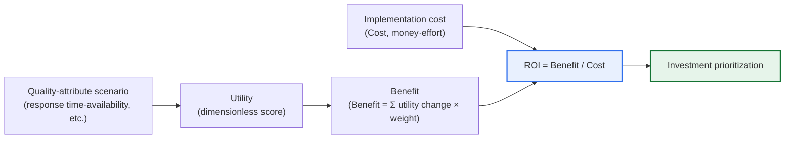
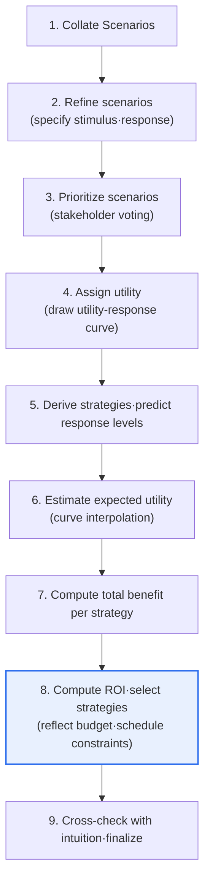

# CBAM (Cost Benefit Analysis Method)

## 1. Overview

### A. Definition
> The **CBAM (Cost Benefit Analysis Method)** is an **economics-based architecture evaluation method** that quantifies together the **benefit produced by a quality-improvement strategy (architectural decision) of a software architecture and the cost it takes**, helping to prioritize the adoption of architectural decisions with a high return on investment (ROI). It was established by the SEI (Software Engineering Institute) at Carnegie Mellon University in the U.S. by extending ATAM to an economic perspective.

The fundamental background of CBAM's emergence is the shift in recognition that "**an architectural decision is an investment decision**." Architectural strategies such as caching·indexing to raise performance, redundancy·clustering to raise availability, and multiple defense layers to raise security all entail implementation cost, and the extent of the quality improvement gained in return differs among them. The problem is that budget and schedule are always finite. Since one cannot satisfy every quality requirement at the highest level, an architect must inevitably choose "**which strategy to invest in first, and how much**." Yet ATAM, the representative existing architecture-evaluation technique, has strengths in identifying trade-offs among quality attributes (e.g., raising availability lowers performance) and risks·sensitivity points, but it does not address the **economic justification** of "how much value do we get for how much spent?"

CBAM was devised precisely to fill this gap. It quantifies the utility that each architectural strategy gives to stakeholders, reflects each stakeholder's importance (weight) to compute the strategy's total benefit, and then contrasts this with implementation cost to **prioritize strategies with a high ROI (benefit ÷ cost) first**. That is, CBAM's aim is not a "technically elegant" architecture but an "economically wise" architectural decision, and its essential value lies in converting architecture-investment judgment that relied on intuition into numeric-based grounds that stakeholders can agree on.

### B. Background and Necessity
As software grew in scale and situations where quality requirements (performance·availability·security·scalability·modifiability, etc.) conflict became routine, the resource-allocation problem of "where to spend the limited development budget first" emerged as a core decision of architecture design. Here, the difficulties an architect faces are three. First, the "value" of a quality improvement is invisible and hard to justify. When adopting a cache reduces response time from 2 seconds to 0.5 second, it is hard to explicitly answer how much that value is. Second, there is no common unit to compare different qualities (performance vs security) on the same yardstick. Third, each stakeholder values a different quality (the operations team values availability, marketing values response speed), making agreement difficult.

CBAM eases these three difficulties simultaneously by introducing the dimensionless measure of **utility** (e.g., a 0~100 score) to convert heterogeneous qualities to a single criterion, explicitly integrating differences in perspective through stakeholder voting·weights, and finally contrasting with cost in monetary units to produce the single ranking criterion of ROI. In sum, the reason CBAM is needed can be summarized as "to decide, in a way stakeholders can accept, the order of quality investments that creates the greatest value from a limited budget."

## 2. Core Concepts — Utility·Benefit·Cost·ROI

To properly understand CBAM, one must first grasp the relationships among four core concepts. These are the backbone that runs through all of CBAM's calculations.

**First, utility** expresses the value that a particular response level of some quality attribute (e.g., response time 0.5 second) gives to a stakeholder as a dimensionless score such as 0~100. The reason for introducing the dimensionless measure of utility is to place quality attributes with different physical units — like response time in seconds and availability in percent — on the same yardstick for comparison.

The originality of CBAM lies in expressing this utility as a **utility-response curve**. For example, in a very fast response-time band (0.1 second), utility converges to nearly 100, and once it passes a certain point and slows down (3 seconds or more), utility drops sharply toward 0. The important thing is that this curve is usually not a straight line but a nonlinear S-shape. That is, making it faster in a band that is already fast enough has almost no perceived value (the curve is flat), and improvement near the critical band that users cannot tolerate raises perceived value the most (the curve is steep). Since the slope of this curve represents "how much perceived value grows when quality is slightly improved in that band," it gives the insight that investing in a band where the curve is steep is far more beneficial than investing where the curve is flat. This is the basis on which CBAM aims not at "unconditional maximum performance" but at "improvement up to the point where value surges."

**Second, benefit** is the value obtained by multiplying the utility change (utility after improvement − current utility) occurring in all scenarios related to an architectural strategy by each scenario's stakeholder weight and summing them. That is, one strategy can simultaneously affect multiple quality scenarios (e.g., adopting a load balancer contributes to both availability and performance), and benefit aggregates all of these ripple effects. Here, the principle is to reflect a **side effect** in which a strategy worsens another quality as a negative (−) utility change, computing the net benefit.

**Third, cost** is the estimate of the development effort·license·infrastructure cost of implementing·operating that strategy. As a principle, it includes not only the initial construction cost but also maintenance·operation cost, and even the complexity-management cost that additionally arises from adopting that strategy. Estimating cost narrowly as only the initial construction cost underestimates the true cost of strategies with a heavy operational burden, such as redundancy·microservices.

**Fourth, ROI (Return on Investment)** is benefit divided by cost, meaning "the value created per unit cost." CBAM recommends adopting strategies with a high ROI in order, up to the limit that the budget·schedule constraints allow. By doing so, strategies that "create great value with little money" naturally rise to the top of the priority ranking. However, one must note that the ROI ranking is not an absolute rule but a starting point for decision-making, to be finally adjusted by also considering qualitative factors such as inter-strategy dependencies (B is possible only if A is done) and risk avoidance.

## 3. Evaluation Procedure (9 Steps)

CBAM follows the standard procedure defined by the SEI, proceeding roughly in the flow of "scenario·utility preparation → per-strategy benefit·cost estimation → ROI-based selection." In practice, it is subdivided into the following 9 steps, performed in a workshop format with stakeholders participating together.

**Steps 1~3 (scenario preparation)** express quality requirements such as performance·availability·security as concrete scenarios in the form of "stimulus–environment–response," refine them, and then, through stakeholder voting, narrow them to top scenarios (usually about one-third of the total). Since this prioritization determines the focus of all subsequent calculations, it is important to ensure that scenarios directly tied to the organization's business goals rise to the top. This step is effectively identical to ATAM's scenario derivation, so it is reused when linking the two techniques.

**Step 4 (assigning utility)** is the heart of CBAM. For each top scenario, one sets the four response levels of "worst–current–desired–best" and assigns a utility score to each to draw a utility-response curve. For example, for a response-time scenario, one sets worst (4 seconds)=0 points, current (2 seconds)=50 points, desired (1 second)=80 points, best (0.3 second)=100 points, and so on. Since this curve reflects stakeholders' perceived value, subjectivity is involved, but one builds agreement by averaging·adjusting multiple stakeholders' values.

**Steps 5~7 (benefit estimation)** derive candidate architectural strategies to improve each scenario, predict to what level (e.g., 2 seconds → 1 second) the response will improve if the strategy is applied, and then read the expected utility by interpolation from the utility-response curve. The difference obtained by subtracting the current utility from the post-improvement utility is that strategy's utility gain; multiplying this by the scenario weight and summing over all scenarios the strategy affects yields the strategy's total benefit.

**Steps 8~9 (selection·verification)** divide each strategy's total benefit by its implementation cost to compute ROI, sort in descending order, and select from the top strategies within the budget·schedule constraints. Finally, one cross-checks whether the derived priorities do not greatly diverge from experts' intuition, correcting errors in the curve·cost estimates and finalizing the results.

### Calculation Example
It is easy to understand with concrete numbers. Suppose the "adopt cache" strategy raises the utility of the response-time scenario (weight 0.4) from 50→80 (+30) and, as a side effect, lowers the utility of the consistency scenario (weight 0.2) from 70→60 (−10); then the net benefit is (30×0.4)+(−10×0.2)=12−2=10. If this strategy's implementation cost is 2 (units), then ROI=10÷2=5.0. Meanwhile, if the "server redundancy" strategy produces a total benefit of 12 but costs 6, then ROI=2.0. Of the two strategies, the absolute value of the benefit is larger for redundancy, but the value per unit cost is superior for the cache, so CBAM guides one to adopt the cache first when the budget is tight. Making one judge by "benefit relative to cost" rather than "large effect" is CBAM's core contribution.

For reference, organizing the representative architectural strategies commonly cited as candidates in step 5 and the quality attributes they mainly target yields the following. In an actual project, one places such a strategy catalog before oneself and estimates each one's benefit·cost to compare ROI.

- **Caching·indexing**: improves performance (response time), side effects on consistency·memory cost
- **Load balancing·clustering**: improves availability·performance simultaneously, side effect of operational complexity
- **Redundancy·disaster recovery (DR)**: improves availability·reliability, high infrastructure cost
- **Layer separation·modularization**: improves modifiability·testability, increased initial design effort
- **Multiple defense layers·encryption**: improves security, performance-degradation side effect

## 4. Relationship with and Comparison to ATAM

CBAM demonstrates its greatest power when paired with ATAM rather than used independently. If ATAM diagnoses the **technical validity** of "does this architecture satisfy the quality requirements, and where are the risks·trade-offs?", CBAM, on top of that, judges the **economic validity** of "among the identified improvement strategies, which should be invested in first for the greatest benefit?" In practice, the standard is a sequential linkage that first derives risks·sensitivity points·trade-offs with ATAM and takes the resulting improvement candidates as CBAM's architectural-strategy input. Because the two techniques share the same scenario·quality-attribute vocabulary, this linkage is natural.

| Category | ATAM | CBAM |
|---|---|---|
| **Core question** | Does the architecture satisfy the quality requirements? | Which improvement should be invested in for benefit? |
| **Focus** | Identify quality-attribute trade-offs·risks | Benefit relative to cost (economics) |
| **Output** | Risks·sensitivity points·trade-off points·non-risks | Per-strategy ROI·investment priorities |
| **Core tool** | Quality-attribute utility tree, scenarios | Utility-response curve, ROI |
| **Perspective** | Technical quality evaluation | Economic decision-making |
| **Relationship** | Starting point of evaluation | ATAM's economic extension·follow-on step |

The point to note in this table is that the two techniques are not in a competitive relationship but a complementary one. Performing only ATAM tells one "what the problems are" but gives no answer to "what to fix first with a limited budget," so improvement can drift. Conversely, performing only CBAM leaves the technical basis for which strategy responds to which quality risk weak in the first place. Therefore, from an engineer's perspective, it is desirable to design the two techniques as a continuous process of "diagnosis (ATAM)–treatment prioritization (CBAM)."

## 5. Advanced — Practical Application Cases and Expected Exam Directions

Looking at **the reality of practical application**, CBAM is used as a conceptual framework in the architecture-improvement investment review of large-scale mission-critical systems (financial core banking, telecom billing, aviation·defense systems). For example, suppose a financial institution allocating a budget for modernizing an aging core system, where three investment options compete: response-time improvement (cache·read-only replicas), availability improvement (disaster-recovery redundancy), and securing scalability (microservice transition). If one converts each option's benefit into business metrics such as customer churn rate·transaction throughput·failure-loss cost, a grounded ranking emerges, such as "availability redundancy costs a lot but greatly reduces expected annual failure loss, so its ROI is high." However, it should also be understood that, in practice, one often applies a lightened version of CBAM's thinking framework (decomposing into utility·benefit·cost·ROI for comparison) rather than precisely drawing utility-response curves.

Regarding **the latest trends**, as cloud transition has become common, the cost of architectural strategies has moved from CapEx (fixed investment) to OpEx (usage-based operating cost), and the increase of "pay-as-you-go" structures like autoscaling·serverless affects CBAM's cost modeling. Also, the latest operations methodologies such as FinOps (cloud cost·value optimization) and SLO·error-budget-based reliability management touch CBAM's problem awareness in that they "treat qualities like availability·performance as quantitative goals and costs," so they can be seen as targets for modern reinterpretation·linkage.

As **expected exam directions**, the representative types are ① explain CBAM's procedure and core concepts (utility-response curve, ROI), ② compare ATAM and CBAM and discuss ways to link and use them, and ③ compute ROI in a particular scenario (with cost·benefit figures given) to decide investment priorities. When writing an answer, one gains advanced points by not stopping at listing concepts but describing trade-offs such as "why judge by ROI rather than the absolute value of benefit" and "how to mitigate the subjectivity of utility quantification."

## 6. Considerations and Implications (Engineer's Perspective)

1. **The subjectivity of benefit quantification is the biggest challenge.** Converting the value of availability·performance improvement into a utility score·money is essentially subjective, and results change depending on who draws the curve. Therefore, one must broadly involve stakeholders to derive the curve and weights by agreement, and accompany the process with a sensitivity analysis that verifies whether the results are not sensitive to extreme values, to secure reliability.

2. **One must strike a balance through linkage with ATAM.** Using CBAM alone risks putting economics first and missing technical risks. It is desirable to adopt a sequential process that first identifies risks·trade-offs with ATAM and then evaluates the economics of improvement strategies with CBAM, so as to make architectural decisions that are justified both technically and economically.

3. **Side effects (negative benefit) must always be reflected.** One strategy often raises one quality while lowering another (cache↔consistency, redundancy↔complexity·cost). Not including side effects in the net-benefit calculation overestimates a particular strategy's attractiveness. Explicitly quantifying trade-offs makes CBAM a substantive decision tool rather than a formalistic calculation.

4. **One should aim for a lightened·iterative application.** A full 9-step CBAM has a high cost of workshops·expert participation, so it is hard to apply as-is to every project. It is realistic to start with a light CBAM that applies only the thinking framework to a few core scenarios early on, and to iterate it whenever the architecture evolves — an agile·incremental application that updates priorities.

5. **One must manage the uncertainty of cost estimation.** If the cost estimate, the denominator of ROI, is inaccurate, the entire ranking wobbles. In particular, since new-technology-adoption strategies have large cost-estimation error, it is safer to set optimistic·pessimistic ranges instead of a single estimate and compare per-scenario ROI.

6. **One must not exclude strategies that are hard to quantify.** Since CBAM works favorably for strategies whose benefit can be converted to numbers, there is a risk that strategies that are hard to express numerically but absolutely necessary — such as security hardening or regulatory compliance — get pushed down the priority list. It is desirable to complement this by classifying such strategies separately as "must-have" constraints, excluding them from the ROI competition and securing them first, and then applying CBAM to the remaining optional strategies. That is, CBAM should be positioned not as a tool that replaces all decisions but as a tool that rationalizes priorities among selectable alternatives.

## References
- SEI, "Making Architecture Design Decisions: An Economic Approach" (CMU/SEI Technical Report) — https://resources.sei.cmu.edu/
- L. Bass, P. Clements, R. Kazman, "Software Architecture in Practice" (CBAM/ATAM chapter)

---

> **In one line**: CBAM is an economics-evaluation method that *quantifies the benefit (utility-response curve × weight) and cost of architecture-improvement strategies and prioritizes investment based on ROI*; as an economic extension of ATAM, it supports the rational allocation of a limited budget using net benefit that reflects even side effects, with the key challenge being management of the subjectivity of benefit quantification.
