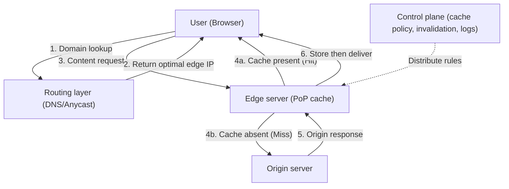
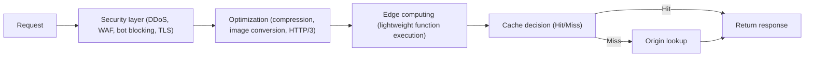

# Content Delivery Network (CDN)

## 1. Overview

### A. Definition

> A **CDN (Content Delivery Network)** is a distributed caching and delivery infrastructure that replicates web content (static files, streaming, dynamic responses) in advance to geographically distributed **edge server (Edge/PoP)** caches and directs users to the network-nearest edge, thereby **lowering latency and distributing the load on the origin server (Origin)**.

Since Akamai commercialized it in 1998, the CDN has become foundational infrastructure that mediates the overwhelming majority of today's web traffic. It places content copies at hundreds to thousands of **PoPs (Points of Presence)** scattered around the world and routes user requests to the optimal edge. Its core value lies in the simple principle of "bringing content closer to users," which simultaneously improves response speed, availability, and scalability.

### B. Background and Necessity

The fundamental reason a CDN is needed lies in **the limits of physics and origin concentration**. When a user in Seoul connects to a single server in Virginia, USA, the round-trip time (RTT) alone exceeds 200ms, and once the TCP 3-way handshake and TLS negotiation are added, the time to first byte (TTFB) severely degrades the user's perceived experience. Because distance itself sets a lower bound on latency due to the physical limit of the speed of light, there is no fundamental solution other than **distributing servers closer to users**.

Moreover, during large-scale events (online ticketing, live commerce, software distribution), when traffic surges momentarily, a single origin server collapses under bandwidth and connection limits. For example, if millions of people simultaneously download a game update of several hundred GB, the origin becomes a bottleneck, but a CDN handles this by **sharing the load across numerous edges**. In fact, Netflix uses its own CDN (Open Connect) to absorb a significant portion of global internet traffic during peak evening hours, a scale that a single data center could never handle. Thus, the four requirements of **minimizing latency, distributing load, securing availability, and reducing cost** define the necessity of a CDN.

## 2. Overall Architecture and Request Processing Flow

A CDN is broadly composed of the **origin server (Origin)**, the **edge servers (Edge/PoP)** that serve as regional gateways, the **routing layer (DNS/Anycast)** that directs requests to the optimal edge, and the **control plane** that governs cache rules and invalidation. When a user requests content, the routing layer first determines the responsible edge by considering the user's location, edge load, and network conditions; that edge then either responds immediately (Hit) if it holds the cache, or fetches it from the origin (Miss) and stores a copy while responding.

In this flow, the metric that governs performance is the **cache hit ratio**. The higher the hit ratio, the fewer round trips to the origin, so both latency and origin load decrease together. Static resources (images, CSS, JS, video segments) do not change, so their hit ratio is easily pushed above 90%, but personalized dynamic responses are hard to cache and require a separate strategy.

There are two main routing approaches. **DNS-based routing** has the CDN's DNS look at the user's resolver location and respond with a nearby edge IP; it is flexible but is affected by DNS TTL and resolver-location inaccuracy. **Anycast routing** has multiple edges advertise the same IP, and BGP routing steers packets to the nearest edge; upon failure the path automatically re-converges, which is also advantageous for absorbing DDoS attacks. In practice, the two approaches are combined to secure both accuracy and resilience.

## 3. Caching Strategy and Handling by Content Type

The core of caching is **what to cache, for how long, and how to refresh it**. The cache target and its lifetime are controlled with HTTP headers. `Cache-Control: max-age` sets the freshness period, and `ETag`/`Last-Modified` enable a lightweight check of only whether something has changed via conditional requests (304 Not Modified). Because cache difficulty varies greatly by content characteristic, a different strategy must be applied per type.

| Content type | Cache difficulty | Representative strategy |
|---|---|---|
| Static assets (images, JS, CSS) | Low | Long max-age + filename hash (cache busting) |
| Large media (VOD, downloads) | Low | Segment splitting, partial-request (Range) caching |
| Live streaming | Medium | Short TTL, HLS/DASH segment caching |
| Dynamic/personalized responses | High | ESI, microcaching, edge computing |

Static assets use **cache busting, which embeds a content hash in the filename**, to keep an effectively permanent cache (e.g., `max-age=31536000`) while ensuring that when the content changes the filename changes, so a new file is naturally fetched. Dynamic responses, by contrast, are hard to cache because they must go through origin logic, but a short second-level TTL through **microcaching** can absorb a burst of identical requests, or **ESI (Edge Side Includes)**, which caches only page fragments, can separate the static and dynamic parts.

When content is updated, cache **invalidation** is important. If immediate reflection is needed, use a **Purge** that invalidates specific URLs or tags; to fill the cache in advance before exposure to users and prevent a Miss for the first user, use **Cache Warming (Prefetch)**. If invalidation is delayed or omitted, users see stale content, so integrating purge and warming into the deployment pipeline (CI/CD) is the standard practice.

## 4. Additional Features — Security, Optimization, Edge Computing

Modern CDNs have evolved beyond simple caching into **integrated delivery platforms**. First, as a **security layer**, they exploit the structure in which the edge sits between the user and the origin to perform **DDoS defense** (distributing and absorbing mass traffic across many edges), **WAF** (blocking L7 attacks such as SQL injection and XSS), **bot management**, and **TLS termination**. They also greatly reduce the direct attack surface by hiding the origin IP. Second, through **delivery optimization**, they reduce actual transfer volume and the number of round trips via image format conversion (WebP/AVIF), compression (Brotli/Gzip), HTTP/2 and HTTP/3 (QUIC) support, and connection reuse.

Third, the most notable evolution is **edge computing**. By running lightweight functions at the edge (e.g., Cloudflare Workers, AWS Lambda@Edge), logic such as A/B test branching, authentication token verification, personalization header injection, and API response assembly is **handled near the user without going all the way to the origin**. This makes it possible to serve even dynamic content with low latency, so the CDN is expanding from static-cache infrastructure into a **distributed application execution platform**.

## 5. Type Comparison — Pull vs. Push, Commercial vs. Self-Built

The way content is loaded into a CDN is divided into **Pull and Push**. A Pull CDN uses a **lazy loading** approach that pulls content from the origin on the first request and caches it; it is simple to operate and efficient because it does not cache unused content, but the first user experiences the Miss latency. A Push CDN uploads content to edges in advance; it suits large-scale, predictable distribution (software releases, event assets) but carries the burden of storage and synchronization management. Most services use a hybrid strategy of **Pull by default, pre-warming only critical assets**.

| Category | Pull CDN | Push CDN |
|---|---|---|
| Cache timing | On first request (after Miss) | Pre-uploaded |
| Operational burden | Low | High (synchronization management) |
| First-request latency | Present | None |
| Suitable cases | General web, hard-to-predict traffic | Large distribution, events |

There is also a choice between **using a commercial CDN and self-building (private CDN)**. Most enterprises use commercial services such as Akamai, Cloudflare, and AWS CloudFront to instantly secure global coverage and security features. Netflix, on the other hand, being an operator with extremely large and clearly characterized traffic, places its own cache servers (Open Connect Appliances) inside ISPs to **directly control cost and quality**. Traffic scale, global requirements, security needs, and cost structure serve as the criteria for this choice.

## 6. Considerations and Implications

Adopting a CDN is an **architectural decision** intertwining performance, cost, security, and operations, so from a professional engineer's perspective the following must be considered comprehensively.

- **Application strategy — designing cache policy based on content characteristics**: Differentiate TTL and invalidation policies for static, dynamic, and personalized content, and continuously monitor the cache hit ratio as a key KPI. Indiscriminate full caching leads to exposure of stale data, while excessive no-cache leads to loss of the CDN's benefit.
- **Trade-offs — freshness vs. performance, cost vs. coverage**: Increasing TTL improves performance and cost but reduces content freshness, and the reverse is also true. Commercial CDNs charge by traffic volume (egress), so the cache hit ratio directly equals cost, and multi-CDN increases resilience but raises management complexity and cost.
- **Security — origin protection and trust boundaries**: Hide the origin IP, block direct attacks that bypass the edge with mutual TLS and whitelisting between origin and edge, and layer WAF, bot management, and DDoS defense. When adopting edge computing, also review the supply chain and permission management of the code running at the edge.
- **Availability — multi-CDN and failure isolation**: Because a single CDN provider's failure has repeatedly led to a full service outage, prepare a multi-CDN configuration, real-time performance-based traffic steering, and a failover path directly to the origin.
- **Outlook — edge-native and intelligent delivery**: CDNs are evolving toward ultra-low-latency edge computing combined with 5G and IoT, AI-based predictive caching and traffic optimization, and serverless edge execution. Application architecture is expected to shift from an origin-centric model to **distributed edge-origin execution**, with the CDN as its execution foundation.

---

> **In one line**: A CDN is infrastructure that replicates content to geographically distributed edge caches and directs users to the optimal edge to lower latency and distribute origin load, and today it is evolving into a distributed delivery platform encompassing security, optimization, and edge computing.
