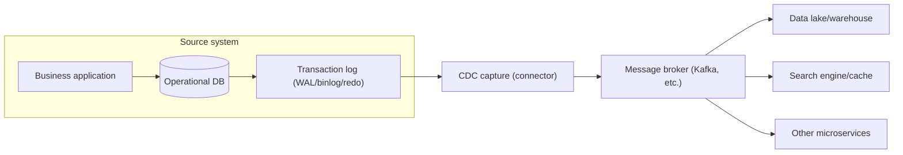
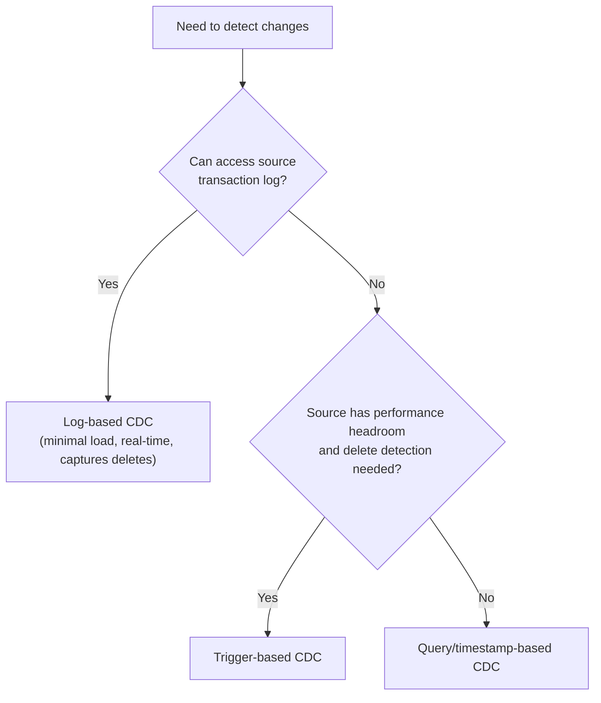

# Change Data Capture (CDC)

## 1. Overview

### A. Definition

> **Change Data Capture (CDC)** is a data integration technique that detects and extracts insert/update/delete (INSERT/UPDATE/DELETE) change events occurring in a source database in **near real-time** and propagates them to downstream systems (data warehouses, lakes, search engines, caches, microservices).

The core idea of CDC is to "send only what changed (delta) instead of periodically re-reading the entire data (full reload)." By reusing the traces of change that the source already leaves behind — typically transaction logs (WAL, redo log, binlog) — one can accurately capture the fact of change in order without modifying the source application code. For this reason, CDC has become the de facto standard means for real-time analytics, data synchronization between microservices, and ingestion into data lakehouses today.

### B. Background and Necessity

Traditional data integration was done via nightly batch. Extracting the entire source table every early morning and reloading it into the DW is simple to implement but has three fundamental limitations. First, the data becomes stale by up to a full day, so it cannot support real-time decision-making. Second, reading a table of hundreds of millions of rows in full each time imposes a large load on the source DB and causes batch time to explode. Third, the full-reload approach leaves only a snapshot at that point in time, thereby losing the **change history** of "when, what, and how something changed."

Along with digital transformation, users, regulations, and businesses have increasingly demanded lower latency. Fraud detection systems (FDS) must reflect the latest transactions on a second-by-second basis, recommendation and search engines must index product information changes immediately, and microservices must be aware of changes to data owned by other services. In these cases, repeatedly polling the source increases both load and latency. CDC mitigates the three problems of **latency, load, and history loss** simultaneously by pushing "only the delta, the moment a change occurs."

Moreover, the spread of microservice architecture (MSA) has further heightened the necessity of CDC. In a structure where each service independently owns its DB, it is common for multiple services to need to know about a single source change; if the application performs the DB write and the message publish separately, a **dual-write** problem (partial failure where only one succeeds) arises. Because CDC publishes changes based on the single fact of the DB commit, it becomes the foundation (transactional outbox pattern) that structurally resolves this consistency problem.

## 2. Overall CDC Architecture and Data Flow

A CDC pipeline broadly consists of four stages: **Source → Capture → Transport → Sink**. When the capture stage extracts change events via the transaction log or triggers, they are reliably delivered to a message broker (e.g., Kafka), and downstream connectors apply them to the destination. Each change event usually includes the before image, the after image, the operation type, a timestamp, and the log position (offset).

In this structure, the most important design point is **how much the capture stage intervenes in the source**. Reading the log imposes almost no load on the source DB and is completely decoupled from the application, but it depends on each DB's log format, permissions, and configuration. Trigger- or timestamp-column approaches, by contrast, are less sensitive to DB type but intervene in the source schema and write path, increasing load and coupling. This trade-off becomes the key criterion for choosing a CDC method.

Another essential concept is the **initial snapshot**. Because CDC only captures "changes from now on," if the downstream has no historical data, one must first read the entire source once to build a baseline state, then append log changes from that point onward. Since the source continues to change even during the snapshot, consistency handling — accurately recording the log position at the snapshot point and replaying only changes after that — is important.

## 3. Types of CDC Implementation

Methods for implementing CDC are broadly divided into three, depending on where and how changes are detected. Each method shows a clear difference in source load, real-timeliness, delete-detection capability, and degree of source intervention, and these differences directly determine its suitability.

**First, log-based CDC** parses the transaction log that the DB already records for recovery and replication. Its targets are PostgreSQL's WAL (logical replication slot), MySQL's binlog (row format), and Oracle's redo log. Because it does not directly query the source tables, it imposes the lowest load, preserves commit order exactly, and captures deletes and intermediate changes without omission. However, it depends on the log format and permission settings and has high implementation difficulty, so it is generally implemented with a dedicated framework such as Debezium. It is the de facto standard method for CDC in practice.

**Second, trigger-based CDC** attaches AFTER INSERT/UPDATE/DELETE triggers to the source tables and records change details in a separate history table (shadow table). It works regardless of DB type and can precisely record before-and-after values, but a trigger execution is added to every write transaction, degrading source performance and increasing the burden of schema management.

**Third, query/timestamp-based CDC** maintains a column such as `last_modified` and periodically polls with SELECT for "rows changed since the last query." It is the simplest to implement, but latency occurs equal to the polling interval, physically deleted rows are not returned so **delete detection is impossible** (requiring a soft-delete column), and the polling itself imposes load on the source.

The differences among the three methods are summarized as follows. The table is an aid to comparison; the actual choice must consider together the degree of source intervention and operational constraints described above.

| Category | Log-based | Trigger-based | Query/timestamp-based |
|------|-----------|-------------|----------------------|
| Source load | Very low | High (runs on every write) | Medium (periodic polling) |
| Real-timeliness | High (within seconds) | High | Low (depends on polling interval) |
| Delete detection | Possible | Possible | Not possible (needs soft delete) |
| Source intervention | None (non-intrusive) | Large (schema, triggers) | Medium (column addition) |
| Implementation difficulty | High | Medium | Low |

## 4. Core Technical Elements and Consistency Guarantees

To make CDC a trustworthy pipeline, one must design for **accuracy (processing close to exactly-once)** beyond merely capturing changes. The most important element is **offset management**. The capture connector continuously stores how far it has read the log, so that after a failure it resumes reading from that point on restart, preventing loss. Conversely, since the same event may be published again during reprocessing, the downstream must absorb duplicates with a primary-key-based **idempotent upsert**. That is, CDC typically achieves the effect of exactly-once through the combination of "at-least-once delivery + idempotent application."

**Ordering** is also core. Changes to the same key (row) must be applied strictly in the order they occurred; otherwise, an error occurs where an old value overwrites a new one. When using Kafka, the primary key is designated as the partition key so that events for the same key maintain order within the same partition.

Handling **schema evolution** is likewise a challenge in practice. When a column is added to or removed from the source, the event structure changes, so a schema registry is used to manage versions, and backward-compatibility rules (compatible evolution) are applied so that the downstream does not break.

In particular, in MSA, CDC combines with the **Transactional Outbox** pattern to resolve the dual-write problem. When the application writes both the business data and the event to be published to an outbox table in the same DB within **a single local transaction**, CDC captures the log change of that outbox table and publishes it as a message. Because the DB commit is the very basis for event publication, the partial failure of "the DB was saved but the message was lost" fundamentally disappears.

## 5. Use Cases and Comparison with Similar Techniques

**Use cases.** In practice, CDC first supports real-time dashboards and analytics by streaming operational DB changes into a data lakehouse (e.g., reflecting order and inventory changes in e-commerce into the analytics tier within seconds). Second, search engine and cache synchronization — when product information changes, the Elasticsearch index and Redis cache are immediately refreshed. Third, zero-downtime data migration — after moving the initial snapshot to the new system, CDC keeps appending the delta to keep both systems in sync, then performs a switchover at the cutover point. In one global tech company's case, replacing nightly batch with log-based CDC reportedly reduced data latency from hours to seconds and greatly lowered source DB load (figures may vary by environment).

**Comparison with similar and related techniques.** It is easy to confuse CDC with ETL as a whole, but it is more accurate to view CDC as a technique that **makes the Extract stage of ETL/ELT real-time**. If batch ETL is "periodic, full, high-latency," then a CDC-based pipeline is "continuous, incremental, low-latency." CDC must also be distinguished from **event sourcing**. Event sourcing is an architecture in which the application designs and stores state changes as events from the outset, whereas CDC extracts changes after the fact from an existing state-based DB. The fact that the destination is state also differs.

| Perspective | Batch ETL | Query polling | Log-based CDC |
|------|----------|-----------|----------------|
| Latency | Hours–days | Minutes | Seconds |
| Source load | High (full scan) | Medium | Very low |
| History preservation | Snapshot only | Limited | All changes |
| Real-time integration | Unsuitable | Partial | Suitable |

## 6. Considerations and Implications

CDC is a core element of real-time data architecture, but its adoption requires strategic judgment from a professional engineer's perspective.

- **Trade-off between consistency and latency**: CDC generally presumes eventual consistency. Because there is a slight delay (replication lag) until the downstream catches up with the source, it is unsuitable for tasks requiring strong consistency (e.g., double-checking balances). Define the required consistency level of the task first, then determine the scope of CDC application.
- **Source protection and the non-intrusion principle**: The operational DB is the top protection priority. Prioritize the non-intrusive log-based approach, but proactively manage source-side operational risks — such as disk growth from unconsumed log slots and replication slot management — with monitoring and alerting.
- **Operational complexity and organizational capability**: CDC has many components (broker, connector, schema registry, offset store), so self-building carries a large operational burden. Weigh the TCO and lock-in of managed services (cloud CDC/streaming) against open-source self-building, and standardize failure-reprocessing and backfill procedures.
- **Governance, security, and regulatory compliance**: Since change events may contain personal data, apply encryption, masking, and access control across the entire pipeline, and design so that delete events are reliably propagated to the downstream (lake, cache) to satisfy the obligation to destroy personal data (the right to be forgotten).
- **Outlook**: CDC is expanding as the standard ingress path for data mesh, lakehouses, and real-time feature stores, and combined with stream processing, it is evolving into a "batch-less real-time data platform." Going forward, the direction of contracting and sharing the change stream itself via CDC as a data product is expected to strengthen.

---

> **In one line**: CDC is a technique that extracts only the delta in real time from the source DB's transaction log and propagates it downstream, reducing latency, load, and history loss, with the log-based (non-intrusive) approach and idempotent upsert, ordering guarantees, and the outbox pattern as the keys to its reliability.
