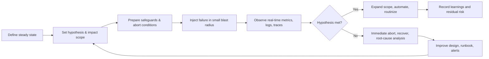
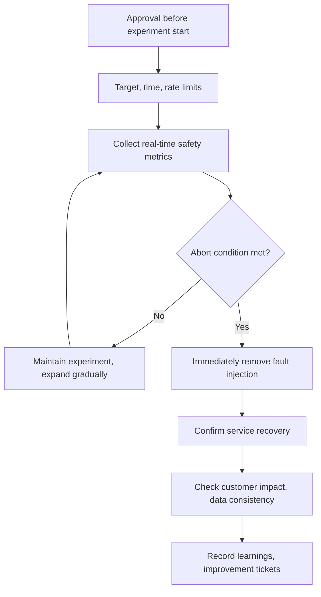

# Fault Tolerance Verification Based on Chaos Engineering

## 1. Overview

### A. Definition

> **Chaos Engineering** is an experiment-based operational technique that first defines a steady state as a hypothesis, then injects failures, delays, resource exhaustion, and dependency disruptions through controlled experiments to verify and improve the fault tolerance and recovery capability of distributed systems.

The purpose of chaos engineering is not the act of causing failures itself.
Its essence is to reproduce uncertain faults that can occur in production within a small scope and limited risk, and to learn under what conditions and how the system breaks down and recovers.
Therefore, the description "randomly turning off servers" is not sufficient.
Before an experiment, one must set the criteria for the steady state and customer impact; during the experiment, one must monitor the abort conditions; and after the experiment, one must connect the observations to design improvements and automated regression verification.

Modern services are composed not of a single server but of a distributed structure connecting containers, orchestrators, databases, message brokers, external APIs, CDN, DNS, and authentication systems.
Even if each component is individually healthy, the entire user journey can fail due to interactions such as network delays, retry surges, leader-election delays, and certificate expiry.
It is difficult to sufficiently verify such temporal and distributed phenomena through document review or unit tests alone.
A chaos experiment verifies, on the actual execution path, "when a component fails, what observable signals the whole service exhibits and what safeguards activate."

### B. Background and Necessity

First, there is a gap between the availability target and the actual recovery capability.
Even if the design document states there is redundancy, if failover is manual, the secondary region's data is stale, or the operator cannot find the runbook, the target recovery time cannot be achieved.
Chaos experiments verify whether design assumptions have been implemented as executable controls and procedures.

Second, failures expand through chain reactions rather than single causes.
A response delay in one node induces timeouts and retries, the retries exhaust the connection pool and thread pool, and ultimately even normal requests fail.
Because it is difficult to discover this amplification path through the success tests of individual components alone, service-level experiments are needed.

Third, because cloud and automated environments change resources quickly, past manual inspections alone cannot guarantee the current operational state.
Every time the deployment pipeline, autoscaler, service mesh, or policy engine changes, the failure-response path can also change.
Running small experiments continuously helps find design regressions early and confirm that recovery automation actually works.

Fourth, chaos engineering requires an operational culture that prioritizes learning over blame.
If experiment results are interpreted solely as an operator's mistake, failures get hidden and the same structural defects recur.
Only when observed weaknesses are decomposed into improvement tasks for the system, process, permissions, documentation, and training does the experiment lead to reliability improvement.

### C. Expected Effects and Scope of Application

The direct effect of chaos experiments is verifying failure scenarios and recovery procedures.
Indirectly, they improve observability quality, understanding of inter-service dependencies, the reliability of automated mitigations, and a shared language across teams.
For example, assuming a database primary failure, one can verify in a single pass whether the application's connection retry, read failover, alerting, operator approval, and data-consistency checks work in sequence.

The scope is not limited to infrastructure failures.
It can include network packet loss, disk usage growth, CPU/memory pressure, authentication failures, external payment API delays, message duplication, misconfigured deployments, region isolation, and even personal-data masking errors.
However, in areas where the experiment's risk exceeds its actual learning value, or where there is no way to reverse the scope of impact, one should start with prior verification and a smaller isolated environment.

## 2. Core Concepts and Experiment Principles

### A. Steady State and Hypothesis

The steady state is not simply whether a server is alive but the observable behavior of the service that users expect.
For a payment API, the success response rate, approval latency, number of duplicate approvals, and number of unprocessed orders can together constitute the steady state.
For a search service, not only the result-return rate and p95 latency but also result-quality degradation and indexing delay become important signals.

The hypothesis is written verifiably, like "even if component X is disturbed, metric Z of user journey Y stays within an acceptable range, and automatic mitigation A activates within T minutes."
"The system will be stable" is not an experiment hypothesis because it lacks a measurement method and decision criterion.
The hypothesis must include the target scope, expected impact, observed metrics, time limit, abort conditions, success/failure determination, and follow-up actions.

For example, one can write "even if one payment worker is stopped, the payment success rate stays at or above 99.5% for 5 minutes, and queue buildup returns to baseline within 10 minutes."
Written this way, even if the experiment fails, one can distinguish what broke.
Also, because it includes business metrics, it does not miss situations where actual order loss occurred even though the technical error rate looked low.

### B. Small Blast Radius and Gradual Expansion

The blast radius is the range of users, resources, and transactions that can be affected by the experiment.
Early experiments must limit the scope to dev/staging environments, test tenants, a single availability zone, or a small number of pods.
If the filters the experiment tool provides are not accurate, or rollback is slow, set the target even smaller and add a manual approval step.

A small blast radius is not a sufficient condition for making an experiment safe.
Because impact can propagate to layers above the fault-injection target, the dependency graph and user-impact assessment must be reviewed together.
For example, even if delay is injected into only one internal test account, it can affect other customers if it exhausts a shared connection pool or common cache.
Therefore, tenant isolation, rate limiting, resource budgets, and an observe-only mode are needed.

Gradual expansion increases the experiment's reliability.
If recovery automation and dashboards work in the first stage, increase the number of target nodes or the magnitude of delay bit by bit.
Place stabilization time between each stage, and check the error-budget burn rate and user reports.
Do not immediately scale to the maximum just because an experiment succeeded; re-run the same experiment after operational changes have accumulated.

### C. Experiment Lifecycle

The first stage is baseline collection.
One must capture the traffic, error rate, latency, queue length, resource utilization, and key business KPIs just before the experiment to compare before and after fault injection.
Without a baseline, it is hard to determine whether changes during the experiment are natural variation or the impact of the failure.

The second stage is preparing permissions and controls.
Predetermine the experiment executor, approver, on-call responder, emergency contact list, abort command, and recovery procedure.
Configure the experiment tool with target-selection conditions and an expiry time, and confirm that it automatically restores to the original state.
An approach that leaves permanent configuration changes on a running system is closer to a manual failure that is more dangerous than a chaos experiment.

The third stage is observation and determination.
Do not look only at metrics; also check log error types, bottleneck sections in distributed traces, customer-support inquiries, and the consistency of business data.
In particular, since averages can hide tail latency and failures for some customers, monitor p95/p99, the proportion of failed users, and key transaction success rates in parallel.

The fourth stage is institutionalizing learning.
Do not end merely by recording the experiment results in a report; connect them to defect tickets, runbook fixes, alert tuning, recovery automation, and architectural improvements.
Schedule a re-experiment to confirm the defect is resolved, and perform regression experiments when deploying or changing configuration.

### D. Types of Fault Injection

Fault injection is classified by target layer and failure mode.
Compute resource exhaustion reproduces CPU/memory/disk/file-descriptor shortages, and network faults reproduce delay, loss, duplication, disconnection, and bandwidth limits.
At the application layer, one can experiment with error responses, exceptions, thread exhaustion, misconfiguration, and slow responses from external APIs.

Experiments at the data layer require particular caution.
Read-replica lag or connection failures are relatively easy to control, but data deletion, random alteration, and transaction corruption require first proving recoverability and regulatory impact.
Applying destructive experiments to operational data before backup and restore verification is complete carries more risk than learning.

People and processes can also be failure modes.
Simulating an on-call responder's absence, wrong permissions, outdated runbook commands, alert storms, and approval delays can reveal the gap between technical recovery capability and organizational response capability.
Such GameDays verify communication flows similar to a real failure, but the psychological safety of participants and a no-blame-after-the-fact principle must be made clear.

| Type | Injection example | Key signals to check | Representative mitigation |
|---|---|---|---|
| Process/node | Pod termination, instance stop | Reschedule time, error rate, capacity headroom | Redundancy, auto-recovery, capacity buffer |
| Network | Delay, packet loss, DNS failure | p99 latency, retry rate, timeouts | Timeout, backoff, circuit breaker |
| Resource | CPU/memory/disk pressure | Saturation, OOM, queue buildup | Limits/isolation, autoscaling, backpressure |
| Dependency | External API errors/delays | Fallback rate, user journey success rate | Fallback, cache, isolation, provider diversification |
| Data | Replication lag, storage read failure | Consistency, loss/duplication, recovery time | Backup, checkpoint, reprocessing |
| Organization/process | On-call absence, runbook error | Detection/approval/recovery lead time | Training, separation of duties, runbook automation |

The items in the table should be interpreted not as an independent list but as chained paths.
A single network delay can successively create timeouts, retries, connection-pool exhaustion, and queue buildup.
Therefore, the experiment designer should inject one failure while including in the hypothesis what secondary and tertiary signals will appear.

## 3. Architecture and Operational Design

### A. Safeguards and Abort Conditions

The safeguards of a chaos experiment are divided into "mechanisms that let the experiment start" and "mechanisms that stop the experiment."
The former select only approved targets and limit the executor's permissions, while the latter automatically remove the fault injection when customer impact exceeds a threshold.
Only when both types exist can one reduce the risk of the experimenter interpreting the situation optimistically and delaying the abort.

Abort conditions use both technical metrics and business metrics.
For example, one can set as abort conditions a key API error rate exceeding 1% for 5 consecutive minutes, an increase in failed payment amounts, a data-consistency verification failure, a spike in the error-budget burn rate, or an increase in the number of customer-impacted tenants.
Set thresholds considering normal variation and alert fatigue, and validate them with automated alerts before the experiment.

Permission design is also important.
Limit target labels, accounts, regions, and time ranges so that the experimenter does not hold the permission to stop all of production.
Place dual approval on critical services, but ensure automatic abort works even without approval.
Preserve permissions and logs in an auditable way so that who ran what injection over what scope and when can be reconstructed.

### B. Observability and the Determination Model

Observability is not an accessory feature of chaos engineering but the measurement instrument of the experiment.
Metrics connect service-level outcomes with resource-level causes, logs provide the meaning of errors and the processing path, and traces show the path along which delay propagates through distributed calls.
If the three signals use different time bases, root-cause analysis becomes difficult, so a common correlation ID and time synchronization are needed.

Observed metrics can be organized into at least four layers.
The first is customer metrics: success rate, latency, drop-off rate, and order-completion rate.
The second is service metrics: request rate, error rate, saturation, and queue length; the third is resource metrics: CPU, memory, network, and storage.
The fourth is recovery metrics: mean time to detect (MTTD), mitigation time, mean time to recover (MTTR), and recurrence rate.
Looking only at customer metrics makes it hard to find the cause, and looking only at resource metrics can lead to judging harmless noise as a failure.

Determination is quantified by comparison with the pre-experiment baseline.
For example, one can take the median of p95 latency over the 30 minutes before the experiment as the baseline, and judge a failure if it exceeds 2x for 3 minutes during the experiment.
Using a single threshold alone is oversensitive to momentary spikes or misses gradual degradation, so consider duration, rate of change, and the number of affected users together.

### C. Recovery Patterns in Distributed Systems

The timeout is the basic mechanism for preventing failure propagation, but if too long it holds users and threads for a long time, and if too short it treats normal transient delays as failures.
Allocate the total budget of the call chain to sub-calls, and limit the retry count and total time.
Retries use exponential backoff and jitter to spread out concurrent re-requests, and rather than retrying on every error, they distinguish transient from permanent errors.

The circuit breaker briefly blocks calls to a dependency with accumulated failures, protecting the caller.
In the open state it uses a fallback or cache, and in the half-open state it confirms recovery with a limited number of trial calls.
However, if the fallback data is stale or business-wise inaccurate, the system can be alive yet provide wrong results, so freshness and accuracy must also be included as metrics.

The bulkhead isolates resource pools so that one dependency's failure does not exhaust the entire service's threads, connections, and queues.
Backpressure limits input that arrives faster than processing capacity, and priority queues ensure key transactions are not pushed aside by non-critical work.
These patterns should be combined according to the failure-propagation path rather than introduced individually.

| Recovery pattern | Problem it solves | Side effects and cautions |
|---|---|---|
| Timeout | Infinite waiting and resource occupation | Too short treats normal delay as failure |
| Retry/backoff | Recovery from transient errors | Possible duplicate requests, traffic surge |
| Circuit breaker | Cascading calls to a failed dependency | Requires validating fallback quality and state transitions |
| Bulkhead | Shared-resource exhaustion | Requires pool sizing and priority policy |
| Backpressure | Input exceeding throughput | Must explain delay/rejection policy to users |
| Isolation/fallback | Maintain core function even in partial failure | Possible stale data and functional inconsistency |

### D. Experiment Automation and Deployment Integration

Leaving experiments as one-off manual tasks makes them depend on the responder's memory and environment.
Managing experiment definitions as code or declarative files and version-controlling the target, injection, time, abort conditions, and rollback enables code review and change-history review.
However, an automated experiment does not mean unattended execution; approval and execution timing must be separated according to risk level.

Low-risk verifications can be inserted into the deployment pipeline in stages.
Repeat network delays and pod terminations in staging, perform limited experiments in canary deployment, then expand to all of production.
Run new experiments first in observe-only mode to confirm that detection and abort signals are normal.

Experiment results can be linked to the error budget.
If an experiment exceeds the customer-impact threshold, halt change work and prioritize stabilization.
Conversely, if risk is controlled and recovery capability is proven, larger changes can be allowed.
Use the error budget not as a pardon for the experiment but as a risk limit for learning and a basis for decision-making.

## 4. Comparison and Cases

### A. Comparison of Traditional Failure Drills and Chaos Engineering

Traditional DR drills are strong at confirming the organization's failover and recovery procedures for large failure scenarios.
Chaos engineering, by contrast, is suited to repeatedly verifying everyday small faults and the system's automatic mitigation capability.
The former confirms broad-scope readiness such as regional failover and emergency contact systems, while the latter confirms design quality of individual services such as timeouts, retries, and isolation.

The two approaches are not substitutes.
Doing only DR drills can miss the paths by which everyday partial failures accumulate, and doing only small chaos experiments cannot verify the organization-wide command structure and long-term recovery capability.
Therefore, it is desirable to perform automated low-risk experiments routinely while combining GameDays and DR failover drills on a regular cycle.

| Category | Traditional failure drill | Chaos engineering |
|---|---|---|
| Main purpose | Confirm emergency procedures, failover, recovery readiness | Verify design hypotheses, fault tolerance, automatic mitigation |
| Execution cycle | Centered on planned large drills | Centered on small, repeated experiments |
| Target scope | Organization, region, core systems | Services, dependencies, resources, processes |
| Key deliverable | Recovery outcomes and per-role drill records | Hypothesis verdicts, defects, re-experiment tasks |
| Success condition | Achieving target RTO/RPO and contact system | Observe/recover within customer-impact limits |

### B. Case 1: Message Consumer Failure

Assume CPU pressure and network delay are injected into some instances of a consumer group processing order events.
The hypothesis is defined as "even if some consumers become unable to process, partition reassignment and autoscaling work, the order queue returns to baseline within 15 minutes, and no duplicate payments occur."

The experimenter starts with one test partition and a non-critical tenant.
The observation targets are consumer throughput, lag, reprocessing count, DLQ inflow, order-completion rate, and payment idempotency keys.
Simply checking whether the consumer process came back alive can miss the problem of lost or duplicated messages.

The experiment may reveal that lag increased but reassignment was slow, and that idempotency keys were missing during reprocessing.
In this case, the fix does not end with "add more consumers."
One must adjust partition placement and processing timeouts, include idempotency keys in business events, and automate reprocessing and DLQ-recovery runbooks.

### C. Case 2: External Payment API Delay

A situation where the external payment approval API does not respond for over 10 seconds is injected into limited test transactions.
If the payment service's timeout is 3 seconds, it can return a failure to the user, but the state model must be designed so that background reconciliation does not double-charge a late-approved transaction.

In the experiment, the timeout budgets and state transitions of the API gateway, payment service, order service, and notification service must be observed together.
If "approval failed" and "approval result undetermined" are treated as the same state, a dispute can arise where the customer saw a failure but money was actually withdrawn.
Therefore, it is important to keep the undetermined state separate and provide lookup, cancellation, and reconciliation procedures.

The success of this case does not lie merely in receiving a normal response after the payment API recovers.
Duplicate-request prevention, user guidance, re-reconciliation, audit logs, and customer-support lookups must all work consistently.
Chaos experiments differ from simple load tests in that they verify technical failures in connection with business processes.

### D. Case 3: Region Isolation and Read Failover

In a multi-region service, one can perform an experiment that restricts the primary region's network path and shifts read traffic to a secondary region.
Here, DNS propagation time, session state, data replication lag, write-acceptance policy, and the secondary region's capacity influence one another.
Merely succeeding at a DNS change cannot confirm whether user requests are processed with the correct data and permissions.

Before the experiment, agree on the RPO and RTO targets, whether to switch to read-only, handling of unreplicated data, and the re-synchronization procedure after recovery.
During the experiment, separately track journeys with state changes such as new logins, shopping carts, payments, and admin functions.
After recovery, verify the data counts and hashes of both regions, event ordering, and unprocessed work.

This experiment shows that infrastructure redundancy does not automatically guarantee business continuity.
The application must recognize the regional failure and apply a safe write policy, and must transparently inform customers of functional limitations.
The results are reflected in DR design, data replication strategy, traffic policy, and business priorities.

## 5. Deep Dive: Linking Chaos Engineering with SRE and MLOps

Chaos engineering becomes a means of verifying, through execution, SRE's availability targets and error budgets.
If the SLO is defined as "99.9% of key API requests succeed within 500ms," the experiment must confirm that this target holds even under delay, node loss, and dependency errors.
If an experiment consumed part of the error budget, adjust deployment velocity and experiment scope, and prioritize stabilization work when the budget is short.

Organizations with low observability maturity should improve their measurement system before experimenting.
If key user journeys, service dependencies, error classification, latency quantiles, and data-consistency metrics are undefined, experiment results cannot be judged.
Therefore, it is safe to first establish an observability baseline and runbooks, then confirm the detection/abort/recovery paths with low-risk experiments.

In MLOps too, one can experiment with failures of models and data pipelines.
Inject feature latency, data-distribution shifts, inference API delays, model-store disconnection, and wrong-version promotion into limited traffic, and confirm quality-degradation detection and automatic rollback.
Since model accuracy cannot be known immediately, manage latency, missing rate, distribution shift, and safety-filter pass rate as early metrics.

In service-mesh or cloud-native environments, one can finely isolate experiment targets using network policies and traffic splitting.
However, the abstraction the tools provide does not reproduce every aspect of a real failure.
Understand the differences in the experiment tool's injection points, the kernel/network layer, and the recovery method, and if necessary, separately design application-level errors and business-data verification.

In exam answers, it is more logical to explain in the order of steady state, hypothesis, blast radius, safeguards, fault injection, observed metrics, determination, and improvement, rather than writing only the definition.
At the end, avoid the misconception that it is a "technique for causing failures," and emphasize that it is a continuous learning system that verifies recoverability within customer-impact limits.

## 6. Considerations and Implications

### A. Business Impact and Safety First

The scope of a chaos experiment must be determined not only by technical importance but by customer, financial, and regulatory impact.
Payment, medical, and safety-related functions have a small acceptable impact even for the same failure, so start on test data and isolated paths.
In systems containing personal data and financial transactions, apply masking and access control so that sensitive data does not remain even in fault-injection logs and results.

### B. Reproducibility and Reversibility of Experiment Design

Experiments must be stoppable and restorable at any time.
Record the target identifiers, start/end times, injection intensity, recovery commands, versions, and observation dashboards so that other teams can reproduce them under the same conditions.
Relying solely on manual commands makes results vary due to typos and environmental differences, so use declarative configuration and automatic expiry.

### C. Simultaneous Verification of Observability and Data Consistency

A service returning a 200 response does not mean the business succeeded.
In state-changing systems such as orders, payments, inventory, and permissions, duplication, loss, reordering, and reconciliation mismatches must be verified separately.
Combine metrics, logs, and traces with business-data verification to distinguish technical recovery from business recovery.

### D. Organizational Culture and Responsible Learning

If experiment results are directly linked to a responder's evaluation or punishment, weaknesses go unreported.
Agree on a blameless post-review principle before the experiment, and prioritize improvements to structural controls, permissions, documentation, and automation over individual mistakes.
However, intentional rule violations and unapproved experiments must be controlled separately from the learning culture.

### E. Balancing Automation Level and Cost

Not every failure mode needs to be experimented on in continuous production.
Set experiment priorities based on customer impact, likelihood of occurrence, detection difficulty, and recovery cost; automate low-risk scenarios and run high-risk scenarios as periodic GameDays.
Evaluate experiment-infrastructure and monitoring costs as reliability investments, but confirm that results connect to improvement tickets and re-experiments.

### F. Regression Verification against Architecture and Supply-Chain Changes

When cloud regions, libraries, service-mesh policies, external APIs, and model versions change, the assumptions of existing experiments change.
Link key experiments as regression verification in the deployment pipeline, and keep the dependency list and owners up to date.
When adopting a new system, evaluate fault-injection feasibility, observability, recovery automation, and data-reconciliation methods as non-functional requirements.

## References

- Principles of Chaos Engineering: https://principlesofchaos.org/
- Google SRE Workbook, Embracing Risk: https://sre.google/workbook/embracing-risk/
- CNCF Chaos Engineering Landscape: https://landscape.cncf.io/guide#observability-and-analysis--chaos-engineering

---

> **In one line**: Chaos engineering is a method that verifies the recovery hypotheses of distributed systems through controlled failure experiments and continuously raises actual fault tolerance through observation, automation, and organizational learning.
