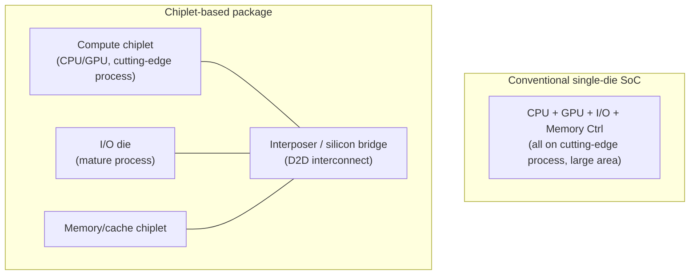
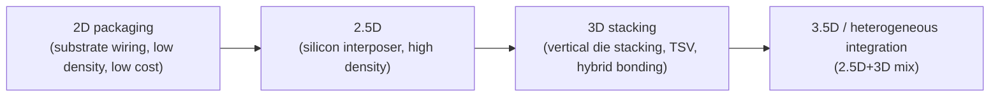

# Chiplet Architecture and Heterogeneous Integration

## 1. Overview

### A. Definition
> A **chiplet** is a semiconductor design and packaging approach in which, instead of building a chip from one enormous monolithic die, several small dies divided finely by function and process are **connected within a single package by high-speed interconnects (heterogeneous integration)** so that they operate as if they were one chip.

Traditional SoCs (System on Chip) have integrated all blocks — CPU, GPU, memory controller, I/O, etc. — **onto a single silicon die using a cutting-edge process**. However, as process nodes have reached 3nm and 2nm, this approach has hit physical and economic limits. Chiplets turn the problem of "making one large chip well" into the problem of "connecting several small chips well." That is, by fabricating compute cores on a cutting-edge process and blocks with little miniaturization benefit — such as I/O or analog — separately on a mature (cheap) process, then combining them in the package, the approach seeks to capture **performance, yield, cost, and design flexibility** simultaneously. AMD's EPYC/Ryzen, Intel's Meteor Lake, Apple's M1 Ultra, and NVIDIA's data-center GPUs are representative commercial cases.

### B. Background and Necessity
Three pressures overlap in the background of the chiplet's rise. The first is **the slowdown of Moore's Law and the surging cost of miniaturization processes**. The more advanced the node, the more fab investment and mask costs increase exponentially, making it economically irrational to place all blocks on a cutting-edge process. The second is the **yield problem**. The larger the die area, the higher the probability that a single defect on the wafer discards the whole die, so yield plummets. Splitting one large die into several small dies allows discarding only defective dies and selecting only good ones, so **effective yield rises substantially**. For example, if at the same defect density the yield of a single 800㎟ die is in the tens of percent, dividing it into four 200㎟ chiplets raises the individual yield much higher and improves the probability of assembling good units. The third is the **reticle limit** — an ultra-large chip exceeding the area a lithography tool can expose in one pass (about 858㎟) cannot be made as a single die in the first place, so combining multiple dies is unavoidable. As these pressures intertwine, chiplets have become not an option but the mainstream.

## 2. Architecture and Components

A chiplet-based system connects dies of different processes and functions with **high-speed wiring inside the package (interposer/bridge)** and makes them communicate through a **standard die-to-die (D2D) interface**. The structure diagram below shows the difference between a single-die SoC and a chiplet-based structure.

Let us examine each element from a principle-centered view. The **compute chiplet (Compute Die/CCD)** is the part where performance directly translates into miniaturization benefit, so it is fabricated on the most advanced process (e.g., 5nm, 3nm) to maximize transistor density and power efficiency. The **I/O die (IOD)** contains analog and interface blocks such as PCIe, memory controllers, and USB; because miniaturizing them yields little performance gain and only raises design difficulty, they are left on a **mature, low-cost process (e.g., 6nm, 12nm)** to lower cost. This "process split" is the crux of chiplet economics. The **interposer** is a substrate that carries the chiplets and interconnects them underneath with fine wiring; a silicon interposer (2.5D) provides ultra-high-density wiring through thousands to tens of thousands of microbumps.

### A. Interconnect Interface — the UCIe Standard
For chiplets to become a true ecosystem, one **must be able to mix chiplets from different companies in one package**, and a standard interface is essential for this. In the past, vendor-specific proprietary interconnects such as AMD's Infinity Fabric existed separately, making interoperability impossible. What standardized this is **UCIe (Universal Chiplet Interconnect Express)**, an open D2D standard involving Intel, AMD, ARM, TSMC, Samsung, and others. UCIe specifies the physical layer (bump pitch, electrical spec), protocol layer (PCIe/CXL mapping), and software stack, aiming for **plug-and-play of heterogeneous-vendor chiplets**. This is an attempt to combine chiplets by a standard spec within the package, much like plugging devices into PCIe on a board.

## 3. Integration (Packaging) Methods and Types

The way chiplets are physically joined is divided into several tiers according to wiring density and cost. The following shows the evolution of representative integration methods.

**The 2D method** places chiplets side by side on a substrate and joins them with substrate wiring; it is the simplest and cheapest but has low wiring density, so bandwidth is limited. **The 2.5D method** lays a **silicon interposer** beneath the chiplets and joins them with ultra-fine wiring; TSMC's **CoWoS (Chip on Wafer on Substrate)** is representative, and it is widely used in AI accelerators (such as NVIDIA H100/H200) that integrate HBM and GPU in one package. **3D stacking** stacks dies **vertically and connects them directly with TSVs (Through-Silicon Vias)** or **hybrid bonding**, drastically shortening wiring length to raise bandwidth and power efficiency. AMD's 3D V-Cache (stacking a cache die on top of a compute die) is a commercial case. Hybrid bonding directly joins copper-to-copper without bumps to achieve sub-micrometer pitch, emerging as a key technology for next-generation 3D integration.

| Method | Wiring density | Bandwidth | Cost | Representative technology/case |
|---|---|---|---|---|
| 2D | Low | Low | Low | Organic-substrate MCM |
| 2.5D | High | High | Medium–high | CoWoS, EMIB, HBM integration |
| 3D stacking | Very high | Very high | High | 3D V-Cache, TSV, hybrid bonding |

Intel's **EMIB (Embedded Multi-die Interconnect Bridge)** is a compromise that, instead of laying a large full interposer, embeds a small silicon bridge only where dies meet, achieving 2.5D-class high-density connection at lower cost — a representative approach to reducing the cost burden of the interposer method.

## 4. Comparison and Trade-offs

Chiplets are not a cure-all; there are clear gains and losses versus a single die. A single-die SoC has the strength that, with all blocks on one silicon, **inter-block communication latency is extremely short and there is no power overhead**. Chiplets, by contrast, incur **additional latency and power (the cost of driving bumps and wiring)** in D2D communication crossing die boundaries. That is, the chiplet's economic and yield benefits are traded for **the cost of interconnect overhead**. For this reason, small mobile chips extremely sensitive to latency still favor a single die, whereas in large-area, high-performance server/AI chips, the yield and cost benefits overwhelm the overhead, so chiplets have effectively become the standard.

Chiplets also raise **design and verification complexity**. The power, thermal, and signal integrity of multiple dies must be verified together at the package level, and if **known good dies (KGD)** cannot be pre-screened, a post-assembly defect discards the entire expensive package. Thermal management is also a challenge: in 3D stacking, the heat of the upper and lower dies overlaps, making local overheating likely, so heat-dissipation design is difficult. Thus, chiplets can be described as a design that finds the balance point between "the benefit gained by dividing blocks" and "the cost paid by reconnecting them."

## 5. Deep Dive — Industry Trends and Links to AI Semiconductors

Chiplets have become key infrastructure especially in **AI semiconductors and HBM integration**. NVIDIA's and AMD's data-center GPUs secure ultra-high bandwidth by integrating multiple HBM stacks around the compute die with 2.5D (CoWoS), a structure impossible without chiplets and heterogeneous integration. To the extent that TSMC's CoWoS production capacity is cited as a bottleneck in AI-accelerator supply, chiplet packaging has become a strategic asset of the semiconductor supply chain in the AI era. On the standards side, UCIe has been continuously revised since 1.0 (2022), raising bandwidth and bump density, and is expected to become the foundation for a future **multi-vendor chiplet marketplace** (composing custom chips by combining compute, memory, and I/O chiplets from different companies). Domestically as well, Samsung Electronics and SK hynix are making large-scale investments in HBM and advanced packaging (I-Cube, X-Cube, etc.), which is emerging as a key axis of memory-logic heterogeneous-integration competition. (Specific roadmaps and capacity figures may change depending on each company's announcements, so the latest disclosures should be checked.)

## 6. Considerations and Implications

From a professional engineer's perspective, adopting and evaluating chiplets requires comprehensive judgment of the following.

- **Application strategy (optimizing the process split)**: The principle is to separately place compute blocks with large miniaturization benefit on the cutting-edge process and I/O/analog with small benefit on a mature process. The key competency is designing the division boundary according to each block's cost-performance sensitivity, not chipletizing everything.
- **Standard/ecosystem dependency**: Proprietary interconnects are advantageous for performance optimization but create vendor lock-in. In the long term, adopting **open standards such as UCIe** is advantageous for supply-chain flexibility and multi-sourcing, so weigh the trade-off between standard maturity and the performance one's own needs require.
- **Yield-overhead break-even**: Die division improves yield and cost but entails D2D latency, power, and packaging costs, so break-even analysis based on **die area, target performance, and production scale** must precede. The larger the area and volume, the more chiplets are advantageous.
- **KGD, thermal, and verification management**: To prevent losses from post-assembly defects, establish a KGD screening-test system, and secure a design and test process that integrates thermal, power, and signal-integrity verification at the package level in 3D stacking.
- **Outlook (composable hardware)**: Chiplets are expected to expand as the hardware foundation of **composable infrastructure that composes systems by combining modules**, in conjunction with CXL-based memory disaggregation and heterogeneous-accelerator integration. One must strategically recognize that semiconductor design competency is shifting from "large-chip design" to "heterogeneous-chiplet integration and packaging design."

## References
- UCIe Consortium, "Universal Chiplet Interconnect Express (UCIe) Specification", https://www.uciexpress.org/
- TSMC, "3DFabric: Advanced Packaging Technology (CoWoS, SoIC)", https://3dfabric.tsmc.com/

---
> **In one line**: A chiplet is a design approach that, instead of one enormous single die, heterogeneously integrates small dies divided by function and process into a single package via standard D2D interconnects such as UCIe and 2.5D/3D packaging, overcoming miniaturization cost, yield, and reticle limits and forming the foundation for AI semiconductors and HBM integration.
