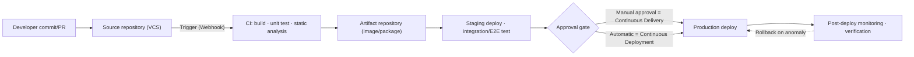
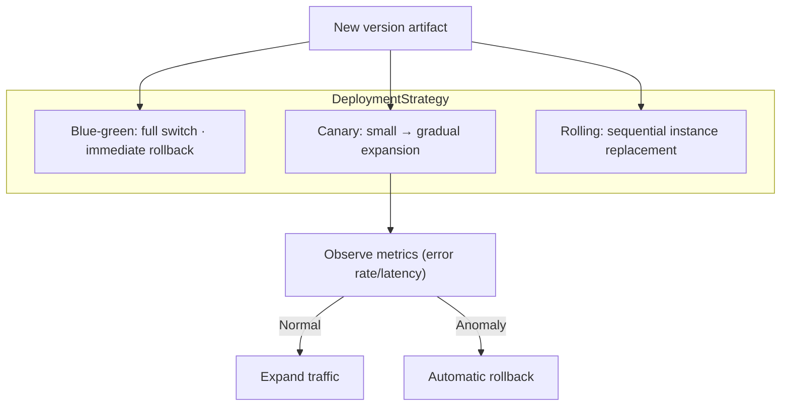

# CI/CD Pipeline (Continuous Integration / Continuous Deployment)

## 1. Overview

> A **CI/CD pipeline** is an engineering system that defines the series of software delivery processes — from the moment a source-code change is committed to the repository, through build, test, integration, release, and deployment — as a chain of automated stages, and executes it in a repeatable and observable way. CI (Continuous Integration) refers to the activity of "integrating code frequently and in small increments and verifying it immediately," while CD (Continuous Delivery/Deployment) refers to the activity of "reflecting verified artifacts into production at any time, or automatically."

The background of CI/CD's emergence can be found in the failure of traditional integration methods. In the past, developers worked independently for weeks or months and then merged their code all at once just before release. This approach gave rise to so-called **Integration Hell**. Long-diverged code conflicted, hidden defects erupted at the end of the release, and it was hard to pinpoint whose change caused the problem, so release schedules repeatedly collapsed entirely. It is a long-standing empirical rule of software engineering that the cost of fixing a defect grows exponentially the further it is from the point of introduction, and late integration exposed defects at precisely the worst point on this cost curve.

Another background is the pressure to shorten release cycles. In cloud, SaaS, and mobile environments, competitive advantage hinges on "how quickly, how often, and how safely" changes are delivered to users. Research by DORA (DevOps Research and Assessment) measures an organization's delivery performance by four metrics — deployment frequency, change lead time, change failure rate, and time to restore service (MTTR) — and high performers deploy multiple times a day while simultaneously having a lower failure rate. The core engine that makes this "simultaneous achievement of speed and stability" possible is precisely the automated CI/CD pipeline.

### A. The Core Problems and Value CI/CD Solves

The value of CI/CD is organized around three axes. The first is **early defect detection (fast feedback)**. Because a build and tests run automatically on every commit, feedback returns to the author within minutes right after a defect is introduced. Since it is fixed while the context is still in the developer's head, the cost of fixing is minimized. In fact, some organizations, after adopting CI, moved a substantial portion of defects previously found at the integration stage forward to commit time, greatly mitigating the pre-release defect surge.

The second is **repeatability and reproducibility**. If deployment depends on a person's manual checklist, the "works on my machine" problem persists due to skipped steps and environmental variance. The pipeline builds and deploys artifacts the same way every time with the same scripts and the same environment definitions (IaC, container images), eliminating human error and providing audit traceability.

The third is **release-risk distribution (small batch)**. Deploying large changes occasionally makes the blast radius large on failure and cause isolation hard. Deploying small changes frequently makes each deployment's risk small, makes it easy to narrow the cause to the immediately preceding change when a problem occurs, and makes rollback simple. This is a software implementation of the Lean principle that "small batches equal low risk."

The common characteristics running through these three values are **automation, standardization, and feedback**. Procedures that people used to repeat are automated with scripts, environments and artifacts are standardized to eliminate variance, and the result of each stage is immediately fed back upstream to guide the next action. When these three characteristics combine, the pipeline functions beyond a mere deployment-automation tool as a learning system that continuously improves the organization's software delivery capability.

## 2. Overall Structure of a CI/CD Pipeline

A pipeline is a structure in which, starting from the source repository (VCS), the stages of trigger, build, test, artifact storage, deployment, and verification are connected in a directed manner. Each stage takes the previous stage's output as input, decides pass or fail, and on failure halts the pipeline (fail-fast) to prevent defects from propagating downstream.

What stands out in this structure is the presence of **per-stage quality gates**. Each stage must satisfy pass criteria (test success rate, coverage threshold, security-scan cleanliness, etc.) to proceed to the next stage, and these criteria serve as the minimum quality guarantee line. Also, the final monitoring stage does not end with deployment; it observes operational metrics (error rate, latency, resources) and forms a closed loop that feeds back into automatic rollback on anomaly. Without this feedback, automated deployment becomes a risk factor that rapidly propagates failures instead.

### A. The Principle of the CI (Continuous Integration) Stage

The essence of CI is the discipline of "not deferring integration." A developer merges their changes into the main branch (main/trunk) at least once a day, and each time an automated build and tests run. The key here is **keeping the main branch always deployable (keeping the build green)**. If the build breaks, fixing it becomes the team's top priority, and new changes are not stacked on top of a broken state.

For CI to be effective, three practices must underpin it. First, keep change units small to reduce integration conflicts. Second, maintain a reliable automated test suite so that a "green" light truly means normal. Third, layer tests to make feedback fast — run fast unit tests first to give feedback within minutes, and place slow integration and E2E tests later. For example, if unit tests take 3 minutes and the full suite takes 30 minutes, the developer gets a first verdict within 3 minutes without breaking their flow.

The theoretical guideline for test layering is the **test pyramid**. Place many fast, cheap unit tests at the bottom, integration tests in the middle, and only a few slow, expensive E2E tests at the top. Inverting this to rely excessively on UI/E2E tests (the so-called ice-cream-cone anti-pattern) slows the pipeline and increases unstable flaky tests, collapsing trust in the green light. Therefore, pipeline design cannot be separated from a test strategy of "what to verify at which layer."

### B. The Two Faces of CD — Continuous Delivery and Continuous Deployment

CD is often lumped together under one name, but it should be distinguished into two kinds according to the degree of automation of the production reflection. **Continuous Delivery** always keeps a "release candidate" that the pipeline can deploy to production at any time, but requires a person's approval (a button click) for the final production reflection. It suits cases where release timing must be controlled commercially, such as regulated industries or high-impact services. **Continuous Deployment** automates even this final approval, so that a change passing all gates is reflected into production without human intervention. Deployment frequency is maximized, but this requires a corresponding trust in automated tests, monitoring, and rollback.

The difference between the two approaches goes beyond mere automation level and reflects the organization's risk appetite and service characteristics. A consumer web service can pursue rapid experimentation by deploying dozens of times a day via continuous deployment, but for financial core banking or medical systems, maintaining the approval gate of continuous delivery is more realistic due to change-management and audit requirements.

### C. Combination with Zero-Downtime Deployment Strategies

The final stage of the pipeline, deployment, is completed when combined with a strategy that minimizes user impact. Representatively, **blue-green** keeps two identical environments and switches traffic all at once to enable immediate rollback; **canary** exposes the new version to a small number of users first, observes metrics, then gradually expands; and **rolling** sequentially replaces instances to raise resource efficiency. These strategies become a real safety net only when interlocked with the pipeline's automatic verification and automatic rollback.

| Category | CI (Continuous Integration) | Continuous Delivery | Continuous Deployment |
|------|----------------|----------------------|------------------------|
| Automation scope | Build, test, integration | Up to just before production deploy | Everything through production deploy |
| Final production reflection | Not applicable | Requires human approval | Fully automatic |
| Preconditions | Automated tests | + Deployment automation | + Reliable monitoring/rollback |
| Suitable situation | Baseline for all teams | Regulated, high-impact services | Services needing rapid experimentation |

## 3. Pipeline Components and Quality Gates

A mature pipeline places multiple verification tools densely as gates. Static analysis and linting catch coding conventions and latent defects; unit, integration, and E2E tests verify functionality; and test-coverage thresholds block insufficient verification. Furthermore, from a **shift-left** perspective that pulls security forward, SAST (static security analysis), SCA (open-source component and license analysis), container-image vulnerability scanning, IaC security checks, and secret-exposure detection are embedded in the pipeline. This approach of integrating security into the pipeline is the practical backbone of DevSecOps.

Artifact management is also a key component. Build outputs (container images, packages) are stored in an artifact repository in immutable form and identified by a unique version/hash, securing the traceability of "which commit became which artifact and was deployed where." Recently, for supply-chain security, the trend is to include even SBOM (Software Bill of Materials) generation, artifact signing (e.g., Sigstore/cosign), and provenance attestation (SLSA provenance) as pipeline stages.

As a practical example, backend teams at large domestic commerce or portal services configure a pipeline of commit → container image build → image vulnerability scan → automated staging deploy → automated E2E → canary deploy, so that a few platform engineers can handle dozens of deployments a day. Without a pipeline, the same deployment frequency would be impossible in terms of manpower.

### A. Pipeline as Code and Trigger Strategy

A mature pipeline is defined by code, not GUI clicks. When the pipeline definition is version-controlled together with the source (Pipeline as Code) — such as a `Jenkinsfile`, GitHub Actions workflow YAML, or GitLab CI's `.gitlab-ci.yml` — pipeline changes also become subject to code review and history tracking, securing reproducibility and auditability. If the pipeline exists only in a specific person's console settings, there is a knowledge-loss (bus factor) risk that no one can reproduce the deployment procedure when that person leaves.

Trigger strategy is also a design element. Branch the pipeline per event so that a commit push triggers CI, a PR (Pull Request) creation triggers a verification pipeline, a merge to the main branch triggers a deployment pipeline, and a tag creation triggers a formal release. Combining **Trunk-Based Development** with this reduces long-lived branches and suppresses integration conflicts, and here the standard is to use feature flags together to hide unfinished features, thereby "separating deployment from release." That is, code is deployed frequently, but the timing of exposure to users is controlled separately via flags.

### B. Environment Promotion and Artifact Immutability

The pipeline accumulates trust by sequentially passing through the environments of dev, staging, and prod. The principle to observe here is **promoting the same artifact (build once, deploy many)**. Rebuilding for each environment produces different outputs per environment, creating the variance of "passed in staging but failed in production." Therefore, promote the once-built immutable artifact as-is to the next environment, and inject environmental differences only through external configuration (settings/secrets), not code. This aligns exactly with the "separation of config and code" principle emphasized by the Twelve-Factor App.

Promotion between environments is also a differentiation of gate strictness. Staging is configured as similar to production as possible to perform integration, performance, and security verification, and at the production-promotion stage, change-management approval, deployment windows, and gradual-exposure policies are additionally applied. The closer an environment is to production, the stricter the gates, and the higher the trust in the passed artifact.

## 4. Comparison with Similar Concepts — Why Distinction Is Needed

CI/CD is often confused with adjacent concepts, but each addresses a different problem domain. **DevOps** is a higher-level concept encompassing the culture, organization, and processes of development and operations, and CI/CD is the automation pipeline that technically implements that DevOps. That is, CI/CD is a necessary but not sufficient condition for DevOps. **GitOps** is an operational model that places the deployment's "declarative desired state" in Git and has an operator continuously synchronize it, which can be seen as one implementation of CD. **IaC (Infrastructure as Code)** is a technique for defining the target environment that the pipeline deploys to as code, which becomes the foundation on which CI/CD secures reproducibility.

The reason this distinction matters in practice is that delivery performance does not improve merely by the fact that "a CI tool was adopted." If automated tests are poor, a green light does not guarantee quality, and even with deployment automation, continuous deployment is dangerous without monitoring and rollback. Therefore, one must understand the gap each concept fills and have them together to get real effect.

Meanwhile, there are common failure types where adopting CI/CD yields no results. Representative cases include: having a pipeline but developers still working long in long-lived branches so integration frequency is low (CI in name only); placing gates only nominally and ignoring/overriding them on failure; and staging and production configurations differing so greatly that staging verification is meaningless. These failures are problems of discipline and design, not tools, and are resolved only when the adjacent concepts seen earlier (trunk-based development, IaC, environment-promotion principles) are observed together.

| Concept | Focus | Relationship to CI/CD |
|------|------|----------------|
| DevOps | Culture, organization, collaboration | CI/CD is the technical axis that implements it |
| CI/CD | Build/test/deploy automation pipeline | The subject of this topic |
| GitOps | Git-based synchronization of declarative state | One implementation of CD |
| IaC | Defining infrastructure as code | Foundation for pipeline-deployment reproducibility |
| DevSecOps | Embedding security into the pipeline | Integrating security gates into CI/CD |

## 5. Deep Dive — Development Trends and Practical Application Strategy

CI/CD is evolving in several directions. First, combination with **Platform Engineering**. Departing from the practice of each team redundantly building pipelines, an approach in which an Internal Developer Platform (IDP) provides standardized "golden path" pipeline templates as self-service is spreading. This has the effect of lowering cognitive load and enforcing organization-wide standard and security compliance.

Second, strengthening of **supply chain security**. After the SolarWinds incident, awareness that the build pipeline itself is an attack surface spread, and build-integrity assurance per the SLSA framework, artifact signing/verification, and mandatory SBOMs are becoming standard. The pipeline now bears responsibility not only for "fast deployment" but also for "proving what was deployed."

Third, **observability and metric-based management**. The DORA four metrics (deployment frequency, lead time, change failure rate, MTTR) are automatically collected and visualized in the pipeline to quantitatively manage delivery performance, and it is advancing toward linking deployment and operational metrics to decide automatic rollback and automatic promotion. Recently, attempts have appeared to use AI to assist failure-cause analysis, flaky-test detection, and deployment-risk prediction. Such metric-based management treats deployment as "data" rather than an "event," becoming the basis for tracking the correlation between a specific deployment and a failure and for identifying risky change patterns in advance.

Fourth, **efficiency of pipeline execution infrastructure**. Container-based ephemeral runners regenerate a clean build environment each time to eliminate "environment pollution," and dependency/build caches and remote build caches shorten repeated build times. In large monorepos, analyzing the change-impact graph to build/test only affected modules (affected-only) can cut pipeline time from tens of minutes to a few minutes. Because the pipeline's own performance directly affects developer productivity and cloud cost, this is an optimization area that cannot be ignored.

As a practical application strategy, rather than aiming for full automation from the start, it is realistic to raise maturity in stages: **CI → Continuous Delivery → Continuous Deployment**. If an organization with a weak test-automation foundation adopts continuous deployment right away, it results in automatically propagating failures. Also, for hard-to-reverse work such as database schema changes, reflect it in stages while maintaining backward compatibility with the expand-contract pattern, making automatic deployment and zero downtime coexist.

## 6. Considerations and Implications

From a professional engineer's perspective, adopting CI/CD should be approached not as a matter of tool selection but as a matter of **engineering discipline and organizational capability**. Consider the following comprehensively.

- **Test reliability is the premise of automation**: The value of a pipeline is proportional to the reliability of its automated tests. Rather than merely raising coverage numbers, verify meaningful boundary and edge cases and actively remove flaky tests with unstable results, so that a "green light" can be the basis for deployment approval. If verification is poor, automation merely deploys defects faster.
- **Managing the speed-stability trade-off**: A longer pipeline is safe but gives slow feedback, and a shorter one is fast but misses defects. Mitigate this conflict with test layering (fast first), parallel execution, and change-impact-based selective testing, and differentiate gate strictness according to service risk.
- **Embedding security and supply-chain integrity**: Placing security as a separate procedure at the back of the release hinders speed and creates an incentive to bypass. Embed SAST, SCA, image scanning, and secret detection as pipeline gates (shift-left), and prove the provenance and composition of the deployable with SBOMs and artifact signing to prepare for supply-chain attacks.
- **Securing rollback and restorability**: More important than deployment automation is rapid restoration on failure. Have immutable artifacts, deployment strategies (blue-green/canary), backward-compatible design of database migrations, and automatic-rollback triggers together to minimize MTTR. Do not automate irreversible deployments.
- **Organizational and cultural transformation**: CI/CD does not take root without the team discipline of "don't break the build" and "integrate small and often," and a culture that treats failure as learning rather than blame. Make improvement visible with metrics (DORA), but operate them with balance so that the metrics themselves do not become the goal and breed gaming.
- **Integration perspective with related technologies**: CI/CD is completed when combined with containers/Kubernetes, IaC, GitOps, observability, and platform engineering. Approaching it from the perspective of designing the entire delivery value chain, rather than adopting individual tools, yields sustainable results.

In summary, the CI/CD pipeline is core infrastructure of modern software engineering that inseparably combines the "ability to build" and the "ability to deliver" software. Rather than debating the superiority of a specific tool, a professional engineer should maintain the perspective of an architect who designs the gate strictness and automation level to match the organization's service characteristics, regulatory requirements, and maturity, and who optimizes the balance of speed, stability, security, and cost.

## References

- Continuous Delivery (Jez Humble, David Farley), https://continuousdelivery.com/
- DORA (DevOps Research and Assessment) State of DevOps, https://dora.dev/
- SLSA (Supply-chain Levels for Software Artifacts), https://slsa.dev/
- Martin Fowler, "Continuous Integration", https://martinfowler.com/articles/continuousIntegration.html

---

> **In one line**: A CI/CD pipeline implements the software delivery process from commit to deployment as a chain of automated quality gates, achieving both speed and stability with CI (small, frequent integration and immediate verification) and CD (delivery/automatic deployment of an always-deployable release candidate) — the technical engine of DevOps.
