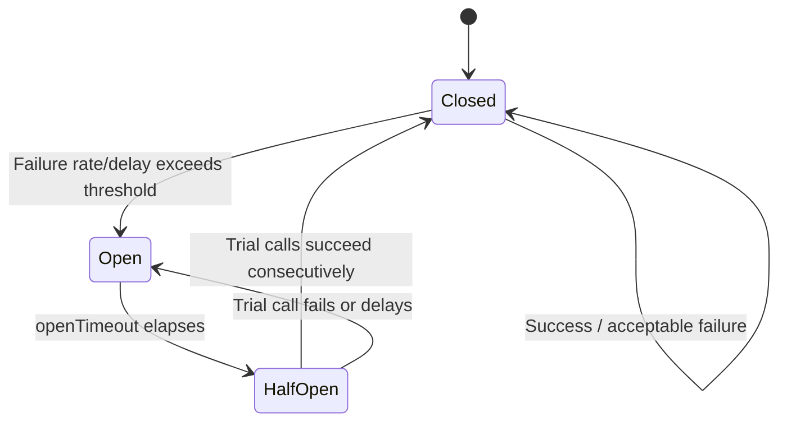
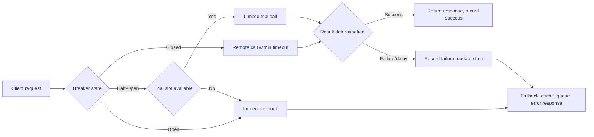

# The Circuit Breaker Pattern and Failure Isolation

## 1. Overview

### A. Definition

> A **circuit breaker** is a software design pattern that observes the failures and delays of remote calls to close the call path, then, after limitedly confirming whether the failure has recovered, opens it again.

The circuit breaker borrows its name from the electrical circuit breaker.
When overcurrent flows in an electrical circuit, the breaker cuts the circuit to prevent fire and equipment damage, and reconnects after inspection.
In distributed software as well, it briefly cuts the path toward a failed dependency so that a single service failure does not propagate to the entire caller.
The key is not to perfectly diagnose the state of the remote system, but to control the scope and duration of failure that the caller can withstand.

The circuit breaker differs from simple retry logic.
Retry is a technique of resending the same request to overcome a transient failure, but if retries accumulate while a failure persists, they can increase the target system's load and the caller's queue.
The circuit breaker, by contrast, fails fast or uses an alternate path once a certain failure signal is observed, thereby reducing additional calls themselves.
Therefore, the two techniques are not competitors but complements that require designing retry count, backoff, and blocking conditions together.

### B. Background and Necessity

In distributed systems, whether a service is healthy is not determined by a binary value.
Like network packet loss, DNS delay, connection-pool exhaustion, thread exhaustion, and partial database overload, a call exhibits various states of success, failure, and delay.
The caller may wait until timeout or retry without limit without detecting these differences.
As a result, failure propagation appears in which the caller and upstream services saturate before the originally failing service.

For example, assume the order service depends synchronously on the payment service.
If the payment service's average response time increases from the usual 200ms to 5 seconds, the order service's worker threads become occupied waiting for the payment response.
If traffic keeps coming at the same level, waiting requests pile up, the order service's connection pool and memory become exhausted, and even order lookups unrelated to payment can fail.
In this situation, the circuit breaker limits calls based on failure rate and delay, and lets the order service choose the reduced functionality it can provide.

Another reason the circuit breaker is needed is to prevent a surge at the moment of recovery.
If all callers resume requests simultaneously right after a failure is resolved, the so-called recovery storm can occur, in which the target service falls into overload again.
Allowing only a small number of trial requests in the half-open state lets one confirm recovery while gradually increasing the load.
This is a control problem that includes not only blocking upon a failure but also stabilizing the recovery process.

### C. Application Goals and Scope

The application goals are, first, isolating dependency failures; second, protecting the caller's resources; third, providing users a fast and predictable alternate response; and fourth, automating recovery verification.
If one merely adds a component that counts exceptions without achieving all four goals, only operational complexity increases.
Through experimentation and observation, one must clarify "which failures to block" and "what to provide when blocked."

The primary application targets are HTTP/gRPC-based synchronous calls, external payment/authentication APIs, a message broker's synchronous management APIs, database proxies, and service-mesh routing paths.
Conversely, an asynchronous message consumer already has a buffer and reprocessing model, so a problem is hard to solve with a circuit breaker alone.
In this case, it must be designed together with consumer isolation, backpressure, reprocessing count, and a poison-message queue.

## 2. Operating Principle and State Model

### A. Basic State Transitions

The circuit breaker's representative states are three: Closed, Open, and Half-Open.
In the closed state, it passes calls normally while measuring success, failure, and delay.
In the open state, it does not perform the actual dependency call but immediately fails or returns a predetermined alternate response.
In the half-open state, after a certain wait time, it allows only a limited number of trial calls to confirm the dependency's recovery.

The condition for transitioning from closed to open should preferably not be set by failure count alone.
A short-lived transient error may be a momentary network loss, and high delay over a long period may be target-service saturation, so an observation window and a minimum call count are set together.
For example, opening if at least 50 calls occurred in the last 20 seconds and the failure rate exceeds 50% reduces the risk of misjudgment in low-call-volume periods.
However, thresholds must be assigned to match the service's importance and acceptable error budget, and should not be applied uniformly to all APIs.

The open-state wait time can start as a fixed value, but in environments with repeated failures and recoveries, consider exponential backoff or a capped increase.
If the wait time is too short, trial requests are repeated against an unrecovered target; if too long, normal functionality is unnecessarily restricted for a long time even when the service has recovered.
In particular, dependencies with large business loss, such as payment and authentication, may weight preventing duplicate transactions and security errors more heavily than fast recovery confirmation.

### B. Call Processing Flow

The caller checks the current state before passing through the breaker.
If closed, it executes the request and records the result.
If open, it blocks the call and chooses one of fallback, cache, queuing, or user guidance.
If half-open, it limits the number of concurrent trial calls so that only a small number of requests reach the target service.

The determination of the call result must reflect the meaning of HTTP status codes or gRPC status codes.
Uniformly counting a 4xx response where the request itself is wrong, such as an authentication failure, as a dependency failure can cause the breaker to block a healthy service.
Conversely, 429, 502, 503, 504, or connection refused / read timeout are highly likely to be capacity problems of the target system or path, so they can be classified as failure signals.
An error-classification table that distinguishes retryable from non-retryable errors per business is needed.

### C. Window Types and Determination Metrics

Methods for aggregating failures include consecutive failures, a time-based sliding window, a call-count-based ring buffer, and rate-based determination.
The consecutive-failure method is simple to implement and blocks initial failures quickly, but can miss partial failures where success and failure alternate.
A time-based window can show the trend over a period, but is prone to low-traffic misjudgment in services with large traffic variation.
A call-count-based window makes statistical comparison easy but can take long to reach a determination in low-call-volume periods.

| Determination method | Advantage | Risk | Application example |
|---|---|---|---|
| Consecutive failure count | Fast blocking, simple implementation | Sensitive to intermittent failures and low traffic | Connection refused, DNS failure |
| Time-based rate | Reflects recent trend | Bias from sudden traffic changes | Large-scale API |
| Call-count-based window | Guarantees sample size | Response delay for low-call APIs | Payment/management API |
| Success rate + delay mix | Reflects user-perceived failures | Complex instrumentation and tuning | Key user journeys |

Looking only at failure rate can miss a very slow response that succeeds quickly.
For example, if the timeout is 3 seconds and the target service returns a success response every 2.9 seconds, the success rate is high but the caller's threads are occupied for a long time.
Therefore, one must observe error rate, timeout rate, p95/p99 latency, concurrency, and blocking rate together.
Align the criterion for counting delay as failure with the user request's timeout, and review it as the final perceived time including internal retry counts.

## 3. Components and Design Methods

### A. Failure/Success Determiner

The determiner is a layer that converts remote-call results into meaningful classifications.
Network exceptions, connection refused, TLS negotiation failure, read timeout, and server errors can be classified as technical failures.
Conversely, business errors that the dependency returned normally — such as invalid input, insufficient permissions, or a nonexistent resource — are basically not included in breaker failures.
Without this distinction, a side effect occurs where the entire provider is blocked when consumer errors accumulate.

Success determination is also not sufficient with the mechanical condition of HTTP 2xx alone.
An API that includes a business-failure code in the response body, a batch API that returns partial success, and an API that treats only asynchronous acceptance as success require separate determination rules.
The determiner should place domain-specific adapters to preserve call semantics and prevent rule changes from mixing directly into the state-machine implementation.
It is also important to confirm via contract tests that the provider and consumer understand the same error classification.

### B. State Storage and Concurrency Control

The breaker must store recent call results and the times of state transitions.
For a single-process library, in-memory state may be sufficient, but if multiple instances call the same provider, each instance's state can differ.
This difference has both advantages and disadvantages.
A per-instance breaker avoids the impact of a central-store failure and operates quickly, but makes it hard to precisely control blocking based on total call volume.

Using distributed state, one can share state via an external store such as Redis, but the breaker then depends on that store again.
Place a local cache, a short TTL, and conservative default values on failure so that the decision to block remote calls when the state store slows down does not itself delay the user path.
One can use a distributed lock or token bucket so that multiple instances do not acquire trial-call slots simultaneously, but the lock's own expiry and network partitions must be considered.
In most cases, it is simpler to prioritize local isolation and fast decisions over global precision, and to separate total-traffic control into a dedicated rate limiter.

### C. Timeout and Retry Budget

The circuit breaker does not replace the timeout.
Without a timeout, a call waits indefinitely in the closed state, so the breaker does not even get the chance to aggregate failures.
Each call should have a connection timeout, a read timeout, and an overall request timeout, and sub-calls should be performed within the remaining budget of the upstream request.
For example, if the upstream request's target time is 1 second, a configuration that sets three sub-retries each to 1 second is logically impossible.

When applying retries and the breaker together, one must avoid multiplicative amplification.
If one caller stage retries 3 times and the intermediate service and the provider SDK also each retry 3 times, one user request can expand to up to 27 calls.
It is safe to designate the retry actor in one place across the entire path, and to pass the attempt count and remaining time (deadline) to sub-calls.
For payment/order requests where idempotency is not guaranteed, prioritize request keys, deduplication, and asynchronous compensation flows over automatic retries.

### D. Fallback and Isolation Strategy

A fallback is not a function that "returns any response," but a reduced service that preserves the meaning of data and user expectations even during a failure.
If product recommendation fails, one can hide the recommendation area and show a default popular list, but showing the last cached value as the current balance when a balance lookup failed is dangerous.
Therefore, one should indicate staleness in the response, or in the finance/safety domain choose a conservative error notice.
Fallback design evaluates accuracy, freshness, security, legal liability, and reprocessability together.

Isolation can be configured at the thread-pool, connection-pool, queue, process, node, and region levels.
The bulkhead separates pools so that waiting requests for a particular dependency do not occupy all worker resources.
Even if the breaker blocks calls, failure propagation does not stop if already-running requests keep occupying resources, so the breaker and the bulkhead must be used together.
Assigning different resources, timeouts, and blocking policies to core and auxiliary functions can raise the survivability of the whole service through partial functionality.

## 4. Comparison of Similar Patterns and Operational Scenarios

### A. Comparison with Retry, Timeout, and Rate Limiter

The timeout sets an upper bound on how long one request can wait, the retry re-attempts errors with recovery potential, and the rate limiter limits the amount of requests allowed in a given time.
The circuit breaker selectively blocks, based on state, the path toward a dependency with accumulating failures.
All control load, but the signal they observe and the target they protect differ.
In practice, place the timeout as the innermost safety net, place the breaker behind limited retries and backoff, and control the total ingress volume with a rate limiter.

| Pattern | Main question | Protection target | Problem if misused |
|---|---|---|---|
| Timeout | How long to wait? | Request thread/connection | Too short treats normal delay as failure |
| Retry | Is it worth retrying? | Success rate of transient errors | Retry storm, duplicate processing |
| Circuit breaker | When to stop calling the dependency? | Caller and dependency | Function blocking due to misjudgment |
| Rate limiter | How much to allow? | Service capacity | Unnecessary rejection of normal traffic |
| Bulkhead | Which resources to isolate? | Per-function resource pool | Inefficiency of idle resources |

The reason the differences arise is that the time axis and space axis of failures differ.
The timeout controls the time axis of one request, but the breaker uses the trend observed across many requests to perform spatial isolation of the dependency path.
The rate limiter applies a capacity policy without judging whether there is a failure, so it is effective even during a surge in the normal state.
Making this distinction explicit in an answer shows that one understands each pattern as an operational control plane rather than having simply memorized them.

### B. Case 1: External Payment API Delay

Assume an online store's payment API is delayed from the usual 300ms to 8 seconds.
The order API's overall timeout is 2 seconds, and it allocates 1.2 seconds to the payment call.
If the first request times out, do not retry unconditionally; switch to a status lookup using the payment provider's idempotency key, or to asynchronous acceptance.
When the breaker opens, safely queue new payment requests in a "payment processing" state or give the user a retry notice, and ensure an already-approved payment is not executed twice.

The key to this case is that the fallback content must match the atomicity of the payment domain.
Returning a simple failure response can cause the user to pay again, creating a double-approval risk.
Conversely, clearly storing the acceptance state and combining idempotency key, status lookup, and compensation processing lets one track the order state even during the provider's transient failure.
For trial calls, prioritize a lookup or health check, and it is safe not to use a side-effecting request such as an actual amount approval directly for half-open verification.

### C. Case 2: Recommendation/Search Auxiliary-Function Failure

Assume that in a content service, personalized recommendation is an auxiliary function and content lookup is a core function.
If the recommendation service returns errors, open only the recommendation breaker and configure a bulkhead so that it does not share resources with the content-lookup path.
Provide a recent-popular-content cache as fallback, but manage the cache creation time so that stale recommendations are not mistaken for current personalized results.
This temporarily lowers recommendation quality but maintains the user's core reading flow.

A design that always tries to make the auxiliary function succeed can undermine the availability of the core function.
Define the degree to which a dependency's failure is tolerated according to service importance, and allocate the core journey's error budget with priority over auxiliary functions.
Also, display the breaker open rate, fallback ratio, and cache hit ratio together on a dashboard to distinguish "a failure being hidden" from "a function being safely reduced."

## 5. Implementation, Deployment, and Verification Procedures

### A. Design Stage

The first step is drawing the user journey and the list of remote dependencies.
In the call graph, record whether each call is synchronous/asynchronous, its importance, timeout, idempotency, data freshness, and substitutability.
Next, for each dependency, classify failure types as technical / business / security errors, and decide the blocking behavior and fallback policy.
Skipping this process and applying a common library uniformly across the company fails to reflect per-domain risk differences.

The second step is setting the baseline and targets.
Measure the normal success rate, p95/p99 latency, concurrency, and error-budget consumption rate, and define the acceptable user impact and automatic-abort conditions during experiments.
For example, immediately stop experiments and traffic changes if a key API's 5-minute error rate rises by 1 percentage point or order-acceptance failures exceed a certain number.
Without a baseline, it is hard to determine whether the breaker reduced or actually created the problem.

### B. Gradual Deployment and Verification

Initially, apply it to a single instance and a low-traffic non-critical API.
Inject normal calls, transient errors, persistent errors, slow responses, restarts, and network disconnection each to confirm state transitions and fallback.
Then raise the proportion of canary instances and expand the impact scope by region, tenant, and function.
At every stage, confirm that the breaker's own error does not create a larger failure for users.

Verification items include state-transition latency, the actual reduction in call volume after opening, the number of half-open trial calls, success-return conditions, fallback accuracy, and the correlation of metrics/logs/traces.
Confirm that normal return occurs automatically even after the failure is resolved, and that traffic does not surge right after return.
In load tests, measure results not only for a single node but also when multiple instances hold different states.
Because operators must be able to distinguish blocked requests from actually failed requests, agree in advance on the meaning of log fields and dashboards.

### C. Observability and Operations

The minimum metrics are the number of requests per breaker state; the number of allowed/blocked/trial calls; the number of successes/failures/timeouts; the failure rate; the latency distribution; the fallback ratio; and the number of state transitions.
Limit dimensions to about breaker name, dependency, API, region, instance, and error type to avoid high-cardinality problems.
Tagging traces with whether a call was blocked and why, the retry count, and the remaining deadline lets one track the delay-amplification path of one request.
Also observe the personal-data protection principle of not leaving sensitive request bodies or payment information in logs.

Design operational alerts around customer impact and recovery failure rather than the opening itself.
Sending every short transient opening as an urgent alert causes alert fatigue, so a severity policy combining blocking rate, duration, and core-journey failure is needed.
When the open state persists for a long time, check not only for a provider failure but also for wrong thresholds, certificate expiry, network-policy changes, and deployment regressions.
The runbook should include status-check commands, traffic-reduction procedures, fallback checks, manual-recovery conditions, and post-incident analysis items.

## 6. Deep Dive: Extension into Service Mesh and SRE Operations

In a service mesh, the breaker can be implemented in the proxy layer rather than the application code.
This approach has the advantage of applying a consistent policy to services in multiple languages and changing configuration without deployment.
However, because the proxy has difficulty knowing the meaning of domain errors and a safe fallback, transport-level blocking and business-level alternate responses must be separated.
While the proxy detects 5xx and reduces calls, the application must be responsible for business rules such as payment duplication and data freshness.

From an SRE perspective, the breaker is a device that raises availability, but not a device that hides blocked requests as successes.
Record blocking and fallback as separate error-budget consumption items, and if reduced functionality persists, convert it into customer impact.
The evaluation of the same fallback differs depending on whether the service-level objective is "content-lookup success" or "success including personalized recommendation."
Therefore, define SLIs not only as technical metrics but also as user-journey metrics, and verify that the breaker policy improves the target.

In recent operational design, rather than using only fixed thresholds, adaptive criteria considering traffic patterns and delay distributions are being examined.
However, since auto-learned thresholds can mistake abnormal traffic as normal, place minimum/maximum bounds and a human-reviewed change-approval procedure.
It is safe to use AI-based anomaly-detection results as an auxiliary signal and investigation priority rather than as the breaker's direct blocking signal.
The more automation complexity increases, the more operators must be able to understand the reasons for decisions and the way to stop them.

In a professional-engineer answer, do not explain the breaker as merely a single design pattern; start from the quality-attribute goal of preventing failure propagation.
Present the trade-offs of availability, performance, consistency, security, and operability, and connect the combination of timeout, retry, bulkhead, rate limiter, and observability at the architecture level.
Including quantitative criteria, gradual application, automatic abort, and post-incident learning can extend the implementation explanation into operational governance.

## 7. Considerations and Implications

### A. Balancing Thresholds with False Positives and False Negatives

If the threshold is low, the circuit opens even on normal transient errors, unnecessarily restricting functionality.
If the threshold is high, it blocks only after the failure has sufficiently propagated, weakening the protective effect.
Use minimum call count, time window, per-error-type weights, and latency percentiles together, and adjust periodically reflecting traffic seasonality.
Compare the blocking rate and customer metrics before and after a change to manage configuration changes as operational changes.

### B. Data Consistency and Business Safety

Fallback caches may hold stale data, and queued commands may be processed later.
For data where accuracy comes first — such as balance, inventory, permissions, and payment — stale responses must not be allowed unconditionally.
Design idempotency keys, version verification, compensation transactions, and manual-confirmation states so that blocking does not cause duplication, loss, or reordering.
Failure isolation must be evaluated by the safety of the business outcome, not by technical success.

### C. State Sharing and Operational Complexity

Per-instance state is simple and fast but can differ from a global policy.
Central state can provide consistency but creates new dependencies of state-store failure and network partition.
First judge whether precise global blocking is really needed, and if not, separate the complexity by combining a local breaker with a global rate limit.
Version-control breaker configuration with code/configuration management, and clarify who changes it and how to roll back.

### D. Security and Personal Data

When leaving error causes in breaker logs and traces, mask so that tokens, order numbers, and personal data are not exposed.
Verify keys and access control so that the cache a fallback provides is not mixed across tenants.
Omitting authentication on the grounds of bypassing an external authentication-service failure can make the security risk larger than the availability gain.
Blocking and bypass policies are also subject to the threat model and audit trail, and emergency configuration changes leave approval and post-review records.

### E. Testing and Organizational Learning

Unit tests alone cannot sufficiently verify time windows, concurrency, and recovery storms.
One must combine integration tests, fault injection, load tests, canary operation, and periodic recovery drills.
Connect experiment results to improvements in design assumptions and runbooks rather than blaming a specific responder, and leave regression tests preventing recurrence of discovered problems in the repository.
The effect of the pattern is sustained when development, operations, security, and business staff commonly understand the blocking conditions and the meaning of the fallback.

## References

- Martin Fowler, CircuitBreaker: https://martinfowler.com/bliki/CircuitBreaker.html
- Microsoft Azure Architecture Center, Circuit Breaker pattern: https://learn.microsoft.com/en-us/azure/architecture/patterns/circuit-breaker
- Microsoft Polly documentation, resilience strategies: https://www.pollydocs.org/strategies/

---

> **In one line**: The circuit breaker is a core resilience pattern of distributed systems that, instead of unconditionally re-calling a failed dependency, blocks, tries, and returns based on state to control both failure propagation and recovery storms together.
