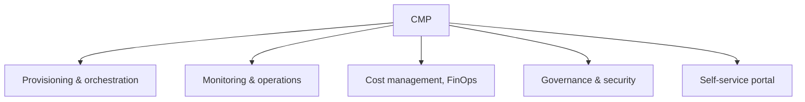

# Cloud Management Platform (CMP)

## 1. Overview

### A. Definition
> A management platform that **provisions, monitors, optimizes, and governs** multiple public clouds (multi/hybrid) and on-premises resources **in an integrated way from a single console**.

A CMP does not replace the management console of a specific CSP (AWS/Azure/GCP); it is a layer that **abstracts** the different clouds **on top of them** and binds them into a single operational system. Because each CSP has different APIs, terminology, billing schemes, and security models, handling them individually increases management manpower and mistakes exponentially. A CMP absorbs this heterogeneity so that one can "deploy, monitor, and control in the same way regardless of which cloud."

### B. Background and Necessity
Enterprises adopted **multicloud** to avoid vendor lock-in, secure availability, and leverage each service's strengths, but as a result the management targets exploded. One must move between consoles per cloud, costs are scattered across multiple invoices making it invisible where waste occurs, and security policies differ, making it hard to enforce compliance consistently. In particular, the cloud's agility of creating resources with a few clicks becomes the very cause of **unmanaged ghost resources (Shadow IT) and cost bombs**. A CMP emerged to tame the complexity of multicloud by gathering **visibility, automation, cost optimization (FinOps), and governance** for these scattered resources into one place.

## 2. Essential Functions

**A. Provisioning and orchestration** is the function that automates deployment, configuration, and changes of resources with code (IaC) and templates. When people create servers manually in the console, **configuration drift** arises where the configuration differs per environment; IaC-based automation eliminates this by repeatedly deploying with the same definition.

**B. Monitoring and operations** is the function that monitors the performance, availability, and logs of resources scattered across multiple clouds by **consolidating them into a single dashboard**, and connects even to automatic response when thresholds are exceeded. When the root cause of a failure spans multiple clouds, root-cause tracing itself is impossible without integrated observability.

**C. Cost management (FinOps)** is the function that analyzes usage and cost in real time to find idle/over-provisioned resources and control the budget. For example, when a development team leaves a GPU instance launched for testing running overnight and leaks millions of won per month, the CMP catches it with per-tag cost reports and automatic scheduling.

**D. Governance and security** is the function that **consistently enforces** access control, tagging policies, and compliance across multiple clouds. Adding a **self-service portal** on top (users request resources directly from an approved catalog) achieves control and agility simultaneously.

| Function | Content | Problem when absent |
|---|---|---|
| Provisioning/orchestration | IaC-based deployment/config automation | Configuration drift, manual mistakes |
| Monitoring/operations | Integrated performance/availability/log monitoring | Failure-cause tracing impossible |
| Cost management (FinOps) | Usage/cost analysis, budget control | Idle resources, cost bombs |
| Governance/security | Consistent policy/compliance/access control | Compliance violations, Shadow IT |
| Self-service | Catalog/portal requests | IT bottleneck, loss of control |

## 3. Platform Selection Criteria

Adopting a CMP is a decision to place the entire operational system on top of it, so the selection criteria should be judged not by a simple feature list but by **consistency with one's own cloud strategy**. Look together at whether it supports all the CSPs and on-prem we actually use (if the support scope is narrow, we end up reverting to individual management), whether it integrates with existing CI/CD and monitoring tools via API, whether FinOps and policy management are at the report level or reach the actual control level, and whether it satisfies regulations such as CSAP for domestic public-sector use.

| Criterion | Items to check |
|---|---|
| Multicloud support | Support scope for the CSPs/on-prem actually used |
| Automation/integration | IaC/API/existing-tool integration |
| Cost/governance | FinOps/policy-management maturity (does it reach control?) |
| Security/compliance | Access control/compliance (CSAP, etc.) |
| Scalability/operability | Scale handling, ease of use, learning curve |

## 4. Expected Effects

The expected effects are the results that appear when the aforementioned essential functions work properly. Scattered resources become visible at a glance, creating **visibility and control**; removing idle resources and selecting optimal instances **reduces cost**; self-service and automation shorten deployment lead time, raising **agility**; and consistently applied policies strengthen **governance**. These effects are interlocked with one another — for example, only when visibility is secured do the targets for cost reduction become visible.

## 5. Considerations and Implications
From a professional engineer's perspective, the point to guard against most when adopting a CMP is that **the CMP itself can become a new form of lock-in**. If operations are deeply coupled to a specific CMP, it becomes hard to leave that CMP later, so standards (Terraform, OpenAPI, etc.) and openness must be given priority. Also, a CMP is not a cure-all; it produces real effect only when designed as part of an operational system that is organically linked with **CSPM (security posture management), FinOps, and IaC**. In conclusion, a CMP is a key management means that makes a multicloud strategy sustainable, and recently it is evolving toward autonomous (self-driving) operations by combining with AIOps and policy automation.

---

> **In one line**: A CMP is a platform that *abstracts multi/hybrid cloud into a single console for integrated management*, consistently providing provisioning, monitoring, FinOps, and governance to realize visibility, cost reduction, and agility — while guarding against lock-in to the CMP itself through standards and openness.
