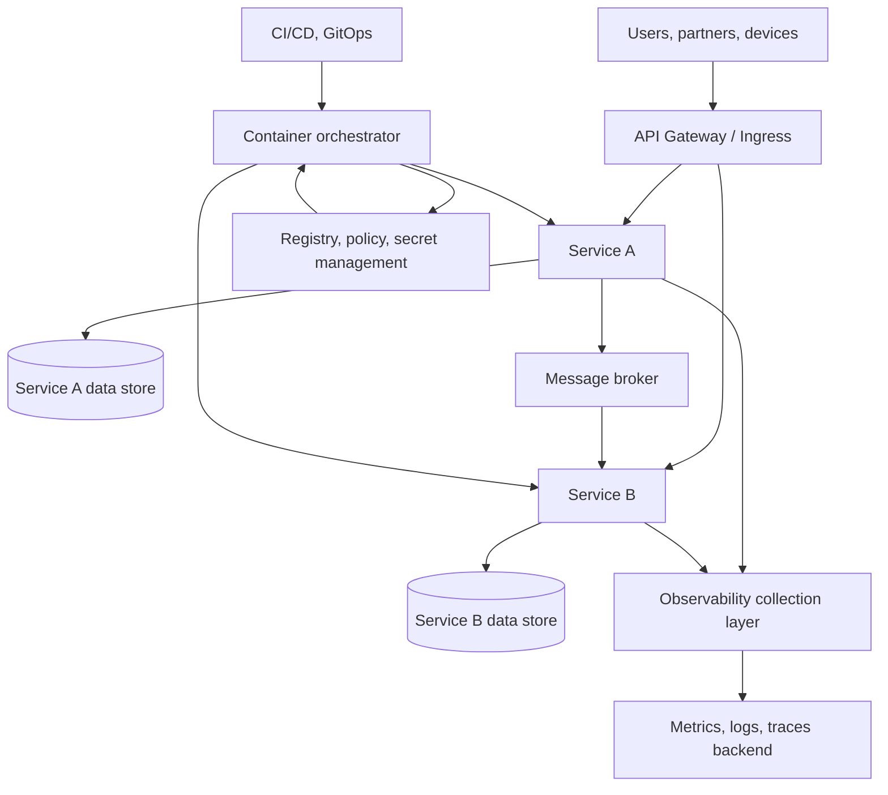
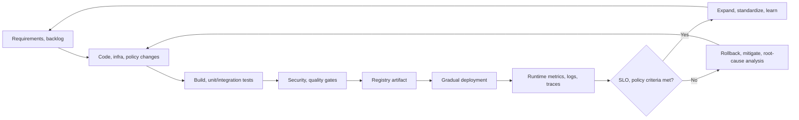

# Cloud Native Architecture

## 1. Overview

> **Definition**: Cloud native is not about using a particular cloud product, but an approach that combines containers, microservices, declarative APIs, automation, observability, and elasticity to design applications and operational practices so as to respond to change quickly and repeatably.

The core of cloud native lies in distinguishing between putting an application on the cloud and designing an application in a cloud-native way.
Packaging an existing system as a virtual-machine image and moving it to a public cloud (lift and shift) is cloud usage, but that alone does not make it cloud native.
Cloud native regards situations where failures occur, demand changes, and code changes frequently as normal operating conditions, and it changes the structure and processes so that the system recovers and scales on its own under those conditions.

Traditional applications were often designed around one server and one deployment unit.
In this structure, the scope of pre-deployment regression testing grows, and even changing some functions required stopping the whole system or securing a large release window.
Also, if server state remains on local disk and memory, failure recovery or horizontal scaling is difficult, and operators must directly manage the state of each server.

Cloud native reduces such coupling by dividing the application into small change units and externalizing state and the execution environment as much as possible.
A container image moves the same execution unit across development, testing, and operation, and the orchestrator continuously reconciles the difference between the desired state and the actual state.
The pipeline automates the procedure of building and verifying code, and observability provides the signals for operators to judge whether a service is healthy and where a problem started.

However, merely creating many microservices or installing Kubernetes cannot achieve the goal.
If service boundaries are wrong, network calls and distributed transactions increase, and inter-team coordination cost and debugging difficulty rise.
If automation is inaccurate, fast deployment can turn into fast failure propagation, and the elasticity of cloud resources can lead to cost explosions.
Therefore, in an exam answer, instead of listing technical elements, one should explain the cause-and-effect relationship between the goals — change responsiveness, resilience, operational automation, security, cost — and the design choices.

### 1.1 Background and Necessity

First, the pace of change of digital services has quickened.
Mobile and online services must deliver feature improvements and policy changes on a short cycle, and large batch deployments alone cannot keep up with competitive speed and user feedback.
To deploy small changes frequently, an automated delivery flow connecting the code repository, build, test, deployment, and rollback is needed.

Second, the volatility of demand and failures has grown.
For services where requests surge in specific time windows — such as shopping events or public application intake — fixing servers based on average load raises idle cost, while basing them on the peak raises everyday cost.
A combination of horizontal scaling of stateless components, queue-based buffering, autoscaling, and caching absorbs the variation, but it does not automatically resolve bottlenecks in the database and external integrations.

Third, organizations have become distributed and platforms complex.
When development, operations, security, and data teams move separately, handoffs and approval waits become bottlenecks.
If product teams use a common platform via self-service and apply policies as code, one can raise team autonomy while maintaining the organization's basic controls.

### 1.2 Goals and Scope

The first goal of cloud-native design is **changeability**.
One must be able to modify functions in small units and deploy them independently, and a change failure must not expand into a full service outage.
For this, define together the deployment unit, data ownership, API contracts, version compatibility, and rollback boundaries.

The second goal is **elasticity**.
Elasticity is not simply the ability to increase the number of servers, but the ability to adjust resources to match load and reclaim them when load disappears.
To apply horizontal scaling, instances must not depend on local state, and sessions, files, and work queues must be separated into an external store or a dedicated service.

The third goal is **resilience**.
Resilience does not mean that no failure ever occurs, but the ability to isolate partial failures, maintain the service with limited functionality, and recover within a defined time.
Timeout, retry, circuit breaker, bulkhead, and multiple availability zones deal with different failure modes, so apply them by distinguishing their purposes.

The fourth goal is **observability and automation of operations**.
Metrics, logs, and traces must explain the state of services and infrastructure, and deployments and policy changes must remain as reproducible code.
Without observation data it is hard to verify the results of automation, and without automation a person must handle observation signals one by one, so the two elements are designed together.

## 2. Overall Structure and Core Principles of Cloud Native

Cloud native is an operational model in which application, platform, infrastructure, and organizational processes are combined.
The application layer provides domain functions and APIs, and the platform layer provides deployment, service discovery, secret management, observability, and policy as common functions.
The infrastructure layer abstracts compute, network, and storage resources, and the governance layer defines the boundaries of security, cost, and compliance.

In this structure, the API Gateway organizes the external boundary but must not become a central bottleneck that gathers all business rules in one place.
A service has its own responsibility and data ownership and communicates with other services through contracted interfaces.
The orchestrator is a tool that runs containers and also a control loop that reflects the declared replica count, network policies, and deployment version into the actual environment.

### 2.1 Immutable Infrastructure and Declarative Management

Immutable infrastructure is the principle of defining the desired configuration as code and images and, on change, creating and replacing with a new execution unit, rather than incrementally modifying a running server with operator commands.
This approach reduces the hidden state of "what manual changes has the current server undergone," lowering differences between environments.
In particular, when a failure occurs, regenerating a new instance with the same image and configuration, rather than fixing the current server, makes it easy to automate the recovery procedure.

Declarative management is a way of describing the desired state and letting the system reach it.
Whereas a procedural script specifies "this command first, then that command," a declarative definition expresses "10 pods and this policy must exist."
The controller observes the actual state, creates missing resources, reduces unnecessary ones, and re-reflects changed definitions.

A declarative definition is not unconditionally safe, either.
If one declares a wrong image tag or an excessive replica count, the auto-reconciler can rapidly amplify the error.
Therefore, put change approval, policy validation, static analysis, gradual deployment, and automatic rollback into the pipeline to distinguish "automatic" from "uncontrolled."

### 2.2 Containers and Images

A container is a technology that bundles an application and its dependencies into an image and runs it as an isolated process while sharing the host OS kernel.
It generally provides a lighter execution unit than a virtual machine, but sharing the kernel does not immediately mean complete security.
Vulnerable libraries in the image, excessive privileges, host-path mounts, and inclusion of secrets must be controlled separately.

Treat images as immutable artifacts and link the source commit, build tools, dependencies, signatures, and vulnerability-scan results.
Manually installing packages in a running container in production breaks reproducibility, and the change may disappear at the next deployment.
It is preferable to make fixes in the Dockerfile, build configuration, or config repository, and promote the digest of a verified image.

Image optimization is not merely a matter of reducing size.
A small image has the advantage of reducing the attack surface and transfer time, but removing all debugging tools can lower failure analyzability.
Separate the usage permissions of the operational image and temporary diagnostic tools, and combine a minimal run user, a read-only filesystem, and system-call restrictions.

### 2.3 Orchestration and Platform

The orchestrator places containers on nodes and handles service discovery, health checks, rolling updates, secret injection, and resource limits in a common way.
Operators do not create a server-access procedure per application but manage deployment and state through the platform's API and declaration files.
This abstraction raises productivity, but without understanding the actual behavior of network, storage, and scheduling, one may miss the cause of a failure.

Resource requests and limits become the criteria for scheduling and stability.
If the request is set too low, too many pods are placed on a node; if the limit is set too low, the process can be terminated during a normal peak.
Conversely, setting the limit excessively high makes resource reservation large regardless of actual usage, affecting the placement and cost of other services.
Measure each service's baseline load and p95/p99 usage and adjust the values periodically.

Health checks distinguish liveness, which confirms whether the process is alive, from readiness, which confirms whether it is ready to receive requests.
A readiness failure means temporarily excluding traffic, and a liveness failure can trigger a restart, so the two checks must not be made with the same conditions.
For services with long initialization, place a startup check so that a booting process is not prematurely restarted.

### 2.4 The Cloud-Native Delivery Loop

The operational value of cloud native comes from making a single feedback loop from the development stage to the operation stage.
Changes are recorded in Git, and the pipeline performs test, security, and policy checks, then produces an artifact.
After deployment, observability signals are compared with service-level objectives, and if an anomaly is found, it returns to rollback, mitigation, and improvement work.

In this loop, deployment success and service success can differ.
Even if the image ran normally, user latency, business error rate, cost, and security events can worsen, so include the runtime result in the deployment decision.
Also, the criterion for automatic rollback should be signals closer to business impact — error-budget consumption, the success rate of key user journeys, data integrity — rather than a single CPU utilization figure.

## 3. Application, Data, and Platform Design

### 3.1 Microservices and Service Boundaries

For microservices, the key is not the number of small processes but whether one can operate the boundaries of change, deployment, failure, and data ownership independently.
One service should be responsible for a cohesive business capability rather than a single technical function, and externally its functions are used through specified APIs and events.
Setting boundaries well lets teams release independently, but setting them wrong results in a distributed monolith.

When splitting services, analyze together domain terms, change frequency, transaction boundaries, team responsibilities, security boundaries, and performance characteristics.
Separating two modules that always change at the same time may only increase network calls, and putting different business rules into one service causes continual deployment conflicts.
A strategy of using a modular monolith initially to verify domain boundaries, then gradually splitting when actual bottlenecks and team structure are confirmed, is also valid.

### 3.2 API and Event-Based Communication

A synchronous API call is suitable for lookups or commands that need an immediate response, but if the callee is delayed or fails, the caller can also wait.
The timeout prevents infinite waiting, but the timeout itself does not guarantee cancellation of the work, so server-side duplicate execution and compensation processing must be considered.
Retry can absorb transient errors, but retrying every error adds load to an already-failing target, causing a retry storm.

Event-based communication reduces temporal coupling by having a producer publish facts and a consumer process them asynchronously.
However, message duplication, reordering, delay, consumer reprocessing, and schema-compatibility problems arise, so idempotency keys and reprocessing policies must be designed.
Also, publishing an event does not always commit the database transaction and the message publication simultaneously, so the outbox pattern or change data capture can be leveraged.

### 3.3 State and Data Management

In cloud native, "stateless" does not mean there is no data, but that the lifetime of an individual instance is separated from the lifetime of the business data.
Moving authentication sessions to an external session store or tokens, files to object storage, and work to a durable queue lets one freely replace instances.
However, as external stores increase, network latency, consistency, cost, and failure domains also increase, so data-access patterns must be measured.

Per-service database ownership raises independence, but can conflict with the requirement of joining multiple databases in company-wide reports.
Allowing direct joins on operational databases breaks service boundaries, and schema changes block other teams' deployments.
Instead, build a separate analytics model through events, CDC, a data warehouse, and data products, and make explicit the difference between real-time business transactions and analytics consistency.

### 3.4 Platform Engineering and Developer Experience

The platform team is not a central operations team that performs all work on behalf of developers, but provides an internal platform that lets product teams build services with safe defaults.
When service templates, standard pipelines, log/trace linkage, permission/secret management, and cost dashboards are provided as self-service, the waste of each team repeating the same foundational work is reduced.

The success of an internal platform is measured by developer experience and operational outcomes, not by the number of features.
Look together at the time until a new service's first deployment, the standard-template usage rate, the change failure rate, recovery time, and the number of policy exceptions.
If the platform forces every choice, it can block team innovation, so provide both a safe golden path and an exception-approval route.

## 4. Security, Observability, and Operational Automation

### 4.1 DevSecOps and Supply Chain Security

In a cloud-native environment, code is quickly transformed into images and deployment configurations, so security checks cannot be placed only at the last approval step just before operation.
Connect secret detection in the source repository, dependency-vulnerability checks, image scanning, signature verification, and deployment-permission control into the development, build, and deployment flow.
Separate the permissions of the build system and the registry, and restrict, by policy, the signers the operational cluster trusts and the allowed registries.

Security is not the responsibility of the platform team alone; each owner of the service code, image, infrastructure code, and policy code shares it.
However, distributing responsibility while distributing the control criteria as well widens the level differences between teams, so set organization-wide common criteria and automated policy gates.
Do not store secrets in plaintext in environment variables; use a dedicated secret-management system with short-lifetime and rotation policies.

### 4.2 The Three Signals of Observability

Observability refers to the degree to which one can infer the internal state from external outputs when the internal state cannot be seen directly.
Metrics show numbers and trends over time, logs provide the context of a specific event, and traces show the path and delay of one request passing through multiple services.
The purpose is not to collect as many of the three signals as possible, but to design correlations so one can answer questions about user impact and root cause.

Standardizing common attributes such as service name, environment, version, instance, and request ID makes it easy to link the signals to one another.
However, putting values with personal data or high cardinality — such as user IDs or raw requests — directly into tags increases storage cost and information-exposure risk.
Include field classification, masking, sampling, retention period, and access permissions in the observability design.

### 4.3 Reliability Patterns and Failure Isolation

The timeout sets the maximum wait time of a call to prevent resources from being tied up.
Retry uses exponential backoff and jitter to spread out concurrent re-calls and distinguishes retryable from non-retryable errors.
The circuit breaker quickly rejects calls when the failure rate or delay exceeds a threshold to prevent failure propagation, but the alternate response during the open circuit and recovery probing must be defined.

The bulkhead separates resource pools, threads, concurrency, and queues so that a surge in one function does not exhaust another function.
If the isolation boundary is too small, resource utilization drops; if too large, it cannot prevent failure propagation.
For disaster recovery, assume failures not only of a single node but of the region, data store, external payment integration, and authentication system, and set priorities and recovery objectives per service.

### 4.4 GitOps and Continuous Operations

GitOps is an operational method that declares the desired state of applications and infrastructure in Git and has an automated agent converge the cluster's actual state to the desired state.
Because the change history remains as code reviews and commits, one can track who changed what and why, and the procedure for reverting to a previous version becomes clear.

The advantage of GitOps is approval and reproducibility; it does not mean solving every operational problem with Git commits.
Emergency failure response, secrets, large-scale data changes, and external system settings need separate controls and records.
When the actual state and the Git state differ, automatic overwrite can recover from a failure, but it can also revert a manual mitigation, so prepare pause and reconciliation procedures.

## 5. Comparison and Application Cases

### 5.1 Comparison with the Traditional Virtual-Machine Approach

VM-centric systems provide strong OS-level isolation and a familiar management style.
For legacy commercial packages or systems with heavy kernel dependencies, this can be a stable choice, but images are large, boot times long, and per-server configuration differences prone to arise.
Containers and orchestration provide smaller deployment units and automatic reconciliation, but add the communication, observation, and security complexity of distributed systems.

|Category|VM-centric|Container, cloud native|Practical implication|
|---|---|---|---|
|Deployment unit|OS image|Application image|Compare change scope and boot time|
|Scaling|VM creation, scale sets|Pods, services, autoscaling|Separately verify state-store bottlenecks|
|State management|May depend on local disk|Prefer state externalization|Data consistency and cost matter|
|Operating style|Procedural server management|Declarative, automated management|Control the impact of automation errors|
|Failure response|Server recovery, replacement|Instance regeneration, isolation|Design recovery automation and evidence together|
|Suitable targets|Legacy, special OS, strong isolation|Frequently-changing web, API, batch|A mixed strategy per workload is realistic|

The difference arises not from superiority but from coupling and operational purpose.
Forcibly decomposing a legacy system that is hard to containerize can raise testing and data-conversion costs.
Conversely, managing a frequently-changing API layer only as a large VM image loses the opportunity for deployment speed and failure isolation.
Therefore, analyze the application portfolio and divide strategies into rehost, replatform, refactor, retire, and retain.

### 5.2 Case 1: Online Order Service

Suppose an online order service sees requests increase from the usual 500 per second to 5,000 per second at the start of an event.
The web/product-lookup service can be horizontally scaled as stateless containers, and images and frequently-viewed product information can be distributed via CDN/cache.
Buffer order intake with a queue to separate the payment, inventory, and notification work, but use the order number and idempotency key so that double payment does not occur even if a consumer processes the same message twice.

Autoscaling can increase the number of web pods, but it does not automatically resolve the number of database connections and inventory-row locks.
Therefore, design together the connection-pool limit, inventory-reservation model, read replicas, cache consistency, and backpressure.
Operators should manage not only request rate, error rate, and p99 latency but also queue buildup, payment success rate, inventory mismatch, and cost as service-level metrics.

### 5.3 Case 2: Public Civil-Service System

A public civil-service system requires not only a temporary surge in applications but also personal-data protection, audit trails, and long-term data retention simultaneously.
Scale the web layer elastically, but apply minimal-collection, encryption, access-permission, and retention-period policies to citizen-identification information, and apply per-field masking so that raw personal data does not remain in logs.
Even when introducing a service mesh or API Gateway, do not assume that the final responsibility for authentication and authorization lies with infrastructure settings alone.

If civil-service intake and department assignment proceed asynchronously, one can provide a fast intake response, but a lookup model that accurately shows citizens the current status is needed.
Send processing-failure messages to a reprocessing queue and an operator-approval flow, and preserve event/change history instead of arbitrary deletion.
Deploy in a canary manner, applying to some traffic first, and revert to the previous version if the error rate or civil-service success rate deviates from the criteria.

### 5.4 Case 3: Predictive Maintenance of Manufacturing Equipment

Because sensor data from manufacturing equipment can experience field-network disconnection or delay, relying on the central cloud for all processing can delay alarms and control.
A hybrid structure in which edge devices perform threshold detection and temporary buffering, and the cloud performs long-term analysis, model retraining, and cross-equipment comparison, may be suitable.

Container-based edge deployment is advantageous for repeatedly deploying the same analytics module to multiple factories, but device resources, network, temperature, and field-work constraints must be considered.
Manage the versions of the model and configuration together, and place a safeguard that lowers the inference-result confidence or requires human confirmation when sensor quality is low.
This case shows that cloud native does not mean only the central public cloud, but is an approach that applies the principles of declarative deployment, automation, observation, and resilience to multiple locations.

## 6. Deep Dive — CNCF's Definition and Organizational Change

CNCF's definition of cloud native focuses less on a list of technologies and more on the way an organization develops, builds, and deploys workloads repeatably and programmatically at scale.
Therefore, serverless or managed services that do not use containers can also be part of a cloud-native strategy if they satisfy the same principles and operational controls.
Conversely, even if containers are used, if manual server access, unclear deployments, absence of observation, and unverified recovery procedures persist, it is hard to say the core goals are achieved.

NIST's guidance on microservices and DevSecOps presents a perspective of managing together not only application code but also application service code, infrastructure code, policy code, and observability code.
This perspective expands cloud-native operations from a mere container task of a development team into a company-wide supply-chain and policy problem.
To confirm the trust between the build output and the deployment environment, one must link SBOM, image signing, deployment policy, and runtime observation.

Recent platform engineering is a realistic means of spreading cloud native across the organization.
A common platform provides standard security, observation, and deployment functions, and product teams focus on business functions and user value.
However, if the platform team deploys only tools without listening to internal customers' needs, the platform becomes yet another ticket-waiting organization.
The platform product's roadmap must be evaluated by developer experience, service reliability, cost efficiency, and security outcomes.

In an exam answer, one must go beyond the rote formula "cloud native = MSA + containers + Kubernetes."
The high-scoring point is to connect the definition and core principles, per-layer design, security and operations, comparison with traditional approaches, and cases, then present criteria for judging business suitability and migration risk.
In particular, one must also state the counterargument that adopting technology first without organizational capability and data architecture being ready increases complexity and cost, to make the answer balanced.

## 7. Considerations and Implications

**First, the starting point of migration must be set by business change and service level, not technology.**
Investigate deployment frequency, allowable downtime, traffic variation, data consistency, regulation, and team structure, then determine the scope of cloud-native application.
For batch systems that change little or systems with strong hardware coupling, a stable single execution environment may be more suitable than forced microservices.

**Second, one must calculate together the independence gained from distribution and the complexity that arises because of distribution.**
As the number of services increases, the benefits of independent deployment and failure isolation arise, but the costs of network calls, contracts, observation, testing, and version compatibility also increase.
Verify module boundaries and team responsibilities before splitting services, and after splitting, measure whether latency, errors, operational tickets, and deployment performance actually improve.

**Third, place data consistency and recoverability at the center of the architecture.**
Emphasizing only the stateless application and leaving the data store as a single bottleneck causes the service to fail under peak load.
Define data ownership, synchronous/asynchronous processing, idempotency, compensation transactions, backup/restore testing, and RPO/RTO per business importance.

**Fourth, embed security and compliance into the pipeline and runtime.**
Vulnerability checks of images and code alone cannot prevent privilege misuse, secret exposure, and runtime escape.
Connect least privilege, network segmentation, signature verification, policy code, runtime detection, audit logs, and incident-response drills from development through operation.

**Fifth, evaluate observability by decision quality, not by the amount of collected data.**
Define key user journeys and SLOs per service, and preferentially collect only the metrics, logs, and traces that can detect SLO violations and narrow down causes.
If personal-data and high-cardinality problems are not controlled, observation data becomes a new security/cost risk, so operate retention and access policies together.

**Sixth, put safe stop and recovery paths into automation.**
Limit the failure of automation through gradual deployment, approved changes, policy validation, automatic rollback, manual stop on failure, and recovery rehearsals.
An automatic deployment's success does not mean the process is finished; one must confirm that actual user metrics and business metrics are stable.

**Seventh, include cost and sustainability in the design goals.**
Autoscaling and fine-grained services can reduce cost according to usage, but always-on dev environments, excessive logs, high-cardinality metrics, and unnecessary network transfer increase cost.
Include per-team cost visibility, budget alerts, resource TTLs, reserved/spot usage criteria, and carbon/energy metrics in operations.

**Eighth, accompany it with changes in organization and capability.**
DevOps and platform engineering are not projects that rename teams but an operational method in which development, operations, and security jointly own the service outcome.
Raise product teams' autonomy while providing a common platform and guardrails, and make recurrence prevention and learning an organizational asset rather than blaming individuals for failures.

In summary, cloud native is not a set of cloud-usage technologies but an architecture strategy that makes systems and organizations repeatable on the premise of change, failure, and demand variation.
A professional engineer must evaluate business suitability, the effectiveness of independence, data consistency, security, cost, and operational capability together — rather than the novelty of the adopted technology — and present a phased migration roadmap.

## References

- Cloud Native Computing Foundation, "Cloud Native Definition": https://github.com/cncf/toc/blob/main/DEFINITION.md
- Cloud Native Computing Foundation, "Cloud Native Security Whitepaper": https://www.cncf.io/wp-content/uploads/2022/06/CNCF_cloud-native-security-whitepaper-May2022-v2.pdf
- NIST, "SP 800-204: Security Strategies for Microservices-based Application Systems": https://nvlpubs.nist.gov/nistpubs/SpecialPublications/NIST.SP.800-204.pdf
- NIST, "NIST Publishes SP 800-204C": https://csrc.nist.gov/news/2022/nist-publishes-sp-800-204c
- Kubernetes Documentation, "Declarative Management of Kubernetes Objects": https://kubernetes.io/docs/concepts/overview/working-with-objects/declarative-management/
- OpenTelemetry Documentation, "Observability Primer": https://opentelemetry.io/docs/concepts/observability-primer/

---

> **In one line**: Cloud native is not containers themselves but an application, platform, and organizational operations strategy that combines declarative management, automation, elasticity, resilience, observability, and security to respond repeatably to change and failure.
