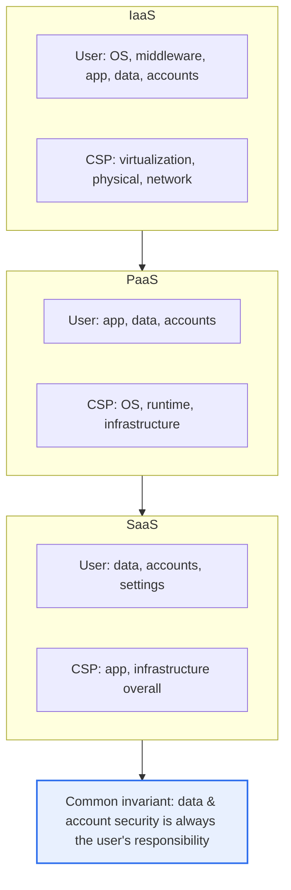
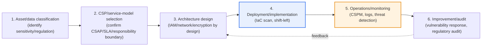

# Security Considerations When Adopting Cloud Services

## 1. Overview

### A. Definition
> Security considerations when adopting the cloud refer to **the set of security control items that an enterprise must review and secure across data, access, regulation, and operations** when adopting and operating cloud services. They exist to respond to cloud-specific risks that are fundamentally different from on-premises (shared responsibility, internet exposure, multi-tenancy, dynamic scaling).

The fundamental reason cloud security is difficult lies in the **Shared Responsibility Model**, in which "part of the control passes to the cloud service provider (CSP)." In on-premises, the enterprise directly controlled every layer from physical servers to data, but in the cloud, the CSP is responsible for the physical infrastructure and hypervisor, while the user is responsible for data, accounts, access, and configuration. The problem arises when this responsibility boundary is misunderstood. Being complacent with "it's the cloud, so the CSP will take care of security" leads to neglecting access-permission management or storage configuration, which are actually the user's responsibility, and an incident occurs.

In reality, most cloud breach incidents originate not from hacking of the CSP's infrastructure but from the user side's **misconfiguration (a publicly-open storage bucket) or account/key theft**. This is also why Gartner has long warned that "through 2025, 99% of cloud security incidents will be the customer's fault." Therefore, the starting point of cloud security is not flashy new technology but accurately knowing "what am I responsible for," and on top of that, the essence is systematically controlling data, access, and configuration.

### B. Necessity and Background
The cloud gives the benefits of scalability, agility, and cost (CapEx→OpEx conversion), but because it is constantly exposed to the internet, many tenants share physical resources, and resources are created en masse in an instant via IaC (Infrastructure as Code), it creates a **new attack surface** that did not exist on-premises. In particular, as development and deployment become faster, "security debt" — where security review falls behind — easily accumulates. Therefore, only by systematically reviewing security elements from the pre-adoption stage and embedding them into the architecture (security by design) can one safely enjoy the cloud's benefits. This is not a simple technology adoption but a company-wide task encompassing governance, process, and people.

## 2. The Shared Responsibility Model — Shifting the Control Boundary

The shared responsibility model is the backbone of cloud security. The key is that the responsibility boundary between the CSP and the user shifts according to the service model (IaaS/PaaS/SaaS), and that in any model, **the security of data and accounts (access permissions) always remains the user's share**. The structure diagram below shows this boundary shift.

In IaaS, the user is directly responsible even for the OS, middleware, and runtime, so the burden of patching and hardening is large. Conversely, in SaaS, the CSP operates up to the app, so the user can focus on data classification, access permissions, and sharing settings. Not recognizing this difference causes incidents such as neglecting the OS patch of a database placed on IaaS, mistakenly expecting the CSP to do it. Therefore, the first step is to document "my responsibility list" per service model to be adopted.

## 3. Key Security Considerations — From Data to Supply Chain

When adopting the cloud, one must review multiple elements hierarchically, from data to operations. The table below is for surveying all elements at once, while the "why" and practical implications of each element are explained in prose after the table.

| Element | Key considerations |
|---|---|
| **Data security** | At-rest/in-transit encryption, key management (KMS/HSM), data location/sovereignty, backup/destruction |
| **Access control (IAM)** | Least privilege, MFA, role-based (RBAC), key/secret management, excessive-permission review (CIEM) |
| **Configuration security** | Misconfiguration prevention, continuous inspection (CSPM), IaC scanning |
| **Network** | Network separation/security groups/firewall, zero trust, private connectivity |
| **Visibility/monitoring** | Logging/auditing (CloudTrail, etc.), threat detection, SIEM integration |
| **Regulation/certification** | CSAP/ISMS-P, Personal Information Protection Act/GDPR, industry-specific regulations |
| **Continuity** | Availability/multi-AZ/region, DR, Exit (termination/transition) strategy |
| **Supply chain** | Container/image vulnerabilities, IaC/SBOM, open-source verification |

**First, data security** is the ultimate protection target of all controls. Encrypt both at-rest data and in-transit data, but the real crux is **key management**. CSP-managed keys (SSE) are convenient, but if regulatory/sovereignty requirements are strong, one must use customer-managed keys (BYOK/CMK) or an HSM. One must also confirm in which country the data is physically stored/processed (data sovereignty); for example, placing domestic personal data in an overseas region can cause legal problems. One must design the entire data lifecycle up to the integrity of backups and safe destruction (including crypto-shredding through disposal of the encryption key).

**Second, access control (IAM)** is the front line of cloud incidents. Because the cloud's management console and APIs are open to the internet, if a single account is stolen, the entire infrastructure is exposed. Therefore, the **principle of least privilege**, **enforcing MFA on all administrator accounts**, and **avoiding long-term access keys (using short-lived tokens and role delegation)** are essential. Furthermore, **CIEM (Cloud Infrastructure Entitlement Management)**, which automatically detects and reclaims excessive permissions that accumulate over time, has recently come to prominence. In reality, many breach incidents originated from neglected access keys or overly broad IAM policies.

**Third, configuration security** is the greatest cloud-specific risk source. **Misconfigurations** such as publicly-misconfigured storage buckets, open security groups, and disabled logging account for the majority of actual incidents. Because it is impossible for a person to inspect these one by one, a **shift-left** approach — continuously scanning configurations with **CSPM (Cloud Security Posture Management)** and, further, catching misconfigurations at the **IaC (Terraform, etc.) code stage before deployment** — is taking hold. The core is the shift from "fixing after building" to "blocking before building."

**Fourth, network, visibility, regulation, continuity, and supply chain** must proceed in parallel. For network, reduce exposure with security groups and private connectivity, and control access with **zero trust** that does not trust even the internal network. On the visibility side, leave API-call logs and audit records so that tracing is possible during an incident, and integrate this with a SIEM to detect anomalous behavior. On the regulation side, a public cloud must comply with **CSAP (cloud security certification)**, and even the private sector must comply with **ISMS-P, the Personal Information Protection Act, GDPR**, and so on — which are included in the CSP-selection criteria before adoption. From a continuity perspective, one must prepare in advance multi-availability-zone (AZ)/region and DR design, and an **Exit (termination/transition) strategy** that can reclaim and migrate data and workloads so as not to be bound to a specific CSP. Finally, **supply chain security**, which brings transparency to vulnerabilities of container images, open source, and IaC via an **SBOM (Software Bill of Materials)**, has recently emerged as an essential element.

### A. Per-Stage Procedure for Embedding Security into Adoption
The above elements have real effect only when placed at each stage of the adoption process. The flow of embedding security into the adoption lifecycle, rather than as an after-the-fact inspection, is as follows.

The most common failure in this procedure is skipping stages 1–3 (design) and jumping straight to deployment. Putting data on the cloud without data-sensitivity classification makes it impossible to judge where and what control to apply, and not finalizing the responsibility boundary creates control gaps. Therefore, security is not something appended after deployment but must be reflected in the design from the asset-classification and CSP-selection stages, and it must have a circular structure (PDCA) in which the operations-stage CSPM/monitoring results feed back into design again. In reality, a considerable portion of misconfiguration incidents occur in organizations that invest in deployment automation (IaC) while omitting security verification (stage 4) of that code.

## 4. Cases and Comparison — What Changes Compared to On-Premises

The difference between on-premises and cloud security comes from the nature of the "boundary." The comparison below is not a mere list of items but shows why the approach must change.

| Category | On-premises | Cloud |
|---|---|---|
| Control scope | Direct control of all layers | Shared responsibility (per-layer division) |
| Boundary model | Physical boundary, perimeter firewall | Boundary dissolution → zero trust, identity-centric |
| Main risks | Physical intrusion, internal network | Misconfiguration, account theft, public exposure |
| Pace of change | Slow (manual provisioning) | Fast (IaC, auto scaling) |
| Security approach | After-the-fact-inspection-centered | Continuous inspection, shift-left |

In on-premises, perimeter-based security that treats the firewall-wrapped internal network as a "trust zone" worked. But in the cloud, resources are exposed to the internet and accessed via identity and APIs, so the boundary effectively disappears. Therefore, the paradigm shifts to zero trust, which "makes identity, not location, the basis of trust."

As a concrete case, the 2019 incident at a large financial firm, in which a misconfigured cloud firewall (WAF) combined with an over-privileged IAM role led to the leak of over 100 million customer records, was caused not by the infrastructure itself being breached but by **user-side misconfiguration and access-management failure**. This case symbolically shows the earlier emphasis that "most incidents are the customer's fault." As another case, when a domestic public institution adopts a private cloud, it can only use CSPs that have obtained CSAP certification, so from the early adoption phase regulatory compliance governs the CSP choice. Thus, cloud security is intertwined not only with technology but with regulation and governance.

## 5. Deep Dive — Integration into CNAPP and Zero Trust, and Latest Trends

Early cloud security had CSPM (configuration), CWPP (workload), CIEM (permissions), and container security each existing as separate tools, so alerts were fragmented and prioritization was difficult. The market has recently been converging these into a single **CNAPP (Cloud-Native Application Protection Platform)**. CNAPP provides integrated visibility of risks across the entire application lifecycle from code (IaC) to runtime, and correlates multiple signals (context) to prioritize "risks that are actually exploitable." Market research firms forecast that within the coming years, a substantial share of enterprises will find it hard to secure broad visibility of their cloud attack surface unless they adopt an integrated CNAPP (exact figures/years differ by report, so this is generalized).

Another axis is the combination of **shift-left** and **zero trust**. Shift-left pulls security forward into early development (code, CI/CD) rather than the operations stage, blocking misconfigurations and vulnerable images before they flow into production. Zero trust verifies every access (never trust, always verify) regardless of internal/external, minimizing lateral movement even when account theft occurs. The two approaches respectively handle "blocking inflow" and "suppressing breach spread," and CNAPP plays the role of the platform that operates these in an integrated way.

Change is also fast on the regulatory side. Domestically, as private-cloud use in the public sector expands, a direction of subdividing CSAP into "high/medium/low" grades and applying it differentially according to system importance is being discussed and taking hold; internationally, as demands for supply-chain transparency strengthen, SBOM submission is spreading as a procurement requirement (detailed grade criteria and enforcement timing may vary by policy, so this is generalized). This means cloud security is directly connected to **regulatory response and procurement requirements** beyond technical control, so an adopting organization must continuously track regulatory changes by collaborating with compliance and legal, not just the technical team.

As an answer strategy from a professional engineer's perspective, rather than merely listing cloud security elements, it is advantageous for a high score to structure them in a three-step flow: **① shared responsibility model (premise) → ② core controls such as data, IAM, and configuration (main body) → ③ integration into CNAPP, zero trust, and shift-left (development direction)**. In particular, presenting the empirical basis that "most incidents originate from misconfiguration and account management" makes the argument persuasive.

## 6. Considerations and Implications

1. **Understanding the shared responsibility model is the starting point of security.** In the chosen service model (IaaS/PaaS/SaaS), clearly document the area for which you are responsible (always including data and accounts), and place controls accordingly. Misunderstanding the boundary directly leads to control gaps.
2. **Misconfiguration and account management are the greatest risks.** Because public storage, excessive permissions, and leaked access keys account for the majority of actual incidents, prioritize strengthening CSPM (configuration inspection), IAM/CIEM (permission management), and MFA, and block misconfigurations at the IaC stage before deployment.
3. **Reflect regulation and data sovereignty from the early adoption phase.** Include applicable regulations — CSAP for public sector, ISMS-P/Personal Information Protection Act/GDPR for the private sector — in the CSP-selection criteria, and review in advance the physical storage location of data and cross-border transfer requirements to eliminate legal risk.
4. **Prepare for lock-in with continuity and an Exit strategy.** Secure availability with multi-AZ/region and DR, and secure in advance the migratability of data/workloads and contractual reclamation conditions so as not to be locked in to a specific CSP, maintaining bargaining power and resilience.
5. **Advance toward integrated management via CNAPP and zero trust.** Instead of fragmented individual tools, adopt a CNAPP that inspects workloads, configuration, permissions, and supply chain in an integrated way, and aim for layered defense that blocks inflow with shift-left and suppresses spread with zero trust.

## References
- CNAPP concept (Wiz Academy): https://www.wiz.io/academy/cloud-security/what-is-a-cloud-native-application-protection-platform-cnapp
- 2025 CSPM tools overview (SentinelOne): https://www.sentinelone.com/cybersecurity-101/cloud-security/cspm-tools/
- Korea Cloud Security Assurance Program (CSAP) guide (KISA): https://isms.kisa.or.kr/main/csap/intro/

---

> **In one line**: When adopting the cloud, one must hierarchically review *data encryption/key management, IAM/CIEM, configuration security (CSPM), network/visibility, regulation (CSAP)/data sovereignty, continuity/Exit, and supply chain (SBOM) on the premise of the shared responsibility model*, and since most incidents originate from misconfiguration and account management, respond with CSPM/IAM/shift-left and CNAPP/zero-trust integration.
