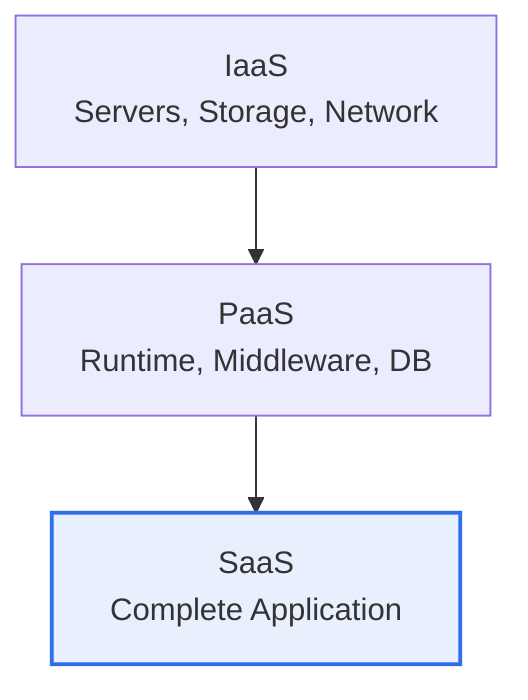
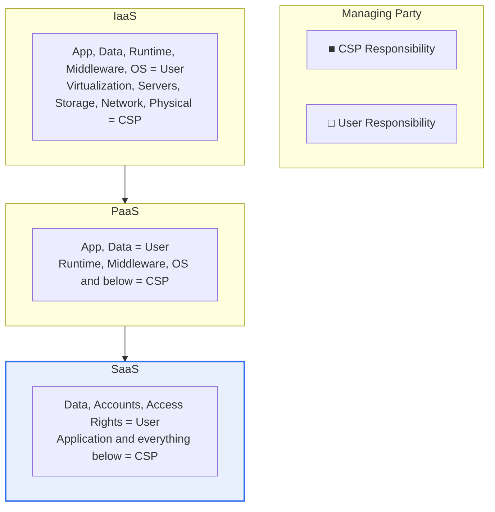

# Service Models and Deployment Models in Cloud Computing

## 1. Overview

### A. Definition

> The **Service Model** distinguishes to what level of abstraction the cloud provides computing resources (IaaS, PaaS, SaaS), while the **Deployment Model** distinguishes who owns and operates the cloud infrastructure and to whom it is provided (public, private, hybrid, community). These are the two axes that, together with the five essential characteristics defined in the U.S. National Institute of Standards and Technology's **NIST SP 800-145** cloud definition, form the framework that defines the cloud.

The two models answer different questions. The service model resolves a question of abstraction and responsibility — "**what do I rent, and what do I manage myself?**" — while the deployment model resolves a question of ownership and control — "**where do I place it, and how much control do I retain?**" Adopting cloud in practice is therefore a decision that multiplies these two axes into a combination (e.g., public × SaaS, private × IaaS), and which combination you choose governs the balance of cost, security, and agility.

### B. Background and Necessity

Before the cloud existed, to launch a service a company had to purchase servers directly (capital expenditure, CAPEX), endure months of procurement and installation, and over-provision resources to match peak load. This approach carried structural limitations: high up-front cost, slow response to demand fluctuations, and wasted idle resources. The cloud converted this into an **on-demand, pay-as-you-go, elastic** model, turning capital expenditure into operating expenditure (OPEX) and letting you rent, instantly, exactly as much as you need.

At this point a need arose to organize "to what level do I rent (service model)" and "where do I place it (deployment model)" in a standard vocabulary, and as NIST defined these, the classification system in use today became established. The key to understanding these two models is the **Shared Responsibility Model**. In the cloud, the provider (CSP) and the user divide management and security responsibilities between them, and depending on which service model you choose, that boundary of responsibility shifts. In other words, choosing a model is the act of deciding "what do I manage, and what am I responsible for."

## 2. Service Models (IaaS, PaaS, SaaS)

The three models are often intuitively likened to "ways of eating pizza." This analogy holds because the essential difference among the three models lies in the dividing line of management responsibility — "**up to where do I do it myself, and from where does someone else do it for me?**"

**A. IaaS (Infrastructure as a Service).** This is like renting flour and an oven (virtual servers, storage, network) and doing everything yourself from kneading the dough. It offers the greatest freedom, but the user installs, patches, and operates the OS, middleware, runtime, and application all themselves. AWS EC2 and Google Compute Engine, where you spin up virtual machines directly and install the OS, are representative. It is often used as the first entry point in "Lift & Shift" migrations that move legacy applications to the cloud as-is.

**B. PaaS (Platform as a Service).** This is like receiving a par-baked dough (a development and execution platform) and just adding toppings (app code). Developers are freed from infrastructure chores such as OS patching, middleware configuration, and capacity management, and can focus solely on code. Google App Engine, Heroku, and AWS Elastic Beanstalk fall into this category; recently, abstraction has advanced further into containers and serverless (FaaS, e.g., AWS Lambda), evolving into a form where "a function runs only when an event occurs and you are billed only for that."

**C. SaaS (Software as a Service).** This is like having a finished pizza (Gmail, Salesforce) delivered. The user does not install or operate the software but accesses it via a web browser and manages only data and settings. Adoption is fastest and management burden is minimal, but conversely the freedom of customization and control over security are most limited. A large share of the collaboration, CRM, and HR tools used by companies today are SaaS.

Recently, **FaaS (Function as a Service, serverless)** and **CaaS (Container as a Service)** have wedged in between these three layers, making the spectrum finer still. FaaS abstracts PaaS to its extreme, so that rather than keeping a server "always on," it runs a function only at the moment a request or event occurs and bills only for the execution time. Since cost converges to zero when idle, it is highly economical for intermittent, event-driven workloads, but this comes at the cost of increased execution latency (cold start) and vendor dependence. Thus, the IaaS→SaaS axis is closer to practice when understood not as three discrete steps but as a continuous spectrum in which "the share I manage" gradually shrinks.

In summary, **the higher you move up (IaaS→SaaS), the greater the convenience, abstraction, and speed of adoption, and the lower the management burden and freedom of control.** This movement across layers is precisely the shift in the boundary of the shared responsibility model examined in the next section.

| Model | Scope Provided | User's Area of Management | Representative Examples |
|---|---|---|---|
| **IaaS** | Virtual infrastructure (servers, storage, network) | OS, middleware, runtime, app, data | AWS EC2, GCE, Azure VM |
| **PaaS** | Development/execution platform (runtime, DB, middleware) | App, data | App Engine, Heroku, Beanstalk |
| **SaaS** | Complete application | Data, settings, user accounts only | Gmail, Salesforce, M365 |

## 3. The Shared Responsibility Model — The Bridge Connecting the Two Models

The shared responsibility model is the bridge connecting the service model and the deployment model. The principle is: "**Security *of* the cloud is the CSP's; security *in* the cloud is the user's.**" Physical facilities, hardware, and the virtualization layer are the CSP's responsibility under any model, but the boundary of responsibility for the layers above it moves up and down according to the service model.

In IaaS, most of it — OS patching, firewall/security-group configuration, and middleware vulnerability management — is the user's job. Moving up to PaaS, OS and runtime management pass to the CSP, so the user can focus on application code and data security. In SaaS, the CSP is responsible even for the application, so all that remains for the user is **managing data, accounts, and access rights**. Yet it is important that this very "remaining share" is the core cause of incidents. The majority of actual cloud breaches occur not because the CSP's infrastructure was penetrated but in the areas for which the user is responsible — misconfigured public S3 buckets, excessive IAM permissions, account takeovers. Whatever model you use, if you do not accurately recognize "the boundary I am responsible for," a security gap arises.

| Layer | IaaS | PaaS | SaaS |
|---|---|---|---|
| Data, accounts, access rights | User | User | User |
| Application | User | User | CSP |
| Runtime, middleware, OS | User | CSP | CSP |
| Virtualization, servers, storage, network, physical | CSP | CSP | CSP |

## 4. Deployment Models

The deployment model is decided at **the trade-off between security/control and cost/scalability**. If you fail to understand this trade-off and simply conclude that "public is cheap" or "private is secure," it is easy to make a choice that does not fit the actual workload.

**A. Public Cloud.** The CSP shares and provides resources to an unspecified public. It is inexpensive thanks to economies of scale, effectively scales without limit, and can be started immediately with no up-front investment. However, since resources are shared with other tenants (multi-tenancy), there are constraints on control at the level of physical isolation and on meeting special regulatory requirements. It suits highly variable web services, startups, and development/test environments.

**B. Private Cloud.** Built and operated exclusively for a single organization. Because resources are monopolized, security, control, and regulatory compliance are strong and performance is easy to predict, but since the infrastructure must be provisioned and operated in-house, cost is high and elasticity is relatively low. It is chosen in domains where data sovereignty and regulation are strict, such as financial core systems, defense, and healthcare.

**C. Hybrid Cloud.** Combines public and private and links them via orchestration. It is the mainstream form adopted by most real-world enterprises: sensitive data and core systems are kept in private, while highly variable workloads and external-facing services are placed in public, taking the advantages of each. A representative usage pattern is **cloud bursting**, where operation runs on private in normal times and spills over to public when traffic surges.

**D. Community Cloud.** Several organizations that share regulatory and security requirements — such as in finance or the public sector — jointly build and use it. Domestically, dedicated clouds for public institutions (e.g., administrative/public zones) or shared financial-sector infrastructure come close to this category. It has the advantage of lowering cost through shared burden while jointly satisfying common regulations.

| Model | Ownership/Provisioning Form | Advantages | Limitations | Suitable Cases |
|---|---|---|---|---|
| **Public** | CSP provides to an unspecified public | Low cost, unlimited scaling, immediacy | Limited control/isolation | Startups, external web services |
| **Private** | Exclusive to a single organization | Strong security, control, compliance | High cost, low elasticity | Financial core, defense, healthcare |
| **Hybrid** | Public + private combined | Flexibility, sensitive-data isolation | Integration/operational complexity | Mainstream for large enterprises |
| **Community** | Shared by organizations with common interests | Shared regulation, standards, cost | Requires coordination among participants | Financial/public shared infrastructure |

The trade-offs among the three deployment models are easier to grasp when made concrete with figures. Suppose, for example, that an e-commerce company usually processes hundreds of orders per second but momentarily receives dozens of times that traffic during a large discount event. If it used only private, it would have to secure dozens of servers in advance to match the peak, and after the event those resources would mostly sit idle and go to waste. If it used only public, it would face the burden of placing even sensitive data such as payments and personal information on shared infrastructure. Hybrid resolves this dilemma. The payment/member-information core is kept in private for control, while the product-browsing and promotion web front is placed in public and expanded via auto-scaling (cloud bursting) only during the event, after which the resources are reclaimed. The result is achieving both "control of sensitive data" and "elastic cost efficiency" at the same time.

The reason this trade-off matters in practice is that the choice of deployment model is not a mere matter of technical preference but a management decision that simultaneously determines **total cost of ownership (TCO), regulatory compliance, and business agility**. Whether to bear the up-front build cost (CAPEX) and gain control, or to convert to operating cost (OPEX) and gain agility, has a different answer depending on the organization's financial structure and regulatory environment.

## 5. Advanced — Evolution toward Multi-cloud and Cloud Native, and Domestic Trends

The deployment model has recently expanded beyond "hybrid" toward **multi-cloud**. Multi-cloud is a strategy of simultaneously using two or more public CSPs (e.g., AWS + Azure + GCP), adopted to mitigate vendor lock-in, to pick and use each CSP's strongest services, and to increase availability during regional outages. However, since heterogeneous platforms must be managed in an integrated way, new challenges arise: governance, cost management (FinOps), and consistency of security policy.

On the service-model side, cloud native — centered on **containers, Kubernetes, and serverless** — is blurring the boundary between IaaS and PaaS. Through containers, enterprises take both the portability of IaaS and the productivity of PaaS at once, and realize hybrid operations that deploy identically anywhere, whether on-premises or public. On top of this, as AI workloads have surged recently, forms that provide GPU resources on a pay-as-you-go basis are spreading, and demand for **sovereign cloud** — binding data within a specific country or region to meet regulations — is also growing.

Meanwhile, the boundaries of deployment models are also blurring. As **distributed cloud** — which brings the management system of a public CSP inside the customer's data center, such as AWS Outposts, Azure Stack, and Google Anthos — has emerged, a form that takes "the control of private + the operational convenience of public" at a single point has spread. This shows that deployment models are diversifying beyond the dichotomy of "where do you place it" toward the axis of "where do you manage it."

Domestically, the public-sector cloud transition is the real-world arena for this discussion. As the government expands the use of private clouds for public systems, it has restructured **CSAP (Cloud Security Assurance Program)**, its security verification framework, into a high/medium/low grading system that induces different service and deployment models to be applied according to system criticality. For example, low-grade systems are permitted logical separation, widening the door to public and SaaS use, whereas high-grade systems require physical separation, effectively demanding a dedicated (private/community) form. This is a case where the principle of "choosing the combination of service × deployment model to match regulatory requirements" has been implemented as actual policy.

## 6. Considerations and Implications (Professional Engineer's Perspective)

1. **The right combination of service × deployment model for the workload's characteristics is key.** There is no single correct answer. Core banking, which handles sensitive information, retains control with private + IaaS; collaboration tools take convenience with public + SaaS; external web services gain agility with public + PaaS. Each system's regulation, performance, and variability must be diagnosed to design the combination.

2. **Understanding the shared responsibility model is the starting point of cloud security.** Most cloud incidents (misconfiguration, account takeover, excessive permissions) occur in the user's area of responsibility, not the CSP's. Clearly recognizing "how far I am responsible" under the chosen service model and equipping controls matched to that boundary (IAM, encryption, configuration checks) is the basis of security.

3. **Managing vendor lock-in and securing portability are strategic challenges.** The more deeply you depend on a specific CSP's proprietary services, the higher the switching cost. A strategy of mitigating dependence through container-, standard-API-, and open-source-based design and multi-cloud architecture, thereby securing bargaining power and availability, is needed.

4. **Cost optimization (FinOps) is decisive for sustained operation.** Left unattended, pay-as-you-go can instead cause costs to explode. FinOps practices such as reclaiming idle resources, using reserved/spot instances, auto-scaling, and usage visibility must connect "the benefit of elasticity" to actual cost savings.

5. **Compliance with regulation and data sovereignty governs the choice of deployment model.** The Personal Information Protection Act, CSAP, network-separation requirements, restrictions on cross-border data transfer, and the like are factors where institutions — not technology — determine the deployment model. It is safer to approach by first diagnosing the regulatory requirements and then combining service models within the range that satisfies them.

## References

- NIST SP 800-145, *The NIST Definition of Cloud Computing* — https://csrc.nist.gov/pubs/sp/800/145/final
- KISA, *Cloud Security Assurance Program (CSAP)* — https://isms.kisa.or.kr
- AWS, *Shared Responsibility Model* — https://aws.amazon.com/compliance/shared-responsibility-model/

---

> **In one line**: The service model (IaaS, PaaS, SaaS) defines the level of resource abstraction and the scope of management/responsibility, while the deployment model (public, private, hybrid, community) defines the form of ownership/control (NIST SP 800-145); understanding the shared responsibility model that connects the two and combining and choosing the two axes to fit workload characteristics and regulatory requirements is the essence of cloud adoption and security.
