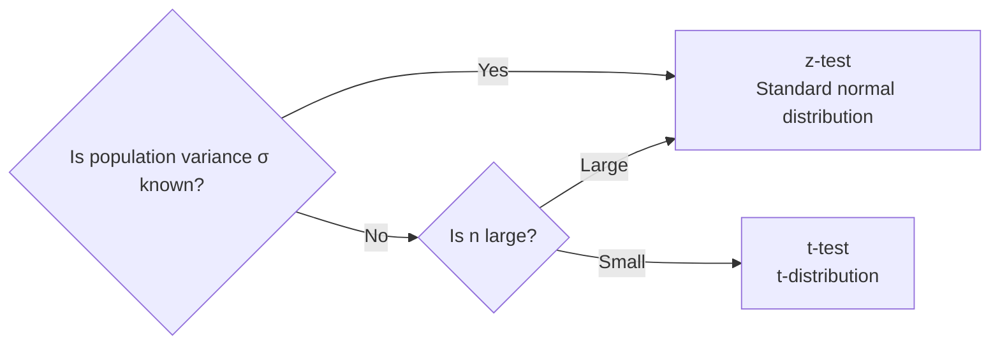

# Central Limit Theorem, t-test, and z-test

## 1. Overview

### A. Definition
> The foundational theory of **statistical hypothesis testing**, which infers the characteristics of a population from statistics obtained from a sample. The **Central Limit Theorem (CLT)** guarantees the normal approximation of the sample mean, and on top of it the **z-test and t-test** decide hypotheses about the population mean.

### B. Background and Necessity
In reality, we cannot survey an entire population, so we observe only a portion of it — a **sample**. The problem is that the sample mean x̄ is a **random variable** that changes each time we draw a sample, and unless we can quantify this fluctuation (sampling error), we cannot judge "whether the difference observed in the sample is a real population difference or mere chance." The Central Limit Theorem opens the door to probabilistically computable inference precisely by guaranteeing that this fluctuation of the sample mean follows **a known form, the normal distribution**. The z-test and t-test are the tools that carry that normal approximation into actual hypothesis decisions. This triangular structure underpins nearly all data-driven decision-making, including A/B testing, quality control, clinical trials, and model performance comparison.

## 2. The Central Limit Theorem (CLT)

### A. Definition and Principle
> The theorem that **regardless of the shape of the population's distribution, if the sample size n is sufficiently large, the distribution of the sample mean x̄ approaches a normal distribution**.

The key point is that it holds "even if the population is not normally distributed." For example, the faces of a die follow a uniform distribution over 1–6, but if you repeatedly take the **mean** of 30 die rolls, the distribution of those means converges to a bell-shaped normal distribution. This is because the sum or mean of many independent factors gathers into a normal shape as the biases of the individual distributions cancel out. Here, the expected value of the sample mean equals the population mean μ, and the spread (standard error) shrinks as **σ/√n**. Because √n is in the denominator, you must increase the sample size fourfold to halve the error — this is the key trade-off in sample-size design.

| Item | Content | Meaning |
|---|---|---|
| **Distribution of sample mean** | Mean μ, standard error σ/√n | Larger n reduces error |
| **Significance** | Normal-based inference possible even with unknown population distribution | Foundation of testing and interval estimation |
| **Empirical condition** | Typically n ≥ 30 | Larger n needed if skewness is large |

## 3. z-test vs. t-test

The fork between the two tests is **whether the population variance σ² is known**. Since it is rare in reality to know the population variance σ² while not knowing the population mean μ, most practical situations involve estimating σ with the sample standard deviation s. Here a problem arises. Because s is itself an estimate that fluctuates from sample to sample, **this uncertainty is added twice over**. The t-distribution is a distribution that reflects this additional uncertainty by making its tails thicker than the normal distribution. The smaller the sample (the smaller the degrees of freedom), the thicker the tails and the more conservatively rejection is made; as n grows, s approaches σ and the t-distribution converges to the normal distribution. That is why, in large samples, the results of the t-test and z-test become practically identical.

| Category | z-test | t-test |
|---|---|---|
| **Distribution used** | Standard normal (z) | t-distribution (degrees of freedom n-1) |
| **Population variance** | Known (uses σ) | Unknown (uses sample standard deviation s) |
| **Sample size** | Presumes large sample (n≥30) | Applicable even to small samples (n<30) |
| **Distribution feature** | Fixed bell shape | Thick tails → converges to normal as n↑ |

The **test statistic** is "the observed difference divided by the standard error": z = (x̄-μ₀)/(σ/√n), t = (x̄-μ₀)/(s/√n). For example, if the sample mean is 52, the null-hypothesis mean μ₀=50, s=8, and n=64, then t = (52-50)/(8/8) = 2.0; if the two-sided p-value of this value under the t-distribution with 63 degrees of freedom is smaller than the significance level (e.g., 0.05), we judge that "there is a difference."

## 4. Types of t-tests

The t-test divides into three types according to the structure of comparison. The **one-sample t-test** examines whether the mean of one group equals a specific reference value (e.g., does a new product's battery life differ from the published spec of 10 hours?). The **independent-samples t-test** compares the means of two unrelated groups and is the standard tool of A/B testing (e.g., the conversion-rate difference between options A and B). The **paired-samples t-test** measures the same subjects before and after a treatment and tests the mean of the differences; by removing the noise of individual variation, it has high statistical power (e.g., a patient's blood pressure before and after medication).

| Type | Use | Example |
|---|---|---|
| **One-sample t** | One group's mean vs. a reference value | Measured value vs. spec |
| **Independent-samples t** | Comparing means of two unrelated groups | A/B testing |
| **Paired-samples t** | Before/after comparison of the same subjects | Effect before/after treatment |

## 5. Considerations and Implications
- **Assumption checking comes first**: The t-test and z-test presume **normality and independence** of the observations, and (when comparing two groups) **equal variance**. If violated, they must be replaced with nonparametric tests such as Welch's t or the Mann-Whitney U so that results are not distorted.
- **Report significance together with effect size**: The p-value tells only "whether the difference is chance," not "whether the difference is practically large." If n is very large, even trivial differences become significant, so an effect size such as Cohen's d and confidence intervals should be reported together.
- **Practical use**: They are used directly for comparing conversion rates in A/B tests, detecting quality deviations in manufacturing processes, and verifying significant performance differences between two ML models, and to be reliable they must be handled together with sample-size design (power analysis).

---

> **In one line**: The CLT guarantees that *when n is large, regardless of the population distribution the sample mean approaches a normal distribution (mean μ, standard error σ/√n)*, and one decides hypotheses about the population mean with the **z-test** if the population variance is known, or the **t-test (t-distribution)** if it is unknown (small sample), while also verifying the normality and independence assumptions along with effect size.
