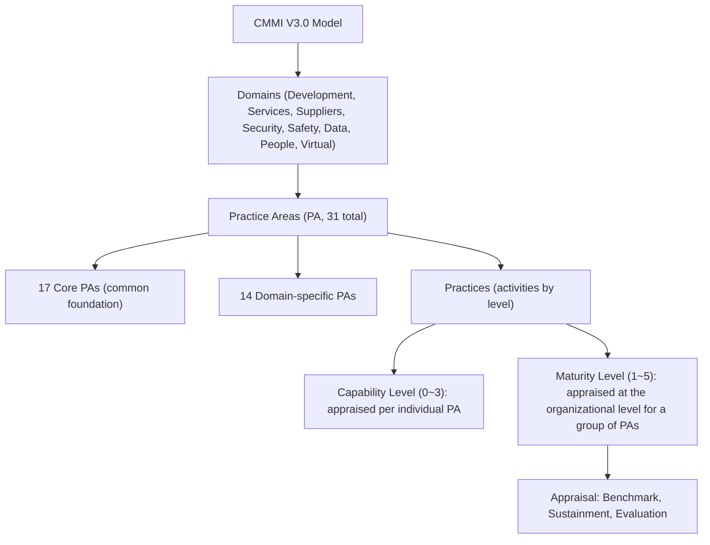
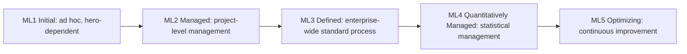

# CMMI (Capability Maturity Model Integration)

## 1. Overview

> **Definition**: CMMI (Capability Maturity Model Integration) is a **performance-oriented process improvement framework** for diagnosing and improving an organization's process capability and maturity in stages; it is a model that systematizes domain-specific best practices — for development, services, supply chains, and more — into a structure of five maturity levels and four capability levels.

Behind CMMI's emergence lies the U.S. Department of Defense (DoD) software procurement crisis of the 1980s. As software for large weapon systems repeatedly overran budgets and schedules and quality could not be guaranteed, the Software Engineering Institute (SEI) at Carnegie Mellon University, with DoD support, researched a way to objectively assess suppliers' process capabilities, and the result was SW-CMM in 1991. Subsequently, as different models such as systems engineering (SE-CMM), integrated product development (IPD-CMM), and workforce management (P-CMM) proliferated, the burden on organizations of having to redundantly apply multiple models grew, and what integrated these into one (Integration) was CMMI 1.1 in 2002.

This trend of integration continued afterward as well: CMMI evolved from separate models (V1.3) along three axes — development (CMMI-DEV), services (CMMI-SVC), and acquisition (CMMI-ACQ) — through V2.0, toward re-integrating these into a single domain system in V3.0. In other words, CMMI's history itself was a process of "converging dispersed best practices into one consistent framework," a response to the practical demand to reduce the inefficiency of organizations redundantly managing multiple certifications.

The fundamental reason CMMI is needed lies in the premise that **the quality of software and systems is subordinate to the quality of the processes that make them**. An organization that depends on the capabilities of outstanding individuals sees performance plummet when key personnel leave, but an organization where process is established maintains predictable quality and schedule even as personnel change. That is, CMMI is an approach that seeks to guarantee performance not through a "hero" but through "the organization's asset-ized process," and from the client's standpoint it becomes an objective yardstick for verifying project-execution capability in advance. In fact, CMMI grades are often required as bid qualifications or bonus-point criteria in public SI, defense, and financial projects at home and abroad, so from a professional engineer's perspective it is a core concept connecting organizational maturity with procurement and quality management.

In 2016 the CMMI Institute was spun off from SEI, and in April 2023 the current owning organization, **ISACA, released CMMI V3.0**, shifting the model's center of gravity from "compliance with documented processes" to **improving business performance**. V3.0 expanded to a total of eight domains by adding Security, Safety, Data, People, and Virtual domains to the existing development, services, and supply chain.

CMMI's key features can be summarized as follows. First, it pursues **staged improvement based on maturity**, letting an organization accumulate capability at a pace it can sustain. Second, it is **methodology-neutral**, so it can be combined with any development approach — waterfall, agile, or DevOps. Third, as a **compendium of best practices**, it provides decades of accumulated industry experience in a referenceable form. Fourth, through **objective appraisal and benchmarking**, it enables comparison across organizations and points in time. These four features make CMMI not a mere checklist but a roadmap of organizational capability.

## 2. CMMI's Overall Structure and Representations

CMMI is a reference model that specifies "what (What)" while leaving "how (How)" to the organization's discretion. At the top are Domains; each domain consists of several **Practice Areas (PAs)**; and a PA holds Practices layered according to maturity/capability levels. A practice describes the "intent" of an activity the organization must perform, and the organization chooses which methodology (Agile, Waterfall, etc.) to implement it with. Thanks to this flexibility, CMMI is not tied to any specific development methodology and can be applied even by agile teams.

As of V3.0, practice areas are divided into **core PAs** used in common across multiple domains and **domain-specific PAs** used only in particular domains. Core PAs contain activities required in common regardless of domain — requirements development, configuration management, verification, validation, risk management, measurement, and so on — while domain-specific PAs contain activities meaningful only in that area, such as security, safety, and data management. Thanks to this modular composition, an organization can adopt only the domains it needs, so an organization that only develops and one that also operates services apply CMMI with different combinations of PAs.

Historically, CMMI has offered two **representations**. The first is **Continuous**, in which the organization selects individual PAs it wants to improve and raises their Capability Level (CL 0–3). For example, an organization weak in configuration management can intensively raise only the "configuration management" PA, giving high freedom of improvement. The second is **Staged**, in which predefined groups of PAs are achieved sequentially by Maturity Level (ML 1–5); it can express the whole organization as a single grade and is advantageous for external communication. The grade referred to when someone says "our company is CMMI Level 3" is the maturity level of the staged representation.

The reason capability level and maturity level differ lies in **the scope of what is appraised**. Capability level looks at how well a single PA is performed and managed, while maturity level looks at how well multiple PAs are jointly established at the organizational level and thus how predictable the organization is overall. Therefore, a specific PA being CL3 does not mean the organization is ML3; ML is granted only when all PAs required by that level are satisfied.

The practical implication of this dual structure is that an organization can **design an improvement roadmap to fit its situation**. For an organization in urgent need of external certification, it is efficient to set an ML target with the staged representation and overhaul the required group of PAs all at once; but for an organization where a specific process (e.g., risk management, configuration management) repeatedly causes incidents, it is more cost-effective to raise the capability level of that PA first with the continuous representation. In other words, CMMI does not force "a single correct answer" but is designed to optimize the order of improvement according to the organization's pain points and business goals.

| Category | Capability Level | Maturity Level |
|------|------|------|
| Unit of appraisal | Individual Practice Area (PA) | Group of PAs (organization/project) |
| Level range | 0~3 | 1~5 |
| Representation | Continuous | Staged |
| Use | Selective improvement of weak PAs | External expression of organizational grade |
| Example | "Achieved CL3 in Requirements Management" | "Enterprise-wide ML3 certification" |

## 3. The Five Maturity Levels and Their Characteristics

Maturity levels can be understood as a ladder by which an organization's processes evolve from "unpredictable chaos" to "a state of continuous self-improvement." Each level presumes the level below it, so none can be skipped, and the higher you go, the greater the degree of quantification and optimization of the process.

An organization at the **ML1 Initial** stage has essentially no defined processes, and success hinges on the capability and dedication of specific individuals. It frequently overruns schedule and budget, and even for similar projects there is large variance in outcomes. The problem is that performance is not reproducible. Even if a team succeeds by chance, that approach does not accumulate as an organizational asset, so the same mistakes are repeated in the next project. For example, a typical situation is doing configuration management differently every time, so that just before release the source versions get mixed up and a deployment failure occurs. ML1 is a "baseline state" that requires no separate practice fulfillment; it is merely a starting point for improvement, not a goal.

At the **ML2 Managed** stage, **project-level basic management practices** take hold — requirements management, project planning, project monitoring, configuration management, measurement and analysis, supplier management, and quality assurance. The core is "discipline." You make a plan, track actuals against the plan, and control the configuration of work products. However, at this stage processes may still differ from project to project, so team A and team B work in different ways. For example, both teams do configuration management, but their tools and branching strategies differ, so a learning cost arises when personnel are reassigned.

The immediate value ML2 gives an organization is "visibility." Once you begin tracking plan and actuals, schedule delays or scope creep surface early, giving managers a chance to intervene. In an ML1 organization, problems explode only when the deadline looms, but in an ML2 organization anomalies are caught in advance through progress data. Still, the limitation is that this visibility is confined to project boundaries, and extending it to the organizational level is the task of the next stage, ML3.

The **ML3 Defined** stage is where **organizational standard process assets (OSSP)** are established, and each project tailors and uses them. Project-to-project variance decreases, and since the whole organization shares a common language and work-product formats, personnel movement and knowledge reuse become easy. **Engineering and organization-level practices** — requirements engineering, technical design, verification, validation, risk management, decision analysis — are strengthened. The reason ML3 is the substantive baseline required in most domestic public SI projects is that from this stage the organization is considered to guarantee predictable and transferable quality.

The decisive difference between ML2 and ML3 lies in the "owner" of the process. In ML2 each project defines its own process, but in ML3 the organization owns the standard and projects tailor and use it. Because of this difference, an ML3 organization can feed lessons learned and measured data obtained after project completion back into the organizational standard, so improvement is not confined to an individual or team but accumulates as an organizational asset. This is why ML3 is seen as the starting point of a "learning organization."

At the **ML4 Quantitatively Managed** stage, key processes and performance are managed with **statistical and quantitative techniques (SPC, etc.)**. For example, control limits are set on metrics such as defect density, review efficiency, and productivity, and a control chart detects special variation early. Unlike ML2/3, which merely "collect" metrics, the decisive difference is that ML4 **statistically analyzes the causes of variation in metrics to build predictive models**. For instance, decisions are made on the basis of quantitative causality such as "increasing review time by 20% statistically significantly reduces field defects."

An important concept here is **distinguishing common cause from special cause**. An ML4 organization statistically separates the natural variation inherent in a process (common cause) from variation due to abnormal events (special cause), responding to the former with process improvement and the latter with cause removal. Without this distinction one commits the error of overreacting to normal variation or missing real problems, so ML4 is a stage reachable only when data literacy is internalized within the organization.

At the **ML5 Optimizing** stage, the process itself is **continuously innovated** on the basis of quantitative understanding. Root-cause analysis (RCA) removes the causes of defects, and new technologies and methods are piloted and, once their effects are verified, reflected into the organizational standard. An organization at this stage does not respond after a problem erupts but proactively evolves its processes on the basis of data.

Thus, maturity stages follow a logical evolutionary path of "control (ML2) → standardization (ML3) → quantification (ML4) → optimization (ML5)." The reason each stage presumes the one below is clear. Attempting statistical management (ML4) without a standard process (ML3) leaves measurement criteria differing from project to project so that data cannot be compared; attempting optimization (ML5) without a quantitative baseline (ML4) leaves the effects of improvement objectively unprovable. That is why CMMI does not allow skipping stages, and this is the methodological rigor of CMMI that distinguishes it from ad hoc improvement.

## 4. Appraisal Methods and the Procedure for Obtaining a Grade

A CMMI grade is granted not by self-declaration but through a **certified Appraisal**. In the past, V1.3 used the SCAMPI (A/B/C) method, and since V2.0 it has been reorganized into three appraisal types according to purpose. Formal grade certification is done via a **Benchmark Appraisal**, which is performed by a Certified Lead Appraiser and whose results are publicly registered. An obtained grade generally has a validity period (a V3.0 benchmark appraisal is about 3 years), and to maintain it one must undergo a **Sustainment Appraisal** or a re-appraisal. For checking internal readiness or partial diagnosis, an **Evaluation Appraisal** is used.

| Appraisal Type | Purpose | Result |
|------|------|------|
| Benchmark | Official grade (ML/CL) certification | Registered/published, given a validity period |
| Sustainment | Maintain/renew existing grade | Grade extension |
| Evaluation | Internal diagnosis/readiness check | Deriving improvement points (informal) |

The actual grade-attainment procedure typically follows the flow of **① Initiation and scoping → ② Gap analysis → ③ Process definition and establishment (pilot, rollout) → ④ Pre-appraisal (preliminary diagnosis) → ⑤ Official benchmark appraisal → ⑥ Grade registration and maintenance**. The most resource-intensive segment is ③, because processes must not merely be created as documents but applied to actual projects to accumulate **objective evidence**. Since appraisers triangulate documents, interviews, and data, a grade cannot be obtained with formalistic documents alone.

**Concrete example (improvement effects seen through a hypothetical scenario)**: Suppose a 200-employee public SI company pursued improvement from ML1 level over three years with ML3 as its goal. Before adoption, this organization had a project on-time delivery rate of about 60%, field defects discovered after delivery occurred in large numbers per KLOC, and rework cost reached 30% of total development cost. As requirements-change management and configuration management took hold in the ML2 establishment stage, release confusion decreased, and as the organizational standard process and peer review took hold in ML3, defects began to be removed early at the upstream (requirements/design) stage. That upstream defect removal greatly reduces downstream rework cost is a well-known principle of software engineering (the later a defect is found, the more its correction cost increases exponentially), and it forms the economic rationale for CMMI improvement. However, since actual figures vary greatly by organization and project characteristics, in an exam answer it is preferable to emphasize the **causal mechanism of improvement** (process discipline → upstream defect removal → reduced rework → improved predictability) rather than absolute values.

## 5. Comparison with Similar Models — ISO/IEC 15504 (SPICE), ISO 9001

Frequently compared with CMMI is **ISO/IEC 15504 (SPICE)**, which has now developed into the ISO/IEC 330xx family. Both models are alike in that they appraise process capability by level, but the fundamental cause of their differences lies in "design philosophy." CMMI, originating in U.S. defense procurement, has strengths in **the compendium of best practices and grade certification (benchmarking)**, whereas SPICE, as an international standard, focuses on **the separation of a process reference model and a measurement framework, and appraising capability level per process**. In practice, there are cases where a SPICE-family standard is effectively required in a specific industry — such as Automotive SPICE in the automotive field — so organizations choose or run models in parallel according to the client's requirements.

The relationship with **ISO 9001 (Quality Management System)** is also important. ISO 9001 addresses organization-wide quality management, whereas CMMI is specialized for software/systems development and service processes, so the two are not substitutes but complements often operated together. For example, a dual system of managing enterprise-wide quality policy with ISO 9001 and the maturity of development processes with CMMI is common.

Also, the fact that the capability-level scales of CMMI and SPICE differ causes confusion in practice. CMMI's capability level is 0–3, whereas SPICE (ISO/IEC 33020) subdivides per-process capability level into 0–5. This difference stems from the two models' differing perspectives on "capability." CMMI treats capability level as a stepping stone for climbing the maturity ladder and thus keeps it relatively simple, whereas SPICE seeks to measure precisely, down to each individual process's predictability and degree of optimization. Therefore, in industries requiring precise per-process diagnosis such as automotive and aerospace, the SPICE family tends to be preferred, while in procurement environments where the whole organization's maturity must be communicated as a single grade, CMMI tends to be preferred.

| Category | CMMI | ISO/IEC 15504 (SPICE) | ISO 9001 |
|------|------|------|------|
| Nature | Maturity/capability reference model | International standard for process capability appraisal | International standard for quality management |
| Unit of appraisal | ML(1~5)/CL(0~3) | Capability level per process (0~5) | Conforming/non-conforming |
| Strength | Grade benchmarking, best practices | Detailed appraisal per process | Enterprise-wide quality management |
| Application example | Defense, public SI bids | Industry-specific such as Automotive SPICE | General-purpose across all industries |

## 6. Advanced — CMMI in the Age of Agile/DevOps and the Performance-Oriented Shift

CMMI was once criticized as "heavy documentarianism" and misunderstood as being at odds with agile. But CMMI is a reference model that specifies "what must be achieved," not a methodology, so its intent can be sufficiently satisfied even with agile practices. For example, Scrum's backlog and burndown chart become evidence of project planning and monitoring practices, and the automated build and test logs of a CI/CD pipeline become powerful objective evidence of configuration management and verification practices. That V3.0 explicitly emphasizes performance and flexibility is a directional shift meant to embrace such modern development environments.

In fact, agile and CMMI are mutually complementary. Agile provides execution tactics for "how to deliver value quickly" but is relatively weak at guaranteeing organization-level consistency and predictability, while CMMI provides the skeleton of organizational maturity but does not prescribe concrete execution methods. Therefore, the combination of executing with agile and diagnosing and improving organizational capability with CMMI is in practice the most powerful. The claim that "we're agile, so we don't need CMMI" is closer to a misunderstanding that confuses the levels of the two concepts.

Going further, CMMI's automated evidence collection opens new possibilities in AI- and data-driven development environments. Because configuration-management history, issue trackers, pipeline logs, and code-review records are already left in digital form, the massive manual documentation burden once spent preparing for appraisals is reduced, and process compliance can instead be monitored continuously with real-time data. This naturally meshes with the quantitative management required by CMMI's higher stages and acts as a catalyst that transforms process improvement from a "periodic appraisal event" into a "continuous operational activity."

Another meaningful change in V3.0 is domain expansion. With the addition of the Data, People, and Virtual domains, contemporary issues such as remote/distributed team operation and data-asset management can now be addressed from a maturity perspective. This reflects the reality of IT organizations reshaped by cloud, data centricity, and hybrid work, and in an exam answer, describing it from the viewpoint that "CMMI is evolving beyond code quality toward encompassing the maturity of the organization's data, people, and collaboration" can effectively reveal the latest trends. However, since the detailed domain composition and number of practices can change with model revisions, it is safer in an answer to emphasize the **direction of performance orientation, flexibility, and expansion** rather than concrete figures.

## 7. Considerations and Implications (Professional Engineer's Perspective)

**First, beware the "certification trap" where obtaining a grade becomes the goal.** When a grade is acquired merely for bid bonus points or marketing while the actual process becomes formalistic, only maintenance cost remains and there is no performance improvement. Whether CMMI adoption succeeds should be judged not by the grade number but by **substantive improvement in business metrics** such as defect rate, on-time delivery rate, and rework cost. V3.0's performance-oriented shift also connects with this awareness. In particular, the practice of neglecting the process right after obtaining a grade and then cramming to restore evidence just before the next appraisal is a representative failure pattern that reduces CMMI to a cost factor, so it must be transformed into a continuously operated system.

**Second, tailoring to fit the organization's size and character is essential.** If a small organization applies a large-enterprise-style heavy process as-is, only bureaucracy deepens. From a trade-off perspective, one must weigh the predictability gained through stronger control against the resulting burden on agility and cost, and selectively apply the necessary practices. For a startup or a small team, improving a few high-pain PAs first with the continuous approach is more realistic and effective than overreaching for an enterprise-wide ML grade.

**Third, since higher maturity (ML4/5) presumes a quantitative-data foundation, up-front investment in a measurement system is needed.** You cannot leap to statistical management without reliable metrics and a data pipeline. In this respect, CMMI's higher stages naturally link with data governance, observability, and DevOps metric systems.

**Fourth, management will and culture for continuous improvement are the critical success factors (CSF).** Since process improvement is not a short-term outcome but an organizational change spanning years, it will not take hold without management sponsorship, an improvement organization (EPG/SEPG), and incentive design. Going forward, CMMI is expected to develop toward combining with agile, DevSecOps, and AI-based development automation to automate evidence collection and performance measurement.

**Fifth, an integrated-operation perspective with related technologies and institutions is needed.** The quantitative management of CMMI's higher stages gains effectiveness when combined with DevOps DORA metrics (deployment frequency, change failure rate, MTTR, etc.), observability data, and data-governance systems. Also, since CMMI grades are used domestically as bid qualifications or technical-evaluation bonus points in public and defense projects, organizations must align procurement strategy with the process-improvement roadmap to maximize the return on investment. Ultimately, CMMI guarantees sustainable performance improvement not as a standalone certification but when operated in mesh with the organization's overall quality-management, data, and automation systems.

Taken together, CMMI is both a "mirror" that diagnoses an organization's process capability and a "map" for improvement. In an exam answer, one should accurately describe the evolutionary logic of the five maturity levels and the distinction between capability and maturity levels, but beyond a simple rote listing, the key to a high score is to unpack causally **why stages cannot be skipped, why performance rather than documents matters, and how it links with agile, DevOps, and data governance**. Related topics include software cost of quality, ISO/IEC 15504 (SPICE), IT governance, and DataOps/DevOps, and studying them together adds depth to the answer.

## References

- ISACA, "ISACA Updates CMMI Model with Three New Domains" (2023): https://www.isaca.org/about-us/newsroom/press-releases/2023/isaca-updates-cmmi-model-with-three-new-domains-that-help-organizations-improve-quality
- ISACA Now Blog, "2023 CMMI Updates Take Performance Improvements to the Next Level": https://www.isaca.org/resources/news-and-trends/isaca-now-blog/2023/cmmi-updates-take-performance-improvements-to-the-next-level
- Wikipedia, "Capability Maturity Model Integration": https://en.wikipedia.org/wiki/Capability_Maturity_Model_Integration

---

> **In one line**: CMMI is a performance-oriented framework that diagnoses and improves an organization's process capability across five maturity levels and four capability levels, guaranteeing quality through asset-ized organizational processes rather than through individuals, and in V3.0 (2023, ISACA) it expanded to include the Security, Data, People, and Virtual domains.
