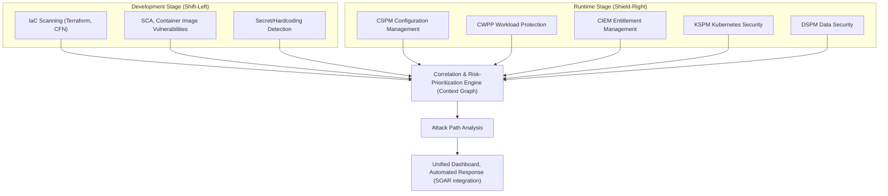
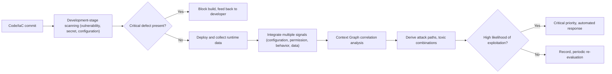

# CNAPP (Cloud-Native Application Protection Platform)

## 1. Overview

> **Definition**: CNAPP (Cloud-Native Application Protection Platform) is an integrated cloud security platform that, across the entire lifecycle of a cloud-native application — from code writing through build, deployment, and runtime — consolidates into a single platform the security functions that were previously dispersed (configuration checking, workload protection, entitlement management, vulnerability scanning, etc.), performs correlation analysis of risks, prioritizes them, and responds.

CNAPP is a concept presented by Gartner in 2021, and it has since rapidly established itself as an integrated category reshaping the cloud security market. To understand the background of its emergence, one must first trace the history of fragmentation that cloud security tools traveled. Early cloud security saw a proliferation of independent products by problem area — CSPM for finding misconfigurations, CWPP for protecting container/VM runtimes, CIEM for taming excessive permissions. Companies naturally adopted point solutions from multiple vendors, and as a result the number of consoles grew to five or six, producing two chronic ailments: "alert fatigue," where alerts pour out separately from each tool, and "broken context," where it becomes impossible to judge which risk is actually serious.

The crux of the problem is that **risks are connected, but the tools are separate**. For example, the single fact of "an internet-exposed container" cannot tell you the severity. But if that container ① contains a library with a remote-code-execution (RCE) vulnerability, ② is granted an IAM role with admin privileges, and ③ can access storage holding customer personal information, then the moment those three facts connect into a single attack path, this becomes a critical risk requiring immediate action. Individual tools report these three only as three separate medium-severity alerts, whereas CNAPP weaves them into a single graph and presents them compressed into "the one critical path that is actually exploitable." In other words, CNAPP's essential value lies not in new detection capabilities but in **the contextualization of risk through integration and correlation analysis**.

The characteristics of the cloud-native environment itself also forced integration. Infrastructure is ephemeral — the average lifespan of a container is only minutes to hours — and with Infrastructure as Code (IaC), infrastructure is created and destroyed in an instant like code, while microservices architecture (MSA) scatters the attack surface across hundreds of services. In such an environment, an approach that checks only after deployment (post hoc) cannot keep pace, so the need grew to perform, on a single platform, both **Shift-Left** — embedding security from the far left of the development pipeline (code/IaC) — and **Shield-Right** — protecting runtime in real time. This became the fundamental driver of CNAPP integration.

## 2. CNAPP's Overall Structure and Integration Architecture

CNAPP takes a structure that stacks individual security domains as layers and then places on top of them a correlation-analysis layer that weaves risks into one. The conceptual diagram below shows which sub-functions CNAPP integrates and how it converges them into a single risk view.

The most important element in this structure is the **correlation-analysis engine** in the center. It normalizes the configuration errors, vulnerabilities, entitlements, and data-sensitivity information collected by the sub-tools into a single graph data model, and connects the relationships among assets (network reachability, permission inheritance, data access) as edges. As a result, individual alerts become nodes, and the paths an actual attacker could tread are visualized. Only with this graph can one identify the few "toxic combinations" where "exposure + vulnerability + permission + data" combine, and concentrate response resources there.

### A. CSPM — Cloud Security Posture Management

CSPM (Cloud Security Posture Management) is the function that continuously checks cloud accounts and resources for **misconfigurations and compliance violations**. Given that a substantial share of cloud incidents arise not from code defects but from simple configuration mistakes such as "a storage bucket left public," "a security group opened to 0.0.0.0/0," or "an unencrypted volume," CSPM becomes the most basic foundation of CNAPP.

CSPM collects a resource inventory through the cloud provider's API and then compares it against policy rules such as the CIS Benchmark, ISO 27017, and the Personal Information Protection Act to find violations. For example, it automatically checks whether object storage blocks public access, whether access logging is enabled, and whether MFA is set on the IAM root account. Going further, a mature CSPM does not stop at mere detection but connects the errors it finds to IaC-template fix suggestions or auto-remediation workflows, reducing the gap between "detection and action."

The practical implication of CSPM lies in **securing visibility**. In a multi-cloud environment it is hard even to grasp where and how many assets exist, and the unified asset inventory CSPM provides becomes the starting point for all subsequent security activities. However, since CSPM alone cannot answer the question "the configuration is wrong, but is it actually exploitable?", combination with other layers is essential.

### B. CWPP — Cloud Workload Protection

CWPP (Cloud Workload Protection Platform) protects **the interior of running workloads** such as VMs, containers, and serverless functions. If CSPM looks at the infrastructure's "outward appearance (configuration)," CWPP can be likened to guarding the workload's "insides (runtime behavior)."

CWPP's activities divide broadly into two points in time. First, at build time, it scans for OS-package and open-source-library vulnerabilities (CVEs), malware, and hardcoded secrets inside container images. Second, at runtime, it plants a lightweight agent or an eBPF-based sensor in the workload to detect and block, in real time, abnormal process execution, unexpected outbound connections, file-integrity tampering, and privilege-escalation attempts. For example, if a web-server container suddenly spawns a shell and runs a cryptocurrency-mining process, this is judged to deviate from the normal-behavior baseline and is immediately quarantined.

The reason CWPP matters is **the mass influx of supply-chain vulnerabilities**. Since modern applications lean most of their code on open-source dependencies, a single popular library's vulnerability (e.g., the Log4Shell type) can spread to countless workloads in an instant. CWPP filters this at the image stage and defends at runtime against what slips through — a double safety net.

### C. CIEM — Cloud Infrastructure Entitlement Management

CIEM (Cloud Infrastructure Entitlement Management) is the function that identifies **over-privileged access** and adjusts it toward least privilege. Given that a substantial share of cloud breaches spread through stolen credentials and the broad permissions attached to them, CIEM is a core control that reduces "the blast radius of an attack."

In the cloud, not only human accounts but non-human (machine) identities such as services, roles, and functions explode in number, and "privilege creep" — where broad permissions are attached to them for convenience — is rampant. CIEM analyzes actual usage logs to find "permissions that were granted but never once used" and recommends reclaiming them. For example, if a deployment-automation role has been granted permission to delete all storage but in practice only reads a specific bucket, CIEM quantitatively surfaces the surplus permission and supports establishing a least-privilege policy.

The practical implication of CIEM lies in **providing the key edges of the attack-path graph**. For the correlation engine to draw a path of "exposed workload → excessive permission → sensitive data," permission-relationship data is indispensable, and without this data the contextualization of risk is incomplete.

### D. KSPM, DSPM, and Integration with the Development Stage

KSPM (Kubernetes Security Posture Management) specializes the concept of CSPM for the Kubernetes domain, checking for excessive RBAC permissions, privileged containers, unconfigured network policies, insecure Pod security standards, and the like. As container orchestration became effectively the standard, KSPM established itself as an essential component of CNAPP.

The need for KSPM comes from Kubernetes's characteristic that "the default is itself a risk." For example, there is by default no network policy blocking inter-namespace communication, so once one Pod is breached, lateral movement to the entire cluster becomes possible. KSPM continuously checks such dangerous default settings, excessive ServiceAccount permissions, and allowing unsigned images, narrowing Kubernetes's unique attack surface.

DSPM (Data Security Posture Management) grasps the location, sensitivity, and access rights of data scattered throughout the cloud, answering "which data, where, is exposed to whom." When DSPM is combined, weight can be assigned to the endpoint of an attack path (the data), making risk prioritization far more refined. For example, of two workloads equally exposed to the internet, if one can access only temporary logs and the other can reach a table holding resident registration numbers, DSPM elevates the latter to an overwhelmingly higher risk. In addition, CNAPP connects all of these runtime controls to the **development stage (IaC scanning, SCA, secret detection)**, completing Shift-Left, which blocks misconfigurations in the pipeline before they are deployed.

## 3. The Risk-Prioritization Process and Attack Path Analysis

CNAPP's operation should be understood not as pouring out individual alerts but as a pipeline that correlates the collected signals and compresses them into a few actionable risks. Below is a detailed process diagram showing the flow from code to response.

The noteworthy point in this process is **the basis for calculating risk priority**. Traditional vulnerability management assigned severity by CVSS score alone, leading resources to be wasted even on vulnerabilities that are theoretically dangerous but in practice unreachable. CNAPP, by contrast, combines — as if multiplying — CVSS with **① internet exposure, ② the existence of actual exploit code (e.g., checking against a list of known exploited vulnerabilities), ③ the permissions granted to the workload, and ④ the sensitivity of the accessible data** to compute the effective risk. As a result, of thousands of alerts, those actually requiring urgent action are often narrowed to just about 1–5%, and the security team can concentrate on this handful, dramatically raising response efficiency.

Attack Path Analysis is the pinnacle of this correlation analysis. For example, if in some financial-sector cloud there exists just one path leading "an externally open load balancer → a vulnerable web container → an admin-privileged IAM role → a customer account-information database," CNAPP draws and shows it as a red line. At this point the defender can intuitively see that severing any single point on the path (e.g., reclaiming the excessive IAM permission) neutralizes the entire path, and can thus take a "choke point" strategy that achieves maximum defensive effect at minimum cost.

## 4. Comparison of Components and Before/After Integration Cases

The sub-functions that make up CNAPP are mutually complementary because their protection targets and timing differ. The table below compares the focus of each component, while the reason for the differences — which the table alone does not reveal — is described in the paragraphs that follow.

| Component | Protection Target | Core Question | Main Timing |
|---|---|---|---|
| CSPM | Cloud configuration/posture | "Is the configuration correct?" | Runtime (continuous checking) |
| CWPP | Workload interior | "Is there a threat during execution?" | Build + runtime |
| CIEM | Identity/permissions | "Are permissions excessive?" | Runtime (continuous checking) |
| KSPM | Kubernetes cluster | "Is the K8s configuration safe?" | Runtime |
| DSPM | Data | "Is sensitive data exposed?" | Runtime |
| IaC Scanning | Infrastructure as code | "Are there defects before deployment?" | Development (Shift-Left) |

The difference between these being separate products and being integrated goes beyond mere management convenience. Before integration, CSPM raised a "public bucket" alert, CWPP a "vulnerable container" alert, and CIEM an "excessive permission" alert, each in a different console, so a person had to manually stitch together the fact that the three were actually a single attack path. In a large-scale environment this is practically impossible, and as a result real risks were buried in thousands of noise items. After integration, those same three signals merge into a single graph and are elevated to "one critical path," so the response target becomes clear and mean time to detect/respond (MTTD/MTTR) is greatly shortened.

As a concrete example, suppose an e-commerce company operated five point solutions and suffered tens of thousands of alerts a month. After adopting CNAPP, correlation analysis compressed the risks actually requiring action to the level of dozens, and as IaC scanning was grafted onto the pipeline, a substantial portion of misconfigurations was filtered out before deployment. This shows that CNAPP's true achievement is not "an increase in the volume of detection" but "an increase in the accuracy of action." However, since such figures vary greatly by environment and maturity, it is reasonable to understand them as a direction of improvement rather than absolute values.

One more point to keep in mind is that CNAPP does not replace SIEM, SOAR, or XDR. If SIEM stores and analyzes the entire organization's logs long-term and XDR focuses on detection and response across endpoints and networks, CNAPP provides the unique field of view of "the configuration, workload, permission, and data context of the cloud-native environment." In practice, the standard approach is for CNAPP to pass the high-risk events and attack-path information it has refined to SIEM/SOAR to integrate them into the enterprise-wide SOC response workflow, and understanding this complementary structure is the key to correctly positioning CNAPP.

## 5. Advanced — Latest Trends and Practical Adoption Strategy

The CNAPP market is evolving in a few distinct directions. First, **the parallel use of agentless and agent-based approaches**. Early on, an agent had to be installed on each workload, making adoption burdensome, but recently a hybrid model has taken hold that secures broad visibility without agents via snapshot-based scanning and adds agents only on the critical workloads that need real-time blocking. This is an attempt to resolve, in practice, the trade-off between coverage (breadth) and defense in depth (depth).

Second, **ASPM (Application Security Posture Management) and code-to-cloud linkage**. The flow is strengthening in which vulnerabilities found at runtime are traced back to the source-code commit, developer, and pipeline that produced them, closing the feedback loop so problems are fixed at the source. This means CNAPP is expanding beyond a mere operational-security tool into the backbone of DevSecOps that connects development, security, and operations.

Third, **the incorporation of generative AI**. Features are spreading whereby, if you query in natural language "show me workloads that are internet-exposed and have admin privileges," the system searches the graph and responds, and automatically suggests, as an IaC patch, how to remediate the risks it finds. However, since applying AI-suggested auto-remediation to production without verification can cause service outages, placing a human-approval step is common sense in practice.

From a domestic perspective, demand for CNAPP is growing in tandem with public- and financial-sector cloud transitions (CSAP grade requirements, the trend of relaxing network separation), and it is also used for compliance reporting that automatically evidences, in the cloud, the safety-assurance measures and access-control requirements under the Personal Information Protection Act. Likely exam directions include descriptive questions on ① the relationship of CNAPP to SIEM/SOAR/XDR (complementary, not a replacement), ② the distinction and integration need of CSPM/CWPP/CIEM, and ③ the principles of Shift-Left and attack path analysis. In composing an answer, a logical progression of "raising the fragmentation problem → the solution of integration and correlation analysis → the role of each component → convergence into attack paths → adoption strategy and limitations" carries persuasive force.

## 6. Considerations and Implications

From a professional engineer's perspective, CNAPP adoption should be approached not as a product choice but as a redesign of the security operating model. First, **on the adoption-strategy side, a staged maturity roadmap** is needed. Turning on all features from the start paralyzes operations with an alert flood, so one should gradually expand in the order of securing visibility (CSPM) → contextualizing risk (CIEM, attack paths) → integrating the development pipeline (Shift-Left) → automated response, tuning for false positives at each stage.

Second, **on the trade-off side, one must manage the tension between coverage and depth, and between integration and optimization**. Agentless is broad but weak at real-time blocking; agents are powerful but carry heavy performance and operational burden. Also, a single-vendor CNAPP has smooth correlation analysis but may fall short of specialized point solutions in the functional depth of specific areas, so one must weigh the benefits of integration against the benefits of individual optimization according to the organization's risk profile. Vendor lock-in and the scope of multi-cloud support must also be reviewed.

Third, **on the governance and organization side, clarifying the shared responsibility model** must be a prerequisite. However excellent CNAPP is, if the boundary of responsibility between the cloud provider and the user is ambiguous, blind spots arise. Furthermore, to translate the risk priorities CNAPP produces into actual action, a collaboration system among development, security, and operations teams (e.g., designating risk owners, SLA-based action deadlines) must be designed together.

Fourth, **on the outlook and related-technology side, CNAPP converges with Zero Trust, DevSecOps, and platform engineering**. Least privilege (CIEM) links naturally with Zero Trust's identity control, Shift-Left with DevSecOps's pipeline security, and self-service security guardrails with platform engineering's internal developer platform (IDP). Therefore, CNAPP will position itself not as an isolated island but as an integrating axis running through the entire cloud security architecture, and it is expected to develop with SIEM/SOAR/XDR not in competition but in a complementary relationship that supplies cloud context.

## References

- Gartner Glossary, "Cloud-Native Application Protection Platforms (CNAPP)": https://www.gartner.com/en/information-technology/glossary/cloud-native-application-protection-platforms-cnapp
- Cloud Security Alliance (CSA): https://cloudsecurityalliance.org/
- NIST, "Application Container Security Guide (SP 800-190)": https://csrc.nist.gov/pubs/sp/800/190/final

---

> **In one line**: CNAPP is a cloud-native integrated security platform that consolidates fragmented cloud security functions such as CSPM, CWPP, CIEM, KSPM, and DSPM, correlates risks, and prioritizes and responds centered on the actually exploitable attack paths from code through runtime.
