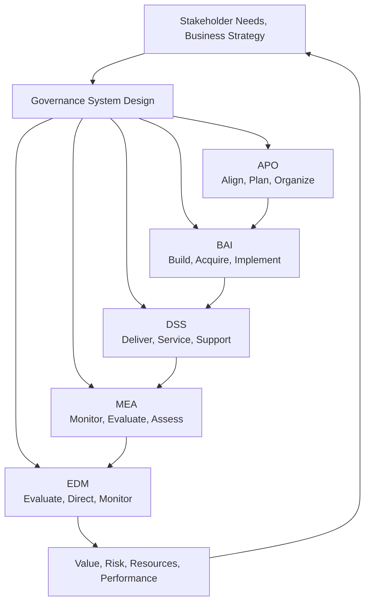
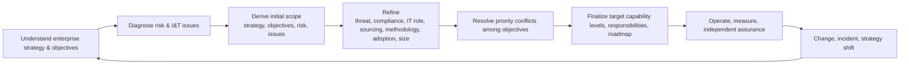

# Designing and Implementing IT Governance Based on COBIT 2019

## 1. Overview

> **Definition**: COBIT 2019 is ISACA's framework for designing, operating, and evaluating a governance system and a management system so that an enterprise's information and technology (I&T) creates value for stakeholders.

In enterprises, information technology has become a business capability directly tied to products, work processes, customer experience, and regulatory compliance, beyond merely a support function that operates systems. However, the technology department delivering services quickly alone does not guarantee the return on investment. Which technology investments to prioritize, to what level to accept risk, who bears responsibility for outages and privacy breaches, and how to control external providers must all be connected to management decision-making.

COBIT 2019 does not try to solve this problem with a specific product or a single control list. It first grasps the enterprise's strategy, objectives, risks, regulatory environment, and the manner and scale of technology adoption, and then prioritizes 40 governance and management objectives and their components to fit the enterprise's situation. It is therefore suited to an approach that concentrates on important risks and value flows, rather than a small organization applying all objectives at the same level.

Governance and management differ in the direction of responsibility. Governance is the activity of the board and top management that evaluates stakeholder needs, sets direction, and monitors performance and compliance status. Management is the activity of executives and practitioners who plan, build, run, and improve according to the set direction. Confusing the two areas causes problems such as the board directly handling operational tickets or practitioners independently deciding investment priorities.

From a professional engineer's perspective, the core of COBIT 2019 is not the declaration of having adopted the framework but the connection of decision-making and control. Business objectives must be translated into I&T objectives, objectives connected to processes and responsibilities, and control performance left as measurable evidence. Moreover, the documents for audit response and the operational procedures for actual service quality must operate within the same system.

This article organizes COBIT 2019's principles and core model, design factors, objective system, implementation procedure, relationship with other standards, and considerations for practical application at the level of an essay-type answer.

## 2. The Basic Structure of the COBIT 2019 Governance System

### A. Separation of Governance and Management

Governance is responsible for "what to do and why." The board or top management evaluates and decides on the investment portfolio, the level of risk acceptance, the direction of regulatory compliance, and resource allocation. Management provides direction so that those decisions are consistent with the organization's strategy, and continuously monitors performance and risk against plan.

Management is responsible for "how to execute the decided direction." Activities such as designing architecture, running projects, operating services, contracting with suppliers, and handling incidents belong here. Managers must translate the performance, risk, and compliance criteria set by the governance body into the plans and controls of day-to-day work.

This distinction is not merely a matter of dividing the org chart into two. For example, when pursuing a cloud transition, the board decides the transition's strategic value and the extent of risk acceptance, and management creates the target architecture, budget, and roadmap. The operations team performs the actual migration and monitoring, but the operations team must not arbitrarily change whether a business risk is acceptable.

There must be feedback between governance and management. When cost overruns, increased outages, or regulatory violations are found in management results, the manager reports the causes and alternatives, and the governance body readjusts objectives and the limits on resources and risk. If only one-way reporting exists, objectives become detached from reality, so metrics and decision-making meetings must have a circular structure.

### B. The COBIT Core Model and the Five Domains

COBIT 2019's core model provides one generic reference model but does not force identical controls on every enterprise. The model's purpose is to provide a common language and a traceable structure. An enterprise takes this structure as a starting point, selects the important objectives, and defines target capability levels and control evidence for the objectives it needs.

EDM (Evaluate, Direct and Monitor) is the domain where governance objectives are gathered. It evaluates stakeholder needs, directs strategic options, and monitors performance and compliance status. EDM's outputs are not a list of operational tasks but management's decisions on investment direction, risk acceptance, resource utilization, and stakeholder transparency.

APO (Align, Plan and Organize) is the management domain that aligns information and technology with the organization's strategy, structure, workforce, and supply chain. Strategy, enterprise architecture, innovation, portfolio, budget, risk, security, and data and workforce planning are connected. The key is not to end at making a plan but to place actual resources and responsibilities so it becomes executable.

BAI (Build, Acquire and Implement) is the domain that acquires and develops solutions and, through change, embeds them into the work. It handles programs and projects, requirements, change, assets, configuration, knowledge management, and more. Where BAI's controls are weak, gaps in quality, security, and traceability arise between planning and operation.

DSS (Deliver, Service and Support) is responsible for the day-to-day operation of services. Operations, service requests and incidents, problems, continuity, security services, and business-process controls are included. Operational metrics must be linked not to mere uptime but to recovery time, recurrence rate, user impact, and the quality of security detection and response.

MEA (Monitor, Evaluate and Assess) is the domain that checks internal controls, external requirements, and performance and conformance. It distinguishes self-assessment from independent assurance and confirms whether the remediation of findings has actually been closed. The purpose cannot be achieved by writing audit reports alone; improvement actions must be reflected back into governance decision-making.

| Domain | Role | Representative Question |
|---|---|---|
| EDM | Governance | Who decides the direction of investment, risk, and performance? |
| APO | Align, Plan | How are strategy and I&T resources/architecture connected? |
| BAI | Build, Change | By what criteria are solutions built and embedded into the work? |
| DSS | Operate, Support | At what level are services and incidents delivered and recovered? |
| MEA | Evaluate, Assure | How are the evidence of performance and compliance evaluated and improved? |

The domains in the table are not a sequential division of departments. For example, privacy-protection requirements start in APO's risk/security planning, continue into BAI's design/change controls, are operated by DSS's access/incident response, and are verified by MEA's compliance evaluation. Even if you assign an owner per domain, you must also design the inputs/outputs among objectives and the handoff points of responsibility.

## 3. COBIT 2019's Principles and Components

### A. Principles of the Governance System

COBIT 2019 emphasizes systematic and dynamic governance to meet stakeholder needs, the separation of governance and management, an end-to-end view that includes all of the enterprise's organizational functions, a single integrated framework, a holistic view, and tailored design to fit needs. These principles are less a checklist than the perspectives that must not be omitted at design time.

The holistic view guards against the notion that controls will work if only processes are well made. If a process has no owner, if a committee does not make decisions, if the necessary data is absent, or if members' behavior conflicts with the reward system, a documented process does not translate into actual performance. A professional engineer must analyze not only procedures but also organizational structure, information flows, culture, and capability together.

The end-to-end view does not confine I&T governance to the internal quality activity of the IT department. In an environment where business units directly purchase SaaS, partners process data, and customer channels call APIs, I&T risk crosses organizational boundaries. Only by including enterprise governance, business processes, and the external supply chain do the responsibility for decisions and the actual location of risk align.

The tailored-design principle reduces the waste of the "adopt all of COBIT" approach. A financial institution's regulation and cyber risk differ from a manufacturer's operational-technology risk, and a startup's speed differs from a large enterprise's segregation-of-duties controls. Even for the same objective, the required capability level, the frequency of evidence, the layers of approval, and the degree of automation may differ.

### B. The Seven Governance-System Components

The governance system consists of principles and policies; processes; organizational structures; information; services, infrastructure, and applications; people, skills, and competencies; and culture, ethics, and behavior. Some sources translate the components' names differently, but the key is that governance is not explained by processes alone.

Principles, policies, and frameworks create the boundaries of decision-making. They must come down to rules that members can judge by, such as a cloud-usage policy, a data-classification policy, change-management criteria, and outsourcing criteria. If policy remains a declaration, there are no exception and approval criteria, so arbitrary field interpretation increases.

Processes define the repeatable activities and inputs/outputs/controls to achieve objectives. Process maturity is judged not by the volume of documents but by whether the actual work is reproduced, exceptions are recorded, and results are measured. Automated approval flows and ticket evidence are means to make process execution visible.

Organizational structures are the arrangement of decision authority and responsibility. If the authority of the board, risk committee, data committee, architecture committee, CISO, CIO, and business-unit product owner overlaps or has gaps, control speed slows. When building a RACI, distinguish the responsible party from the approver, and make the ultimate risk-acceptance authority clear.

Information is the fuel that makes governance work. If portfolio status, the risk register, asset/configuration information, SLAs, incident metrics, and audit results use differing definitions, the reliability of management reporting drops. You must set data owners, quality criteria, update cycles, and retention periods, and standardize the calculation formulas of the metrics.

Services, infrastructure, and applications are the technical resources that deliver actual value. Do not look only at availability; define recoverability, security, scalability, interoperability, and cost efficiency as service levels. When the service catalog and configuration-management data are connected, one can quickly judge the impact scope of an outage and the risk of a change.

People, skills, and competencies are the ability to perform the planned controls. For example, even with a cloud-security policy, if the competency of IAM designers, log analysts, and incident responders is lacking, controls are formalistic. It is important to confirm actual role performance, training results, and the possibility of rotation/backup, rather than the training completion rate.

Culture, ethics, and behavior govern control circumvention and reporting delays. In a culture that hides outages, uptime metrics may look good while latent risk accumulates. An environment where reporting a mistake leads to learning and improvement, and a reward system that evaluates security and privacy alongside delivery deadlines, are needed.

### C. The Hierarchy of Objectives and Management Practices

Each governance and management objective is made concrete through its purpose, related metrics, performed practices, and the relationship of responsibilities and inputs/outputs. An objective does not end abstractly, like "strengthen security," but must describe a state in which security services are provided and monitored in line with an approved risk level and policy.

Performed practices are the detailed activities to perform in order to achieve an objective. For example, in a change-management objective, the classification of change requests, impact analysis, approval, testing, deployment, post-implementation review, and the exception procedure for emergency changes must all be connected. Leaving approval records, test results, deployment logs, and post-implementation reviews as evidence of the activities can support both audit and operational improvement at once.

An objective's metrics must distinguish activity volume from results. Increasing only the number of training sessions or reviews may not reduce incidents. Therefore, alongside the control-performance rate, place result metrics such as the recurrent-incident rate, the proportion of unapproved changes, the mean time to remediate vulnerabilities, and service-impact time.

## 4. Design Factors and Tailored Governance Design

### A. The Meaning of Design Factors

COBIT 2019's design factors are the inputs for adjusting priorities and target capability levels rather than applying the enterprise's governance system uniformly. On the basis of strategy and objectives, the risk profile, and I&T-related issues, one sets an initial scope, and then refines the scope by considering the threat landscape, compliance requirements, the role of IT, the sourcing model, the implementation method, the technology-adoption strategy, and enterprise size.

Design factors are not mere survey scores. Each value must have a rationale. For example, if you assessed the threat landscape as high, connect evidence such as recent attacks, exposed assets, threat intelligence, and industry-specific attack trends. If you chose an outsourcing-centric sourcing model, review together the audit rights in the contract, subcontracted processors, service levels, and termination/handover plans.

### B. The Design Workflow

The first step is to understand the enterprise's strategy and objectives. Analyze what results the expressions of strategy — cost efficiency, growth, customer trust, regulatory compliance, resilience, and so on — demand of I&T. At this step, looking only at the IT department's current project list can leave you at the level of justifying already-started projects, so you must start from business performance and stakeholder expectations.

The second step is to set the initial scope. Narrow down the important objectives through strategy, enterprise objectives, the risk profile, and current I&T issues. For example, in an organization where digital financial services are core and authentication failures and privacy breaches are the major risks, the priority of security, continuity, incident, and data objectives may rise.

The third step is refinement. Depending on whether it is a regulated industry, whether IT is core to the business, whether most is dependent on external clouds, whether deployment is fast via agile/DevOps, and whether it leadingly adopts the latest technology, the way the same objective is controlled changes. If the enterprise is small, roles can be combined, but the compensating controls for mutual review and independence must be specified.

The final step is to resolve priority conflicts. Strengthening security approvals slows deployment speed, and increasing data retention improves analytical convenience while raising privacy risk. Do not hide conflicts; record the assumptions of risk, cost, and value, and decide the ultimate risk acceptor and the review point.

### C. Deliverables When Applying Design Factors

The result of the design workshop must be a governance design document, not a mere scoresheet. At minimum, it includes the linkage of enterprise objectives and I&T objectives, a list of priority objectives, target capability levels, the responsible organizations, key controls, evidence, expected cost, and a phased roadmap.

| Deliverable | Key Content | Review Point |
|---|---|---|
| Context diagnosis | Strategy, size, risk, regulation, current issues | Are facts and opinions distinguished? |
| Objective priorities | Focus targets among the 40 objectives and reasons | Is there a risk/value rationale? |
| Capability-level definition | Current and target level per objective | Is there a realistic plan to raise the level? |
| Responsibility matrix | Roles of board, management, practitioners, suppliers | Is the risk acceptor clear? |
| Control/evidence list | Activities, metrics, approvals, logs, reports | Is evidence generated automatically? |
| Execution roadmap | Quick wins, mid-term builds, continuous improvement | Are dependencies and budget reflected? |

If you do not distinguish the current level from the target level, only the declaration "we will achieve maturity 4" remains. When setting the target level, review together the legal minimum requirements, business impact, risk-reduction effect, required capabilities, and feasibility of automation. Rather than unconditionally assigning the highest level to high-risk objectives, you must explain, so management understands, the cost of raising the level and the residual risk.

## 5. Target Capability Levels and Performance Measurement

### A. Interpreting Capability Levels

COBIT 2019's process capability is a perspective for judging the degree to which activities are performed and the level of management, measurement, and improvement. At low levels, work may depend on individual experience, but as the level rises, standardization, measurement, prediction, and continuous improvement are strengthened. Rather than the number itself, you should look at whether the organization can stably reproduce results.

Capability-level assessment must not be decided solely by whether documents exist. Confirm whether policy, execution records, sample tests, interviews, metric trends, exception handling, and improvement actions are consistent with one another. If policy exists but unapproved changes recur, the document level and the execution level differ, so reflect that gap in the audit conclusions and improvement plan.

Raising the current level is not only about adding headcount. There are methods of embedding repetitive work into systems, such as standard APIs and automated policy validation, approval gates in the deployment pipeline, central logs, and a service catalog. However, since automation can rapidly spread a wrong policy, you must design the review and rollback of policy changes together.

### B. Layering of Metrics

Performance management must divide management metrics, managerial metrics, and operational metrics into layers. Management looks at business value, risk exposure, regulatory compliance, and the resilience of core services; managers look at the variances of projects, services, and suppliers. Operators use execution metrics such as per-incident response time, deployment failures, and vulnerability remediation.

For example, a metric of "service availability 99.9%" is insufficient as a monthly overall average alone. You must distinguish availability during important transaction time windows, the customer impact of outages, whether recovery targets were met, and interruptions due to planned changes. Even for the same metric, if the definition and denominator differ, cross-department comparison is distorted, so manage the calculation formula centrally.

Risk metrics do not look only at the number of events that occurred. Include leading indicators such as the proportion of critical assets without multi-factor authentication, exposure to end-of-support software, the mean time to remediate high-risk vulnerabilities, the success rate of recovery drills, and the proportion of incomplete supplier reviews. Looking at post-incident metrics and preventive metrics together allows early detection of the direction in which risk is growing.

### C. Independent Assurance and Self-Assessment

Managers routinely perform self-assessments, while independent internal audit or third-party assurance reviews the bias of self-assessment and the adequacy of control design. The two activities are not in competition. If self-assessment is accurate, the scope of independent assurance can be concentrated on high-risk areas.

Assurance results must not stop at the dichotomy of conforming/non-conforming but include the risk's severity, business impact, likelihood of recurrence, and the responsible party and deadline for remediation. Do not close on the report of remediation completion alone; perform retesting and effectiveness verification. A repeat finding may be a problem of objective/organization/process design rather than an individual's mistake.

## 6. Implementation Procedure and Operating Model

### A. Preparation and Scoping

The first step of implementation is not framework training but defining the problem and purpose. Clarify drivers such as excessive cost, repeated outages, regulatory-audit findings, project failures, and supplier dependence, and estimate the business impact of not resolving them. The sponsor should not be limited to one CIO; business, risk, finance, and security leaders must participate.

Scope can be set as the whole enterprise or a single core service. Addressing all 40 enterprise-wide objectives from the start increases field resistance and the documentation burden. Conversely, too narrow a scope can miss the risks of adjacent systems and suppliers, so define the boundary based on the service value chain and data flows.

### B. Current-State Diagnosis and the Target Model

In current-state diagnosis, first confirm existing assets such as ITIL, ISO/IEC 27001, ISO/IEC 38500, PMBOK, internal controls, and the privacy-protection management system. Rather than making COBIT a separate, redundant control system, it is efficient to connect existing activities to COBIT objectives.

For example, ITIL's incident-management procedure can be connected to DSS02, and the information-security management system's risk assessment and access control can be connected to APO12, APO13, and DSS05. Do not merely map by name; compare the objective's intent, responsibility, frequency of performance, evidence, and gaps.

Gap analysis is useful when divided into documentation gaps, execution gaps, and performance gaps. A documentation gap is a state with no policy, procedure, or role; an execution gap is a state where a procedure exists but is not performed. A performance gap is a state where performance occurs but the desired risk reduction or service performance does not result, and it may require redesign of automation, resources, or target values.

### C. Phased Execution and Change Management

Quick-win tasks are selected in areas that are high-risk and where the effect is easy to measure. For example, tasks such as privileged-account review, recovery drills of critical services, blocking unapproved changes, expiring external-supplier access, and designating owners of key data allow results to be confirmed on a short cycle.

Mid-term tasks are foundations that connect multiple organizations, such as a service catalog, configuration management, an integrated risk register, a performance dashboard, and policy automation. These tasks must not be built as technology alone; you must also decide data definitions, responsibilities, exception approvals, and operating costs.

Change management does not end with distributing training materials. Explain to the field, in terms of business impact, why they must approve and record, and provide the experience that the new process is faster or safer than the old. If quality, security, and recovery results are not reflected in evaluation and rewards, behavior can regress to valuing only delivery deadlines.

## 7. Case: Governance of a Financial Company's Digital Channel

Suppose a financial company, while expanding its mobile lending channel, adopts both cloud and external AI services. The business objectives are shortening screening processing time and improving customer convenience, but privacy leakage, model bias, service outages, third-party re-subcontracting, and regulatory violation become the major risks.

First, the governance body decides which tasks require automation and which require human review. The auxiliary function of AI detecting missing documents and the function of making the final decision on credit approval differ in tolerable error and responsibility, so they are not bundled under the same control. The case where a change in model and data affects screening results is defined as a major change.

At the APO stage, data classification, risk assessment, external-supplier conditions, model-management principles, and service levels are designed. At the BAI stage, requirements include minimal collection of personal data, explainability, and audit logs, and independent review is placed over model and API changes. At the DSS stage, outages, incidents, complaints, and false positives are operated; at the MEA stage, evidence of model performance and regulatory compliance is evaluated periodically.

Operational metrics are not set by mean approval time alone. Look together at channel availability, the screening hold rate, the manual-review conversion rate, error differences by subgroup, anomalies in personal-data access, supplier SLA violations, and recovery-drill results. If speed improved but errors for a particular customer group grew, the governance objective cannot be considered achieved.

What matters in this case is not applying many COBIT objectives. It is defining the business's core value and risks and connecting the objectives, responsibilities, and evidence that reduce those risks. The same design approach can be applied to public services, manufacturing operational technology, and healthcare data platforms, but the values of the design factors and the target capability levels must differ.

## 8. Comparison of COBIT 2019 with Related Standards/Frameworks

COBIT 2019 provides the overall structure of governance and management, whereas other standards provide deeper guidance for a specific purpose or area. Therefore, rather than choosing one and discarding the rest, it is realistic to view COBIT as the higher-level alignment/evaluation structure and place the detailed controls of existing standards onto the objectives.

| Category | COBIT 2019 | ISO/IEC 27001 | ITIL 4 | ISO/IEC 38500 |
|---|---|---|---|---|
| Primary purpose | I&T governance/management system | Information-security management system | IT service management | Corporate IT governance principles |
| Scope | Value, risk, resources, performance and the full lifecycle | Information-security risk and controls | Service value creation and operation | Board-level evaluate/direct/monitor |
| Strength | Integration of design factors, objectives, capability, and assurance | A certifiable ISMS structure | Service-operation practices and value flows | Clarifying the accountability of top decision-makers |
| Application method | Tailored application after prioritization | Risk-based control selection | Combination of service-management practices | Management decisions per principles |

The difference between COBIT and ISO/IEC 27001 is not superiority but the level of abstraction and purpose. Beyond security, COBIT connects investment, architecture, portfolio, projects, operations, and assurance. ISO/IEC 27001 is strong at managing information-security risk and proving the continuous improvement of the management system, so it can provide COBIT's security/risk objectives with detailed controls and audit evidence.

COBIT and ITIL 4 also do not compete. ITIL makes concrete the service-management practices so that services co-create value, and COBIT, from a governance perspective, adjusts whether that service management fits enterprise objectives and the direction of risk/compliance. Connecting ITIL's incident-management metrics to COBIT's performance/risk reporting elevates operational improvement into management decision-making.

ISO/IEC 38500 emphasizes the principle that the board must evaluate, direct, and monitor IT. It can naturally link with COBIT's EDM domain, but COBIT extends that principle down to management objectives, components, and capability/evidence levels. A professional engineer must integrate responsibilities and governing bodies so as not to create redundant committees and double reporting.

## 9. Advanced: Applying COBIT in the Cloud/AI Era

In a cloud environment, even if assets are not in the organization's data center, governance responsibility does not disappear. You must specify in contracts and operational procedures the configuration and logs of software-as-a-service, the location of data processing, the subcontracting structure, the return/deletion of data upon termination, and recovery responsibility. The shared-responsibility model only explains the boundary of responsibility between provider and customer; it is not a basis for delegating the customer's risk-acceptance decisions to the provider.

In AI systems, changes to data and models occur continuously. Therefore, operational evidence connecting data/model versions, evaluation runs, prompt/policy changes, human review, incidents, and rollbacks matters more than static approval documents. Connecting model cards, datasheets, a model registry, and red-team results to the objectives of APO, BAI, DSS, and MEA can raise transparency and operational control together.

In DevOps and agile environments, an approach that blocks every change with slow committee approval is not effective. Classify changes on a risk basis, and embed automated testing, policy validation, deployment approval, observability, and rollback into the pipeline. Place segregated approval and post-implementation review over high-risk changes, while low-risk repetitive changes can be handled as pre-approved standard changes.

Sustainability can also be a design factor of I&T governance. Reflect data-center power, model-inference cost, equipment lifespan, disposed data, and the environmental/social risks of the supply chain in the portfolio and performance metrics. Since cutting resources for cost savings alone can worsen resilience and security, manage with the balance of carbon, cost, service quality, and risk as the objective.

## 10. Considerations and Implications

### A. Prioritize the effectiveness of decision-making over framework adoption

When COBIT certification or the number of documents becomes the goal, the field feels control fatigue and management fails to see the actual risks. First select core services and data flows, and clarify which decisions you are trying to improve. Use the framework items as a common language to explain decisions and risks.

### B. Design responsibility and authority together

If you designate a responsible party but do not give them budget, personnel, and stop authority, control failures get blamed on individuals. Distinguish the risk acceptor, the control operator, the independent reviewer, and the supplier contact, and test the decision path in the event of an incident or regulatory change. A RACI should include not only responsibility but also final judgment and escalation conditions.

### C. Embed evidence into the workflow

Gathering evidence just before an audit raises the possibility of omission and manipulation. Automatically generate and retain tickets, code repositories, deployment logs, access reviews, service monitoring, and training/drill results in the course of normal work. Even automated evidence must have the accuracy, access rights, and retention period of the source data managed to be reliable.

### D. Disclose risk-based priorities and residual risk

A plan to manage all objectives at the highest level ignores the constraints of cost and speed. Present, so management can understand, the rationale for priority decisions, target capability levels, budget, and expected residual risk. Accepted residual risk must include a period and re-evaluation conditions, and the expression "low" alone must not create a permanent exemption.

### E. Include the supply chain and organizational boundaries in governance

SaaS, cloud, open source, external AI APIs, and subcontracted development companies directly affect the enterprise's I&T performance and risk. Do not confirm only the contract's audit rights; verify data location/access, vulnerability notification, incident reporting, subcontracting changes, service termination and handover, and recovery testing. Connect supplier-control results, too, to the internal risk register and performance reporting.

### F. Build a structure of continuous review and learning

When strategy, regulation, threats, and the manner of technology adoption change, the design factors and objective priorities also change. In addition to periodic reviews, define events such as major outages, mergers and acquisitions, cloud transitions, AI-model changes, and regulatory revisions as redesign triggers. Governance is not a project completed once but an operational capability that responds to change.

## References

- ISACA, "COBIT®| Control Objectives for Information Technologies®" — https://www.isaca.org/resources/cobit
- ISACA, "COBIT 2019 and COBIT 5 Comparison: Governance System Design" — https://www.isaca.org/resources/news-and-trends/industry-news/2020/cobit-2019-and-cobit-5-comparison
- ISACA, "New COBIT 2019 Resources Help Organizations Design and Implement Tailored Governance Systems" — https://www.isaca.org/about-us/newsroom/press-releases/2018/new-cobit-2019-resources-help-organizations-design-and-implement-tailored-governance-systems
- ISACA, "Designing Your Organization's Custom COBIT" — https://www.isaca.org/resources/news-and-trends/industry-news/2019/designing-your-organizations-custom-cobit
- ISACA, "Defining Target Capability Levels in COBIT 2019" — https://www.isaca.org/resources/news-and-trends/industry-news/2019/defining-target-capability-levels-in-cobit-2019-a-proposal-for-refinement

---

> **In one line**: COBIT 2019 is a tailored framework that reflects the enterprise's strategy, risk, regulation, and technology environment as design factors and connects I&T governance and management through objectives, responsibilities, evidence, and performance.
