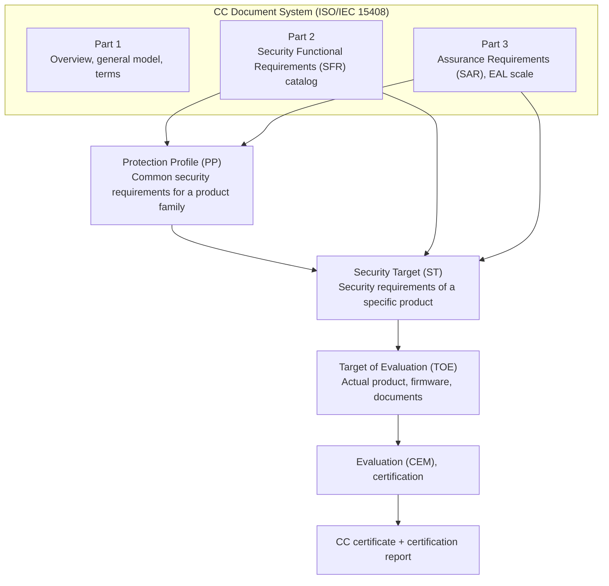
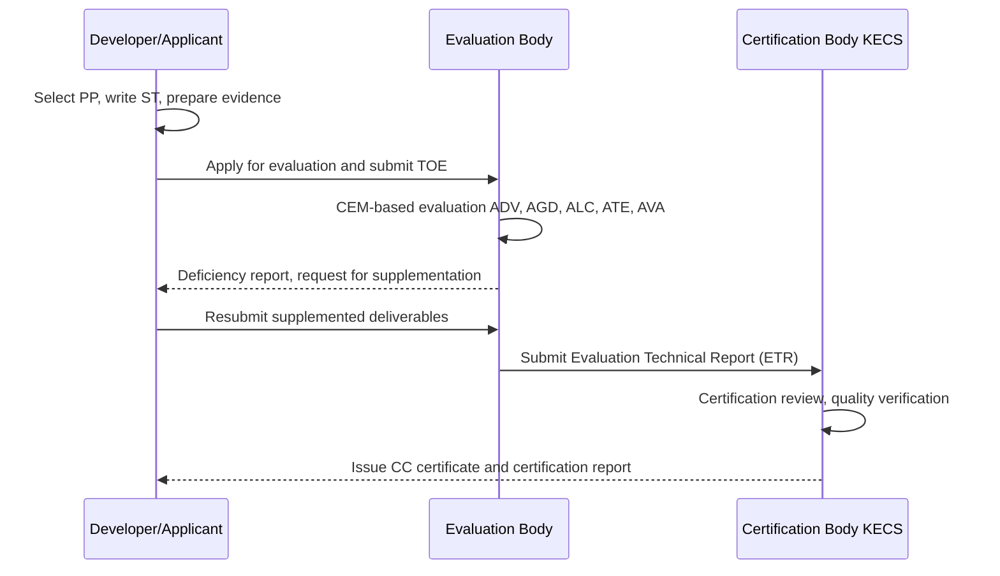

# Common Criteria (CC, Common Criteria / ISO/IEC 15408)

## 1. Overview

### A. Definition
> The **Common Criteria (CC, Common Criteria for Information Technology Security Evaluation)** is an international standard for evaluating and certifying, by a third-party independent body through standardized procedures, the security functions of information-security products and systems and the **Assurance** level that those functions are correctly implemented and operated; it consists of **ISO/IEC 15408** (the evaluation criteria) and its evaluation methodology, **ISO/IEC 18045 (CEM)**.

A distinctive feature of the CC is that it treats separately "what security functions does this product provide" (functionality) and "how reliably were those functions built" (assurance). That is, it evaluates on separate axes the fact that a firewall blocks packets (function) and the fact that its blocking logic has been proven to operate without defects through design, implementation, testing, and vulnerability analysis (assurance).

### B. Background and Necessity
Before the CC, different security-evaluation criteria proliferated by country and region. The U.S. **TCSEC (Orange Book)**, Europe's **ITSEC**, and Canada's **CTCPEC** each used a different grading system and terminology, so to export a product certified in one country to another, one had to be re-evaluated each time. This imposed redundant costs on developers and incomparability on adopting institutions. There was no common language to objectively compare the trustworthiness of security products.

The CC was created in the 1990s by **harmonizing** these various criteria to resolve such fragmentation, and it was internationally standardized as ISO/IEC 15408 in 1999. The core motivation is **Mutual Recognition**: "Evaluate once, recognize everywhere." What institutionally underpins this is the **CCRA (CC Recognition Arrangement)**, under which member countries recognize one another's certificates within a defined scope.

The necessity can be summarized in three points. First, an **objective basis for trust**. Security can be judged not by the supplier's self-claims but by the standardized verification results of an independent evaluation body. Second, **meeting procurement requirements**. Domestic public institutions in principle require CC certification (or equivalent verification) when adopting information-security products, so CC certification acts as a gateway to market entry. Third, **comparability**. Even different products, if evaluated against the same PP (Protection Profile), can be compared on the same scale for whether they meet security requirements.

### C. Features of the CC
The first feature of the CC is the **separation of functionality and assurance**. Unlike TCSEC, which was rigid because it bundled function and assurance together at each grade, the CC treats "what it does (SFR)" and "how much it can be trusted (SAR)" as independent axes, so that even for the same function, the strength of assurance can be chosen differently to match the threat level. Thanks to this separation, everything from low-cost certification for low-threat environments to high-assurance certification for high-threat environments is accommodated in a single framework.

The second feature is a **reusable requirements catalog**. Because SFRs and SARs are standardized into class–family–component, when writing a PP or ST one simply combines and refines these, securing both expressiveness and consistency of requirements definition at once. The third is **international mutual recognition**: through the CCRA, a member country's certification is recognized by other member countries within a defined scope, reducing the cost of redundant evaluation. Combining these three features, the CC has established itself as the common language for the trustworthiness of information-security products.

## 2. The CC Structural System and Core Concepts

The relationship among the CC's document system and the evaluation targets/requirements, shown as an overall structure, is as follows.

The key to understanding the CC is that **the evaluation target and the requirements are explicitly documented**. The core concepts below mesh with one another to constitute a single evaluation logic.

**A. TOE (Target of Evaluation)** is the product, or part of it, that becomes the object of evaluation, and it includes software, hardware, firmware, and related guidance documents. What is important is the **boundary setting** of the TOE. Even for the same product, the security claims and evaluation cost change depending on how far the evaluation scope extends, so the TOE definition is directly tied to the trustworthiness of the evaluation. Assumptions about the operating environment outside the boundary (e.g., physical protection, a trusted administrator) are specified separately. For instance, even for the same DBMS, the security claims and evaluation effort differ greatly between taking only the access-control engine as the TOE and including the management console and audit log, so the TOE boundary is a core design matter that the developer decides strategically. Narrowing the boundary makes evaluation easier but risks failing to capture the security scope the adopting institution expects, while widening it enlarges the scope of trust but increases cost.

**B. SFR (Security Functional Requirements)** are the requirements specifying the security functions the TOE must provide, cataloged in CC Part 2 in the form of classes and families. For example, there are classes such as identification and authentication (FIA), access control and information-flow control (FDP), audit (FAU), cryptographic support (FCS), and security management (FMT), and the developer selects and specifies from this catalog the items needed for its product. Because the standard catalog is reused, the consistency and comparability of requirements definition are secured.

**C. SAR (Security Assurance Requirements) and EAL** address "was the function built properly." Part 3's assurance classes include development (ADV), guidance documents (AGD), life-cycle support (ALC), tests (ATE), and vulnerability assessment (AVA), and the predefined packages that bundle these at a certain strength are the **EAL (Evaluation Assurance Level) 1–7**. The higher the EAL, the greater the formality of design representation, the scope of testing, and the depth of vulnerability analysis. One must note that assurance means "verification is rigorous," not "there are many functions."

**D. PP and ST** are the two vessels that hold requirements. The **PP (Protection Profile)** is a set of implementation-independent security requirements that a specific product family (e.g., firewalls, smart cards, DBMS) must satisfy in common; it is the baseline by which an adopting institution or the government stipulates "a product of this kind must have at least this much." The **ST (Security Target)** is an implementation-oriented specification that states what a single specific product actually satisfies and how, and it typically claims conformance to one or more PPs. If a PP is a "standard specification sheet," an ST corresponds to "that product's proposal."

| Concept | Meaning | Nature |
|---|---|---|
| **TOE** | Product/documents under evaluation | Defines the evaluation scope (boundary) |
| **SFR** | Security functional requirements (Part 2) | What it does (function) |
| **SAR / EAL** | Assurance requirements (Part 3) | How much it can be trusted (assurance) |
| **PP** | Common requirements for a product family | Implementation-independent, baseline |
| **ST** | Security specification of a specific product | Implementation-oriented, declaration of PP conformance |

The relationship of these concepts is summed up in one sentence. **When the government or a demanding institution defines the baseline with a PP, the developer states in the ST how its TOE satisfies that PP's SFRs, and the evaluation body verifies whether that claim is true according to SAR/EAL.** That is, the PP is the source of requirements, the ST is the product's promise, and the EAL is the strength of verification — this triangular structure is the skeleton of the CC. Thanks to this structure, even products from different developers can be compared and procured on the same scale if they reference the same PP.

## 3. The Evaluation and Certification Process

CC certification proceeds in a three-party structure of **developer (applicant)–evaluation body–certification body**. Domestically, the certification-body role is performed by the **IT Security Certification Center (KECS)** under the National Intelligence Service, and the actual evaluation is performed by a designated evaluation body according to the CEM (ISO/IEC 18045) methodology.

The process can be understood as a flow of **preparation–evaluation–certification**. In the preparation stage, the developer selects the target PP, writes the ST, and prepares design, test, and configuration-management evidence to match the required assurance level. Here, the higher the EAL, the sharper the increase in the formality and volume of required documents, so the target grade must be decided carefully, considering business needs and cost.

In the evaluation stage, the evaluation body checks the deliverables according to the CEM's detailed activities (work units). For example, it confirms via ADV whether the design/implementation representation sufficiently refines the SFRs, via ATE whether functional testing covers a sufficient scope, and via AVA whether known and potential vulnerabilities are analyzed from a penetration-testing perspective. When deficiencies are found, the developer is asked to supplement, and this **repetition of deficiency and supplementation** is the key factor governing the evaluation duration.

In the certification stage, the evaluation body submits the Evaluation Technical Report (ETR) to the certification body, and the certification body independently reviews the adequacy and consistency of the evaluation. Once it passes review, along with the **CC certificate**, a **certification report** containing the evaluation scope, premises, and results is issued. The adopting institution must be sure to check the TOE boundary and operating-environment assumptions in this certification report, because certification is valid "under the specified environmental assumptions."

| Stage | Party | Main Activities | Deliverables |
|---|---|---|---|
| **Preparation** | Developer | Select PP, write ST, prepare evidence | ST, design/test evidence |
| **Evaluation** | Evaluation body | Perform CEM activities, point out deficiencies | Deficiency report, test results |
| **Certification** | Certification body (KECS) | Review adequacy of evaluation | Certificate, certification report |

Meanwhile, the requirements documents themselves also become evaluation targets. The PP has its completeness, consistency, and rationale first verified through the **APE (Protection Profile Evaluation)** class, and the ST through the **ASE (Security Target Evaluation)** class. This is because evaluating a product on top of poorly defined requirements makes the whole result meaningless, so a two-stage logic of "verify the validity of the requirements → verify the product's fulfillment of the requirements" is institutionalized. Because of this, considerable effort is put into securing ST/PP consistency early in the evaluation, and any weakness here is a common cause of subsequent evaluation delays.

## 4. Comparison of EAL Grades and Application Cases

EAL 1–7 is a scale that progressively raises the strength of assurance. Low grades center on document review and functional testing, and toward higher grades they require **semiformal and formal** design representations and deep vulnerability analysis. A point to note here is that in practice, **the range in which international mutual recognition works effectively is generally limited to the EAL 2 level (or based on collaborative PPs)**. High-assurance evaluations of EAL 5–7 have very large costs and durations and are outside the scope of mutual recognition, so they are used in a limited way in special high-threat domains such as smart cards and defense.

| Grade | Assurance Concept | Representative Application Context |
|---|---|---|
| **EAL1** | Functionally tested | Low threat, minimal assurance |
| **EAL2** | Structurally tested | Commercial products, the effective range of mutual recognition |
| **EAL3** | Methodically tested and checked | General commercial security equipment |
| **EAL4** | Methodically designed, tested, and reviewed | Highest commercial grade (firewalls, DBMS, etc.) |
| **EAL5~7** | Semiformally/formally verified | High-risk such as smart cards and defense |

The standing of the CC becomes clearer when compared with earlier evaluation criteria. TCSEC (Orange Book), from a confidentiality-centered military perspective, bundled function and assurance into a single axis D–A1, giving low flexibility and struggling to accommodate the diverse security objectives of commercial products. ITSEC was an advanced system that separated functionality (F) and assurance (E), but it remained a European regional standard, so its international applicability was limited. The CC took the strengths of both (the separation of function and assurance) and combined them with international standardization and mutual recognition, expanding into a general-purpose standard spanning commercial, public, and defense. The fundamental reason for the difference is that **the evaluation target shifted from closed government systems to the global commercial-product market**, and this shift gave rise to the demand for "a comparable and mutually recognized general-purpose standard."

| Criteria | Function/Assurance | Applicability | Limitations |
|---|---|---|---|
| **TCSEC (Orange Book)** | Combined (D–A1) | U.S., military | Rigidity, confidentiality-biased |
| **ITSEC** | Separated (F/E) | Europe | Lack of international applicability |
| **CC (ISO/IEC 15408)** | Separated (SFR/SAR) | International (CCRA) | Conditional trust, cost |

As a concrete example, firewalls, intrusion-prevention systems (IPS), and DBMS access-control products supplied to the domestic public sector typically obtain **domestic CC certification at an EAL level** against that product family's PP to meet adoption requirements. On the other hand, products such as financial IC cards and e-passport chips face large physical and side-channel threats, so **high-assurance evaluation of EAL 5 or above** is often required. Thus, grade selection varies according to the **threat environment and asset value** in which the product is placed, and the principle is to choose **appropriate assurance commensurate with the threat**, not unconditionally the highest grade.

Since grade selection is directly tied to cost and duration, an economic perspective is also important. Generally, each time the EAL rises one step, the formality of required deliverables and the scope of testing and vulnerability analysis expand, so evaluation duration and cost increase markedly; in particular, at EAL5 and above, where semiformal design representation is required, that burden grows sharply. Therefore, most commercial products choose the EAL2–4 range at the balance point between mutual recognition and cost, while it is standard practice to limit EAL5–7 to a few high-risk products directly tied to human life and national security. This shows that it is rational to choose "the minimum sufficient grade commensurate with the threat and assets," not "the highest possible grade."

Also, it is necessary to understand through cases that the CC does not guarantee absolute safety. Certification is conditional trust that "under the defined TOE boundary and operating-environment assumptions, the specified SFRs were verified at the EAL level." Therefore, new vulnerabilities discovered after certification, misconfigurations, and incidents due to components outside the boundary fall outside the scope of certification. Concluding "it is safe" from the certificate alone is a common misunderstanding; one must be sure to also review the **premises and scope of the certification report**.

## 5. Advanced — Latest Trends and Standard Revision (CC:2022 / ISO/IEC 15408:2022)

The CC long used **CC v3.1** as the de facto standard, but in 2022 **CC:2022 (Release 5)** was released, and with the corresponding **ISO/IEC 15408:2022** and **ISO/IEC 18045:2022** revisions, the system expanded. The core of the revision is that, beyond the existing part structure, it incorporated into the standard **the specification of evaluation methods/activities (Part 4) and predefined packages (Part 5)**, raising the reusability and consistency of requirements definition and evaluation performance. New certification schemes are gradually transitioning to a CC:2022 basis, so developers and adopting institutions must confirm the reference version and prepare for migration.

A major trend on the methodology side is the **cPP (collaborative Protection Profile) and the move away from EAL**. Since its 2014 revision, the CCRA has reduced the wholesale mutual recognition of higher EALs and moved toward making conformance to **collaborative Protection Profiles (cPPs)** — agreed upon for specific product families by international Technical Communities (iTCs) — the axis of mutual recognition. This reflects the recognition that "precise requirements tailored to the real threats of each product family (cPP)" fit practical trust better than a "generic assurance grade (EAL)." As a result, recent evaluations are increasingly expressed by conformance to a specific cPP rather than an EAL label.

This trend means that the basis of trust is shifting from "mutual recognition of a generic grade label" to "international collaborative definition of precise requirements per product family." However, since emerging product families for which cPPs are not yet in place still depend on evaluation based on individual PPs/STs, EAL and cPP are expected to coexist for the time being.

As a domestic trend, to complement the reality that PPs do not exist for every product family, the introduced **Information-Security Product Rapid Confirmation Scheme** complements CC certification. The intent is to alleviate the problem of new-technology and convergence products having their public-market entry delayed by waiting for CC certification when no PP for evaluation exists. However, since rapid confirmation is not a complete substitute for the CC but a **temporary, complementary path**, in the long run it is desirable to develop PPs for the relevant product families and incorporate them into the CC. In addition, **the transition to post-quantum cryptography (PQC)**, defining TOE boundaries for cloud/container-form products, and establishing evaluation methodologies for AI-equipped products are emerging as challenges the CC system must resolve going forward.

## 6. Considerations and Implications

- **Appropriate assurance selection (commensurate with threat)**: EAL/cPP selection must be proportional to asset value and threat level. Excessively high grades needlessly inflate cost and duration, while too-low grades lack substantive assurance. A professional engineer must be able to recommend the **optimal grade/PP** by considering procurement requirements and the threat model together.
- **Verification of the TOE boundary and operating-environment assumptions**: Since certification is conditional trust, at adoption one must confirm whether the TOE scope and premises (trusted administrator, physical protection, etc.) in the certification report match the actual operating environment. Components outside the boundary and misconfigurations are not underwritten by certification.
- **Version and mutual-recognition strategy (CC:2022, CCRA)**: For international business, a certification strategy considering the scope of mutual recognition (generally EAL2 or cPP conformance) and the reference version (transition to CC:2022) is needed. Plan by distinguishing the purpose and use of domestic and international certification.
- **Life-cycle continuity (ALC, assurance maintenance)**: Since certification is for a specific point in time and configuration, assurance can be undermined when patches or features are added. Sustainable assurance must be secured by linking configuration management (ALC) with certification-maintenance and re-evaluation procedures.
- **Integration with related technologies/institutions**: The CC is complementary to ISMS-P, secure coding, SBOM/supply-chain security, and cryptographic-module validation (KCMVP/FIPS). A substantive assurance system is completed when product certification (CC), operational certification (ISMS-P), and cryptographic validation are combined hierarchically.
- **Balance between evaluation backlog and accepting new technology**: The absence of PPs for evaluation and prolonged evaluation durations delay the public-market entry of new-technology products. Use complementary paths such as the rapid confirmation scheme, but in the medium-to-long term, secure both **rigor of assurance and market timeliness** by simultaneously developing product-family PPs and establishing TOE boundaries and evaluation methodologies suited to cloud and AI products.

## References
- Common Criteria Portal — https://www.commoncriteriaportal.org/
- ISO/IEC 15408-1:2022 — https://www.iso.org/standard/72891.html
- ISO/IEC 18045:2022 (CEM) — https://www.iso.org/standard/72889.html
- IT Security Certification Center (KECS) — https://itscc.kr/
- CC Recognition Arrangement (CCRA) — https://www.commoncriteriaportal.org/ccra/

---

> **In one line**: The Common Criteria (CC, ISO/IEC 15408) is *an international standard by which a third party evaluates and certifies, through standard procedures, the security functions (SFR) and assurance level (SAR/EAL) of information-security products*, centered on the concepts of PP, ST, and TOE and the three-party evaluation/certification process, and it is evolving with CCRA mutual recognition, the shift toward cPP centrality, and the CC:2022 revision.
