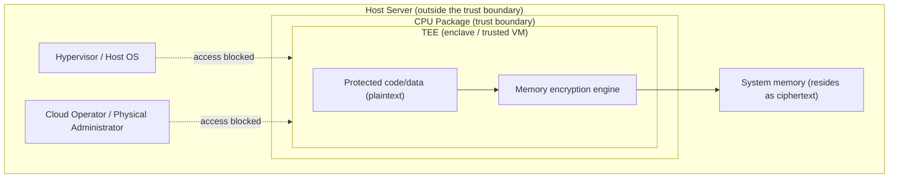
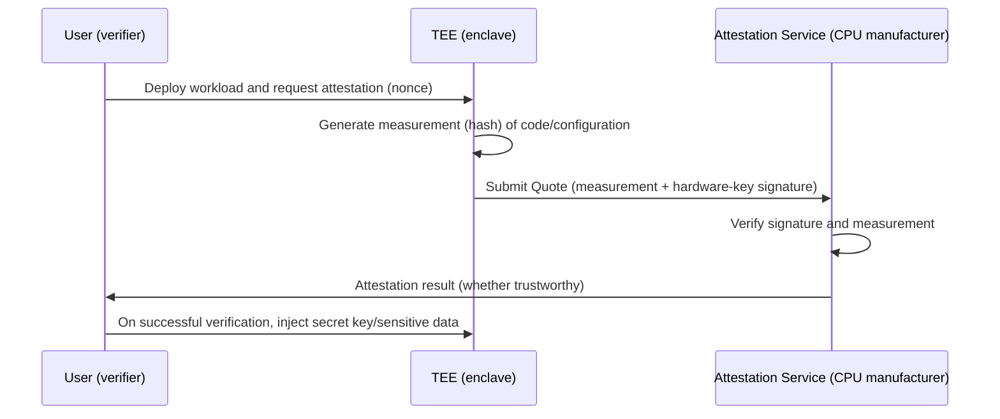

# Confidential Computing

## 1. Overview

> **Confidential Computing** is a computing approach that protects the confidentiality and integrity of data even at the moment computation is performed (in-use) by processing data and code inside a hardware-based **Trusted Execution Environment (TEE)** embedded in the CPU. The Confidential Computing Consortium (CCC, under the Linux Foundation) defines the standard terminology and architecture.

Data protection has traditionally focused on two states, **at rest** and **in transit**. Disk encryption (TDE, LUKS) and transport encryption (TLS) handle these two states respectively. However, the moment data actually creates meaningful value is **when computation is performed** in the CPU and memory, and at this point the data must exist in memory as plaintext, so the third state — data **in use** — long remained a blind spot. As workloads migrated to the cloud, the risk of this blind spot grew even greater. The user must trust many privileged parties they cannot control — the hypervisor, host OS, cloud operator, physical server administrator, and more — and if any one of them is compromised or turns malicious, the running plaintext data is exposed as-is.

Confidential computing solves this problem by **removing the Root of Trust from the software stack and moving it into the CPU hardware**. That is, it excludes even the operating system, hypervisor, and cloud administrator from the objects of trust (pushing them outside the trust boundary) and minimizes the trust base so that only the CPU manufacturer and the isolation mechanism within it are trusted. This is a **hardware-isolation-based approach**, contrasting with — and complementary to — homomorphic encryption (which performs computation itself in ciphertext) and multi-party computation (MPC), discussed earlier, which achieve in-use protection through pure software and mathematics.

## 2. TEE Architecture and Threat Model

The core device of confidential computing is the TEE. A TEE is an isolated execution region provided by the CPU; the memory within it is automatically encrypted through a hardware encryption engine when it leaves the CPU, and no party other than the legitimate enclave or trusted VM can see its contents as plaintext. The conceptual diagram below shows the trust-boundary difference between the ordinary execution path and the TEE-protected path.

The core of the threat model the TEE defends against is that it **assumes privileged software and physical-access parties to be potential attackers**. Whereas an ordinary access-control model addresses threats at the application/user level, confidential computing pushes outside the trust boundary the higher layers — the kernel, hypervisor, and firmware — and even the data-center administrator who can physically touch the server. Even if an attacker seizes memory modules via a cold-boot attack or a malicious hypervisor dumps guest memory, only ciphertext exists in memory, so no plaintext can be obtained.

However, there is a clear boundary to the TEE's scope of protection. The TEE strongly guarantees memory isolation and integrity, but it can be inherently vulnerable to **side-channel attacks** that observe physical side effects such as cache, branch prediction, and power consumption. In fact, a series of microarchitectural attacks targeting Intel SGX — Foreshadow (L1TF), Plundervolt, SGAxe, and others — have been reported, and manufacturers have responded with microcode patches. Therefore, it is a practical principle to understand confidential computing not as an "all-purpose shield" but as a **tool that redefines the threat boundary**, and to concurrently apply side-channel mitigations and the latest patches.

## 3. The Remote Attestation Procedure

The decisive mechanism by which confidential computing actually establishes trust is **Remote Attestation**. When a user places a workload on some server in the cloud, they must be able to cryptographically verify, remotely, "is this code really running inside a genuine TEE without tampering?" before they can commit sensitive data. Remote attestation is a procedure in which the CPU measures (hashes) the enclave's code and configuration state and issues evidence (a quote) signed with a hardware key, and a verifier verifies this through the manufacturer's attestation service.

The core of this procedure is that **the secret moves only after trust has first been verified**. Since the user knows in advance the expected hash of the code they intend to run, they deliver the encryption key or original data to the enclave only when the measurement contained in the attestation result matches the expected value. If a cloud administrator has secretly swapped the code or it is running in an ordinary VM rather than a TEE, the measurement/signature differs and verification fails, and the secret is never exposed. In this way, remote attestation can be seen as a concept that extends the identification/authentication handled in access control from "people/accounts" to **"the execution environment itself."**

## 4. Comparison of TEE Implementation Types

TEEs divide broadly into **process-isolation type** and **VM-isolation type**, depending on what unit of protection they take. The process-isolation type places a small protected region (an enclave) inside an application, while the VM-isolation type encrypts and isolates the entire guest VM as a whole. The former keeps the object of trust (TCB, Trusted Computing Base) extremely small so the attack surface is narrow, but the application must be redesigned for the enclave; the latter can lift existing workloads almost as-is, giving high cloud adoptability — a practical difference. This difference creates the trade-off of "redesign burden vs. portability."

| Category | Process-isolation type | VM-isolation type |
|------|----------------|-----------|
| Representative tech | Intel SGX | AMD SEV-SNP, Intel TDX, Arm CCA |
| Unit of protection | An enclave within the application | The entire guest VM |
| TCB size | Very small (part of the application) | Large (includes guest OS) |
| Portability | Low (rewrite with an enclave SDK) | High (existing VM almost as-is) |
| Suitable cases | Protecting small core logic/keys | Lift-and-shift of cloud workloads |

Arm's **TrustZone** is another form widely used in mobile and embedded devices; it bisects a single processor into a Secure World and a Normal World, isolating sensitive processing such as fingerprints and payment information in the Secure World. In server clouds, the VM-isolation type (SEV-SNP, TDX), with its small redesign burden, has recently become effectively the mainstream, reflecting enterprises' practical demand to gain confidentiality without code changes. For example, Azure Confidential VM and Google Cloud Confidential VM are SEV-SNP based, automatically encrypting guest memory, and the user can trust the workload after verifying the environment via remote attestation at boot.

## 5. Use Cases and Comparison with Similar Technologies

A representative practical application of confidential computing is **multi-party data collaboration**. Multiple organizations that do not want to disclose their originals to one another (e.g., several financial firms jointly training a fraud-detection model) each inject their data in encrypted form into the same TEE, and if combination and computation are performed only inside a verified enclave, only the results can be shared without leaking the originals. Sensitive genomic analysis in the medical/bio field, confidential off-chain smart contracts on blockchains, and minimizing trust in the processor in cloud-based personal-data processing consignment are also major applications.

Recently in particular, **Confidential AI** is on the rise. If, during large-model inference, both the input prompt and the model weights are processed inside a TEE (including GPU TEEs, e.g., the Confidential Computing mode of NVIDIA H100), even the cloud provider cannot read the user's prompt or the enterprise's proprietary model parameters. This is drawing attention as a substantive means of alleviating concerns over data sovereignty and trade secrets when adopting generative AI.

Comparing it with technologies that have the same 'in-use protection' goal makes the position of each technique clear. The table below organizes the differences from the previously discussed homomorphic encryption and MPC. The core difference lies in **what you trust and what you pay for in performance**.

| Technique | Protection Principle | Object of Trust | Performance | Characteristics |
|------|-----------|-----------|------|------|
| Confidential computing (TEE) | Hardware isolation | CPU manufacturer | Near-plaintext (single-digit % overhead) | High portability, residual side-channel |
| Homomorphic encryption (HE) | Ciphertext computation | Mathematics (no trusted hardware needed) | Very slow | No hardware trust required |
| Multi-party computation (MPC) | Secret sharing/protocol | Quorum of participants assumed | High communication cost | Suitable for multi-party collaboration |

Thus, the three technologies are not substitutes but **complements with differing trust models and performance profiles**. In practice, hybrid designs are also being researched that isolate the execution environment with a TEE and run MPC/HE within it to also distribute the hardware trust.

## 6. Considerations and Implications

From a professional engineer's perspective, when adopting and strategizing confidential computing, the following should be considered.

- **Shift of the trust base and recognition of residual risk**: Confidential computing merely moves the object of trust from the cloud operator to the CPU manufacturer; it does not eliminate trust itself. Since the manufacturer's supply chain, microcode vulnerabilities, and side-channel risks remain, the rationale for adoption must be documented from the perspective of resetting the threat boundary, not "zero defects."
- **The performance-security trade-off and workload selection**: The VM-isolation type generally has single-digit-% overhead and high portability, but there is latency from memory encryption and the attestation procedure. Rather than applying it to all workloads at once, a staged strategy of applying it first to highly sensitive assets such as personal data, keys, and models is reasonable.
- **Securing an operating system for remote attestation**: The value of confidential computing manifests when the attestation-verification system actually operates. You must design an operational process that includes attestation-service availability, management of measurement baselines (policy), and automation of key distribution (KMS integration), so it does not end at formalistic adoption.
- **Linkage with regulation/compliance**: For the safety-assurance measures under the Personal Information Protection Act, the Cloud Security Assurance Program (CSAP), and the requirement to minimize control over the consignee during processing consignment, confidential computing becomes a powerful technical complement. However, institutional refinement of how the domestic certification/audit system will accept TEE attestation results must proceed in parallel.
- **Multi-cloud portability and standardization**: Because the attestation formats and SDKs of SGX, SEV, TDX, CCA, and others differ by vendor, there is a concern over lock-in. Watching the CCC's standardization trend and vendor-neutral attestation frameworks (e.g., open attestation specifications) and designing a portable architecture is advantageous as a long-term strategy.

## References

- Confidential Computing Consortium, "A Technical Analysis of Confidential Computing" — https://confidentialcomputing.io/
- Intel, "Intel Trust Domain Extensions (TDX)" — https://www.intel.com/content/www/us/en/developer/tools/trust-domain-extensions/overview.html
- AMD, "AMD SEV-SNP" — https://www.amd.com/en/developer/sev.html

---

> **In one line**: Confidential computing is a hardware-isolation-based data-protection paradigm that protects data even in its 'in-use' state during computation, using a CPU-hardware-based TEE and remote attestation, pushing even the hypervisor and cloud operator outside the trust boundary.
