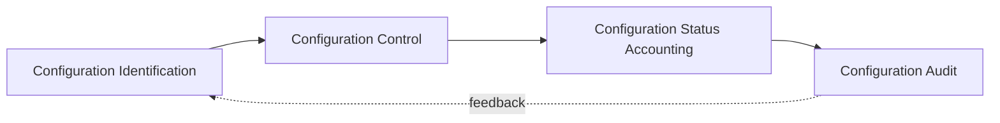

# Configuration Management and Baselines

## 1. Overview

### A. Definition
> A management activity that maintains integrity and consistency by **identifying, controlling, recording, and auditing changes to the work products (configuration items)** produced in the course of software development and operation, controlling changes against an officially agreed **Baseline**.

### B. Background and Necessity
Software has countless work products — code, design documents, requirements specifications, manuals, and so on — that constantly change through many people's hands. If everyone modifies them without control, version confusion arises in which no one knows "**which version is the real one**," and one person's change overwrites another's work, collapsing quality. Configuration management solves this problem by "**allowing changes only through a controlled procedure, rather than prohibiting them**." Through this it tracks the change history (audit/traceability), prevents conflicts from many developers working simultaneously, and makes it possible to restore the state at a specific point in time at any moment.

## 2. The Configuration Management Process

Configuration management consists of a cycle of "**deciding what to manage (identification) → controlling changes (control) → recording the status (status accounting) → verifying consistency with the baseline (audit)**." Audit results are reflected back into identification to update the management targets and the baseline.

## 3. The Four Activities of Configuration Management

Each activity answers a different question of configuration management. Identification addresses "what," control addresses "how to change it," status accounting addresses "what state it is in now," and audit addresses "whether it was done properly." Of these, **configuration control** is the substantive core: when a change request (CR) comes in, it is not reflected immediately but only after **impact analysis followed by approval from the CCB (Configuration Control Board)**. Because of this gateway, indiscriminate changes are filtered out and accountability for changes is left behind.

| Activity | Description |
|---|---|
| **Configuration Identification** | Identify, name, and version configuration items (code, documents, libraries) |
| **Configuration Control** | CR → impact analysis → **CCB approval** → reflection |
| **Configuration Status Accounting** | Record and report change history and current status |
| **Configuration Audit** | Functional (FCA) and physical (PCA) audits of whether the baseline matches requirements |

For example, when a bug-fix request comes in during operation, the developer does not patch it arbitrarily but registers a CR, analyzes the impact this change will have on other modules, reflects it after obtaining CCB approval, and records the history.

## 4. Types of Baselines

> **Baseline**: A configuration that has been officially reviewed, agreed upon, and fixed at a specific point in time, serving as the reference version that **must go through the control procedure (CCB)** for any subsequent change.

The reason baselines are set at each major point in the development life cycle is to "**freeze**" the work products up to that point as a stable reference, so that subsequent work is not shaken. As development progresses, things become concrete in the order requirements → design → product, so baselines are also set in three types to match those stages.

| Baseline | Point of Setting | Fixed Content |
|---|---|---|
| **Functional Baseline** | Completion of requirements analysis | System Requirements Specification (SRS) |
| **Allocated Baseline** | Completion of design | Design specification allocating requirements to components |
| **Product Baseline** | Completion of development and testing | Final delivered-product configuration (code, manuals) |

The functional baseline fixes "what to build," the allocated baseline fixes "how to divide and design it," and the product baseline fixes "the actually built result." Since a later baseline is verified (traced) against the earlier baseline, consistency is maintained from requirements through to the product.

## 5. Related Tools and Techniques

Configuration management is a concept, but its actual operation is automated with tools. When version control, issue tracking, and CI/CD are linked, code changes become connected to issues (change requests) and are tracked all the way through automated build and deployment, maximizing the visibility of the configuration.

| Category | Examples |
|---|---|
| Version control | Git, SVN |
| Issue/change management | Jira, Redmine |
| CI/CD, release | Jenkins, GitHub Actions |

## 6. Considerations and Implications
- **Automation linkage**: Integrating configuration-management tools with version control, issue tracking, and CI/CD to make the entire change-build-deploy process traceable is the modern direction.
- **Visibility and accountability**: The essence of change control through the CCB lies in securing the visibility and accountability of changes by leaving a record of "**who, why, and what was changed**."
- **Expansion to the supply chain**: Recently, since even open-source dependencies must be managed, configuration management is expanding to **supply-chain integrity** through the **SBOM (Software Bill of Materials)** — a list of components — and release management.

---

> **In one line**: Configuration management allows changes to work products only through a controlled procedure via the activities of *identification → control (CCB) → status accounting → audit*, fixes the **functional, allocated, and product baselines** at each point in time to guarantee integrity and traceability, and has recently expanded to SBOM and supply-chain integrity.
