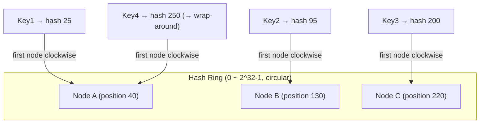
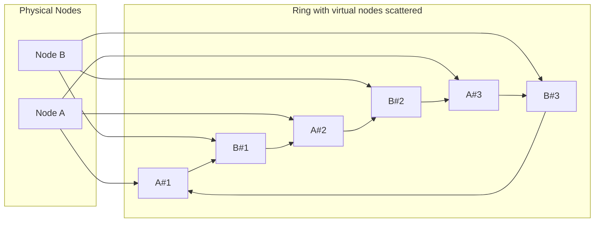

# Consistent Hashing

## 1. Overview

### A. Definition

> **Consistent Hashing** is a distributed data-distribution technique that places keys and nodes (servers) on **a single Ring** in the same hash space, assigns each key to the first node encountered clockwise, and thereby **minimizes the number of keys that get relocated to an average of about K/N** when nodes are added or removed.

Consistent hashing is an algorithm proposed in 1997 by David Karger et al. at MIT for web-cache load balancing, and today it is used widely — from distributed data stores such as Amazon DynamoDB, Apache Cassandra, and Riak, to the backend-selection logic of memcached clients, CDNs, and load balancers. Its core value is that, to the fundamental question "on which server should the data be placed," it provides an answer that **minimizes data movement even in an environment where the set of servers changes frequently**.

### B. Background and Necessity

The simplest distribution method is **modulo hashing (`hash(key) % N`)**. When there are N nodes, determining the responsible node by the remainder of the key's hash value divided by N gives a uniform distribution, but it has a fatal weakness. If the node count N changes even by one (a node drops out due to failure or is added by scaling out), the divisor of the division changes and **almost every key's responsible node is recomputed**. For example, increasing from N=4 to N=5, theoretically about 80% of keys move to a different node. For a distributed cache, at that moment the cache hit rate plummets and requests flood the origin DB, causing a **cache stampede**; for a distributed DB, large-scale data migration is triggered.

Considering that in cloud/microservices environments nodes constantly increase and decrease via auto-scaling and failures occur routinely, "a node change = total relocation" is an unbearable cost. Consistent hashing **binds keys to the hash positions of nodes rather than to the number of nodes**, so that even when one node changes, only the keys of the segment that node was responsible for are affected, localizing the impact. In other words, the decisive advantage of this technique is that the relocation target is reduced from the entire set to **on average K/N keys (K is the number of keys, N the number of nodes)**.

## 2. How It Works — The Hash Ring and Clockwise Assignment

Consistent hashing imagines the output space of the hash function (e.g., 0 to 2^32-1) as a **circular Ring whose end meets its beginning**. Each node hashes its identifier (IP, name, etc.) and is placed at a point on the ring, and each key is likewise placed on the ring by the same hash function. A key's responsible node is determined as **the first node encountered while proceeding clockwise from the key's position**. In this way, each node becomes responsible for the arc segment "from its immediately preceding node up to itself."

In the diagram above, Key4 has a hash value of 250 and has passed Node C (220), but it **wraps around** past the ring's end (2^32-1) back to the beginning (0), encountering Node A (40), so A takes responsibility. Thanks to this circular structure, no matter where on the ring a key lies, a responsible node always exists.

What happens when **Node B drops out due to failure**? Only the keys of the segment B was responsible for (from after Node A to B) move to C, the next node clockwise, and the keys A and C were responsible for are **entirely unaffected**. Conversely, when **a new Node D is added**, only the keys of the segment just before D's position move to D, and the rest stay as they are. This **localization of a change's ripple effect to one adjacent segment** is the essential difference from modulo hashing.

## 3. The Data-Skew Problem and Virtual Nodes

The basic method has two weaknesses. First, if nodes are placed randomly on the ring, the segment lengths are not uniform, so **keys can concentrate on a particular node** (load imbalance). Second, when one node drops out, its load **piles entirely onto a single next node clockwise**, inducing cascading failure.

The standard technique that solves this is the **Virtual Node (vnode)**. A single physical node is scattered and placed not as one point on the ring but as **dozens to hundreds of virtual points** computed with different hashes. For example, if physical node A is dispersed across the ring as 150 virtual nodes like `A#1, A#2, ..., A#150`, the arcs each physical node is responsible for spread finely across the whole ring, so the **uniformity of load distribution** improves greatly in statistical terms. In fact, setting the number of virtual nodes to about 100–200 reduces the load deviation between nodes from tens of % to single-digit %.

The second benefit of virtual nodes is handling **heterogeneous capacity**. A server with twice the performance can be allocated twice as many virtual nodes, so it takes on that many more arcs, naturally reflecting **capacity weighting**. Also, when one node dies, its load is **distributed and absorbed** across multiple physical nodes, so the risk of cascading failure is lowered. However, there is a trade-off in that the routing table maintaining and looking up virtual-node information grows larger and management complexity increases.

## 4. Comparison with Similar Techniques — Why the Differences Arise

Comparing consistent hashing with modulo hashing, and with the more recent techniques **Jump Consistent Hash (Google, 2014)** and **Rendezvous hashing (Rendezvous / HRW)**, one can see that each technique optimizes a different point.

| Technique | Relocation on node change | Load uniformity | Memory/implementation | Weighting support |
|------|--------------------|-----------|------------|-----------|
| Modulo hashing | Nearly all (~(N-1)/N) | Excellent | Very simple | Difficult |
| Consistent hashing (+vnode) | Average K/N | Excellent with vnodes | Requires ring/sorted map | Supported via number of vnodes |
| Jump hashing | Minimal (K/N) | Excellent | Memory O(1) | Not supported (sequential nodes) |
| Rendezvous hashing | Minimal (K/N) | Excellent | Per-node hash O(N) | Weighting easily supported |

The reason modulo hashing, despite having the best load uniformity, is avoided in practice is, as seen above, that its **relocation cost on node change** is overwhelmingly large. The context in which consistent hashing wins is that the **cost of change** in a dynamic environment where nodes constantly change is the substantive bottleneck, rather than the static metric of load uniformity. Jump hashing achieves minimal relocation with O(1) memory and no ring data structure, but because it is structured to assign sequential numbers to nodes, it has the limitation that **removing an arbitrary node or assigning weights is difficult**, making it suited to shard environments where "nodes only grow and shrink from the tail." Rendezvous hashing, computing the hash of each key with every node and choosing the maximum-value node, has **flexible weighting/priority control** but incurs a computation cost proportional to the node count N. In the end, large-scale distributed stores that require "minimal relocation + uniformity + weighting" all around adopt **consistent hashing with virtual nodes** as the standard.

**As a practical application case**, Amazon DynamoDB and Apache Cassandra place data on token (vnode) segments on the ring and **replicate each key to the N nodes clockwise from its responsible node (replication factor N)**. Here, consistent hashing becomes the routing skeleton that determines "which nodes hold this key's replicas," and even when nodes are added, the data that moves is localized, enabling non-disruptive scaling. It is also widely used to secure **connection affinity**: Discord uses rendezvous hashing to prevent a cache-reconstruction storm during a memcache failure, and Google's Maglev load balancer uses a variant of consistent hashing to maintain connections.

## 5. Considerations and Implications

From a professional engineer's perspective, when designing and adopting consistent hashing, the following should be reviewed comprehensively.

- **Adjusting the virtual-node-count trade-off**: Increasing vnodes improves load uniformity but raises the routing metadata and the update cost when membership changes. Considering node scale, hardware heterogeneity, and SLA, tune it based on measurements at the level of 100 to several hundred per physical node.
- **Hash-function selection**: For uniform distribution on the ring, use fast non-cryptographic hashes with fewer collisions/biases such as MurmurHash and xxHash rather than MD5/SHA-1, but verify the distribution quality in advance. Unless the purpose is security, prioritize performance.
- **Linkage with replication/consistency**: Ring-based replication often accepts eventual consistency in exchange for gaining availability and partition tolerance under the CAP theorem. It must be designed together with quorum reads/writes (R+W>N), hinted handoff, and anti-entropy to secure actual data consistency.
- **Hot keys and residual skew risk**: When traffic concentrates on a particular popular key, even vnodes cannot resolve it. Key-prefix sharding, adding a cache layer, and application-level load balancing must be applied together.
- **Membership management and observability**: A gossip protocol or consensus-based membership that propagates node increases/decreases across the whole cluster, and an observability system that continuously monitors relocation progress and load deviation, must both be in place for operational stability to be guaranteed.
- **Outlook**: For data locality and latency minimization, geography- and rack-aware (topology-aware) hashing is spreading, and in serverless/edge computing environments, the relocation-minimizing property of consistent hashing is becoming even more important when distributing stateful workloads.

---

> **In one line**: Consistent hashing is a distribution technique that places keys and nodes on a single hash ring and assigns each key to the first node clockwise, thereby minimizing relocation to an average of K/N when nodes are added or removed; with virtual nodes it secures load uniformity and weighting, and it is used as the standard routing foundation for large-scale distributed stores, caches, and load balancers.
