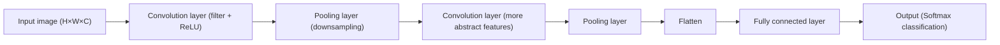
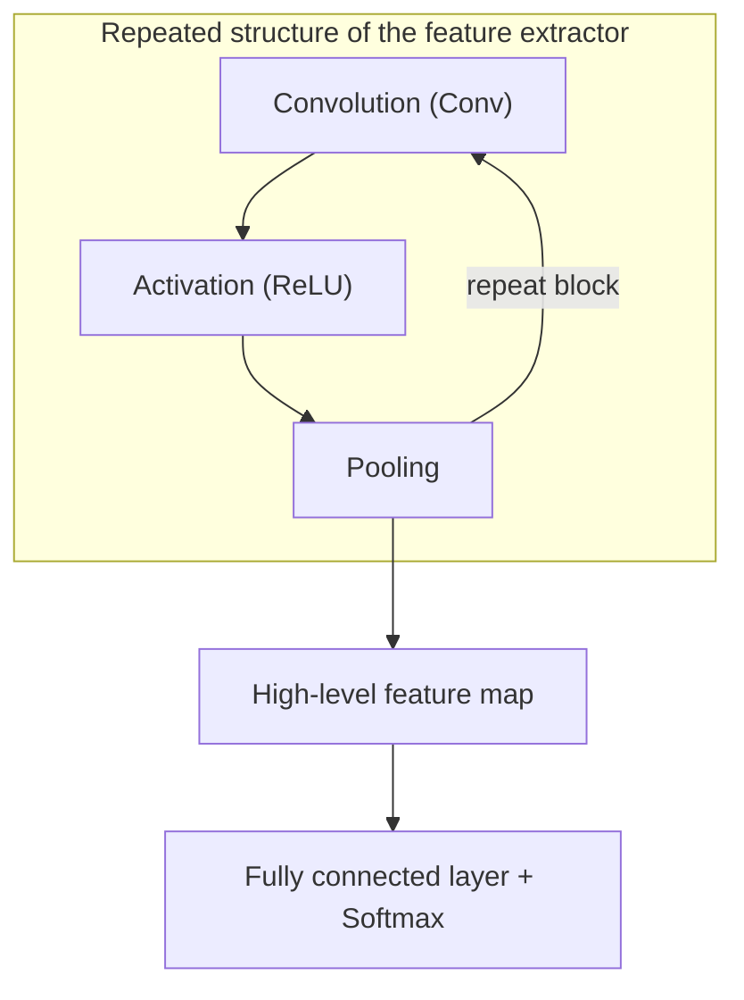

# Convolutional Neural Network (CNN)

## 1. Overview

### A. Definition

> A neural network that **hierarchically extracts and learns local features from grid-shaped data such as images by repeating the Convolution operation and Pooling**. Unlike a fully connected feedforward neural network (FFNN), it effectively recognizes spatial patterns while greatly reducing parameters through the **Local Receptive Field and Weight Sharing**.

The core insight of the CNN starts from the observation that "**the meaning of an image lies not in the absolute positions of pixels but in the combination of local patterns**." In a photo of a cat, local patterns such as ears, eyes, and whiskers combine to form the concept 'cat,' and whether those ears are on the left or the right of the image, they are still ears. The CNN reflects these two properties (locality and translation invariance) into the network structure itself. Because it slides a small filter (kernel) across the whole image and detects local patterns with the same weights, it can capture the same feature even when the position changes.

### B. Background and Necessity

Applying a traditional fully connected neural network to images as-is causes two serious problems. The first is a **parameter explosion**. For example, if you fully connect a 224×224×3 (about 150,000) pixel color image to a hidden layer of 1,000 neurons, the first layer alone needs about 150 million weights, making training practically impossible and prone to overfitting. The second is **destruction of spatial structure**. Since a fully connected layer flattens a 2D image into a 1D vector for input, the spatial correlation between adjacent pixels is lost.

The CNN solves these problems with local connectivity and weight sharing. A single 3×3 filter has only 9 (+ bias) parameters, and this filter is reused across the entire image. As a result, the number of parameters depends only on the filter size and count, independent of the input size, reducing it by millions of times or more. Thanks to this efficiency and performance, the CNN became the de facto standard architecture for image recognition, medical imaging, autonomous driving, face recognition, and more, ever since AlexNet dramatically lowered the error rate from 26% to 16% in the ImageNet competition in 2012, opening the deep-learning era.

| Category | Fully Connected NN (FFNN) | Convolutional NN (CNN) |
|---|---|---|
| Connection method | Global full connection | Local receptive field (local connection) |
| Parameters | Explode proportionally to input size | Depend only on filter size/count (shared) |
| Spatial structure | Lost by flatten | 2D/3D structure preserved |
| Invariance | Vulnerable to translation | Translation invariance secured |
| Suitable data | Structured, low-dimensional | Grid-shaped such as images, audio spectrograms |

## 2. Architecture

A CNN divides broadly into a **Feature Extractor** and a **Classifier**. The stack of convolution and pooling layers at the front extracts feature maps from the image, and the fully connected layers at the back make the final judgment based on those features. Here, as layers deepen, the abstraction level of the extracted features rises — a phenomenon of **Hierarchical Feature Learning**. Early layers represent low-level features such as edges, colors, and textures; middle layers represent parts such as eyes, wheels, and door handles; and deep layers represent whole objects such as faces and cars. This is similar to how humans process visual information, and is the core of why CNNs are powerful.

The concept that explains this hierarchical expansion is the **Receptive Field**. A neuron in a shallow layer sees only a narrow region of the input image, but as layers deepen, the input range one neuron indirectly sees grows progressively wider. For example, stacking a 3×3 convolution twice makes one neuron in the second layer reflect a 5×5 region of the original, and stacking it three times reflects 7×7. When pooling is combined, the receptive field grows exponentially, so a neuron in a deep layer can synthesize the context of the whole image. This is the structural basis for shallow layers recognizing local features and deep layers recognizing global objects.

### A. Convolution Layer

The convolution layer is the heart of the CNN. It moves a small weight matrix called a filter (kernel) over the input at a certain interval (Stride) and computes the sum of element-wise products (dot product) with the overlapping region to produce one value of the feature map. For example, a filter that detects vertical edges outputs a large value in regions where brightness changes sharply left-to-right, and a value near 0 in uniform regions. The important point is that the weights of this filter are **not designed by a human but learned via backpropagation**. That is, which filters are useful (which patterns should be captured to help classification) is determined by the data itself.

A single convolution layer has multiple filters, and each filter responds to a different pattern, producing an independent feature map. The number of filters becomes the number of output channels. For example, if the input is 32×32×3 and 64 filters of 3×3 are applied, the output is roughly 32×32×64 (depending on padding/stride). Here, **weight sharing** is the core: since a single filter uses the same weights wherever it scans the image, it "reuses, at the bottom-right, the edge-detection ability learned at the top-left of the image." This reusability is the source that dramatically reduces parameters and confers translation invariance.

Three hyperparameters govern the output size in the convolution operation. **Stride** is the filter's movement interval; the larger it is, the smaller the output and the greater the downsampling effect. **Padding** adds zeros to the edges of the input; using 'same' padding keeps the output size equal to the input and prevents loss of boundary information. **Kernel size** determines the width of the receptive field. The size of one side of the output is computed by the formula `(N - F + 2P)/S + 1` (N = input, F = filter, P = padding, S = stride); for example, with N=32, F=3, P=1, S=1, the output is (32-3+2)/1+1 = 32, so the size is preserved.

This parameter-reduction effect is dramatic when seen in numbers. Taking a 32×32×3 input as an example, connecting to 64 neurons with a fully connected layer requires (32×32×3)×64 ≈ 196,000 weights. In contrast, a convolution layer using 64 filters of 3×3 produces the same 64-channel feature map with only (3×3×3)×64 = 1,728 parameters (+ 64 biases). It preserves spatial structure with over about 100× fewer parameters. This difference widens as the input resolution grows, which is why the CNN becomes practically the only realistic choice for high-resolution imagery.

Also, immediately after convolution, a **nonlinear activation function (usually ReLU)** is applied. ReLU (`max(0,x)`) makes negatives 0 to introduce nonlinearity while mitigating the vanishing-gradient problem and being computationally simple, a decisive factor that made training deep CNNs possible. Stacking only convolutions would collapse multiple linear transformations into one, so the activation function is needed for the true depth of representational power to come alive.

### B. Pooling Layer

The pooling layer handles **downsampling**, which reduces the spatial size of the feature map. The most widely used max pooling takes only the maximum value in a 2×2 region, shrinking the feature map by half in both width and height. The first purpose of pooling is **reducing computation and parameters**, lightening the burden on subsequent layers and suppressing overfitting. The second purpose is **strengthening positional invariance**. Since only the maximum value is kept, the same pooling result comes out even if the feature moves a few pixels, making it robust to small positional changes. For example, that a handwritten '7' can be recognized the same way even if written slightly off-center in the image owes much to pooling.

Max pooling and average pooling differ slightly in purpose. Max pooling keeps only "the most strongly responding feature," so it is advantageous for detecting salient patterns such as edges and textures, whereas average pooling smoothly summarizes the information of the whole region, making it suitable for reflecting background and global statistics. In practice, a combination of using max pooling in the middle layers and global average pooling for the final summary is common.

A decisive difference from the convolution layer is that pooling has no learnable parameters. Since it is a fixed operation that picks the maximum (or average) value, it is not an object of learning. However, some recent architectures (e.g., the latter part of ResNet) replace downsampling with strided convolution instead of pooling, or at the end use **Global Average Pooling** to summarize the entire feature map into one value per channel, eliminating the huge parameters of the fully connected layer. This is effective for reducing parameters and suppressing overfitting, and it became common after GoogLeNet.

### C. Fully Connected Layer and Output (Classifier)

The feature map that has passed through the feature extractor is flattened and passed to the fully connected layer. This part plays the role of combining the extracted high-level features to make the final decision.

However, the fully connected layer is the point where parameters are most concentrated in a CNN and is also a major cause of overfitting. For example, if you flatten a 7×7×512 feature map and connect it to 4,096 neurons, about 100 million weights are created in that one layer alone. For this reason, designs that minimize fully connected layers with the aforementioned global average pooling, or that intensively apply dropout, are often used in parallel.

For classification problems, Softmax is applied at the end to output a probability distribution over each class, and cross-entropy loss measures the error against the correct answer. This error flows back via backpropagation through the fully connected layer → pooling layers (path) → convolution filters, and all filter weights are updated by gradient descent. In the end, the whole CNN is learned **end-to-end** to "find features on its own that are good for classification."

## 3. Learning/Regularization Techniques and Representative Architectures

### A. Overfitting Prevention and Stable-Training Techniques

CNN training is a repetition of making predictions via forward propagation, measuring the error with a loss function, then computing gradients via backpropagation and having the optimizer update the weights. **Cross-entropy loss** paired with Softmax is mainly used for classification, and MSE for regression. As the optimizer, the **Adam** family, which combines momentum and an adaptive learning rate, is widely used instead of pure gradient descent to stabilize and accelerate convergence. Combining this with **learning-rate scheduling (e.g., Cosine Decay, Warmup)** that gradually lowers the learning rate makes it explore broadly early on and fine-tune later, reaching a better optimum. Thus the design of loss, optimizer, and learning rate is a practical key variable that governs final performance even for the same architecture.

To stably train a deep CNN, several auxiliary techniques are needed. **Dropout** probabilistically deactivates some neurons during training to prevent over-reliance on specific neurons and to produce an ensemble effect. **Batch Normalization** normalizes the input distribution of each layer to accelerate training and stabilize gradient flow, and consequently is a core technique that made larger learning rates and deeper networks possible. **Data Augmentation** artificially increases training data through rotation, flipping, cropping, color transformation, and so on, raising generalization performance even with limited data. For example, in fields with high labeling cost such as medical imaging, data augmentation is essential.

Also, instead of training from scratch, **Transfer Learning** is widely used. By taking the feature extractor of a CNN pre-trained on ImageNet (about 14 million images, 1,000 classes) and fine-tuning only the back part with a small amount of target data, one can obtain high performance even with little data and computation. This is because the edge and texture features learned by the early layers are commonly useful for most vision tasks, and it is the most realistic way to adopt CNNs in practice.

### B. The Evolution of Representative Architectures and Its Reasons

The history of CNN architectures can be summarized as a journey of "**how to stack deeper while still making training possible**." It might seem that simply adding layers would raise performance, but in reality there was the problem that vanishing gradients and performance degradation instead made it worse, and each generation of architecture evolved with an idea to overcome this.

| Architecture (Year) | Key Contribution | Significance |
|---|---|---|
| LeNet-5 (1998) | Established the basic convolution+pooling structure | First practical use in postal-code recognition |
| AlexNet (2012) | ReLU, Dropout, GPU training | Won ImageNet, triggered the deep-learning boom |
| VGGNet (2014) | Deeply repeated small 3×3 filters | Standardized with a simple, uniform structure |
| GoogLeNet (2014) | Inception module, 1×1 convolution | Computational efficiency, global average pooling |
| ResNet (2015) | Residual connections (Skip Connection) | Enabled training of 152 layers, human-level accuracy |

In particular, **ResNet's Residual Connection** is a watershed in CNN development. It placed a shortcut that skips the input over a few layers and adds it directly to the output (`H(x)=F(x)+x`), so that gradients flow to deep layers without vanishing. Thanks to this, ultra-deep networks of 100+ layers were stably trained for the first time, and it subsequently became a standard component of virtually all deep architectures. **VGGNet's** insight that "stacking several small 3×3 filters rather than one large filter has fewer parameters yet higher expressive power," and **GoogLeNet's** idea of reducing computation by channel reduction via 1×1 convolution, also became basic principles of modern CNN design.

### C. Derived Tasks and Industrial Application Cases

CNNs have expanded beyond simple classification to become the backbone of various computer-vision tasks. **Object Detection** is the task of also finding "what is where," represented by the R-CNN family and the YOLO (You Only Look Once) family, which is strong at real-time processing. **Semantic Segmentation** classifies at the pixel level, and the encoder-decoder-structured U-Net is used as the de facto standard in the medical-imaging field. Thus, the task diverges depending on how the feature map extracted by the front-end CNN is interpreted and reconstructed.

Looking at industrial application cases concretely, their impact is clear. First, in **medical-image diagnosis**, CNNs discriminate pneumonia in chest X-rays, diabetic retinopathy in fundus images, and cancer cells in pathology-tissue slides at an accuracy rivaling specialists (AUC over 0.9 in many studies), and are used for reading assistance and screening tests. Second, in **autonomous driving**, since lanes, pedestrians, and signals must be detected in real time (tens of FPS) from camera imagery, lightweight-CNN-based detectors play a core role. Third, in **manufacturing quality inspection**, CNN-based machine vision catches micro-defects in semiconductor wafers and display panels faster and more consistently than humans, improving yield. What these cases have in common is that they take effect only when large amounts of labeled data, GPU computation, and an operating system that manages the cost of false positives/negatives are all in place together.

| Task | Representative Model | Industrial Application Example |
|---|---|---|
| Image classification | ResNet, EfficientNet | Content filtering, product classification |
| Object detection | YOLO, Faster R-CNN | Autonomous driving, CCTV monitoring |
| Semantic/instance segmentation | U-Net, Mask R-CNN | Medical imaging, satellite-image analysis |
| Face recognition | FaceNet family | Access control, identity verification |

## 4. Advanced: Latest Trends — The Rise of ViT and the Position of CNNs

Around 2020, with the emergence of the **Vision Transformer (ViT)**, a trend appeared in which part of the leadership of image recognition shifted from CNNs to attention-based models. ViT divides an image into patches, treats them as a sequence, and directly models global relationships via self-attention; when pre-trained on sufficiently large data (on the scale of hundreds of millions of images), it showed performance surpassing CNNs. This suggests that the CNN's **inductive bias** of locality and translation invariance can instead become a constraint in large-data environments.

This contrast is easy to understand from the perspective of data scale. ViT, via self-attention, can directly relate any two patches across the whole image, so its ceiling of representational power is high; but by the same token it has almost no prior assumptions about "what is an important structure in the image," so it must learn that structure from scratch with vast data. Conversely, the CNN has built the assumptions of locality and translation invariance into its structure, so it quickly learns good features even with little data. That is, the scarcer the data, the more the CNN's bias is a benefit, and the more data overflows, the more that bias turns into a constraint that lowers the ceiling.

However, it is hard to say the CNN has been replaced. First, thanks to its inductive bias, the CNN still has **excellent data efficiency on small- and medium-scale data**, and maintains its strength in resource-constrained environments such as edge and mobile (lightweight CNNs such as MobileNet and EfficientNet). Second, as modern CNNs that have absorbed the design elements of transformers — such as ConvNeXt (2022) — deliver performance rivaling ViT, the two families are trending toward convergence and fusion with each other. Third, in practice, hybrid structures combining a CNN backbone and attention are widely used in detection and segmentation (e.g., medical imaging, autonomous-driving perception). Therefore, from a professional engineer's perspective, it is accurate to understand "CNN vs. ViT" not as a matter of winning and losing but as **a matter of choice according to data scale, resource constraints, and task characteristics**.

Meanwhile, the development of **lightweight CNNs** aimed at resource-constrained environments is also one axis of the latest trends. MobileNet reduced computation by 8–9× with **Depthwise Separable Convolution**, which decomposes a standard convolution into per-channel spatial convolution (Depthwise) and channel combination (Pointwise 1×1), and EfficientNet achieved high accuracy relative to little computation with **Compound Scaling**, which balances and jointly grows depth, width, and resolution. This trend reflects the demand for on-device inference on smartphones, IoT, and edge devices, and shows that the two directions of "larger and more accurate models" and "smaller and faster models" are developing in parallel.

## 5. Considerations and Implications (Professional Engineer's Perspective)

- **The trade-off between data/resources and architecture choice**: If training data is limited or on-device inference is needed, a transfer-learning-based CNN (especially a lightweight model) is realistic; for ultra-large-data, server environments, consider ViT or a hybrid. The key is a choice matched to the constraints, not unconditionally the latest model.

- **Compute/power cost and lightweighting strategy**: High-performance CNNs require considerable GPU computation, so in real services one must lighten the model with **Quantization, Pruning, and Knowledge Distillation** to manage inference latency and power. In particular, for autonomous driving and mobile, real-time performance is as important as accuracy.

- **Securing explainability and reliability**: CNNs are strongly black-box in nature, so in high-risk domains such as medicine and finance, one must concurrently **visualize the basis of the judgment (the region of attention) with XAI techniques such as Grad-CAM** for verification and regulatory response. Checking that it does not rely on wrong features (background bias, etc.) is a prerequisite for safety.

- **Data quality/bias and robustness**: Bias in the training data directly leads to model bias, and the model can be vulnerable to adversarial examples and domain shift (differences in imaging conditions). Robustness and fairness must be managed through data augmentation, adversarial training, and continuous monitoring (MLOps).

- **A related-technology and pipeline perspective**: Value comes not from the CNN alone but from the **entire MLOps cycle** of data labeling (annotation) → training → deployment → monitoring, and from combination with downstream task models such as detection (YOLO), segmentation (U-Net), and generation. A professional engineer is required to have the capability to design and govern this whole architecture, not an individual model.

## References

- LeCun et al., "Gradient-Based Learning Applied to Document Recognition" (LeNet), 1998 — http://yann.lecun.com/exdb/lenet/
- Krizhevsky et al., "ImageNet Classification with Deep CNNs" (AlexNet), 2012 — https://papers.nips.cc/paper/4824-imagenet-classification-with-deep-convolutional-neural-networks
- He et al., "Deep Residual Learning for Image Recognition" (ResNet), 2015 — https://arxiv.org/abs/1512.03385
- Dosovitskiy et al., "An Image is Worth 16x16 Words" (ViT), 2020 — https://arxiv.org/abs/2010.11929
- Liu et al., "A ConvNet for the 2020s" (ConvNeXt), 2022 — https://arxiv.org/abs/2201.03545

---

> **In one line**: The CNN hierarchically extracts local features of images through convolution and pooling, reduces parameters and secures translation invariance via the local receptive field and weight sharing as the standard architecture of image recognition, and is used selectively together with ViT and hybrids according to data scale and resource constraints.
