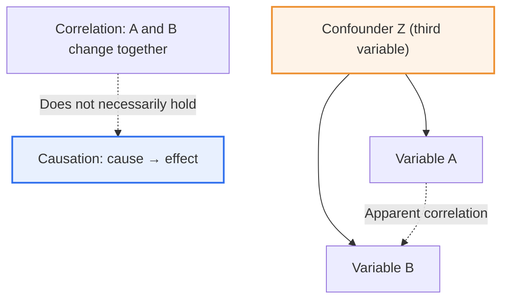
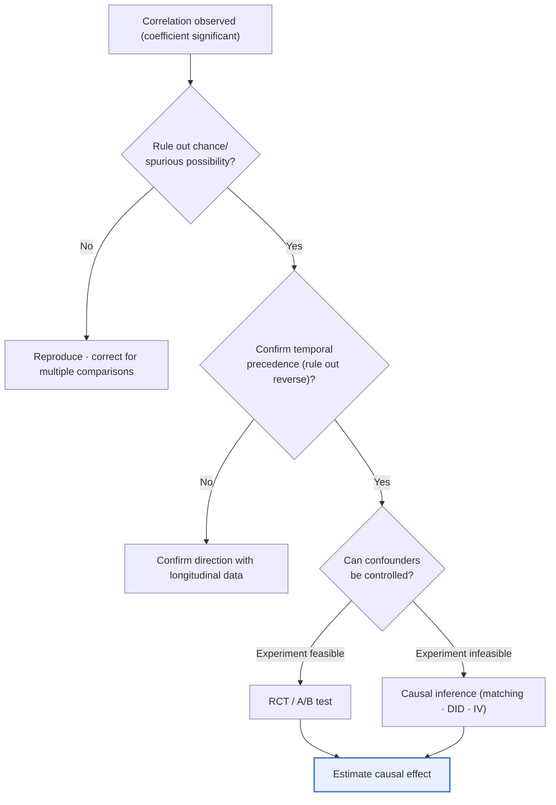

# Correlation and Causation

## 1. Overview

### A. Definition
> **Correlation** is a statistical relationship indicating that two variables **tend to change together**, whereas **causation** is a directional relationship in which a change in one variable (the cause) **directly produces** a change in another (the effect). The most famous maxim in data analysis, "**Correlation does not imply causation**," captures the relationship between the two concepts.

The reason this distinction is fundamentally important in data analysis is that '**mistaking correlation for causation leads to identifying the wrong cause, and as a result pouring resources into misguided countermeasures**.' A classic example: in summer, ice cream sales and drowning incidents show a strong positive correlation. Yet ice cream consumption does not cause drowning, and banning ice cream sales would not reduce drownings. Both phenomena are merely results driven simultaneously by a hidden third variable, 'summer heat' (a **confounder**). If this correlation were misread as causation, an absurd policy such as 'let us regulate ice cream to prevent drowning' could result.

The fact that two variables move together only tells us 'what changes together'; the direction and existence of causation—'what causes what'—require separate verification (experiment or causal inference). In particular, **in the big-data era, as the number of variables explodes, countless spurious correlations that arise purely by chance** are observed. More data does not make the truth reveal itself automatically; rather, the risk of being fooled by chance patterns grows. Thus the ability to accurately distinguish correlation from causation is the starting point of data literacy and a precondition for trustworthy decision-making.

### B. Background and Necessity
As data-driven decision making has spread across enterprises and governments, analytical results increasingly feed directly into policy, investment, and product decisions. When an analyst hastily interprets correlation as causation at this point, the entire organization moves in the wrong direction. For example, if a firm sees only the correlation that 'customers exposed to a particular marketing channel have a higher purchase rate' and pours budget into that channel, only to discover that in fact 'customers who already had high purchase intent viewed that channel a lot (reverse causation or selection bias),' the budget is wasted. Moreover, machine learning models learn correlations but do not understand causation, so a model relying solely on correlation loses predictive power sharply when the environment changes. Therefore, methodological training in distinguishing the two relationships and verifying causation is required as a core element of data analysis expertise.

## 2. Structure of the Two Relationships and a Comparison

The difference between correlation and causation comes down to 'the presence or absence of directionality' and 'the conditions for holding.' The concept diagram below shows the structure in which correlation does not lead directly to causation, and the next one shows the several pathways through which correlation is observed.

The key point of this diagram is that an observed correlation between A and B does not necessarily mean a direct causation of 'A→B' or 'B→A.' In the figure, when confounder Z moves A and B simultaneously, A and B appear strongly correlated even with no causation between them at all (apparent correlation, dashed line). Correlation is a **symmetric relationship with no direction**, so by itself it cannot distinguish whether A causes B, B causes A, or both are results of Z. Causation, by contrast, is an **asymmetric, directional relationship** running from cause to effect.

| Category | Correlation | Causation |
|---|---|---|
| **Meaning** | Tendency to change together | Cause produces effect |
| **Directionality** | None (symmetric) | Present (cause → effect) |
| **Measurement / verification** | Correlation coefficient (−1 to +1) | Experiment (RCT) / causal inference |
| **Relationship of holding** | Can hold without causation | Usually accompanied by correlation |
| **Decision-making implication** | "What changes together" | "What, if changed, changes the outcome" |

Put into words, correlation can quantify the 'strength of changing together' as a value between −1 and +1, like the Pearson correlation coefficient, but a large value is not evidence of causation. Conversely, when causation holds, correlation is usually observed as well (because when the cause changes, the effect changes too), but the reverse does not hold. This asymmetry is precisely what makes the two concepts easy to confuse yet decisively different.

### A. The Three Conditions for Causation
Since the philosopher John Stuart Mill, it has generally been held that to claim causation, three conditions must be jointly satisfied. The first is **covariation**—that is, cause and effect must actually change together (the existence of correlation). The second is **temporal precedence**—the cause must occur earlier in time than the effect. The third and most demanding condition is the **exclusion of alternative explanations (non-spuriousness)**—that is, the observed relationship must not be explainable by a third factor such as a confounder.

The correlation coefficient confirms only the first condition; it tells us nothing about the second and third. In particular, the third condition (ruling out confounding) is difficult to fully satisfy through observation alone, so as shown below, experiments or sophisticated causal inference techniques become necessary. The fundamental reason causal judgment is difficult lies precisely in this 'difficulty of exclusion.'

### B. Cautions in Interpreting the Correlation Coefficient
The Pearson correlation coefficient, the representative measure for quantifying correlation, has the limitation of capturing only the strength of the 'linear' relationship between two variables. If two variables have a clear nonlinear relationship, such as a U-shape, the Pearson coefficient can come out near 0 even though they are in fact strongly related. Conversely, when a few extreme outliers are present, the coefficient may be inflated or reversed regardless of the actual trend. The famous Anscombe's quartet presents four datasets with identical correlation coefficients and means but entirely different scatterplot shapes, reminding us not to trust a single number but always to check the distribution graphically. Therefore, before treating a correlation coefficient as evidence of causation, prudence requires examining the shape of the relationship, outliers, and sample size together.

## 3. Cases Where Correlation Is Not Causation, with Examples

Cases where correlation is observed but is not direct causation fall broadly into three types. Each type arises for a different reason and calls for a different response.

| Type | Principle | Representative example |
|---|---|---|
| **Confounder (common cause)** | A third variable Z affects both A and B | Ice cream sales ↔ drownings (heat) |
| **Chance (spurious correlation)** | Arises by chance in multivariate data | A country's cheese consumption ↔ number of bedsheet deaths |
| **Reverse causation (wrong direction)** | Causal direction is opposite to reality | "People who visit the hospital often are sicker" |

### A. Apparent Correlation Due to a Confounder (Common Cause)
Apparent correlation due to a confounder is the most common and, in practice, the most dangerous of the three types. As in the ice cream–drowning example above, when a single common cause (heat) drives up two outcomes simultaneously, a strong correlation is observed between them even with no direct causation at all. In such cases, artificially adjusting one of the two variables does not budge the other. This is exactly why stopping ice cream sales does not reduce drownings.

In practice, this common-cause structure lurks everywhere. The correlation that 'a city with a larger economy has more crimes, more hospitals, and more coffee shops' is merely the result of a common cause—population and city size—inflating all sorts of variables together; coffee shops do not cause crime. In marketing, the observation that 'sales were high in months with heavy TV advertising' may likewise be because a common cause—peak season (holidays, year-end)—raised both the ad budget and sales at once. The remedy is to identify suspected confounders in advance and control for them through stratification, matching, or regression adjustment, and to check whether the relationship remains after such control.

### B. Spurious Correlation Due to Chance
Spurious correlation due to chance is a trap that has become especially severe in the big-data era. If there are thousands of variable pairs to compare, a substantial portion of them will show high correlation coefficients purely by chance, despite having no causal or structural connection at all. As in the case where 'annual per-capita cheese consumption and the number of people who died tangled in their bedsheets' moved together for several years, any number of combinations can be found that are statistically clearly correlated yet cannot possibly hold causally by common sense.

The essence of this problem lies in multiple comparisons. The more relationships you test, the higher the probability that a result 'appears significant' by chance. Data dredging and p-hacking—rummaging through data without a specific hypothesis and cherry-picking only the significant correlations—dress up such chance as truth. The defense is to fix hypotheses in advance (pre-registration), apply multiple-comparison corrections (Bonferroni, etc.), and reproduce discovered correlations on independent new data.

### C. Reverse Causation (Wrong Direction)
Reverse causation is the error of pointing to the direction of cause and effect in reverse. A typical case is seeing the correlation that 'people who visit the hospital often are sicker' and concluding that 'hospital visits worsen illness.' In reality, people go to the hospital because they are sick, so the causal arrow points the opposite way. Likewise, the observation that 'people who used a smoking-cessation clinic have a higher incidence of lung disease' is also reversed in direction, because it was people already suffering the harms of smoking who visited the clinic.

The key clue for detecting reverse causation is 'temporal precedence,' one of the conditions for causation seen earlier. Confirming with time-series or longitudinal data whether the cause occurred before the effect helps to determine direction. However, in cyclical structures (feedback loops) where two variables influence each other, even determining the temporal order is not easy, so an understanding of the theoretical mechanism is also required.

### D. Industry Application — A/B Testing at Netflix and E-commerce
A representative domain where distinguishing correlation from causation directly affects revenue is the experimentation culture of digital services. Companies like Netflix and Amazon do not judge 'which thumbnail drives clicks' or 'whether a change to the recommendation algorithm increases watch time' from simple log correlations. Logs alone might show the correlation that 'users who saw a large thumbnail watched longer,' but this could be selection bias—users who were already interested in that content merely happened to be exposed to the large thumbnail.

So they isolate and measure only the causal effect through A/B tests that randomly assign users to two versions. For example, if you randomly split millions of people and expose only one group to a new UI and compare conversion rates and dwell time, then thanks to random assignment the differing characteristics of the two groups cancel out on average, leaving only 'the difference the UI change actually produced.' In e-commerce too, trivial changes such as the color of the checkout button or the wording of delivery notices are tested by the hundreds, and only those confirmed to have a statistically significant causal effect are rolled out fully. Internalizing an experimentation platform as an 'institutional device to avoid mistaking correlation for causation' in this way is a common trait of data-leading companies.

## 4. Deep Dive: Causal Inference Methodology and Recent Trends

Efforts to go beyond correlation and establish causation have recently emerged as a core topic in data science, and the methodology divides broadly into experimental and observational approaches.

**The standard of the experimental approach is the Randomized Controlled Trial (RCT).** When subjects are randomly assigned to a treatment group and a control group, all conditions other than the cause variable become equal on average across the two groups, so confounders are automatically controlled. The **A/B tests** of web and app services apply this very principle in practice, exposing users randomly to two versions to causally measure whether a specific UI change actually 'produces' a change in conversion rate. Thanks to the device of random assignment, A/B test results can be interpreted not as mere correlation but as estimates of a causal effect.

**When only observational data exist and experiments are impossible or unethical** (e.g., the causation of smoking on lung cancer), causal inference techniques are used. Representative methods include Propensity Score Matching, which pairs a control group similar to the treatment group for comparison; Difference-in-Differences, which contrasts changes before and after a policy and between groups; and Instrumental Variables and Regression Discontinuity Design (RDD), which circumvent confounding. Recently, Judea Pearl's **Structural Causal Model (SCM), the do-calculus, and causal diagrams (DAGs)** are widely cited as theoretical foundations, and **Causal ML**, combined with machine learning, is actively researched for estimating heterogeneous treatment effects (HTE) and the like. However, observational causal inference relies on the strong assumption that 'there are no unmeasured confounders,' so when interpreting results, prudence is needed to examine the validity of that assumption and to avoid categorical claims.

The concept diagram below organizes the practical decision-making flow for judging causation, starting from an observed correlation. When a correlation is found, one does not immediately conclude causation but excludes alternative explanations in turn, then splits the verification path depending on whether an experiment is feasible.

The essence of this flow is that judging causation is not 'a single statistical test' but 'a process of eliminating alternative explanations one by one.' Only after passing all three gates—ruling out chance, confirming direction, and controlling for confounding—can causation be cautiously claimed. Skipping even one gate leaves the risk of falling into the ice cream–drowning error seen earlier.

Such methodology is applied differently across domains. In medicine and epidemiology, random assignment is often unethical, so cohort and case-control studies are combined with Bradford Hill's criteria for causal judgment (strength of association, consistency, dose-response, etc.) to reach a comprehensive causal judgment. In economics and policy evaluation, natural experiments, difference-in-differences, and regression discontinuity are widely used, while in IT and marketing, A/B testing is effectively the standard. The reason each field has developed different tools is that 'the feasibility of experimentation' and 'ethical constraints' differ by field, but in every case the goal is identical—to rule out confounding and isolate the net effect of the cause.

## 5. Considerations and Implications

1. **The most reliable way to verify causation is experimentation (RCT / A/B testing).** Because random assignment controls for confounders, wherever feasible, experimental design should be prioritized ahead of observational analysis. This is why experiments are called the 'gold standard' of causation.
2. **When experiments are impossible, control for confounding with causal inference techniques.** Use propensity score matching, difference-in-differences, instrumental variables, structural causal models (DAGs), and so on, but always examine together whether the identification assumptions each technique requires (no confounding, parallel trends, etc.) hold.
3. **Beware the spurious-correlation trap of the big-data era.** As the number of variables grows, chance correlations proliferate, so when you find a correlation, do not conclude immediately but verify the causal mechanism of 'why it is so' and its reproducibility. Restraint devices such as multiple-comparison corrections and pre-registration of hypotheses prevent data dredging.
4. **Internalize a causal perspective in decision-making and predictive model design.** In prescriptive and policy decisions that must answer the intervention question 'what, if changed, changes the outcome,' you need estimation of causal effects, not correlation-based prediction. Moreover, since models relying solely on correlation are vulnerable to distribution shift, identifying causally stable variables is desirable for robust models.

## References
- Judea Pearl, "The Book of Why: The New Science of Cause and Effect"
- Tyler Vigen, "Spurious Correlations" (a collection of spurious-correlation examples)

---

> **In one line**: Correlation is *a symmetric tendency for two variables to change together* and causation is *a directional relationship in which a cause produces an effect*—hence "correlation ≠ causation"; because of confounders, chance (spurious correlation), and reverse causation, causation cannot be asserted from correlation alone, so **it must be verified separately through randomized experiments (RCT / A/B testing) or causal inference techniques** to enable trustworthy decision-making.
