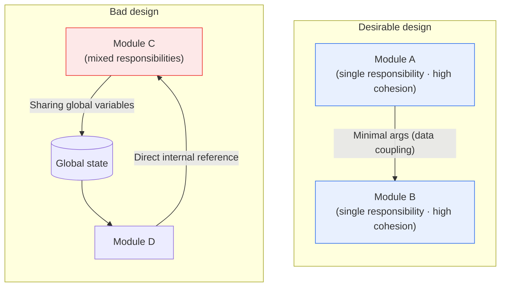

# Types of Software Coupling

## 1. Overview

### A. Definition
> **Coupling** is a measure of the **degree to which one module depends on another**; the lower, the better the design. Its opposite concept, **cohesion**, indicates **how closely the internal elements of a module are related toward a single purpose**, and the higher, the better. The grand principle of good module design is summarized as '**Low Coupling and High Cohesion**.'

Coupling and cohesion are concepts introduced by Larry Constantine and Edward Yourdon, who established Structured Design in the 1970s; half a century later they remain the foundation of all design discussion, from procedural to object-oriented to microservices. The reason these two measures have survived so long is that they confront **Change**, the essential difficulty of software, head-on. Software is not built once and finished; it is continuously modified to match changing requirements, and it is conventional wisdom that more than half of total development cost arises in the maintenance phase. The two axes that determine how well a system withstands change are precisely coupling and cohesion.

The reason coupling is a core measure of software quality is that it directly governs the '**ripple effect** by which a change in one module spreads to others.' When modules are strongly intertwined (high coupling), fixing one place breaks several connected modules together, making the scope of a change hard to predict and causing frequent regression defects. For example, if the payment module directly peers into the internal variable structure of the membership module, even a trivial refactoring of the membership module can halt payments. Conversely, when coupling is low, each module is independent, making it easy to modify, replace, reuse, and unit-test. Coupling is divided into several levels according to 'through what' modules are connected, and the further down the list, the weaker the coupling and the more desirable.

### B. The Necessity of Managing Coupling
The larger software grows and the longer it is maintained, the more frequent changes become; and when coupling is high, even a small change triggers a chain of failures. Design that lowers coupling is the fundamental principle for securing maintainability, reusability, testability, and extensibility, which in turn directly translate into development productivity and system longevity. The effort to lower coupling is not a mere theoretical virtue but a highly practical engineering activity aimed at controlling the cost of change and blocking the propagation of failures.

## 2. Types of Coupling (Strong → Weak)

Coupling is traditionally divided into six levels. The figure below shows the spectrum in which coupling weakens as one moves from the worst, content coupling, to the most desirable, data coupling.

**Content Coupling** is the strongest and worst form of coupling, occurring when one module **directly references or modifies the internal code or data of another module**, or branches into another module without going through its proper entry point (interface). This completely breaks down the boundary of the module, so even a tiny change to the target module's internals immediately breaks the referencing module. It directly violates encapsulation and must be avoided in all circumstances. A typical example is code in which module A directly manipulates the address of a local variable in module B.

**Common Coupling** occurs when several modules share and interact through **global data (global variables)**. Changing the structure of a single global variable forces modification of every module that uses it, and because it is hard to trace which module changed the value and when, debugging becomes extremely difficult. Commonly called the 'trap of global state,' this problem becomes a source of side effects as scale grows.

**External Coupling** arises when several modules share externally defined **data formats, communication protocols, device interfaces**, and the like. For example, if several modules are jointly bound to a particular file format or external API specification, they are all affected simultaneously when that format changes. As a dependence on external specifications it is somewhat unavoidable, but it is desirable to isolate it with an adapter layer to narrow the scope of impact.

**Control Coupling** occurs when one module passes a **control signal (flag, switch)** to another, governing the internal flow of the receiving module. For example, if in `process(data, mode)` the called function branches into completely different logic depending on the value of `mode`, the caller must know the callee's internal logic, so coupling strengthens. This often appears together with modules of low (logical) cohesion.

**Stamp Coupling** occurs when modules **pass an entire data structure (record, object) but actually use only some of its fields**. Because even unnecessary fields are exposed in the passing interface, a change to the data structure can affect even modules that do not use those fields. It is a relatively benign level—stronger than data coupling but weaker than control coupling.

**Data Coupling** is the most desirable form of coupling, occurring when modules exchange **only the strictly necessary data (primitive parameters)** as arguments. The interface is minimal and clear, so the modules need not know each other's internals, and a change to one is confined in its impact on the other to the argument specification. It is the target that design should aim for.

| Coupling | Connecting medium | Coupling strength | Problem / characteristic |
|---|---|---|---|
| **Content** | Direct reference/modification of another module's internals | Worst | Destroys encapsulation; avoid absolutely |
| **Common** | Sharing global variables | Strong | Side effects; hard to trace |
| **External** | External format/protocol/device | Strong | Simultaneous impact on spec change |
| **Control** | Control flag governs the other's behavior | Medium | Exposes internal logic |
| **Stamp** | Passing whole data structure (using only part) | Weak | Exposes unnecessary fields |
| **Data** | Passing only necessary parameters | Best (benign) | Minimal, clear interface |

## 3. Relationship and Interaction with Cohesion

Coupling must be judged in tandem with cohesion. Good design is a structure in which the inside of a module is tightly bound around a single responsibility (high cohesion) while modules are connected minimally (low coupling). Interestingly, the two measures pull on each other. A module with high cohesion does 'only one thing,' so what it exchanges with the outside becomes clear and its coupling naturally drops; conversely, a module with low cohesion that mixes together many jobs becomes entangled here and there, raising its coupling.

Cohesion, too, is divided into seven levels from lowest to highest, the highest being **functional cohesion**, in which a module performs only a single function. Each level is distinguished by 'for what reason the elements within the module are grouped together.'

| Cohesion | Reason for grouping | Strength |
|---|---|---|
| **Coincidental** | Grouped by chance with no relation | Worst |
| **Logical** | Grouping functions of similar character (selected by flag) | Low |
| **Temporal** | Executed at the same time (initialization, etc.) | Low |
| **Procedural** | Grouped by order of execution | Medium |
| **Communicational** | Using/producing the same data | Medium |
| **Sequential** | One element's output is the next's input | High |
| **Functional** | Cooperating for a single purpose | Best |

The reason for viewing the 6 levels of coupling and the 7 levels of cohesion together is that being good at only one of them does not make a good module. If you attend only to data coupling and neglect cohesion, the interface is clean but the module's internals are tangled; if you attend only to cohesion and abuse global variables, the modules are solid but the whole system is entangled. Interestingly, 'logical cohesion' modules often select behavior via flags and thus frequently entail 'control coupling,' which nicely illustrates the correlation whereby low cohesion invites high coupling.

## 4. Examples and Practical Implications

Concretely, consider 'order processing' and 'inventory management' in an online shopping mall. In a **bad design**, the order module directly reads and decrements the global inventory variable used by the inventory module (common and content coupling). In this case, changing the inventory-management approach from 'real-time deduction' to 'reserve-then-confirm' requires modifying the order module's code as well, and concurrency problems pile on to spread failures. In a **good design**, the order module passes only a clear argument, `reserveStock(productID, quantity)` (data coupling), to the inventory module, and the inventory module decides its internal processing on its own. Then no matter how the inventory logic changes, as long as the interface is preserved, the order module is unaffected.

The reason this difference matters in practice is that it directly determines the success or failure of '**change isolation**.' When coupling is low, the scope of impact of a change or failure is confined within the module boundary, reducing the regression-test scope and lowering deployment risk. Indeed, one motive for decomposing large systems into microservices is to limit inter-service coupling to APIs so that each service can be independently deployed, scaled, and fault-isolated. Conversely, in highly coupled monolithic code, one team's fix breaks another team's feature, and deployment often becomes a bottleneck.

As a second example, consider treating '**user session information**,' commonly referenced by many screens, as a global object that each module reads and writes directly. It seems convenient at first (common coupling), but the moment you switch the login scheme from session-based to token-based, you must hunt down and fix all the dozens of modules that touched that global object. Because it is hard to trace which module changed the session value and when, merely identifying the cause of an intermittent authentication bug can take days. If you wrap this in a separate module with session-lookup and update interfaces and convert it to data coupling, the impact of an authentication-scheme change is confined within that single module.

Third, coupling is also directly tied to **testability**. If a module strongly depends on another module's internal implementation or on global state, it is hard to detach that module alone for unit testing, because you must set up the entire dependency for the test. Conversely, a module designed with data coupling through an interface can be easily replaced with a **mock/stub** that mimics that interface and tested independently. In other words, low coupling is also a precondition for automated testing and continuous integration (CI).

Ultimately, coupling is not a matter of a single line of code but a structural property that shapes even a development organization's way of working and its deployment rhythm. Strong coupling enlarges the set of 'things that must change together,' bloating the unit of change, whereas weak coupling localizes change so that many people can work safely in parallel.

## 5. Deep Dive: Extension to Modern Architecture and Recent Trends

Coupling and cohesion are concepts from the procedural era, but their principles have been inherited and extended intact into modern design thinking. Among the object-oriented **SOLID principles**, the Single Responsibility Principle (SRP) targets cohesion, while the Dependency Inversion Principle (DIP) and Interface Segregation Principle (ISP) are concrete guidelines for lowering coupling. **Dependency Injection** is a representative technique that loosens coupling by making a concrete class depend on an abstraction (interface) rather than another concrete class.

Attempts to quantify coupling have also continued. Notably, **CBO (Coupling Between Objects)** among the object-oriented CK Metrics measures coupling by counting the number of other classes a class is coupled to, and empirical studies report that the larger this value, the higher the tendency toward change impact and defect density. Such metrics are used as grounds for prioritizing refactoring or for tracking how entangled an architecture becomes over time.

In Microservices Architecture (MSA), coupling becomes the first principle of service-boundary design. Service boundaries are divided by the **Bounded Context** of Domain-Driven Design (DDD), and coupling is lowered by having services communicate only through well-defined APIs and events. In particular, Event-Driven Architecture (EDA), which pursues **loose coupling** based on message queues and events instead of synchronous calls, blocks failure propagation by keeping services from depending directly on each other's existence or availability. However, splitting services too finely can produce a 'Distributed Monolith' in which network calls become entangled, actually raising coupling; hence boundary design from a coupling perspective is above all important. Recently, tools that measure such architectural coupling through static analysis and dependency graphs, and automatically detect circular dependencies or excessive fan-in/fan-out, are also widely used.

## 6. Considerations and Implications (Professional Engineer's Perspective)

1. **Aim for data coupling and eliminate strong coupling.** Modules should exchange only strictly necessary data as parameters, keeping interfaces minimal and clear. Sharing global variables (common coupling) or directly referencing internals (content coupling) leads to design debt and should be caught in code review and static analysis.

2. **It connects to information hiding, encapsulation, and interface design.** Hiding a module's internal implementation and communicating only through published interfaces naturally lowers coupling. Interface design—deciding 'what to expose and what to hide'—is the core means of managing coupling.

3. **Coupling and cohesion are the balance point of a trade-off that must be managed together.** Optimizing only one does not make a good module. Because high cohesion induces low coupling, decomposing modules to uphold single responsibility is the most effective strategy for improving both measures at once.

4. **Apply it by extending to the architecture level.** MSA, layered and event-driven architectures, dependency injection, and DDD boundary-setting are all extensions of the principle of lowering coupling. Low coupling becomes the architectural foundation that enables independent deployment, scaling, fault isolation, and parallel development.

5. **Beware the counterproductive effects of over-decomposition.** Splitting modules or services too finely in an attempt to lower coupling can increase mutual calls and, on the contrary, produce a distributed monolith with rising complexity and coupling. Coupling is not to be 'lowered unconditionally' but is a design judgment that must find its optimum within a balance against cohesion and operational complexity.

## References
- Stevens, Myers, Constantine, "Structured Design", IBM Systems Journal, 1974 — https://ieeexplore.ieee.org/document/5388187
- Martin, R. C., "Clean Architecture / SOLID Principles" — https://blog.cleancoder.com/
- Wikipedia, "Coupling (computer programming)" — https://en.wikipedia.org/wiki/Coupling_(computer_programming)

---

> **In one line**: Coupling is the degree of dependence between modules, weakening in the order *content > common > external > control > stamp > data* (data coupling being best); the design principle of 'low coupling and high cohesion' isolates the ripple of change to make maintenance, reuse, and testing easy, and extends intact into modern architectures such as SOLID, DI, and MSA.
