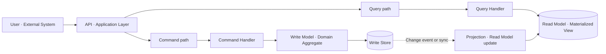
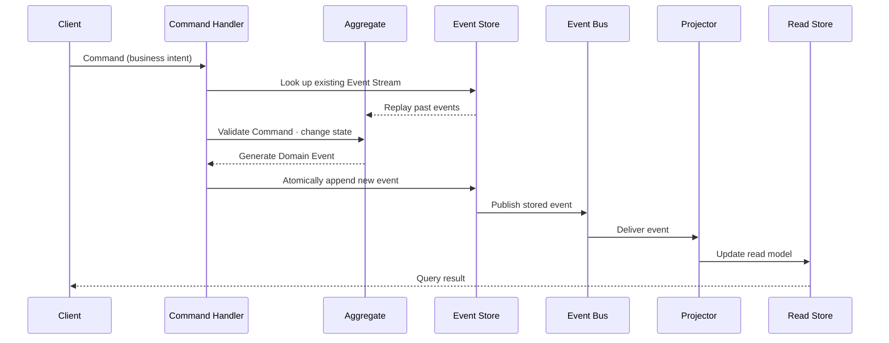

# CQRS and Event Sourcing (Command Query Responsibility Segregation · Event Sourcing)

## 1. Overview

### A. Definition

> **CQRS (Command Query Responsibility Segregation)** is an architectural pattern that separates the responsibilities for reads (Query) and writes (Command) within a single data model, applying models, processing flows, and performance strategies suited to each purpose.
>
> **Event Sourcing** is a persistence pattern that, rather than updating and storing only the current state, records the domain events that changed the state in chronological order in an append-only fashion, and reconstructs state by replaying events when needed.

CQRS and event sourcing are often used together, but they are not the same concept.
The core of CQRS is the separation of responsibility between read and write models, and it can be CQRS even when a general relational database is used on both sides.
The core of event sourcing is preserving the fact of a data change as an append-only event, and it does not necessarily have to split reads and writes into separate models.
When the two are combined, the write side validates domain rules and records events, while the read side projects events to build views optimized for querying.

Traditional CRUD systems are accustomed to reading and modifying the current row of a table.
This approach is efficient when the business is simple and immediate consistency matters, but the model becomes complex when the load characteristics of reads and writes differ greatly or when the change history itself is important.
For example, if you merely overwrite an order status with `Delivered`, it is hard to restore who changed the status, when, and under what rule, and what payment and inventory events occurred before that.
CQRS and event sourcing are options for redesigning such problems from the perspective of the data storage method and the business model.

### B. Background and Necessity

First, the optimization goals of reads and writes differ from each other.
Because writes must uphold invariants and concurrency control, a normalized domain model and short transactions can be advantageous.
Reads, on the other hand, need different data per screen, report, and search, so a denormalized query model can be advantageous for reducing join costs.
Placing both demands on a single model makes it hard to make every query screen fast without compromising the write rules.

Second, as a service's scale and functionality grow, the need arises to preserve the meaning of state changes.
In areas such as financial transactions, inventory movements, point accrual, and permission changes—where the "current value" alone makes it hard to explain audits, disputes, and settlements—the fact and order of changes become important assets.
Event sourcing leaves events as the source of truth so that the state at a past point in time, or the basis for a judgment, can be recomputed.
That said, the goal is not to turn every table into events; the business value of change history and the operational cost must be assessed together.

Third, in microservices and event-based architectures, there is a need to loosely connect a service's internal state changes with other services.
If the order service publishes the fact of an order creation, the inventory, payment, and notification services can each build their own model.
However, asynchronous delivery creates eventual consistency instead of immediate consistency, so you must also design how to explain and reconcile the gap between what the user sees and the final state.

## 2. Concept and Structure of CQRS

### A. Logical Structure

A Command expresses the intent to change the system's state.
Rather than directly dictating a field in the store, like `ChangeProductQuantity`, designing commands that represent business actions such as `ConfirmOrder`, `ApprovePayment`, or `CancelReservation` makes it easier to validate domain rules in one place.
A command can return success or failure, but what event occurred during command processing can be recorded separately as an event.

A Query returns a representation needed for lookup without changing state.
A query model can hold DTOs pre-assembled in the shape a screen or report requires, and applying indexes, a search engine, or caching to this model does not directly conflict with the integrity rules of the write model.
That said, the rule that a Query does not change data is upheld not merely technically; it includes the design principle of not inserting an implicit counter increment or a last-access-time update at query time.

CQRS is implemented in various forms according to the level of separation.
The weakest form logically separates command services and query services within a single database.
An intermediate form maps the same source data to two models, and a strong form physically separates the write store and the read store and connects them via events or change data capture.
The higher the separation level, the better the independent scalability and query optimization, but the greater the burden of deployment, monitoring, and data consistency.

### B. Roles by Component

| Component | Responsibility | Design focus |
|---|---|---|
| Command | Convey intent to change state | Business terms, validity, idempotency |
| Command Handler | Coordinate commands and set transaction boundaries | Authorization, duplicate handling, error return |
| Write Model | Enforce invariants and domain rules | Aggregate, concurrency, consistency |
| Query | Request needed information | Query contract, filter, pagination |
| Read Model | Provide state optimized for lookup | Denormalization, index, search performance |
| Projector | Reflect source changes into the read model | Ordering, reprocessing, deduplication |
| Event Store or Write Store | Persist changes | Atomicity, retention, versioning, backup |

The Command Handler is not a simple controller.
It must verify the authenticated caller's permission, load the Aggregate, judge whether the command is valid at the current version, and store a successful change within a single transaction boundary.
If tasks outside the transaction, such as external payment or SMS dispatch, are performed directly inside the handler, the order of store-success and external-call-success can go out of sync, so the Outbox or a process manager described later is needed.

The Read Model is not a copy of the original but a projection result meant to answer a specific question.
The order-list screen may need only per-customer order summaries and recent status, while the settlement screen may need broad payment, refund, and tax information.
The two screens may have different read models, and clearly premising that the read model is derived data that can be regenerated makes it easy to change the schema in line with business change.

### C. Effects and Limits of Applying CQRS

Separating reads and writes lets you horizontally scale only the read model when query traffic surges.
You could build search- and aggregation-centric screens to fit Elasticsearch or a columnar store, while the command side uses a store strong in transactions.
Also, because the write model concentrates on expressing domain rules and the read model on expressing the user experience, the intent of each codebase becomes clear.

However, separation itself does not guarantee performance.
Projection lag, message-broker bottlenecks, read-model index design, and network round trips can all increase overall response time.
Operating both read and write stores means applying backup, disaster recovery, schema change, and access control to two systems.
Therefore, you must first measure whether the current system's bottleneck is due to model coupling or is simply an index, query, or cache problem.

## 3. How Event Sourcing Works

### A. Event-Centric State Management

In event sourcing, instead of storing only the result `current balance = 100,000 KRW`, you store the flow of facts that changed the state, such as `Deposit 150,000 KRW` and `Withdrawal 50,000 KRW`.
Because an event is a fact that has already occurred, it is generally given a past-tense name and treated as an immutable object whose content is not modified after storage.
Events of the same Aggregate have an order, and when the Aggregate is rebuilt they are applied in that order.

An event store differs from a simple message queue.
A queue may delete consumed messages or have a different delivery-guarantee scope, but an event store, as the source of truth for the business, requires long-term retention, replay, version management, and lookup.
Conversely, turning the event store into an indefinite repository for all integration messages amplifies privacy and cost problems, so the retention purposes of business events, integration events, and technical logs must be separated.

### B. Aggregate and Event Stream

An Aggregate is a cluster of domain objects that must have their consistency rules validated together for a single command.
Within an order Aggregate you can atomically validate the relationship between order status and order items, but binding orders, inventory, and payment all into one giant Aggregate increases concurrency bottlenecks and service coupling.
Aggregate boundaries are judged by business invariants and transaction boundaries, not by database table boundaries.

Each Aggregate can have a per-identifier event stream.
When a new command arrives, the corresponding stream is read to build the current state, and optimistic concurrency control is applied by comparing the current version with the version the command expects.
For two users to reserve the same seat, the first append must raise the version and reject the second append to prevent duplicate reservations.
Checking the same command ID on retry can also reduce duplicate processing caused by network timeouts.

### C. Event Design Elements

| Element | Meaning | Example |
|---|---|---|
| Event ID | Global identifier of the event | UUID |
| Aggregate ID | The business object the event belongs to | order-2026-0818-001 |
| Stream Version | Sequence number within the Aggregate | 17 |
| Event Type | The kind of business fact that occurred | OrderConfirmed |
| Occurred At | The business time of occurrence | Time including time zone |
| Payload | Data to replay the fact | Amount, currency, product identifier |
| Metadata | Tracing/security/correlation info | correlation ID, actor |

An event Payload should contain the facts needed for replay, not "a snapshot of the current value."
For example, recomputing the order amount at the current product price could change the result of a past order after a price change, so the unit price, tax, and discount-policy version at the time of the order must be left in the event.
Conversely, replicating sensitive information such as a resident registration number into every event makes it hard to uphold deletion and retention policies, so tokenization, reference separation, encryption, and field minimization are applied.

### D. Replay and Snapshot

As the number of events grows, the cost of replaying the entire stream from the beginning every time increases.
A snapshot is an optimization that stores the Aggregate state replayed up to a specific version and then applies only subsequent events to reduce loading time.
Because a snapshot is a derived cache rather than the source of truth, it must be reconstructible from events if it is corrupted or stale.
Store the snapshot's creation point together with the applied event version, and verify that the snapshot does not run ahead of the current stream.

Event replay is also used to build a new read model.
By feeding existing events in order into a Projector, you can rebuild a search index or an audit screen.
At this time, if the code version of the Projector currently in operation differs from that of the replay Projector, the results can differ, so the projection version and the event schema version must be recorded.
Because replay can increase operational traffic and store load, design a separate consumer group, rate limiting, checkpoints, and a failed-event repository.

## 4. Operating CQRS and Event Sourcing in Combination

### A. End-to-End Processing Flow

When a client sends a `ConfirmOrder` command, the API layer performs format validation and authentication.
The Command Handler checks the command for duplication and permission, then reads the order Aggregate's event stream.
The Aggregate validates, from the current state, whether inventory has been reserved, the payment status, and whether the order has expired, and if the conditions are met, creates an `OrderConfirmed` event.
The event store checks the expected version, atomically appends the event, and delivers only the successful event to the downstream projection.

The Projector receives the event and updates one or more Read Models, such as the order list, customer screen, and settlement view.
Because each Read Model can interpret the same event in a different way, per-screen requirements need not be forced into the write model.
Lookups are handled by the Read Model, and when the query model has not yet been updated right after a command, provide the user with a processing status, version, or a re-query prompt.

### B. Consistency and Failure Handling

A representative characteristic of the combined CQRS and event-sourcing structure is the eventual consistency between the write source of truth and the read projection.
The moment an event append succeeds, the business source of truth has changed, but due to network or Projector lag, the previous state may briefly remain on screen.
Hiding this lag can make users mistakenly think a payment failed or repeat the same command, so it is safer to provide a separate status model that looks up the request ID and processing status.

Projectors are generally best implemented idempotently on the premise of at-least-once delivery.
By storing the event ID and Aggregate version, skip already-processed events, and make the final result the same even if the same event is reprocessed after a failure mid-update.
In streams where order matters, guarantee per-Aggregate-ID ordering, and send out-of-order events to a hold queue or retry after checking the current version.

For integration with external systems, the Outbox pattern is useful.
By recording the business data and the message to be published in the same local transaction and then having a separate publisher deliver the message to the message broker, you can reduce the dual-write problem in which data is stored but the event is not published.
However, if the event store itself is atomically coupled with a publishing function, a separate Outbox may be redundant, so first check the store's delivery guarantee and operational characteristics.

Retain failed events so their causes can be traced.
Unconditional retries can let bad data or invalid events clog the processing queue, so distinguish retry counts, backoff, a quarantine queue, and an operator reprocessing procedure.
When reprocessing, maintain auditability by publishing a new corrective event rather than modifying the original event.

### C. Event Versioning and Schema Evolution

Because events are retained for a long time, you must not assume that today's class structure can be read unchanged tomorrow as well.
When adding a field, add it as an optional field that existing consumers can ignore, and when changing a field's meaning, distinguish it with a new event type or an explicit version.
Bulk-modifying all existing events can compromise the immutability of past facts and the audit trail.

Event upcasting is a method of converting a past event to the current format at the time it is read, while migration is a method of converting to a new event format or new stream and storing it.
Upcasting makes it easy to preserve the original but accumulates conversion code, whereas migration can simplify consumption but requires large-scale reprocessing and verification.
Compatibility rules must cover the deployment order of producers and consumers, required fields, enum additions, and deletion policy.

## 5. Comparison of Traditional CRUD, CQRS, and Event Sourcing

### A. Differences by Pattern

| Category | Traditional CRUD | CQRS | Event Sourcing | CQRS + Event Sourcing |
|---|---|---|---|---|
| Source data | Current-state rows | Depends on implementation; current state | Immutable event stream | Event stream + projections |
| Read/write models | Mostly identical | Separated | Not necessarily separated | Clearly separated |
| History restoration | Requires separate audit log | Separate design | Naturally possible | Possible via event replay |
| Consistency | Strong consistency easy | Choice of sync/async | Varies with replay/projection | Write strong, read can be eventual |
| Complexity | Low–medium | Medium–high | High | Can be the highest |
| Suitable situation | Simple business, immediate lookup | Business with differing read/write traits | Business where change facts and replay are core | High-load, audit, multi-view business |

As the table shows, CQRS is not a superset concept that includes event sourcing.
CQRS is the separation of models and responsibilities, and event sourcing is a choice of persistence method, so the two must be judged as independent axes.
For example, a system that stores current state in a write DB and replicates it to a query DB is CQRS but may not be event sourcing.
Conversely, a system that replays an event stream to build a single current-state object is event sourcing but may not separate read and write models.

### B. Synchronous vs. Asynchronous Processing

Synchronous CQRS updates even the read model within the same request after command processing, returning the latest result to the user immediately.
Its implementation is simple and the user experience is predictable, but command-processing time lengthens when there are multiple read models or external systems.
You must also decide the policy on whether to treat a read-model update failure as a command failure or to reconcile it later.

Asynchronous CQRS stores the event, and then a Projector updates the read model separately.
It speeds up the write response and lets consumers scale independently, but you must manage event lag, duplication, ordering, reprocessing, and the state difference visible to users.
For most business, rather than making every path asynchronous, it is realistic to separate commands that need strong immediate consistency from ancillary projections that can tolerate lag.

### C. Criteria for Deciding to Apply

| Decision question | Signal to consider applying | Signal to delay adoption |
|---|---|---|
| Do reads and writes have different loads? | Lookups far exceed writes, or patterns are varied | Load and model are simple |
| Is change history a business asset? | Audit, dispute, point-in-time lookup matter | Only current state is needed |
| Are domain rules complex? | Aggregate invariants and command intent are distinct | Mostly simple register/lookup |
| Can you accept eventual consistency? | Processing state and retries are permitted | Immediate consistency is core, as in payment/inventory |
| Is operational capability ready? | You have messaging, observability, and reprocessing systems | Backup and monitoring staff are lacking |

These criteria put business risk ahead of technology fads.
For example, even with many read screens, if simple indexes and caches can solve it, there is no need to adopt CQRS.
Conversely, if you must reproduce past decisions and the change actor in a customer dispute, the added cost of event sourcing can be offset by audit value.

## 6. Application Cases

### A. Seat Reservation and Order Processing Case

In a concert seat-reservation system, `SelectSeat` and `ConfirmReservation` are modeled as different commands.
The ConfirmReservation Command Handler checks the seat Aggregate's current version and reservation-expiration time, and rejects the command if another user reserved first.
On success, it records events such as `SeatHeld` and `ReservationConfirmed` in order, and the seat-lookup model projects the seat as `Reserved`.

Because the seat-status screen is queried by a great many users, the read model can be placed in a cache or search store.
However, final purchase availability must be decided not by trusting only the cached screen value but by the command side's Aggregate and version validation.
Even if the screen briefly shows `Available`, clearly informing the user of the policy that it may fail at confirmation time, and guiding them to an alternative seat on failure, can reduce the inconvenience of eventual consistency.

### B. Financial Transaction and Audit Case

A financial wallet service can leave deposit, withdrawal, transfer, and fee-charge as events.
The current-balance Read Model is the result of reflecting events in order, and daily balance, transaction statement, and risk aggregation can each be built by a different Projector.
An auditor can replay events up to a specific time to reproduce the balance, and trace the transaction's actor, approval flow, and correlation ID.

Because duplicate processing is fatal in financial transactions, manage the command ID and external transaction ID as idempotency keys.
Storing an event does not mean the external bank API call succeeded, so separate external integration with a state machine and a retry policy.
When correction is needed, you must record a new fact with the opposite effect, such as `WithdrawalReversed`, rather than changing the amount of the existing withdrawal event, so that the ledger and audit trail agree.

### C. Logistics and Analytics View Case

In a logistics system, events such as `GoodsReceived`, `PickingCompleted`, `LoadingCompleted`, `ShipmentDeparted`, and `ShipmentDelivered` can constitute the flow of a shipment Aggregate.
The operations screen quickly shows current shipment status and estimated arrival time, while the analytics screen aggregates events by region, carrier, and delay cause.
Instead of handling every screen with a single normalized order table, building per-business read models lets query needs interfere less with one another.

Here, mishandling the order and duplication of events can make the shipment status revert to a past step.
The Projector validates the last-processed version per Aggregate ID and the allowed state transitions, and sends late-arriving events to a hold or to a correction procedure.
In cases where temporal order changes the business meaning, such as an address change after delivery completion, store both the event's occurrence time and receipt time to separate the basis for judgment.

## 7. Adoption Procedure and Test Strategy

### A. Phased Adoption

1. **Select business candidates**: Start with a limited Aggregate where change history, multiple lookups, and domain rules have real value.
2. **Investigate the current flow**: Inventory commands, state changes, external integrations, audit requirements, query SLAs, and failure-handling methods.
3. **Define the event language**: Agree on Event Types and Payloads based on the past-tense facts already used in the business.
4. **Build the write model**: First implement Aggregate boundaries, invariants, concurrency versions, and command idempotency.
5. **Guarantee atomic storage**: Confirm the transaction boundary of event append and version validation.
6. **Project from a single read model first**: Choose one screen essential to operations and verify lag, duplication, and reprocessing.
7. **Observability and operational automation**: Dashboard event lag, consumer lag, failure queues, reprocessing counts, and schema errors.
8. **Incremental expansion**: Extend stabilized events to other read models and external services, and version-manage each consumer's contract.

A pilot is safer to start in a business that has history value and is correctable, rather than in an area with high failure cost, such as an entire payment flow.
That said, because a pilot must be a scaled-down replica of real operational characteristics, you should deliberately test message lag, duplication, restart, and even schema change.
Rather than discarding existing CRUD at once, it is realistic to record events and existing state in parallel, verify the read model by comparison, and then shift traffic in stages.

### B. Test Items

| Test area | What is verified |
|---|---|
| Domain test | Per-command invariants, allowed state transitions, generated events |
| Replay test | Whether the same event stream produces the same Aggregate state |
| Concurrency test | Expected-version conflicts and duplicate-command handling |
| Projection test | Final result after event ordering, duplication, and restart |
| Contract test | Event schema and consumer compatibility |
| Failure test | Broker lag, store failure, failure-queue reprocessing |
| Performance test | append throughput, replay time, query latency, lag |
| Security test | Event access control, sensitive-info masking, audit log |

The replay test is more important than merely raising code coverage.
If replaying past events with a new version of the domain code produces a different result, it is a signal that a policy on schema versioning, upcasting, and domain-rule changes is needed.
The projection test must confirm that delivering the same event twice yields the same result as processing it once, and that the final state converges even after failing and restarting midway.

## 8. Deep Dive: Integration with Event-Driven Architecture

CQRS and event sourcing combine well with event-driven architecture, but publishing events does not make everything event sourcing.
An integration event is a contract for notifying another system, a domain event expresses a business fact inside an Aggregate, and an event-sourcing event is a persistent record for replaying the source state.
Unconditionally sharing the three events under the same name and payload can propagate an internal model change into an external contract change.
Placing a boundary that separately maps external integration events from internal domain events can lower coupling.

The Microsoft Azure Architecture Center describes CQRS as a pattern that separates read and write operations into distinct models, and explains that when combined with event sourcing, the event store serves as the write source of truth and the read model is built from events ([Microsoft CQRS Pattern](https://learn.microsoft.com/en-us/azure/architecture/patterns/cqrs), [Microsoft Event Sourcing Pattern](https://learn.microsoft.com/en-us/azure/architecture/patterns/event-sourcing)).
Martin Fowler likewise distinguishes CQRS itself as the separation of read and write models and not necessarily identical to event sourcing ([Martin Fowler CQRS](https://martinfowler.com/bliki/CQRS.html), [Martin Fowler Event Sourcing](https://martinfowler.com/eaaDev/EventSourcing.html)).
This distinction is the basis, in a professional-engineer answer, for not simply memorizing the two patterns as one bundle but explaining them with their application purposes and costs separated.

In practice, the more you use the event stream as the organization's long-term ledger, the more important data governance becomes.
You must connect each event's owner, retention period, access control, encryption key, whether it contains personal data, and the legal procedure for deletion/masking to your data classification scheme.
The principle that events are immutable does not mean personal data must be retained forever, so you must design policies such as identifier separation, encryption-key destruction, and deletion of derived models upon retention-period expiry.

## 9. Considerations and Implications

### A. Business Fit First

CQRS and event sourcing are not technologies that eliminate complexity but technologies that move complexity into explicit models and operational procedures.
Adopting them for business where reads and writes are simple can only increase store, message, and projection operating costs and raise the team's cognitive burden.
You must establish both quantitative and qualitative criteria for whether history, reproduction, multiple views, and independent scaling connect to real business value.

### B. Clarify Consistency Boundaries

You must distinguish, per business, the strong consistency of the write source of truth from the eventual consistency of the read model.
Payment approval, inventory deduction, and seat securing prioritize the command side's atomicity and concurrency control, while search, statistics, and notifications can accept lag and reprocessing.
Rather than trying to bundle all data into one global transaction, design boundaries with Aggregates and compensation/correction processes.

### C. Secure Operability

Event lag, consumer lag, failure queues, schema errors, and replay time must be managed as service-level indicators.
Without monitoring, it is hard to know whether the read model is stale, whether events were lost, or whether the Projector is repeatedly failing.
Reflect reprocessing authority and approval, checkpoint backup, and the procedure for regenerating the read model on failure in the operations manual and automation tools.

### D. Data Protection and Audit

Because events are retained for a long time, they may require a higher protection level than ordinary logs.
Do not put sensitive information directly in the event Payload; apply minimal collection, tokenization, field encryption, and access-control separation.
Because audit traceability and the obligation to delete/retain personal data can conflict, separate the retention policies of the ledger, identifying information, and derived query models, and agree on them with legal and privacy officers.

### E. Evolvable Contracts

Because events connect a producer with multiple consumers, set schema-compatibility rules so that one team's refactoring does not force a full deployment.
Manage field addition/deletion/meaning change, event naming, version bumps, and deprecation timing with contract tests and a registry.
When information a new consumer needs is absent from existing events, it is safer to define a new event or a separate integration event than to change the meaning of existing events.

### F. Implications from the Professional Engineer's Perspective

Rather than the fragmentary advantage that "separation enables scaling," a professional engineer must include in the answer the eventual-consistency, duplication, reprocessing, and data-governance costs that arise from separation.
An architecture decision record should retain the business goal, quality attributes, comparison of alternatives, scope of application, transition strategy, and recovery plan on failure.
As event-driven systems and data platforms become more connected going forward, the quality, contracts, and security of source events become the common foundation for analysis and operations, so a perspective that views application design and data governance together is needed.

## References

- Microsoft, "CQRS Pattern": https://learn.microsoft.com/en-us/azure/architecture/patterns/cqrs
- Microsoft, "Event Sourcing Pattern": https://learn.microsoft.com/en-us/azure/architecture/patterns/event-sourcing
- Martin Fowler, "CQRS": https://martinfowler.com/bliki/CQRS.html
- Martin Fowler, "Event Sourcing": https://martinfowler.com/eaaDev/EventSourcing.html

---

> **In one line**: CQRS separates the responsibilities of reads and writes, and event sourcing preserves the facts of state changes as the source of truth, so when combining the two you must design not only scalability and reproducibility but also eventual consistency, operational complexity, and data protection together.
