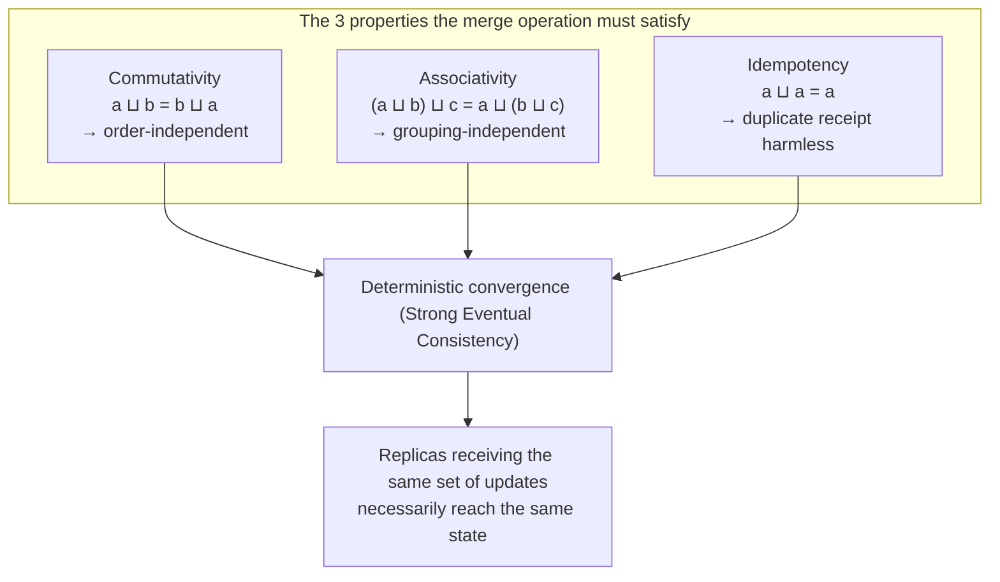
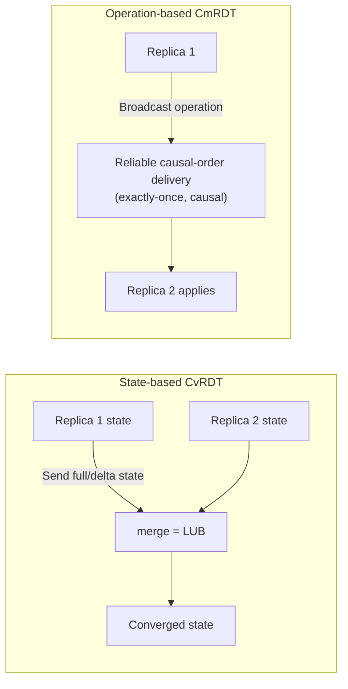
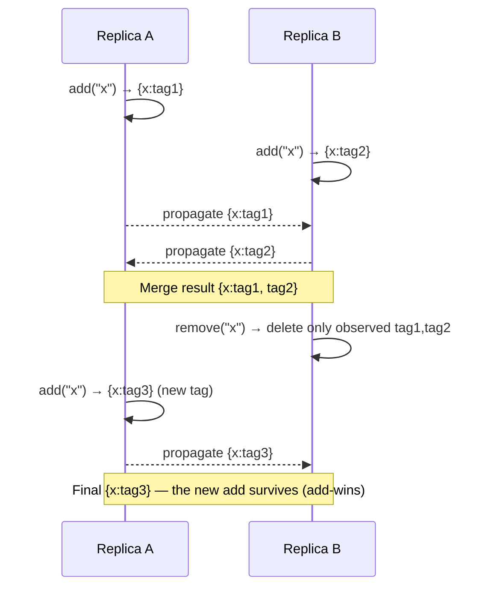

# CRDT (Conflict-free Replicated Data Type)

## 1. Overview

### A. Definition

> A **CRDT (Conflict-free Replicated Data Type)** is a replicated data structure designed so that even when multiple replicas independently perform updates and exchange each other's changes in arbitrary order, as long as the updates propagate to all replicas, they are guaranteed to **converge mathematically to an identical final state without a central coordinator or a consensus process (Strong Eventual Consistency, SEC)**.

CRDT is a concept organized by Marc Shapiro, Nuno Preguiça, and others in 2011, an algebra-based solution to the age-old challenge in distributed systems of "how can we guarantee consistency without nodes agreeing every time." Today it has become the core engine of distributed data stores such as Redis (Active-Active CRDB), Riak, and Azure Cosmos DB; real-time collaborative editors such as Figma, Google Docs, and Apple Notes; and local-first libraries such as Automerge and Yjs.

### B. Background and Necessity

In a distributed replicated environment, when multiple nodes modify the same data simultaneously, a **conflict** inevitably arises. Traditional solutions took two paths. One is **strong consensus** such as Paxos or Raft, obtaining the agreement of a majority of nodes on every write; this ensures consistency but requires a network round trip, causing high latency and forcing you to give up availability during a partition. The other is discarding one side by timestamp, as in "Last-Write-Wins (LWW)"; this is simple to implement but has the problem that **the earlier-written update is silently lost**.

As the CAP theorem states, as long as network partitions exist, you cannot perfectly obtain both consistency (C) and availability (A) at the same time. CRDT is an approach that, in this dilemma, **chooses availability and partition tolerance (AP) while recovering much of consistency in the form of Strong Eventual Consistency (SEC)**. The core idea is to algebraically design the merge operation to satisfy **commutativity, associativity, and idempotency**. When these three properties hold, the result is uniquely determined regardless of the arrival order, duplication, or delay of updates, so nodes can edit freely even offline—without waiting for or coordinating with one another—and merge automatically later. The reason data does not break even when two users edit the same sentence simultaneously in a collaborative editor lies precisely in this convergence guarantee.

### C. Key Characteristics

CRDT's characteristics condense into four. First, **coordination-free update**—no communication with other nodes is needed at write time, so latency is low and it works offline. Second, **deterministic convergence**—replicas that receive the same set of updates necessarily reach the same state regardless of merge order. Third, **partition tolerance**—even if the network is severed, each fragment serves independently and automatically merges upon recovery. Fourth, **automatic conflict resolution**—conflicts are not treated as errors but are deterministically absorbed by the data structure's merge rules. These characteristics are obtained at the cost of giving up strong invariant enforcement and immediate global consistency, so when adopting CRDT you must clearly recognize **what you gain and what you give up**.

## 2. The Mathematical Foundation of Convergence — Semilattice

The basis by which a CRDT guarantees "no conflicts" is that the state space forms a **join semilattice**, and the merge operation computes the **Least Upper Bound (LUB)** over it. In a semilattice, the merge operation ⊔ satisfies the following three properties.

Commutativity guarantees that the result is the same regardless of the order in which messages arrive; associativity, that the result is the same regardless of how they are grouped for merging; and idempotency, that the result does not change even if the same message is received multiple times (retransmission, duplication). When the three properties hold together, the state increases **monotonically** on the lattice, and replicas that evolved along different paths necessarily meet at the identical least upper bound on the lattice once they receive the same set of updates. This is the core proof of the CRDT claim that it "converges without consensus."

The practical implications of this algebraic property are large. Even if the network reorders, duplicates, or delays messages, and even if a node was offline for days and then returned, consistency is recovered as long as you simply flush the backlogged updates in any order. In other words, CRDT **demotes an unstable network from a precondition of correctness to a performance variable**.

One caveat, however, is that this guarantee is conditional on "**as long as it is delivered**." CRDT presupposes **eventual delivery**—that updates eventually reach all replicas—so it cannot rescue a forever-isolated replica or an update that is lost and never retransmitted. Therefore, in practice, a propagation layer that guarantees "eventual delivery," such as anti-entropy synchronization or periodic state exchange, is always designed together with CRDT.

## 3. Two Implementation Approaches — State-based (CvRDT) and Operation-based (CmRDT)

CRDTs divide into two families according to "what is exchanged" between replicas. One is **state-based (CvRDT)**, which exchanges the entire state (or a delta), and the other is **operation-based (CmRDT)**, which broadcasts individual operations. The two are theoretically inter-convertible, but their practical trade-offs in transmission volume, network assumptions, and implementation difficulty are distinct.

**State-based** has a replica periodically send its entire state to neighbors, and the receiver takes the least upper bound of the two states with the merge function. Because the merge is idempotent, commutative, and associative, it is **robust to message loss, duplication, and reordering**, and is safe even over loose propagation such as a gossip protocol. Its drawback is that sending the entire state is costly in transmission; the **Delta-state CRDT**, which sends only the changes, mitigates this and is adopted by Redis Active-Active and others.

**Operation-based** propagates only individual operations such as "add element" or "counter +1," so it is bandwidth-efficient. Instead, for correctness, it imposes a strong premise that the delivery layer must guarantee **exactly-once, causal-order delivery**, because if an operation is applied more than once (e.g., a counter increment twice), the result breaks. Real-time collaborative editors favor this family but also keep a log / version-vector mechanism that replays missed operations in order upon reconnection.

The practical criterion that separates the two approaches is **the balance between network assumptions and transmission volume**. On loose infrastructure where gossip and retransmission are routine (mobile, edge, P2P), the state-based approach, harmless to loss and duplication, is safe; in backend environments where a broker firmly guarantees order and delivery, the bandwidth-efficient operation-based approach is advantageous. For example, sending the entire state each time for a counter that 5 nodes update tens of thousands of times per second would be burdensome, but with a Delta-state CRDT sending only "the changed items' portions," you can cut transmission volume to a fraction while retaining the robustness of the state-based approach. Redis Active-Active adopted the delta-state approach precisely because of this balance point.

### A. Causality Tracking — The Role of the Version Vector

For a CRDT to distinguish a "concurrent" update from a "causally preceding (happens-before)" update, it must know the temporal order, but physical clocks cannot be trusted due to inter-node skew. So most CRDTs use a **version vector**—a collection of per-node logical counters—or a **dot** as the basis for merging. If the version vectors of two updates cannot contain each other, they are judged "concurrent" and merge rules (add-wins, multi-value preservation, etc.) are applied; if one contains the other, only the latest is kept.

This mechanism is the foundation of correctness but is at the same time **a source of metadata growth**. The more nodes there are, the longer the version vector becomes, and combined with the tags/tombstones of an OR-Set, the state bloats. Therefore, in practice, **lifecycle management of causality metadata**—such as periodically compacting stabilized dots or managing node identifiers as reusable short IDs—becomes an essential design element.

## 4. Representative CRDT Types and Behavior

The simplest example is the **G-Counter (Grow-only Counter)**. Each node keeps and increments its own counter, the total value is the sum of all nodes' portions, and merging takes the maximum of each entry. Because maximum is commutative, associative, and idempotent, convergence is guaranteed.

Concretely, suppose nodes A, B, and C tally likes. Each node holds a `{A:_, B:_, C:_}` vector and increments only its own entry. After A increments three times and B twice, if they exchange states, A holds `{A:3,B:0,C:0}` and B holds `{A:0,B:2,C:0}`. Because the merge is the per-entry maximum, combining the two states makes both `{A:3,B:2,C:0}`, and the total agrees at 5. Here, even if A's state arrives at B twice due to a network problem, thanks to the idempotency of the maximum operation the result does not change from `{A:3,...}`—this is the point where the property that **duplicate receipt is harmless** shows up in numbers. To support decrement as well, you use a **PN-Counter**, which bundles an increment G-Counter and a decrement G-Counter (total value = increment sum − decrement sum). Such counters are widely used for metric aggregation such as view counts, likes, and inventory, where **an accurate total is needed but momentary inconsistency is tolerated**.

The Set family is subtler. **G-Set** is simple because it allows only additions, but the moment deletion is supported, the problem arises of "what wins when an add and a delete happen simultaneously." **2P-Set** has the constraint that once an element is deleted it cannot be added again, and the widely used **OR-Set (Observed-Remove Set)** attaches a unique tag to each add so that a delete removes only "the observed tag," naturally implementing **add-wins** semantics.

Unpacking the design intent of OR-Set a bit more, a delete has the precise meaning not of "remove a particular element" but of "**invalidate the add-tags of this element that I have observed so far**." So if, while one node is propagating a deletion, another node adds the same element with a new tag, that new tag is not included in the deletion target, so the element survives. These add-wins semantics prevent, in collaborative editing, the counterintuitive data loss whereby "an item I just re-added disappears because of someone else's deletion." Conversely, for domains that need remove-wins there is a variant (remove-wins), so **choosing the win/lose rule that fits the business meaning** is the design point. Below is the flow of a simultaneous add/delete being merged in an OR-Set.

For text collaboration, a **sequence CRDT** (RGA, LSEQ, Logoot, Yjs's YATA, etc.) is used. Each character is given a **position identifier** that assigns a dense order, so that even if two users type at the same spot simultaneously, the insertion positions are deterministically ordered. The register family includes the **LWW-Register**, which keeps only one of the parallel writes by timestamp, and the **MV-Register (Multi-Value)**, which preserves all conflicting values and lets an upper layer resolve them.

These primitives combine to form more complex structures. Notably, the **OR-Map** places, as the value of each key, yet another CRDT (counter, set, register, nested map) and merges recursively per key. This lets an entire JSON document be represented as a single CRDT, so even if multiple users edit arbitrary fields of the document simultaneously in a collaborative app, they merge safely at the field level. The model of "JSON itself is a CRDT" that Automerge aims for is exactly the result of this recursive composition, and it is significant in that it elevates **the entire application state as a replication target**, beyond individual data types.

| Type | Representative CRDT | Merge rule (gist) | Main use |
|------|-----------|------------------|---------|
| Counter | G-Counter / PN-Counter | Per-node maximum · sum | View count · likes · inventory |
| Set | G-Set / 2P-Set / OR-Set | Union, tag-based deletion | Tags · cart · follows |
| Register | LWW-Register / MV-Register | Timestamp maximum / multi-value preservation | Settings · profile fields |
| Sequence | RGA / LSEQ / YATA | Ordering by position identifier | Collaborative docs · code editing |
| Map | OR-Map | Recursive merge of per-key sub-CRDTs | JSON docs · structured state |

## 5. Comparison — CRDT vs. Consensus (Raft/Paxos) vs. OT

To understand CRDT, you must point out why the differences with alternatives arise. **Strong consensus (Raft/Paxos)** requires majority agreement on every write, giving the strongest consistency, **linearizability**, but at the cost of a network round trip per write, and during a partition the minority stops writing. CRDT, by contrast, **writes immediately locally and merges later**, so it has no latency and allows offline editing, but replica states may differ temporarily (eventual consistency) and it **cannot enforce global invariants** such as "the balance can never go negative." So consensus fits places that need strong invariants, like a bank balance transfer, while CRDT fits places where availability comes first, like collaboration and aggregation.

It also contrasts with **OT (Operational Transformation, the early approach of Google Docs)**, a longtime competing technology for collaborative editors. OT "transforms" an operation relative to a counterpart operation to reconcile order, but the number of combinations of transform functions is large, making it complex to implement, and it usually presumes a **central server**. CRDT embeds order into the data structure itself so that it converges even without a server (P2P), which is advantageous for local-first architectures, but it has the weakness of **accumulating metadata** such as deletion tags and tombstones, using more memory. Indeed, this is why the choice diverges—Figma uses its own variant CRDT while Google Docs retains OT.

To summarize, the difference among the three technologies comes down to "when you pay the coordination cost." Consensus pays the coordination cost (network round trip, majority wait) **up front at write time** and buys strong consistency; OT pays the transformation cost **at runtime on a central server**; and CRDT nails down the merge rules algebraically **at data-structure design time**, eliminating runtime coordination. In return, CRDT carries throughout operations the burden of the metadata and semantic choices it took on at design time. No technology is absolutely superior; you must choose along the axes of **strength of consistency requirements, latency budget, offline necessity, and the team's implementation capability**.

## 6. Deep Dive — Practical Application Cases and Recent Trends

In practice, CRDT adoption is spreading rapidly. **Redis Enterprise's Active-Active (CRDB)** is a structure in which multiple geographically distant data centers each accept local writes and serve with low latency while converging via CRDT merge in the background; it is used for global sessions, shopping carts, and leaderboards. **Riak** provided counter, set, and map CRDTs as first-class data types from the early days, and **Azure Cosmos DB** offers LWW and custom merge as conflict-resolution options for multi-region writes. On the collaboration-tool side, **Figma** handles large-scale simultaneous editing, and **Linear, Notion-like** tools handle offline-then-merge editing on a CRDT basis.

The library ecosystem has also matured. In the JavaScript camp, **Yjs** provides high-performance document, array, map, and text CRDTs and has effectively become the standard in web collaborative editors, while **Automerge** treats an entire JSON document as a CRDT and even supports change history and undo. Early sequence CRDTs were criticized for a storage overhead several times the document size because metadata is attached to each character, but recent implementations have greatly lowered the overhead by bundling consecutive insertions into a single block and applying binary encoding. Two trends stand out recently. First, research into **compression and garbage collection to reduce the space overhead** caused by tombstone and tag metadata (e.g., tag cleanup for stabilized operations) is active. Second, combined with the **local-first software** movement, it is emerging as a foundational technology for an app architecture that works fully without a network and synchronizes automatically once connected.

Likely exam directions from the perspective of the professional engineer include: ① discuss the definition of CRDT and the SEC-guarantee principle (semilattice, the three properties); ② compare the difference between state-based and operation-based and the criteria for applying each; ③ explain CRDT's position within its relationship to CAP and consensus algorithms; ④ present considerations when applying CRDT in real-time collaboration / multi-region DB scenarios. Structuring the answer in the order "definition → convergence principle → types → comparison of alternatives → application strategy" secures both depth and structure.

## 7. Considerations and Implications

- **Selecting the application domain comes first.** CRDT suits data (aggregation, tags, document positions) where "automatically merging concurrent updates does not corrupt the meaning." It is unsuitable for domains that need strong global invariants, such as balances or inventory upper limits, so a hybrid design that **mixes CRDT (availability-first) and consensus (consistency-first) by data characteristic** is realistic.

- **Metadata/tombstone management is the core operational trade-off.** OR-Set and sequence CRDTs accumulate deletion and ordering information as tags, so memory and storage bloat over long-term operation. Strategies for **garbage collection, state compaction, and snapshots after judging the stabilization point** must be included at the design stage; neglecting this leads to performance degradation.

- **Semantic conflict remains the upper layer's job.** CRDT guarantees convergence at the data-structure level but cannot judge "when two people edited the same field differently, which value is correct for the business." You must design UX and policy so that conflicting values are preserved with an MV-Register and **the user or business rules do the final resolution**.

- **Clarify delivery-layer assumptions and observability.** Operation-based CRDTs presume exactly-once, causal-order delivery, so the reliability of the messaging infrastructure (broker, version vector) directly affects correctness. You must have an **observability** system (convergence metrics, replication lag, tag growth rate) to monitor merge lag and convergence, so as to catch failures early.

- **Standardization and interoperability are still developing.** Because the encoding and merge rules differ per CRDT implementation, compatibility between libraries is limited. When adopting a local-first architecture, evaluate the risk of **lock-in to a specific library** and secure data formats and migration paths in advance, which is important from a mid-to-long-term perspective.

- **Security and verification must be examined in parallel.** In P2P/offline merge structures, a malicious node could inject manipulated updates or forge tags, so you must place **signing, access control, and audit logging** on updates at the upper layer. Also, because the correctness of merge rules depends on algebraic properties, when designing a custom CRDT it is essential to verify commutativity, associativity, and idempotency with **property-based testing** to confirm that convergence actually holds.

## References

- Shapiro, Preguiça, Baquero, Zawirski, "Conflict-free Replicated Data Types", INRIA RR-7687, 2011. https://inria.hal.science/inria-00609399
- Redis Enterprise, "Active-Active geo-distributed Redis (CRDBs)". https://redis.io/docs/latest/operate/rs/databases/active-active/
- Yjs official documentation. https://docs.yjs.dev/
- Automerge official site. https://automerge.org/
- Kleppmann et al., "Local-first software". https://www.inkandswitch.com/local-first/

---

> **In one line**: A CRDT is a replicated data type that designs its merge operation to be commutative, associative, and idempotent so that all replicas are guaranteed to converge to the same state (SEC) without central consensus; it is widely used as an alternative to consensus algorithms in areas where availability and offline editing matter, such as real-time collaborative editing and multi-region data stores.
