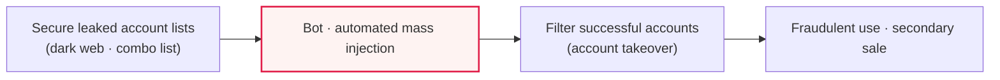
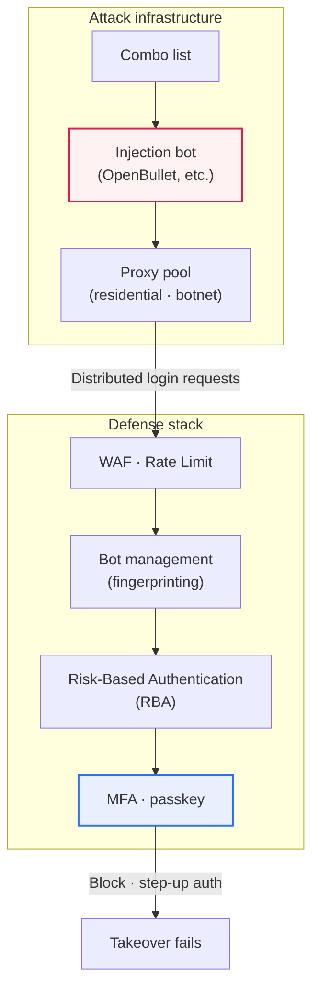

# Credential Stuffing

## 1. Overview

### A. Definition

> An attack that uses an **automation tool to inject account-password lists leaked from another site into many sites** and attempt to log in. It directly exploits users' habit of reusing the same password across many services.

The point where credential stuffing is essentially different from other authentication attacks is that '**the attacker starts already holding credentials that were once valid**.' If Brute Force or Dictionary Attack is a generative attack that 'manufactures a nonexistent password,' credential stuffing is a reuse-type attack that 'injects an already-existing candidate answer.' This difference changes the entire defense strategy. Generative attacks explode with failures, so they can be blocked with account lockout and complexity reinforcement, but in credential stuffing each attempt is 'a value that was once real,' so the failure rate itself is relatively low, and on success it immediately takes over the account.

Credential stuffing also creates a detection challenge in that it is '**hard to distinguish from normal logins**.' Each request is formally a perfectly valid login attempt, and the ID-password combination is identical to real user data. What the defender can see is not the correctness of an individual request but only the 'pattern' that a great many requests create. So defending against this attack comes down not to a single piece of authentication logic but to **an anomaly-detection problem that synthesizes behavior, environment, velocity, and distribution**.

Finally, the social fact that people's password reuse rate is very high makes this attack structurally viable. An account leaked from one site fairly often works on another site as well, and as a result a leak from one place spreads to every service the user has joined, causing a chain of **Account Takeover (ATO)**. The moment multiple services share a single secret—the password—the security level of each service converges to that of 'the weakest service.'

### B. Background and Necessity

As large-scale personal-data breaches recurred, billions of account records circulated on the dark web and underground forums. A market that organizes and sells leak lists formed, and as bot tools that automatically inject them (e.g., combo-stuffing tools of the Sentry MBA and OpenBullet families) became commercialized, the barrier to entry for attacks dropped dramatically. Whereas in the past you had to write sophisticated scripts yourself, now even a non-expert can carry out a large-scale attack with just a combo list (an ID:password list) and a configuration file for the target site.

The necessity from an enterprise perspective is also clear. Account takeover is not a mere login failure but leads directly to **theft of money, misappropriation of points, secondary leakage of personal data, and reputational damage**, and the harm is especially large in industries where the account itself is an asset, such as e-commerce, fintech, gaming, and OTT. Domestically as well, many commerce and portal services have repeatedly announced 'fraudulent login attempts using externally leaked accounts' and prompted forced password resets, which shows that credential stuffing is already an everyday threat.

## 2. Attack Flow and Stage-by-Stage Principles

Credential stuffing generally unfolds in four stages: 'collection → verification (injection) → filtering → exploitation.' Below is a structural diagram showing the attack's overall flow.

**First, in the collection stage**, the attacker secures a leak list (combo list). Data from several breaches is merged and deduplicated to build a large list of 'ID:password' pairs. At this stage, the 'expected number of successes,' accounting for the target site's user base and reuse rate, is effectively already determined. In other words, the efficiency of the attack is driven more by the freshness and quality of the leaked data than by the defensive technology.

**Second, in the verification (injection) stage**, bots send mass requests to the login API. The key evasion technique is **distribution**. The attacker scatters IPs into thousands to tens of thousands using proxies, botnets, and residential proxies; throttles the request rate to be human-like and slow (low-and-slow); and forges the User-Agent, headers, and browser fingerprints to blend in with normal traffic. The reason for distributing IPs is that mass attempts from a single IP get blocked, and because of this **simple IP-based blocking alone cannot stop it**. Residential proxies route through actual home IPs, so they even bypass reputation-based blocking.

**Third, in the filtering stage**, successful logins (valid accounts) are sifted out. Success/failure is distinguished by automatically analyzing differences in response codes, redirects, and body size, and for successful accounts, 'value'—such as balance, points, and the presence of linked payment methods—is sometimes automatically queried (Account Checking).

**Fourth, in the exploitation/sale stage**, money and points are siphoned off using the taken-over accounts, or the verified valid-account list is resold at a higher price. Because verified 'live accounts' trade at a much higher price than the original combo list, the injection itself becomes a profit business.

## 3. Attack Infrastructure and Evasion Mechanisms (Detailed Architecture)

To design a defense, you must structurally understand how the attacker evades detection. The diagram below shows the detailed architecture of the interaction among attacker, proxy, and defense stack.

The core of the attack infrastructure is '**three layers of disguise that impersonate normalcy**.' At the network layer, it hides the origin by distributing proxies; at the session layer, it mimics a browser by forging headers and fingerprints; and at the behavior layer, it imitates a human's rhythm by randomizing request intervals. This is why, if the defender looks at only one layer, it always appears normal.

So the defense stack is also built in layers. The outermost **WAF and Rate Limiting** are the first line of defense that filter out obvious mass traffic, but they let distributed, low-and-slow attacks through. Inside that, **Bot Management** identifies 'non-human clients' through device fingerprinting, JavaScript challenges, and behavioral analysis. Next, **Risk-Based Authentication (RBA)** computes a risk score for the login and requires step-up authentication only in suspicious cases, and the final line of defense, **MFA and passkeys**, blocks the login if the second factor is absent even when the password is correct. The reason for layering like this is that no single defense is complete on its own.

## 4. Comparison with Similar Attacks

Placing credential stuffing side by side with brute force makes it clear why the focus of defense differs. The table is merely a summary of the comparison; what matters is 'where' that difference originates.

| Category | Credential Stuffing | Brute Force |
|---|---|---|
| **Input** | Leaked real account lists | Generating random character combinations |
| **Success rate** | High (exploits reuse) | Low |
| **Detection difficulty** | Hard (looks like normal accounts) | Relatively easy (repeated failures) |
| **Defense focus** | Reuse blocking · MFA · bot detection | Account lockout · complexity |

The root of the difference lies in '**the source of the injection candidates**.' Brute force throws countless combinations that are highly likely not to exist, so failures concentrate on a specific account. Therefore the signal of 'repeated failures against one account' is clear, and account lockout or exponential backoff is effective. Credential stuffing, by contrast, tries 'only once or twice per account' but 'across millions of accounts,' so failures are not conspicuous when viewed per account. As a result, account lockout only leaves the side effect of locking out normal users while letting the attack pass right through.

The practical implication is that defense against credential stuffing must shift from '**the failure count of an individual account**' to '**the distribution and success pattern of the entire login traffic**.' For example, macro signals such as 'the usual login success rate is 60% but suddenly the failure rate spikes to 98% during a particular time window, and the regions of the successful accounts are abnormally widely distributed' become the key to detection. It must also be distinguished from Password Spraying (injecting a few common passwords against many accounts): whereas spraying is 'few passwords × many accounts,' stuffing differs in data source in that it is 'many valid pairs.'

### Reference: An Intuition for the Scale of Damage

To intuitively grasp the threat of credential stuffing, look at 'the arithmetic of the success rate.' By industry rule of thumb, the success rate of reuse-based injection is known to be roughly 0.1–2%, but the figure itself varies greatly with data freshness and target, so it should be viewed as a rough sense rather than a fixed value. Even so, the reason this seemingly low rate is dangerous is scale. For example, assuming a conservative success rate of 0.5%, injecting 1 million combos takes over about 5,000 valid accounts. Because attackers automatically inject tens of millions of records via bots, a low success rate translates into large-scale takeover. If the login API receives hundreds to thousands of attempts per second, in the absence of defense tens of thousands of accounts could be breached overnight. This 'small probability × large scale' structure explains why you must apply both deterrence (raising the cost of injection) and final blocking (MFA) at the same time.

## 5. Countermeasures

The fundamental defense against credential stuffing is '**not to rely on a password alone**.' Because even a leaked password is blocked at login if a second factor exists, **Multi-Factor Authentication (MFA)** and **passkeys (FIDO2/WebAuthn)** are the most effective. In particular, passkeys are public-key based, so no reusable secret is stored on the server, and they are phishing-resistant, fundamentally removing the attack surface of 'a password that could be reused.' On top of this, add, in layers, anomaly detection that catches abnormal login patterns and technology that filters out bots.

| Countermeasure | Content |
|---|---|
| **MFA · passkey** | Blocked by second factor even if password leaked (core) |
| **Anomaly detection** | Detect/block mass, abnormal-region, abnormal-velocity logins |
| **Bot prevention** | CAPTCHA, device fingerprinting, Rate Limiting |
| **Password policy** | Block leaked passwords (HIBP integration), prevent reuse |
| **Monitoring** | Watch dark-web leaked accounts · force reset |

Each countermeasure complements the others. If MFA and passkeys are the final line of defense, then bot prevention and Rate Limiting are 'deterrence' that raises the cost of the injection itself and lowers attack efficiency. Blocking leaked passwords (e.g., integrating Have I Been Pwned's Pwned Passwords) keeps users from setting an already-leaked password in the first place, cutting the reuse loop at the source. Dark-web monitoring detects leaks of one's own accounts early, enabling preemptive forced resets. The key is not to rely on any single one but to stack **Defense in Depth**—detection, deterrence, and final blocking—in layers.

## 6. Deep Dive: Risk-Based Authentication (RBA) and Recent Countermeasure Trends

Recently the central axis of authentication defense has been shifting to **Risk-Based Authentication (RBA)**. RBA does not require the same strength of authentication for every login but computes a login attempt's risk score in real time, so that **if risk is low, it passes without friction, and if high, it requires step-up authentication**. The scoring synthesizes the reputation of the source IP, geographic location and 'impossible travel' (a physically impossible movement between regions in a short time), device fingerprint, access time window, and past behavior patterns. This approach mitigates the trade-off between 'security' and 'UX' in that it precisely blocks only suspicious logins without harming normal users' convenience.

Standardization of defense technology has also advanced. FIDO2/WebAuthn-based passkeys interoperate across major platforms (Apple, Google, Microsoft) and are spreading rapidly, and standards such as **CAEP/SSF (Continuous Access Evaluation Protocol / Shared Signals Framework)**, which share authentication events across providers in real time, are emerging, evolving toward a direction where an account-risk signal detected at one service can be immediately reflected by another. In the bot-management area, frictionless challenges that operate in the background (e.g., Cloudflare Turnstile-like ones) are spreading to reduce CAPTCHA usability problems. However, the specific adoption status and detailed specifications of these latest standards and products change rapidly, so they must be re-confirmed against the latest documentation at actual application time.

## 7. Considerations and Implications (Professional Engineer's Perspective)

1. **MFA and passkeys are the fundamental countermeasure, and a paradigm shift in authentication is needed.** Moving away from reliance on the password as a single authentication factor is the surest way to neutralize credential stuffing. In the long run, transitioning to passkeys/FIDO2, which store no shared secret on the server, is the strategic direction, and this neutralizes not only credential stuffing but phishing as well.

2. **User habits and technical controls must go together.** Because education on not reusing passwords has clear limits, 'technical enforcement'—the service blocking leaked passwords (HIBP integration) and detecting abnormal logins—must go together. Design that does not leave security to users' goodwill is the key.

3. **Managing bot traffic on the login API is the front line of defense.** In response to IP-distributed, low-and-slow attacks, the approach of using device- and behavior-based detection and risk-based authentication to require step-up authentication only for suspicious logins is becoming the standard. Rate Limiting must be applied compositely at the account, IP, and global levels to reduce evasion.

4. **The balance between security and user experience (UX) determines the strategy's success.** Enforcing MFA and CAPTCHA indiscriminately raises churn, while removing all friction lets the defense be breached. Therefore, RBA-based 'adaptive authentication,' which imposes friction only on the small number of high-risk logins, is the strategic solution, optimizing cost, effect, and conversion rate together.

5. **Supply-chain and ecosystem-level responses are spreading.** Because a leak at one service spreads to the whole ecosystem, linking cross-provider risk-signal-sharing standards such as CAEP/SSF with dark-web monitoring—advancing toward a 'collective defense' system beyond individual-company defense—is the key axis of future connected technologies.

## References

- OWASP, "Credential Stuffing" — https://owasp.org/www-community/attacks/Credential_stuffing
- OWASP Cheat Sheet Series, "Credential Stuffing Prevention" — https://cheatsheetseries.owasp.org/cheatsheets/Credential_Stuffing_Prevention_Cheat_Sheet.html
- NIST SP 800-63B, "Digital Identity Guidelines: Authentication" — https://pages.nist.gov/800-63-3/sp800-63b.html
- Have I Been Pwned, "Pwned Passwords" — https://haveibeenpwned.com/Passwords

---

> **In one line**: Credential stuffing is an attack that *automatically injects leaked accounts* to exploit password reuse; each attempt looks like a normal login, making detection hard, and IP distribution bypasses simple blocking. The fundamental countermeasure is **to move away from sole reliance on the password using MFA and passkeys**, and the strategic direction is **Defense in Depth** that layers bot management, Risk-Based Authentication (RBA), and leaked-password blocking, together with cross-provider risk-signal sharing.
